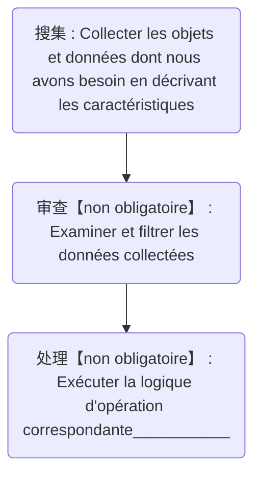

# Développement Unreal Engine 5 — Gestion du contenu procédural

Il est indéniable que le cœur de l'expérience de jeu réside toujours dans le contenu, ce qui est très proche du secteur du cinéma. Cependant, les processus de production du jeu et du cinéma présentent des différences significatives. Bien que le jeu offre une excellente rétroaction interactive permettant aux joueurs de s'engager profondément, la contrainte stricte des limites de calcul, comme une épée de Damoclès suspendue, restreint considérablement la production de contenu dans l'industrie du jeu.

Lors de la création de contenu, le secteur du cinéma peut, dans une certaine mesure, compter sur des investissements massifs en ressources humaines, matérielles et temporelles, adoptant un modèle de "force brute" — injecter des ressources énormes, accumuler des ressources et réaliser une production de contenu de haute qualité par une fabrication intensive.

Cependant, l'industrie du jeu a du mal à suivre cet exemple. En raison des limites de calcul, le jeu ne peut pas accumuler sans restriction les éléments de contenu, sinon cela entraînerait des problèmes tels que des ralentissements du jeu et une instabilité du fonctionnement, affectant gravement l'expérience des joueurs.

Par conséquent, résoudre les problèmes d'ingénierie avant la production de contenu dans l'industrie du jeu est particulièrement crucial. Seul en optimisant le processus d'ingénierie, en utilisant rationnellement les moyens techniques et en améliorant l'efficacité de l'utilisation des ressources, il est possible de réaliser une production de contenu de jeu de haute qualité et efficace dans des conditions de calcul limitées, répondant aux besoins croissants des joueurs.

## Technologies procédurales

Dans le passé, la procédure était principalement un concept axé par les développeurs, mais ces dernières années, avec l'accélération du processus d'industrialisation du jeu, elle a imperceptiblement pénétré tous les aspects de la production de contenu de jeu, comme des engrenages précis intégrés dans une machine massive, propulsant le fonctionnement global de manière efficace. Il ne fait aucun doute que la procédure est devenue un moteur clé pour améliorer la capacité de production de contenu de jeu, injectant une énergie源源不断 dans le développement de l'industrie du jeu.

L'essence de l'application de la [procédure (Procedural)](https://en.wikipedia.org/wiki/Procedural_generation) consiste à stocker le processus de résolution du problème en tant qu'actif de données, garantissant ainsi que le développement ultérieur peut s'appuyer sur ces données opérationnelles pour la réutilisation, l'itération, etc. (Conceptuellement, c'est un programme, mais c'est un programme à l'intérieur d'un programme).

Les applications actuelles de la procédure dans l'industrie du jeu sont principalement les suivantes :

- [ **Génération de contenu procédural** ](https://docs.unrealengine.com/5.2/en-US/procedural-content-generation-overview/)
- [ **Modélisation procédurale** ](https://en.wikipedia.org/wiki/Procedural_modeling)
- [ **Texture procédurale** ](https://en.wikipedia.org/wiki/Procedural_texture)
- [ **Animation procédurale** ](https://en.wikipedia.org/wiki/Procedural_animation)
- [ **Audio procédural** ](https://en.wikipedia.org/wiki/Synthetic_media)

Ces technologies ont en fait progressivement pénétré le quotidien de la fabrication d'actifs artistiques, et leur caractéristique distinctive est : **la fabrication d'actifs par programmation plutôt que par simple réglage de paramètres**.

Unreal Engine offre un excellent support procédural :

### Procedural Content Generation


**Procedural Content Generation** est un ensemble d'outils pour la PCG dans Unreal. Il fournit aux artistes techniques, designers et programmeurs la capacité de construire des outils rapides et itératifs ainsi que du contenu de toute complexité, allant des actifs (par exemple, la génération de bâtiments ou de biomes) à des mondes entiers.

Références associées :

- [Procedural Content Generation Overview | Unreal Engine 5.5 Documentation | Epic Developer Community](https://dev.epicgames.com/documentation/en-us/unreal-engine/procedural-content-generation-overview?application_version=5.5)
- [『UE5 PCG』Cours officiel en direct : Étude approfondie du projet d'environnement Electric Dreams](https://www.bilibili.com/video/BV1y8411U7Hs)
- [Electric Dreams PCG Technical Details (1) — Introduction aux termes, outils et graphiques](https://mp.weixin.qq.com/s/mGWiPKvWU_NHTktIWA6LnA)
- [Electric Dreams PCG Technical Details (2) — Ravins, grands Assembly](https://mp.weixin.qq.com/s/xHdnrFTkywF_7OjqOuALbw)
- [Electric Dreams PCG Technical Details (3) — Forêts, rochers et arrière-plan de scène](https://mp.weixin.qq.com/s/YWcd8l-VphNLrOlg3zkSzA)
- [Electric Dreams PCG Technical Details (4) — Vue lointaine, brouillard, nœuds personnalisés et sous-graphiques](https://mp.weixin.qq.com/s/CWTUcRIBTXw8WvhX3jrcBw)

### Meta Sounds


**Meta Sounds** prend en charge la personnalisation par l'utilisateur, l'extension par des tiers, la réutilisation de graphiques et fournit un outil puissant pour la conception sonore dans l'éditeur.

Références associées :

- [MetaSounds in Unreal Engine | Unreal Engine 5.5 Documentation | Epic Developer Community](https://dev.epicgames.com/documentation/en-us/unreal-engine/metasounds-in-unreal-engine?application_version=5.5)
- [Fondements de la programmation audio - Italink](https://italink.github.io/ModernGraphicsEngineGuide/04-UnrealEngine/7.%E9%9F%B3%E9%A2%91%E5%BC%80%E5%8F%91) 
- [Conférence lors de l'événement | Guide MetaSound pour débutants (sous-titres officiels)](https://www.bilibili.com/video/BV15G4y1A7B5)

### Geometry Script


**Geometry Script** fournit un ensemble d'API pour générer et éditer la géométrie de maillage à l'aide de Blueprints et de Python. Il permet d'écrire des scripts de géométrie (Geometry Scripting) et des actions sur les actifs (Asset Actions) dans les widgets utilitaires de l'éditeur (Editor Utility Widgets) pour créer des bibliothèques de fonctions d'analyse de maillage personnalisées, des outils de traitement et d'édition, et peut également être utilisé dans les Blueprints d'Actor pour créer des objets procéduraux et implémenter des requêtes géométriques complexes.

Références associées :

- [Introduction à la script de géométrie dans Unreal Engine | Documentation Unreal Engine 5.5 | Epic Developer Community](https://dev.epicgames.com/documentation/zh-cn/unreal-engine/introduction-to-geometry-scripting-in-unreal-engine?application_version=5.5)

### Animation Blueprints


Blueprint utilisé pour simuler ou contrôler un maillage squelettique dans le jeu. On peut mélanger des animations, ajuster le squelette et créer une logique pour définir la pose d'animation finale (Pose) utilisée à chaque frame.

Références associées :

- [Animation Blueprints in Unreal Engine | Unreal Engine 5.5 Documentation | Epic Developer Community](https://dev.epicgames.com/documentation/en-us/unreal-engine/animation-blueprints-in-unreal-engine?application_version=5.5)

### Material Blueprint


Blueprint utilisé pour définir les propriétés de surface des objets de scène. On peut utiliser diverses images (textures), des expressions de matériau basées sur des nœuds ainsi que les propriétés intrinsèques du matériau lui-même pour définir les propriétés de surface finales des objets de scène.

Références associées :

- [Unreal Engine Materials | Unreal Engine 5.5 Documentation | Epic Developer Community](https://dev.epicgames.com/documentation/en-us/unreal-engine/unreal-engine-materials?application_version=5.5)

### Texture Graph


**Texture Graph** fournit aux artistes une interface pour créer ou éditer des ressources de texture directement dans Unreal Engine, sans besoin de logiciels de retouche d'images externes. En utilisant un graphique de nœuds familier similaire à l'éditeur de matériaux, on peut connecter une série de nœuds à la texture de sortie.

Vous pouvez combiner des graphiques de texture avec des Blueprints, des matériaux et des fonctions de matériau pour obtenir des flux de travail uniques uniquement réalisables dans Unreal Engine.

On peut faire beaucoup d'applications intéressantes avec Texture Graph, par exemple, l'auteur l'a récemment utilisé pour :

- **Modifier des images** : Pour le développement, la liberté de coder est bien plus élevée que les opérations de l'éditeur.

    

- **Fabriquer des matériaux UI** : Le système UI d'Unreal ne prend pas en charge des effets d'interface complexes, tels que le flou des bords (Blur), l'ombre portée (DropShadow), le néomorphisme (Neumorphism)... Cela est dû au fait que l'UI n'est qu'une petite partie du contenu graphique global, avec un budget limité, et l'utilisation de ces caractéristiques nécessite une structure de rendu plus complexe. Mais grâce à Texture Graph, on peut générer les images de matériaux nécessaires pour ces effets, et avec quelques extensions simples de l'éditeur, ce flux de travail sera très fluide.
- **Générer des références stylisées** : On peut étendre Texture Graph avec un nœud d'appel AI, permettant ainsi au contenu graphique natif d'Unreal Engine de réaliser facilement des références stylisées avec l'aide de l'IA. Par exemple, l'auteur l'a utilisé pour générer :
    - Des images Splash et des vignettes lors du démarrage et du chargement du moteur pour le contenu du projet
    - Une carte mini stylisée dynamiquement pour la scène en combinaison avec Scene Capture
    - Des pages de chargement stylisées pour certaines scènes
    - ...

Références associées :

- [Getting Started with Texture Graph | Epic Developer Community](https://dev.epicgames.com/community/learning/tutorials/z0VJ/unreal-engine-getting-started-with-texture-graph)
- [[Live en chinois] Épisode 51 | Nouvelle fonction UE5.4 : TextureGraph | Zhu Changsheng (Tianzhichuan)](https://www.bilibili.com/video/BV1As421M7Bj/)
- [Introduction à Texture Graph UE5.4 CG World](https://m.163.com/dy/article/J56TPVL50516BJGJ.html)
- [Nouvelle fonction UE5.4 - Introduction à Texture Graph | CSDN | Nuage électronique et entanglement à longue portée](https://blog.csdn.net/grayrail/article/details/140191905)
- [UE5.4TextureGraph | GALAXIX Anime Continent](https://www.bilibili.com/video/BV1FM4m1o7LE)

## Gestion du contenu procédural

Les applications des technologies procédurales mentionnées ci-dessus nous ont dotés d'une efficacité de création sans précédent. Par rapport au passé, nous pouvons maintenant produire un contenu de jeu plus riche en moins de temps et avec un budget réduit. Cela améliore non seulement significativement l'efficacité du développement, mais élargit également les frontières du contenu de jeu, offrant aux joueurs une expérience plus diversifiée.

Cependant, tout a deux côtés. Une production plus importante de contenu signifie également que le coût de gestion augmentera de manière exponentielle. De la gestion des actifs et du contrôle de version au test et à l'itération de mise à jour, chaque étape nécessite des investissements supplémentaires en ressources humaines, matérielles et temporelles pour garantir que le vaste système de contenu fonctionne de manière ordonnée, sans aucun chaos ou erreur.

L'auteur a beaucoup recommandé l'utilisation de la technologie PCG lors de la construction de scènes précédemment, car intégrer une pipeline de génération est certainement plus facile à itérer et à optimiser.

Mais en réalité, l'application de la PCG dans l'industrie actuelle reste assez idéalisée, et les scénarios d'application réellement déployables ne sont pas nombreux.

Une des grandes raisons en est que la PCG n'est pas "pratique". Actuellement, la division des responsabilités des postes de conception de scène dans la plupart des équipes de production de jeu est généralement la suivante :

- **Game Designer** : Responsable de la planification du cadre global de la scène de jeu, y compris la fonction de la scène, l'arrière-plan de l'histoire, la positionnement du style, le flux d'expérience des joueurs dans la scène, etc., fournissant une direction claire et un document de besoins pour la conception de scène.
- **Concept Artist** : Selon les besoins du designer, effectue la conception de concept de la scène, dessinant des esquisses de concept de style global, ambiance, forme générale des bâtiments principaux et du terrain, etc., par des techniques de dessin à la main ou de peinture numérique, fournissant une référence visuelle pour la conception détaillée ultérieure.
- **Scene Concept Artist** : Sur la base de la conception de concept, effectue la conception détaillée des éléments spécifiques de la scène, y compris la structure des bâtiments, les détails de décoration, les variations de relief du terrain, le style de la végétation et des accessoires, etc., présentant les détails de forme, couleur, matériau de chaque élément sous forme de peinture précise, fournissant un plan de fabrication précis pour le modélisateur.
- **3D Modélisateur** : Utilise des logiciels de modélisation 3D pour construire les éléments de scène conçus en modèles 3D selon les concepts de scène, y compris la construction du cadre de base des bâtiments, terrains, accessoires, etc., leur attribuant un volume et une sensation spatiale, et effectuant un fractionnement initial des UV pour préparer le retouche de texture ultérieure.
- **Material & Lighting Artist** : Ajoute des matériaux et des textures aux modèles 3D pour simuler la texture réelle des objets, tels que la texture du bois, le brillant du métal, la rugosité de la pierre, etc. En même temps, responsable de la configuration des effets d'éclairage dans la scène, créant différentes ambiances et effets de lumière et d'ombre, renforçant la réalisme et l'impact visuel de la scène.
- **Scene Sound Designer** : Responsable de la création, la sélection et l'ajout de effets sonores appropriés pour la scène, concevant des effets sonores selon le thème, l'émotion, l'ambiance de la scène, etc., par des opérations de采集, édition et mixage, afin que les effets sonores fusionnent parfaitement avec la scène, renforçant l'immersion de la scène.
- **VFX Artist** : Selon les besoins de la scène, concevant et fabriquant divers effets spéciaux, tels que le feu, la fumée, l'eau, les effets magiques, etc., ajoutant de la vivacité et de l'intérêt à la scène, améliorant l'immersion des joueurs.
- **Level Designer** : Principalement responsable de la disposition et de la planification de la scène, selon le gameplay et les exigences du designer, arrangeant rationnellement la position des monstres, accessoires, points de mission, obstacles et autres éléments dans la scène, concevant la route de progression des joueurs et la courbe de difficulté du niveau, garantissant que les joueurs obtiennent une bonne expérience de jeu dans la scène.
- **Scene Optimizer** : Effectue l'optimisation des performances de la scène déjà fabriquée, réduisant l'occupation des ressources matérielles de la scène par des moyens tels que la réduction du nombre de faces du modèle, la compression de texture, la configuration rationnelle du baking de lumière, améliorant l'efficacité de fonctionnement du jeu et garantissant un fonctionnement fluide sur différents appareils.

Au cours du processus de conception de scène, une communication étroite et une itération fréquente entre les postes ci-dessus sont généralement nécessaires pour terminer la livraison finale.

La raison d'utiliser la PCG est que, après avoir considérablement amélioré la capacité de production des matières premières de contenu (modèles, matériaux, effets spéciaux, effets sonores...), l'équipe de jeu a également besoin d'un moyen efficace pour terminer la construction de scène, tout en tenant compte du problème d'optimisation des performances.

Mais en raison de la complexité de la conception de la pipeline PCG, la collaboration multijoueurs est très, très, très difficile. Dans un projet réel, il peut être nécessaire d'un TA de haut niveau pour écrire la logique PCG, qui doit non seulement maîtriser le processus de fabrication artistique, superviser la normativité des matières premières, mais aussi tenir compte des besoins du game designer, répondre aux changements en temps opportun, et comprendre le bas niveau du moteur pour définir la stratégie d'optimisation des performances.


Selon les [informations pertinentes](https://forum.quartertothree.com/t/the-matrix-awakens-an-unreal-engine-5-experience/154271/67), pendant le développement de l'exemple *The Matrix: Awakens* d'Unreal Engine, environ `20-30` personnes étaient responsables du traitement des actifs, et l'équipe entière comptait `50-70` membres du personnel. C'est sans aucun doute une prouesse absolue.

Dans cet exemple, nous pouvons voir le potentiel énorme de la PCG : "facilement" construire une ville aussi grandiose.

Et la raison pour laquelle le déploiement de la PCG est difficile peut être directement attribuée au fait que beaucoup d'équipes ont du mal à avoir une qualité d'équipe comparable à celle d'Epic.

Deuxièmement, l'objectif de la PCG est de résumer et de synthétiser une pipeline de production itérable durable, mais pour un produit de jeu, ce qui attire les joueurs, ce sont toujours le contenu et la créativité, qui sont nécessairement imaginatifs.

Dans une équipe de projet spécifique, la PCG peut concentrer les responsabilités de plusieurs postes. Elle a des avantages, comme pouvoir répondre rapidement aux itérations, mais aussi des inconvénients, limitant la发挥 créative des personnes de différents domaines, affectant ainsi la qualité du contenu et la capacité de production.

Contrairement à la PCG, la gestion du contenu procédural ressemble plus à un post-traitement :

- Visant à rendre l'organisation du contenu convergente par des moyens procéduraux.

Par conséquent, cet article ne se concentre pas sur la présentation de ces technologies de pointe高深莫测, mais se focalise sur la梳理 et l'intégration d'une série de moyens procéduraux courants pour gérer les **objets (Object)**, **actifs (Asset)** et **mondes (World)** dans Unreal Engine au cours de la production de contenu de jeu actuelle.

Et la raison d'utiliser des moyens procéduraux pour gérer le contenu, en bref, est :

- Certaines opérations qui semblent très "intuitive" sont tout simplement difficiles à réaliser au niveau de l'éditeur.

Cette窘境 peut être illustrée par un court dialogue :

>A : Connais-tu l'éléphant ?
>
>B : Bien sûr que oui.
>
>A : Je suis très curieux de sa apparence, peux-tu le dessiner ?
>
>B : Désolé, je ne sais pas dessiner, donc je ne peux pas~

Et le but de la procédure est que nous ne traitons pas directement l'objectif spécifique, mais décrivons ce que nous voulons faire par des caractéristiques, ce qui rend l'entrée et le processus de l'opération弹性. Cela équivaut à donner une réponse comme celle-ci :

> B : Désolé, bien que je ne puisse pas dessiner l'éléphant, je peux te dire qu'il est特别高大, avec un corps gris, quatre jambes又粗又壮, des grandes oreilles comme des éventails, un long nez capable de enrouler des choses, et deux dents又尖又长. Plus tard, tu le reconnaîtras d'un coup d'œil quand tu le verras~

Pour un projet de jeu, certains éditeurs lourds liés à la fabrication de contenu nécessitent généralement un développement par des personnes professionnelles ou une委托, mais en plus de cela, il existe également un grand nombre de **micro-besoins**琐碎 au cours de la fabrication de contenu de jeu. Bien qu'il ne soit pas nécessaire de dédier des personnes professionnelles à développer des outils d'éditeur pour ces besoins, ces tâches seront difficiles à accomplir sans l'aide d'outils d'éditeur, par exemple :

- Selon la zone de coordonnées `[X0,Y0 - X1,Y1]`, sélectionner tous les Actors de cette zone et exporter en sous-niveau pour tester localement
- Filtrer toutes les sources de lumière avec ombre activée dans la scène et vérifier la rationalité de leurs ombres
- Vue d'ensemble de tous les composants de maillage, et attribuer批量 une stratégie LOD de lumière et d'exclusion aux composants selon la taille de la boîte englobante et d'autres caractéristiques
- Vue d'ensemble de la taille de la boîte englobante de tous les effets spéciaux de la scène et rechercher les éléments异常 de la boîte englobante des effets spéciaux
- Ajuster批量 les propriétés spécifiques des composants, telles que la transformation de déplacement, l'activation/désactivation de la lumière, la stratégie physique, les propriétés de rendu...
- Modifier批量 l'activation/désactivation de certaines propriétés des actifs
- Filtrer批量 les Actors avec des caractéristiques spécifiques et leur attribuer une mise en évidence
- Collecter tous les modèles statiques `SM_BigTree0001` dans la scène et les remplacer批量 par le Blueprint encapsulé `BP_BigTree0001`, qui fournit en plus au modèle d'arbre un composant d'effet de particules de feuilles tombant et un composant de son de feuilles frottant
- Envoyer批量 des rayons dans une zone pour échantillonner la scène et enregistrer les données de scène obtenues par la détection de rayons pour fabriquer des effets spéciaux
- Prévisualiser批量, trier, rechercher et éditer la propriété `Disallow Nanite` du `StaticMeshComponent` de tous les `StaticMeshActor` dans la scène
- Fusionner automatiquement les maillages statiques d'une zone en un composant de maillage statique instancié hiérarchiquement
- ...

Ces besoins apparaissent généralement fréquemment au cours de l'édition de carte, la gestion de scène, la gestion d'actifs et l'optimisation des performances. Dans les projets de jeu de petite taille, comme le contenu est accumulé progressivement, on a généralement l'attitude de "si ça ne marche pas, on coupe", et il ne se produit généralement pas de grands problèmes. Mais dans les projets de jeu de grande taille, les relations entre les contenus sont complexes. Bien que la technologie PCG puisse atténuer une partie de la pression, si ces micro-besoins ne sont pas résolus及时妥善, la gestion du contenu est également très susceptible de perdre le contrôle :


- The Witcher 3 - Pipeline d'optimisation du contenu du monde ouvert : https://www.youtube.com/watch?v=p8CMYD_5gE8

## Plugin de traitement du contenu procédural

Unreal Engine est sans aucun doute le moteur de jeu le plus puissant et le plus通用 actuellement, ce qui est largement dû à sa conception de structure core excellente. Puisque notre objectif est de gérer efficacement le contenu dans Unreal Engine par des moyens procéduraux, il est particulièrement nécessaire et important de comprendre profondément son architecture système.

Étant donné que le développement de cette partie occuperait beaucoup d'espace, l'auteur a mis à jour certaines parties du [document](https://zhuanlan.zhihu.com/p/636151878) de la structure de base précédente selon les points de attention actuels. Si vous êtes intéressé par plus de détails, il y a beaucoup d'excellentes articles d'analyse en ligne :

- Architecture core : [InsideUE - Dazhao](https://zhuanlan.zhihu.com/p/22813908)
- Système de rendu : [Blog Park -向往 | Analyse du système de rendu Unreal ](https://www.cnblogs.com/timlly/p/13512787.html)
- Gestion des actifs : [Zhihu - Gestion des ressources UE4](https://zhuanlan.zhihu.com/p/357904199)

De plus, il faut rappeler que sans une norme de projet appropriée, même Dieu aurait du mal à faire quelque chose :

- Guide de normes Unreal Engine : https://github.com/thejinchao/ue5-style-guide

Le traitement du contenu procédural peut généralement être résumé en trois étapes de base :



En réponse au flux ci-dessus, l'auteur a construit un cadre d'éditeur simple et compact ( **ProceduralContentProcessor** ) pour accomplir ces étapes. En tant que boîte à outils, il peut facilement dériver et étendre des outils d'éditeur de structure unifiée. Le dépôt Github du plugin est :

- https://github.com/Italink/ProceduralContentProcessor

Les sections suivantes décriront les étapes de traitement spécifiques de chaque phase sur la base de ce plugin.

Après avoir placé le plugin dans le répertoire `Plugins` du projet, vous pouvez trouver le `Mode du processeur de contenu procédural` dans le mode d'éditeur de l'éditeur de niveau :


**Procedural Content Processor** fournit trois actifs Blueprint disponibles, et vous pouvez dériver des Blueprints pour étendre votre propre mode d'éditeur :

- **ProceduralAssetProcessor** : Utilisé pour écrire des outils d'éditeur liés à l'opération des **actifs (Asset)**
- **ProceduralWorldProcessor** : Utilisé pour écrire des outils d'éditeur liés au traitement des **niveaux (World)**
- **ProceduralActorColorationProcessor** : Utilisé pour écrire des stratégies de coloration de débogage des Actors.


### Utilisation de base

**Procedural Content Processor** lui-même ne fournit pas beaucoup de mécanismes complexes, il s'appuie principalement sur les fonctionnalités natives du moteur.

Un point clé est :

- Les fonctions Blueprint cochées **CallInEditor (Appeler dans l'éditeur)** (ou les fonctions C++ avec l'identifiant `CallInEditor` dans `UFUNCTION`) généreront un bouton correspondant dans le panneau de détails de l'objet. En cliquant sur ce bouton, la logique de la fonction correspondante sera exécutée :


À partir de ce point, nous pouvons facilement écrire un grand nombre d'outils d'éditeur.

Certaines options dans les `Paramètres de classe` du Blueprint du processeur de contenu procédural affecteront l'affichage de l'outline de l'éditeur :

- **Sort Priority** : Priorité de tri, affectant le tri de la boîte de sélection dans l'outline de l'éditeur.
- **Document Hyperlink** : Lien du document du processeur. Cliquez sur le bouton 【?】 dans l'outline de l'éditeur pour ouvrir l'URL correspondante.
- **Override UMGClass** : Utiliser un contrôle UMG à la place du panneau de détails par défaut, généralement utilisé pour personnaliser l'UI de l'éditeur.
- **Nom d'affichage Blueprint** : Nom réel du processeur dans l'outline de l'éditeur.
- **Description Blueprint** : Information de提示 du processeur dans l'outline de l'éditeur.
- **Espace de noms Blueprint** : Classification du processeur dans l'outline de l'éditeur. Les classifications multi-niveaux sont séparées par des points.


Certaines configurations dans les propriétés Blueprint affecteront le panneau de détails :

- **Instance éditable** : Seules les propriétés cochées comme instance éditable peuvent être éditées dans le panneau de détails de l'objet, sinon seule la valeur par défaut peut être modifiée dans l'éditeur Blueprint.
- **Blueprint en lecture seule** : Si coché, la propriété deviendra non éditable, mais sera prévisualisée.
- **Variable de configuration** : Si coché, la valeur de la propriété sera stockée dans le fichier de configuration, et la configuration précédente sera lue lors du prochain démarrage du processeur.


> Au cours de la fabrication de l'éditeur, certaines identifications de propriété et métadonnées sont très utiles, mais elles ne sont pas公开 à l'éditeur Blueprint. Ici, un plugin est recommandé : https://github.com/DoubleDeez/MDMetaDataEditor

Le processeur de contenu procédural possède quatre fonctions d'événement de base qui peuvent être surchargées :

- `void Activate()` : Appelé lorsque le processeur est activé.
- `void Tick(DeltaTime)` : Appelé à chaque frame après l'activation du processeur.
- `void Deactivate()` : Appelé lorsque le processeur est quitté.
- `void PostEditChangeProperty(PropertyName)` : Appelé lorsque la propriété du processeur est modifiée.


Pour C++, vous pouvez surcharger les fonctions suivantes pour personnaliser profondément l'éditeur :

- `virtual TSharedPtr<SWidget> BuildWidget()`

Le panneau de détails d'UE est très puissant. Nous pouvons rapidement construire un éditeur simple et facile à utiliser simplement par le biais de **propriétés + fonctions** :


### Collecte

#### Niveau

Pour **ProceduralWorldProcessor**, vous pouvez appeler la fonction `GetAll...()` dans la fonction de l'éditeur pour collecter les Actors :


#### Actifs

Pour **ProceduralAssetProcessor**, vous pouvez appeler la fonction `GetAllAssetRegistry()` dans la fonction de l'éditeur pour obtenir le registre des actifs, permettant ainsi de manipuler les actifs.


### Examens

#### Coloration des Actors

Le plugin fournit également un type d'actif — **ProceduralActorColorationProcessor**

Comparé à **ProceduralWorldProcessor**, il possède une fonction d'événement supplémentaire `FLinearColor Colour(const UPrimitiveComponent* PrimitiveComponent)`, que vous pouvez surcharger pour colorer en mode débogage tous les composants primitifs de la scène actuelle :

> Nécessite une version du moteur >=5.4


#### Matrice de propriétés des objets

Dans Unreal Engine, l'officiel fournit une fonction de **matrice de propriétés** pour modifier批量 certaines propriétés des actifs :


**Procedural Content Processor** prend en charge la construction de manière procédurale d'une matrice d'édition de propriétés pour n'importe quel objet (UObject) sur la base de celle-ci.

Nous n'avons qu'à ajouter une variable membre de type **Procedural Object Matrix** dans le Blueprint :


Appelez l'interface suivante dans la fonction de l'éditeur pour construire la matrice de propriétés des objets, qui sera affichée dans le panneau de détails de l'objet :

- `void ClearObjectMaterix()` : Nettoyer la matrice d'objets
- `void AddTextField(Owner, FieldName, FieldValue)` : Ajouter un texte de prévisualisation simple, ce qui signifie que la ligne `{Owner}` et la colonne `{FieldName}` seront remplies avec `{FieldValue}`
- `void AddPropertyField(Owner，PropertyName)` : Ajouter un éditeur de propriété, ce qui signifie que la ligne `{Owner}` et la colonne `{PropertyName}` seront remplies avec l'éditeur de la propriété `PropertyName` de l'objet `Owner`.
- `void AddPropertyFieldBySecondaryObject(Owner，SecondaryObject，SecondaryObjectPropertyName)` : Ajouter un éditeur de propriété, ce qui signifie que la ligne `{Owner}` et la colonne `{SecondaryObjectPropertyName}` seront remplies avec l'éditeur de la propriété `SecondaryObjectPropertyName` de l'objet `SecondaryObject`.


Voici un exemple d'utilisation dans le moteur :


#### Vue de détails des objets

Le panneau de détails d'Unreal peut facilement éditer les propriétés de n'importe quel UObject :


Mais il nécessite généralement de sélectionner explicitement l'objet. Le plugin fournit une fonction Blueprint pour afficher le panneau de propriétés de n'importe quel objet :

- `void ShowObjectDetailsView(UObject* InObject)`

Ainsi, vous pouvez facilement ajuster les propriétés de certains objets, tels que l'UI, les sous-objets à l'exécution, les objets temporaires, etc.


#### Éditeur d'objets

Utilisez la fonction Blueprint suivante pour ouvrir l'éditeur correspondant à l'objet :

-  `void ShowObjectEditor(UObject* InObject)`

### Traitement

Pour le traitement des données, il faut implémenter spécifiquement en fonction des besoins métier réels. Jusqu'à présent, **UProceduralContentProcessorLibrary** contient les interfaces suivantes. Si nécessaire, vous pouvez les ajouter vous-même :

#### Opérations sur les objets

```C++
static TArray<UObject*> GetAllObjectsOfClass(UClass* Class, bool bIncludeDerivedClasses = true);

static TArray<UObject*> GetAllObjectsWithOuter(UObject* Outer, bool bIncludeNestedObjects = true);

static TArray<UClass*> GetAllDerivedClasses(const UClass* ClassToLookFor, bool bRecursive);

static UObject* DuplicateObject(UObject* SourceObject, UObject* Outer);

static int32 DeleteObjects(const TArray< UObject* >& ObjectsToDelete, bool bShowConfirmation = true, bool bAllowCancelDuringDelete = true);

static int32 DeleteObjectsUnchecked(const TArray< UObject* >& ObjectsToDelete);

static void ConsolidateObjects(UObject* ObjectToConsolidateTo, UPARAM(ref) TArray<UObject*>& ObjectsToConsolidate, bool bShowDeleteConfirmation = true);

static TSet<UObject*> GetAssetReferences(UObject* Object, const TArray<UClass*>& IgnoreClasses, bool bIncludeDefaultRefs = false);

static bool IsGeneratedByBlueprint(UObject* InObject);

static void ShowObjectDetailsView(UObject* InObject);

static void ShowObjectEditor(UObject* InObject);

static UObject* CopyProperties(UObject* SourceObject, UObject* TargetObject);

static void ForceReplaceReferences(UObject* SourceObjects, UObject* TargetObject);

static void SetObjectPropertyByName(UObject* Object, FName PropertyName, const int& Value);
DECLARE_FUNCTION(execSetObjectPropertyByName);
```

#### Opérations sur les actifs


```C++
static bool ObjectIsAsset(const UObject* InObject);

static UBlueprint* GetBlueprint(UObject* InObject);

static bool IsNaniteEnable(UStaticMesh* InMesh);

static void SetNaniteMeshEnabled(UStaticMesh* InMesh, bool bEnabled);

static bool IsMaterialHasTimeNode(AStaticMeshActor* InActor);

static bool MatchString(FString InString,const TArray<FString>& IncludeList, const TArray<FString>& ExcludeList);

static float GetStaticMeshDiskSize(UStaticMesh* StaticMesh, bool bWithTexture = true);

static UStaticMesh* GetComplexCollisionMesh(UStaticMesh* InMesh);

static void SetStaticMeshPivot(UStaticMesh* InStaticMesh, EStaticMeshPivotType PivotType);

static UStaticMeshEditorSubsystem* GetStaticMeshEditorSubsystem();

static float GetLodScreenSize(UStaticMesh* InStaticMesh, int32 LODIndex);

static float GetLodDistance(UStaticMesh* InStaticMesh, int32 LODIndex);

static float CalcLodDistance(float ObjectSphereRadius, float ScreenSize);

static float CalcScreenSize(float ObjectSphereRadius, float Distance);

static float CalcObjectSphereRadius(float ScreenSize, float Distance);

static UTexture2D* ConstructTexture2D(UTextureRenderTarget2D* TextureRenderTarget2D, UObject* Outer, FString Name, TextureCompressionSettings CompressionSettings = TC_Default);

static UTexture2D* ConstructTexture2DByRegion(UTextureRenderTarget2D* TextureRenderTarget2D, FBox2D Region , UObject* Outer, FString Name, TextureCompressionSettings CompressionSettings = TC_Default);

static void UpdateTexture2D(UTextureRenderTarget2D* TextureRenderTarget2D, UTexture2D* Texture);

static FNiagaraSystemInfo GetNiagaraSystemInformation(UNiagaraSystem * InNaigaraSystem);

static FVector2D ProjectWorldToScreen(const FVector& InWorldPos, bool bClampToScreenRectangle);

static bool DeprojectScreenToWorld(const FVector2D& InScreenPos, FVector& OutWorldOrigin, FVector& OutWorldDirection);

static UPhysicalMaterial* GetSimplePhysicalMaterial(UPrimitiveComponent* Component);
```

#### Opérations sur les Actors

```C++
static TArray<AActor*> BreakISM(AActor* InISMActor, bool bDestorySourceActor = true);

static AActor* MergeISM(TArray<AActor*> InSourceActors, TSubclassOf<UInstancedStaticMeshComponent> InISMClass, bool bDestorySourceActor = true);

static void SetHLODLayer(AActor* InActor, UHLODLayer *InHLODLayer);

static void SelectActor(AActor* InActor);

static void LookAtActor(AActor* InActor);

static AActor* SpawnTransientActor(UObject* WorldContextObject, TSubclassOf<AActor> Class, FTransform Transform);

static AActor* ReplaceActor(AActor* InSrc, TSubclassOf<AActor> InDst, bool bNoteSelectionChange = false);

static void ReplaceActors(TMap<AActor*, TSubclassOf<AActor>> ActorMap, bool bNoteSelectionChange);

static void ActorSetIsSpatiallyLoaded(AActor* Actor, bool bIsSpatiallyLoaded);

static bool ActorAddDataLayer(AActor* Actor, UDataLayerAsset* DataLayerAsset);

static bool ActorRemoveDataLayer(AActor* Actor, UDataLayerAsset* DataLayerAsset);

static bool ActorContainsDataLayer(AActor* Actor, UDataLayerAsset* DataLayerAsset);

static FName ActorGetRuntimeGrid(AActor* Actor);

static void ActorSetRuntimeGrid(AActor* Actor, FName GridName);
```

#### Interfaces de l'éditeur

``` c++
static void BeginTransaction(FText Text);

static void ModifyObject(UObject* Object);

static void EndTransaction();

static UUserWidget* AddDialog(UObject* Outer, TSubclassOf<UUserWidget> WidgetClass, FText WindowTitle = INVTEXT("Dialog"), FVector2D DialogSize = FVector2D(400, 300), bool IsModalWindow = true);

static EMsgBoxReturnType AddMessageBox(EMsgBoxType Type, FText Msg);

static UUserWidget* AddContextMenu(UUserWidget* ParentWidget, TSubclassOf<UUserWidget> WidgetClass, FVector2D SummonLocation = FVector2D::ZeroVector);

static void DismissAllMenus();

static void AddNotification(FText Notification, float FadeInDuration = 2, float ExpireDuration = 2, float FadeOutDuration = 2);

static void AddNotificationWithButton(FText Notification, UObject* Object, TArray<FName> FunctionNames);

static void PushSlowTask(FText TaskName, float AmountOfWork);

static void EnterSlowTaskProgressFrame(float ExpectedWorkThisFrame = 1.f, const FText& Text = FText());

static void PopSlowTask();

static void ClearAllSlowTask();
```

### Exemples

Actuellement, le plugin fournit déjà quelques exemples simples de référence :


**Function Test** : Test des interfaces

- ISM Merge and Break : Test de l'interface de décomposition et de fusion ISM
- Actor Replace : Test de l'interface de remplacement d'Actor

**Custom Debug View** : Vue de débogage post-traitement, utilisée pour visualiser les zones de la scène avec une pente supérieure à une certaine valeur :


**CustomUMG** : Démonstration de la manière de personnaliser le panneau de l'éditeur, afficher des notifications, des pop-ups, des boîtes de dialogue, des barres de progression, des panneaux de détails d'objets, des éditeurs d'objets :


**CustomObjectMatrix** : Démonstration de l'utilisation de l'éditeur de propriétés des objets :


**CustomActorColoration** : Démonstration de l'utilisation de la coloration des Actors

