**3D Gaussian Splatting (3DGS)** est une technologie de l'infographie utilisée pour le rendu en temps réel de champs de rayonnement. C'est un sujet de recherche académique chaud ces dernières années et elle est déjà largement appliquée dans le domaine de la reconstruction 3D.

## Technologies de reconstruction 3D

La naissance de la plupart des domaines technologiques résulte généralement de l'interaction de plusieurs facteurs : **les percées technologiques réduisent les coûts**, **la montée en gamme des besoins crée un marché**, **la recherche académique fournit des théories** et **les transformations industrielles étendent les scénarios d'application**.

Le développement du domaine de la reconstruction 3D, dans le contexte actuel d'explosion des technologies informatiques, provient de la demande pressante de données 3D dans tous les secteurs :

- **Fabrication industrielle : Passage de la "fabrication" à la "fabrication intelligente"**

    - **Ingénierie inverse** : Acquisition des données de pièces existantes via le scan 3D pour reconstruire rapidement des modèles CAD, réduisant le cycle de développement de nouveaux produits (par exemple, conception des matrices de carrosserie automobile) ;

    - **Contrôle qualité** : Comparaison du modèle reconstruit avec les plans de conception pour détecter les défauts de surface ou les erreurs d'assemblage (par exemple, contrôle de haute précision des composants aérospatiaux) ;

    - **Jumeau numérique** : Construction de modèles virtuels 3D de lignes de production pour surveiller en temps réel l'état des équipements et optimiser les processus, favorisant la mise en œuvre de la fabrication intelligente.

- **Santé et médecine : Révolution de la médecine précise et de la visualisation**

    - **3D des images médicales** : Reconstruction 3D d'images断层aires CT/MRI pour générer des modèles stéréoscopiques d'organes ou de tumeurs, aidant les médecins à déterminer la localisation des lésions et le chemin chirurgical (par exemple, planification préopératoire en neurochirurgie) ;

    - **Simulation biomécanique** : Simulation du mouvement articulaire basée sur des modèles osseux personnalisés des patients pour élaborer des prothèses personnalisées ou des programmes de réadaptation.

- **Patrimoine culturel et gestion urbaine : Conservation numérique et gouvernance intelligente**
    - **Protection et restauration du patrimoine culturel** : Reconstruction 3D haute précision (par exemple, projet de numérisation des grottes de Mogao à Dunhuang) pour conserver en permanence les détails du patrimoine culturel, fournissant une base pour la restauration virtuelle des objets endommagés ;
    
    - **Modélisation de villes intelligentes** : Reconstruction des bâtiments urbains via la photogrammétrie par drone ou le LiDAR车载 pour soutenir la planification des transports, la simulation des catastrophes (par exemple, analyse de l'inondation) et autres applications.
    
- **Divertissement et interaction : Besoin technologique pour l'expérience immersive**

    - **Industrialisation du jeu et du cinéma** : Modélisation efficace, production virtuelle, rendu réaliste et production collaborative, poussant l'industrialisation du jeu et du cinéma vers un modèle de production numérique automatisé, haute qualité et collaboratif跨平台 ;

    - **Interaction VR/AR** : La reconstruction en temps réel de l'environnement 3D est le cœur du SLAM (Simultaneous Localization and Mapping), soutenant la perception spatiale et la fusion réel-virtuel des casques comme Meta Quest.

- ...

Pour les algorithmes de reconstruction 3D, l'industrie les classe généralement selon que le capteur projette主动ment une source de lumière sur l'objet ou non :

- **Actif** : Projection主动 de lumière structurée (laser, lumière en bandes, lumière codée, etc.) ou d'ondes acoustiques sur l'objet, utilisation du capteur pour recevoir les signaux réfléchis par la surface de l'objet, et enfin analyse des signaux pour obtenir les informations 3D de l'objet. Les méthodes courantes incluent le scan laser, la méthode des franges de Moiré, la méthode de lumière structurée, ToF (Time of Flight), la profilométrie par mesure de phase, etc.
- **Passif** : Basé sur les principes de géométrie visuelle, acquisition d'images 2D de l'objet via une caméra monoculaire ou multiculaire, puis analyse des images pour obtenir les informations 3D de l'objet. Les méthodes courantes incluent la vision stéréoscopique, SfM+MVS, la méthode de flux optique, l'estimation de profondeur monoculaire (par exemple, méthode d'apprentissage profond), etc.

Leur différence principale est la suivante :

| **Dimension**       | **Reconstruction 3D active**                 | **Reconstruction 3D passive**                         |
| -------------- | ---------------------------------- | ------------------------------------------ |
| **Coût matériel**   | Élevé (nécessite une source de lumière active et un capteur dédié)       | Bas (nécessite seulement une caméra)                             |
| **Précision**       | Élevée (niveau sous-pixel, adaptée aux besoins de haute précision)     | Moyenne à basse (dépend de la texture et de l'angle de vue, adaptée aux scénarios macro)       |
| **Vitesse**       | Rapide (une seule image ou peu d'images, adaptée aux applications en temps réel) | Lente (appariement multi-vues, nécessite un calcul hors ligne)               |
| **Dépendance à la texture**   | Faible (projection主动 de texture)                 | Élevée (dépend de la texture propre de l'objet)                     |
| **Adaptabilité dynamique** | Médiocre (sensible au mouvement)                   | Relativement bonne (certains algorithmes peuvent traiter des objets dynamiques dans des scènes statiques) |
| **Scénarios typiques**   | Contrôle industriel, modélisation haute précision du patrimoine culturel           | Scan consommateur, cartographie par drone, reconstruction de grandes scènes         |

L'évolution de la méthode passive est étroitement liée à l'infographie :

- L'article SIGGRAPH de 1993 [《View interpolation for image synthesis》](https://dl.acm.org/doi/10.1145/166117.166153) a proposé pour la première fois le concept d'interpolation multi-vues pour la synthèse d'images, définissant le problème de synthèse de vues et initiant le domaine du rendu basé sur l'image (IBR). À l'époque, le rendu graphique informatique était limité par la qualité des modèles d'entrée de géométrie, d'éclairage et de matériau. L'IBR a fourni une méthode alternative pour créer de nouvelles images en combinant des images d'entrée photo-réalistes. Par la suite, les travaux sur la synthèse de vues et le rendu basé sur l'image ont rapidement augmenté, avec l'apparition d'articles classiques comme le rendu de champ de lumière, le raster graphique, la carte de profondeur stratifiée, etc.

- L'article ECCV de 2020 [《NeRF: Representing Scenes as Neural Radiance Fields for View Synthesis》](https://www.matthewtancik.com/nerf) a proposé une méthode basée sur les réseaux de neurones, capable de générer des images de nouvelle vue de haute qualité à partir de peu d'images 2D, ouvrant une nouvelle ère pour la reconstruction 3D. NeRF utilise un réseau de neurones entièrement connecté (perceptron multicouche MLP) pour représenter une scène 3D. Il interroge les coordonnées 5D le long des rayons de la caméra et utilise la technique de rendu volumétrique pour projeter la couleur et la densité de sortie sur l'image afin de synthétiser la vue. Il introduit également un codage de position pour permettre au MLP de récupérer une fonction à haute fréquence et de produire un résultat de haute qualité.

- L'article SIGGRAPH de 2023 [《3D Gaussian Splatting for Real-Time Radiance Field Rendering](https://repo-sam.inria.fr/fungraph/3d-gaussian-splatting/)》 a proposé une méthode de représentation de scène utilisant une distribution gaussienne 3D comme primitive graphique. C'est une percée importante après NeRF, combinant efficacité de rendu et qualité de reconstruction, devenant rapidement un sujet de recherche académique chaud.

Dans les industries du cinéma et du jeu, le **maillage (Mesh)** est généralement utilisé comme support de rendu graphique principal, dont les caractéristiques marquantes sont : **primitive** (généralement un triangle) + **texture (Texture)**


C'est parce que la structure du maillage a une flexibilité élevée, facilitant l'édition itérative, ce qui a également fait que le développement du pipeline de rendu graphique moderne est indissociable de lui, dérivant une grande quantité de chaînes d'outils matures et formant un flux de travail industriel standardisé.

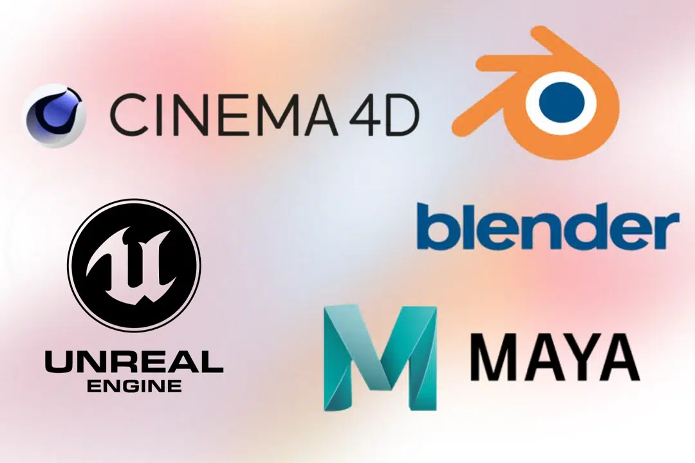

Mais bien que l'expression séparée de la **précision géométrique** et de la **précision matérielle** par le Mesh présente de nombreux avantages, elle génère également de nombreux problèmes complexes. Par exemple, le Mesh nécessite généralement une hypothèse préalable de la topologie de l'objet par l'homme ou par un algorithme (comme la relation de connexion des sommets, le type de surface, etc.).

La tâche du rendu graphique est de convertir un graphique en image, tandis que la reconstruction 3D est son processus de résolution inverse (image -> graphique). Par conséquent, l'utilisation du **nuage de points (Point Cloud)** comme base de采集 et de traitement des données est plus facile pour enregistrer les données de **échantillonnage non biaisé** de la scène reconstruite et conserver les informations géométriques originales (comme les bords, les trous, la structure non manifold).

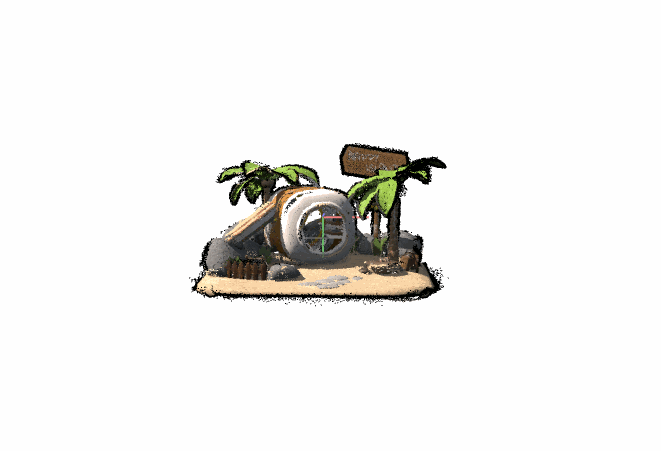

Le nuage de points montré ci-dessus a été généré à l'aide de l'outil open source **[Colmap](https://github.com/colmap/colmap)** en utilisant **SFM (Structure from Motion)** + **MVS (Multi-View Stereo)**. Nous n'avons qu'à entrer des images de plusieurs angles de vue :

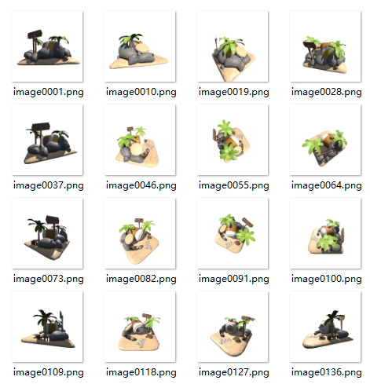

Le processus SFM exécutera successivement les étapes suivantes :

- **Extraction de caractéristiques (Feature Extraction)** : Chargement des images d'entrée et prétraitement, extraction des points de caractéristiques contenus dans chaque image.

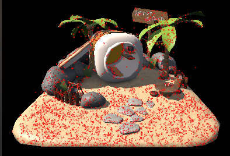

- **Appariement de caractéristiques (Feature Matching)** : Recherche des mêmes points de caractéristiques entre différentes images, établissement de relations correspondantes.

    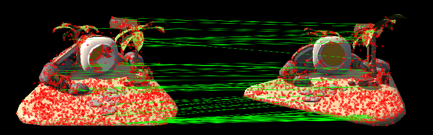

- **Reconstruction incrémentielle (Mapper)** : Récupération progressive de la pose de la caméra et du nuage de points sparse basée sur la relation d'appariement.

    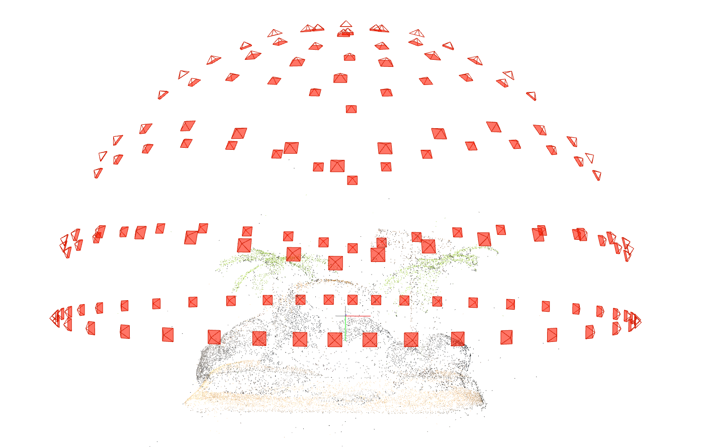

Le processus MVS, quant à lui, traitera davantage le **nuage de points sparse (Sparse Point Cloud)** généré par SFM pour obtenir un **nuage de points dense (Dense Point Cloud)**, qui comprend les étapes suivantes :

- **Estimation de la carte de profondeur (Stereo)** : Génération d'une carte de profondeur pixel par pixel pour chaque image d'entrée, c'est-à-dire estimation de la distance entre le point de scène correspondant à chaque pixel et la caméra.

    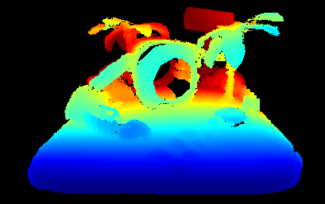

- **Fusion de la carte de profondeur (Fusion)** : Fusion des cartes de profondeur de plusieurs images en un nuage de points dense globalement cohérent, élimination des conflits et remplissage des trous.

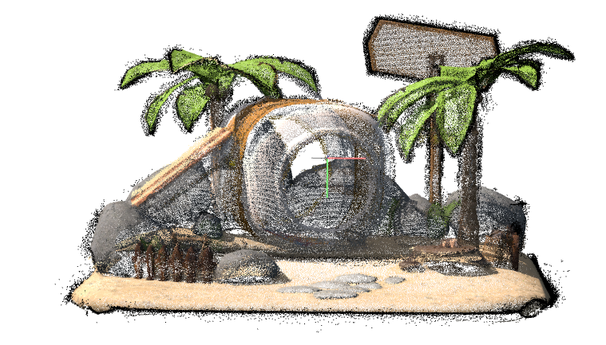

Mais pour la même structure graphique, le nuage de points a généralement une quantité de données énorme. Le modèle original de la scène ci-dessus a `4 876` triangles, mais après conversion en nuage de points de précision inférieure, il contient encore `429 113` points. Par conséquent, le domaine de la reconstruction 3D doit encore envisager la conversion du nuage de points en Mesh. Voici quelques méthodes courantes :

- **Reconstruction de Poisson (Poisson Reconstruction)** : Considération du nuage de points comme des points d'échantillonnage d'une fonction de distance signée (surface implicite), extraction de l'isosurface (c'est-à-dire la surface du Mesh) en résolvant l'équation de Poisson.
- **Méthode des moindres carrés mobiles (MLS, Moving Least Squares)** : Ajustement du plan tangent de chaque point par la méthode des moindres carrés pondérés localement, génération d'une surface implicite, puis extraction du Mesh par l'algorithme Marching Cubes.
- **Triangulation de Delaunay (Delaunay Triangulation)** : Dans l'espace 2D ou 3D, génération d'un maillage triangulaire par la règle de maximisation de la sphère vide (condition de Delaunay), correspondant à la dissection tétraédrique dans la scène 3D.
- **Algorithme de pivotement de balle (Ball Pivoting Algorithm)** : Roulement d'une balle de rayon fixe sur la surface du nuage de points, les points d'intersection de la balle et du nuage de points forment un triangle, et la densité et les détails du maillage sont contrôlés en ajustant le rayon de la balle.
- **Algorithme Marching Cubes** : Pour chaque unité de voxel (cube), selon que les sommets sont à l'intérieur ou à l'extérieur de la surface (déterminé par la fonction de distance ou la fonction de densité), recherche du modèle d'isosurface prédéfini et génération de triangles. Stratégie courante comme TSDF (Truncated Signed Distance Function).
- **Méthode d'apprentissage profond** : Utilisation d'un réseau de neurones pour prédire directement les sommets et la topologie du Mesh à partir du nuage de points, adaptée au traitement automatisé ou à la reconstruction de formes complexes. Par exemple, [AtlasNet](https://github.com/ThibaultGROUEIX/AtlasNet), [PointToMesh](https://github.com/nywang16/Pixel2Mesh), [Mesh R-CNN](https://github.com/facebookresearch/meshrcnn), [ConvONet](https://github.com/autonomousvision/convolutional_occupancy_networks), etc.

## 3D Gaussian Splatting

D'un point de vue académique, 3DGS peut être considéré comme une transformation et une extension du processus traditionnel SFM + MVS.

Elle peut reprendre le résultat de SFM comme entrée, utiliser une **distribution gaussienne 3D** comme primitive graphique, et approcher la scène originale par la **méthode de descente de gradient stochastique (Stochastic Gradient Descent, SGD)**, obtenant ainsi un effet graphique de haute qualité. Le processus est le suivant :

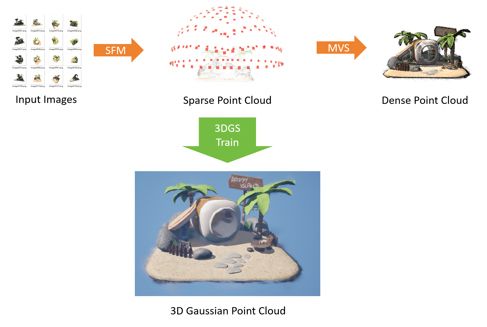

La primitive gaussienne 3D prend un point dans l'espace 3D comme centre, et sa densité de probabilité (ou intensité de rayonnement) diminue exponentiellement avec l'augmentation de la distance par rapport au centre. Cela peut sembler abstrait, mais vous pouvez simplement imaginer la distribution gaussienne 3D comme une **ellipsoïde semi-transparente colorée**.

Prenons l'exemple ci-dessus : lorsque l'"ellipsoïde" **ne suit pas la distribution gaussienne 3D** et est **opaque**, le graphique ressemblera à ceci :

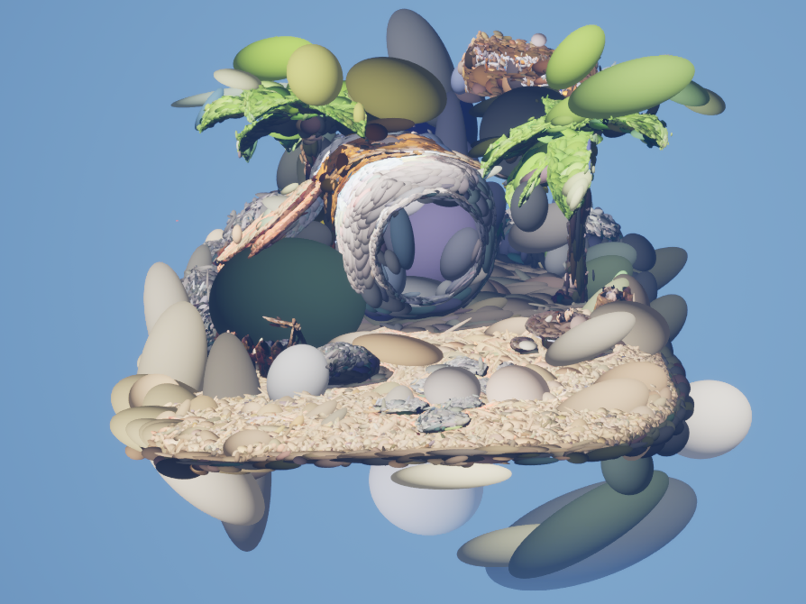

Puis restaurons successivement la transparence et la distribution gaussienne 3D :


Ainsi, il semble facile de comprendre ce qu'est la distribution gaussienne 3D. Pour définir un point gaussien 3D, les paramètres principaux suivants sont utilisés :

- **Position du centre (X, Y, Z)** : Position centrale du point gaussien dans l'espace 3D.
- **Matrice de covariance (Mat3X3)** : Contrôle la structure morphologique (grossesse/minceur) de l'ellipsoïde gaussien.
- **Paramètres de couleur (R, G, B)** : Contrôle la couleur de l'ellipsoïde.
- **Opacité (Opacity)** : Contrôle l'opacité de l'ellipsoïde.

Le processus d'entraînement de Gaussian Splatting génère finalement un fichier `*.ply` qui stocke en fait un tas de tels points gaussiens. Le processus global peut être résumé simplement comme suit :

- Le processus d'entrée utilise un nuage de points avec une structure morphologique de base (par exemple, le nuage de points sparse obtenu par SFM) comme position initiale de la primitive gaussienne.
- Pendant le processus itératif, les primitives gaussiennes 3D sont projetées sur le plan de l'image 2D, les poids et les pertes sont calculés, et la méthode de descente de gradient stochastique est utilisée pour mettre à jour les paramètres de tous les gaussiens (position, couleur, covariance, opacité) via la propagation en arrière.
- Pendant le processus itératif, le nombre de points gaussiens est ajusté dynamiquement, les primitives à faible contribution sont éliminées, et la densification est exécutée dans les zones à haut taux d'erreur.

En raison de la considération du contrôle des paramètres et de l'optimisation pendant le processus de descente de gradient, la matrice de covariance et les paramètres de couleur utilisent une autre expression, où la matrice de covariance est décomposée comme suit :


- S est une matrice de mise à l'échelle diagonale, représentée par 3 valeurs de mise à l'échelle. Il faut noter que lors de l'entraînement réel, pour que le paramètre scale reste toujours positif (car la longueur ne peut pas être négative) et pour faciliter l'optimisation du réseau, scale est généralement stocké sous forme logarithmique, c'est-à-dire :
    - Ce que le réseau produit / ce qui est stocké dans le fichier Ply est `log(scale)`
    - Lors de l'utilisation, il faut prendre l'exponentielle `exp(log(scale))` pour restaurer la valeur scale réelle positive.
- R est une matrice de rotation, représentée par un quaternion.

Les paramètres de couleur utilisent les **harmoniques sphériques (Spherical Harmonics, SH) au lieu de stocker directement RGB**, afin que la couleur de chaque sphère gaussienne puisse changer avec la direction d'observation, affichant des effets de réflexion de surface et d'éclairage plus riches, et rendant le rendu plus réaliste.

Si on ne considère pas la direction d'observation, la conversion de SH en RGB est très simple :

``` python
C0 = 0.28209479177387814
def SH2RGB(sh):
    return sh * C0 + 0.5
```

De plus, pour la stabilité numérique, le calcul du gradient, etc., l'opacité n'est généralement pas stockée directement sous forme d'opacité normalisée, mais sous forme de **logit** :

- Ce que le réseau produit / ce qui est stocké dans le fichier Ply est `logit(opacity)`
- Lors de l'utilisation, il faut passer par `1.0f / (1.0f + exp(-opacity))` pour obtenir l'opacité véritable.

Jusqu'à présent, nous avons compris l'entrée, le processus et la sortie de 3D Gaussian Splatting. Une des raisons pour lesquelles 3dgs est si populaire est qu'elle a une efficacité de rendu très élevée.

Parce que la distribution gaussienne 3D est différentiable, nous utilisons un ensemble de paramètres pour représenter l'"ellipsoïde" dans l'espace 3D. Lors du rendu, il est projeté dans l'espace de l'écran, devenant une **ellipse** 2D, et cette section elliptique suit toujours la distribution gaussienne 2D. Cela signifie que nous pouvons déduire la structure morphologique de l'ellipse dans l'**espace de l'écran/image** en fonction des **paramètres gaussiens 3D** et des **paramètres de la caméra**, et effectuer directement le rastérisation, ce qui peut réduire considérablement la quantité de calcul nécessaire pour le rendu graphique.

Mais comme la primitive gaussienne est semi-transparente, le tri semi-transparent de la primitive par la caméra est indispensable au niveau du traitement des données.

Actuellement, les stratégies de rendu 3dgs sont principalement de trois types :

- [ **diff-gaussian-rasterization** ](https://github.com/graphdeco-inria/diff-gaussian-rasterization) : Bibliothèque de rastérisation 3DGS utilisant Cuda fournie par l'officielle.
- [ **3DGS.cpp** ](https://github.com/shg8/3DGS.cpp) : Bibliothèque de rastérisation 3DGS implémentée via le pipeline de calcul Vulkan, en se référant à la version Cuda.
- Utilisation du pipeline de rendu graphique, les étapes spécifiques sont : Considérer la primitive gaussienne comme un quad plan au niveau géométrique, et dessiner la distribution gaussienne 2D au stade de la coloration. Cette méthode a une haute universalité, voici quelques références open source :
    - [ **fast-gaussian-rasterization** ](https://github.com/dendenxu/fast-gaussian-rasterization) : Version implémentée avec Python OpenGL à l'aide du shader géométrique.
    - **[splat](https://github.com/jakobbbb/splat)** : Version implémentée avec C++ OpenGL via le rendu d'instanciation.
    - **[QEngineUtilities](https://github.com/Italink/QEngineUtilities/blob/main/Source/Core/Source/Private/Render/Component/QGaussianSplattingPointCloudRenderComponent.cpp)** : Version implémentée avec C++ QRhi via le rendu d'instanciation.

Voici tout le contenu de 3dgs. Si vous êtes intéressé par les détails mathématiques, voici une bonne ressource :

- Vue d'ensemble complète de la distribution gaussienne : https://medium.com/data-science/a-comprehensive-overview-of-gaussian-splatting-e7d570081362

## Application dans Unreal Engine

Concernant l'application de 3DGS, il y a une discussion populaire sur Zhihu :

- [Quelle sera l'impact de la technologie 3DGaussianSplatting ? - Zhihu](https://www.zhihu.com/question/626506306?share_code=b3dW4To2Z0eh&utm_campaign=Sharon&utm_content=group2_supplementQuestions&utm_psn=1907217331651838726)

Le UP a découvert 3DGS pour la première fois à la fin de 2024 en regardant une vidéo sur Bilibili :

- ["Reconstruire" une montagne en seulement 10 minutes ? Comment utiliser la神奇 technologie NeRF ! - Ying Shi Ju Feng](https://www.bilibili.com/video/BV1gF4m1u74D)

En raison de la certaine ambiguïté du titre, le UP a reproduit le processus dans la vidéo et, après avoir vu l'effet réel, a exclamé que NeRF a un grand potentiel ! Après avoir été confronté à la réalité, il a découvert que la technologie utilisée ici était en fait 3DGS, et non NeRF.

Motivé par un besoin de développement potentiel, le UP a entrepris une étude approfondie de 3DGS :

- Parce que la scène ouverte dans laquelle le joueur entre doit charger une grande quantité de ressources (dizaines de GB), la plupart des jeux utilisent un niveau Launch/Loading pour retarder l'opération de l'utilisateur et commencer à charger à l'avance. Pour rendre ce processus plus imperceptible, je souhaite que l'arrière-plan du niveau Launch soit une vue aérienne dynamique de toute la scène ouverte, un peu similaire à [cet effet](https://www.bilibili.com/video/BV1tfWne4Eia/?share_source=copy_web&vd_source=dfd2f1bf643a3e0722141847666af060&t=587). Lorsque le chargement est terminé, il peut passer en douceur de la vue aérienne à la vue du joueur. Par conséquent, un agent visuel léger de toute la scène est nécessaire. Parce que la scène réelle dans le moteur a des données géométriques énormes et des effets de matériau complexes, il est difficile de simplifier le maillage traditionnel par cuisson, et les moyens de synthèse d'images courants ont souvent des défauts. Par conséquent, j'ai pensé à utiliser la technologie de reconstruction 3D pour créer cet agent visuel.

Par rapport aux primitives graphiques traditionnelles, 3DGS a de nombreux inconvénients :

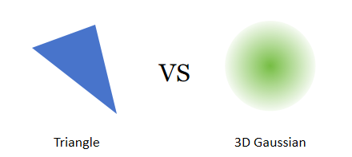

- Lors de l'expression de graphiques à haute précision et avec des effets de surface riches, l'ordre de grandeur du nombre de primitives gaussiennes est similaire à celui des triangles, voire plus élevé.
- En raison de la caractéristique semi-transparente de la primitive gaussienne, certains moyens d'optimisation d'élimination deviennent inefficaces, et il faut trier les primitives par semi-transparence lors de leur rendu.
- Le nuage de points gaussien n'est pas aligné sur la surface du modèle et est discontinu, ne contenant que des caractéristiques de couleur, ce qui rend difficile l'implémentation des effets d'ombre et de lumière du graphique ou ne permet de le faire qu'en mode à haut coût.

Ces inconvénients sont本质iellement déterminés par **les caractéristiques mathématiques de la distribution gaussienne** et **la stratégie d'optimisation de la descente de gradient**. Bien que la communauté académique ait entrepris des explorations extensives sur ces problèmes, beaucoup de gens critiquent encore 3DGS pour n'être qu'un moyen de publier des articles.

Revenant à l'industrie, la technologie graphique informatique a connu une évolution révolutionnaire au cours des dernières décennies, passant de la modélisation polygonale initiale au rendu de nouvelle génération aujourd'hui. Les percées en matière de **précision, d'efficacité et de réalisme** ont directement façonné l'histoire de l'évolution de l'expérience de jeu :


Cela est dû non seulement au développement rapide des équipements matériels, mais aussi à l'application extensive de trois technologies informatiques clés dans le processus de jeu :

- **LOD (Level of Detail)** : **« Réponse hiérarchique, adaptation dynamique »**
    - Ajustement dynamique de la précision de traitement selon l'**importance (Significance)** de l'objet cible, recherchant un équilibre optimal entre la consommation de ressources et l'effet.
- **Culling (Élimination)** : **« Filtrage定向, focalisation précise »**
    - Identification rapide et exclusion des éléments non nécessaires au traitement via des règles préétablies, réduisant les frais généraux redondants du système.
- **Streaming (Flux)** : **« Obtention à la demande, ordonnancement en temps réel »**
    - Considération des ressources comme un flux de données continu, chargement/déchargement dynamique selon les besoins en temps réel,突破ant ainsi les limites des ressources physiques.

Avec la poursuite croissante des développeurs pour les graphismes de jeu et la logique complexe, afin de突破 les limites des équipements matériels et d'optimiser les solutions technologiques logiciels existantes, une autre technologie est apparue : **Imposter (Substitut)** :

- Une méthodologie générale d'optimisation système par **substitution abstraite**, dont le cœur réside dans **l'utilisation d'un modèle simplifié suffisamment bon pour remplacer un élément complexe dans un contexte spécifique**.

Cette idée traverse plusieurs domaines comme les graphiques, les systèmes distribués, l'IA, devenant un outil clé pour construire des systèmes performants et élastiques.

La technologie Imposter continue de rechercher une solution optimale entre « ressources limitées » et « expérience illimitée », devenant un accélérateur invisible du développement de jeux moderne. Elle peut généralement réduire considérablement la quantité de calcul et l'occupation de mémoire, ce qui est très important pour les systèmes graphiques en temps réel. Voici quelques applications de la technologie Imposter dans l'industrie du jeu :

- **Optimisation LOD** : Utilisation de Billboard, Flipbook, Mesh Cards et Octahedron pour générer des Imposters de modèles statiques, réduisant les frais généraux de rendu en vue lointaine.

- **Optimisation de la foule** : Dégradation des PNJs non clés en vue lointaine (par exemple, passants en vue lointaine) en maillage d'instanciation statique, cuisson de l'animation squelettique en texture, afin d'obtenir un effet de foule dense.

- **Optimisation de l'élimination** : Utilisation d'un Imposter de bas polygone à la place de la boîte englobante, construction d'un pipeline d'élimination d'occlusion GPU spécialisé, amélioration de l'efficacité de l'élimination d'occlusion.
- **Optimisation de l'ombre** : Cuisson préalable de l'auto-ombre (Self-Shadow) de l'objet graphique, utilisation de l'Imposter pour générer l'ombre projetée (Cast Shadow) de l'instance, réduisant considérablement les frais généraux d'exécution du processus d'ombre.
- ...

3DGS est très probablement une autre dérivation de la stratégie Imposter dans l'optimisation LOD.

Dans le processus de fabrication LOD traditionnel, l'industrie utilise généralement la méthode de **simplification** pour générer le LOD du modèle :

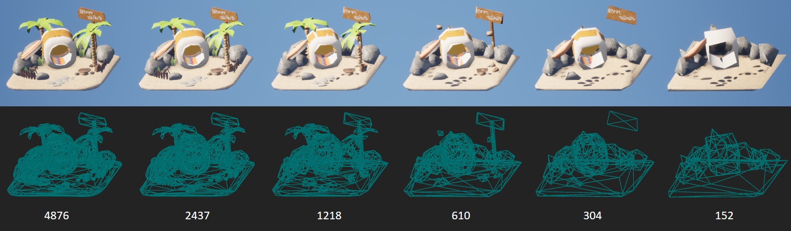

Généralement, une amplitude de simplification de `50%` peut équilibrer bien les performances et la qualité de vue, mais cette stratégie donne des résultats peu satisfaisants sur des modèles avec des caractéristiques détaillées complexes et des formes géométriques irrégulières.

Par exemple, un modèle avec un million de triangles, si nous suivons une efficacité de simplification de 50%, nécessite généralement `14 niveaux de LOD`, ce qui génère évidemment une grande quantité de données et des frais généraux d'ordonnancement LOD élevés. Pour limiter le nombre de LOD à `8` ou moins, l'efficacité de simplification doit être augmentée à `75%`, comme ceci :

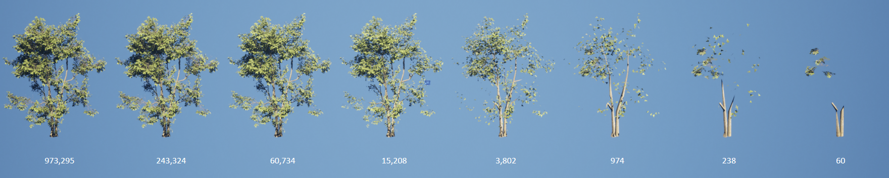

Pour garantir un changement visuel plus doux lors du changement de LOD, il faut augmenter l'intervalle entre les chaînes de LOD, ce qui augmentera significativement les frais généraux d'exécution du système graphique entier.

Par conséquent, l'introduction de l'Imposter peut résoudre ce problème bien. Les stratégies d'Imposter courantes sont :

- **Billboard** : Dessin du modèle sous un angle spécifique sur une texture.
- **Flipbook** : Dessin du modèle sous plusieurs angles sur une texture, puis changement de la texture affichée selon l'angle de vue du joueur sur le matériau.
- **Billboard Cloud/ Mesh Card Cloud** : Dessin du modèle sur de nombreuses cartes de maillage, afin de superposer un effet de vue similaire au modèle source.
- **Octahedron** : Dessin du modèle avec une distribution d'angles de vue certaine sur une texture, puis interpolation d'images de plusieurs angles sur le matériau pour présenter une transition de vue fiable.

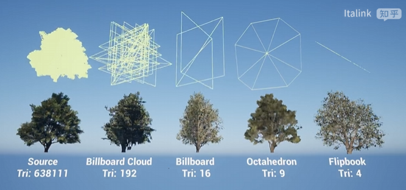

Concernant la comparaison de ces stratégies, cela a été brièvement mentionné dans un article précédent sur l'optimisation de la végétation, voir :

- https://zhuanlan.zhihu.com/p/713731229

Ces stratégies ont différents avantages et inconvénients, adaptées à différents besoins d'utilisation. Bien qu'elles puissent réduire considérablement les frais généraux de performance, elles ne sont généralement adaptées qu'à des modèles individuels à structure relativement "symétrique". Pour des modèles composites à structure complexe, comme celui-ci, l'effet est plutôt décevant :


Le processus de 3DGS consiste lui-même à approcher l'image originale par la descente de gradient. Bien qu'à haute précision, le nombre de GS dépasse facilement le nombre de triangles du maillage original, à basse précision, par rapport aux moyens d'optimisation traditionnels, plus le modèle est complexe, meilleure est l'effet d'ajustement de 3DGS et plus élevé est son rapport qualité-prix :

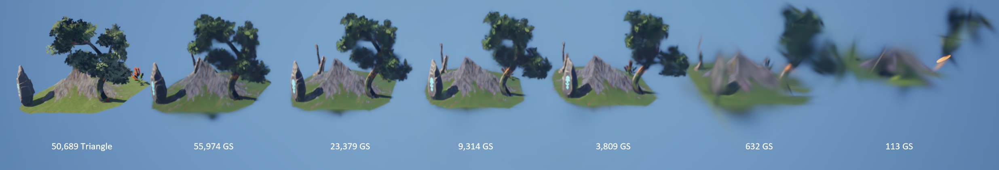

Le nuage de points gaussien a également un autre avantage par rapport au maillage :

- Le nuage de points gaussien est un point de caractéristique discontinu, contrairement au triangle qui nécessite une topologie continue.

Par conséquent, la solution LOD du nuage de points gaussien est très facile à mettre en œuvre : il suffit de trier les points gaussiens selon l'importance des caractéristiques, et de伸缩动态 le nombre de points gaussiens à dessiner dans la fenêtre actuelle via l'ordonnancement GPU lors de l'affichage final.

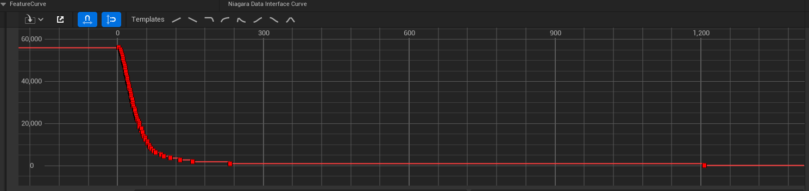


Avec ces supports théoriques, le UP a fait quelques tentatives d'industrialisation. Bien que le processus ait été un peu difficile, les amis intéressés peuvent le télécharger et essayer :

- https://github.com/Italink/Cosmos/releases/tag/v0.0.1

| Projet              | Taille de la scène | Taille du contenu | Taille 3DGS (non compressé) | Taille 3DGS (compressé) | Fréquence/GPU temps (5090D 4K) | Fréquence/GPU temps (3060 Laptop 1K) | Temps de génération (7950X+5090D) |
| ----------------- | -------- | -------- | ------------------ | ------------------ | ------------------------ | ------------------------------ | ----------------------- |
| 《City Sample》   | 16 km²   | 64.8 GB  | 0.69GB             | 46.6 MB            | 326 FPS / 1.97 ms        | 112 FPS / 7.51ms               | 30+ heures               |
| 《Project Titan》 | 64 km²   | 49.4 GB  | 1.78 GB            | 115.1 MB           | 294 FPS / 2.48 ms        | 104 FPS / 7.93 ms              | 80+ hours               |


Grâce à l'architecture de rendu hautement optimisée d'Unreal Engine elle-même, après la mise en œuvre de ce mécanisme de rendu gaussien, les performances de rendu du système global n'étaient pas aussi mauvaises que prévu. Plus important encore, par rapport à la solution de construction de scène ouverte traditionnelle, 3DGS a une très forte universalité, ce qui a une grande valeur pour la gestion de la scène.

En réalité, la mise en œuvre actuelle a encore un très grand potentiel d'optimisation :

- L'entraînement de 3DGS nécessite un nuage de points avec une forme géométrique de base comme entrée. Actuellement, il provient de la reconstruction SFM de Colmap. Puisque le graphique lui-même est connu par le moteur, il est possible de contourner l'étape Colmap et de générer directement le nuage de points.
- L'effet LOD met plus l'accent sur les bords et les angles du graphique, ce qui peut être utilisé pour optimiser le chemin de densification de 3DGS.

- Bien que la mise en œuvre de Niagara ait une bonne universalité, la gestion de l'état, l'ordonnancement de la mémoire et le chemin de rendu ne sont pas optimaux.

- Actuellement, l'algorithme de compression `Spz` open source est utilisé sur le CPU avec un taux de compression d'environ 10 fois, mais il existe des solutions de compression utilisant Cuda dans la communauté académique qui peuvent atteindre un taux de compression接近百倍.

En raison de la limite du temps personnel du UP, si vous êtes intéressé par ces fonctionnalités, vous pouvez faire des tentatives par vous-même. Le plugin est actuellement entièrement open source :

-  [Github | Gaussian Splatting For Unreal Engine - Italink](https://github.com/Italink/GaussianSplattingForUnrealEngine) 

> Le développement n'est pas facile. Si ce plugin vous est utile, aidez-moi à [mettre une étoile](https://github.com/Italink/GaussianSplattingForUnrealEngine.git)呀 0.0：

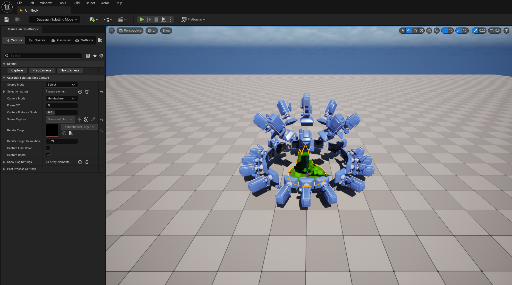

La fonction de la structure de fichiers correspondante dans le répertoire du plugin est la suivante :

- Content : Actifs UE relatifs à 3DGS, la version actuelle des actifs est 5.5.4.

- Scripts : Scripts auxiliaires pour appeler Colmap et l'algorithme 3DGS.

- Source :

    - GaussianSplattingRuntime : Module runtime.
        - `GaussianSplattingPointCloud` : Actif UE personnalisé, contenant la structure du nuage de points 3DGS.
        - `AGaussianSplattingPointCloudActor` : Classe de base GSActor réservée.
        - `GaussianSplattingPointCloudDataInterface` : Interface de données Niagara, utilisée pour soumettre les données de GaussianSplattingPointCloud au GPU pour l'utilisation du système de particules.
        - `Spz` : Algorithme de compression de 3D GS, provenant de https://github.com/nianticlabs/spz

    - GaussianSplattingEditor : Module éditeur, ne participe pas au packaging final.
        - `GaussianSplattingEditorLibrary` : Interface de fonction relative au traitement de 3DGS.
        - `GaussianSplattingEditorSettings` : Configuration relative au plugin.
        - `GaussianSplattingHLODBuilder` : Constructeur HLOD utilisant 3DGS.
        - Relatif au mode éditeur (panneau de la barre d'outils gauche) :
            - `GaussianSplattingEdMode`
            - `SGaussianSplattingEdModePanel` : Panneau UI de EdMode.
            - `GaussianSplattingStep` : Logique core de EdMode.
        - Relatif à l'éditeur d'actifs :
            - `GaussianSplattingPointCloudEditor`
            - `SGaussianSplattingPointCloudEditorViewport`
            - `SGaussianSplattingPointCloudEditorViewportClient`
            - `SGaussianSplattingPointCloudFeatureEditor`