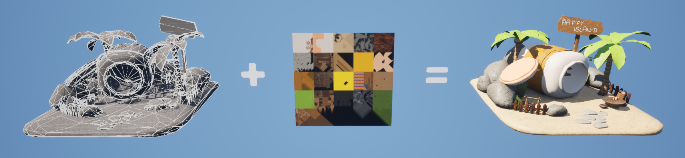
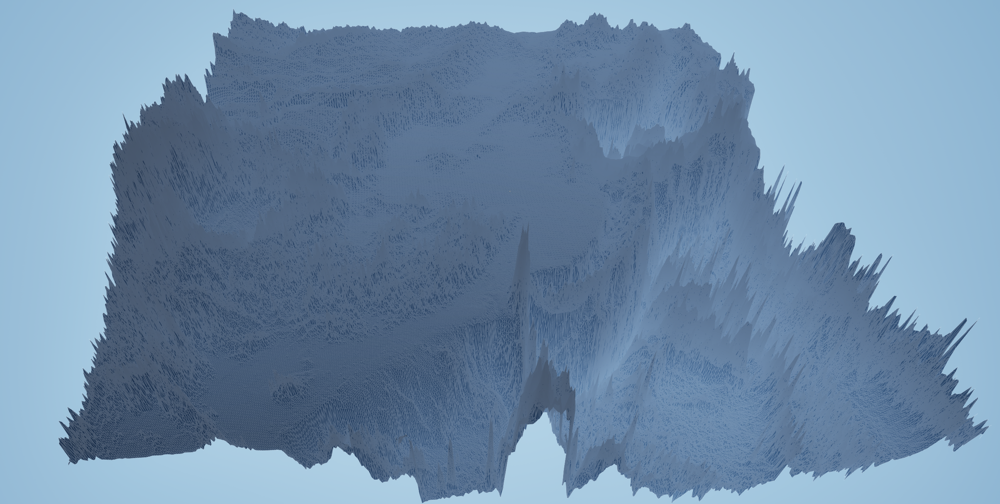
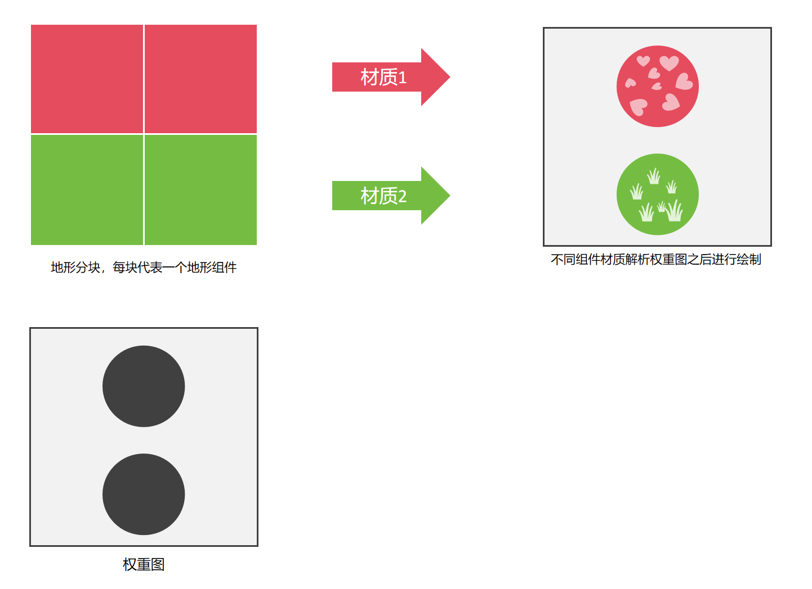
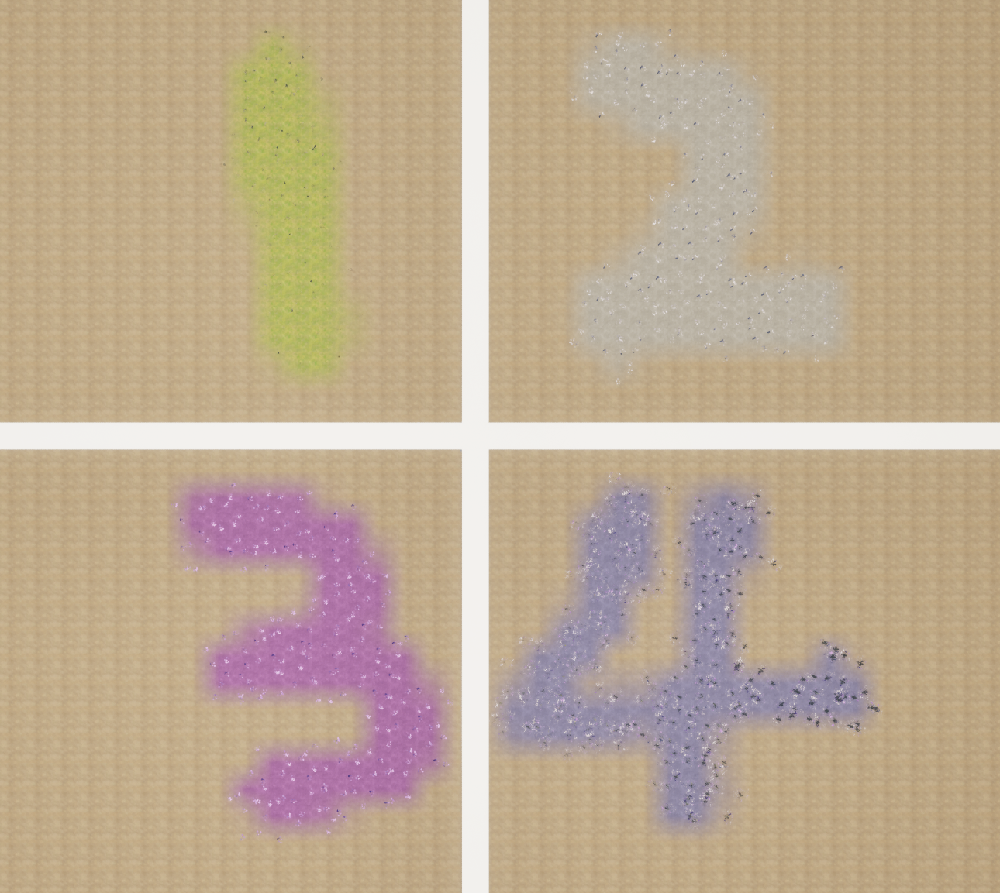
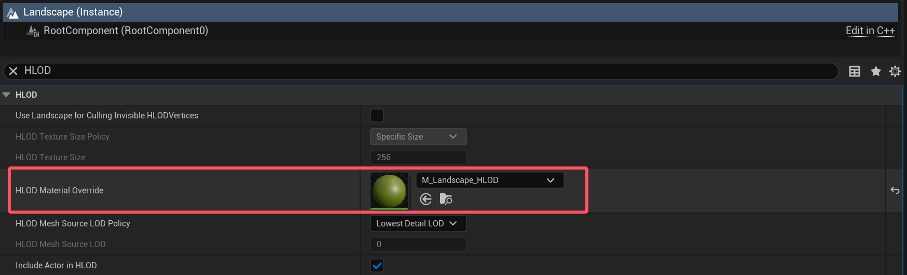
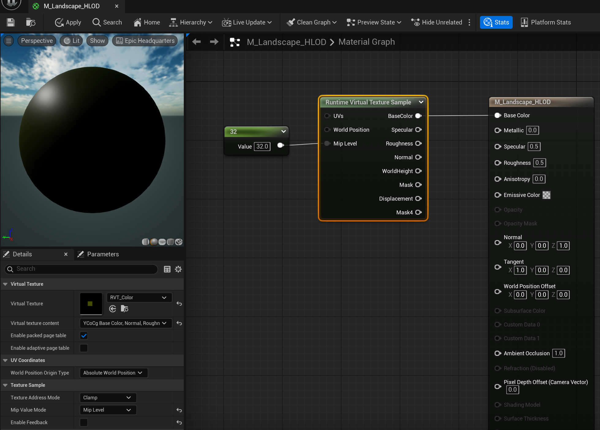
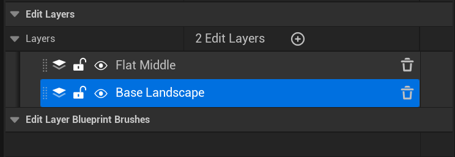
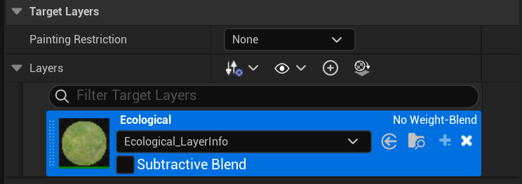

# Guide d'évitement des pièges pour Landscape

## Aperçu

Le terrain (Landscape) est un élément graphique fondamental dans les jeux modernes. Avec la complexité croissante des projets graphiques et l'équipe de développement de plus en plus "jeune", si l'on se concentre uniquement sur la réalisation des effets et l'utilisation au niveau de l'éditeur, en négligeant certains détails importants, on risque de semer des隐患 (risques cachés) considérables. C'est pourquoi cet article présente ces aspects.

Dans la plupart des projets graphiques, l'élément graphique le plus utilisé est sans aucun doute le **maillage statique (Static Mesh)**. Il utilise des données géométriques de sommets (coordonnées spatiales, UV, normales...) associées à des textures de matériaux pour exprimer les effets graphiques :



Le maillage statique occupe une position cruciale dans le développement de jeux modernes et est devenu l'unité de base pour construire la géométrie du monde du jeu. Les logiciels de modélisation professionnels (tels que 3dsMax, Maya, Blender, Zbrush, etc.) offrent aux designers une grande commodité et une grande liberté, leur permettant de concevoir rapidement les effets graphiques qu'ils envisagent.

En revanche, le terrain est un élément graphique relativement spécial. Contrairement au maillage statique qui utilise directement des données de sommets triangulaires pour s'exprimer, il dépend d'une **carte d'altitude (heightmap)** :


> Cette image a été générée par https://manticorp.github.io/unrealheightmap

Chaque pixel de la carte d'altitude correspond à une coordonnée de sommet réelle, avec la relation de mapping suivante :
- Coordonnées du pixel (XY) > Coordonnées horizontales du sommet (XY)
- Valeur de niveaux de gris du pixel (Grayscale) > Altitude du sommet (Z)



La carte d'altitude peut être considérée comme un tableau de valeurs 2D, dont le type d'élément de base est généralement un entier non signé sur 16 bits. La structure C++ correspondante est :

```c++
uint16_t HeightMap[Height][Width];
```

Les règles de conversion réelles peuvent varier légèrement selon le logiciel. Unreal Engine utilise le **centimètre (cm)** comme unité de base, et ses règles de conversion sont les suivantes :
- Les coordonnées horizontales des sommets sont converties directement depuis les coordonnées des pixels. Sans aucun scaling, la précision minimale de représentation horizontale du terrain UE est de **1 cm**.
- La valeur de niveaux de gris du pixel est stockée sous forme d'entier non signé sur 16 bits, ce qui signifie qu'elle peut distinguer `65536` niveaux d'altitude différents. UE ne le mappe pas directement en cm, mais le réaffecte à **une plage flottante de [-256.0, 255.992]**. Autrement dit, sans aucun scaling, la plage d'altitude que le terrain UE peut représenter verticalement est de **-256.0 cm à 255.992 cm**, et la précision minimale de représentation de l'altitude est de **0.0078125 cm**.

En résumé, certains d'entre vous se posent peut-être les questions suivantes :
- Pour réaliser le même effet graphique, le maillage statique offre une précision et une liberté très élevées, tandis que le terrain présente de nombreuses limitations. Alors pourquoi encore utiliser le terrain ?

En fait, l'utilisation du terrain est essentiellement un compromis entre **l'échelle de la scène** et **la haute précision**.

Commençons par parler des inconvénients du terrain :
- **Précision horizontale limitée** : Par exemple, la taille maximale de la carte d'altitude prise en charge par UE5 pour les cartes non WP est `8129`. Sans scaling, cela signifie que la largeur horizontale que nous pouvons représenter avec elle est de `81.29 m`. Lorsque nous voulons représenter une zone plus grande, par exemple en la étirant 100 fois, nous pouvons représenter une zone de `66.08 km`, mais à ce moment-là, la précision minimale de représentation horizontale devient `1 m`, ce qui signifie que tous les détails géométriques inférieurs à `1 m` seront perdus.
- **Plage de représentation de l'altitude limitée** : Sans scaling, la plage de représentation de l'altitude est de `-256.0 cm à 255.992 cm`. Lorsque nous voulons représenter une montagne de `2000 m`, nous devons étirer l'altitude 1000 fois, ce qui signifie que la précision minimale de représentation de l'altitude deviendra `7.8125 cm`, et cela entraînera une erreur de calcul d'au moins 7 cm dans le calcul des collisions du terrain.
- **Unicité de la topologie** : Le terrain est essentiellement un "maillage de champ d'altitude continu" et ne prend en charge que "des ondulations d'une seule couche". Il ne peut pas réaliser la topologie complexe d'un maillage statique (tels que des plateformes suspendues, des intersections de terrain, des grottes souterraines, etc.).
- **Granularité d'édition relativement grossière** : L'édition du terrain dépend de "dessins au pinceau" (tels que l'élévation, l'abaissement, le lissage), et il est difficile de contrôler précisément chaque protubérance ou creux par "édition au niveau du sommet" comme avec un maillage statique.
- **Complexité du développement collaboratif** : La carte d'altitude et la carte de poids sont des fichiers uniques. L'édition simultanée par plusieurs personnes entraînera une surcharge des données, qui doivent être gérées strictement via des outils de contrôle de version.

Mais malgré ces nombreux inconvénients, **le terrain reste la seule solution pour les scènes à grande échelle avec le niveau de matériel actuel**.

Par exemple, si nous voulons construire une scène de `1 km²` en utilisant un plan de maillage, en garantissant une précision géométrique moyenne de `10 cm × 10 cm`, même si c'est déjà une précision relativement basse, nous aurons besoin de **100 millions (10000 × 10000)** de sommets triangulaires. L'occupation d'un sommet de maillage statique UE5 est généralement de `28 octets` (position : 12 + tangente X : 4 + tangente Z : 4 + UV : 8), donc l'espace non compressé occupé par l'ensemble du maillage de terrain sera d'environ :
- `28 × 10000 × 10000 ÷ 1024³` ≈ **2.61 Go**

Ce n'est que les données géométriques. Sans utiliser de **texture tilée (Tiled Texture)**, la précision des texels de `10 cm` ne garantirait manifestement pas l'effet visuel, et des flous ou des mosaïques apparaîtraient. Pour garantir "la clarté visuelle à courte distance" (par exemple, faire correspondre `1 cm × 1 cm` de sol à 1 texel), le nombre total de pixels nécessaires pour la texture serait de **10 milliards**. En utilisant seulement 4 canaux (ARGB_8888) pour représenter la couleur, l'espace non compressé serait d'environ :
- `4 × 100000 × 100000 ÷ 1024³` ≈ **37.25 Go**

Et ce n'est qu'une scène de `1 km²` !

> En réalité, d'après mes contacts ces dernières années, de nombreuses équipes (pas seulement dans l'industrie du jeu) n'ont pas une connaissance profonde de l'échelle des données des scènes graphiques. Surtout aux yeux des planners/produits, une scène ouverte ne consiste qu'à remplir la scène avec suffisamment d'éléments pour l'agrandir~

Dans ce contexte, lorsque nous voulons construire une scène un peu plus grande, le terrain est presque une option obligatoire. Outre les inconvénients mentionnés ci-dessus, il a également不少 (beaucoup) d'avantages non négligeables :
- **Mémoire** : Chaque sommet du terrain ne nécessite que 4 octets (canaux RG pour stocker l'altitude, canaux BA pour stocker les normales compressées), tandis que l'occupation mémoire du maillage statique est généralement 6 à 7 fois celle du terrain.
- **Textures** : Le terrain est une "projection spatiale mondiale indépendante de l'altitude". Peu importe comment on modifie les ondulations du terrain (élever, niveler, créer des montagnes), la précision du tiling de la texture reste constante. Par conséquent, l'utilisation de textures tilées est très pratique, ce qui est difficile pour le maillage statique, car une fois que la forme du modèle est modifiée (par exemple, transformer un sol plat en pente), la texture se déformera avec l'étirement du modèle. De plus, les détails du maillage statique dépendent principalement de la précision de la texture et des UV, tandis que le terrain peut superposer plusieurs couches de textures (telles que des textures de détail, des textures de pente, etc.) sur les textures tilées pour améliorer l'effet de层次 (hiérarchie).
- **LOD** : Le LOD du terrain est une "simplification dynamique basée sur le champ d'altitude". Le GPU passera automatiquement à un niveau Mip de texture de basse résolution via le Mipmap, garantissant à la fois l'efficacité du rendu à distance et évitant l'étirement de la texture. Par contre, le LOD du maillage statique nécessite de créer un modèle de basse précision indépendant pour chaque niveau.
- **Collisions** : Le terrain utilise un **corps de collision de champ d'altitude (Heightfield Collider)** et prend en charge la destructibilité. Les caractéristiques de sa structure de données rendent son calcul de collision beaucoup plus efficace que celui du maillage, et comme il n'y a pas d'espace entre les éléments, sa sécurité contre la pénétration des collisions est bien supérieure à celle du maillage statique.
- **Workflow** : Dans le moteur de jeu, le terrain est considéré comme un support graphique de base. Le moteur a construit de nombreux outils et flux de travail autour du terrain, tels que le système de végétation, la génération procédurale d'objets attachés au terrain, le baking de lumières et des ombres, etc.

La documentation officielle contient une présentation détaillée de l'utilisation de Landscape, expliquant bien le concept du terrain, la gestion du LOD et des collisions :
- https://dev.epicgames.com/documentation/en-us/unreal-engine/landscape-outdoor-terrain-in-unreal-engine

Concernant le principe du terrain, voici un article d'analyse très détaillé :
- Analyse du principe et du code source du système de terrain d'Unreal Engine - MarsZhou : https://zhuanlan.zhihu.com/p/668278748

## Planification

Pour un projet de jeu réel, il suffit souvent de connaître le principe de réalisation du terrain et l'utilisation des outils. Il faut établir une planification dès la phase de conception initiale.

### Définir l'échelle de la scène

La taille de la scène détermine en partie le volume du contenu du jeu. Prendre l'exemple du petit homme blanc standard UE : sa vitesse de déplacement par défaut est de `600 cm/s`, et il faut 2 minutes et 46 secondes pour parcourir `1000 m`. En se basant sur cela et en combinaison avec le contenu réel du jeu, on peut évaluer l'échelle approximative de la scène nécessaire.

> Lorsque la taille de la scène est supérieure à `1 km²` et qu'elle contient un grand nombre de GameObjects, il faut envisager d'utiliser **World Partition** pour organiser le streaming de la scène.

Il faut noter que lorsque l'on veut construire une scène avec une zone de jeu très grande, par exemple `64 km²`, il est recommandé de ne pas utiliser un seul terrain pour compléter l'ensemble de la scène. Une échelle de scène trop grande augmentera considérablement la complexité de la gestion des actifs, de l'édition de la carte, du design du gameplay et des niveaux, et ralentira gravement la vitesse d'itération du projet.

Bien que la carte WP UE prenne actuellement en charge une taille de terrain maximale de `65281`, il est recommandé que la taille d'un seul terrain ne dépasse pas `4 km²`. On doit itérer le contenu du jeu dans des sous-niveaux indépendants, et une carte principale est responsable de l'assemblage des sous-cartes via des éléments tels que la mer, les rivières ou les montagnes, comme ceci :


Après UE 5.4, de nombreux problèmes des instances de niveau ont été résolus efficacement, et on peut s'appuyer sur elles pour promouvoir ce workflow. Les objectifs mentionnés ci-après visent uniquement un seul bloc de terrain.

### Déterminer la résolution

Après avoir déterminé l'échelle d'un seul terrain, il faut déterminer la précision géométrique minimale de représentation du terrain. Généralement, une précision de `1 m` dans la direction horizontale est suffisante pour les projets RPG. Si l'on veut augmenter les détails de la surface du terrain, on peut le faire via les solutions suivantes :
- **Normal Map** : Modifier la direction des normales de surface pour influencer la réflexion de la lumière, faisant apparaître des détails de relief sur un terrain plat.
- **Parallax Occlusion Mapping** : Calculer le "décalage de profondeur virtuel" des pixels pour que la texture ait l'air d'avoir une épaisseur réelle, plus立体感 (tridimensionnel) que la Normal Map.
- **Displacement Mapping** : Avec la technologie Nanite et Subdivision Surface, prendre en charge la réalisation de vraies protubérances géométriques (modifier l'altitude au niveau du pixel) via une Displacement Map.
- **Objets attachés à la surface** : Placer des maillages statiques et des décalques sur la surface du terrain pour compléter les détails. Il faut faire attention à l'impact des corps de collision sur les performances.

La profondeur verticale doit être déterminée dès le début. Si on se souvient de ce problème seulement après avoir itéré beaucoup de contenu, il sera plus compliqué de modifier. De plus, pour garantir la précision des collisions, on ne peut pas étirer excessivement l'axe Z. Pour les montagnes hautes, on devrait envisager d'utiliser des maillages statiques pour les remplir.

### Équilibrer le nombre de proxys de streaming, de composants et de sections

La structure centrale correspondant au terrain UE est **ALandscape**, qui est responsable de la gestion des données globales et de la structure hiérarchique des composants de l'ensemble du terrain, y compris la détention des ressources de base telles que la carte d'altitude et la carte de poids, ainsi que le contrôle des propriétés globales du terrain (telles que les paramètres physiques, les paramètres globaux du LOD, etc.).

Pour diviser les responsabilités d'**ALandscape** et lui permettre une gestion de LOD à plus petite granularité, une détermination de visibilité, un DrawCall, une détection de collision et une gestion de matériau, le système de terrain a introduit les concepts de **composant de terrain (ULandscapeComponent)** et de **section (Section)**.

Supposons que nous confions toutes les fonctions à petite granularité au composant de terrain pour le moment, sans introduire le mécanisme de section, et que nous construisons une scène de 4 km² avec une carte d'altitude de résolution `2017 × 2017`. La division des composants se heurtera à un dilemme :
- Si le nombre de composants est faible (par exemple, 1 composant couvrant 4 km²) : La quantité de données de sommets d'un seul composant est importante. Lors du culling du frustum, on ne peut pas éliminer précisément les "zones invisibles", et le changement de LOD ne peut se faire que "globalement" (par exemple, un composant entier passe de LOD0 à LOD3 à distance, avec une perte évidente des détails). Le calcul des collisions doit également traiter toutes les données, ce qui est peu efficace.
- Si le nombre de composants est élevé (par exemple, 100 composants couvrant 4 km²) : Bien que le culling et le changement de LOD puissent être précis, chaque composant entraînera des frais généraux supplémentaires pour la planification (chargement/déchargement), la soumission du DrawCall et le filtrage des corps de collision, ce qui ralentira反而 (au contraire) le taux de trame.

Pour résoudre ce conflit, le système de terrain UE a introduit le concept de **section** —— sa positionnement n'est pas une division supplémentaire du composant, mais plutôt une承担 (assumer) de fonctions de **DrawCall, LOD, culling précis et calcul de collision** à l'intérieur du composant, permettant une fusion des responsabilités du composant, afin de réaliser un équilibre entre **réduction du nombre de composants** et **gestion à petite granularité**.

Le **proxy de streaming (ALandscapeStreamingProxy)** est un nouveau concept introduit par UE5 World Partition. Parce que l'unité minimale de streaming de World Partition est un Actor, et non un Component, le but du proxy de streaming est de faire en sorte que une série de ULandscapeComponent qui étaient auparavant attachés à ALandscape soient divisées en différents proxys de streaming selon la zone. Un proxy de streaming peut contenir un ou plusieurs composants de terrain, et la division du proxy de streaming dépend de la granularité de streaming que le projet lui-même veut.

Il est intéressant de noter que l'apparition du proxy de streaming a ébranlé la position des sections, car dans les projets anciens, lorsque l'on utilisait le terrain, les composants de terrain étaient généralement entièrement chargés, puis optimisés par culling. Par conséquent, l'utilisation des sections pouvait réduire le nombre de composants.

Mais maintenant, avec le streaming de World Partition, combiné avec la fusion du HLOD, on peut non seulement réduire le nombre de composants de terrain, mais aussi optimiser considérablement les données géométriques et texturales fusionnées. Par conséquent, pour les cartes WP, la valeur des sections de terrain peut être considérée comme微乎其微 (très faible).

En résumé, les relations entre les différentes structures liées au terrain sont principalement les suivantes :

| Objet de niveau | Responsabilités centrales | Relation de dépendance |
| --- | --- | --- |
| Terrain (ALandscape) | Gérer les données globales (carte d'altitude/carte de poids) et la planification unifiée | Contient 1 ou plusieurs proxys de streaming (carte WP) |
| Proxy de streaming (StreamingProxy) | Unité minimale de streaming WP, supportant les composants de terrain | Contient 1 ou plusieurs composants de terrain |
| Composant de terrain (LandscapeComponent) | Gérer la copie de données locales (telle qu'une zone de 100m×100m) et les matériaux (analyser les couches, matériaux physiques,挖孔) | Peut être divisé en plusieurs sections à l'intérieur |
| Section | Assumer le DrawCall, le LOD, le culling précis et le calcul de collision | Appartient à un seul composant de terrain |

### Déterminer la structure écologique de la scène

Le terrain est composé d'une combinaison de carte d'altitude et de carte de poids. La carte d'altitude est responsable de la description de la forme géométrique du terrain, tandis que la carte de poids est utilisée pour l'expression matérielle du terrain.

La plupart des artistes ont des malentendus sur la gestion des couches :
- Lier les effets du matériau aux couches de manière un-à-un

Dans le workflow réel, les artistes ajoutent généralement des couches selon les besoins des effets. Par exemple, pour avoir une zone d'herbe, ils ajoutent une couche Grass ; pour avoir une zone de neige, ils ajoutent une couche Snow, puis suivent : Gravel (gravier), Dirt (terre), Rock (roche), Mud (boue), Water (eau), Path (chemin)....

Pour passer à un autre style de scène, ils continuent à ajouter des matériaux et des couches...

Cette méthode incorrecte rencontrera les problèmes suivants :
- **Effets limités** : Le nombre de couches de poids du terrain a une limite supérieure, qui est de 8 dans UE4 et de 16 dans UE5.
- **Performances médiocres** : Un trop grand nombre d'échantillonnages de la carte de poids ralentira gravement les performances de rendu du matériau du terrain.

La bonne méthode est de clarifier la relation entre les couches de poids et le matériau du terrain :
- Les couches de poids n'ont pas une relation un-à-un avec le matériau. Le matériau du terrain est essentiellement un解析器 (résolveur) des données de poids. Un terrain (ALandscape) n'est pas limité à un seul matériau, et la granularité minimale de gestion du matériau est le composant de terrain (ULandscapeComponent).



Par exemple, pour réaliser un tel effet, chaque zone numérotée a une couleur, une végétation et un matériau physique spécifiques. Avec la méthode incorrecte précédente, cet effet nécessiterait 4 couches de terrain, mais ici on n'en utilise en fait qu'une, sauf que chaque composant de terrain a son propre matériau :



> Les cartes non WP d'UE5 n'exposent pas l'entrée d'édition du composant de terrain. Pour l'éditer, il faut passer par C++. ALandscapeStreamingProxy des cartes WP gère également les propriétés du composant par lots via un panneau de propriétés spécialisé, ce qui est en partie la raison pour laquelle des utilisations incorrectes sont faciles.

Par conséquent, lors de la gestion des couches de terrain, on ne devrait pas diviser les couches selon les effets du matériau, mais plutôt selon la structure écologique du terrain. Différentes communautés écologiques utilisent différents matériaux pour analyser les couches, ce qui peut éviter la prolifération du nombre de couches et optimiser同时 (en même temps) les frais généraux de rendu du matériau du terrain.

Étant donné que ce workflow a un seuil d'utilisation relativement élevé, il est également nécessaire de développer une chaîne d'outils correspondante pour le moteur afin de simplifier le processus d'itération.

### LOD, Nanite, RVT, HLOD

La stratégie de LOD du terrain peut être ajustée dans le panneau de propriétés d'ALandscape.

Actuellement, UE5 prend en charge le terrain Nanite, qui a une efficacité de culling et des détails géométriques plus élevés. Combiné avec VSM, les performances de rendu sur le matériel haut de gamme sont généralement meilleures avec Nanite que avec le LOD.

Étant donné que le chemin de traitement géométrique de Nanite n'est pas compatible avec le chemin d'échantillonnage de RVT, les maillages Nanite ne prennent généralement pas en charge l'écriture de RVT. Mais comme le terrain conserve encore les données originales de la carte d'altitude et de la carte de poids, le moteur soumettra les données de rendu RVT via un canal auxiliaire non Nanite :
- https://dev.epicgames.com/documentation/en-us/unreal-engine/using-nanite-with-landscapes-in-unreal-engine

La dernière version d'UE5 a ajusté la stratégie de génération du HLOD du terrain, dont la logique se trouve dans **ULandscapeHLODBuilder**. Sa méthode spécifique est la suivante :
- Prendre tous les composants de terrain contenus dans ALandscapeStreamingProxy, sélectionner l'un de leurs niveaux de LOD, et les fusionner en un seul ULandscapeMeshProxyComponent (hérité de UStaticMeshComponent).

Personnellement, je pense que cette méthode n'est pas très efficace, car elle égalise la granularité du streaming et la granularité du batch. Par exemple, la taille d'un bloc de composant de terrain est de 100 m. Pour que le HLOD puisse fusionner les composants, la portée du proxy de streaming devra peut-être être définie sur 200 m, c'est-à-dire contenir quatre composants de terrain, ce qui augmentera considérablement les coûts de streaming du terrain. Si on modifie pour qu'un proxy de streaming ne contienne qu'un composant, et que le batch réel se fasse selon la granularité de division du maillage, cela devrait être mieux.

Pour le matériau HLOD du terrain, il n'est pas nécessaire de rebaker les textures. Parce que dans les projets réels, on a généralement besoin d'utiliser RVT sur le terrain et d'activer SVT pour le RVT du terrain afin de stocker les niveaux Mip inférieurs. Par conséquent, le matériau HLOD du terrain peut directement spécifier `HLOD Material Override` dans ALandscape.



Par conséquent, le matériau HLOD du terrain n'a pas besoin d'entrée de texture, car il peut directement échantillonner le SVT du RVT :



Le RVT est très largement utilisé sur le terrain. Par exemple, on peut baker les détails de la surface du terrain à distance (tels que des décalques, de l'herbe...) sur le SVT du RVT, garantissant ainsi l'effet du matériau de远景 (vue de loin) du HLOD.

L'écriture de l'altitude dans le RVT est très utile pour la réalisation de certains effets, tels que :
- Pluie, neige, écoulement de l'eau : Contrôler dynamiquement la distribution des effets naturels selon l'altitude du terrain (altitude) et la direction de la normale (pente).
- Traces de pas / effets de foulage : Lorsque le personnage se déplace, générer des traces de pas correspondant aux ondulations du terrain au point de contact.
- Traces d'explosion / impact : Générer des creux ou des traces de brûlure correspondant au contour du terrain au point d'impact de l'explosion.
- Distribution de la brume / de la fumée : Utiliser l'altitude et la pente du terrain pour contrôler la concentration de la brume, simuler des effets tels que la brume des vallées, la brume de montée, etc.
- Transition entre surface humide / sèche : Simuler le processus de séchage du sol après la pluie selon la capacité de drainage du terrain (pente).

Pour les étapes d'activation de SVT pour le RVT du terrain, on peut consulter :
- https://dev.epicgames.com/documentation/zh-cn/unreal-engine/runtime-virtual-texturing-in-unreal-engine

> Il faut noter que l'article mentionne que dans le panneau **Détails (Details)** du volume RVT, on doit sélectionner la propriété **Utiliser les Mip bas de streaming dans l'éditeur (Use Streaming Low Mips in Editor)**. Dans la dernière version du moteur, le nom de cette propriété a été modifié en `View In Editor`. Veuillez absolument la cocher, sinon le RVT ne lira pas les données du SVT dans l'éditeur.

## Interfaces bas niveau

Après avoir lu cela, avez-vous l'impression que le terrain a居然 (étonnamment) tant de points à attention ? Mais si le projet est déjà tombé dans le piège, que faire ? Ne vous inquiétez pas, il y a un remède !

Bien que la planification et la gestion du système de terrain UE semblent complexes, il s'agit essentiellement de traiter plusieurs textures au niveau bas. Si on peut contourner l'éditeur UE et traiter directement les images correspondantes, la liberté est très élevée.

La gestion de la carte d'altitude et de la carte de poids est统一 (unifiée) placée dans **ULandscapeInfo**, et on peut l'obtenir comme ceci :

```c++
ULandscapeInfo* LandscapeInfo = LandscapeActor->GetLandscapeInfo();
```

La structure correspondant à la carte d'altitude dans UE est **EditLayers**. UE prend en charge la superposition de plusieurs cartes d'altitude, et ses opérations d'importation et d'exportation sont les suivantes :



```c++
void ExportAllEditLayers(ALandscape* LandscapeActor, FString OutputDir) {
    ULandscapeInfo* LandscapeInfo = LandscapeActor->GetLandscapeInfo();
    for (int i = 0; i < LandscapeActor->GetLayerCount(); i++) {
        const FLandscapeLayer* Layer = LandscapeActor->GetLayerConst(i);
        FString ExportFilename = FString::Printf(
            TEXT("%s_%s.%s"),
            *Filename,
            *Layer->Name.ToString().Replace(TEXT(" "), TEXT("_")),
            *Extension
        );
        FScopedSetLandscapeEditingLayer Scope(LandscapeActor, Layer->Guid);				// Définir la couche d'altitude actuellement éditée dans le contexte
        LandscapeInfo->ExportHeightmap(FPaths::Combine(OutputDir, ExportFilename));		// Exporter la couche d'altitude actuelle
    }
}

void ImportSingleEditLayer(ALandscape* LandscapeActor, int LayerIndex, FString ImportFilename) {
    ULandscapeInfo* LandscapeInfo = LandscapeActor->GetLandscapeInfo();
    const FLandscapeLayer* Layer = LandscapeActor->GetLayerConst(LayerIndex);
    FImage Image;
    FImageUtils::LoadImage(*ImportFilename, Image);
    if (Image.Format != ERawImageFormat::Type::G16) {									// Ne prend en charge que le format G16
        return;
    }
    FIntRect TargetResolution;
    LandscapeInfo->GetLandscapeExtent(TargetResolution);
    if (Image.SizeX != TargetResolution.Width() + 1 || Image.SizeY != TargetResolution.Height() + 1) {
        FImage ScaledImage;																// Redimensionner l'image importée à la résolution du terrain
        Image.ResizeTo(ScaledImage, 
                       TargetResolution.Width() + 1,
                       TargetResolution.Height() + 1, 
                       ERawImageFormat::Type::G16, 
                       Image.GammaSpace);
        Image = ScaledImage;
    }
    FScopedSetLandscapeEditingLayer Scope(LandscapeActor, Layer->Guid, [&] {
        LandscapeActor->RequestLayersContentUpdate(ELandscapeLayerUpdateMode::Update_Heightmap_All);
    });
    FHeightmapAccessor<false> HeightmapAccessor(LandscapeInfo);
    HeightmapAccessor.SetData(TargetResolution.Min.X,
                              TargetResolution.Min.Y, 
                              TargetResolution.Max.X, 
                              TargetResolution.Max.Y, 
                              (uint16*)Image.RawData.GetData());
}
```

La structure correspondant à la carte de poids est **TargetLayers**, et ses opérations sont beaucoup plus faciles que celles de la carte d'altitude. Voici un pseudo-code :



```c++
ULandscapeInfo* LandscapeInfo = LandscapeActor->GetLandscapeInfo();
FIntRect TargetResolution;
LandscapeInfo->GetLandscapeExtent(TargetResolution);

for (auto Layer : LandscapeInfo->Layers) {
    // Export
    LandscapeInfo->ExportLayer(Layer.LayerInfoObj, ExportFilename);
    
    // Import
    FAlphamapAccessor<false, false> AlphamapAccessor(Landscape->GetLandscapeInfo(), Layer.LayerObject);
    AlphamapAccessor.SetData(TargetResolution.Min.X,
                             TargetResolution.Min.Y, 
                             TargetResolution.Max.X,
                             TargetResolution.Max.Y, Data.GetData(),    //Format de Data : uint8
                             ELandscapeLayerPaintingRestriction::None);
}
```

Via ces interfaces, nous pouvons extraire les données core (centrales) d'UE, les traiter avec des outils plus flexibles (tels que PS, Houdini), et enfin les réimporter dans Unreal Engine.