# Optimisation des performances de Niagara

**Niagara** est un système de particules quasi omnipotent fourni par **Unreal Engine**. Il existe de nombreux tutoriels de qualité en ligne sur la façon de l'utiliser pour créer certains effets, mais la gestion de l'utilisation et l'optimisation des performances de Niagara sont souvent négligées par les artistes特效.

Étant donné que l'auteur a été confronté à ces problèmes pendant longtemps, cette section apportera des compléments sur le sujet, dans l'espoir que les lecteurs puissent éviter ces problèmes autant que possible =.=.

## Utilisation

Le **système de particules (Particle System)** est un moyen important d'enrichir les effets dans une scène 3D. Contrairement au **maillage (Mesh)** dans la scène, ses caractéristiques marquantes sont les suivantes :

- Le **nombre** de particules est relativement élevé
- Les particules **se déplacent** au fil du temps

Si ces deux caractéristiques ne sont pas remplies (c'est-à-dire un `nombre faible` et `statique`), les créateurs doivent envisager d'utiliser un **MeshActor** ou un système de particules.

Dans UE, les effets spéciaux peuvent être principalement divisés en deux catégories :

- **Effets de génération** : effets générés **dynamiquement** dans la scène à l'aide de `SpawnSystemAtLocation` et `SpawnSystemAttached`.
- **Effets de scène** : effets disposés dans la scène **sous forme d'Actor**.

Ces deux types d'effets ont des points de focalisation différents ainsi que des mesures de gestion correspondantes.

### Boîte englobante

Dans un moteur de jeu, pour réduire le coût de rendu de chaque image, le moteur élimine certains objets invisibles afin qu'ils ne participent pas au rendu GPU, comme illustré ci-dessous :

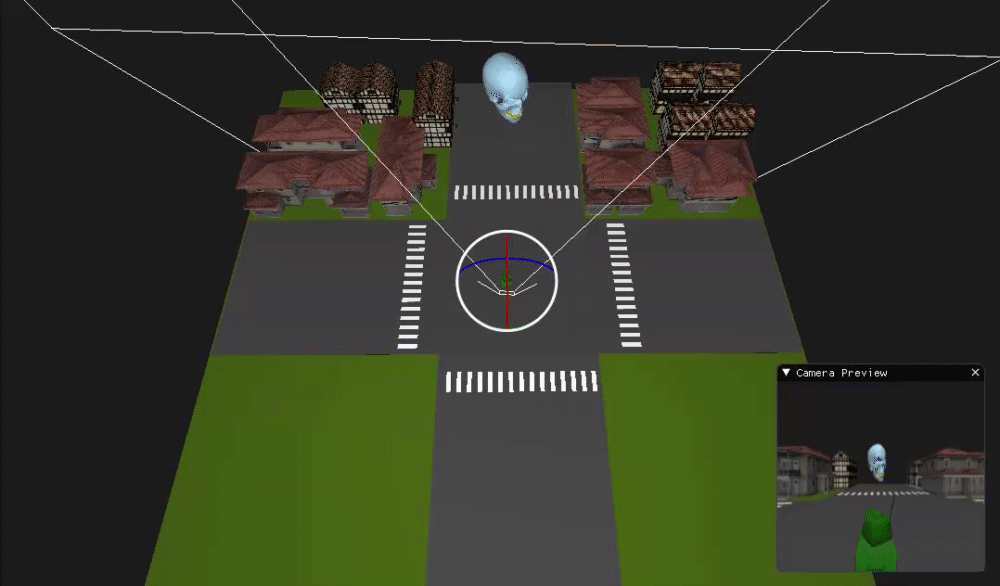

> Cette image provient de : [马克·加尔维斯 - 主页 (optus23.github.io)](https://optus23.github.io/)

Si vous connaissez la [transformation de la vue 3D](https://zhuanlan.zhihu.com/p/597152918), vous savez qu'il est possible de déterminer si un objet est dans la plage de la caméra en calculant tous les sommets de l'objet via la matrice de la caméra.

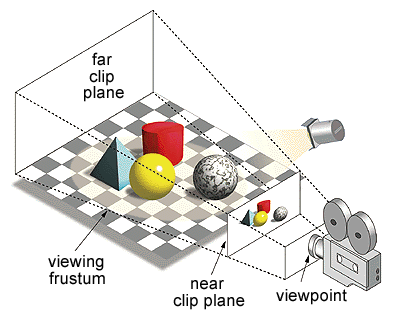

Mais évidemment, un objet peut avoir des milliers de sommets. Si on calcule chaque sommet, le moteur de jeu deviendrait probablement un lecteur PPT ~

Pour simplifier ce processus, les moteurs de jeu utilisent un raccourci : ils remplacent les sommets de l'objet par une boîte simple qui l'englobe pour effectuer le calcul d'élimination par la caméra. Bien que le nombre de sommets de la boîte soit faible et que la détermination de la visibilité ne soit pas très précise, l'amélioration des performances est considérable.

> Logiquement, on peut considérer que si la boîte est visible, l'objet est nécessairement visible.

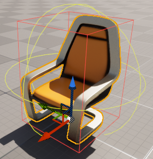

> Afficher la boîte englobante de l'objet : `ShowFlag.Bounds 1`

Il est donc important de comprendre ce point : **dans le moteur, pour déterminer si un objet est dans la plage de la caméra ou est occulté, en général, on ne se réfère pas aux informations des sommets de l'objet lui-même, mais à sa boîte englobante.**

Pour le **maillage statique (StaticMesh)**, ses sommets sont statiques, et le moteur génère automatiquement les informations de la boîte englobante lors de la création de l'actif.

Mais pour les effets spéciaux, étant donné que les particules sont dynamiques, leur boîte englobante ne peut pas être générée statiquement.

Dans UE, pour les **particules CPU**, le moteur recalcule les limites de la boîte englobante de Niagara à chaque frame :


Mais les **particules GPU**, en raison de la particularité de leur implémentation (toutes les données des particules sont sur le GPU et le nombre de particules est souvent très élevé), ne permettent pas au côté CPU de calculer en temps réel la boîte englobante des particules. Le développeur **doit** définir une **limite fixe**, c'est-à-dire définir manuellement la taille de la boîte englobante.

> Les particules GPU sont pilotées par un pipeline de rendu GPU. Tout le processus n'implique pratiquement aucune interaction avec le CPU, et les données du pipeline de rendu graphique sont souvent unidirectionnelles : CPU->GPU. Bien qu'il soit possible de lire des données depuis le GPU, ce processus présente un certain délai et un coût de performance très élevé.)

Dans Niagara, vous pouvez définir la boîte englobante de l'**émetteur de particules** ici :

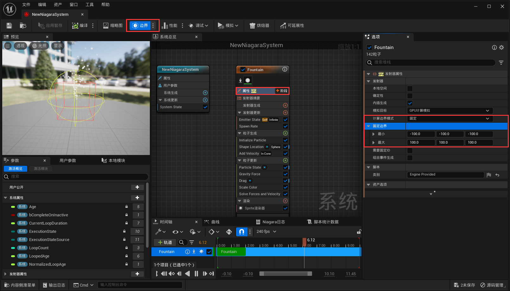

La façon la plus simple est de définir la boîte englobante pour **l'ensemble du système de particules** :

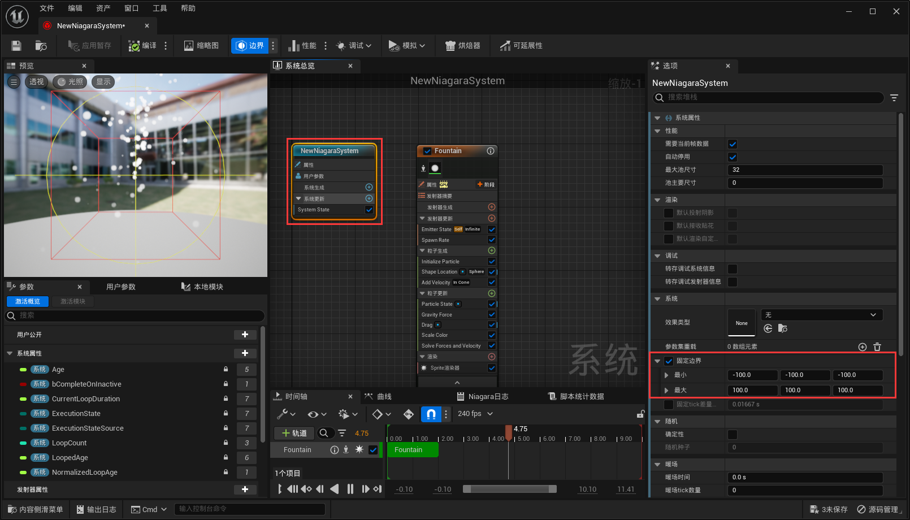

**Les créateurs doivent garantir la correction de la boîte englobante** (la boîte englobante doit couvrir l'espace de mouvement de l'effet avec la zone la plus petite possible), sinon les conséquences suivantes se produiront :

- Si la boîte englobante de l'effet ne correspond pas à l'espace de mouvement réel, cela entraînera un rognage visuel incorrect :


- Si la boîte englobante de l'effet est trop grande, cela entraînera que des effets qui ne sont pas dans le champ de vision ne peuvent pas être éliminés et continueront à être rendus, causant une perte inutile.

  

### Cycle de vie

Pour les **effets de scène**, leur cycle de vie est géré au niveau de l'Actor par la scène, et en général, nous n'avons pas besoin de nous en soucier. En revanche, pour les **effets de génération**, il existe des détails importants sur la gestion du cycle de vie que nous devons connaître :

Les **effets de génération** sont ceux générés à l'aide de plusieurs fonctions de la **UNiagaraFunctionLibrary** :

``` c++
UNiagaraComponent* SpawnSystemAtLocation(const UObject* WorldContextObject,
                                         class UNiagaraSystem* SystemTemplate, 
                                         FVector Location, 
                                         FRotator Rotation = FRotator::ZeroRotator,
                                         FVector Scale = FVector(1.f), 
                                         bool bAutoDestroy = true,
                                         bool bAutoActivate = true, 
                                         ENCPoolMethod PoolingMethod = ENCPoolMethod::None,
                                         bool bPreCullCheck = true);

UNiagaraComponent* SpawnSystemAttached(UNiagaraSystem* SystemTemplate,
                                       USceneComponent* AttachToComponent,
                                       FName AttachPointName,
                                       FVector Location, 
                                       FRotator Rotation,
                                       FVector Scale, 
                                       EAttachLocation::Type LocationType, 
                                       bool bAutoDestroy, 
                                       ENCPoolMethod PoolingMethod, 
                                       bool bAutoActivate = true,
                                       bool bPreCullCheck = true);
```

**SpawnSystemAtLocation** est utilisé pour générer un composant de particules à une position spécifiée, tandis que **SpawnSystemAttached** est utilisé pour attacher un composant à un autre composant de scène. Concernant le cycle de vie, nous devons principalement nous concentrer sur plusieurs paramètres :

- **bAutoActivate** : Si l'activation est automatique, true signifie que l'effet de particules se joue immédiatement par la suite.
- **bAutoDestroy** : Si la destruction est automatique, true détruira le composant une fois que les particules ont terminé de se jouer.
- **bPreCullCheck** : Pré-élimination. Si true, si la boîte englobante du système de particules généré n'est pas dans le volume de vue, le composant de particules ne sera pas généré, c'est-à-dire que la valeur de retour sera null.
- **PoolingMethod** : Opération de pool, mécanisme de réutilisation du composant de particules. Ses valeurs peuvent être :
  - **None**
  - **AutoRelease** : Libération automatique. Après la fin de la lecture, le composant est automatiquement stocké dans le pool d'effets pour réutilisation.
  - **ManualRelease** : Libération manuelle. Il faut appeler manuellement **ReleaseToPool** pour que le composant de particules soit réutilisé.
  - ManualRelease_OnComplete : Option non publique, utilisée pour le contrôle de l'état interne de Niagara. Ne l'utilisez pas.
  - FreeInPool : Option non publique, utilisée pour le contrôle de l'état interne de Niagara. Ne l'utilisez pas.

#### Pool d'effets

> Pour le mécanisme détaillé, veuillez consulter l'article : [【UE4】Pool d'effets - 知乎 (zhihu.com)](https://zhuanlan.zhihu.com/p/394772587)

##### Mécanisme de cache

Le but du pool d'effets est principalement de pouvoir réutiliser les composants de particules. Son mécanisme de cache peut être considéré comme suit :

- Si les paramètres de génération incluent une opération de pool (c'est-à-dire `PoolingMethod != ENCPoolMethod::None`), alors Niagara recherchera dans le pool d'effets s'il existe un composant de même type réutilisable. S'il en existe un, il l'utilisera ; sinon, il créera un nouveau composant de particules et enregistrera son temps d'utilisation.
- Le nouveau composant de particules créé ne sera pas libéré (**ce qui signifie que bAutoDestroy deviendra inopérant**), il sera stocké dans le pool d'effets pour gestion.
- Pour les composants de particules **AutoRelease**, lorsque la lecture est terminée, le pool d'effets les marquera comme réutilisables.
- Pour les composants de particules **ManualRelease**, lors de l'appel de **ReleaseToPool**, si les particules ont déjà terminé de se jouer, elles seront immédiatement marquées comme réutilisables ; sinon, l'opération de pool sera modifiée en **ManualRelease_OnComplete**, et elles seront également marquées comme réutilisables une fois la lecture terminée.

##### Méthode de nettoyage

**UNiagaraComponentPool** dispose d'un mécanisme de nettoyage定时. Deux paramètres clés principaux sont :

- **GNiagaraSystemPoolKillUnusedTime** : Par défaut 180
- **GNiagaraSystemPoolingCleanTime** : Par défaut 30

Le mécanisme de nettoyage automatique correspondant à la configuration ci-dessus peut être approximativement considéré comme suit : UNiagaraComponentPool nettoie les composants de particules qui n'ont pas été réutilisés depuis plus de 180s toutes les 30s.

> En réalité, ce n'est pas un nettoyage Tick, mais un nettoyage lors de chaque réutilisation, donc il n'est pas nécessairement 30s, la déviation peut être assez grande.

Lors du changement de World, **UNiagaraComponentPool** exécutera Cleanup.

Vous pouvez également appeler manuellement **UNiagaraComponentPool::ClearPool(UNiagaraSystem* System)** pour nettoyer.

#### Pièges

- Si une opération de pool (**PoolingMethod**) est présente, alors **bAutoDestroy** deviendra inopérant.
- Le mécanisme de pool fonctionne correctement uniquement si le système de particules peut terminer sa lecture. Veuillez noter :
  - Assurez-vous qu'il n'y a pas d'émetteur avec un cycle de vie infini dans le système de particules.
  - Si ResetParticles(true) est appelé, Complete ne sera pas atteint.
  - Si la **réaction à l'élimination de l'élimination extensible est休眠**, les **effets éliminés ne seront pas réutilisés**, et **OnSystemFinished ne se déclenchera pas** (ce qui n'est pas strictement considéré comme terminé).
- Pour les composants de particules avec une opération de pool, **ne pas appeler DestoryComponent**. Les composants de particules dans le pool seront nettoyés lors du changement de World ou定时.
- Si **SpawnSystemAttached** est accompagné d'une opération de pool, alors le **vrai propriétaire** du nouveau composant de particules généré est World, et non le composant attaché. Le composant de particules **ne sera pas détruit avec le composant attaché**.
- Appeler **ReleaseToPool** sur un composant de particules **AutoRelease** entraînera une erreur.
- Pour les particules qui n'ont ni **AutoRelease** activé ni d'opération de pool, il faut contrôler strictement leur cycle de vie.

### Extensibilité

En définissant la boîte englobante, les particules peuvent être éliminées **visuellement**, mais il faut noter que le système de particules est différent des objets de scène ordinaires : il y a également un **coût de simulation** !

C'est un problème que beaucoup d'artistes特效 négligent facilement lors de l'utilisation de Niagara. Beaucoup pensent que les particules s'arrêtent quand on ne les voit pas, mais en réalité, ce n'est pas le cas : elles continuent de s'exécuter :


Pour les effets de génération, étant donné qu'ils ont un cycle de vie certain, leur consommation de simulation est généralement insignifiante dans la plupart des cas.

Mais pour les effets de scène, si le nombre de NiagaraActor disposés dans la scène est trop élevé, l'impact sur l'ensemble du programme est très important.

Pour résoudre ce problème, UE fournit un actif nommé **type d'effet (NiagaraEffectType)**, utilisé pour contrôler **la stratégie d'optimisation de la simulation** du Niagara System.

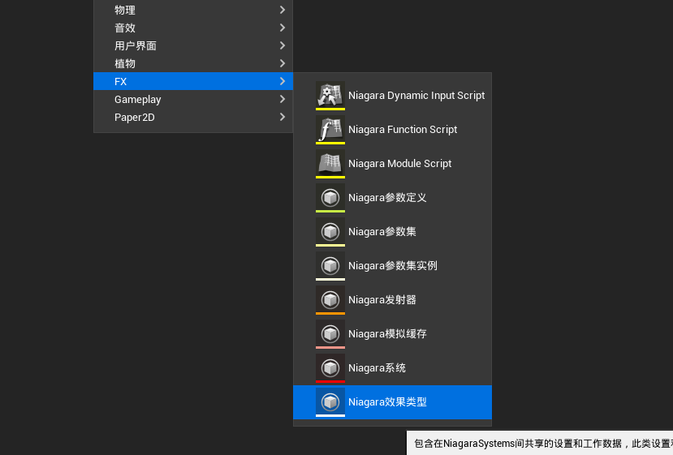

Nous pouvons spécifier le type d'effet utilisé par NiagaraSystem ici :

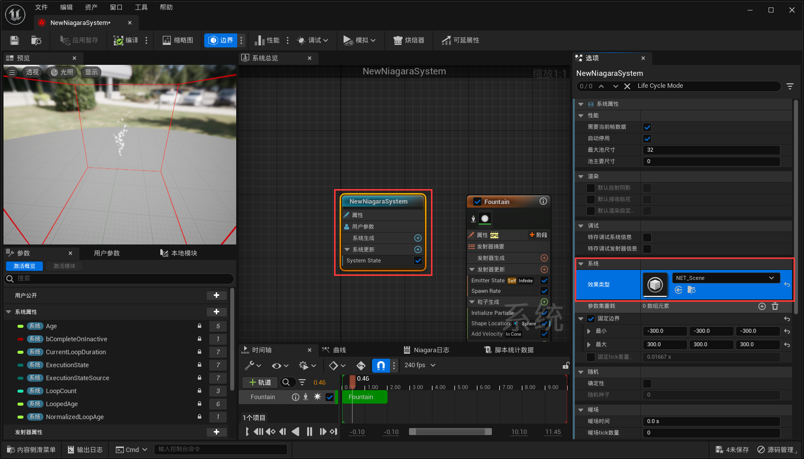

Son utilisation permet de répondre aux besoins suivants :

- Limiter la distance maximale d'affichage du système de particules.
- Limiter le nombre maximal de systèmes de particules affichés dans le viewport actuel.
- Ajuster les effets des particules selon le budget de performance.
- Ajuster le coefficient d'échelle du nombre d'émissions de l'émetteur.

Son panneau de configuration est le suivant :

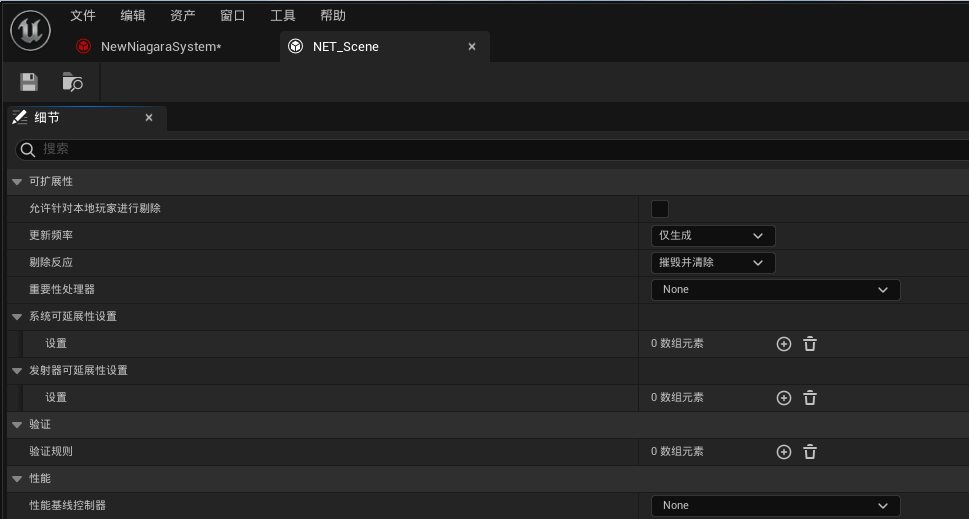

Nous pouvons ajouter des configurations d'extensibilité pour le système et l'émetteur. Chaque configuration correspond à une stratégie d'extensibilité adoptée pour différents niveaux de performance :

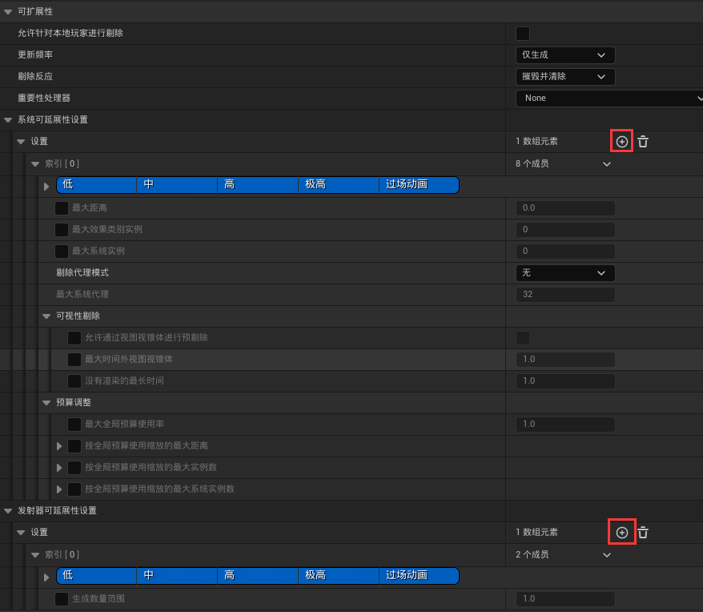

La signification de ses paramètres est la suivante :

- Exécuter l'élimination pour le joueur local : Autoriser ou non l'élimination des effets générés, attachés ou créés par le joueur local.

- Fréquence de mise à jour : `Seulement génération`, `Basse`, `Moyenne`, `Haute`, `Continue`

  **NiagaraEffectType** et **NiagaraComponent** sont tous deux gérés par **NiagaraWorldManager**. **NiagaraEffectType** effectuera un Tick séparé. La fréquence de mise à jour ici fait référence à la fréquence à laquelle il détecte l'état actuel du **NiagaraSystem**. Plus la fréquence est élevée, plus la réaction à l'élimination est rapide, mais le coût de performance est également plus élevé.

- Réaction à l'élimination : `Détruire`, `Détruire et nettoyer`, `Dormir`, `Dormir et nettoyer`

  Nettoyer tuera immédiatement toutes les particules, puis éliminera le NiagaraSystem. Si on ne nettoie pas, de nouvelles particules ne seront pas générées, et on attend que tous les cycles de vie des particules existantes se terminent avant d'éliminer.

  La différence entre détruire et dormir est que détruire supprime directement les particules, tandis que dormir peut être considéré comme simplement cacher les particules en attente d'activation.

  Pour les effets de scène, étant donné qu'ils sont des Actor placés dans la scène, ils ne seront pas régénérés après destruction, donc on définit généralement dormir. La destruction et le chargement spécifiques sont gérés par le大世界.

  Pour les effets de génération, ils sont généralement générés une seule fois. Si on définit dormir, ils occuperont constamment de la mémoire, donc on les détruira généralement.

  Dans UE 5.3, un mécanisme de `pause` a été ajouté. La différence entre pause et dormir est que la pause ne se réactivera pas et conservera les données actuelles des particules (occupant de la mémoire).

- Processeur d'importance : `Âge`, `Distance`

  Le processeur d'importance est principalement lié au **nombre maximal d'instances de système** ci-dessous. Le nombre maximal de proxys de système détermine combien d'instances de système de particules du même type sont autorisées à un moment donné. Le processeur d'importance détermine la priorité de tri des particules. Par exemple, si la distance est la cible, il y a dix systèmes de particules et le nombre maximal d'instances de système est cinq, alors **NiagaraEffectType** conservera seulement les cinq effets de particules les plus proches.

- Paramètres d'extensibilité du système

  **Liste de paramètres**, chaque ajout d'un paramètre permet de configurer les environnements dans lesquels ce paramètre prend effet.

  

  - Distance maximale : Éliminer les particules selon la distance entre l'effet et le joueur actuel.

  - Mode de proxy d'élimination : `Rendering instancié`. Si **Rendering instancié** est activé, un système de particules invisible sera créé, et tous les autres systèmes de particules du même type éliminés utiliseront ce système pour le rendu, ce qui évite un coût de simulation important.

  - Nombre maximal de proxys de système : Nombre maximal de proxys de système.

  - Ajustement du budget : Ajuster la stratégie d'extensibilité du système de particules selon un certain budget.
  - Élimination de visibilité : Éliminer selon la visibilité.

> Pour des explications détaillées, veuillez consulter le Tooltip du panneau de l'éditeur.

Pour les effets de scène, l'auteur recommande vivement de définir uniformément un tel type d'effet pour tous les effets de scène :

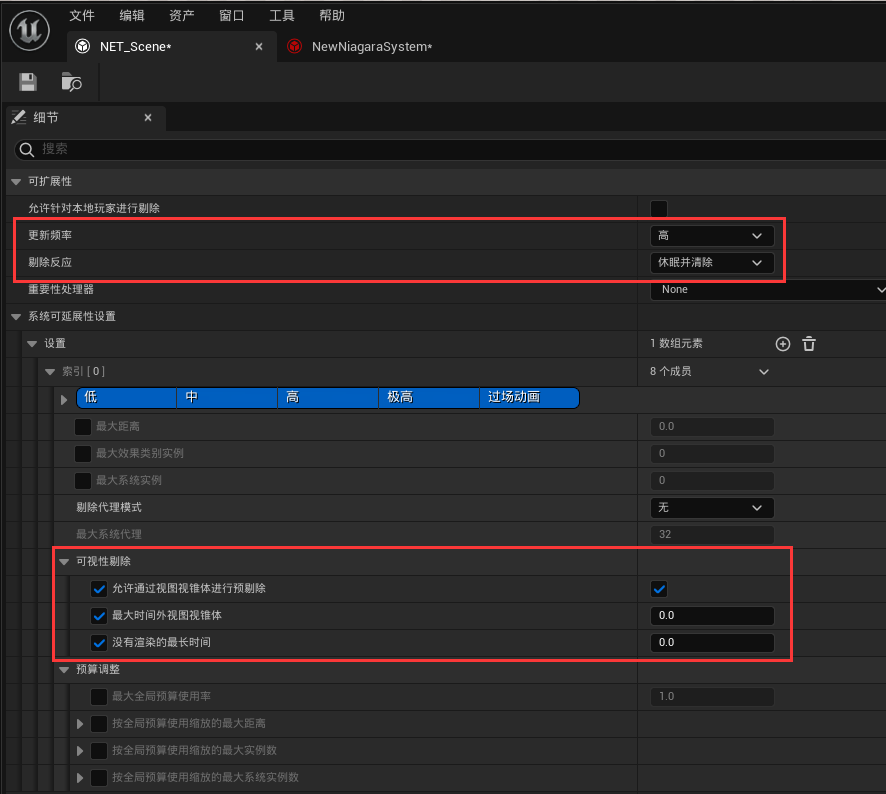

La configuration达到的效果是：当粒子系统不可见时，既会停止渲染，也会停止模拟


当某些特效需要专门配置剔除策略时，Niagara支持对单独的 NiagaraSystem 和 NiagaraEmitter 进行 **可延展性重载** ，它能 **覆盖** NiagaraEffectType 的配置：

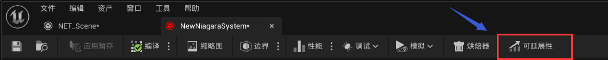

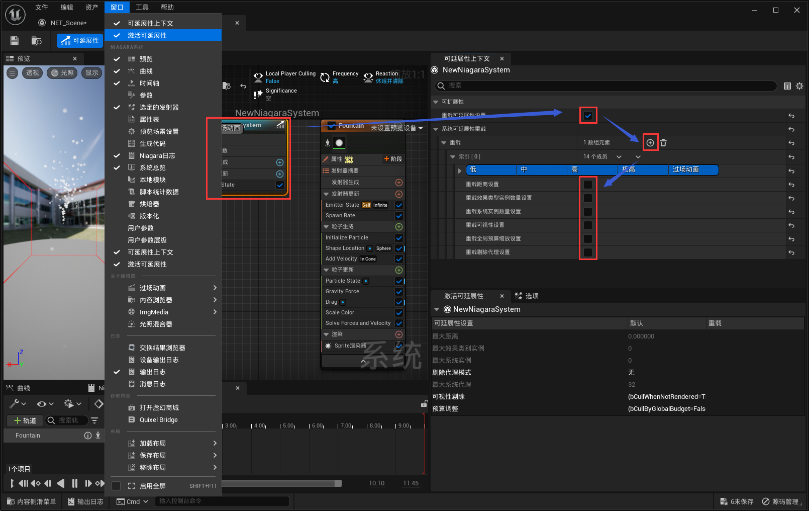

关于 **Niagara Effect Type** 详细配置的示例，可以参考：https://www.youtube.com/watch?v=-P3yaZNgeg0

### LOD

Niagara提供了LODDistance的内置变量，我们可以依据它的数值，对Niagara的性能参数进行一些距离上的适配

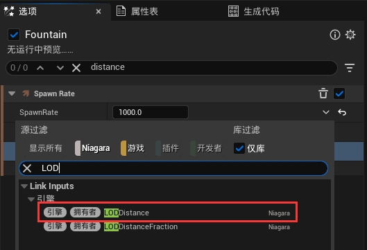

比如，通常会对生成数量制作LOD：

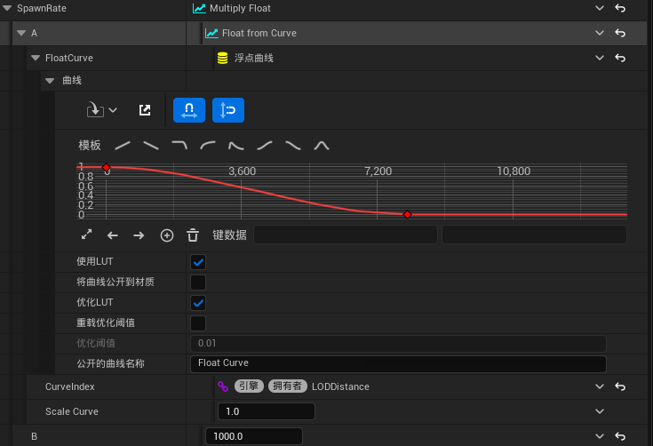


### 暖场时间

对于放置在场景中的循环特效 ，它往往会有一段`”预热“`的时间，在Niagara中，我们可以设置系统的暖场时间来把这段预热过程给掐掉：

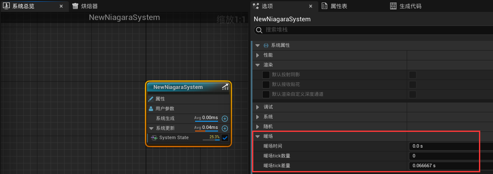

对于具有 可视性裁剪 的场景特效，休眠裁剪 会重新激活粒子，这个时候会重新播放预热过程：


但设置 暖场时间 把 预热过程 裁剪掉之后，效果是这样的：


### 管控发射器数量

理想的情况是：只要两个发射器所使用的渲染器参数是完全一致的，那么它们就应该使用同一个发射器

因为发射器中的一个渲染器对应一条图形渲染管线，粒子系统本质上是处理图形渲染管线所需的实例化数据

多一个发射器就会多一份渲染数据，并且要多维护一个粒子缓冲区

如果只是想调整粒子的运动机制，可以通过自定义Module的方式进行扩展

### 界定CPU粒子和GPU粒子

CPU粒子：适用于少量的粒子渲染，由于数据位于CPU中，因此能获取到整个场景的信息，可以很方便地跟游戏逻辑进行交互，支持粒子间的事件通信，精准的物理碰撞，还可以动态地计算包围盒边界。

GPU粒子：有着非常低的性能损耗，适合用来渲染大量（十万级别）的粒子。

在界定时，首先思考的维度是粒子数量，如果是粒子数量非常少（比如几个或几十个），那么最好使用CPU粒子（因为没必要为了几个粒子增加GPU的调度开销）

当数量超过一千时，我们考虑的是：功能需求是否需要用到CPU粒子的特性，如果不需要，那么优先使用GPU粒子。

当粒子数非常多，但又需要使用CPU粒子特性时，需要在较低级别的代码维度去扩展GPU粒子的功能。

## 优化

关于性能优化，我们大多数时候追求的是：在满足美术需求的同时，不造成性能上的卡顿。

整个指标非常模糊，对于大多数初学者而言，我们能做的，只有亡羊补牢。

所以第一点至关重要，我们需要能够发现性能问题，才能进一步去制定优化计划。

### 性能定位

UE提供了非常多的指令和工具来检测场景的执行性能，以下视频可作为参考：

- [[官方培训\]22-UE资产优化 | Epic 肖月_哔哩哔哩_bilibili](https://www.bilibili.com/video/BV1FT411x7hU/?spm_id_from=333.337.search-card.all.click)
- [[UnrealCircle苏州\]UE4性能优化 | 周华 苏州谜匣数娱_哔哩哔哩_bilibili](https://www.bilibili.com/video/BV1FV411G72Q/?vd_source=e173296de020f10e8476ed443bbdfaed)
- [【搬运】UnrealFest2023 UE5性能优化_哔哩哔哩_bilibili](https://www.bilibili.com/video/BV1Yj41147dh/?vd_source=e173296de020f10e8476ed443bbdfaed)

对于引擎人员，一般需要能够熟练使用 **RenderDoc** ， **Unreal Insight** ，各类Stat指令，从这些地方，我们可以获取到非常精细的性能数据。

而对于Niagara，UE中提供了专门的工具来监控Niagara的执行情况 —— **Niagara调试器（Niagara Debugger）**

我们可以在此处打开NiagaraDebugger：

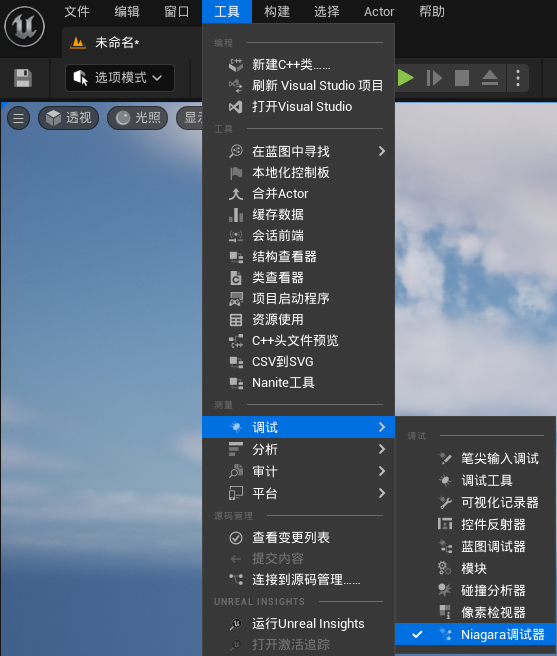

也可以在NiagaraSystem的细节面板中启动调试器：

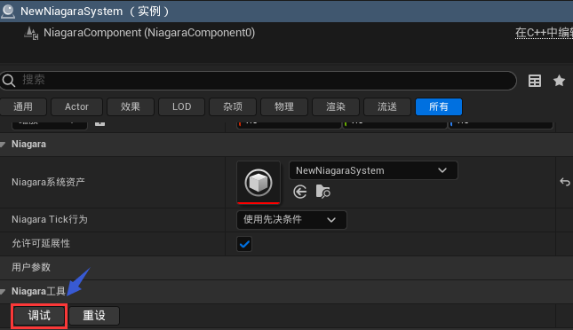

####  调试Hud

在`调试Hud`页面中，提供了许多可供配置的Niagara调试视图。

勾选 `调试视图已启用`，我们能看到当前场景中正在执行的所有粒子系统的粒子数量和内存

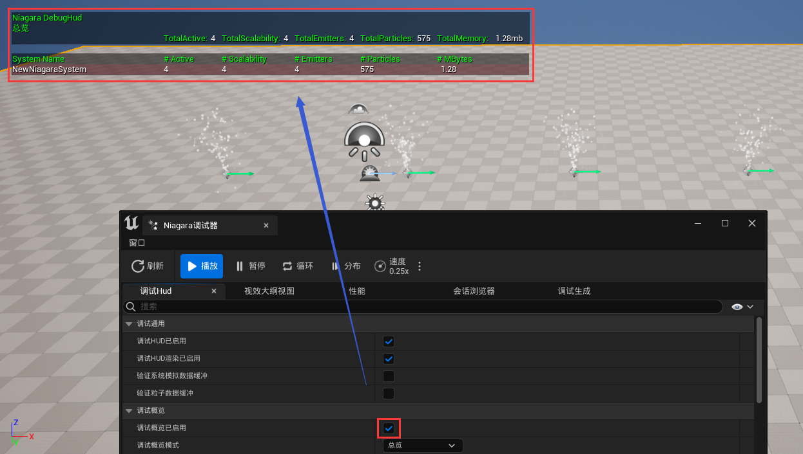

可以勾选 `系统显示边界` 来显示NiagaraSystem的包围盒：

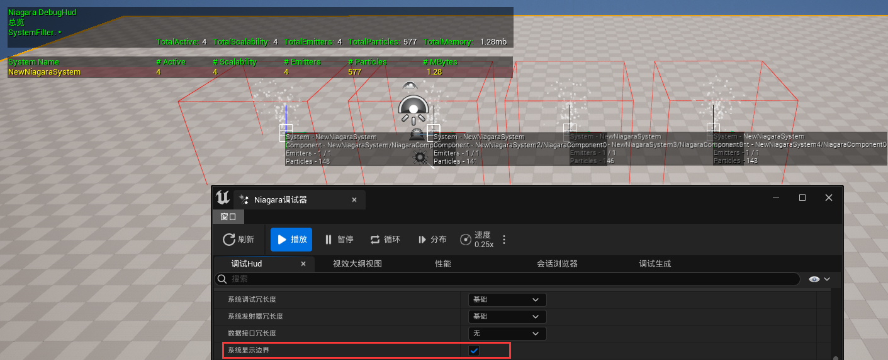

勾选 `显示系统属性`，并添加 属性匹配字符串 ，来增加粒子系统的调试预览视图：

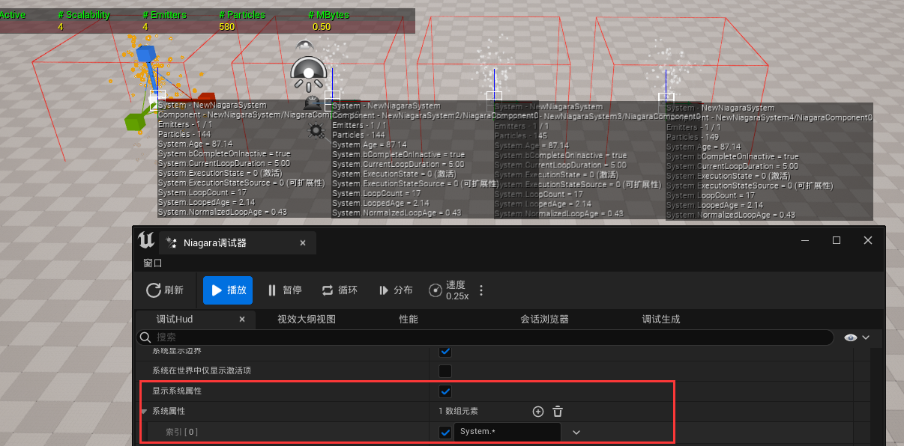

同样也可以预览粒子属性：

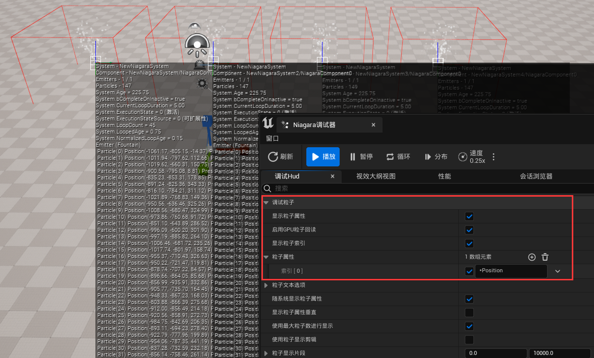

当场景中粒子系统比较多时，为了排除其他粒子调试视图的干扰，我们可以设置 命名过滤 来选择调试器需要关注的粒子系统：

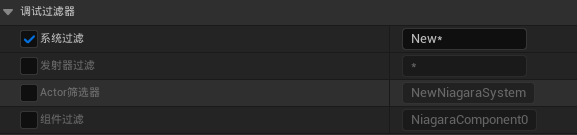

> 该配置只关注命名以`New`开头的粒子系统

#### 视效大纲视图

视效大纲用于对场景中的Niagara进行 **截帧** ，它支持三种视图模式：

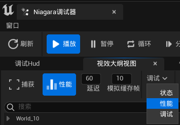

点击 捕获（Capture） 就能截取 Niagara 的执行情况（可配置截取的延迟时间和帧的数量）：


状态模式下，我们可查看场景中所有粒子系统的激活情况，模拟类型（CPU/GPU），粒子数量：


性能模式下，可进一步查看粒子系统在游戏线程和渲染线程的执行消耗


调试模式下，我们可以获取到粒子系统执行时的具体粒子数据：


#### 性能

性能视图提供了一些测试手段：


#### 调试生成

调试生成 就是提供了一个界面去Spawn特效粒子，只需配置完粒子系统之后点击`生成系统`（需要在PIE模式下）


#### 模块性能

Niagara的编辑器中可以获取到每个模块的耗时情况：


#### 资源占用

可以在资产的内容菜单中，点击`尺寸贴图`查看引用贴图的大小：


#### 问题及建议

- 在 Unreal Engine 5.1版本之前，Niagara System存在 **重编译BUG** ，它的表现效果是：首次在游戏中生成粒子时，会触发整个粒子系统的重编译，这是由于在 Niagara System Editor 中进行资源保存，存储了与游戏模式下 不同的一些配置，导致粒子系统的HashID不一致，从而引起编译缓存的失效，因此如果需要评估粒子系统在游戏环境中的执行性能，笔者建议在打包环境下进行测试。
- Unreal Engine 为 Niagara 提供了非常完善的配套工具，但对于一个大型团队而言，它是易于使用，但不易于管理的，笔者非常建议在上述工具集的基础上，进行进一步的扩展，增加自动化流程，来完成宏观的粒子系统管理。
- 对于一些常规的渲染优化，如优化材质，简化模型，降低Overdraw，对Niagara同样适用。

### 制作优化

在亡羊补牢的过程中总结出来的优化经验是弥足珍贵的，它能让制作人员逐渐地了解怎样才能制作出性能卓越的粒子特效。

以下是一些能够帮助特效师优化制作的心得（主要针对GPU粒子）

#### 算力认知

`1920 x 1080`是当下电脑显示器常见的分辨率，这代表了屏幕上有将近 **两百万** 个像素点，也意味着电脑绘制一帧图像至少需要做两百万次像素级别的数值处理，而目前一些中端硬件设备上，可以轻易在一秒内绘制成百上千张图像，这惊人的算力得益于 图形处理单元（GPU）的高速发展，与 中央处理单元（CPU）不同的是，CPU是电脑的调度中心，它的架构需要兼顾系统的方方面面，而GPU则是一种剑走偏锋的做法，它的架构中塞入了大量的计算单元以满足图形运算的需求。

> 以当下尖端的消费级显卡 `GeForce RTX 4090` 为例，它具有七百六十多亿个晶体管、一万六千多个计算核心。

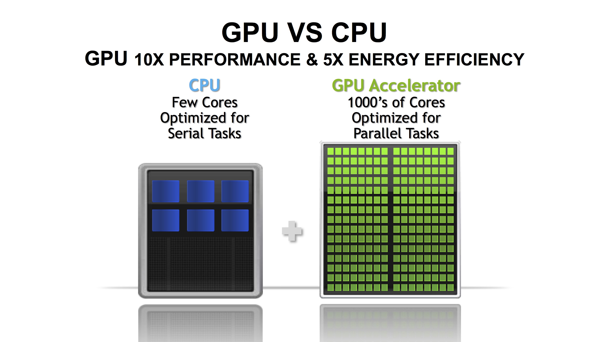

在清楚这个上限之后，我们可以简单将 `单个GPU粒子` 跟 `像素点` 进行对应，也就是通常情况下，中端显卡也能轻松模拟百万级别数量的粒子效果。

但需要注意的是，百万级别往往是整个系统的上限，我们通常不可能将所有性能预算都留给粒子系统，所以在一般情况下，如果整体的粒子数量超过十万，就可能会对整个渲染系统造成性能压力。

如果将这十万粒子转换为对应数量的`1x1`的像素点进行平铺，它大约对应了`300x300`尺寸大小的图像：


粒子系统的 **占屏面积** 越接近它的 **平铺面积** ，则意味着它的性能越好（因为有更少的OverDraw）

以下是一个平平无奇，但却具有14万粒子数量的NiagaraSystem，它辜负了这么大数量所应匹配的表现效果：


并且随着视野的远离，它的OverDraw越来越严重：

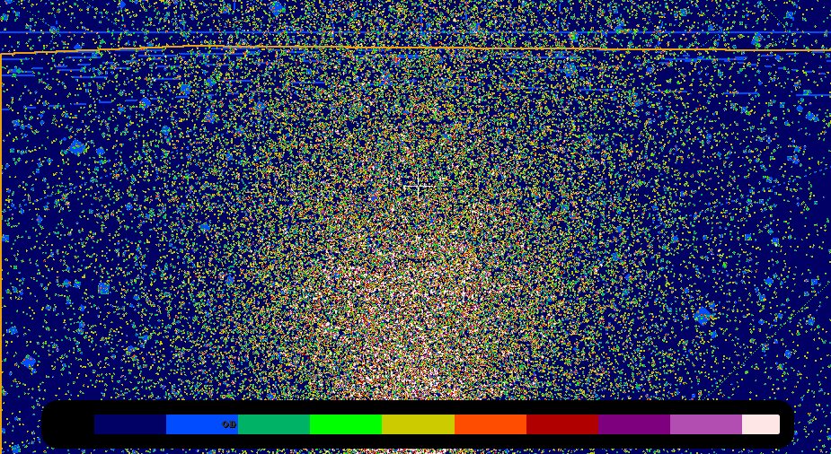

> 这个问题可以使用LOD曲线根据距离来优化粒子数量。

#### 底层原理

Niagara本身是UE提供的一个可编程的数据处理器，在NiagaraEditor中，我们可以自由管控这个处理器的处理结构：


并在各个 **阶段（Stage）** 中，使用引擎提供的 可视化节点 编写相应的 **模块（Module）** ，来制定数据的处理逻辑：


这些可视化的节点逻辑将会被翻译为ComputerShader的代码：


而数据处理的结果，将绑定到渲染器对应的属性插槽，供给渲染器来完成粒子效果的最终表达：


从数据处理层面来进行思考，我们的关键目标是怎样制作一个高效的数据处理器，因此掌握Niagara底层模块的原理，对整体性能和效果的把控，至关重要。

这里有一个非常优秀的教程：

- [[官方培训\]09-UE粒子基础 | 肖月 Epic bilibili](https://www.bilibili.com/video/BV1ea411V76f/?vd_source=e173296de020f10e8476ed443bbdfaed)

#### 序列帧烘培

Niagara Editor 支持将粒子特效烘培为序列帧，对于一些固定视角的特效，我们可以采取此方案来获得极大程度的优化。


#### 程序化内容生成

粒子系统主要 **适用** 于模拟 **大量** **动态** 的物体，但只有一些特定需求下，我们才不得不使用粒子系统来进行 **实时的模拟** ：

- 制作可交互的动态效果
- 需要营造无视觉死角的立体效果
- 非常大数量的大范围集群

排除以上的使用场景，我们通常可以通过 **烘培静态材质** 来达到想要的表现效果。

所以我们在制作粒子效果时，需要认真审视：是否需要用粒子系统来进行实时的模拟？

如果要，那么我们再思考：是否可以将，粒子系统中某些实时计算的阶段，换成已经预制的静态数据。

比如在制作跟场景相关的特效时，粒子的模拟可能会需要一些场景信息作为输入，而这些场景数据绝大多数情况下都是静态的，我们没必要在运行时去实时计算场景的相关信息，在编辑器中就能静态生成这些数据，这样就可以以较少的性能成本制作出跟场景高度融合的特效，这在粒子系统数量比较多的情况下，提升尤为明显。

我们也可以在Niagara上制作  **程序化内容生成（PCG）** 的资产：

-   在 **Niagara System** 的 **用户参数（User Parameters）** 中，添加粒子系统所需要的场景数据（这里添加了一个名为`SpawnPositionArray`的变量）：


- 创建一个新的 **Actor 蓝图** ，添加 **NiagaraComponent** ，并指定 **Niagara System**

- 在蓝图的 **BeginPlay** 事件中去设置我们在Niagara中添加的参数，并将参数输入 `提升为变量` （`Partcile Spawn Position Array`）：

  

- 在 蓝图中 添加一个函数（例如叫 `CalcParticleSpawnPositionArray`），并勾选 **Call In Editor** ，在这个函数中获取场景信息（无需关心性能，可以扫描Actor，打射线...），填充蓝图变量值（`Partcile Spawn Position Array`）：

  

- 将Actor蓝图放到场景中，可以发现它的细节面板中，之前创建的函数变成了一个可点击的按钮：

  

- 点击按钮将执行对应的函数逻辑，它将会将执行并填充蓝图属性，这些属性值将会在保存时被序列化，当正常启动游戏时，执行BeginPlay，将会把这些数据提交给Niagara

- 之后可以在Niagara中编写相应的Module来使用这部分数据。

> 需要注意的是，我们不能直接在`CalcParticleSpawnPositionArray`去设置Niagara的参数值，而是借助蓝图的变量属性序列化来存储场景数据。
>
> 这是因为 设置Niagara参数的函数（以`NiagaraSet...`开头），是直接将数据上传给Niagara的数据处理器，而不会进行存储，因此通过函数来设置Niagara参数，在NiagaraSystem的细节面板上不一定能看到参数发生变化（有一部分属性类型是做了编辑器数据的返回同步，所以能在细节面板看到变更）