# Développement audio

Pendant longtemps, le rendu a été un point chaud des moteurs graphiques, tandis que l'audio semblait difficile à attirer l'attention des développeurs. Mais en réalité, l'audio non seulement peut augmenter l'expérience interactive immersive, mais aussi améliorer davantage l'expressivité de l'image :

<p style="text-align:center"><iframe width="560" height="315" src="//player.bilibili.com/player.html?aid=797879954&bvid=BV1iy4y167pf&cid=259593464&p=1&autoplay=false" scrolling="no" border="0" frameborder="0" framespacing="0" allowfullscreen="true"></iframe></p>

C'est précisément pour cela que j'ai eu la passion pour le développement de programmes. Afin de permettre à l'audio d'avoir un meilleur effet de représentation graphique, j'ai finalement entré dans le domaine du moteur graphique~

Cet article commencera par expliquer les connaissances de base de l'audio, puis présentera les interfaces audio couramment utilisées dans UE5, ainsi que certaines algorithmes courants de **traitement numérique du signal (Digital Signal Process, DSP)**. Et enfin —— embrasser **Meta Sound**.

> Je ne suis pas un développeur audio professionnel. Si vous trouvez des erreurs, n'hésitez pas à me corriger~

## Connaissance de l'audio

### Qu'est-ce que l'audio ?

Comme tout le monde le sait, le son est produit par des vibrations, comme ceci :

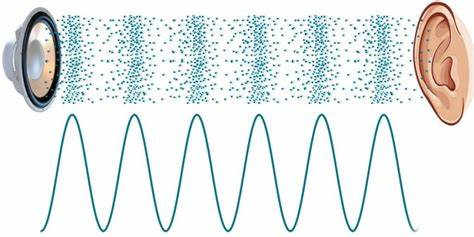

> Image source : [How Does Sound Travel From One Medium To Another? (scienceabc.com)](https://www.scienceabc.com/pure-sciences/movement-of-sound-waves-through-different-media.html)

Voici deux vidéos qui expliquent bien la nature du son :

- [What is Sound-The Dr. Binocs Show](https://www.bilibili.com/video/BV16C4y187Xy)
- [What is Sound-BranchEducation](https://www.bilibili.com/video/BV1pR4y1L7WD)

Nous considérons généralement le son comme une onde continue, comme ceci :

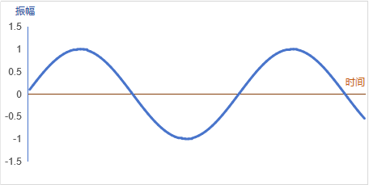

La précision de stockage de l'ordinateur est limitée (il y a une infinité de décimales entre 0 et 1). Si nous voulons stocker les données audio dans l'ordinateur, nous serons confrontés à des problèmes de traitement de précision sur deux dimensions :

- Temps
- Amplitude

Pour cela, nous utilisons la [technique de modulation d'impulsion codée (Pulse Code Modulation, PCM)](https://baike.baidu.com/item/脉冲编码调制/5143788?fromModule=lemma_inlink) pour convertir le **signal continu (Continuous Signal)** du son en **signal discret (Discrete Signal)**.

Tout d'abord, nous traitons la division de précision sur la dimension temporelle par **échantillonnage (Sampling)** :

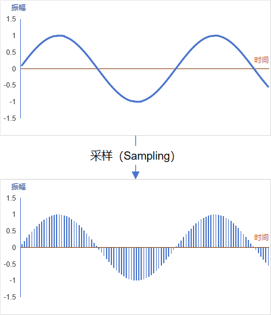

Le paramètre de précision d'échantillonnage sur la dimension temporelle est le **taux d'échantillonnage (Sample Rate)**, qui représente le nombre d'échantillonnages du signal audio par unité de temps (1s). Les taux d'échantillonnage courants sont `44100 Hz`, `48000 Hz`...

Après avoir obtenu les données échantillonnées, nous traitons la division de précision sur la dimension de l'amplitude par **quantification (Quantize)** :

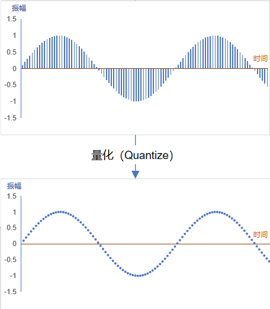

La précision d'échantillonnage sur la dimension de l'amplitude est la **profondeur de bit (Bits Per Sample)**, qui représente la précision de stockage en bits d'un échantillon audio. Les profondeurs de bit courantes sont `8 bit`, `16 bit`, `24 bit`, `32 bit`. Par exemple, `8 bit` équivaut à `1 octet`, peut représenter `256 (2^8)` nombres, et compte tenu du bit de signe, sa plage de valeurs est `[-128, 127]`, ce qui peut être considéré comme ayant 128 gradients d'amplitude.

Concernant l'échantillonnage et la quantification, voici un excellent article :

- [音视频开发基础入门｜声音的采集与量化、音频数字信号质量、音频码率 - 知乎 (zhihu.com)](https://zhuanlan.zhihu.com/p/577850804)

Les données que nous obtenons finalement sont généralement appelées **tableau d'onde (Wave Table)**. Si nous ne considérons pas la précision de stockage de la profondeur de bit et utilisons des nombres flottants pour représenter l'amplitude, en C++, nous pouvons la représenter comme cette structure de stockage :

``` c++
std::vector<float> WaveTable = {
    sample0,sample1,sample2,sample3,sample4...
}
```

En ouvrant les paramètres de son de l'ordinateur, nous pouvons constater que chaque périphérique audio (entrée ou sortie) a des configurations associées :

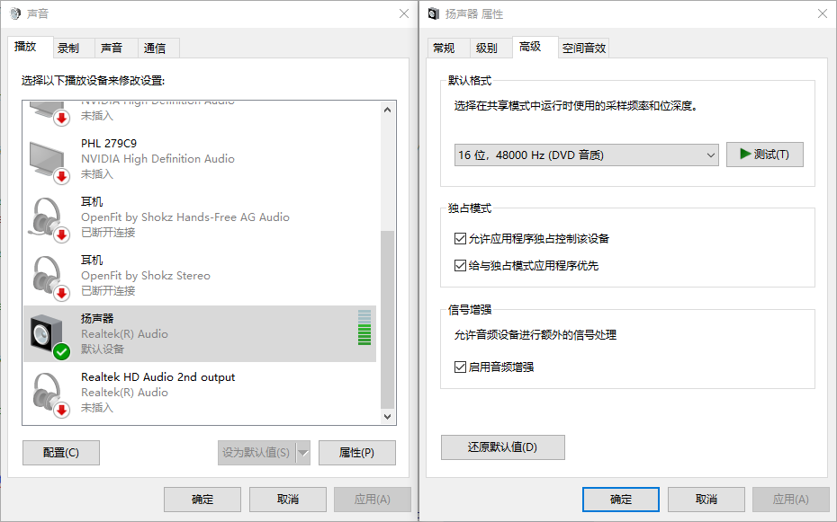

Dans le monde réel, la **source sonore (Sound Source)** émet un grand nombre de particules en mouvement dans toutes les directions. Une partie des particules entre directement dans l'oreille humaine, et une autre partie entre dans l'oreille après une ou plusieurs collisions avec des objets environnants. Dans un environnement périphérique complexe comme celui-ci, il se produit généralement que les deux oreilles humaines reçoivent des données audio différentes, ce qui crée également la soi-disant **sensation spatiale** pour l'audio.

Par conséquent, afin de conserver cette sensation spatiale lorsque l'audio est stocké dans l'ordinateur, nous stockons plusieurs copies de données audio. Le nombre de copies est généralement appelé **nombre de canaux (Number Of Channels)**. Un audio avec un seul canal est appelé **mono (Mono)**, et un audio avec `2 canaux` est appelé **stéréo (Stereo)**.

Les échantillons audio de plusieurs canaux sont combinés de manière croisée, et chaque combinaison est appelée **bloc audio (Block)**.

Pour le stéréo, sa structure de stockage est la suivante :

``` c++
std::vector<float> WaveTable = {
    channel0_sample0, channel1_sample0,    	// Block 0
    channel0_sample1, channel1_sample1,		// Block 1
    channel0_sample2, channel1_sample2,		// Block 2
    channel0_sample3, channel1_sample3,		// Block 3
    channel0_sample4, channel1_sample4,		// Block 4
    ...
}
```

Il en va de même pour le 4.1 surround :

``` c++
std::vector<float> WaveTable = {
    channel0_sample0, channel1_sample0, channel2_sample0, channel3_sample0,		// Block 0
    channel0_sample1, channel1_sample1, channel2_sample1, channel3_sample1,		// Block 1
    channel0_sample2, channel1_sample2, channel2_sample2, channel3_sample2,		// Block 2
    channel0_sample3, channel1_sample3, channel2_sample3, channel3_sample3,		// Block 3
    channel0_sample4, channel1_sample4, channel2_sample4, channel3_sample4,		// Block 4
    ...
}
```

En général, le Wave Table ne peut pas être directement lu par un périphérique audio, car ce sont des données d'onde sans informations de format audio, c'est-à-dire le taux d'échantillonnage, la profondeur de bit, le nombre de canaux...

Pour qu'il puisse être lu, nous devons encore l'encoder en fichier audio.

### WAV

`*.WAV` est l'un des formats de fichier audio les plus courants. C'est un format de fichier audio numérique standard développé par Microsoft spécialement pour Windows. Contrairement à des formats audio comme `*.mp3`, `*.flac`, `*.aac`, c'est un audio non compressé qui ne stocke que le format audio avant les données du WaveTable :

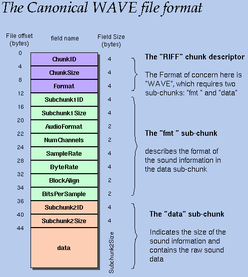

Voici un document complet :

- [WAV文件格式解析及处理 - 简书 (jianshu.com)](https://www.jianshu.com/p/63d7aa88582b)

Veuillez lire attentivement l'article ci-dessus pour comprendre la signification de chaque donnée dans le format WAV.

Ensuite, nous pouvons décrire la structure de l'en-tête WAV dans C++ en utilisant l'alignement de mémoire comme ceci :

``` c++
struct WavFmtChunk {
	uint8_t chunkID[4] = { 'f','m','t',' ' };
	int32_t chunkSize;
	int16_t audioFormat;
	int16_t numChannels;
	int32_t sampleRate;
	int32_t byteRate;
	int16_t blockAlign;
	int16_t bitsPerSample;
};

struct WavDataChunkHeader {
	uint8_t chunkID[4] = { 'd','a','t','a' };
	int32_t chunkSize;
};

struct WavRiffChunk {
	uint8_t chunkID[4] = { 'R','I','F','F' };
	int32_t chunkSize;
	uint8_t format[4] = { 'W','A','V','E' };
	WavFmtChunk fmtChunk;
	WavDataChunkHeader dataChunkHeader;
};

typedef WavRiffChunk WavHeader;
```

En C++, pour stocker un segment de données, nous utilisons généralement `std::vector<uint8_t>`. Si nous voulons écrire un segment de données d'onde dans un fichier Wav, nous pouvons utiliser une fonction comme celle-ci :

``` c++
void writeWavFile(std::string filePath, int numChannels, int sampleRate, int bitsPerSample, std::vector<uint8_t> waveTable) {
	WavHeader header;
	header.fmtChunk.audioFormat = 0x0001;			// La valeur correspondant au format PCM est 0x0001
	header.fmtChunk.chunkSize = 16;					// Le format audio PCM occupe 16 octets. Pour d'autres formats, il peut être >16, ce qui entraînera une taille totale de l'en-tête de fichier >44
	header.fmtChunk.numChannels = numChannels;
	header.fmtChunk.bitsPerSample = bitsPerSample;
	header.fmtChunk.sampleRate = sampleRate;
	header.fmtChunk.blockAlign = header.fmtChunk.numChannels * header.fmtChunk.bitsPerSample / 8;
	header.fmtChunk.byteRate = header.fmtChunk.sampleRate * header.fmtChunk.blockAlign;
	header.dataChunkHeader.chunkSize = waveTable.size();
	header.chunkSize = sizeof(header.format) + sizeof(header.fmtChunk) + sizeof(header.dataChunkHeader) + waveTable.size();
	std::ofstream out(filePath, std::ios::out | std::ios::binary);		//Il est impératif d'utiliser std::ios::binary, sinon les données seront déformées
	assert(out.is_open() && "Can`t Write File");
	out.write(reinterpret_cast<char*>(&header), sizeof(WavHeader));
	out.write(reinterpret_cast<char*>(waveTable.data()), waveTable.size());
	out.close();
}

```

La lecture est également très simple :

``` c++
std::vector<uint8_t> readWavFile(std::string filePath) {
	WavHeader header;
	std::ifstream in(filePath, std::ios::in | std::ios::binary);				//Il est impératif d'utiliser std::ios::binary, sinon les données seront déformées
	assert(in.is_open() && "Can`t Read File");
	in.read(reinterpret_cast<char*>(&header), sizeof(header));
	int waveTableSize = header.dataChunkHeader.chunkSize;						//Obtenir la taille des données d'onde
	std::vector<uint8_t> waveTable(waveTableSize);		
	in.read(reinterpret_cast<char*>(waveTable.data()), waveTableSize);
	return waveTable;
}
```

Ensuite, nous allons générer un segment d'onde audio. La **onde sinusoïdale (Sine Wave)** est l'une des ondes de base, et sa fonction est la suivante :
$$
y(Time) = Amplitude * sin(2 * PI * Frequency * Time + PhaseOffset) + Bias
$$

Selon la fonction, nous pouvons écrire la fonction suivante :

```C++
const double M_PI = 3.1415926535;
std::vector<uint8_t> generateSineWave(int timeLengthSec,	// Durée de l'onde sinusoïdale en secondes
                                            int frequency, 		// Fréquence de l'onde sinusoïdale
                                            float amplitude,	// Amplitude de l'onde sinusoïdale
                                            int numChannels, 	// Nombre de canaux audio
                                            int sampleRate, 	// Taux d'échantillonnage audio
                                            int bitsPerSample	// Profondeur de bit audio
                                           ) {
	int numBlocks = timeLengthSec * sampleRate;							// Nombre de blocs audio
	amplitude = std::clamp(amplitude, 0.01f, 1.0f);						// Limiter la taille de l'amplitude, std::clamp nécessite C++17
	std::vector<uint8_t> waveTable;								
	waveTable.resize(numBlocks * numChannels * bitsPerSample / 8);		// Calculer la taille de mémoire nécessaire pour les données audio
	int step = bitsPerSample / 8;
	for (int i = 0; i < numBlocks; i++) {
		float time = i / (float)numBlocks * timeLengthSec;		// Point temporel
		float sampleValue = amplitude * std::sin(2 * M_PI * frequency * time);		// Calculer la valeur échantillonnée au point temporel correspondant
        // Nous devons trouver un moyen d'écrire sampleValue dans waveTable
	}
	return waveTable;
}
```

Dans le code ci-dessus, nous sommes confrontés à un problème :

- Par la fonction de l'onde sinusoïdale, nous obtenons une valeur échantillonnée de type `float`, mais la profondeur de bit peut être `8 bit`, `16 bit`, `24 bit`, `32 bit`. Comment convertir le float en données correspondant à la profondeur de bit ?

Une méthode courante est d'utiliser les types de données existants pour affecter les bits correspondants, comme ceci :

``` c++
const int PCMS16MaxAmplitude = 32767;	 // La plage de valeurs de 16 bits est [-32768, 32767]. Ici, nous prenons la valeur absolue minimale (32767) pour éviter le dépassement
void write16BitSampleValue(uint8_t* dataPtr, float sampleValue) {
	(*reinterpret_cast<int16_t*>(dataPtr)) = sampleValue * PCMS16MaxAmplitude;
}
```

Nous pouvons également utiliser des opérations de bits pour le remplissage :

``` c++
const int PCMS24MaxAmplitude = 8388607;
void write24BitSampleValue(uint8_t* dataPtr, float sampleValue) {
    int value = sampleValue * PCMS24MaxAmplitude;
    dataPtr[0] = value & 0xFF;
    dataPtr[1] = (value >> 8) & 0xFF;
    dataPtr[2] = (value >> 16) & 0xFF;
}
```

En résumé, nous pouvons organiser une table de fonctions de conversion comme celle-ci :

``` c++
const int PCMS8MaxAmplitude = 127;
const int PCMS16MaxAmplitude = 32767;
const int PCMS24MaxAmplitude = 8388607;
const int PCMS32MaxAmplitude = 2147483647;

typedef std::function<void(uint8_t*, float)> SampleValueWriteFunction;
static std::map<uint8_t, SampleValueWriteFunction> SampleValueWriteFunctions = {
	{8,[](uint8_t* dataPtr, float sampleValue) {
         // Je ne sais pas pourquoi il faut ajouter un décalage ici pour que l'onde soit correcte =.=
		(*reinterpret_cast<int8_t*>(dataPtr)) = sampleValue * PCMS8MaxAmplitude + PCMS8MaxAmplitude;  
	}},
	{16,[](uint8_t* dataPtr, float sampleValue) {
		(*reinterpret_cast<int16_t*>(dataPtr)) = sampleValue * PCMS16MaxAmplitude;
	}},
	{24,[](uint8_t* dataPtr, float sampleValue) {
		int value = sampleValue * PCMS24MaxAmplitude;
		dataPtr[0] = value & 0xFF;
		dataPtr[1] = (value >> 8) & 0xFF;
		dataPtr[2] = (value >> 16) & 0xFF;
	}},
	{32,[](uint8_t* dataPtr, float sampleValue) {
		(*reinterpret_cast<int32_t*>(dataPtr)) = sampleValue * PCMS32MaxAmplitude;
	}}
};

typedef std::function<float(uint8_t*)> SampleValueReadFunction;
static std::map<uint8_t, SampleValueReadFunction> SampleValueReadFunctions = {
	{8,[](uint8_t* dataPtr) {
		return ((*reinterpret_cast<int8_t*>(dataPtr)) - PCMS8MaxAmplitude) / float(PCMS8MaxAmplitude);
	}},
	{16,[](uint8_t* dataPtr) {
		return (*reinterpret_cast<int16_t*>(dataPtr)) / float(PCMS16MaxAmplitude);
	}},
	{24,[](uint8_t* dataPtr) {
		int value = dataPtr[2];
		value <<= 8;
		value |= dataPtr[1];
		value <<= 8;
		value |= dataPtr[0];
		return value / float(PCMS24MaxAmplitude);
	}},
	{32,[](uint8_t* dataPtr) {
		return (*reinterpret_cast<int32_t*>(dataPtr)) / float(PCMS32MaxAmplitude);
	}}
};
```

En résumé, avec le code de test, le code complet est le suivant :

``` c++
#include <stdint.h>
#include <assert.h>
#include <map>
#include <vector>
#include <functional>
#include <string>
#include <fstream>
#include <algorithm>
#include <iostream>

struct WavFmtChunk {
	uint8_t chunkID[4] = { 'f','m','t',' ' };
	int32_t chunkSize;
	int16_t audioFormat;
	int16_t numChannels;
	int32_t sampleRate;
	int32_t byteRate;
	int16_t blockAlign;
	int16_t bitsPerSample;
};

struct WavDataChunkHeader {
	uint8_t chunkID[4] = { 'd','a','t','a' };
	int32_t chunkSize;
};

struct WavRiffChunk {
	uint8_t chunkID[4] = { 'R','I','F','F' };
	int32_t chunkSize;
	uint8_t format[4] = { 'W','A','V','E' };
	WavFmtChunk fmtChunk;
	WavDataChunkHeader dataChunkHeader;
};

typedef WavRiffChunk WavHeader;

const int PCMS8MaxAmplitude = 127;
const int PCMS16MaxAmplitude = 32767;
const int PCMS24MaxAmplitude = 8388607;
const int PCMS32MaxAmplitude = 2147483647;

typedef std::function<void(uint8_t*, float)> SampleValueWriteFunction;
static std::map<uint8_t, SampleValueWriteFunction> SampleValueWriteFunctions = {
	{8,[](uint8_t* dataPtr, float sampleValue) {
		(*reinterpret_cast<int8_t*>(dataPtr)) = sampleValue * PCMS8MaxAmplitude + PCMS8MaxAmplitude;   // Je ne sais pas pourquoi il faut ajouter un décalage ici pour que l'onde soit correcte =.=
	}},
	{16,[](uint8_t* dataPtr, float sampleValue) {
		(*reinterpret_cast<int16_t*>(dataPtr)) = sampleValue * PCMS16MaxAmplitude;
	}},
	{24,[](uint8_t* dataPtr, float sampleValue) {
		int value = sampleValue * PCMS24MaxAmplitude;
		dataPtr[0] = value & 0xFF;
		dataPtr[1] = (value >> 8) & 0xFF;
		dataPtr[2] = (value >> 16) & 0xFF;
	}},
	{32,[](uint8_t* dataPtr, float sampleValue) {
		(*reinterpret_cast<int32_t*>(dataPtr)) = sampleValue * PCMS32MaxAmplitude;
	}}
};

typedef std::function<float(uint8_t*)> SampleValueReadFunction;
static std::map<uint8_t, SampleValueReadFunction> SampleValueReadFunctions = {
	{8,[](uint8_t* dataPtr) {
		return ((*reinterpret_cast<int8_t*>(dataPtr)) - PCMS8MaxAmplitude) / float(PCMS8MaxAmplitude);
	}},
	{16,[](uint8_t* dataPtr) {
		return (*reinterpret_cast<int16_t*>(dataPtr)) / float(PCMS16MaxAmplitude);
	}},
	{24,[](uint8_t* dataPtr) {
		int value = dataPtr[2];
		value <<= 8;
		value |= dataPtr[1];
		value <<= 8;
		value |= dataPtr[0];
		return value / float(PCMS24MaxAmplitude);
	}},
	{32,[](uint8_t* dataPtr) {
		return (*reinterpret_cast<int32_t*>(dataPtr)) / float(PCMS32MaxAmplitude);
	}}
};

const double M_PI = 3.1415926535;

std::vector<uint8_t> generateSineWave(int timeLengthSec, int frequency, float amplitude, int numChannels, int sampleRate, int bitsPerSample) {
	int numBlocks = timeLengthSec * sampleRate;							// Nombre de blocs audio
	amplitude = std::clamp(amplitude, 0.01f, 1.0f);						// Limiter la taille de l'amplitude, std::clamp nécessite C++17
	std::vector<uint8_t> waveTable;								
	waveTable.resize(numBlocks * numChannels * bitsPerSample / 8);
	int step = bitsPerSample / 8;										// Calculer l'écart en octets par échantillon
	uint8_t* waveTablePtr = waveTable.data();
	SampleValueWriteFunction writer = SampleValueWriteFunctions.at(bitsPerSample);
	for (int i = 0; i < numBlocks; i++) {
		float time = i / (float)numBlocks * timeLengthSec;				// Temps correspondant au bloc audio actuel
		float sampleValue = amplitude * std::sin(2 * M_PI * frequency * time);		// Valeur sinusoïdale correspondant au temps actuel
		for (int channelIndex = 0; channelIndex < numChannels; channelIndex++) {	// Tous les canaux utilisent la même valeur
			writer(waveTablePtr, sampleValue);
			waveTablePtr += step;
		}
	}
	return waveTable;
}

void writeWavFile(std::string filePath, int numChannels, int sampleRate, int bitsPerSample, std::vector<uint8_t> waveTable) {
	WavHeader header;
	header.fmtChunk.audioFormat = 0x0001;			// La valeur correspondant au format PCM est 0x0001
	header.fmtChunk.chunkSize = 16;					// Le format audio PCM occupe 16 octets. Pour d'autres formats, il peut être >16, ce qui entraînera une taille totale de l'en-tête de fichier >44
	header.fmtChunk.numChannels = numChannels;
	header.fmtChunk.bitsPerSample = bitsPerSample;
	header.fmtChunk.sampleRate = sampleRate;
	header.fmtChunk.blockAlign = header.fmtChunk.numChannels * header.fmtChunk.bitsPerSample / 8;
	header.fmtChunk.byteRate = header.fmtChunk.sampleRate * header.fmtChunk.blockAlign;
	header.dataChunkHeader.chunkSize = waveTable.size();
	header.chunkSize = sizeof(header.format) + sizeof(header.fmtChunk) + sizeof(header.dataChunkHeader) + waveTable.size();
	std::ofstream out(filePath, std::ios::out | std::ios::binary);		//Il est impératif d'utiliser std::ios::binary, sinon les données seront déformées
	assert(out.is_open() && "Can`t Write File");
	out.write(reinterpret_cast<char*>(&header), sizeof(WavHeader));
	out.write(reinterpret_cast<char*>(waveTable.data()), waveTable.size());
	out.close();
}

std::vector<uint8_t> readWavFile(std::string filePath) {
	WavHeader header;
	std::ifstream in(filePath, std::ios::in | std::ios::binary);				//Il est impératif d'utiliser std::ios::binary, sinon les données seront déformées
	assert(in.is_open() && "Can`t Read File");
	in.read(reinterpret_cast<char*>(&header), sizeof(header));
	int waveTableSize = header.dataChunkHeader.chunkSize;						//Obtenir la taille des données d'onde
	std::vector<uint8_t> waveTable(waveTableSize);		
	in.read(reinterpret_cast<char*>(waveTable.data()), waveTableSize);
	return waveTable;
}

int main() {
	assert(sizeof(WavHeader) == 44 && "WAV Header Size Error");

	int numChannels = 2;			// Mono
	int sampleRate = 48000;			// Taux d'échantillonnage de 48000 Hz
	int bitsPerSample = 16;			// Chaque échantillon audio occupe 16 bits, soit 2 octets
	int auidoLengthSec = 2;			// Générer une onde sinusoïdale de 2 secondes
	int sineFrequency = 440;		// Fréquence de l'onde sinusoïdale
	float sineAmplitude = 0.8f;		// Amplitude de l'onde sinusoïdale

	std::vector<uint8_t> waveTable = generateSineWave(auidoLengthSec, sineFrequency, sineAmplitude, numChannels, sampleRate, bitsPerSample);

	writeWavFile("./sineWave.wav", numChannels, sampleRate, bitsPerSample, waveTable);

	std::vector<uint8_t> readData = readWavFile("./sineWave.wav");

	assert(readData == waveTable && "Audio Data Error");

	return 0;
}
```

Exécuter ce programme générera un fichier audio `sineWave.wav` dans le répertoire de sortie. Essayez de le lire~

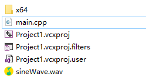

Vous pouvez également modifier les paramètres pour regénérer l'audio et écouter les différences entre les ondes sinusoïdales de différentes fréquences.

De plus, vous pouvez essayer de simuler l'effet audio spatial :

``` c++
std::vector<uint8_t> generateSineSurroundWave(int timeLengthSec, int frequency, float amplitude, int numChannels, int sampleRate, int bitsPerSample) {
	assert(numChannels == 2);

	int numBlocks = timeLengthSec * sampleRate;							// Nombre de blocs audio
	amplitude = std::clamp(amplitude, 0.01f, 1.0f);						// Limiter la taille de l'amplitude, std::clamp nécessite C++17
	std::vector<uint8_t> waveTable;
	waveTable.resize(numBlocks * numChannels * bitsPerSample / 8);
	int step = bitsPerSample / 8;										// Calculer l'écart en octets par échantillon
	uint8_t* waveTablePtr = waveTable.data();
	SampleValueWriteFunction writer = SampleValueWriteFunctions.at(bitsPerSample);

	float leftEarPos[2]	 = { -5,0 };									// Position de l'oreille gauche (X, Y)
	float rightEarPos[2] = {  5,0 };									// Position de l'oreille droite (X, Y)
	float radiusOfSurround = 10;										// Rayon de l'audio surround
	float audioAttenuationFactor = 0.7;									// Facteur d'atténuation du son, par exemple 0.7, ce qui signifie que toutes les unités de longueur, l'audio s'atténuera à 0.7 fois la valeur originale
	float periodSec = 2;												// Temps nécessaire pour une rotation complète, en secondes, 2 signifie une rotation toutes les deux secondes

	for (int i = 0; i < numBlocks; i++) {
		float time = i / (float)numBlocks * timeLengthSec;							// Temps correspondant au bloc audio actuel
		float sampleValue = amplitude * std::sin(2 * M_PI * frequency * time);		// Valeur sinusoïdale correspondant au temps actuel

		float angle = 2 * M_PI * time / periodSec;									// Calculer l'angle de rotation actuel
		float audioSourcePos[2] = {													// Calculer la position actuelle de la source sonore
			radiusOfSurround * std::cos(angle),
			radiusOfSurround * std::sin(angle)
		};

		float leftEarDistance  = sqrt(pow(leftEarPos[0] - audioSourcePos[0], 2) + pow(leftEarPos[1] - audioSourcePos[1], 2));		// Distance entre la source sonore et l'oreille gauche
		float leftSampleValue = sampleValue * pow(audioAttenuationFactor, leftEarDistance);											// Calculer la valeur échantillonnée audio après atténuation selon la distance
		writer(waveTablePtr, leftSampleValue);																						// Écrire dans le canal gauche
		waveTablePtr += step;

		float rightEarDistance = sqrt(pow(rightEarPos[0] - audioSourcePos[0], 2) + pow(rightEarPos[1] - audioSourcePos[1], 2));		// Distance entre la source sonore et l'oreille droite
		float rightSampleValue = sampleValue * pow(audioAttenuationFactor, rightEarDistance);										// Calculer la valeur échantillonnée audio après atténuation selon la distance
		writer(waveTablePtr, rightSampleValue);																						// Écrire dans le canal droit
		waveTablePtr += step;
	}
	return waveTable;
}

int main() {
	assert(sizeof(WavHeader) == 44 && "WAV Header Size Error");
	int numChannels = 2;            // Mono
	int sampleRate = 48000;         // Taux d'échantillonnage de 48000 Hz
	int bitsPerSample = 16;         // Chaque échantillon audio occupe 16 bits, soit 2 octets
	int auidoLengthSec = 2;         // Générer une onde sinusoïdale de 2 secondes
	int sineFrequency = 150;        // Fréquence de l'onde sinusoïdale
	float sineAmplitude = 0.8f;     // Amplitude de l'onde sinusoïdale
	std::vector<uint8_t> waveTable = generateSineSurroundWave(auidoLengthSec, sineFrequency, sineAmplitude, numChannels, sampleRate, bitsPerSample);
	writeWavFile("./sineWave.wav", numChannels, sampleRate, bitsPerSample, waveTable);
	std::vector<uint8_t> readData = readWavFile("./sineWave.wav");
	assert(readData == waveTable && "Audio Data Error");
	return 0;
}
```

Sur ce site, vous pouvez téléverser un fichier pour voir l'onde audio :

- [Musiscope (sciencemusic.org)](https://oscilloscope.sciencemusic.org/)

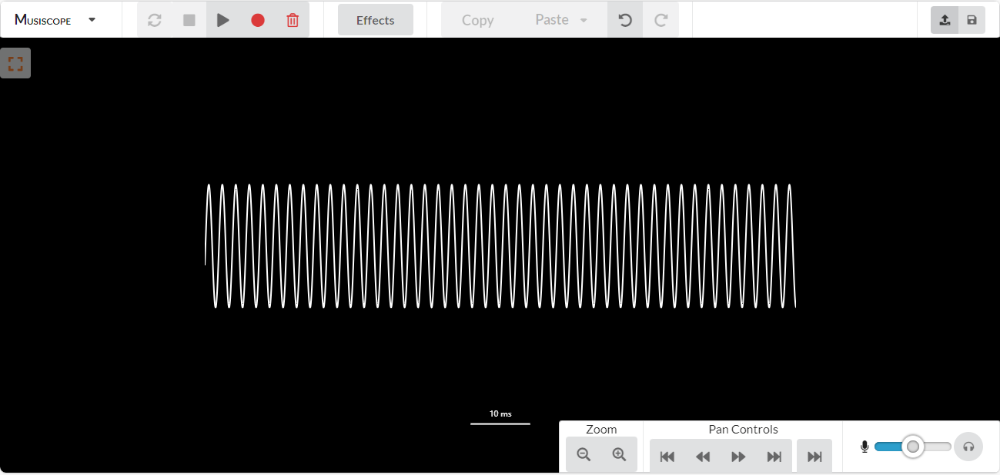

À ce stade, nous devrions avoir une idée générale de la forme originale de l'audio sur l'ordinateur.

## Framework audio

### Interface audio IO

Avec l'audio, nous devons également savoir comment interagir avec les périphériques audio. Les périphériques audio courants sont :

- Entrée : Microphone
- Sortie : Haut-parleur, enceinte, casque

Ces fabricants de périphériques fourniront ou supporteront des pilotes audio associés. En général, nous n'avons pas besoin d'interagir directement avec les pilotes audio, mais utilisons les interfaces audio fournies par le système d'exploitation pour traiter l'entrée et la sortie audio, par exemple :

- **Windows** : DirectSound, ASIO, WASAPI
- **Linux** : ALSA natif, Jack, OSS
- **Mac OS** : CoreAudio, Jack

Pour le traitement audio multiplateforme, de nombreux frameworks encapsulent également ces interfaces de manière uniforme, par exemple :

- Module audio IO dans **Qt Multimedia** : [Audio Overview | Qt Multimedia 6.6.1](https://doc.qt.io/qt-6/audiooverview.html)
- **RtAudio** introduit par **UE** : http://www.music.mcgill.ca/~gary/rtaudio/

### Bibliothèque de transformation de Fourier

La transformation de Fourier (Fourier Transform) est un outil important pour le traitement du signal.

On sait que le son est un signal continu qui change avec le temps, comme ceci :

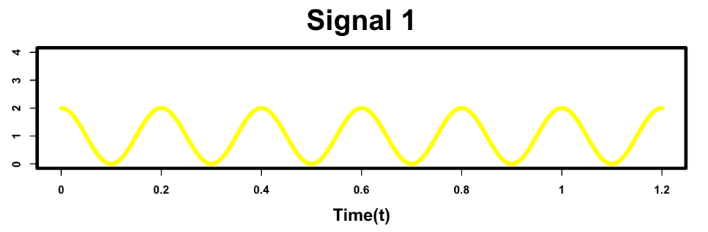

Mais le son que nous entendons n'a souvent pas une seule fréquence. En réalité, il peut être composé de nombreuses ondes sonores de différentes fréquences empilées les unes sur les autres, comme ceci :

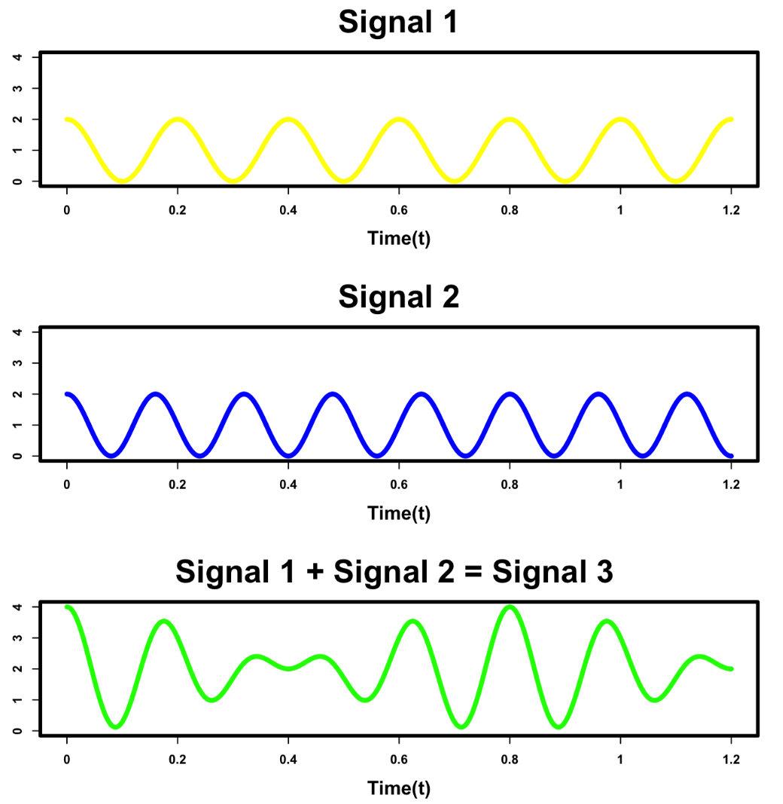

La transformation de Fourier peut nous aider à analyser le **signal dans le domaine temporel (Time Domain Signal)** qui a mélangé de nombreuses ondes de différentes fréquences **sur une période de temps**, et à obtenir la distribution de fréquences de l'onde sonore sur cette période, c'est-à-dire le **signal dans le domaine fréquentiel (Frequency Domain Signal)**. Tout le processus ressemble à ceci :

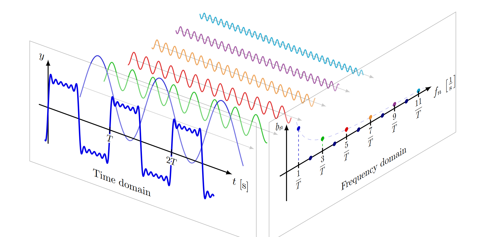

Voici une très bonne vidéo qui explique le principe de la transformation de Fourier :

- [【官方双语】形象展示傅里叶变换 |3Blue1Brown](https://www.bilibili.com/video/BV1pW411J7s8)

Certains signaux temporels qui semblent chaotiques, après conversion dans le domaine fréquentiel, nous permettent de découvrir plus facilement les caractéristiques des données, par exemple ceci est le résultat d'une analyse en temps réel d'un morceau de musique :

> Bien que nous ne puissions pas entendre le son, nous pouvons croire que vous pouvez voir les changements de rythme de la musique à partir des graphiques animés.

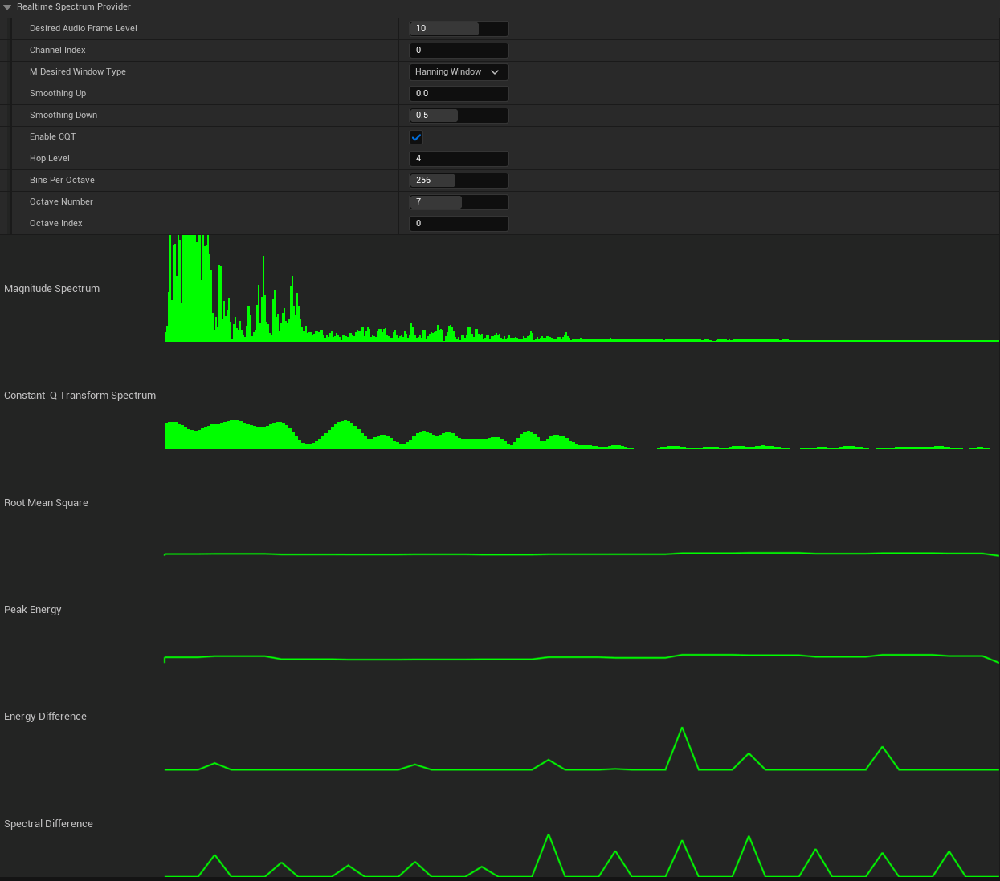

De plus, la transformation de Fourier n'est pas seulement un outil de traitement mathématique, elle nous引导 également à penser dans le domaine fréquentiel. Si vous aimez jouer avec Shader Toy ou GLSL Sandbox, beaucoup de codes sont en fait basés sur la pensée du domaine fréquentiel.

Voici une vidéo intéressante où chaque ligne tourne à une fréquence fixe à vitesse constante :

- [傅里叶变换之美 | 科学小视](https://www.bilibili.com/video/BV1So4y1T7ae)

Voici quelques implémentations matures de l'algorithme de Fourier :

- [fftw3](https://github.com/FFTW/fftw3) : La bibliothèque de transformation de Fourier la plus rapide à l'ouest
- [pffft](https://bitbucket.org/jpommier/pffft) : Une petite bibliothèque de transformation de Fourier
- [ffts](https://github.com/anthonix/ffts) : La bibliothèque de transformation de Fourier la plus rapide au sud (狗头)

Si vous aimez également la visualisation audio comme moi, voici deux bibliothèques open source recommandées :

- [adamstark/Gist: A C++ Library for Audio Analysis (github.com)](https://github.com/adamstark/Gist)
- [jmerkt/rt-cqt: Real-Time Constant-Q Transform (github.com)](https://github.com/jmerkt/rt-cqt)

### Bibliothèque d'algorithmes DSP

DSP est l'acronyme de **traitement numérique du signal (Digital Signal Processor)**.

Dans la section "Connaissance de l'audio", nous avons généré une onde sinusoïdale et l'avons écrite dans un fichier wav. En général, ces fonctionnalités sont incluses dans la bibliothèque DSP. De plus, elle fournit souvent d'autres fonctionnalités, par exemple :

- Filtre
- Rééchantillonnage
- Synthèse audio
- Analyse spectrale
- ...

Les bibliothèques DSP open source sont :

- [KFR | Fast, modern C++ DSP framework (kfrlib.com)](https://www.kfrlib.com/)
- [Maximilian | C++ Audio and Music DSP Library](https://github.com/micknoise/Maximilian)

### Moteur de développement audio

En général, pour les développeurs audio des projets de jeu, il n'est pas nécessaire de connaître les interfaces et frameworks bas niveau ci-dessus. Généralement, les moteurs de jeu fournissent des modules audio de base, et pour les mécanismes audio complexes, nous utilisons directement l'éditeur fourni par le moteur audio pour le développement.

Les moteurs audio courants sont :

- [CRIWARE ADX](https://www.criware.com/en/products/adx2.html) : ADX a presque aucune courbe d'apprentissage, car ses outils de création tirent pleinement parti des fonctionnalités fournies par le paradigme DAW et ajoutent des fonctionnalités intuitives pour créer des sons interactifs. Lorsque la taille du projet devient de plus en plus grande et les délais de plus en plus serrés, utilisez ADX pour améliorer votre productivité !
- [FMOD](https://fmod.com/) : FMOD est une solution de bout en bout pour ajouter du son et de la musique à n'importe quel jeu. Utilisez FMOD Studio pour construire de l'audio adaptatif et utilisez le moteur FMOD pour le lire dans le jeu.
- [Wwise | Audiokinetic](https://www.audiokinetic.com/zh/products/wwise/) : Fournit un ensemble complet d'outils de conception et de développement audio interactif, qui vous aident à réaliser facilement la prototypage, quel que soit la taille du projet, et à transformer vos conceptions audio créatives en réalité sur cette base.

Ces logiciels audio fournissent des éditeurs uniques et prennent en charge les plugins dans les moteurs de jeu associés (UE, Unity, Cocos...).

Concernant le choix du moteur audio, il y a des discussions sur Zhihu :

- [有哪些国内的游戏使用了音频引擎来做音频部分的开发？比如FMOD和wwise? - 知乎 (zhihu.com)](https://www.zhihu.com/question/29992299)
- [使用Unity5开发手游，使用FMOD或wwise音频插件而不是自带的声音系统有哪些好处？ - 知乎 (zhihu.com)](https://www.zhihu.com/question/61882604)

**Meta Sound** est un moteur audio intégré fourni par UE5. Bien que ses fonctionnalités ne puissent pas rivaliser avec les moteurs audio ci-dessus pour le moment, cette solution tout-en-un rend indéniablement UE de plus en plus puissante.

Comme l'outil de modélisation de UE5, sa plus grande valeur n'est pas de permettre aux artistes de modéliser dans UE, mais en essence, le plus grand bénéficiaire est le développeur (devrait-on dire TA ?).

Le développeur peut effectuer une validation rapide de l'effet de l'algorithme dans l'éditeur pour les actifs de scène de son propre projet. Après stabilisation de la stratégie, il utilise une série d'algorithmes de traitement de maillage fournis par le niveau inférieur de UE pour construire un pipeline automatisé depuis le modèle DCC jusqu'à l'actif de moteur de haute qualité.

> Comme mentionné dans le chapitre précédent sur le monde ouvert, HLOD est de combiner tous les modèles dans une Cell en un modèle de basse précision. L'utilisation d'une stratégie uniforme dans des scènes avec des catégories complexes est souvent difficile à obtenir de bons résultats. Après avoir maîtrisé les algorithmes de traitement de maillage de bas niveau de UE, si la classification des actifs est appropriée, il n'est pas difficile de générer un HLOD de haute qualité.

## Audio UE

À Unreal Fest 2023, le grand maître a présenté l'architecture audio de UE :

- [Sounds Good: Unreal Engine Audio | Unreal Fest 2023](https://www.bilibili.com/video/BV1EC4y1J7Bs)

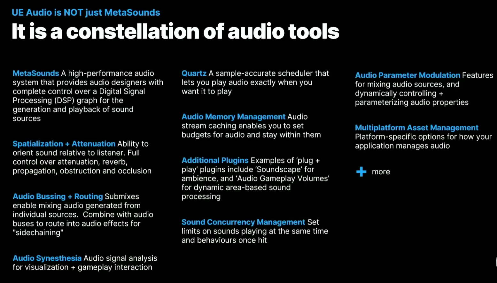

Nous pouvons obtenir des informations sur les sites suivants, mais malheureusement, la documentation sur l'audio dans Unreal est relativement rare et mélangée à de nombreuses documentations obsolètes :

- [在虚幻引擎中使用音频 |虚幻引擎 5.3 文档 (unrealengine.com)](https://docs.unrealengine.com/5.3/en-US/working-with-audio-in-unreal-engine/)
- [Latest unreal-engine topics in Audio - Epic Developer Community Forums (unrealengine.com)](https://forums.unrealengine.com/tags/c/development-discussion/audio/42/unreal-engine)

### Périphérique audio

Les périphériques audio sont divisés en périphériques d'entrée et de sortie, et leurs informations associées sont stockées respectivement dans **Audio::FCaptureDeviceInfo** et **Audio::FAudioPlatformDeviceInfo** de UE. Nous pouvons obtenir tous les périphériques via les interfaces suivantes :

``` c++
// Obtenir tous les périphériques d'entrée
Audio::FAudioCapture AudioCapture;
TArray<Audio::FCaptureDeviceInfo> CaptureDevices;
AudioCapture.GetCaptureDevicesAvailable(CaptureDevices);
for (auto InputDeviceInfo : CaptureDevices) {
    UE_LOG(LogTemp, Warning,TEXT("[Input Device] Name: %s, Device Id: %s, Num Channels: %u, Sample Rate: %u, Supports Hardware AEC: %u, "),
        *InputDeviceInfo.DeviceName,
        *InputDeviceInfo.DeviceId,
        InputDeviceInfo.InputChannels,
        InputDeviceInfo.PreferredSampleRate,
        InputDeviceInfo.bSupportsHardwareAEC);
}

// Obtenir le périphérique d'entrée audio actuel (par défaut)
Audio::FCaptureDeviceInfo CurrentInputDevice;
AudioCapture.GetCaptureDeviceInfo(CurrentInputDevice);
UE_LOG(LogTemp, Warning, TEXT("[Current Input Device] %s"),
    *CurrentInputDevice.DeviceName);

// Obtenir tous les périphériques de sortie
Audio::FMixerDevice* AudioMixerDevice = FAudioDeviceManager::GetAudioMixerDeviceFromWorldContext(GWorld);		//Utiliser le GWorld actuel comme WorldContentObject
if (AudioMixerDevice){
    if (Audio::IAudioMixerPlatformInterface* MixerPlatform = AudioMixerDevice->GetAudioMixerPlatform()){
        uint32 NumOutputDevices = 0;
        MixerPlatform->GetNumOutputDevices(NumOutputDevices);
        for (uint32 i = 0; i < NumOutputDevices; ++i){
            Audio::FAudioPlatformDeviceInfo OutputDeviceInfo;
            MixerPlatform->GetOutputDeviceInfo(i, OutputDeviceInfo);
            UE_LOG(LogTemp, Warning, TEXT("[Output Device] Name: %s, Device Id: %s, Num Channels: %u, Sample Rate: %u, "),
                *OutputDeviceInfo.Name,
                *OutputDeviceInfo.DeviceId,
                OutputDeviceInfo.NumChannels,
                OutputDeviceInfo.SampleRate);
        }

        // Obtenir le périphérique de sortie audio actuel (par défaut)
        Audio::FAudioPlatformDeviceInfo CurrentOutputDevice = MixerPlatform->GetPlatformDeviceInfo();
        UE_LOG(LogTemp, Warning, TEXT("[Current Output Device] %s"),
            *CurrentOutputDevice.Name);
    }
}
```

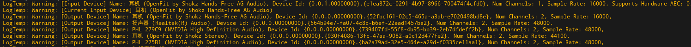

### Audio de sortie

La classe de base de la source sonore dans UE est **USoundBase** :

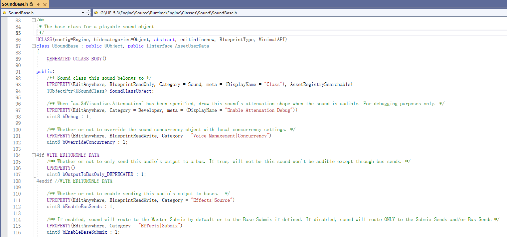

Il y a de nombreuses dérivations dans le moteur :

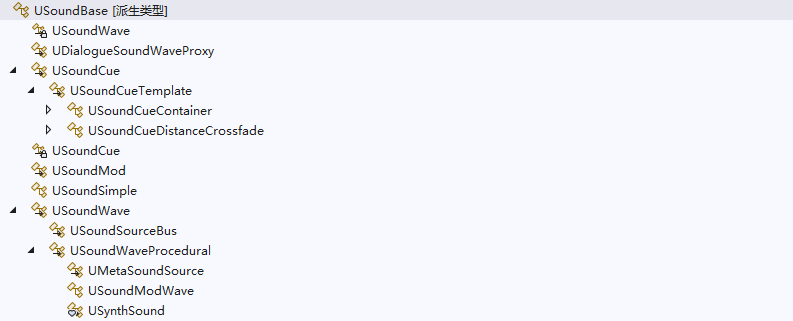

Notre attention se concentre principalement sur **USoundWave**, qui transmet les données d'onde au périphérique audio pour la lecture.

En combinant la fonction de génération de l'onde sinusoïdale que nous avons écrite précédemment, nous pouvons également lire nos propres données d'onde personnalisées dans UE, comme ceci :

```  c++
void UTestBlueprintLibrary::PlayTestAudio(UObject* WorldContext)		// Bibliothèque de fonctions Blueprint pour les tests
{
    int numChannels = 2;			// Mono
    int sampleRate = 48000;			// Taux d'échantillonnage de 48000 Hz
    int bitsPerSample = 16;			// Chaque échantillon audio occupe 16 bits, soit 2 octets
    int auidoLengthSec = 2;			// Générer une onde sinusoïdale de 2 secondes
    int sineFrequency = 440;		// Fréquence de l'onde sinusoïdale
    float sineAmplitude = 0.8f;		// Amplitude de l'onde sinusoïdale

    USoundWaveProcedural* Wave = NewObject<USoundWaveProcedural>();
    Wave->NumChannels = numChannels;
    Wave->SampleByteSize = bitsPerSample / 8;		// UE ne supporte que int16
    Wave->SetSampleRate(sampleRate);
    std::vector<uint8_t> waveTable = generateSineWave(auidoLengthSec,
                                                      sineFrequency, 
                                                      sineAmplitude, 
                                                      numChannels, 
                                                      sampleRate, 
                                                      bitsPerSample);
    Wave->QueueAudio(waveTable.data(), waveTable.size());
    UGameplayStatics::PlaySound2D(WorldContext, Wave);
}
```

Ici, nous utilisons la fonction `UGameplayStatics::PlaySound2D`. Nous pouvons regarder son implémentation interne :

``` c++
void UGameplayStatics::PlaySound2D(const UObject* WorldContextObject, 
                                   USoundBase* Sound, 
                                   float VolumeMultiplier,
                                   float PitchMultiplier, 
                                   float StartTime, 
                                   USoundConcurrency* ConcurrencySettings, 
                                   const AActor* OwningActor,
                                   bool bIsUISound)
{
	if (!Sound || !GEngine || !GEngine->UseSound())
	{
		return;
	}

	UWorld* ThisWorld = GEngine->GetWorldFromContextObject(WorldContextObject, EGetWorldErrorMode::LogAndReturnNull);
	if (!ThisWorld || !ThisWorld->bAllowAudioPlayback || ThisWorld->IsNetMode(NM_DedicatedServer))
	{
		return;
	}

	if (FAudioDeviceHandle AudioDevice = ThisWorld->GetAudioDevice())   // Obtenir le périphérique de sortie audio du monde actuel
	{
		FActiveSound NewActiveSound;									// Créer un audio actif
		NewActiveSound.SetSound(Sound);
		NewActiveSound.SetWorld(ThisWorld);

		NewActiveSound.SetPitch(PitchMultiplier);
		NewActiveSound.SetVolume(VolumeMultiplier);

		NewActiveSound.RequestedStartTime = FMath::Max(0.f, StartTime);

		NewActiveSound.bIsUISound = bIsUISound;
		NewActiveSound.bAllowSpatialization = false;

		if (ConcurrencySettings)
		{
			NewActiveSound.ConcurrencySet.Add(ConcurrencySettings);
		}

		NewActiveSound.Priority = Sound->Priority;
		NewActiveSound.SubtitlePriority = Sound->GetSubtitlePriority();

		// Si OwningActor n'est pas fourni à cette fonction, dériver un propriétaire du WorldContextObject
		const AActor* ActiveSoundOwner = OwningActor ? OwningActor : GameplayStatics::GetActorOwnerFromWorldContextObject(WorldContextObject);

		NewActiveSound.SetOwner(ActiveSoundOwner);

		TArray<FAudioParameter> Params;
		UActorSoundParameterInterface::Fill(ActiveSoundOwner, Params);

		AudioDevice->AddNewActiveSound(NewActiveSound, &Params);	// Envoyer l'audio actif au périphérique de sortie pour traitement
	}
}
```

Les données Wave que nous ajoutons via `USoundWaveProcedural::QueueAudio` sont stockées dans le AudioBuffer interne, et ultérieurement, le périphérique audio appellera `USoundWaveProcedural::GeneratePCMData` pour les recevoir et lire le son.

``` c++
int32 USoundWaveProcedural::GeneratePCMData(uint8* PCMData, const int32 SamplesNeeded)
{
    // ...
  	FMemory::Memcpy((void*)PCMData, &AudioBuffer[0], BytesToCopy);
}
```

En utilisant **USoundWaveProcedural**, nous pouvons lire les données PCM, mais si nous sommes confrontés à des stratégies de génération audio complexes, nous devons peut-être dériver **USoundWaveProcedural**. L'implémentation de **UMetaSoundSource** est un excellent exemple de référence. Nous n'avons qu'à personnaliser un **ISoundGenerator** et à remplacer sa fonction de génération audio :

``` c++
class ISoundGenerator
{
public:
	ENGINE_API ISoundGenerator();
	ENGINE_API virtual ~ISoundGenerator();

	// Appelé lorsqu'un nouveau tampon est requis. 
	virtual int32 OnGenerateAudio(float* OutAudio, int32 NumSamples) = 0;

	// Retourne le nombre d'échantillons à rendre par rappel
	virtual int32 GetDesiredNumSamplesToRenderPerCallback() const { return 1024; }

	// Optionnel. Appelé sur le thread du générateur audio juste lorsque le générateur commence à générer.
	virtual void OnBeginGenerate() {}

	// Optionnel. Appelé sur le thread du générateur audio juste lorsque le générateur cesse de générer.
	virtual void OnEndGenerate() {}

	// Optionnel. Peut être remplacé pour terminer le son lorsque la génération est terminée.
	virtual bool IsFinished() const { return false; }

	// Récupère le prochain tampon audio du générateur, appelé depuis le mélangeur audio
	ENGINE_API int32 GetNextBuffer(float* OutAudio, int32 NumSamples, bool bRequireNumberSamples = false);

	virtual Audio::AudioTaskQueueId GetSynchronizedRenderQueueId() const { return 0; }

protected:

	// Méthode protégée pour exécuter lambda dans le thread de rendu audio
	// Utilisé pour transmettre les changements de paramètres ou les événements au thread du générateur.
	ENGINE_API void SynthCommand(TUniqueFunction<void()> Command);

private:

	ENGINE_API void PumpPendingMessages();

	// La file d'attente de commandes utilisée pour transmettre les commandes du thread de jeu au thread du générateur 
	TQueue<TUniqueFunction<void()>> CommandQueue;

	friend class USynthComponent;
};
```

Ensuite, dériver notre propre **USoundWaveProcedural** et remplacer :

``` c++
virtual ISoundGeneratorPtr USoundBase::CreateSoundGenerator(const FSoundGeneratorInitParams& InParams) { return nullptr; }
```

Lorsque le périphérique audio de UE lit la source audio, s'il s'agit d'un audio procédural `(USoundWave.bProcedural == true)`, il appellera `CreateSoundGenerator` pour créer un **SoundGenerator** pour lui :

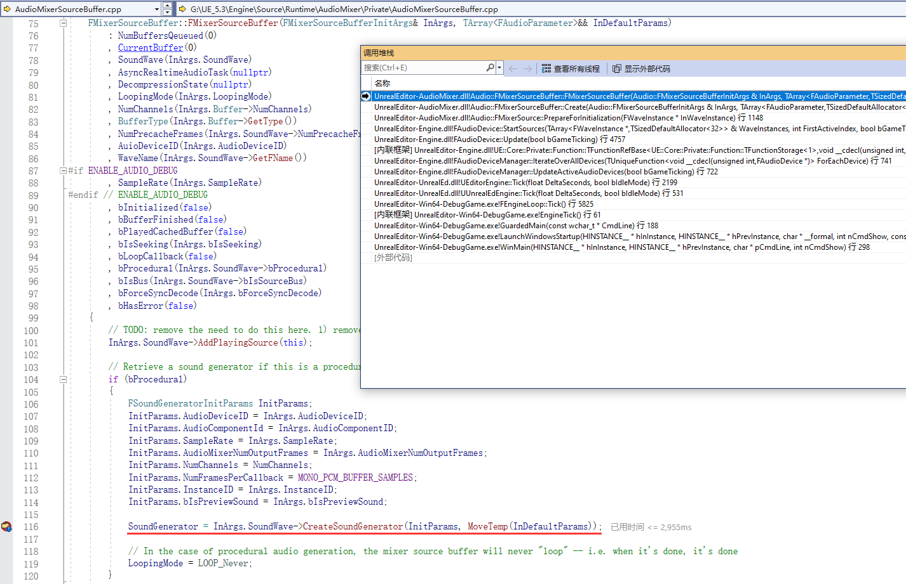

Lors de l'analyse audio réelle, l'interface suivante est appelée pour générer l'audio :

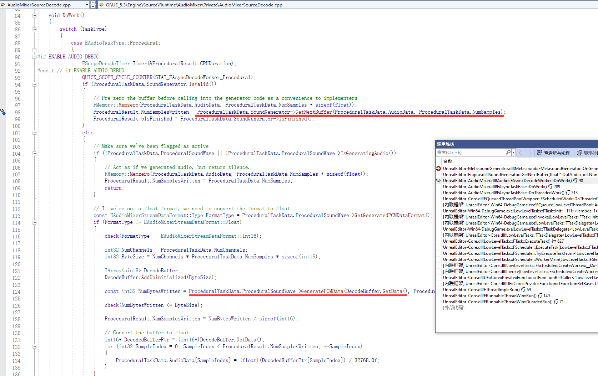

Pour une implémentation détaillée, reportez-vous à **UMetaSoundSource** et **FMetasoundGenerator**.

### Capture audio

Les besoins de capture audio sont rares dans les projets de jeu, donc nous ne faisons qu'une brève introduction ici.

Concernant la capture audio, elle se divise principalement en deux catégories :

- Capture de l'audio du système
- Capture de l'audio dans le jeu

#### Capture audio du système

La capture audio du système fait référence spécifiquement à la capture du périphérique d'entrée (microphone). UE ne prend pas en charge actuellement la capture du périphérique de sortie. Si vous avez des besoins correspondants, vous devez utiliser une API de niveau inférieur pour l'implémenter (comme WASAPI).

``` c++
TSharedPtr<Audio::FAudioCapture> AudioCapture = MakeShared<Audio::FAudioCapture>();
Audio::FOnCaptureFunction OnCapture = [](const float* AudioData,
                                             int32 NumFrames, 
                                             int32 InNumChannels,
                                             int32 InSampleRate, 
                                             double StreamTime, 
                                             bool bOverFlow) {
    // Traiter les données audio capturées,此时是在异步线程
};
Audio::FAudioCaptureDeviceParams Params;									// Configuration des paramètres de capture audio, si aucun périphérique n'est rempli, le périphérique d'entrée par défaut sera utilisé
if (mAudioCapture->OpenCaptureStream(Params, MoveTemp(OnCapture), 1024)) {	// Commencer la capture audio
    Audio::FCaptureDeviceInfo Info;
    if (mAudioCapture->GetCaptureDeviceInfo(Info)){
        OnAudioFormatChanged.ExecuteIfBound(Info.InputChannels, Info.PreferredSampleRate);  // Signal de notification du changement de format audio
    }
}
```

#### Capture audio dans le jeu

La capture audio dans le jeu utilise l'interface fournie par UE **ISubmixBufferListener** :

``` c++
/** Interface abstraite pour recevoir des données audio d'un sous-mélange donné. */
class ISubmixBufferListener
{
public:
	virtual ~ISubmixBufferListener() = default;
	
	/**
	Appelé lorsqu'un nouveau tampon a été rendu pour un sous-mélange donné
	@param OwningSubmix		L'objet sous-mélange qui a rendu un nouveau tampon
	@param AudioData		Ptr au tampon audio
	@param NumSamples		Le nombre d'échantillons audio dans le tampon audio
	@param NumChannels		Le nombre de canaux audio dans le tampon (par exemple, 2 pour stéréo, 6 pour 5.1, etc.)
	@param SampleRate		Le taux d'échantillonnage du tampon audio
	@param AudioClock		Valeur double de l'horloge audio, depuis le début du rendu audio.
	*/
	virtual void OnNewSubmixBuffer(const USoundSubmix* OwningSubmix, float* AudioData, int32 NumSamples, int32 NumChannels, const int32 SampleRate, double AudioClock) = 0;

	/**
	 * Appelé si le sous-mélange évalue la désactivation de lui-même pour le prochain tampon audio dans FMixerSubmix::IsRenderingAudio()
	 * si cela retourne true, FMixerSubmix::IsRenderingAudio() retournera true.
	 * Sinon, le sous-mélange évaluera les sons en cours de lecture, les sous-mélanges enfants, etc. pour voir s'il doit être désactivé automatiquement
	 *
	 * Ceci est appelé à chaque évaluation.
	 * Les ISubmixListeners qui rendent l'audio de manière intermittente ne doivent retourner true que lorsqu'ils ont du travail à faire.
	 */
	virtual bool IsRenderingAudio() const
	{
		return false;
	}
};
```

Nous n'avons qu'à dériver **ISubmixBufferListener** , surcharger `OnNewSubmixBuffer` pour traiter les données audio, et l'enregistrer dans le **USoundSubmix** dont le **FAudioDevice** doit être capturé. Ce code a beaucoup de dépendances et serait trop désordonné à coller dans l'article. Pour la mise en œuvre spécifique, vous pouvez vous référer à **FNiagaraSubmixListener** .

### DSP 

UE intègre un module DSP très complet : **SignalProcessing**

Vous trouverez presque tout ce que vous voulez dedans :

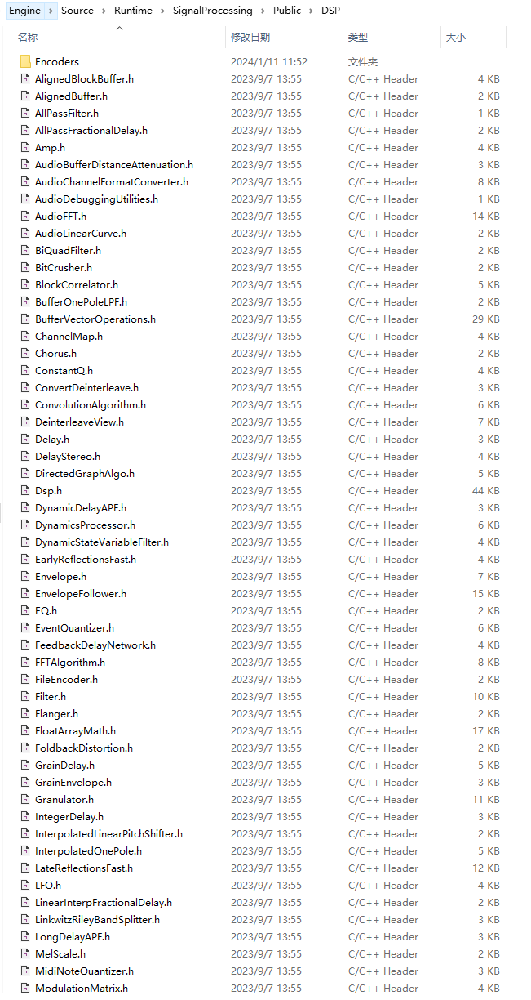

Voici quelques structures et fonctions couramment utilisées :

- **Audio::TCircularAudioBuffer** : Tampon circulaire, souvent utilisé pour le stockage d'audio en flux continu.
- **Audio::TSampleBuffer** : Permet de convertir les données RawPCM en données échantillonnables correspondant à la profondeur de bit, similaire à la `SampleValueWriteFunction` que nous avons fournie précédemment, mais ne prend en charge que `int16` et `float`.
- **Audio::FResampler** : Rééchantillonneur, utilisé pour modifier le taux d'échantillonnage de l'audio.
- **Audio::FWindow** : Permet de générer des fonctions de fenêtrage, avec support pour `Hamming`, `Hann` et `Blackman`.
- **Audio::TSlidingWindow** : Fenêtre glissante.
- **Audio::IFFTAlgorithm** : Fournit un algorithme FFT de base, créé via `FFFTFactory::NewFFTAlgorithm(...)`.
- **Audio::FBiquadFilter** : Filtre biquadratique.
- **Audio::FSpectrumAnalyzer** : Analyseur de spectre, avec support pour le spectre d'amplitude et le spectre CQT.
- **Audio::FAsyncSpectrumAnalyzer** : Analyseur de spectre exécuté dans un thread asynchrone, avec les mêmes fonctionnalités que ci-dessus.
- `ConstantQ.h` : Fournit une série de structures prenant en charge la transformation Q constante (CQT). Le CQT est souvent utilisé pour la visualisation spectrale de la musique ; il offre une meilleure représentation rythmique que la FFT.

Pour l'analyse spectrale, UE dispose également d'un module `AudioSynesthesia` pour étendre les fonctionnalités associées.

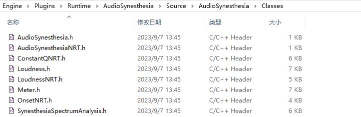

Il prend en charge l'analyse de **CQT** , **Onset (début)** , **Loudness (loudité)** et **Meter** . Malheureusement, la plupart des interfaces sont **NRT (non en temps réel)** , qui exigent que les données audio soient des actifs importés lors de l'édition. Cependant, de nombreuses structures algorithmiques peuvent être référencées.

### MetaSound

**MetaSound** est le nouveau système audio introduit par UE5. Par rapport à l'ancienne version **Sound Cues** , **MetaSound** offre non seulement de meilleures performances, mais surtout il prend en charge la **programmation procédurale** .

Actuellement, MetaSound montre un potentiel très important dans le domaine de **UGC** (Contenu Généré par les Utilisateurs) :

- **Mix Universe** : [Conférence | Intégrer de la musique dans « Mix Universe » (sous-titres officiels)](https://www.bilibili.com/video/BV1y84y1a7rr)
- **Fortnite** : [Fortnite - Composition AR](https://www.bilibili.com/video/BV1F94y1L7fW)

Si vous ne connaissez pas MetaSound, il est fortement recommandé de regarder cette vidéo de base :

- [Conférence | Guide MetaSound pour débutants (sous-titres officiels)](https://www.bilibili.com/video/BV15G4y1A7B5)

Créez un **MetaSoundSource** , construisez le graphique suivant, cliquez sur lecture, et vous entendrez une onde sinusoïdale familière :

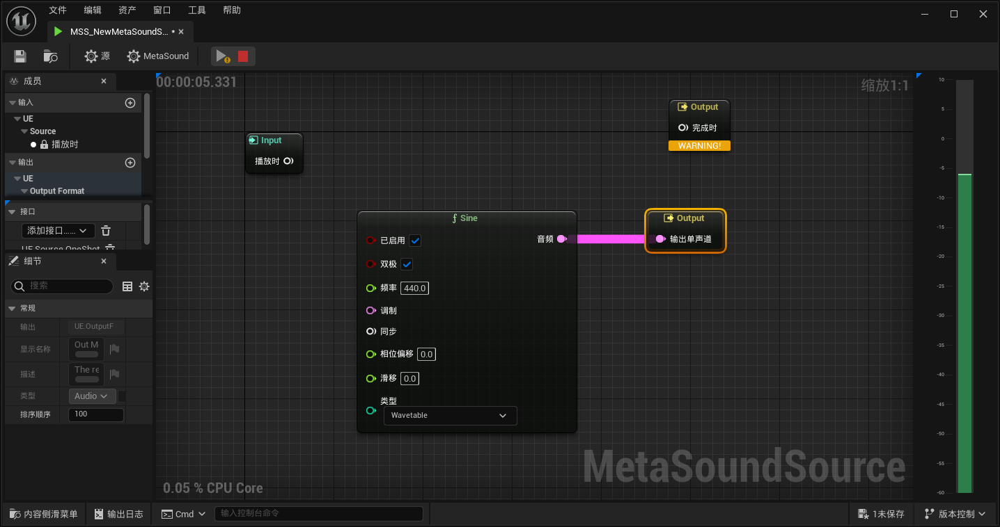

Le graphique de MetaSound est un graphe de flux de données, exécuté à chaque frame. Chaque nœud est un bloc de fonction, qui reçoit des entrées (Input), combine le contexte actuel d'exécution de MetaSound pour remplir les données de sortie (Output). L'audio généré à chaque frame est stocké dans le AudioBuffer de MetaSoundSource, en attente de lecture par le moteur audio.

> La broche Trigger (déclencheur) peut être simplement considérée comme une variable booléenne. Le nœud de sortie la mettra à true, et le nœud d'entrée lira sa valeur pour déterminer si la logique du nœud doit être exécutée.

Prenons l'exemple de l'onde sinusoïdale ci-dessus : lorsque le moteur lit MetaSound, il passe par les étapes suivantes :

- Tout d'abord, une tâche asynchrone pour construire le graphique MetaSound est créée, avec la pile d'appels de fonctions correspondante :

    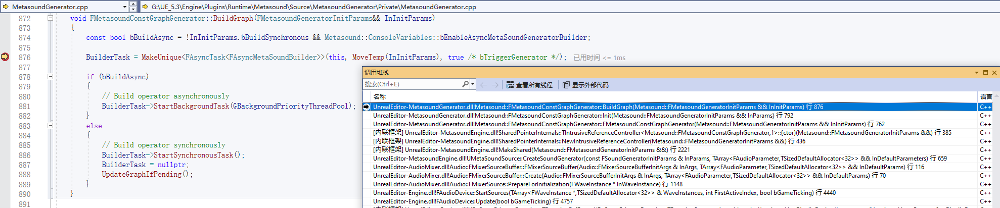

- Dans la tâche asynchrone, tous les nœuds sont chargés (les nœuds sans dépendance sont éliminés), et les nœuds restants sont triés topologiquement selon leurs relations de dépendance. La pile d'appels de fonctions correspondante est la suivante :

    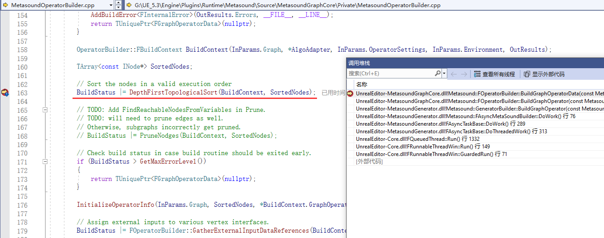

- Enfin, **IOperator** est créé via **INodeOperatorFactory** interne au nœud. La définition partielle de **IOperator** est la suivante : il fournit `BindInput`, `ResetFunction`, `ExecuteFunction` et `PostExecuteFunction` pour écrire la logique associée :

    ``` c++
    class IOperator
    {
    public:
        /** FResetOperatorParams contient les paramètres fournis à la fonction reset d'un IOperator.
         */
        struct FResetParams
        {
            /** Paramètres généraux de l'opérateur pour le graphique. */
            const FOperatorSettings& OperatorSettings; 
    
            /** Paramètres de l'environnement disponibles. */
            const FMetasoundEnvironment& Environment;
        };
    
        virtual ~IOperator() {}
        
        /** BindInputs lie les références de données dans l'IOperator avec FInputVertexInterfaceData.
         *
         * Toutes les références de données d'entrée doivent être liées à InVertexData pour prendre en charge
         * d'autres systèmes MetaSound tels que l'API MetaSound BP, le cache des opérateurs, 
         * et l'audition en direct. 
         *
         * Note : La fonction virtuelle IOPerator::BindInputs(...) deviendra une fonction
         * purement virtuelle lorsque IOperator::GetInputs() sera supprimé à partir de la version 5.5 ou ultérieure.
         *
         * Note : La liaison d'une référence de données peut mettre à jour l'objet sous-jacent
         * auquel la référence pointe. Tout opérateur qui met en cache des pointeurs ou des valeurs
         * à partir de références de données doit mettre à jour ses pointeurs mis en cache dans l'appel à
         * BindInputs(...). Les opérateurs qui ne mettent pas en cache le pointeur sous-jacent
         * d'une référence de données n'ont pas besoin de mettre à jour quoi que ce soit après BindInputs(...).
         *
         * Exemple :
         * 	FMyOperator::FMyOperator(TDataReadReference<float> InGain, TDataReadReference<FAudioBuffer> InAudioBuffer)
         * 	: Gain(InGain)
         * 	, AudioBuffer(InAudioBuffer)
         * 	{
         * 		MyBufferPtr = AudioBuffer->GetData();		
         * 	}
         *
         * 	void FMyOperator::BindInputs(FInputVertexInterfaceData& InVertexData)
         * 	{
         * 		InVertexData.BindReadVertex("Gain", Gain);
         * 		InVertexData.BindReadVertex("Audio", AudioBuffer);
         *
         * 		// Mettre à jour MyBufferPtr au cas où AudioBuffer référence un nouveau FAudioBuffer.
         * 		MyBufferPtr = AudioBuffer->GetData();
         * 	}
         */
        virtual void METASOUNDGRAPHCORE_API BindInputs(FInputVertexInterfaceData& InVertexData);
    
        /** BindOutputs lie les références de données dans l'IOperator avec FOutputVertexInterfaceData.
         *
         * Toutes les références de données de sortie doivent être liées à InVertexData pour prendre en charge
         * d'autres systèmes MetaSound tels que l'API MetaSound BP, le cache des opérateurs, 
         * et l'audition en direct. 
         *
         * Note : La fonction virtuelle IOPerator::BindOutputs(...) deviendra une fonction
         * purement virtuelle lorsque IOperator::GetOutputs() sera supprimé à partir de la version 5.5 ou ultérieure.
         *
         * Note : La liaison d'une référence de données peut mettre à jour l'objet sous-jacent
         * auquel la référence pointe. Tout opérateur qui met en cache des pointeurs ou des valeurs
         * à partir de références de données doit mettre à jour ses pointeurs mis en cache dans l'appel à
         * BindOutputs(...). Les opérateurs qui ne mettent pas en cache le pointeur sous-jacent
         * d'une référence de données n'ont pas besoin de mettre à jour quoi que ce soit après BindOutputs(...).
         *
         * Exemple :
         * 	FMyOperator::FMyOperator(TDataWriteReference<float> InGain, TDataWriteReference<FAudioBuffer> InAudioBuffer)
         * 	: Gain(InGain)
         * 	, AudioBuffer(InAudioBuffer)
         * 	{
         * 		MyBufferPtr = AudioBuffer->GetData();		
         * 	}
         *
         * 	void FMyOperator::BindOutputs(FOutputVertexInterfaceData& InVertexData)
         * 	{
         * 		InVertexData.BindReadVertex("Gain", Gain);
         * 		InVertexData.BindReadVertex("Audio", AudioBuffer);
         *
         * 		// Mettre à jour MyBufferPtr au cas où AudioBuffer référence un nouveau FAudioBuffer.
         * 		MyBufferPtr = AudioBuffer->GetData();
         * 	}
         */
        virtual void METASOUNDGRAPHCORE_API BindOutputs(FOutputVertexInterfaceData& InVertexData);
    
        /** Pointeur vers la fonction d'initialisation d'un opérateur.
         *
         * @param IOperator* - L'opérateur associé au pointeur de fonction.
         */
        using FResetFunction = void(*)(IOperator*, const FResetParams& InParams);
    
        /** Retourne la fonction reset à appeler pendant l'exécution du graphique.
         *
         * L'argument IOperator* de FExecutionFunction sera la même instance IOperator
         * qui a retourné la fonction d'exécution.
         *
         * Les valeurs de retour nullptr sont valides et indiquent un IOperator qui n'a pas besoin d'être
         * réinitialisé.
         */
        virtual FResetFunction GetResetFunction() = 0;
    
        /** Pointeur vers la fonction d'exécution d'un opérateur.
         *
         * @param IOperator* - L'opérateur associé au pointeur de fonction.
         */
        using FExecuteFunction = void(*)(IOperator*);
    
        /** Retourne la fonction d'exécution à appeler pendant l'exécution du graphique.
         *
         * L'argument IOperator* de FExecutionFunction sera la même instance IOperator
         * qui a retourné la fonction d'exécution.
         *
         * Les valeurs de retour nullptr sont valides et indiquent un IOperator qui n'a pas besoin d'être
         * exécuté.
         */
        virtual FExecuteFunction GetExecuteFunction() = 0;
    
        /** Pointeur vers la fonction post-exécution d'un opérateur.
         *
         * @param IOperator* - L'opérateur associé au pointeur de fonction.
         */
        using FPostExecuteFunction = void(*)(IOperator*);
    
        /** Retourne la fonction FPostExecute à appeler pendant la post-exécution du graphique.
         *
         * L'argument IOperator* de FPostExecutionFunction sera la même instance IOperator
         * qui a retourné la fonction d'exécution.
         *
         * Les valeurs de retour nullptr sont valides et indiquent un IOperator qui n'a pas besoin d'être
         * post-exécuté.
         */
        virtual FPostExecuteFunction GetPostExecuteFunction() = 0;
    };
    ```

    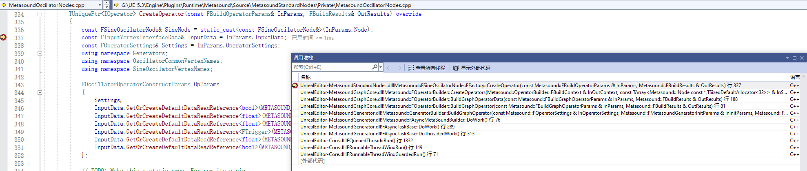

- Après le processus ci-dessus, le graphique est construit. Rappelez-vous ce que nous avons mentionné précédemment : si `bProcedural` de **USoundWave** est `true`, il créera un **ISoundGenerator** correspondant et appellera `ISoundGenerator::OnGenerateAudio` à chaque frame du moteur audio pour remplir les données. Exactement, **MetaSound** suit ce processus :

    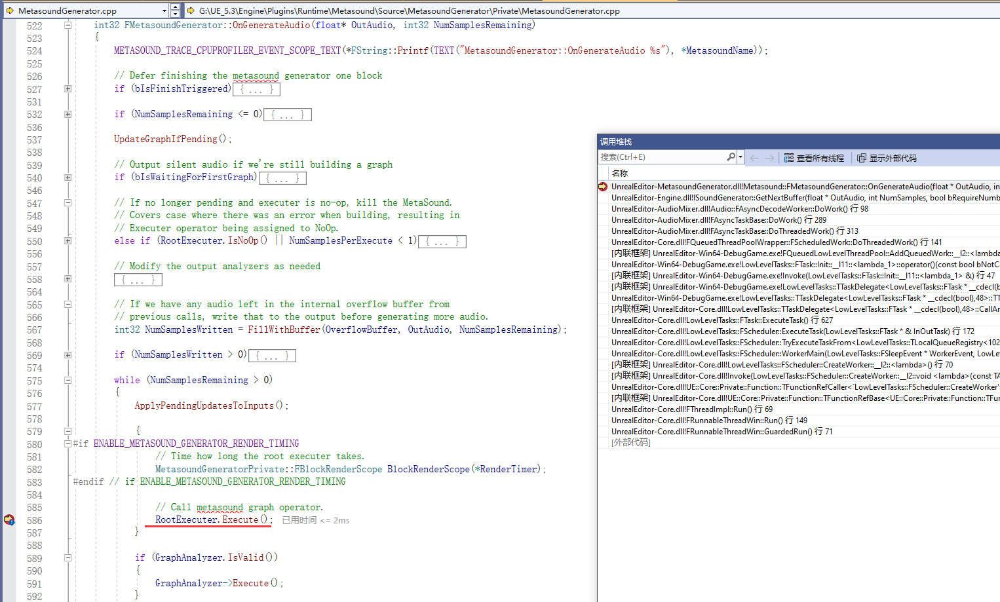

- Voyons ce que fait notre nœud sinusoïdal lors de l'exécution d'une frame :

    > À chaque frame de lecture, il incrémente `Phase` selon `DeltaPhase`, puis obtient la valeur de l'échantillon correspondante depuis `WaveTable` de **FSineWaveTableGenerator** et la remplit dans le AudioBuffer de sortie.

    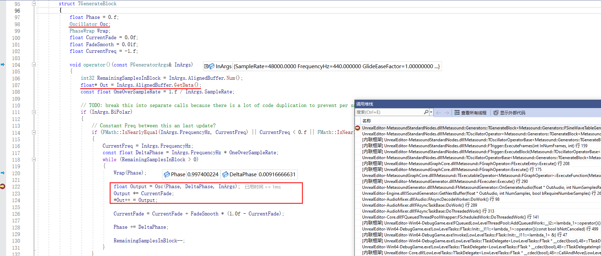

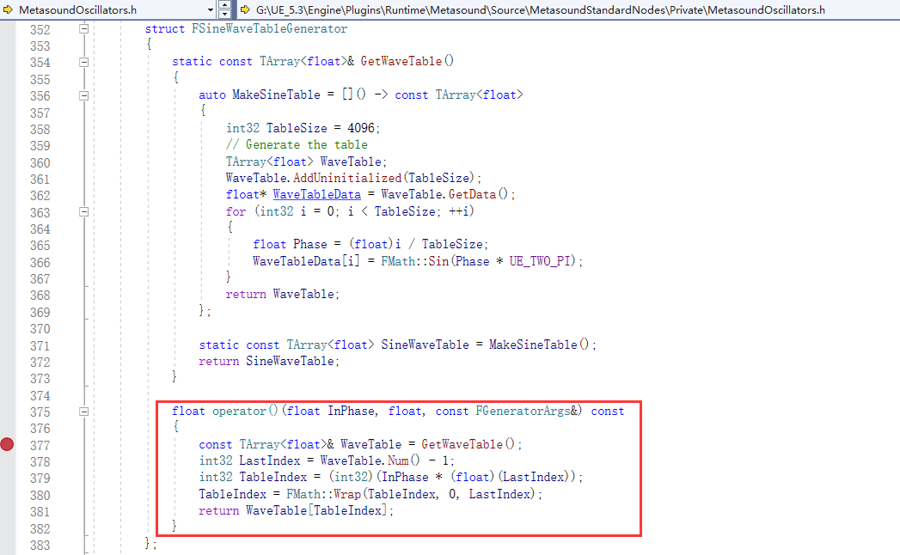

À ce stade, vous avez probablement compris les principes de base de **MetaSound** .

Mais pour bien utiliser MetaSound, des connaissances audio spécialisées supplémentaires sont nécessaires. Je suis également un novice dans ce domaine, donc je ne peux pas beaucoup aider~

Il fournit de nombreux nœuds de fonctions. Essayez-les, l'ordinateur n'explosera pas :

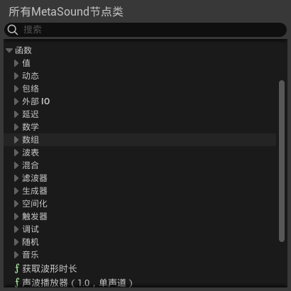

Mais parfois, ils ne répondent pas complètement à nos besoins. Maintenant, vous pouvez essayer de faire des extensions personnalisées.

#### Interaction avec Blueprint

**MetaSound** n'est pas identique à Blueprint ; les variables qu'il prend en charge sont relativement limitées :

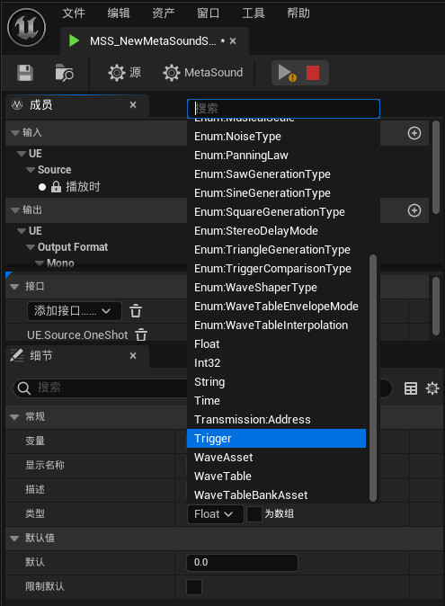

Vous pouvez également étendre ces variables en C++, à condition de trouver des références appropriées.

Ces paramètres ne sont pas directement exposés dans l'éditeur de propriétés, et modifier leurs valeurs est un peu complexe. Nous pouvons utiliser **UAudioComponent** pour simplifier ce processus : il dérive de **IAudioParameterControllerInterface** , qui fournit de nombreuses interfaces pratiques pour configurer les paramètres audio :

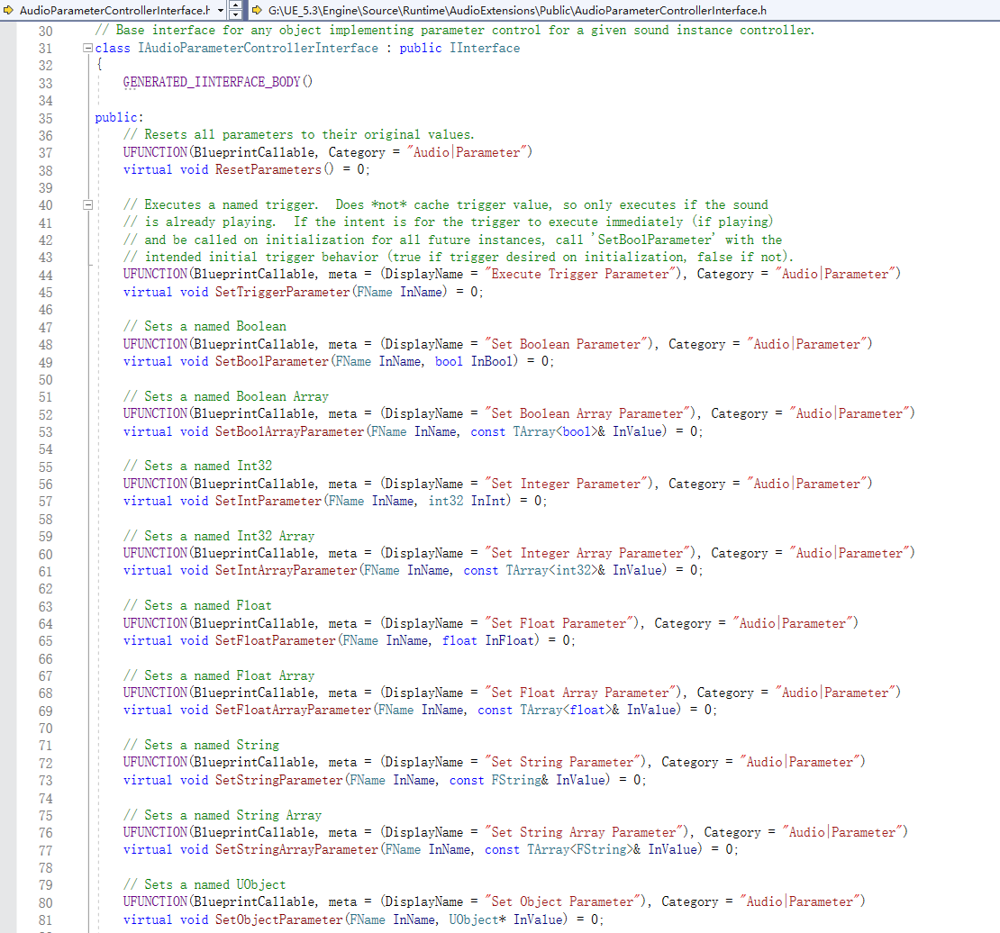

Si vous ne voulez pas utiliser **UAudioComponent** , vous pouvez référencer la mise en œuvre spécifique des fonctions associées.

Il faut mentionner spécifiquement `Trigger` dans le système audio UE : il n'est pas identique au `Delegate` couramment utilisé dans le code C++. Nous pouvons simplement le considérer comme une variable booléenne, par exemple avec ce graphique :

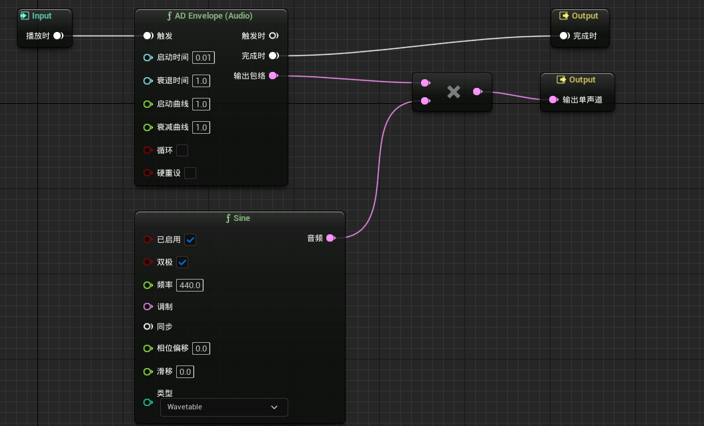

On sait que chaque nœud est exécuté selon le tri topologique des relations de dépendance. Lors de l'exécution de l'Input, le délégué de sortie `Lors de la lecture` est mis à true. Lors de l'exécution de `AD Envelope`, le délégué d'entrée `Déclenchement` lié au nœud (c'est-à-dire `Lors de la lecture`) est lu. Si sa valeur est true, le nœud est exécuté. Après l'exécution de `AD Envelope`, le délégué de sortie `Lors de l'achèvement` est mis à `true`. À ce moment, lors de l'exécution du nœud `Output`, si le délégué d'entrée `Lors de l'achèvement` est true, il notifie `MetaSoundSource` de terminer la lecture, c'est-à-dire ici :

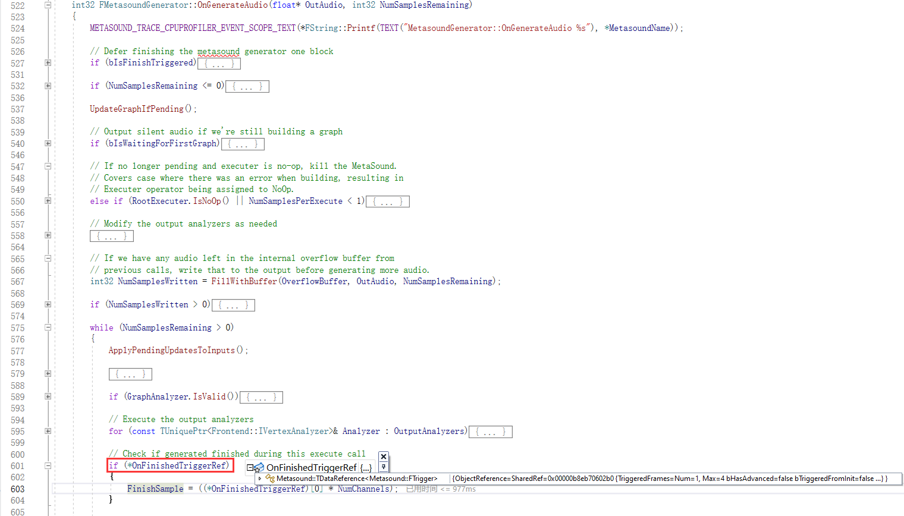

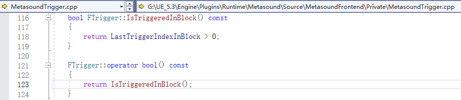

#### Construction à l'exécution

Dans [Sounds Good](https://www.bilibili.com/video/BV1EC4y1J7Bs), l'expert mentionne que MetaSound prend déjà en charge la construction du Sound Graph à l'exécution, mais cela n'est pas très完善 actuellement et est encore en phase de test. Dans **MetasoundEngineTest**, vous pouvez trouver beaucoup de code de test :

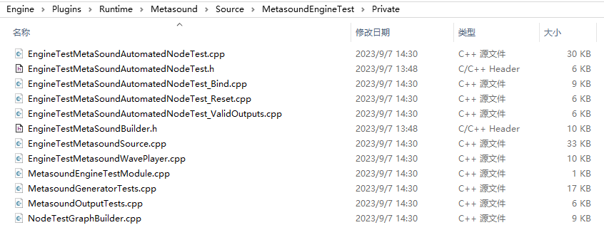

Compte tenu du fait que ce code pourrait subir des modifications importantes par la suite, nous ne l'étendons pas pour le moment. Cette section sera mise à jour une fois que la version officielle sera stable~

La démonstration mentionne également que MetaSound lancera un grand nombre de nouveaux contrôles audio !!!!!!!!!!!!!!!!!!!

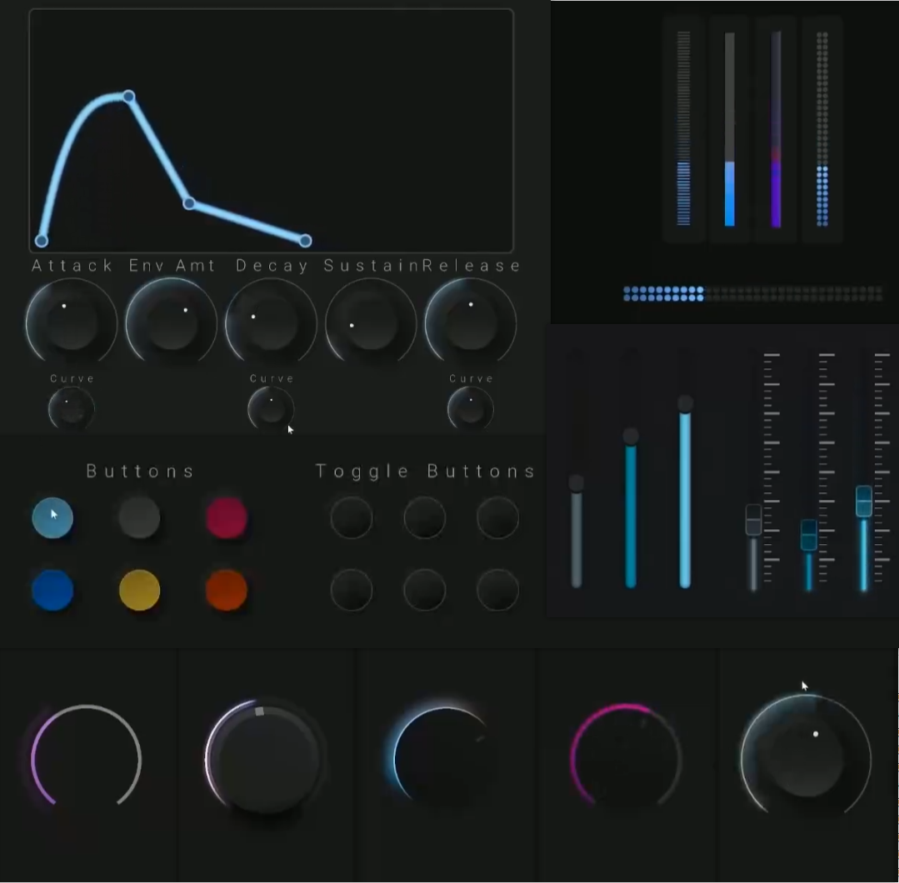