# Scène ouverte

- https://www.youtube.com/watch?v=Ur53sJdS8rQ

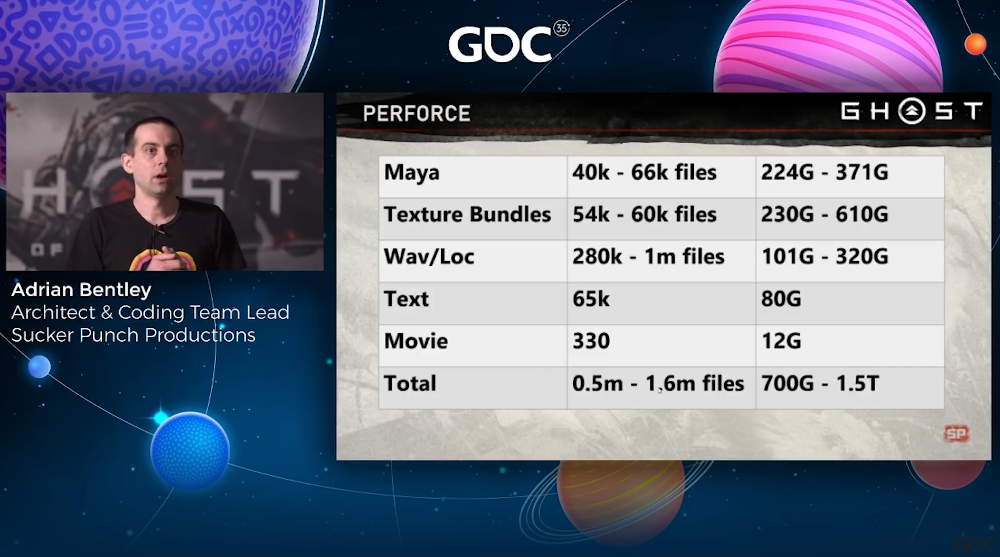

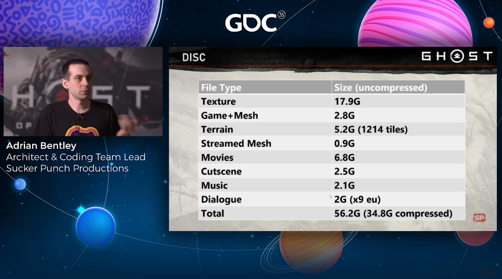

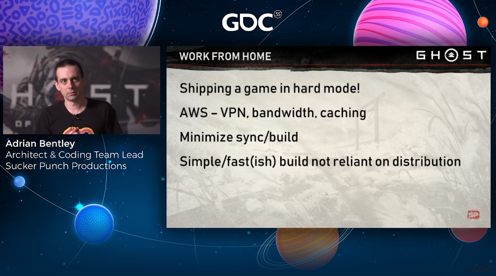

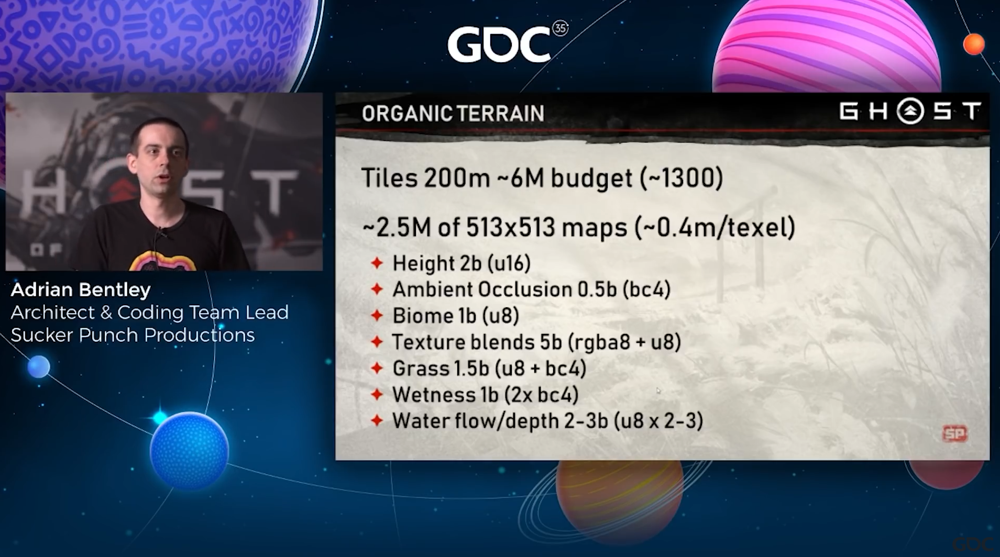

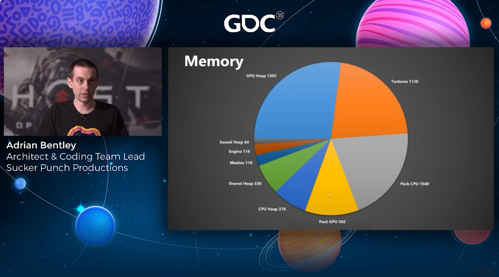

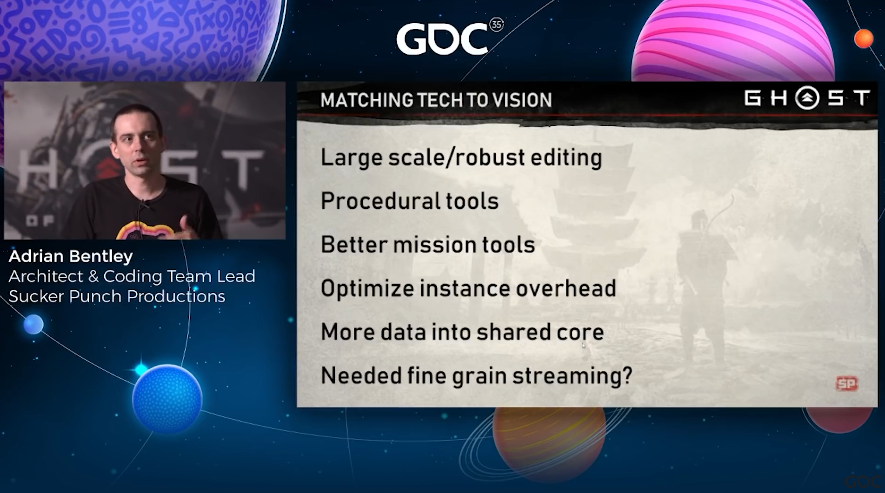

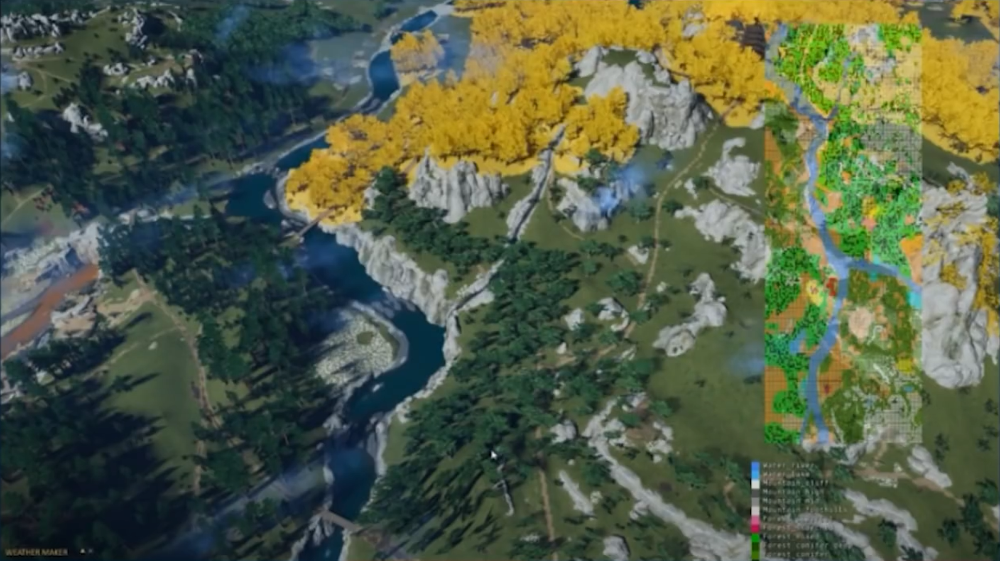

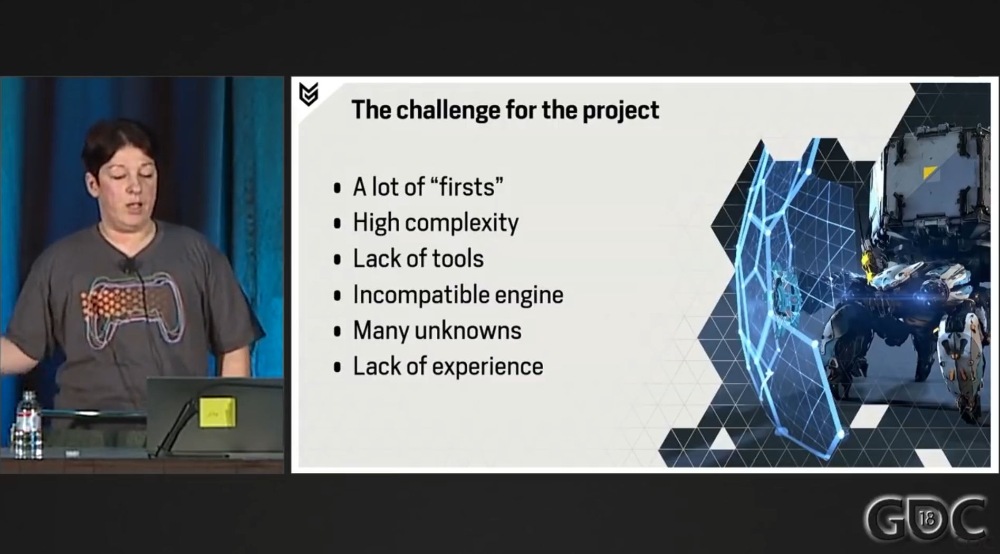

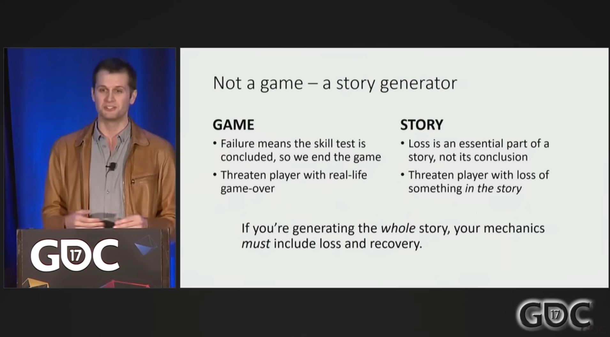

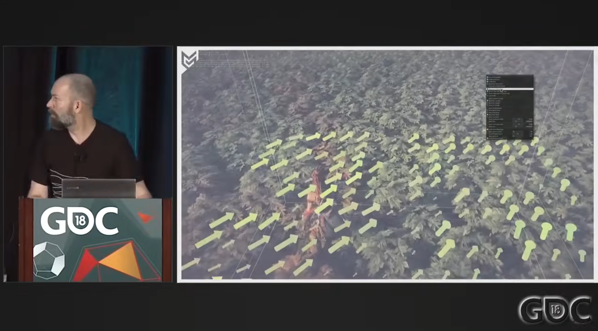

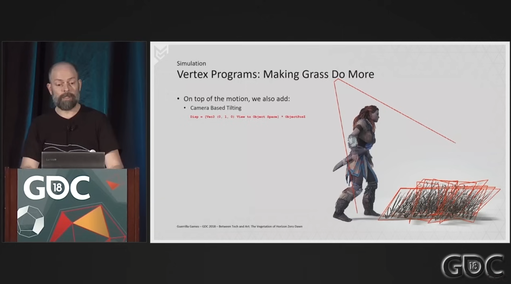

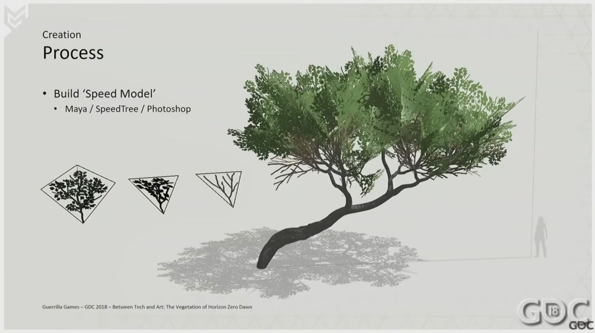

- Acceptation de la qualité du monde ouvert :
    - https://www.youtube.com/watch?v=2VDlX3Dqm0w
    - https://www.youtube.com/watch?v=VdqhHKjepiE
- Gestion de projet :
    - https://www.youtube.com/watch?v=M0uuDsjy4b0
    - https://www.youtube.com/watch?v=8m859pxcyLY
- Flux de travail de l'équipe Far Cry : https://www.youtube.com/watch?v=HEaJfXVspPc

https://www.youtube.com/watch?v=2VDlX3Dqm0w

## Éléments de scène

### Atmosphère céleste

### Nuages

### Lumière et ombre

### Terrain

### Modèle

- [Comprendre la création de scènes de jeu : rôle et processus de création des scènes de jeu - Études de游学 de NetEase (163.com)](https://game.academy.163.com/course/careerArticle?course=495&isMaster=0)

    

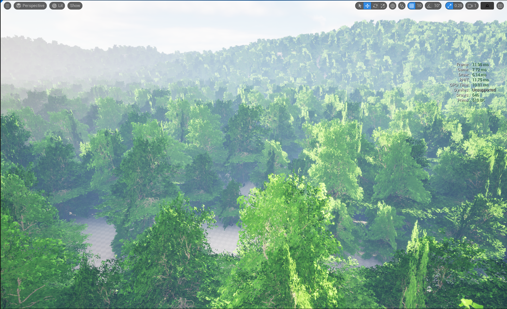

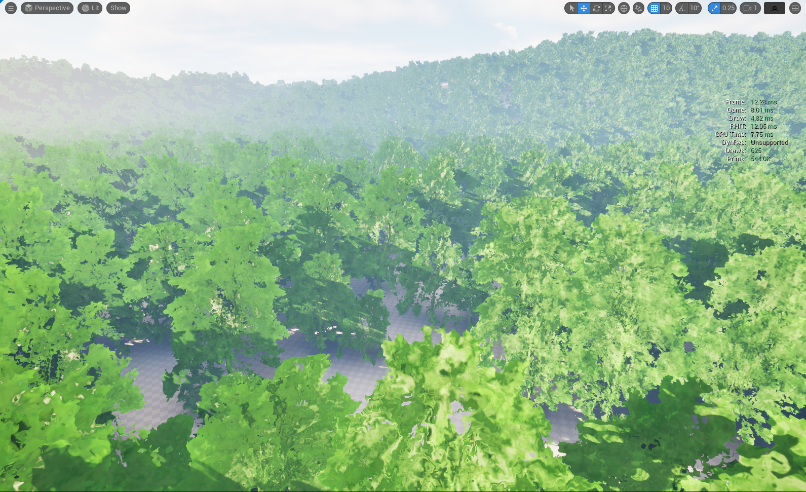

### Plantes

## Gestion du streaming

## Effets dynamiques

### Changement jour/nuit

### Changement des saisons

### Effets spéciaux

### Vent

### Eau

### Feu

### Pluie

### Neige

### Brouillard

### Poussière

### Électricité

### Lumière

[Éléments constitutifs de l'art de scène de jeu - Bilibili (bilibili.com)](https://www.bilibili.com/read/cv12101296/)

## Interaction de scène

### Interaction avec l'eau

### Interaction avec la végétation

[Interaction dynamique de la végétation --- herbe - Zhihu (zhihu.com)](https://zhuanlan.zhihu.com/p/151342889)

### Interaction avec le sol

### Interaction avec les objets

#### Cassure

#### Tissu

## Gestion de scène

## Gestion de projet

Environnement dynamique

- Météo Far Cry : https://www.youtube.com/watch?v=mGHCOOnI5aE
- Génération procédurale Far Cry : https://www.youtube.com/watch?v=JBp8zvLVsgg

- https://www.youtube.com/watch?v=JBp8zvLVsgg

- https://www.youtube.com/watch?v=wavnKZNSYqU&t=2412s
- https://www.youtube.com/watch?v=gJKGMFcg29c&t=2211s
- https://www.youtube.com/watch?v=WMObgeULNTI
- https://www.youtube.com/watch?v=Ibe1JBF5i5Y
- Construction de scène The Witcher 3 : https://www.youtube.com/watch?v=p8CMYD_5gE8

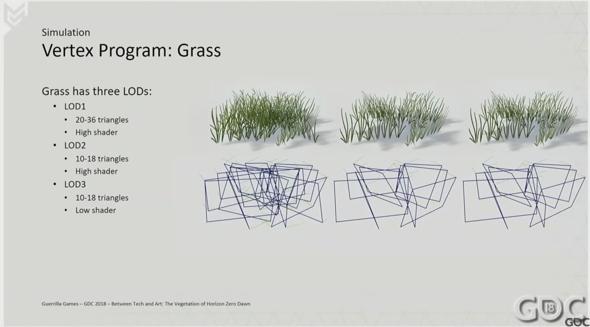

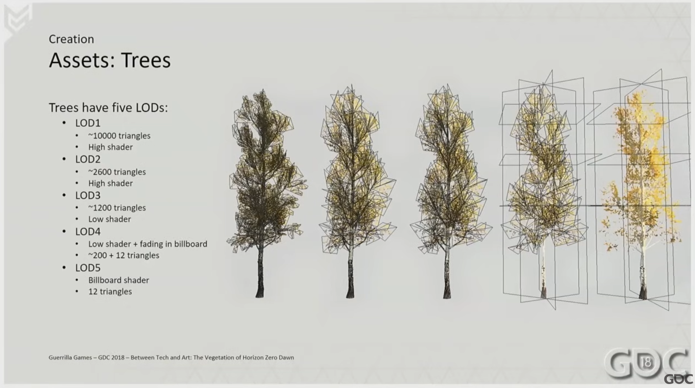

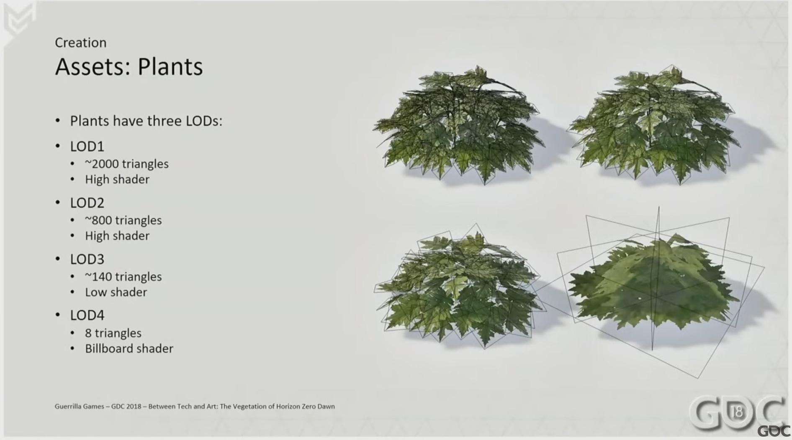

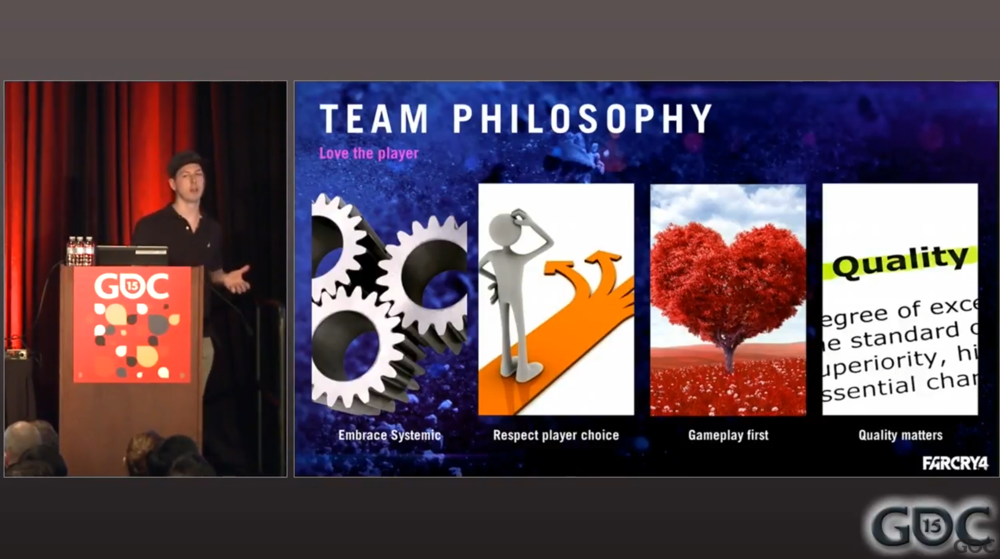

- [Optimiser UE5 : repenser les paradigmes de performance pour des effets visuels de haute qualité - Partie 1 : Nanite et Lumen | Unreal Fest 2023 | Communauté de développeurs Epic (epicgames.com)](https://dev.epicgames.com/community/learning/talks-and-demos/Vpv2/unreal-engine-optimizing-ue5-rethinking-performance-paradigms-for-high-quality-visuals-part-1-nanite-and-lumen-unreal-fest-2023)
- [Optimiser UE5 : repenser les paradigmes de performance pour des effets visuels de haute qualité - Pt 2 : Systèmes de support | Unreal Fest 2023 | Communauté de développeurs Epic (epicgames.com)](https://dev.epicgames.com/community/learning/talks-and-demos/VlO2/unreal-engine-optimizing-ue5-rethinking-performance-paradigms-for-high-quality-visuals-pt-2-supporting-systems-unreal-fest-2023)
- [Bonnes pratiques pour la végétation dans UE5 | Communauté de développeurs Epic (epicgames.com)](https://dev.epicgames.com/community/learning/talks-and-demos/2lyj/unreal-engine-vegetation-best-practices-for-ue5)
- [Géométrie virtualisée Nanite dans Unreal Engine | Documentation Unreal Engine 5.4 | Communauté de développeurs Epic (epicgames.com)](https://dev.epicgames.com/documentation/en-us/unreal-engine/nanite-virtualized-geometry-in-unreal-engine)
- [Éclairage global et reflets Lumen dans Unreal Engine | Documentation Unreal Engine 5.4 | Communauté de développeurs Epic (epicgames.com)](https://dev.epicgames.com/documentation/en-us/unreal-engine/lumen-global-illumination-and-reflections-in-unreal-engine)

- [Li Yuan Chun Cao - Jianshu (jianshu.com)](https://www.jianshu.com/u/e2b54829dd21)

- [Guide de construction du monde (qq.com)](https://mp.weixin.qq.com/s/sbsDIN6dUtq5CGhqRBR5oQ)