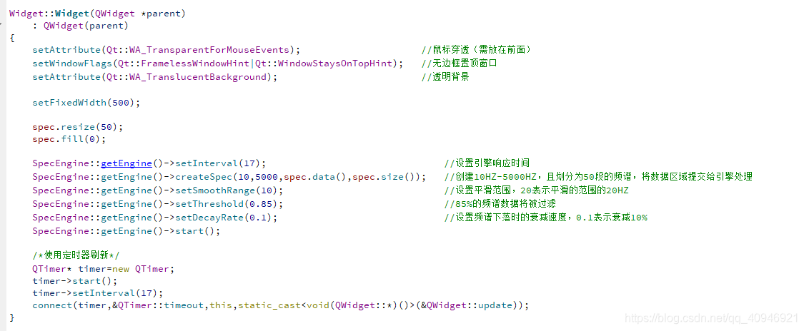

# Analyseur de visualisation audio

- Dépôt Github : https://github.com/Italink/SpectrumEngine

Le blogueur a récemment encapsulé le moteur de specinker dans une bibliothèque statique. Si vous savez programmer et que vous aimez le [spectre](https://so.csdn.net/so/search?q=频谱&spm=1001.2101.3001.7020), vous avez de la chance !

## Quelques propos futiles

Le blogueur pensait qu'en encapsulant le moteur dans une bibliothèque dynamique, il pourrait être utilisé de manière uniforme par les langages capables d'appeler des DLL (C/C++, Java, Python...). C'était une bonne idée, mais sans parler de Java et Python, le portage de Qt vers VS a été très difficile. La raison en est que le compilateur par défaut de Qt est MinGW, qui génère des fichiers de bibliothèque statique .a. Or, VS ne peut pas analyser les fichiers .a, il ne peut que traiter les bibliothèques .lib. J'ai donc recompilé avec MSVC et lié diverses bibliothèques système. Le programme a pu s'exécuter, mais une erreur s'est produite lors de l'appel. La cause était que la création de threads et l'utilisation de certaines fonctionnalités Qt dans mon code nécessitaient QApplication, qui demande à VS de configurer un environnement d'exécution Qt. Après plusieurs jours de travail, j'ai découvert que la bibliothèque que j'avais encapsulée ne pouvait toujours être utilisée que dans Qt (même sur VS, il faut configurer un environnement Qt) et uniquement via des appels C++. J'ai pensé à une autre approche : transférer les données via la mémoire partagée du système, ce qui permettrait de traiter les données de spectre entre différents langages, mais cela serait plus compliqué et je n'ai pas eu le temps de m'y atteler récemment. Si vous savez comment résoudre ce problème, n'hésitez pas à me le dire !

Ensuite, exécutez le programme et lancez la lecture de la musique, vous verrez :

Vous pouvez consulter la méthode d'utilisation de la bibliothèque dans le widget du projet.

