# ツールチェーン

> **もし太陽を見たことがなければ**
>
> **闇を我慢できただろう**
>
> しかし太陽は私の荒廃を
>
> より新しい荒廃に変えた
>
> ​			— エミリー・ディキンソン

人は自分の世界に溺れがちで、変化を求めない傾向がある

しかし「工欲善其事、必先利其器（仕事をよくするにはまず道具を整えよ）」、変革にはリスクが伴うが、墨守成規（古い規則に固執する）は最終的に淘汰される運命にある

優れたツールチェーンは開発効率を大幅に向上させることができる。人生は短いので、必ず自分を大切にしよう...

> 以下のツールが**現代的**でない場合は、誤った情報を与えないようにブロガーに速やかに連絡してください...

## IDE

**IDE（Integrated Development Environment 統合開発環境）**は現代のプログラマーが最も頻繁に接触するツールで、コンパイルツールを提供するだけでなく、通常以下の機能も含む：

- テキストエディタ：コードを記述し、構文の色分けにより可読性を高める
- インテリセンス：コードの一部を入力するだけで全コードを提示し、開発者のコード記述速度を向上させる
- デバッガ：プログラムの実行ステップを定点で実行し、プログラムの誤りロジックを迅速に発見しやすくする
- 美しいインターフェース：各種ボタン、パネル、メニュー、ウィンドウなどのコントロールが整然と配置され、操作がより便利になる
- パフォーマンス分析：CPU使用率、メモリ消費量などプログラムの各種パフォーマンスを分析するツールを提供
- プロジェクト管理ツール：ソースファイル、画像、動画、サードパーティライブラリなどプログラムに関連するすべてのリソースを管理する
- ...

現在主流のC++ IDEは以下の通り：

- [Visual Studio](https://visualstudio.microsoft.com/zh-hans/)：マイクロソフトが提供するIDEで、多くの人から「宇宙一のIDE」と尊称されている。容量は大きいが、Windowsシステム下での開発の第一選択肢である。

  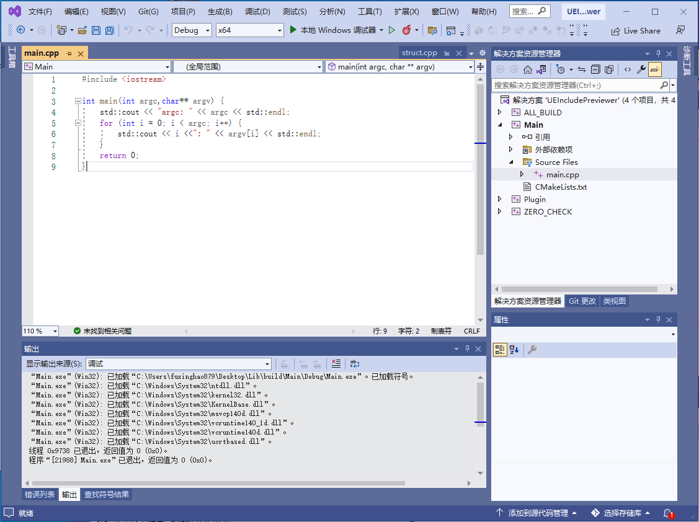

- [Qt Creator](https://www.qt.io/product/development-tools)：Qt公式が提供するIDEで、クロスプラットフォーム対応。機能は普通だが、Qtプログラムの開発には比較的友好的である。

  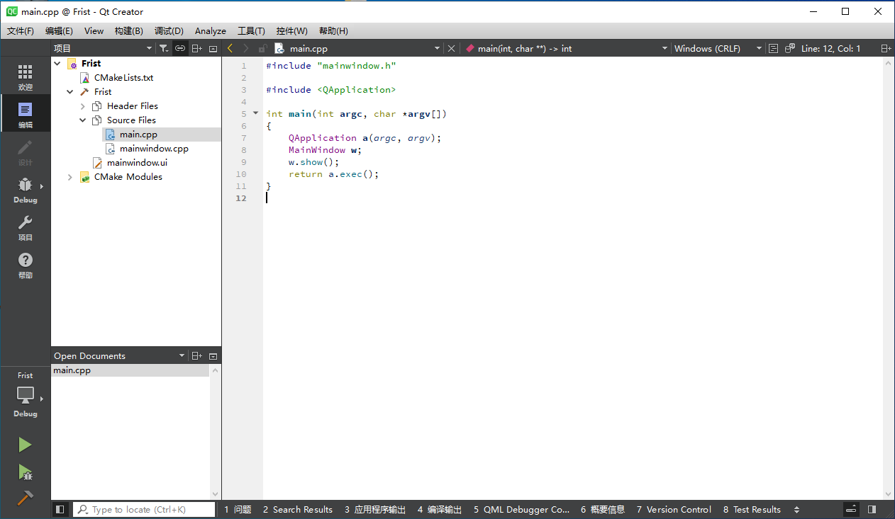

- [Clion](https://www.jetbrains.com/zh-cn/clion/)：**JET BRAINS**が提供するIDEで、コードの補助機能が非常に優れている。同社の別のIDEである**Rider**は、ゲームエンジン開発のために専用に作られている。

  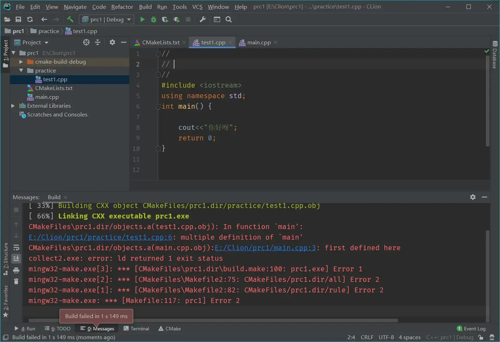

- [XCode](https://developer.apple.com/xcode/)：Macシステム下のIDE

  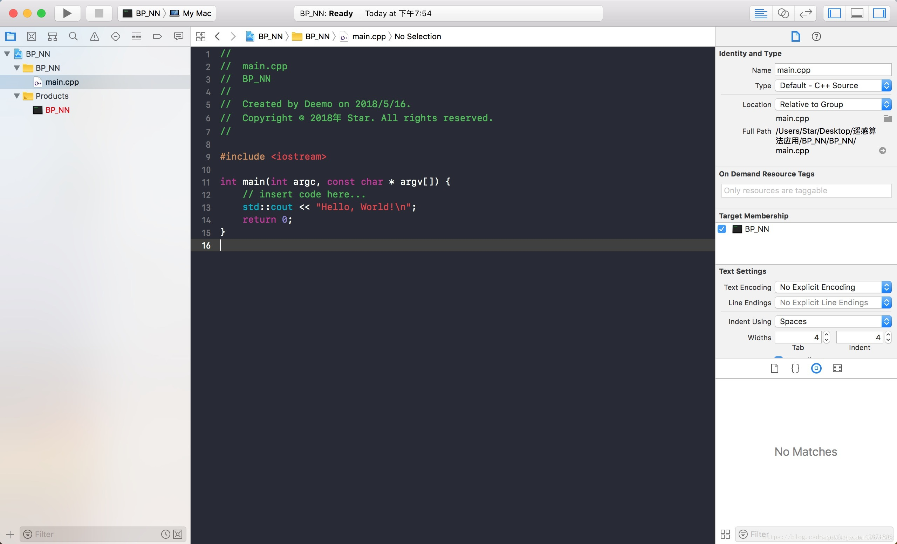

- [Visual Studio Code](https://code.visualstudio.com/)：マイクロソフトが提供するクロスプラットフォームコードエディタで、拡張プラグインを通じてプログラムのコンパイルも可能になる。

  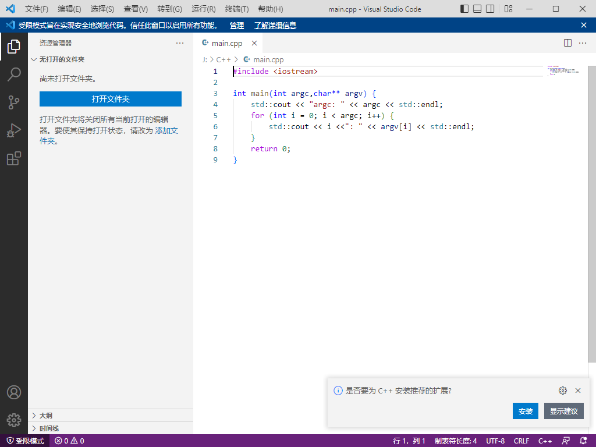

筆者にとって、初期は学校に強制されてDevC++、VC6.0を使用して問題を解いていた。当時は楽しんで使っていたが、今になって見直すと確かに少し見劣りする感じがする~

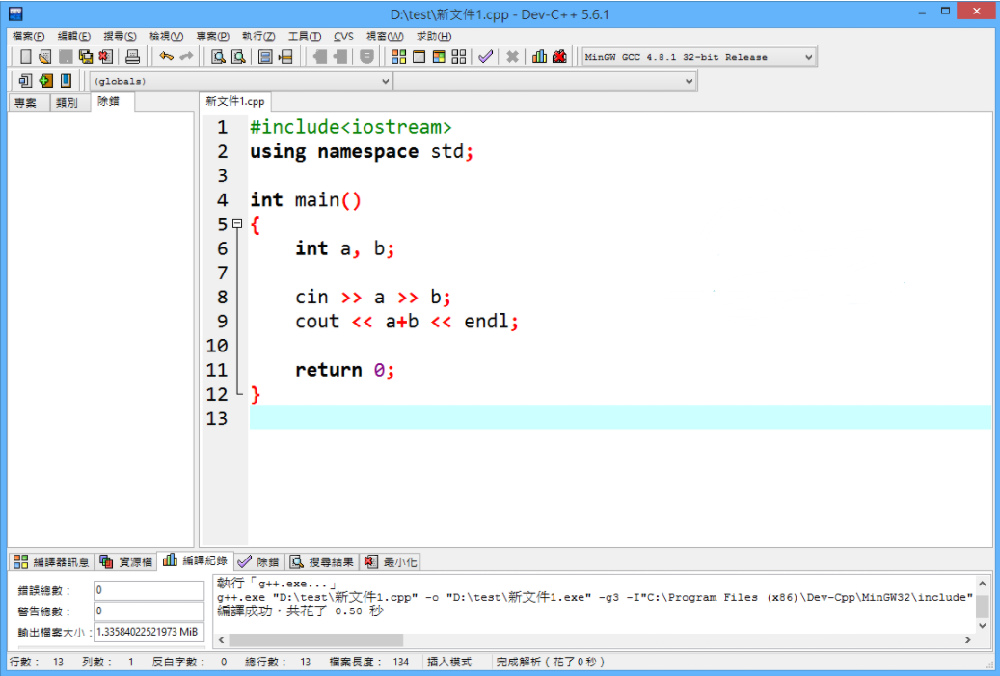

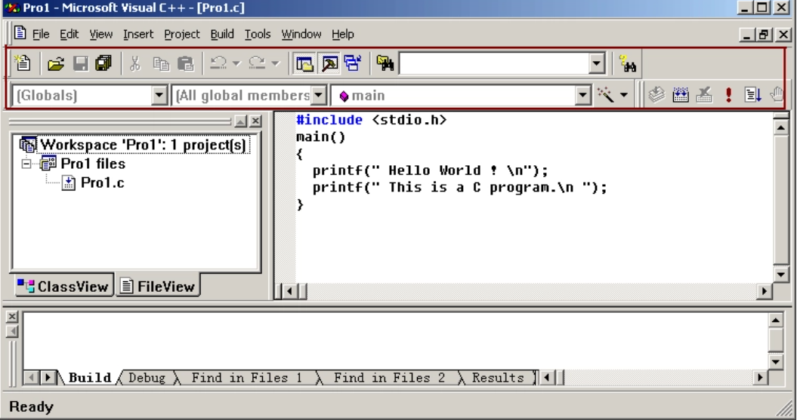


筆者のIDEは以前以下の段階を経てきた：

VC6.0 > Dev c++ > Visual Studio > IDEA(Java) > Qt Creator

現在、筆者はWindows環境下で**Visual Studio**を使ってC++コードを記述し、**Visual Studio Code**を使ってLua、Python、GLSLなどの一般的なテキストファイルを処理している。

**Visual Studio Code**は間違いなく非常に優れたテキストエディタであり（非常に多くのプラグインを持っている）

C++のIDEは実質的に大差なく、必要な機能は基本的にすべて備わっている。筆者が**Visual Studio**をC++開発に使用する主な理由は、UIが美しく、中国語化が完全であることだ...

### Visual Studio

必ず公式ドキュメントを参照してください：https://docs.microsoft.com/en-us/visualstudio/windows


#### 常用プラグイン

- [VAssistX](https://www.wholetomato.com/)：大量の補助機能を提供し、コーディング効率を向上させる。必ず参照してください：https://www.wholetomato.com/features

- [CodeMaid](https://www.codemaid.net/)：コードの整理と簡略化に使用され、いくつかの編集機能を提供する。

- [Qt VS Tools](https://doc.qt.io/qtvstools/index.html)：QtのVSプラグインで、設定でF1を押して対応するコードのQtドキュメントを開く機能を有効にできる。

#### 常用ショートカット

- コード編集

  - カット/コピー/ペースト：`Ctrl+X` / `Ctrl+C` / `Ctrl+V`
  - コードコメント/解除：`Ctrl+K` + `Ctrl+C`  / `Ctrl+K` + `Ctrl+U`
    - 新しい行を作成
  
      - 下方：`Ctrl+Shift+Enter`
      - 上方：`Ctrl+Enter`
  - 本行をコピーして下方にペースト：`Ctrl+D`
  - 元に戻す/やり直し：`Ctrl+Z` / `Ctrl +Y`
    - 大文字小文字変換：
      - 小文字に変換：`Ctrl+ U`
      - 大文字に変換：`Ctrl+Shift+U`
  - インテリセンスをトリガー：`Ctrl+J` または `Alt+ →`
  - 自動補完をトリガー：`Alt+Enter`
- 閲覧と検索

  - ヘッダーファイルとソースファイル間のジャンプ：`Alt+O`
  - 現在のファイル内検索/置換：`Ctrl+F` / `Ctrl+H`
  - グローバルファイル検索/置換：`Ctrl+Shift+F` / `Ctrl+Shift+H`
  - ファイル名で検索してジャンプ：`Ctrl+1` + `Ctrl+F` （先にCtrl+数字1を押し、次にCtrl+Fを押す）
  - 行数でジャンプ：`Ctrl+G`
  - 閲覧位置の戻る/進む：`Alt+←` / `Alt+→`
  - アクティブファイル間の切り替え：`Ctrl+Tab`
  - 現在のコードブロックを折りたたみ/解除：`Ctrl+M` +`Ctrl+M` 
  - すべてのコードを定義まで折りたたみ/解除：`Ctrl+M` + `Ctrl+O` / `Ctrl+M` + `Ctrl+X`

  - カーソルジャンプ
    - 行頭/行末：`Home` / `End`
    - ファイル頭/ファイル末：`Ctrl+Home` / `Ctrl+End`

  - ページ送り：`Page Up` / `Page Down` 

#### 達成目標

- プラグインとモジュールのインストールと更新方法を知る
- ステップ実行デバッグ、メモリ及びパフォーマンス探查ツールを熟练に使用し、[PDB](https://docs.microsoft.com/en-us/visualstudio/debugger/specify-symbol-dot-pdb-and-source-files-in-the-visual-studio-debugger?view=vs-2022)ファイルを理解する
- 各種ショートカットを熟练に使用する
- プロジェクト設定における各パラメータの意味を理解する
- コードファイルのエンコーディング形式に注意する

## ビルドツール

前のセクションでは、Visual StudioのCLコンパイラを使ってC++のコンパイルフローを簡単に説明した。実際のプロジェクト開発では、プロジェクトが単一のソースファイルだけで構成されることはほとんどない。これは大量のコンパイル命令を記述する必要があることを意味するが、幸いにも命令を**makefile**ファイルに記述し、**make**ツールを通じてビルドできる。しかし、ここには非常に深刻な問題が存在する：

> Windows下の命令をLinuxに置くと、認識されないのだ~

是的、makefileは直接オペレーティングシステムの命令を呼び出すが、各システム間の命令には差異が存在するため、多くのクロスプラットフォームプロジェクトビルドツールが登場した。例えば：

- [cmake](https://link.zhihu.com/?target=https%3A//cmake.org/)：現在主流のクロスプラットフォームビルドツール
- [qmake](https://link.zhihu.com/?target=https%3A//doc.qt.io/qt-6/qmake-manual.html)：Qtが提供するビルドツールで、現在Qtは全面的にCmakeに移行し、qmakeは維持されなくなった。
- [nmake](https://link.zhihu.com/?target=https%3A//docs.microsoft.com/en-us/cpp/build/reference/nmake-reference)：Visual Studioの組み込みツールで、Makefileに記述されたコンパイルリンクステップを実行する。
- [xmake](https://link.zhihu.com/?target=https%3A//xmake.io/)：国人が開発したLuaベースの軽量クロスプラットフォームビルドツール。
- UBT：Unreal EngineにおけるC#ベースのビルドツール

大部分のC++初学者にとって、プロジェクトのビルドは多くの場合IDEのグラフィカルインターフェースを直接使用し、操作ボタンをクリックしてソースファイルを追加することだろう。例えばVisual Studio：

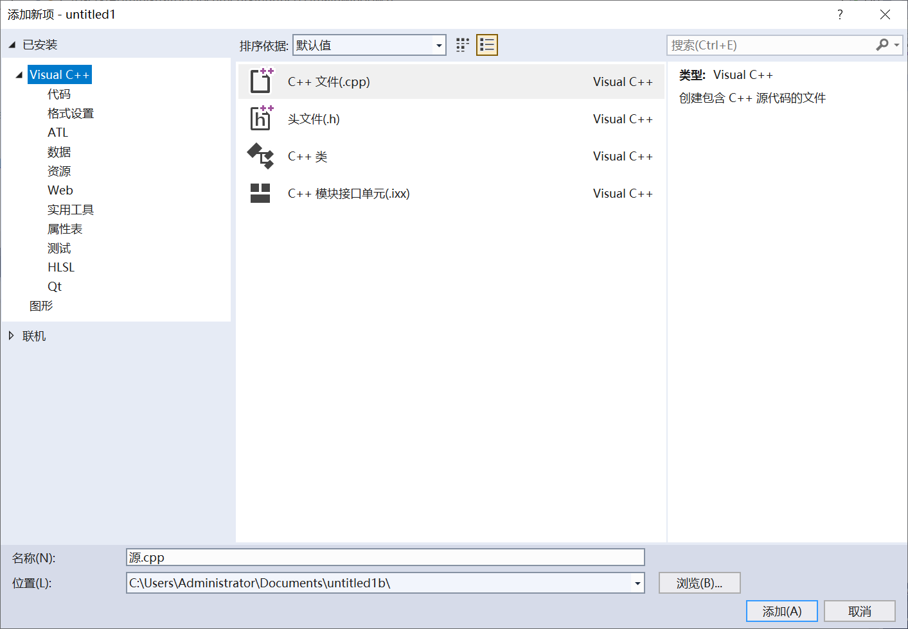

グラフィカルインターフェースは使用しやすいが、いくつかの欠点も存在する：

- IDE自体がクロスプラットフォームをサポートしていない場合、そのプロジェクトファイルもクロスプラットフォームできないため、他のプラットフォームではコンパイルできない
- 異なるシステムでは異なるビルド設定が存在し、グラフィカルインターフェースでは静的な設定しかできず、自動化されたビルドロジックを実現できない
- グラフィカルインターフェースで設定されたプロジェクトファイルは、ファイルパスやシステムが変更された場合、以前のリンクが失われる可能性がある
- ライブラリの管理が混乱しやすく、かつ非常に煩雑...

> そうは言っても、筆者は早期にビルドツールを使用せず、純粋なグラフィカルインターフェースでプロジェクトを記述しても何の問題もなかった（技術力不足が原罪だ）
>
> グラフィカルインターフェースの使用を放棄する主な原因は：
>
> - プログラムのコンパイル前に、プロジェクト内の一部のファイルを「前処理」してからC++コンパイラに渡す必要がある（QtのMocを模倣：[XObject](https://github.com/Italink/XObject)）
> - プログラムのコンパイル前に、いくつかのスクリプトや命令を実行する必要がある。例えば、シェーダーコードを事前にバイナリファイルにコンパイルする

上記の**多くのビルドツールの中でどれを選ぶべきか？**

### CMake

なぜCMakeなのか、それは非常に強力だからか？いいえ、それは主な原因ではない。最も根本的な原因は：**大部分のオープンソースコミュニティがCMakeをビルドツールとして使用している**ため、他のサードパーティライブラリを容易に導入できるからだ。

多くの人がCmakeが難しいと不満を言うかもしれない。その構文はクソのようだが、実際に難しいのはCmakeではない。プロジェクトの規模が大きくなると、ビルドロジックは必然的に複雑になる。どのビルドツールも主体的なロジックはほぼ同じで、核心的なビルド文は数行だけである。多くののはいくつかのビルドオプション、クロスプラットフォーム設定、自動化スクリプトなどだ。一つのビルドツールを理解すれば、他のものは簡単に理解できる。

CMakeを使用してプロジェクトを管理する主なメリットは以下の通り：

- CMakeは各プラットフォームのIDEプロジェクトファイルを生成できる
- CMakeを使用してロジックコードを記述し、自動化されたビルドを完成させ、各プラットフォームのビルドの詳細に適応できる
- サブプロジェクト（ライブラリ）の管理が容易
- プロジェクトファイルは依存関係分析を行い、コンパイル速度が非常に速い

初学者にとって、一般的にCMakeGUIの使用とCmakeListsの基本構文を習得するだけで十分だ。

#### CMake GUI

CMake GUIは**親切な**グラフィカルインターフェースで、コマンドライン操作に代わることができる。

Cmakeをインストールした後、CMake GUIのデスクトップショートカットを作成することに注意してください。

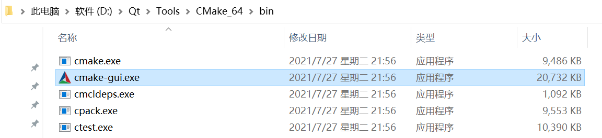

CMakeプロジェクトをビルドしたい場合は、直接CMake GUIを開く：

- CMakeLists.txtをウィンドウにドラッグし、`Where to build the Binaries`（バイナリのビルド先）を設定する。筆者は通常ソースディレクトリの後に`/build`を追加する。

- `Configure`をクリックするとポップアップウィンドウが表示され、生成したいIDEプロジェクトファイルといくつかのコマンドラインパラメータを選択する。

  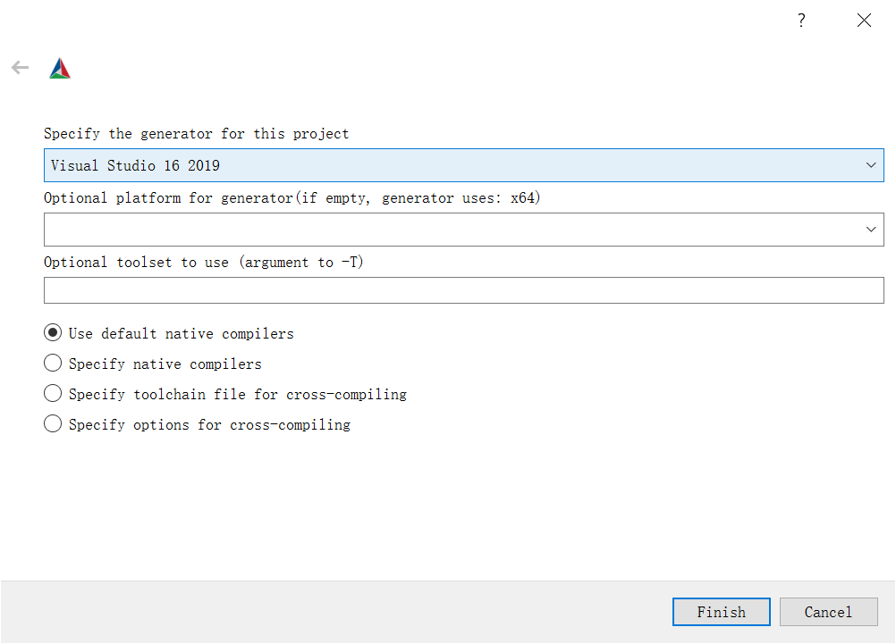

- `Finish`をクリックすると、調整可能な設定オプションが表示され、説明に従って調整できる。

- 再び`Generate`をクリックすると、対応するIDEのプロジェクトファイルが生成される。

- 最後に`Open Project`をクリックすると、対応するIDEで直接プロジェクトが開かれる。

後でコードファイルの構造が変更された場合は、Cmake GUIで再度`Generate`する必要がある。ただし、一般的にIDEは**CMakeListsの内容が変更されたことを検出すると**自動的に`Generate`をトリガーする。

> Qt CreatorやVisual Studioなど、一部のIDEは直接CMakeList.txtを開くことをサポートしている。Visual Studioについては、筆者はCMake GUIの方式でVSのプロジェクトファイル（`*.sln`）を生成することを推奨する。


#### CMakeList基本構文

CMakeは難しくない。ただプロジェクト情報を設定するだけ：

``` cmake
project(${ProjectName} VERSION 0.1 LANGUAGES CXX)
```

Cmakeの最小バージョンを制限する：

``` cmake
cmake_minimum_required(VERSION 3.5)
```

元の【手動でボタンをクリックしてソースファイルを追加する操作】は以下に置き換えられる：

``` cmake
add_executable(${TargetName} *.h *.cpp ...)				//実行ファイルを作成
// add_library(${TargetName} STATIC *.h *.cpp ...)		//静的ライブラリを作成
// add_library(${TargetName} SHARED *.h *.cpp ...)		//動的ライブラリを作成
```

他のライブラリを導入したい場合は以下を使用：

``` cmake
target_link_libraries(${TargetName} PRIVATE ${LibraryName})  
//PRIVATEは${TargetName}だけが${LibraryName}のコードにアクセスできることを意味する
//PUBLICは${TargetName}を導入した他のライブラリも${LibraryName}のコードにアクセスできることを意味する
```

Includeパスを追加したい場合は以下を使用：

``` cmake
target_include_directories(QEngineEditor PRIVATE ${IncludeDir}) 
```

ローカル変数を操作したい場合は直接以下を使用：

```cmake
set(VarName "This is String")
messgae(Warning ${VarName})  // ${}で変数を囲んで読み取る。ここではVarNameの値を出力する操作
```

サブディレクトリを追加したい場合は以下を使用（サブディレクトリとはCMakeLists.txtを持つパスを指す）

``` cmake
add_subdirectory(${Subdir})
```

基礎的な操作はこれだけである。ある設定や機能が合理的であると感じれば、それは大概率存在する。インターネットで検索したり、公式サイトで調べたりすれば出てくる。ビルドファイルの変更は頻繁ではないので、主体的なロジックを知っていれば十分だ。

ビルドツールは実質的に大差なく、何を使っても構わない。それらの使用は難しくないが、关键は各種プラットフォームとフレームワークの詳細な設定である。これは避けられない。

CMakeの使用については、インターネットに多くの優れたチュートリアルが存在するが、筆者は公式ドキュメントを読むことを推奨する：https://cmake.org/cmake/help/latest/guide/tutorial/index.html


## パッケージ管理

Pythonを使用したことがある人は、パッケージ管理ツールである`pip`を使用したことがあるだろう。

`pip install ...`を使用してpythonにサードパーティライブラリを迅速にインストールできる。

C++のパッケージ管理は常に混乱している。自分のプロジェクトにサードパーティライブラリ（例えばOpenCV、ffmpeg...）を導入したい場合、公式ウェブサイトからダウンロードする必要がある。もしCMakeでビルドされたソースコードであればまだ良いが、ライブラリファイルであれば、コンパイルタイプがDebugかReleaseか、動的ライブラリか静的ライブラリか、MDかMTか、32ビットか64ビットかに注意する必要がある...

多くの人はライブラリのインストール時に各種設定に苦労したことがあるだろう。今、ついに大家を救うツールが登場した —— [Vcpkg](https://github.com/microsoft/vcpkg)

> VcpkgはWindows、Linux、MacOS上でCおよびC++ライブラリを管理するのを助ける。

その使用方法については以下を参照：

- https://github.com/microsoft/vcpkg/blob/master/README_zh_CN.md

## バージョン管理

その日、筆者はバージョン管理のない時の恐怖を思い出した...

筆者が早期に学習していた時は、バージョン管理ツールについて何も知らなかった。普段は問題を解くだけで、コード量はせいぜい百行程度で、小さなプロジェクトを書いても千行程度だった。後にプロジェクトの規模が大きくなり、Featureのコード変更が比較的大きくなったため、着手する前にソースコードをコピーしてバックアップしておく習慣を身につけた。新しいコードに「莫名其妙」な、修復不可能なエラーが入るのを防ぐためだ。

早期のこの方法には特に問題はなかった。しかし、ある日筆者がコードを書き込んでバックアップを取らなかった。約一週間のコード変更が非常に多く、一日調べても原因が見つからず、頭が破裂しそうになった。後に仕方なく、以前のバックアップから再び書き直し、少しずつ追加し、少しずつテストした。約三日間かかってやっと問題を修復し、進捗を回復した。

その三日間、筆者は毎日が長く感じ、一行一行の馴染みのあるコードを見ながら、小心翼翼に再び書き直し、一度は諦めたくなったが、自分自身に耐えて坚持するよう説得し続けた...

それでも筆者は新しいものを理解する時間を浪費することを嫌い、その時間を**コードを積み上げる**ことに費やしていた。

後に、筆者は一位の兄貴に出会った。彼は辛抱強く筆者のプロジェクトの瑕疵を指摘し、プロセスの不規範さを指摘し、苦口婆心でGitを紹介してくれた。筆者はついに彼に打ちひしがれ、使用してみることを決心した。これを使用して現在まで続けている。現在の筆者が以前の自分を評価すると、ただ二文字 — バカ — だけだ。

### Git

Gitはオープンソースの分散型バージョン管理システムで、小さなプロジェクトから非常に大きなプロジェクトまで、効率的かつ高速にバージョン管理を行うことができる。

- 公式サイト：https://git-scm.com/

成功的にインストールした場合は、右クリックメニューに以下が表示される：

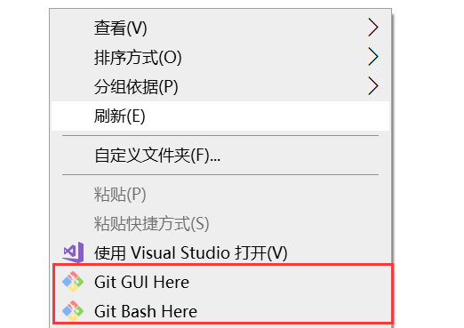

ここに良い中文Gitドキュメントがある：

-   https://zjdoc-gitguide.readthedocs.io/zh_CN/latest/git/index.html

多くのプログラマーはGit Bashでコマンドラインコードを記述するのが好きだが、筆者にとっては記憶負担が増えるだけなので、Gitのグラフィカルインターフェースを使用するのが好きだ：

####  Tortoise Git

- ダウンロードアドレス：https://tortoisegit.org/download/

> 一部のIDEもGitをサポートしているが、機能はTortoise Gitほど強力ではない
>
> インストール時に中文言語パックをインストールすることに注意する

**Git & Tortoise Git**を使用する主なメリットは以下の通り：

- 少しずつコードをコミットでき、ログでバージョン間の変更記録を直感的に比較できる

  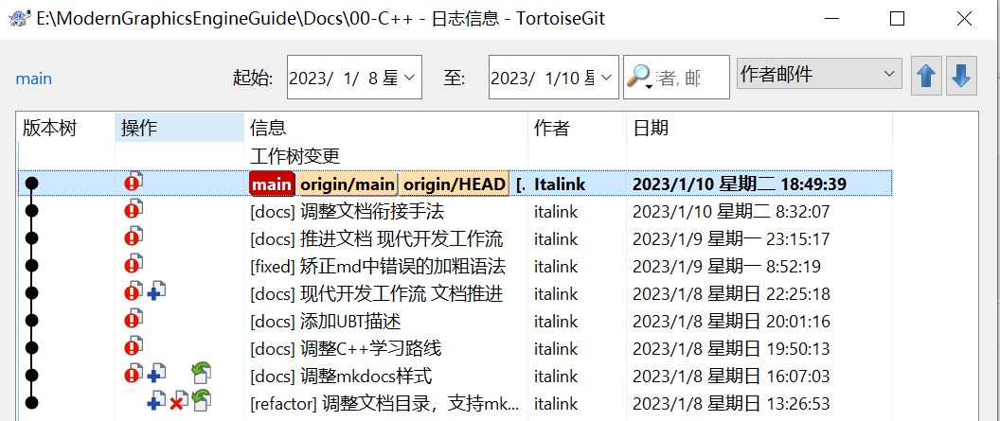

- ファイルの変更を容易に比較できる

  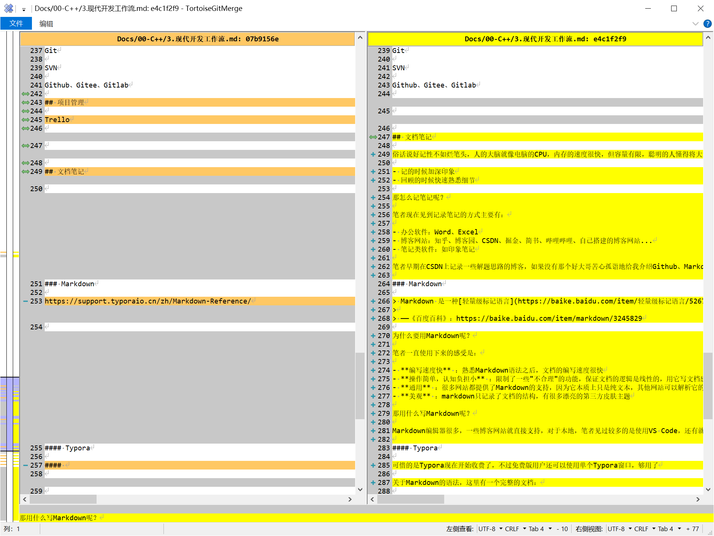

- ファイルを復元したり、バージョンを戻したりして問題を追跡できる

  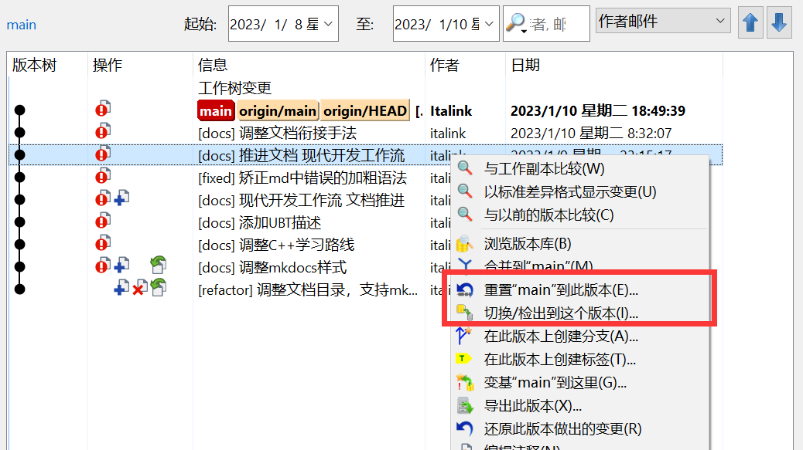

- 単一ファイルの完全なコミット情報を追跡できる

  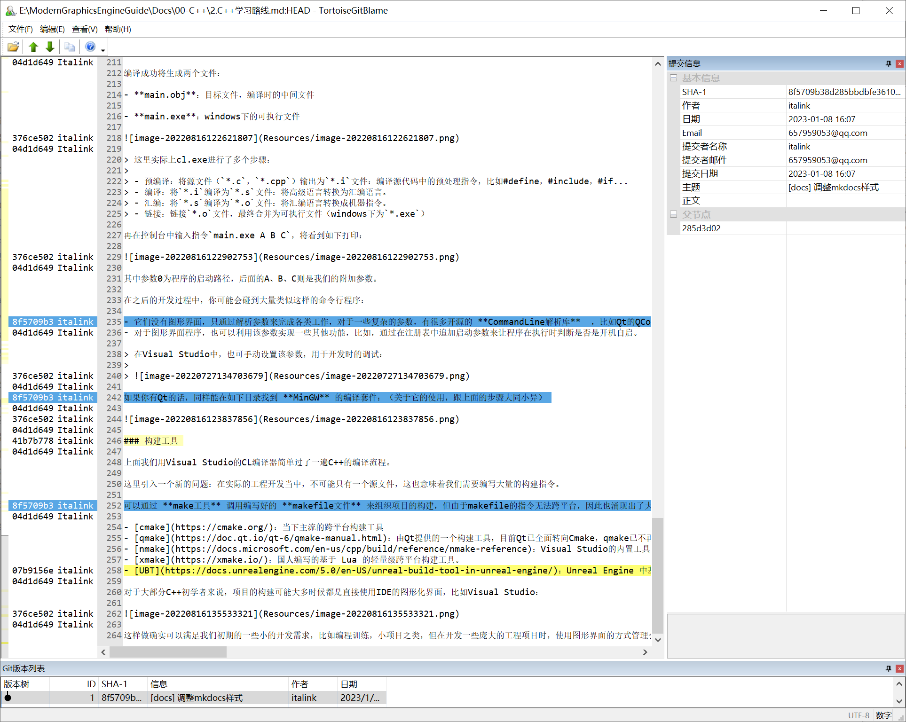

- 多人協力時にコードをマージできる
- ブランチで各種featureの試行を行える
- ...

> **小贴士**
>
> Tortoise GitのルートディレクトリにはTortoiseGitProcというプログラムが存在し、リポジトリの変更を監視し、定期的にリポジトリの変更を検出する。誰かがコードをコミットすると、システム通知がポップアップする。
>
> 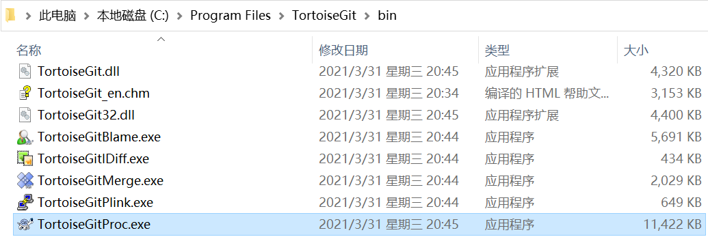


#### Github、Gitlab、Gitee

Gitリポジトリには隠しフォルダである.gitが含まれており、この中にgitの各種データが格納されている：

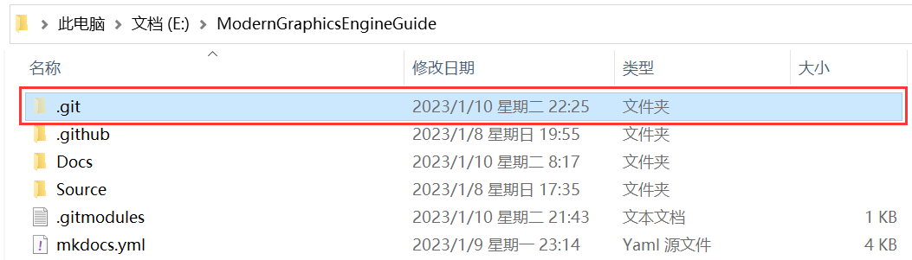

このリポジトリはローカルに存在する。多くの場合、サーバーに格納して他人と共有しやすくしたいと希望する。現在、主流の**Gitコードホスティングプラットフォーム**は以下の通り：

- Github：https://github.com/
- Gitlab：https://about.gitlab.com/
- Gitee：https://gitee.com/

具体的にどのプラットフォームを選択するかは、以下を参考にする：[知乎 爆测一周！22年必看最细致代码托管工具测评](https://zhuanlan.zhihu.com/p/459390312)

バージョン管理にはGitの他に、古くからあるSVNも存在する。当然、一部の企業内部には独自のバージョン管理ツールも存在する。

### SVN

SVNはsubversionの略称で、[オープンソース](https://baike.baidu.com/item/开放源代码/114160?fromModule=lemma_inlink)のバージョン管理システムである。ブランチ管理システムを採用した効率的な管理により、簡単に言えば多くの人が同じプロジェクトを共同で開発し、リソースを共有し、最終的な集中管理を実現するためのものである。

Gitに比べてSVNは非常に古く見えるが、管理が容易であるため、多くの企業で依然として使用されている。

TortoiseはSVNに対するサポートも提供している：

- https://tortoisesvn.net/

### コミット規範

良いコミット規範はログをより直感的に見せることができる。例えば筆者の異なる時期のコミット記録：

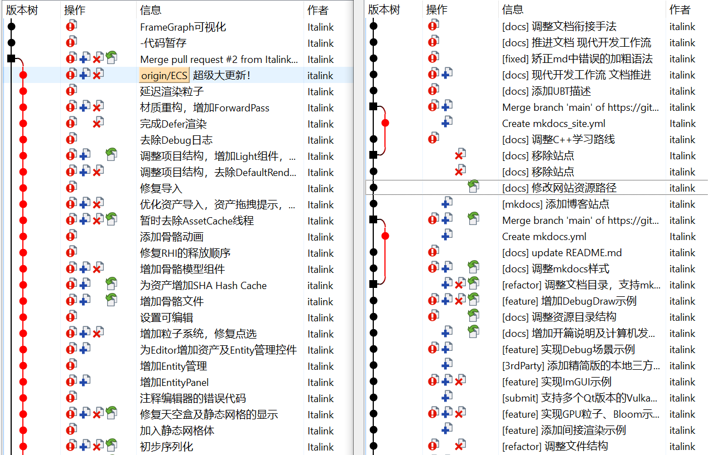

コミット規範については、以下の記事を読むことを推奨する：

- https://blog.csdn.net/fd2025/article/details/124543690

> 筆者の個人プロジェクトにおける規範はそれほど厳格ではなく、単なるTag+簡単な説明だけである。

## ドキュメントノート

「好记性不如烂笔头（良い記憶力は悪い筆記よりも劣る）」という諺がある。人間の脳はコンピュータのCPUのようなもので、メモリの速度は速いが容量は限られている。賢い人は大量の内容を**「ディスク（ノート）」**に格納し、内容の索引を脳の**「高速キャッシュ」**に格納することを知っている。ノートを取る主なメリットは以下の通り：

- 記録する時に印象を深める
- 回顾する時に迅速に詳細を連想する

どのようにノートを取るのか？

筆者が現在見たことのあるノートの取り方は主に以下の通り：

- オフィスソフト：Word、Excel
- ブログサイト：知乎、博客园、CSDN、掘金、简书、哔哩哔哩、自分で構築したブログサイト...
- ノート類ソフト：印象笔记など

筆者は早期にCSDNでいくつかの問題解決のアイデアを記録するブログを書いていた。もし那位兄貴が苦心してGithub、Markdown、CMakeを紹介してくれなかったら、現在も自分の世界に溺れて自分自身と知恵比べを続けていたかもしれない...

### Markdown

> Markdownは一種の[軽量マークアップ言語](https://baike.baidu.com/item/轻量级标记语言/52671915?fromModule=lemma_inlink)で、創始者はジョン・グルーバー（John Gruber）である。人々が読み書きしやすい[純粋テキスト形式](https://baike.baidu.com/item/纯文本格式/9862288?fromModule=lemma_inlink)でドキュメントを記述し、その後有効な[XHTML](https://baike.baidu.com/item/XHTML/316621?fromModule=lemma_inlink)（またはHTML）ドキュメントに変換することを許可する。この言語は電子メールに既に存在する多くの純粋テキストマークアップの特性を吸収している。
>
> ——《百度百科》：https://baike.baidu.com/item/markdown/3245829

なぜMarkdownを使用するのか？

筆者のブログはすべてMarkdownで記述されている。使用してきた感想は以下の通り：

- **記述速度が速い** ：Markdownの構文に慣れると、ドキュメントの記述速度が非常に速くなる
- **操作が簡単で、認知負担が小さい** ：いくつかの「不合理な」機能を制限し、ドキュメントのロジックが線形であることを保証する。それでドキュメントを書くのは一種の享受だ。
- **汎用性が高い** ：多くのウェブサイトがMarkdownのサポートを提供している。それは本質的に純粋テキストであるため、他のウェブサイトはその構文を解析してプレビューできる。また、テキストであるため、ドキュメントのバージョン管理も容易になる。
- **美しい** ：markdownはドキュメントの構造だけを記録し、多くの美しいサードパーティのスキンテーマが存在する。

Markdownを何で書くのか？

Markdownエディタは多く、一部のブログサイトは直接サポートしている。ローカルでは、筆者が見た多くのものはVS Codeを使用するか、狂拽酷炫、天下无敌、宇宙第一のMarkdown神器である：

#### Typora

惜しいことにTyporaは現在有料化されたが、無料版ユーザーは単一のTyporaウィンドウを使用できるため、十分に使える。

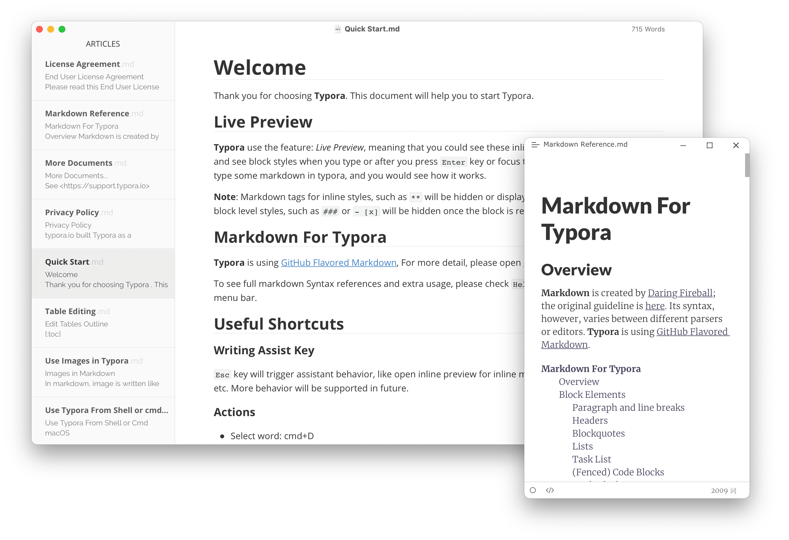

Markdownの構文については、以下の完全なドキュメントが存在する：

- https://support.typoraio.cn/zh/Markdown-Reference/

Typoraの完全なドキュメントディレクトリは以下の通り：

- https://support.typoraio.cn/

読者が容易に忽略するが非常に有用な二つの機能：

- Typoraは図表**mermaid**をサポートする：https://support.typora.io/Draw-Diagrams-With-Markdown/

- Typoraに画像処理方式を設定し、**図床**を構築することで、作業を非常にスムーズにできる：https://support.typoraio.cn/Images/

Markdownはオープンソース業界の主要なドキュメント形式として、多くの企業の内部ドキュメントもMarkdownで構築されたWikiを使用することを好む。使用するとその良さが分かるだろう。

Markdownは非常に強力だが、毕竟単一ファイルのドキュメントである。ドキュメント間の関連関係をより良く組織する場合は、他のツールを借りる必要がある：

#### ドキュメント組織ツール

筆者にとっては一つのTyporaで十分だが、ネットワーク上で推奨されているものは以下の通り：

- **Notion**
- **Obsidian**
- **Remnote** 

> 具体的な選択は、以下の知乎の質問を参照：[你在 Notion、Obsidian、Remnote 等之间做出什么选择，为什么这么选？](https://www.zhihu.com/question/407810894/answer/2095659162)

現在筆者のドキュメントフローは以下の通り：

- TyporaでMarkdownファイルを記述し、フォルダ分類でmdファイルを組織し、**Github**に托管する
- Mkdocs（一部の人はGitbookを使用する）を使用してドキュメントを静的ウェブサイトに生成し、**Github Pages**にデプロイする

筆者は強くMkdocsのこのテーマを推奨する：https://squidfunk.github.io/mkdocs-material/getting-started/

Mkdocsは簡単にymlを設定するだけで、自分のmarkdownファイルを精美的なウェブサイトに組織し、Githubに托管できる。現在筆者はGithubにドキュメントをコミットするたびに、**自動的に**Github Actionを実行し、ドキュメントの変更を再びGithub Pagesにデプロイする。

これは本シリーズ記事のウェブサイトである：

- https://italink.github.io/ModernGraphicsEngineGuide/


### マインドマップ

Markdownの線形叙事と比較して、**マインドマップ（Mind map）**は人間の思考習慣により合致し、思考を刺激し、一時的な記憶を助け、発散的思考と集中的思考の利点を持っている。

それは以下に適用される：

- タスクリスト
- スピーチの準備
- ノートの作成
- 問題解決
- プロジェクト計画
- 意思決定
- 知識管理
- プロジェクト管理
- 個人の思考
- 写作
- ...

例えば下方のGames104が呕心沥血で整理した知識图谱は、見た目が少し恐怖だが、この図がなければ更に恐怖だ...

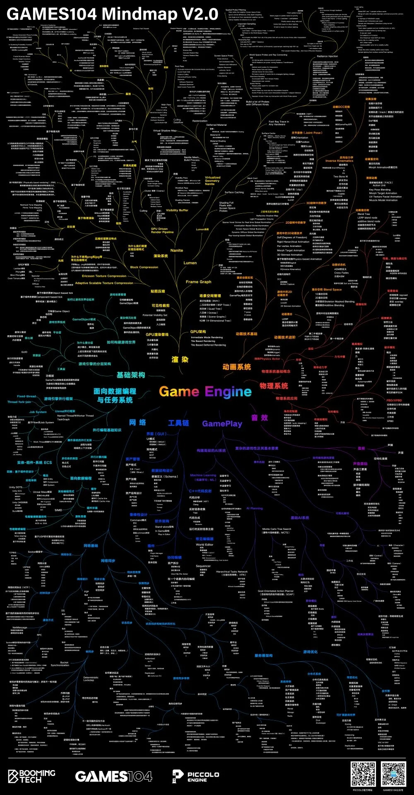

> 原图はGames104微信公众号から

現在マインドマップを制作するソフトウェアは主に以下の通り：

- [XMind](https://xmind.cn/)：非常に強力なマインドマップソフトウェア
- [Process On](https://www.processon.com/)：オンラインフローチャート、マインドマップ制作ウェブサイト

上方で筆者が提到した一些ドキュメント組織ツール、例えば**Obsidian**もマインドマップのプラグインをサポートしている。


## プロジェクト管理

各企業には自分の好みのプロジェクト管理ツールが存在する。

一部の企業は飞书、钉钉、企业微信の機能で十分だろう。

会社は一般的にJira、禅道、Redmine、PingCodeなどのチケット管理プラットフォームを使用する。

また、Jenkins、Github Action、GitLab CI、CODING CIなどのCI/CDプラットフォームも存在する。

> [知乎 什么是持续集成（CI）/持续部署（CD）？](https://zhuanlan.zhihu.com/p/42286143)

個人にとっては、ここで主に**Trello**の使用を推奨する。

### Trello

Trelloは簡単かつ効率的な看板を使用して多くの操作を完成できる。例えば個人のTo Do、メモ、チームメンバーの分工、プロジェクトの開発計画など。

[知乎 Trello 等任务管理工具体验如何？](https://www.zhihu.com/question/20339647/answer/139279285)


筆者は早期に[UE4 Roadmap](https://trello.com/b/TTAVI7Ny/ue4-roadmap)でそれに注意した。ただ閲覧するだけで、このインターフェースが快適で、操作がスムーズであると感じた~


> Trelloのサーバーは国外にあるため、国内のアクセス速度は比較的遅い。ネット上には多くの良い代替案が存在する。大家は自分のニーズに応じて選択することができる。


## その他

- [Listary](https://www.listary.com/)：ローカルの検索、閲覧、操作の効率を大幅に向上させることができる
- [LICEcap](https://www.anopos.com/licecap/)：小型のGIF録画ソフトウェアで、筆者はよく動的な操作を録画してドキュメントに挿入する。
- QQスクリーンショット、録画：グローバルショートカットの設定に注意する
- Word、Excel、PPT：基本操作
- Python：スクリプトは常にGUIより強力であり、何よりPythonには多くの強力なサードパーティライブラリが存在する

> 他に使いやすい小さなツールがあれば、大家はフィードバックしてください。ブロガーは速やかに更新する0.0


## 結語

ここまで、筆者は道の軌跡に触れた後、どの段階でも無所不能な感覚を持っているようだ。しかし前の段階を回顾すると、只是自分のコンフォートゾーンで自慢していただけだとわかる。人生に涯てありて、学問に涯てなし。上述のツールの洗礼を経て、筆者の至今の進歩は計り知れない。作業プロセスが規範的で、知識ドキュメントが完全で、効率が恐怖的に高い。自分自身だけでなく、想像してみてほしい：手軽に図文并茂、有声有色な説明ドキュメントを渡すことができるようなチームメイト、あなたは嫌いだろうか？

此外、文章上述に列挙されたツールの中には、有料ソフトウェアも少なくない。インターネット上には多くの破解版が流传しているが、筆者は真摯に大家に恳请する：経済的能力がある場合は、できるだけ開発者の知識に対して支払いを行ってください。開発は本来容易ではなく、坚持することは更に難しい。多くのチームは大きな困難を乗り越えてきたが、思いがけないミスで全てを失い、プロジェクトが解散し、各自が逃げるという結果になる。因果応報、最終的に利益を得るのは誰だろうか？