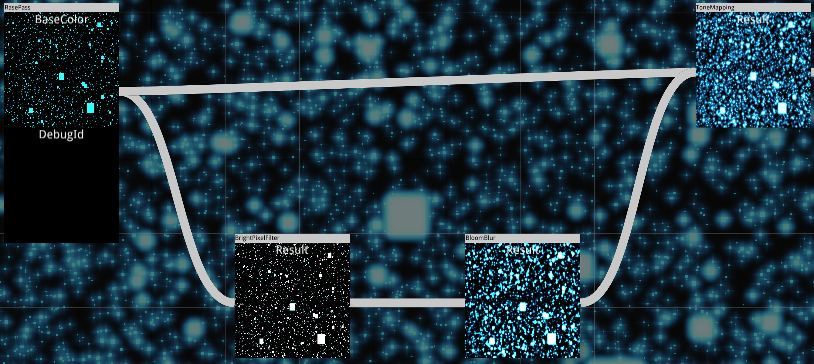

# グラフィックスAPIの基礎

## 基礎概念

現代のグラフィックスAPIは初心者にとって、最初は分からない構造が多く存在しますが、過度に心配する必要はありません。これらの用語は特定の構造やプロセスに対する短い呼称に過ぎず、その応用シーンと使用フローを理解し、慣れれば自然にその意味が分かるようになります。

### 物理デバイス（Physical Device）

グラフィックスAPIでは、一般的にGPUを**物理デバイス**と呼びます。

GPUの急速な発展に伴い、グラフィックスAPIの機能特性も日々増加しています。グラフィックスAPIの使用がGPUデバイスと下位互換性を持つようにするため、グラフィックスAPIは物理デバイスが特定の特性やリソースの制限をサポートしているかどうかをクエリするインターフェースを提供することが多いです。

Vulkanを例にとると、**VkPhysicalDeviceFeatures**を使用して物理デバイスが特定の特性をサポートしているかどうかをクエリできます：

```c++
struct VkPhysicalDeviceFeatures {
    VkBool32    robustBufferAccess;
    VkBool32    fullDrawIndexUint32;
    VkBool32    imageCubeArray;
    VkBool32    independentBlend;
    VkBool32    geometryShader;
    VkBool32    tessellationShader;
    VkBool32    sampleRateShading;
    VkBool32    dualSrcBlend;
    VkBool32    logicOp;
    VkBool32    multiDrawIndirect;
    VkBool32    drawIndirectFirstInstance;
    VkBool32    depthClamp;
    VkBool32    depthBiasClamp;
    VkBool32    fillModeNonSolid;
    VkBool32    depthBounds;
    VkBool32    wideLines;
    //...
}
```

**VkPhysicalDeviceLimits**を使用して物理デバイスのリソース制限をクエリできます：

``` c++
struct VkPhysicalDeviceLimits {
    uint32_t              maxImageDimension1D;
    uint32_t              maxImageDimension2D;
    uint32_t              maxImageDimension3D;
    uint32_t              maxImageDimensionCube;
    uint32_t              maxImageArrayLayers;
    uint32_t              maxTexelBufferElements;
    uint32_t              maxUniformBufferRange;
    uint32_t              maxStorageBufferRange;
    uint32_t              maxPushConstantsSize;
    uint32_t              maxMemoryAllocationCount;
    //...
}
```

開発者はグラフィックスAPIを使用する際、これらの制限の存在を知る必要があります。また、使用時には自身の機能要件に合った物理デバイスを見つけるだけでなく、デバイス特性をサポートしていないユーザー向けにロジック上の互換性処理を行う必要があります。

### 論理デバイス（Device）

論理デバイスは開発者と物理デバイス間の**「代理店」**です。

CPUとGPUはそれぞれ独立して実行され、互いに待ち合わせしないため、両者間の通信負担を軽減し、開発者が些細なことでGPUに「この仕事を終わらせないと逃がさない！」と叫ばないようにするため、現代のグラフィックスAPIでは論理デバイスという概念が提供されています。開発者は何かあれば代理店に伝え、代理店は複数の仕事をまとめた後、一括して物理デバイスに実行を指示します。

> 論理デバイスを作成する際、物理デバイスのどの拡張機能を有効にするかを指定する必要があります。

### コマンドバッファ（Command Buffer）

コマンドバッファはCommand Listとも呼ばれ、開発者の**「メモ用紙」**です。

開発者は代理店（論理デバイス）にいくつかの「荷物」を渡すだけでなく、実行したいことをメモ用紙に記録して代理店に渡し、物理デバイスに伝えさせます。

> QRhiでは直接CommandBufferを作成することはできません。取得方法は以下の2つです：
>
> - SwapChainを通じて現在のCommandBufferを取得する
> - `rhi->beginOffscreenFrame`で新しいCommandBufferを作成する
>
> **QRhiCommandBuffer**は以下の指令をサポートします：
>
> 

### デバイスキュー（Device Queue）

デバイスキューは代理店（論理デバイス）と物理デバイス間の唯一の**「橋梁」**です。

代理店が開発者から送られた荷物とメモ用紙を受け取ると、早速橋を渡って物理デバイスに向かいます。

### 同期（Synchronization）

GPUがなぜこんなに強いのか？それは多くの「部下」を持っているからです。以下のシナリオを想像してみてください：

> ある日、GPUの「ボス」が代理店から送られたメモ用紙を受け取り、すぐに部下を召集して指示を出します。
>
> 「うーん、最初の項目は翻斗大街のビラを全部剥がすことだ。张三、君が行け！」
>
> 「了解！」と言った张三はすぐに翻斗大街に向かいました。
>
> 「次の項目は翻斗大街に開発者のビラを全部張ることだ。李四、君が担当！」
>
> 「承知！」と言った李四は愛車のスクーターに乗り、翻斗大街に疾走しました。
>
> 翌日、開発者が一群の部下を連れてGPUのボスに向かい、ビラが張られていないことを詰問し、もうテーブルを叩こうとしていました。
>
> GPUのボスはメモ用紙を確認すると問題なかったので、张三と李四に聞いてみると、张三は剥がし、李四は張ったそうです。さらに詳しく聞くと、なんと李四が早く行って先にビラを張り、後から张三に全部剥がされてしまったのです。
>
> 振り返ると、開発者が明確な指示をしなかったため、GPUのボスの理解が正しくなく、誤った手配をして事故が発生しました。

GPUでは多くの作業が並行して行われるため、特定の操作が順番に開始されるが、順不同で実行される場合があります。

また、CPUとGPUは互いに待ち合わせしないが、特定の状況では某些操作の実行完了やイベントのトリガーを待ちたい場合もあります。

このため、現代のグラフィックスAPIではCPU、GPU、コマンド、キュー間の同期を制御するためのいくつかの構造が提供されています。Vulkanを例にとると、以下のような同期制御用の構造が提供されています：

- フェンス（Fence）
- セマフォ（Semaphore）
- バリア（Barrier）
- イベント（Event）

これらの詳細については以下を参照してください：

- [vulkan中的同步和缓存控制之一，fence和semaphore](https://zhuanlan.zhihu.com/p/24817959)
- [vulkan中的同步和缓存控制之二，barrier和event](https://zhuanlan.zhihu.com/p/80692115)
- [理解Vulkan同步(Synchronization)](https://zhuanlan.zhihu.com/p/625089024)

### ウィンドウサーフェス（Window Surface）

レンダリング結果を画面に表示するため、開発者は通常グラフィックスAPIとウィンドウシステム間の接続を作成する必要があります。Vulkanでは、対応するプラットフォームのウィンドウに**ウィンドウサーフェス（Window Surface）**を作成することで、グラフィックスAPIとウィンドウシステム間のインタラクションの橋梁として機能させることができます。

各オペレーティングシステム（Windows、Linux、Mac...）のウィンドウシステムは異なるため、Window Surfaceの作成にはプラットフォーム固有の設定が必要です。

いくつかのオープンソースライブラリはこれらの煩雑な設定を回避することを目的としており、例えば[GLFW](https://github.com/glfw/glfw)があります。

> **GLFW**はOpenGL、OpenGL ES、Vulkanアプリケーション開発のためのオープンソースのマルチプラットフォームライブラリです。
>
> ウィンドウ、コンテキスト、サーフェスの作成、入力の読み取り、イベント処理などのための、シンプルで軽量なプラットフォーム非依存のAPIを提供します。

GUIフレームワークの多くもWindow Surfaceの管理を提供しています。私たちがするべきことはドキュメントを参照し、ソースコードを深く理解することです。

### スワップチェーン（[SwapChain](https://en.wikipedia.org/wiki/Swap_chain)）

前のセクションではコンソールプログラムを通じてスワップチェーンの役割を説明しました。スワップチェーンはウィンドウ描画のチラツキと画面の裂け目（ティアリング）を効果的に回避することができます。


> https://mkblog.co.kr/vulkan-tutorial-10-create-swap-chain/

### パイプライン（Pipeline）

パイプラインはパイプラインステージとも呼ばれ、GPU上で実行されるタスクフローです。現代のコンピュータグラフィックスAPIでは、一般的に3種類のパイプラインが存在します：

- グラフィックスレンダリングパイプライン（[Graphics Pipeline](https://en.wikipedia.org/wiki/Graphics_pipeline)）：**レンダーターゲット（RenderTarget）**上に画像を描画するために使用されます。
- コンピューティングパイプライン（[Compute Pipeline](https://en.wikipedia.org/wiki/Pipeline_(computing))）：**バッファ（Buffer）**または**イメージ（Image）**内のデータを処理するために使用されます。
- レイトレーシングパイプライン（[Ray Tracing Pipeline](https://www.khronos.org/blog/ray-tracing-in-vulkan#blog_Ray_Tracing_Pipelines)）：レイトレーシングフローのために使用されます。

前のセクションではコンソールプログラムを通じてグラフィックスレンダリングパイプラインを簡単に理解しました。ここにより完全なフローチャートがあります：


> https://graphicscompendium.com/intro/01-graphics-pipeline

その作業フローは簡単に以下のようにまとめることができます：

- 開発者は頂点データをGPUにアップロードします。
- 各頂点のデータは**頂点シェーダー（Vertex Shader）**で処理されます。
- （存在する場合）**テッセレーションコントロールシェーダー（Tessellation Control Shader）**、**テッセレーションエバリュエーションシェーダー（Tessellation Evaluation Shader）**、**ジオメトリシェーダー（Geometry Shader）**で処理された後、三角形データが正常に組み立てられます。
- その後、ラスタライゼーションエンジンが三角形データをマッピング（ラスタライゼーション）し、**フラグメント（Fragment）**を生成します。
- 各フラグメントのデータは**フラグメントシェーダー（Fragment Shader）**で処理されます。
- **テストとブレンディングフェーズ**を経て重なり合うフラグメントが処理されます。
- 対応する座標のピクセルの唯一の値が得られ、**レンダーターゲット（RenderTarget）**上に描画されます。

### シェーダー（[Shader](https://en.wikipedia.org/wiki/Shader)）

シェーダーはGPU上で実行されるマイクロプログラムであり、主にパイプラインの機能を拡張するために使用されます。例えば上記のグラフィックスレンダリングパイプラインでは：

- 入力された頂点配列は**頂点シェーダー（Vertex Shader）**で処理されます。
- ラスタライゼーション後、各ピクセルは**フラグメントシェーダー（Fragment Shader）**で処理されます。

グラフィックスレンダリングパイプラインには少なくとも1つの頂点シェーダーとフラグメントシェーダーが必要ですが、実際には現代のグラフィックスAPIは追加のシェーダー拡張をサポートしています：

- **テッセレーションコントロールシェーダー（Tessellation Control Shader）**
- **テッセレーションエバリュエーションシェーダー（Tessellation Evaluation Shader）**
- **ジオメトリシェーダー（Geometry Shader）**
- **コンピュートシェーダー（Compute Shader）**

これらはAPI固有の**Shader Language**で記述されます。例えば：

- [GLSL](https://en.wikipedia.org/wiki/OpenGL_Shading_Language)：OpenGL、Vulkanで使用されます。
- [HLSL](https://en.wikipedia.org/wiki/High-Level_Shader_Language)：Direct3Dで使用されます。
- [MSL](https://en.wikipedia.org/wiki/Metal_(API))：Metalで使用されます。

現代のグラフィックスエンジンの汎用RHIでは、複数のグラフィックスAPIをサポートする必要があるため、上記のいずれかのシェーダー言語で開発した後、他のAPIのシェーダーコードに変換することが多いです。

> QRhiではVulkanスタイルのGLSLを使用して開発します。Qtはglslangを通じてGLSLを[SPIR-V](https://zhuanlan.zhihu.com/p/497460602)形式のシェーダーコードにコンパイルし、さらにオープンソースライブラリ[SPIRV-Cross](https://github.com/KhronosGroup/SPIRV-Cross)を使用して各APIのシェーダーコードに変換します。フローは以下の通りです：
>
> 
>
> QRhiはVulkanスタイルのGLSLを使用するため、以下のドキュメントは非常に重要です：
>
> - https://registry.khronos.org/OpenGL/specs/gl/GLSLangSpec.4.60.html

### バッファ（Buffer）

ここでのBufferは単にGPU上の一段のメモリ（Memory）を指すのではありません。

正確には、Bufferは一段のメモリを保持するだけでなく、自身の**タイプ（Type）**と**用途（Usage）**も含みます。

**タイプ（Type）**について、グラフィックスAPIは一般的に以下に分類します：

- **Host Local Memory**：Hostからのみアクセス可能なメモリで、通常は普通のメモリと呼ばれます。
- **Device Local Memory**：Deviceからのみアクセス可能なメモリで、通常はビデオメモリと呼ばれます。
- **Host Local Device Memory**：Hostによって管理され、Deviceからアクセス可能なメモリです。
- **Device Local Host Memory**：Deviceによって管理され、Hostからアクセス可能なメモリです。

> Hostは通常CPU側を指し、DeviceはGPU側を指します。

詳細については以下を参照してください：

- [Vulkan 内存管理](https://zhuanlan.zhihu.com/p/166387973)

適切なメモリタイプを使用することでメモリの読み書き効率を大幅に向上させることができます。現代のグラフィックスエンジンのパイプラインでは、可能な限り**Device Memory**を使用します。CPUからデータを送信する場合、Hostがアクセスできないため、通常はデータを**Hostからアクセス可能なMemory**にアップロードし、次にコマンドを通じて対応する**Device Memory**にコピーします。このHostからアクセス可能なメモリを保持するBufferを一般的に[Staging Buffer](https://vulkan-tutorial.com/Vertex_buffers/Staging_buffer)と呼びます。

> QRhiはこれらのタイプをさらにラップし、使用意図に基づいて分類しています：
>
> - **Immutable**：永遠に変更されることのないデータを格納するために使用され、非常に効率的なGPU読み書き性能を持ちます。通常は**Device Local**のGPUメモリに配置され、CPUから直接読み書きすることはできませんが、QRhiはアップロードをサポートしています。その原理は、データをアップロードするたびに**Host Local**の**Staging Buffer**を新規作成し、中継として新しいデータをアップロードすることです。この操作のコストは非常に高いです。
> - **Static**：同様に**Device Local**のGPUメモリに格納されます。Immutableと異なる点は、最初のデータアップロード時に作成された**Staging Buffer**が常に保持されることです。
> - **Dynamic**：頻繁に変更されるデータを格納するために使用され、**Host Local**のGPUメモリに配置されます。グラフィックスレンダリングパイプラインを遅延させないため、通常はダブルバッファリング機構を使用します。

**用途（Usage）**については、通常以下の**フラグ（Flag）**を持つことができます：

- **VertexBuffer**：頂点データを格納するために使用されます。
- **IndexBuffer**：インデックスデータを格納するために使用されます。
- **UniformBuffer**：定数データを格納するために使用されます。
- **StorageBuffer**：コンピューティングパイプラインにおけるデータ計算に使用されます。
- **IndirectDrawBuffer**：間接レンダリングのためのレンダリングパラメータを提供するために使用されます。

### テクスチャ（[Texture](https://en.wikipedia.org/wiki/Image_texture)）とサンプラー（Sampler）

テクスチャはピクセル構造を持つ一段のメモリ（Memory）を保持し、グラフィックスレンダリングパイプラインの入力、またはRenderTargetのアタッチメントとして使用できます。

サンプラーはテクスチャのサンプリング規則を定義するために使用されます。常見的な規則には以下があります：

- UV値が值域[0,1]を超える場合、越界サンプリングをどのように処理するか：


- 精度が高すぎたり低すぎたりする場合、テクスチャをどのようにサンプリングするか：


> ここはそれぞれQRhiの**QRhiTexture**と**QRhiSampler**に対応します。
>
> ``` c++
> /*カラーアタッチメントを1つ持つRTを作成*/
> QSharedPointer<QRhiTexture> colorAttachment;
> colorAttachment.reset(rhi->newTexture(QRhiTexture::RGBA32F, QSize(800, 600), 1, QRhiTexture::RenderTarget | QRhiTexture::UsedAsTransferSource));
> colorAttachment->create();
> QSharedPointer<QRhiTextureRenderTarget> renderTarget;
> QSharedPointer<QRhiRenderPassDescriptor> renderPassDesc;
> renderTarget.reset(rhi->newTextureRenderTarget({ colorAttachment.get() }));
> renderPassDesc.reset(renderTarget->newCompatibleRenderPassDescriptor());
> renderTarget->setRenderPassDescriptor(renderPassDesc.get());
> renderTarget->create();
> ```
>

### ディスクリプタ（Descriptor）

上記のグラフィックスレンダリングパイプラインでは、各頂点が頂点シェーダーで処理され、各フラグメントがフラグメントシェーダーで処理されると述べました。「各」は英語で「Per」と訳されます。パイプラインでは、このような「Per」データ以外に、同じシェーダー間で共有される公共のデータも存在します。このようなデータはグラフィックスAPIで一般的にUniformデータと呼ばれ、シェーダーの公共入力として扱われます。

パイプライン構造を作成する際、ディスクリプタ（Descriptor）を使用してUniformデータの基本構造情報を記述する必要があります。常見的なディスクリプタタイプには以下があります：

- **UniformBuffer**：シェーダーから読み取り専用のBuffer入力です。
- **Sampler**：シェーダーから読み取り専用のテクスチャサンプリング入力です。
- **StorageBuffer**：シェーダーから読み書き可能なBufferで、コンピューティングパイプラインで使用されます。
- **StorageImage**：シェーダーから読み書き可能なImageで、コンピューティングパイプラインで使用されます。

> ここはQRhiの**QRhiShaderResourceBinding**に対応します：
>
> 

### ディスクリプタセットレイアウトバインディング（DescriptorSetLayoutBinding）

シェーダーには通常一種類のUniform入力だけでなく複数の種類が存在します。ディスクリプタセットレイアウトバインディング（DescriptorSetLayoutBinding）はディスクリプタの集合であり、シェーダー上のUniform構造レイアウトを定義します。グラフィックスAPIでパイプラインを作成した後、パイプラインの大部分のパラメータは変更できませんが、ディスクリプタセットレイアウトバインディングはパイプラインを再構築することなく動的に置き換えることができます。

> ここはQRhiの**QRhiShaderResourceBindings**に対応します。その作成方法は非常に簡単です：
>
> ``` elm
> mShaderBindings.reset(mRhi->newShaderResourceBindings());
> mShaderBindings->setBindings({
> 		QRhiShaderResourceBinding::bufferLoadStore(0,QRhiShaderResourceBinding::ComputeStage,mStorageBuffer.get()),
> 		QRhiShaderResourceBinding::imageLoadStore(1,QRhiShaderResourceBinding::ComputeStage,mTexture.get(),0),
> });
> mShaderBindings->create();
> ```

### レンダーターゲット（[RenderTarget](https://en.wikipedia.org/wiki/Render_Target)）

これはOpenGLの[Frame Buffer Object](https://en.wikipedia.org/wiki/Framebuffer_object)に相当し、1つ以上の**カラーアタッチメント（Color Attachment）**で構成され、深度アタッチメントとステンシルアタッチメントを含む場合があります。

![Esquema representando a estrutura de um Frame Buffer Object [Green 2005]  ](Resources/Figura-5-Esquema-representando-a-estrutura-de-um-Frame-Buffer-Object-Green-2005.png)

通常、私たちの描画は実際にはRenderTarget上に色データを填充することであり、深度とステンシルのデータについてはGPUが自動的に処理するため、私たちが行う必要があるのは処理規則を設定することだけです。

> これはQRhiの**QRhiRenderTarget**に対応します。QRhiを使用してRenderTargetを作成することは非常に容易です：
>
> ``` c++
> /*カラーアタッチメントを1つ持つRTを作成*/
> QSharedPointer<QRhiTexture> colorAttachment;
> colorAttachment.reset(rhi->newTexture(QRhiTexture::RGBA32F, QSize(800, 600), 1, QRhiTexture::RenderTarget | QRhiTexture::UsedAsTransferSource));
> colorAttachment->create();
> QSharedPointer<QRhiTextureRenderTarget> renderTarget;
> QSharedPointer<QRhiRenderPassDescriptor> renderPassDesc;
> renderTarget.reset(rhi->newTextureRenderTarget({ colorAttachment.get() }));
> renderPassDesc.reset(renderTarget->newCompatibleRenderPassDescriptor());
> renderTarget->setRenderPassDescriptor(renderPassDesc.get());
> renderTarget->create();
> ```

### レンダーパス（RenderPass）

RenderPassは1回または複数回のPipelineの実行プロセスとして扱うことができます。

ゲームや映画作品では、素朴なグラフィックスにいくつかの後処理効果を追加することで、画面の芸術感を大幅に向上させることができます。グラフィックスレンダリングパイプラインでは、Passは1フレームの画像（RenderTarget）の描画として扱うことができます。

ゲームエンジンでは、素朴な幾何学オブジェクトを描画するPassを一般的に**BasePass**と呼びます。

以下の**FrameGraph**は複数のPassを使用して[Bloom](https://en.wikipedia.org/wiki/Bloom_(shader_effect))効果を実現する方法を示しています。



### レンダーパスディスクリプタ（RenderPassDescriptor）

RenderPassDescriptorはどの形式のRenderTargetが当該RenderPassの使用に適合するかを規定するために使用されます。Vulkanではその作成は非常に煩雑ですが、QRhiでは以下を使用するだけで済みます：

``` c++
class QRhiTextureRenderTarget : public QRhiRenderTarget
{
    virtual QRhiRenderPassDescriptor* newCompatibleRenderPassDescriptor() = 0;
};
```

## QRhi

もしあなたが初心者で、上記の基礎概念を読んだ後に頭がごちゃごちゃになっている場合は安心してください。コードを実際に触れるようになると、これらの概念は紙老虎に過ぎません。本章の次の内容では、グラフィックスAPI基礎の構造と使用方法を体系的に説明します。

まず、Qtが必要です。以下のミラーソースからQtのオンラインダウンローダをダウンロードできます：

- http://mirrors.ustc.edu.cn/qtproject/official_releases/online_installers/

既にQtを持っている場合は、Qtのインストールディレクトリにあるメンテナンスツールを使用して、Qtのコンポーネントを更新またはアンインストールできます。


少なくとも以下のQtコンポーネントをインストールしてください：

- **6.0以上のQtライブラリ**（現在の最新バージョンは`6.6.0`）
  - **MSVCコンパイルキット**（現在の最新バージョンは`2019 64-bit`）または**MinGWコンパイルキット**（現在の最新バージョンは`11.2.0 64-bit`）：IDEがVisual Studioの場合はMSVCをダウンロードする必要があります。
  - **Sources**：Qtのソースコード
  - **Qt 5 Compatibility Module**：Qt5の互換モジュール
  - **Qt Shader Tools**：Qtのシェーダーコンパイルツール
  - **Additional Libraries**：Qtの拡張ライブラリ
    - **Qt Multimedia**：Qtのマルチメディアモジュールで、音声・映像のエンコード・デコード機能の封装が含まれています。
  - **Qt Debug Information Files（オプション）**：MSVC下でQtのソースコードをデバッグするために使用され、数十GBあり非常に大きいです。

- **Developer and Designer Tools**
  - **Debugging Tools for Windows**：MSVC下でのデバッグに使用されます。
  - **CMake**（現在の最新バージョンは`3.24.2`）

此外、[Vulkan SDK](https://www.lunarg.com/vulkan-sdk/)もインストールする必要があります。

小さなプロジェクトを作成して環境が正常かどうかを検証できます：

- 新しい`CMakeLists.txt`と`main.cpp`を作成します。
- `CMakeLists.txt`で`Target`を作成し、Qtのモジュールをリンクします：

``` cmake
cmake_minimum_required(VERSION 3.12)

project(FirstRhiWindowProj)

add_executable(FirstRhiWindow main.cpp)

find_package(Qt6 COMPONENTS Core Widgets Gui REQUIRED)     

target_link_libraries(FirstRhiWindow                        
    PRIVATE 
        Qt6::Core  
        Qt6::Widgets
        Qt6::Gui
        Qt6::GuiPrivate        	//qrhiはGUIのプライベートモジュール       
)
```

- `main.cpp`に以下のコードを記述します：

```C++
#include <private/qrhi_p.h>
#include <private/qrhid3d11_p.h>

int main(int argc, char** argv) {
	QRhiD3D11InitParams params;
	QRhi::Flags flags;
	QSharedPointer<QRhi> rhi(QRhi::create(QRhi::D3D11, &params, flags));
	qDebug() << rhi->driverInfo();		//グラフィックスカードデバイス情報を打印
	return 0;
}
```

- cmakeを使用してコンパイルし実行します。実行に成功すると、コンソールウィンドウにグラフィックスカード情報が打印されます：

  

### QRhiWindow

オペレーティングシステムが提供するウィンドウには非常に細かい制御が可能です。開発者がウィンドウの特定の効果を調整したい場合、ウィンドウの複数の属性とイベントを変更する必要がある場合があります。大量の効果が重ねて設定されると、衝突が発生しやすくなります。例えば：

> もし**A**効果が属性`a`と`b`を有効にする必要があり、**B**効果が属性`b`と`c`を有効にする必要がある場合、ウィンドウが効果**A**と**B**を有効にする（即ち属性`a`、`b`、`c`を有効にする）と、後で効果**B**を無効にしたい場合、関連する検証を行わずに直接関連する属性`b`と`c`を無効にすると、有効な属性は`a`だけになり、効果**A**の表示に問題が発生します。

開発者は通常、オペレーティングシステムレベルのウィンドウ属性やイベントではなく、ウィンドウの表示効果に関心を持つだけです。因此、ウィンドウ管理では、効果間の設定に大量の属性とイベントの重複が存在します。

各属性の設定に関連する検証を追加すると、コードが非常に冗長になり、保守が困難になるだけでなく、バグが発生しやすくなります。

因此、Qtは状態機械の方式で原生ウィンドウを管理しています：

- QtレベルでのWindowの各種設定は即座に有効になるのではなく、これらの設定が保存され、特定のタイミング（例えばShow）で、Qtが現在のコンテキストの設定に基づいて実際のオペレーティングシステムウィンドウを作成します。

言い換えれば、Qtのウィンドウはshow関数が呼び出された後に初めて実際のウィンドウが作成され、ウィンドウハンドルを取得することができます。

> プログラム開発過程では、このようなコードに頻繁に接触することができます。特にグラフィックス関連のエンジニアリングコードでは、`ensure`で始まる関数がよく見られます。その仕事は、現在の属性コンテキストに基づいて特定の操作を行うことです。

ウィンドウのグラフィックスレンダリング構造を作成する場合、実際のウィンドウハンドルが必要なため、showの後に初期化を行わなければなりません。幸いなことに、Qtは関連するイベントを提供しています：

- [void QWindow:: exposeEvent (QExposeEvent* ev )](https://doc.qt.io/qt-6/qwindow.html#exposeEvent)
  - ウィンドウが`un-exposed`状態から`exposed`状態に切り替わると、このイベントが実行されます。
  - ウィンドウが最初に表示される場合、このイベントの前にresizeEventが実行されます。

> プログラム開発過程では、このようなコードに頻繁に接触することができます。複雑なコードロジックをよく組織することができ、特にグラフィックス関連のエンジニアリングコードでは、`ensure`で始まる関数がよく見られます。その仕事は、現在の属性コンテキストに基づいて特定の操作を行うことです。

ウィンドウのグラフィックスレンダリング構造を作成する場合、実際のウィンドウハンドルが必要なため、showの後に初期化を行わなければなりません。幸いなことに、Qtは関連するイベントを提供しています：

- [void QWindow:: exposeEvent (QExposeEvent* ev )](https://doc.qt.io/qt-6/qwindow.html#exposeEvent)
  - ウィンドウが`un-exposed`状態から`exposed`状態に切り替わると、このイベントが実行されます。
  - ウィンドウが最初に表示される場合、このイベントの前にresizeEventが実行されます。

> 注意点として、ウィンドウにとってexposeEventは複数回実行される可能性がありますが、初期化は1回だけ行う必要があるため、いくつかのロジック検証を追加する必要があります。

ウィンドウのグラフィックスレンダリング構造を作成する場合、実際のウィンドウハンドルが必要なため、showの後に初期化を行わなければなりません。幸いなことに、Qtは関連するイベントを提供しています：

- [void QWindow:: exposeEvent (QExposeEvent* ev )](https://doc.qt.io/qt-6/qwindow.html#exposeEvent)
  - ウィンドウが`un-exposed`状態から`exposed`状態に切り替わると、このイベントが実行されます。
  - ウィンドウが最初に表示される場合、このイベントの前にresizeEventが実行されます。

> 注意点として、ウィンドウにとってexposeEventは複数回実行される可能性がありますが、初期化は1回だけ行う必要があるため、いくつかのロジック検証を追加する必要があります。

ウィンドウのグラフィックスレンダリング構造は主に以下を指します：

- `QScopedPointer<QRhiEx> mRhi`
- `QScopedPointer<QRhiSwapChain> mSwapChain`：スワップチェーン
- `QScopedPointer<QRhiRenderBuffer> mDSBuffer`：深度ステンシルバッファ
- `QScopedPointer<QRhiRenderPassDescriptor> mSwapChainPassDesc`：スワップチェーンのRenderPassディスクリプタ

初期化に成功した後、ウィンドウにレンダリングとResizeのロジックを追加するだけで済みます。ここに標準的なWindow実装例があります：

- https://github.com/qt/qtbase/blob/dev/tests/manual/rhi/shared/examplefw.h

また、QRhiで作成されたリソースは、QRhiが破棄される前にクリーンアップしなければならないことに注意してください。スマートポインタを使用することで、これらのリソースのライフサイクルをよく管理することができます。

### QRhiWidget

WidgetとWindowの最大の違いは以下の通りです：

- Widgetは特定のイベントによってインターフェースの再描画がトリガーされますが、Windowは毎フレーム再描画されます。

Widgetを使用することで性能をよく節約し、不必要なリフレッシュを回避することができますが、ゲームやグラフィックスのようにリアルタイムでリフレッシュする必要があるインターフェースでは、Windowを使用することで描画性能をよく分散させることができます。

ここに標準的なWidget実装例があります：

- https://github.com/qt/qtbase/tree/dev/tests/manual/rhi/rhiwidget

### 記事の例

このリポジトリでこのシリーズの記事のすべてのドキュメントとコードを見つけることができます：

- https://github.com/Italink/ModernGraphicsEngineGuide

以下の動画を参考に構築することができます：

- https://www.bilibili.com/video/BV1VP41127UM

多くの興味深い例が含まれています。構築したくない場合は、ここにコンパイル済みの実行ファイルパッケージがあります：

- https://github.com/Italink/ModernGraphicsEngineGuide/releases/download/v1.0.0/Release.zip

#### QEngineUtilities

いくつかの構造の使用を簡略化するため、筆者はいくつかの汎用的な構造を[QEngineUtilities](https://github.com/Italink/QEngineUtilities/)に封装しました。3つの構築ターゲットが含まれています：

- **QEngineCore**：レンダリングアーキテクチャで、RHI、FrameGraph、RenderPass、RenderComponent、Assetの簡易封装が含まれています。
- **QEngineEditor**：エディタースイートで、多くの基礎属性調整コントロール（数値調整器、カラーピッカー、通知バブル、QObjectベースのDetailView、GLSLコードエディターなど）が含まれています。
- **QEngineUtilities**：Lanuch層で、異なる構築設定で上記の2つのモジュールを組み立てます。例えば`DebugEditor`設定ではエディターインターフェースが埋め込まれ、`Debug`設定ではCoreモジュールだけが含まれます。

このリポジトリをPullしてください：

- 自身のプロジェクトのCMakeLists.txtで[add_subdirectory](https://cmake.org/cmake/help/latest/command/add_subdirectory.html)を使用して**QEngineUtilities**を追加します。
- 自身の`Target`に**QEngineUtilities**をリンクします。
- cmakeで`qengine_setup_env`関数を使用して自身の`Target`の環境変数を設定します（dll検索パスを追加）。

主に教学と試行に使用されます：

- 可読性を第一要素として強調します。
- 性能を細かく追求していません（コードの細部にいくつかの瑕疵があり、筆者が気づいたときには既に遅すぎました。精力が限られているため、現在筆者も妥協するしかありません。非常に申し訳ありません...但し安心してください、これらの影響は微々たるものです）。
- レンダリングを核心とし、少量のエディターアーキテクチャを含み、資産管理、ネットワーク、非同期、ECSなどのコード膨張を引き起こすモジュールは導入しません。

成功した場合、以下のコードを使用してWidgetとWindowを作成することができます：

``` c++
#include <QApplication>
#include "Render/RHI/QRhiWidget.h"
#include "Render/RHI/QRhiWindow.h"

class ExampleRhiWindow : public QRhiWindow {
public:
	ExampleRhiWindow(QRhiWindow::InitParams inInitParams) :QRhiWindow(inInitParams) {}
protected:
	virtual void onRenderTick() override {
		QRhiRenderTarget* renderTarget = mSwapChain->currentFrameRenderTarget();
		QRhiCommandBuffer* cmdBuffer = mSwapChain->currentFrameCommandBuffer();

		const QColor clearColor = QColor::fromRgbF(0.0f, 0.0f, 1.0f, 1.0f);			//青色でクリア
		const QRhiDepthStencilClearValue dsClearValue = { 1.0f,0 };

		cmdBuffer->beginPass(renderTarget, clearColor, dsClearValue);
		cmdBuffer->endPass();
	}
};

class ExampleRhiWidget : public QRhiWidget {
public:
	ExampleRhiWidget() {
		setDebugLayer(true);		//検証層を有効にする
	}
	void render(QRhiCommandBuffer* inCmdBuffer) override {
		const QColor clearColor = QColor::fromRgbF(1.0f, 0.0f, 0.0f, 1.0f);			//赤色でクリア
		const QRhiDepthStencilClearValue dsClearValue = { 1.0f,0 };
		inCmdBuffer->beginPass(mRenderTarget.data(), clearColor, dsClearValue);
		inCmdBuffer->endPass();
	}
};

int main(int argc, char **argv){
    QApplication app(argc, argv);

    QRhiWindow::InitParams initParams;
    ExampleRhiWindow window(initParams);
	window.setTitle("01-RhiWindow");
	window.resize({ 400,400 });
	window.show();

	ExampleRhiWidget widget;
	widget.setWindowTitle("01-RhiWidget");
	widget.setApi(QRhiWidget::Vulkan);
	widget.resize({ 400,400 });
	widget.show();

    return app.exec();
}
```

実行すると以下が表示されます：


困難に遭遇した場合は、[ModernGraphicsEngineGuide](https://github.com/Italink/ModernGraphicsEngineGuide/tree/main/Source/1-GraphicsAPI)の**01-WindowAndWidget**プロジェクトを参考にしてください。また、[こちら](https://github.com/Italink/ModernGraphicsEngineGuide/issues)で質問することもできます。

次の章では、実践を始めます~