前章では、C++で現代的なグラフィックスAPIの基本的なレンダリングフローを構築する方法を習得し、[QRhiGraphicsPipeline](https://alpqr.github.io/qtrhi/qrhigraphicspipeline.html) と [QRhiCommandBuffer](https://alpqr.github.io/qtrhi/qrhicommandbuffer.html) を使用してVertex ShaderとFragment Shaderを記述し、グラフィックスレンダリングパイプラインについて一定の認識を持つようになったはずです。

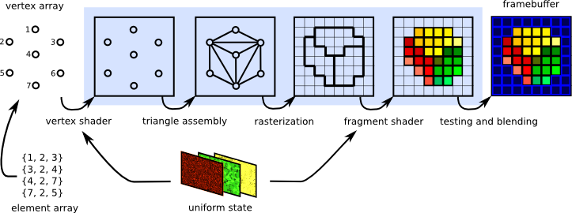

グラフィックスレンダリングパイプラインは本質的にデータ処理を行うだけで、グラフィックスや空間の概念は持っていません。開発者はこの効率的なデータプロセッサを利用し、自身の思考に基づいて対応するフローをカスタマイズすることで、期待される成果物を得るのです。

## プリミティブトポロジ（Primitive Topology）

点、線、面は3Dグラフィックスの基本単位です。グラフィックスAPIでは、プリミティブトポロジを設定することで、パイプラインが生成するプリミティブの仕組みを決定できます。

``` c++
mPipeline->setTopology(QRhiGraphicsPipeline::Topology::Triangles);
```

プリミティブトポロジは、ジオメトリアセンブリフェーズにおいて、パイプラインがどのように頂点を選択して基本プリミティブを組み立てるかを決定します。QRhiでは以下のトポロジ戦略がサポートされています。

```c++
enum Topology {
    Triangles,
    TriangleStrip,
    TriangleFan,
    Lines,
    LineStrip,
    Points,
    Patches   // テッセレーション制御および評価シェーダーに使用
};
```

QRhiのデフォルトは `Triangles` です。現在6つの頂点がある（以下はインデックスで記述）場合、トポロジに応じた組み立て戦略は以下の通りです。

- **Triangles** ：2つの三角形 `{0,1,2},{3,4,5}` を組み立てる
- **TriangleStrip** ：4つの三角形 `{0,1,2},{2,1,3}{2,3,4},{4,3,5}` を組み立てる。頂点の異常なインデックス順序は、パイプラインが頂点の時計回り順序に基づいて三角形の表裏を判断するため、TriangleStripを組み立てる際に時計回り順序を維持する必要があるためです。
- **TriangleFan** ：4つの三角形 `{0,1,2},{0,2,3},{0,3,4},{0,4,5}` を組み立てる
- **Lines** ：3本の線 `{0,1},{2,3},{4,5}` を組み立てる
- **LineStrip** ：5本の線 `{0,1},{1,2},{2,3},{3,4},{4,5}` を組み立てる
- **Points** ：6つの点 `{0},{1},{2},{3},{4},{5}` を組み立てる

ここにVulkanにおける図示があります。

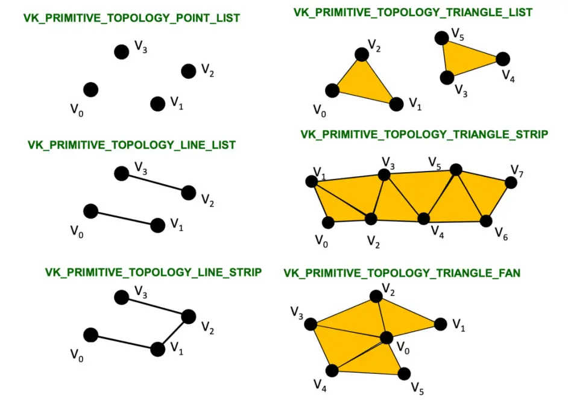

## ポリゴンモード（Polygon Mode）

デフォルトのグラフィックスレンダリングパイプラインはフィルモード（Fill Mode）を使用し、描画された三角形プリミティブを塗りつぶします。


グラフィックスAPIは通常、ワイヤーフレームモード（Line Mode）もサポートしており、このモードでは三角形プリミティブの辺のみが描画されます。


QRhiでの使用方法は以下の通りです。

``` C++
mPipeline->setPolygonMode(QRhiGraphicsPipeline::Line);
```

## フラグメント操作（Fragment Operations）

2つの矩形を描画したとします。

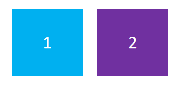

以下のようなニーズが生じる可能性があります。

- 重なりが発生した場合、後から描画した矩形で以前の矩形を覆う

  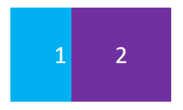

- 重なりが発生した場合、矩形の色を一定の戦略に基づいて混合する

  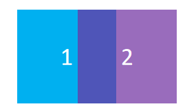

- 矩形を一定の空間的遮り関係に基づいて表示する

  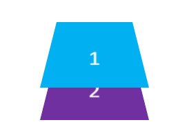

- 先に描画した矩形をマスクとして、後方の矩形の描画領域を決定する

  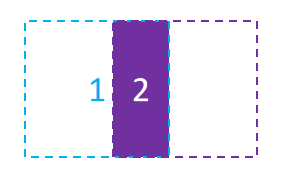

グラフィックスAPIはこれらの機能をサポートしており、グラフィックスレンダリングパイプラインにおいて、ラスタライゼーションによって生成されたフラグメントはいくつかの[フラグメント操作（Fragment Operations）](https://registry.khronos.org/vulkan/specs/1.3/html/chap26.html#fragops)を経て、フラグメントシェーダーによって生成された値をフレームバッファに書き込むかどうか、またはどのように書き込むかが決定されます。これらの操作は通常、以下の順序で行われます。

1. [スクリーンテスト（Scissor test）](https://registry.khronos.org/vulkan/specs/1.3/html/chap26.html#fragops-scissor)：矩形領域によって画像をクリッピングする
2. [深度境界テスト（Depth bounds test）](https://registry.khronos.org/vulkan/specs/1.3/html/chap26.html#fragops-dbt)：深度値の範囲に基づいて画像をクリッピングする
3. [ステンシルテスト（Stencil test）](https://registry.khronos.org/vulkan/specs/1.3/html/chap26.html#fragops-stencil)：ステンシル（マスク：Mask）を使用して、異形領域のクリッピングを実現できる
4. [深度テスト（Depth test）](https://registry.khronos.org/vulkan/specs/1.3/html/chap26.html#fragops-depth)：深度値を比較してフラグメントを選別し、画像に前後の遮り関係を表現する
5. [ブレンディング（Blending）](https://registry.khronos.org/vulkan/specs/1.3/html/chap27.html#framebuffer-blending)：一定の戦略に基づいて重なり合うフラグメントを混合する

> 注意：上記は比較的一般的で開発者にとって重要なフラグメント操作であり、完全な説明ドキュメントは以下の通りです。
>
> - https://registry.khronos.org/vulkan/specs/1.3/html/chap26.html#fragops

ここでは主に、**重なり合うフラグメントの処理機構**と**フラグメントの選別手段**を設定する方法を学ぶ必要があります。

### スクリーンテスト（Scissor Test）

- スクリーンテストを使用する目的は単純で、矩形によって画像をクリッピングしたい場合です。例えば以下のように。

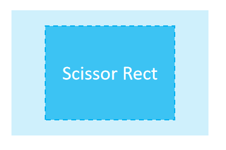

QRhiでは、パイプラインを作成する際に `QRhiGraphicsPipeline::Flag::UsesScissor` を設定するだけでスクリーンテストを使用できます。

``` c++
mPipeline->setFlags(QRhiGraphicsPipeline::Flag::UsesScissor);
```

描画時には `QRhiCommandBuffer::setScissor(const QRhiScissor &scissor)` を使用します。

```C++
cmdBuffer->beginPass(renderTarget, clearColor, dsClearValue, batch);
cmdBuffer->setGraphicsPipeline(mPipeline.get());
cmdBuffer->setViewport(QRhiViewport(0, 0, width, height));
cmdBuffer->setScissor(QRhiScissor(0, 0, width/2, height/2));		// クリッピングにより1/4の領域のみを保持
cmdBuffer->setShaderResources(mCubeShaderBindings.get());
const QRhiCommandBuffer::VertexInput vertexInput(mCubeVertexBuffer.get(), 0);
cmdBuffer->setVertexInput(0, 1, &vertexInput);
cmdBuffer->draw(36);
cmdBuffer->endPass();
```

[ **チュートリアル例 07-Scissor Test** ](https://github.com/Italink/ModernGraphicsEngineGuide/blob/main/Source/1-GraphicsAPI/07-ScissorTest/Source/main.cpp) ：スクリーンテストにより1/4の領域のみを保持する。

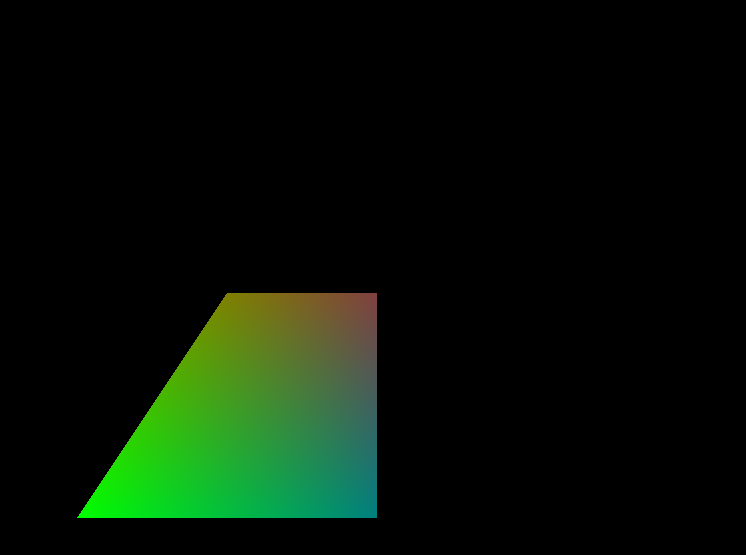

### ステンシルテスト(Stencil Test)

通常、ステンシルテストはスクリーンテストが矩形領域のみでクリッピングできる欠点を補うために使用されます。ステンシルテストでは、独自のステンシル（マスク/Mask）を作成してクリッピングできます。例えば以下のように。

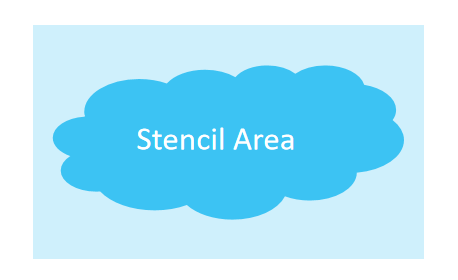

[ステンシルテスト - LearnOpenGL CN (learnopengl-cn.github.io)](https://learnopengl-cn.github.io/04 Advanced OpenGL/02 Stencil testing/)

ステンシルテストの核心メカニズムは以下のように考えることができます。

- **ステンシルアタッチメント**（バッファ）を持つRenderTargetでのみ、ステンシルテストを使用できる
- `BeginPass` 時に、**ステンシルバッファ**（通常は0を使用）がクリアされる
- パイプラインをバインドした後、`StencilRef`（Int値）を指定でき、これはパイプラインのIDとして扱える
- 描画中、パイプラインはこのIDをステンシルバッファ上の現在のフラグメントに対応するステンシル値と比較します。**比較方式**を設定でき、これにより現在のフラグメントがステンシルテストを通過できるかどうかが決まります。さらに、フラグメントがステンシルテストを**通過した場合**、**通過しなかった場合**、深度テストを通過しなかった場合に、ステンシルバッファをどのように処理するかを設定できます。

QRhiでステンシルを作成したい場合、以下のようなコードを記述することがあります。

``` c++
mMaskPipeline->setFlags(QRhiGraphicsPipeline::Flag::UsesStencilRef);			// パイプラインのステンシルテスト機能を有効にする
mMaskPipeline->setStencilTest(true);											// ステンシルテストを有効にする
QRhiGraphicsPipeline::StencilOpState maskStencilState;
maskStencilState.compareOp = QRhiGraphicsPipeline::CompareOp::Never;			// このパイプラインはステンシル（マスク）を描画するため、RT上にフラグメントの色を描画したくないので、フラグメントがステンシルテストを永遠に通過できないようにする
maskStencilState.failOp = QRhiGraphicsPipeline::StencilOp::Replace;				// フラグメントがステンシルテストを通過しなかった場合、StencilRefでステンシルバッファを埋めるように設定
mMaskPipeline->setStencilFront(maskStencilState);								// 正面のステンシルテストを指定
mMaskPipeline->setStencilBack(maskStencilState);								// 背面のステンシルテストを指定
mMaskPipeline->create();
```

実際のグラフィックスでは、以下のようなパラメータを使用することがあります。

``` c++
mPipeline->setFlags(QRhiGraphicsPipeline::Flag::UsesStencilRef);				// パイプラインのステンシルテスト機能を有効にする
mPipeline->setStencilTest(true);												// ステンシルテストを有効にする
QRhiGraphicsPipeline::StencilOpState stencilState;
stencilState.compareOp = QRhiGraphicsPipeline::CompareOp::Equal;				// 現在のパイプラインのStencilRefがステンシルバッファ上のフラグメントに対応する値と等しい場合にのみ、ステンシルテストを通過させたい
stencilState.passOp = QRhiGraphicsPipeline::StencilOp::Keep;					// テスト通過後、ステンシルバッファに値を代入しない
stencilState.failOp = QRhiGraphicsPipeline::StencilOp::Keep;					// テスト未通過時も、ステンシルバッファに値を代入しない
mPipeline->setStencilFront(stencilState);
mPipeline->setStencilBack(stencilState);
mPipeline->create();
```

描画プロセスは以下のようになる可能性があります。

``` c++
const QColor clearColor = QColor::fromRgbF(0.0f, 0.0f, 0.0f, 1.0f);
const QRhiDepthStencilClearValue dsClearValue = { 1.0f,0 };							// ステンシルバッファを0でクリア
cmdBuffer->beginPass(renderTarget, clearColor, dsClearValue, nullptr);

cmdBuffer->setGraphicsPipeline(mMaskPipeline.get());
cmdBuffer->setStencilRef(1);														// StencilRefを1に設定。このパイプラインはステンシルバッファ上に値1の三角形領域を埋める
cmdBuffer->setViewport(QRhiViewport(0, 0, mSwapChain->currentPixelSize().width(), mSwapChain->currentPixelSize().height()));
cmdBuffer->setShaderResources();
const QRhiCommandBuffer::VertexInput maskVertexInput(mMaskVertexBuffer.get(), 0);
cmdBuffer->setVertexInput(0, 1, &maskVertexInput);
cmdBuffer->draw(3);

cmdBuffer->setGraphicsPipeline(mPipeline.get());
cmdBuffer->setStencilRef(1);														// StencilRefを1に設定。このパイプラインは1を対応する位置のフラグメントのステンシル値と比較し、等しい場合にのみステンシルテストを通過し、フラグメントをカラーアタッチメントに描画する
cmdBuffer->setViewport(QRhiViewport(0, 0, mSwapChain->currentPixelSize().width(), mSwapChain->currentPixelSize().height()));
cmdBuffer->setShaderResources();
const QRhiCommandBuffer::VertexInput vertexInput(mVertexBuffer.get(), 0);
cmdBuffer->setVertexInput(0, 1, &vertexInput);
cmdBuffer->draw(3);

cmdBuffer->endPass();
```

[ **チュートリアル例 08-StencilTest** ](https://github.com/Italink/ModernGraphicsEngineGuide/blob/main/Source/1-GraphicsAPI/08-StencilTest/Source/main.cpp) ：MaskPipelineを使用してステンシルバッファ上に値1の三角形領域を描画し、その後反転した三角形を描画します。パイプラインのStencilRefを1に設定し、ステンシルバッファ上のフラグメントの対応する値と等しい場合にのみステンシルテストを通過させます。具体的な効果は、2つの三角形の重なり領域、つまり菱形のみを描画することです。

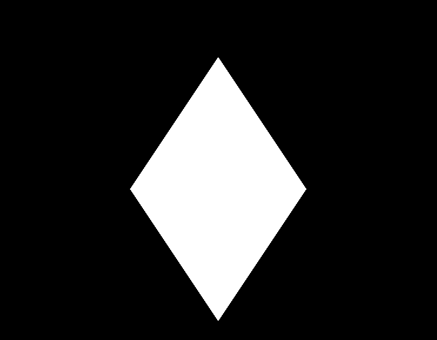

### 深度テスト(Depth Test)

深度テストを有効にすると、画像に前後の遮り関係を表現できます。深度テストがない場合、誤った遮り関係が発生します。例えば以下のように。

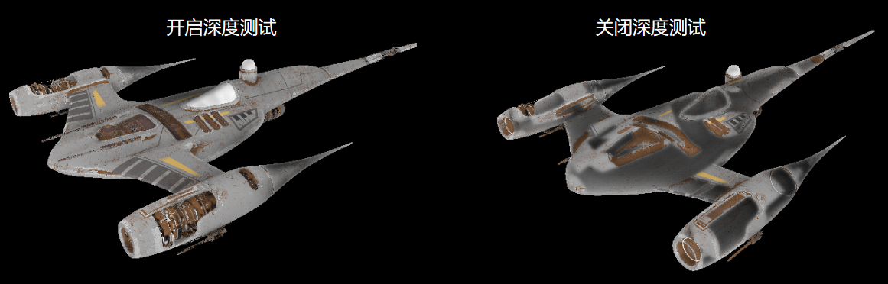

深度テストについて、非常に良い記事があります。

- [深度テスト - LearnOpenGL CN (learnopengl-cn.github.io)](https://learnopengl-cn.github.io/04 Advanced OpenGL/01 Depth testing/)

さらに、深度テストを使用する際には、一般的に以下の点に注意する必要があります。

- **深度書き込みとテストを有効にする必要があるか？**
  - 深度書き込みとテストを有効にすると、3D空間におけるグラフィックスに一定の遮り関係を持たせることができますが、3D空間内のすべてのグラフィックスが深度書き込みとテストを必要とするわけではありません。半透明物体のレンダリングがその例外の一つです。大部分のエンジンはシーン要素をレンダリングする際に、不透明物体と透明物体をソートし、まず深度テストと書き込みを有効にしてすべての不透明物体を描画し、その後深度書き込みを無効にして深度テストを保持し、透明物体のレンダリングを完了します。詳細は以下を参照してください。[一篇文章能不能说清楚半透明渲染 - 知乎 (zhihu.com)](https://zhuanlan.zhihu.com/p/579419607)

- **グラフィックスAPI間で深度値の範囲が一致しない！**
  - OpenGLの深度値範囲は `[-1,1]` で、DX、Vulkan、Metalの深度値範囲は `[0，1]` です。QRhiでは、MVP行列をアップロードする際に `clipSpaceCorrMatrix` を乗算することで、OpenGLの標準を使用できます。

- **RenderTargetが深度アタッチメントを持っているか、またその精度はどれくらいかを明確にする**
  - 深度アタッチメントを持つRenderTargetでのみ深度テストを行うことができます。通常、ウィンドウスワップチェーンで使用される深度ステンシルアタッチメントは、深度値を格納するために24ビット、ステンシル値を格納するために8ビットを使用します。これは、深度アタッチメントが一定の精度の深度値しか格納できないことを意味します。2つの平面の距離が深度アタッチメントの最小精度より小さい場合、深度テストを行うと2つの平面の深度値が同じになるため、重なり合うピクセル間の遮り順序をデータに基づいて明確にすることができません。この場合、描画順序がテスト結果を決定しますが、グラフィックスレンダリングパイプラインは並列処理であるため、グラフィックス間の実行順序を保証できず、2つのグラフィックスが交互に点滅する現象が発生します。これを**深度衝突（Z-fighting）**現象と呼びます。

- **深度衝突を回避する方法**
  - 深度アタッチメントの精度を向上させる（例：ステンシルビットを削除し、深度を32ビットに拡張する）
  - グラフィックスの位置をずらす、[深度バイアス（Depth Bias） ](https://learn.microsoft.com/zh-cn/windows/win32/direct3d11/d3d10-graphics-programming-guide-output-merger-stage-depth-bias?redirectedfrom=MSDN)を使用する

QRhiでは、**QRhiGraphicsPipeline** を作成する際に、深度テストの関連パラメータを設定できます。

``` c++
mPipeline->setDepthTest(true);
mPipeline->setDepthWrite(true);
mPipeline->setDepthOp(QRhiGraphicsPipeline::CompareOp::Less);
```

さらに、RenderPassで使用するClearValueに注意する必要があります。

``` c++
const QRhiDepthStencilClearValue dsClearValue = { 1.0f,0 };
cmdBuffer->beginPass(renderTarget, clearColor, dsClearValue);
```

> 通常、深度バッファを `1.0f` でクリアし、`CompareOp::Less` を使用して空間的な遮り効果を達成します。

**[チュートリアル例 09-Depth Test](https://github.com/Italink/ModernGraphicsEngineGuide/tree/main/Source/1-GraphicsAPI/09-DepthTest/Source)** ：平面と立方体を描画し、深度テストを有効にして立方体の下半分が正しく遮られるようにします。

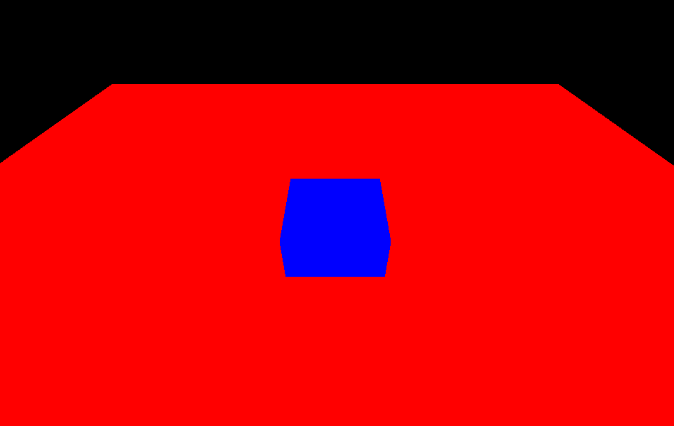

### ブレンディング(Blending)

ブレンディングは通常、半透明レンダリングに使用され、本質的には前後に重なり合うフラグメントを処理するメカニズムです。

前（既にバッファに描画された）フラグメントを**目標（Dst）フラグメント**、後（描画待ち）フラグメントを**ソース（Src）フラグメント**と呼びます。ブレンディングは主に、このプロセスをカスタマイズするためのいくつかの式パラメータを設定する（角括弧`[]`内のパラメータは設定可能）：
$$
\begin{align*} 
& ResultColor_{rgb} = [SrcFactor_{alpha}]*SrcColor_{rgb}\ \ [Op]\ \ [DstFactor_{rgb}] * DstColor_{rgb} \\
& ResultAlpha = [SrcFactor_alpha ]*SrcAlpha\ \ [Op]\ \ [DstFactor_{alpha}] * DstAlpha
\end{align*}
$$
また、どの色チャネル（RGBA）を書き込むかを決定します。

Factorの値は一般的に以下の通りです。

```C++
Zero,
One,
SrcColor,
OneMinusSrcColor,
DstColor,
OneMinusDstColor,
SrcAlpha,
OneMinusSrcAlpha,
DstAlpha,
OneMinusDstAlpha,
ConstantColor,
OneMinusConstantColor,
ConstantAlpha,
OneMinusConstantAlpha,
SrcAlphaSaturate,
Src1Color,
OneMinusSrc1Color,
Src1Alpha,
OneMinusSrc1Alpha
```

Opの値は以下の通りです。

``` c++
Add,
Subtract,
ReverseSubtract,
Min,
Max
```

詳細は以下を参照してください。[ブレンディング - LearnOpenGL CN (learnopengl-cn.github.io)](https://learnopengl-cn.github.io/04 Advanced OpenGL/03 Blending/)

QRhiでは、グラフィックスレンダリングパイプラインを作成する際に、ブレンディングの主要パラメータを以下のように設定できます。

``` C++
class QRhiGraphicsPipeline{
public:
    struct TargetBlend {
        ColorMask colorWrite = ColorMask(0xF); 	 // R | G | B | A		
        bool enable = false;					 // ブレンディングを有効にするか
        BlendFactor srcColor = One;				 // ソースフラグメントのRGB値
        BlendFactor dstColor = OneMinusSrcAlpha; // 目標フラグメントのRGB値
        BlendOp opColor = Add;					 // フラグメントRGBの算術演算子
        BlendFactor srcAlpha = One;				 // ソースフラグメントのAlpha値
        BlendFactor dstAlpha = OneMinusSrcAlpha; // 目標フラグメントのAlpha値
        BlendOp opAlpha = Add;					 // フラグメントAlphaの算術演算子
    };
};
```

使用方法は非常に簡単です。

``` C++
QRhiGraphicsPipeline::TargetBlend blend;
blend.enable = true;
blend.srcColor = QRhiGraphicsPipeline::SrcAlpha;
blend.dstColor = QRhiGraphicsPipeline::OneMinusSrcAlpha;

mPipeline->setTargetBlends({ blend });
```

ここで設定されているのは TargetBlend**s** であることに注意してください。これは、ブレンディングの設定がRenderTargetの色アタッチメントと一対一に対応しているためです。RTに複数の色アタッチメントがある場合、複数のTargetBlendを設定する必要があります。

**[チュートリアル例 10-Blending](https://github.com/Italink/ModernGraphicsEngineGuide/blob/main/Source/1-GraphicsAPI/10-Blend/Source/main.cpp)** ：平面と半透明の立方体を描画し、ブレンディングを有効にして半透明の立方体が正しく表示されるようにします。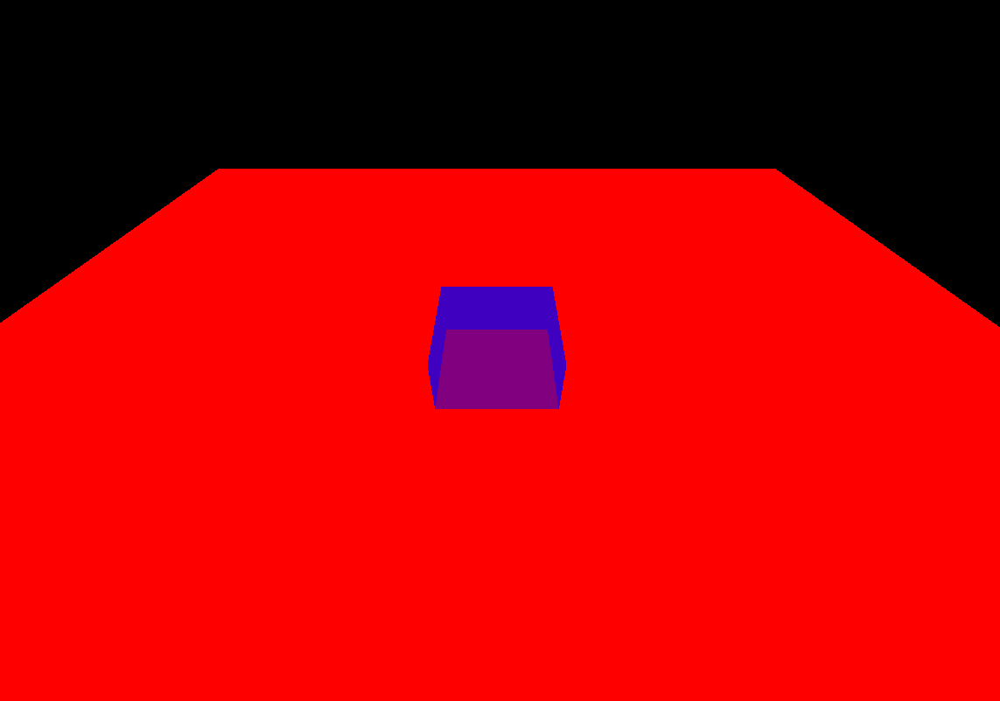

## 面カリング(Face Culling)

多くの場合、3D空間では幾何学形状の単一の側面しか見ることができません。例えば球体では、外表面しか見ることができません。GPUは並列データプロセッサであり空間的な遮りの概念を持たないため、球体の遮られた部分についても描画が実行されます。

この問題を解決するため、グラフィックスAPIは面カリング機能を提供します。これは、幾何学形状の頂点インデックスが一定の**巻き順**でソートされることを要求し、巻き順に基づいて三角形の表裏を決定します。これにより、面カリングを使用してグラフィックスレンダリングパイプラインが背面の三角形をカリングできるようになります。

詳細は以下を参照してください。[面カリング - LearnOpenGL CN (learnopengl-cn.github.io)](https://learnopengl-cn.github.io/04 Advanced OpenGL/04 Face culling/)

QRhiでは、グラフィックスレンダリングパイプラインを作成する際に、**正面の評価方式**を指定することで面カリングを使用できます。

``` c++
mPipeline->setFrontFace(frontFace);
```

さらに**カリングモード（CullMode）**を設定します。

``` c++
mPipeline->setCullMode(cullMode)
```

これらは以下の値を取ることができます。

``` C++
class QRhiGraphicsPipeline{
    enum CullMode {
        None,		// カリングしない
        Front,		// 正面をカリング
        Back		// 背面をカリング
    };
    enum FrontFace {
        CCW,		// 反時計回り
        CW			// 時計回り
    };
};
```

[ **チュートリアル例 11-FaceCulling** ](https://github.com/Italink/ModernGraphicsEngineGuide/blob/main/Source/1-GraphicsAPI/11-FaceCulling/Source/main.cpp) ：Y軸を中心に回転する三角形を描画し、背面カリングを有効にします。

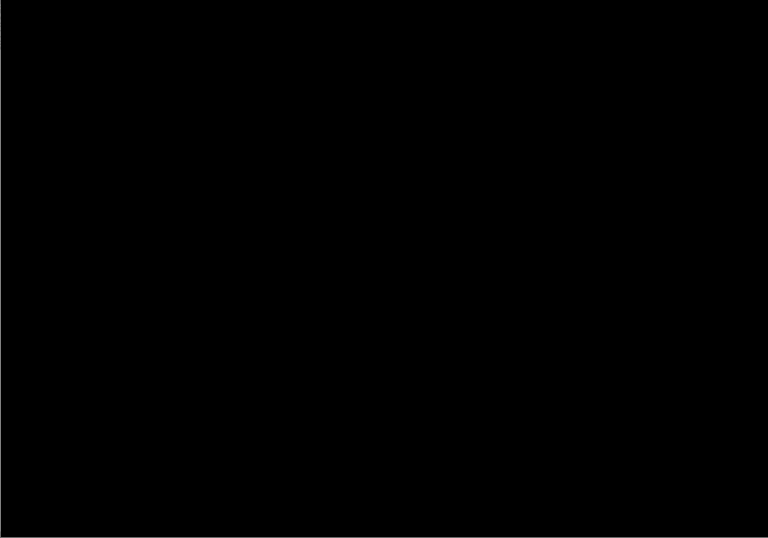

## 線幅（Line Width）

**一部の**グラフィックスAPIとプラットフォームは、パイプラインで線プリミティブの幅を設定することをサポートしています。QRhiでは以下のインターフェースを使用します。

``` C++
 void QRhiGraphicsPipeline::setLineWidth(float width);
```

現在のバックエンドが線幅の設定をサポートしているかを確認するには、以下のインターフェースを使用します。

``` C++
bool isSupported = mRhi->isFeatureSupported(QRhi::Feature::WideLines);
```

筆者は線プリミティブの使用を強く推奨しません。一方で、VulkanとOpenGLの一部のプラットフォームでのみ線幅の設定がサポートされているためであり、他方ではグラフィックスAPIが連続線の**接続（Join）**を処理しないためです。グラフィックスレンダリングパイプラインの`Lineプリミティブ`を使用して連続線を描画する場合、以下のような効果が得られます。

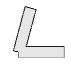

ゲームエンジンでは、大部分の場合、三角形プリミティブを使用して描画し、線の接続部分を自ら計算します。

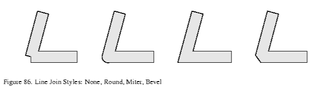

> [15.6.1 線接続 (bluevoid.com)](http://www.bluevoid.com/opengl/sig00/advanced00/notes/node290.html)

本チュートリアルの後続の章では、連続線の描画についていくつかの紹介を行います。

## インスタンシング（Instancing）

インスタンシングについて、筆者は一つの質問をしたいと思います。GPUの計算能力について了解していますか？

了解していない場合は、関連資料を探して了解することを推奨します。ここで筆者は簡単な説明を列挙します。

- 一般的なコンピュータのディスプレイ解像度は `1920X1080` であり、これは1フレームの画像が約**200万のピクセルデータ**を持つことを意味します。フルスクリーンの矩形領域を描画する場合、現在のミッドレンジグラフィックスカード（1050Ti以上）では、**垂直同期を無効にした後**、一般的に**数千のフレームレート（FPS）**を達成できます。

これから分かるように、GPUの計算能力は非常に驚異的ですが、実際のレンダリングプロジェクトでは、複雑なシーンのフレームレートは一般的に高くありません。これは通常、シーンの幾何学的複雑さがGPUの性能を低下させるためではなく、CPUとGPU間のデータ伝送帯域幅がGPUの性能を大きく制約しているためです。上記の説明でGPUが非常に強力な性能を発揮できたのは、頂点データが最初からGPUにアップロードされていたため、その後の描画プロセス全体でCPUとGPU間のデータ通信がなかったためです。GPUの性能をより良く発揮するために、CPUとGPU間のデータ伝送を可能な限り減らすことが一般的です。前章でIndexBufferを使用して重複する頂点を削除したのは、この目的に基づいています。**インスタンシング（Instancing）**は、グラフィックスAPIが提供する高度な機能であり、大量のインスタンスデータと共通データを組み合わせて、大量の類似物体を描画できるようにします。

より詳細なチュートリアルがあります。

- [インスタンシング - LearnOpenGL CN (learnopengl-cn.github.io)](https://learnopengl-cn.github.io/04%20Advanced%20OpenGL/10%20Instancing/)

QRhiでは、パイプラインを作成する際に、頂点入力レイアウトでインスタンスデータを指定するだけです。

``` c++
QRhiVertexInputLayout inputLayout;
inputLayout.setBindings({
	QRhiVertexInputBinding(2 * sizeof(float)),
	QRhiVertexInputBinding(2 * sizeof(float), QRhiVertexInputBinding::PerInstance),			// 逐インスタンスデータを宣言
});
mPipeline->setVertexInputLayout(inputLayout);
```

その後、描画時にdraw関数にインスタンス数を入力するだけです。

``` c++
void QRhiCommandBuffer::draw(quint32 vertexCount,
                             quint32 instanceCount = 1,
                             quint32 firstVertex = 0,
                             quint32 firstInstance = 0);

void QRhiCommandBuffer::drawIndexed(quint32 indexCount,
                                    quint32 instanceCount = 1,
                                    quint32 firstIndex = 0,
                                    qint32 vertexOffset = 0,
                                    quint32 firstInstance = 0);
```

[ **チュートリアル例 12-Instancing** ](https://github.com/Italink/ModernGraphicsEngineGuide/blob/main/Source/GraphicsAPI/12-Instancing/Source/main.cpp) ：三角形の頂点データと、オフセットデータ用のいくつかのインスタンスデータを組み合わせて、大量の三角形を描画します。

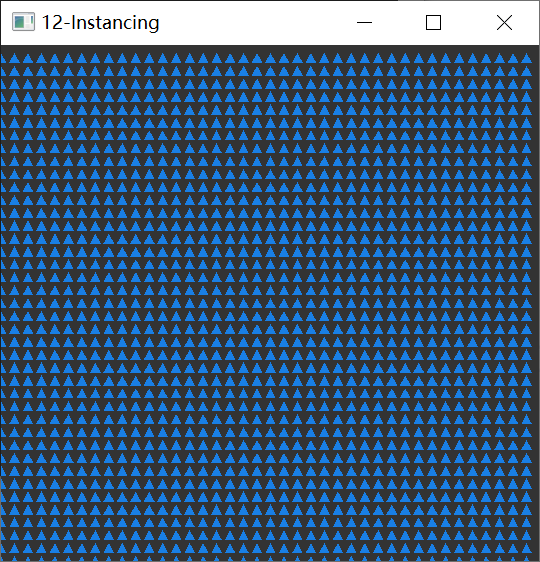

## マルチレンダーターゲット（Multi Render Target）

前章では、SwapChainが提供するRenderTargetを使用していました。実際のレンダリング開発プロセスでは、中間的なレンダリングプロセスが必要になる場合があります。このプロセスの結果を格納するために、自身でRTを作成します。

QRhiでは、RenderTargetを作成することは非常に簡単です。例えば以下のように。

``` c++
mColorAttachment0.reset(mRhi->newTexture(QRhiTexture::RGBA8, QSize(100, 100), 1, QRhiTexture::Flag::RenderTarget | QRhiTexture::UsedAsTransferSource));				
mColorAttachment0->create();					// カラーアタッチメント0を作成
mColorAttachment1.reset(mRhi->newTexture(QRhiTexture::RGBA8, QSize(100, 100), 1, QRhiTexture::Flag::RenderTarget | QRhiTexture::UsedAsTransferSource));				
mColorAttachment1->create();					// カラーアタッチメント1を作成
mDepthStencilBuffer.reset(mRhi->newRenderBuffer(QRhiRenderBuffer::Type::DepthStencil, QSize(100, 100), 1, QRhiRenderBuffer::Flag(), QRhiTexture::Format::D24S8));		
mDepthStencilBuffer->create();					// 深度（24ビット）ステンシル（8ビット）アタッチメントを作成

QRhiTextureRenderTargetDescription rtDesc;																												
rtDesc.setColorAttachments({ mColorAttachment0.get(),mColorAttachment1.get() });	
rtDesc.setDepthStencilBuffer(mDepthStencilBuffer.get());
mRenderTarget.reset(mRhi->newTextureRenderTarget(rtDesc));			

// RenderTargetの構造に基づいてRenderPass記述を作成します。GraphicsPipelineを使用する際には、RenderPassDescを指定する必要があります。
// これは、パイプラインが作成される際に、どの構造のRenderPassに使用されるかを明確にする必要があるためです。ここでの構造とは、RenderTargetのアタッチメント数とフォーマットを指します。
mRenderPassDesc.reset(mRenderTarget->newCompatibleRenderPassDescriptor());														
mRenderTarget->setRenderPassDescriptor(mRenderPassDesc.get());

mRenderTarget->create();
```

> 注意： **QRhiRenderBuffer** は、CPUが読み書きできないTextureの一種と簡単に考えることができます。Textureよりも優れたGPU処理性能を持っているため、RenderTarget内のバッファを読み書きする必要がない場合は、アタッチメントとしてRenderBufferを優先的に考慮してください。通常、スワップチェーン内のカラーアタッチメントと深度ステンシルアタッチメントは、RenderBufferを使用しています。

マルチレンダーターゲットは、単一のRenderTargetが複数の**カラーアタッチメント（ColorAttachment）**を含むことを意味します。

FragmentShaderでは、以下のようにフラグメント出力を制御できます。

``` c++
#version 440
layout(location = 0) out vec4 fragColor0;		// カラーアタッチメント0に出力
layout(location = 1) out vec4 fragColor1;		// カラーアタッチメント1に出力
void main(){
    fragColor0 = vec4(1.0f,0.0f,0.0f,1.0f);
	fragColor1 = vec4(0.0f,0.0f,1.0f,1.0f);
}
```

描画時には、`beginPass`で自身のRenderTargetを使用するだけです。

```
const QColor clearColor = QColor::fromRgbF(0.2f, 0.2f, 0.2f, 1.0f);
const QRhiDepthStencilClearValue dsClearValue = { 1.0f,0 };
cmdBuffer->beginPass(myRenderTarget.get(), clearColor, dsClearValue);	
cmdBuffer->endPass();
```

[ **チュートリアル例 13-MultiRenderTarget** ](https://github.com/Italink/ModernGraphicsEngineGuide/blob/main/Source/1-GraphicsAPI/13-MultiRenderTarget/Source/main.cpp) ：2つのカラーアタッチメントを持つRT上に異なる色を描画し、別のパイプラインを使用してそのカラーアタッチメントを交互にスワップチェーンのRTに描画します。

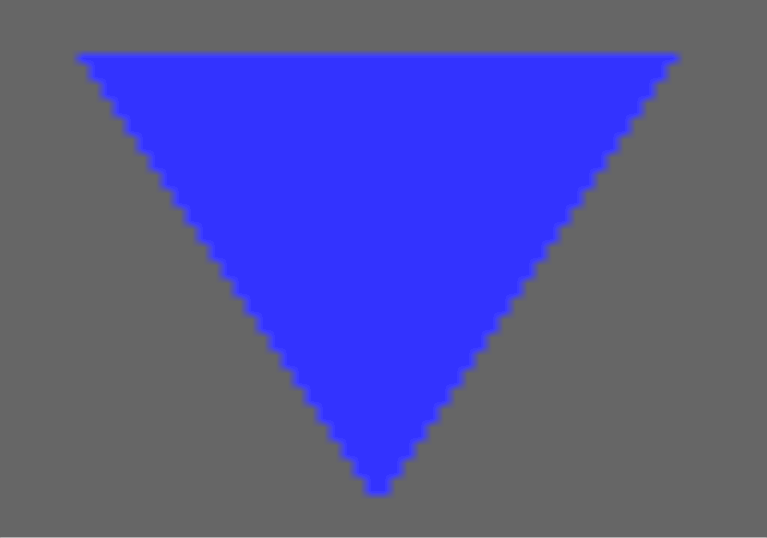

## コンピュートパイプライン（Compute Pipeline）

コンピュートパイプラインは、GPUの能力を利用して汎用的なデータ計算を行うことができます。

グラフィックスレンダリングパイプラインとの違いは以下の通りです。

- コンピュートパイプラインではCompute Shaderを記述するだけでよい
- コンピュートパイプラインでは、Usage識別子に `StorageBuffer` を持つリソース（バッファと画像）を読み書きできる
- コンピュートパイプラインは `dispatch(int x, int y, int z)` を使用して実行スケジューリングを開始する
- コンピュートパイプラインはレンダリングパイプラインと異なり、テクスチャサンプリングを使用できず、`image2D` を使用して `imageLoad` 関数でピクセル値を読み取り、`imageStore()` で格納する
- コンピュートシェーダーではSSBOに対してアトミック（Atomic）操作を行うことができる

より詳細な紹介がある良い記事があります。

- [缪之灵 - 从零开始的 Vulkan（八）：计算管线 ](https://zhuanlan.zhihu.com/p/624613836)
- [Reddit - 如何合理划分工作组的调度？](https://www.reddit.com/r/vulkan/comments/barcii/ballpark_dispatch_group_size_for_gpgpu/)

QRhiでは、コンピュートパイプラインを使用するフローは以下の通りです。

コンピュートパイプラインで使用可能なリソースを作成します。

``` c++
mStorageBuffer.reset(mRhi->newBuffer(QRhiBuffer::Static, QRhiBuffer::StorageBuffer, sizeof(float)));							// バッファをStorageBufferとして使用
mStorageBuffer->create();
mTexture.reset(mRhi->newTexture(QRhiTexture::RGBA8, QSize(ImageWidth, ImageHeight), 1, QRhiTexture::UsedWithLoadStore));		// 画像をコンピュートパイプラインで読み書き可能にする
mTexture->create();
```

コンピュートパイプラインを作成します。

``` c++
mPipeline.reset(mRhi->newComputePipeline());
mShaderBindings.reset(mRhi->newShaderResourceBindings());
QShader cs = QRhiHelper::newShaderFromCode(mRhi.get(), QShader::ComputeStage, R"(#version 440
	layout(std140, binding = 0) buffer StorageBuffer{
		int counter;
	}SSBO;
	layout (binding = 1, rgba8) uniform image2D Tex;

	void main(){
		int currentCounter = atomicAdd(SSBO.counter,1);
		//int currentCounter = SSBO.counter = SSBO.counter + 1;
		ivec2 pos = ivec2(gl_GlobalInvocationID.xy);
		imageStore(Tex,pos,vec4(sin(currentCounter/100.0f),0,0,1));
	}
)");
Q_ASSERT(cs.isValid());

mShaderBindings->setBindings({
    // コンピュートパイプラインのリソースバインディングを設定。Loadは読み取り可能、Storeは書き込み可能を意味する
    QRhiShaderResourceBinding::bufferLoadStore(0,QRhiShaderResourceBinding::ComputeStage,mStorageBuffer.get()),	QRhiShaderResourceBinding::imageLoadStore(1,QRhiShaderResourceBinding::ComputeStage,mTexture.get(),0),
});
mShaderBindings->create();
mPipeline->setShaderResourceBindings(mShaderBindings.get());
mPipeline->create();
```

コンピュートパイプラインを実行します。

``` c++
cmdBuffer->beginComputePass(resourceUpdates);
cmdBuffer->setComputePipeline(mPipeline.get());
cmdBuffer->setShaderResources();
cmdBuffer->dispatch(ImageWidth, ImageHeight, 1);		// 画像サイズに基づいてワークグループを分割
cmdBuffer->endComputePass();
```

[ **チュートリアル例 14-ComputePipeline** ](https://github.com/Italink/ModernGraphicsEngineGuide/blob/main/Source/1-GraphicsAPI/14-ComputePipeline/Source/main.cpp) ：SSBOを使用して初期値0のint値を格納し、ComputeShaderを使用してそれを自動的にインクリメントし、インクリメント結果を`[0,1]`に正規化し、現在のワークユニットの座標に基づいて画像に書き込み、スワップチェーンに描画します。得られる効果は以下の通りです。

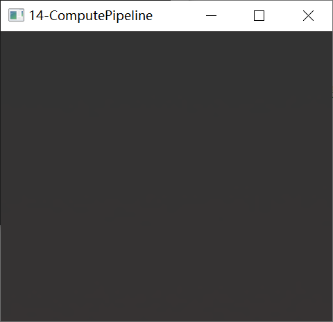

奇妙なことに、各計算ユニットでCounter+1を行い、対応する位置のピクセルに書き込んでいますが、正常な場合、表示される色に一定のグラデーションがあるはずです。この効果は、各計算ユニットが画像を埋める際にCounterが同じであるかのように見えます。

マルチスレッドについて了解している場合は、この問題を解決する方法を思いつくはずです。アトミック変数を使用するだけで、GPUではSSBOに対してアトミック操作を行うことができます。

ComputeShader内のコメントを切り替えます。

``` c++
layout(std140, binding = 0) buffer StorageBuffer{
    int counter;
}SSBO;
layout (binding = 1, rgba8) uniform image2D Tex;
const int ImageSize = 64 * 64;
void main(){
    //int currentCounter = SSBO.counter = SSBO.counter + 1;		
    int currentCounter = atomicAdd(SSBO.counter,1);			// アトミック操作を使用
    ivec2 pos = ivec2(gl_GlobalInvocationID.xy);
    imageStore(Tex,pos,vec4(currentCounter/float(ImageSize),0,0,1));
}
```

以下の効果が見られ、そのグラデーションはコンピュートパイプラインの並列実行状況を示しています。

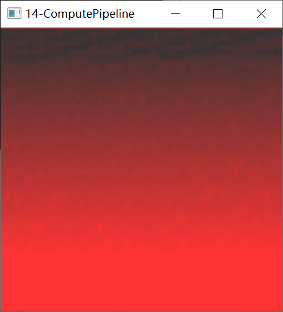

## インダイレクトレンダリング（Indirect Rendering）

**インダイレクトレンダリング（Indirect Rendering）**は、現代的なグラフィックスAPIの高度な機能の一つであり、現在のいくつかの注目すべきエンジン技術には常にその影が見えます。例えば、数百万もの数をシミュレートするGPUパーティクル、UE5の仮想幾何学技術Naniteなどです。その作用は何でしょうか？

インスタンシングのセクションで述べたように、GPU性能を制約する要因は通常CPUとのデータ通信に由来します。**IndexBuffer**と**Instancing**は、一部の頂点データを再利用できるようにするだけで、これらのデータは依然としてCPUから提供される必要があります。これらのデータが動的である場合、毎フレーム提交する必要がある可能性があり、これは依然としてデータ伝送段階で性能ボトルネックを引き起こします。そのため、多くの開発者は全GPUフローを考えました。直接GPU上で頂点データを生成および処理し、これらのデータを使用して直接描画するのです。しかし、この効果を実現するためには非常に致命的な問題があります。`draw`命令を呼び出す際には、レンダリングパラメータ（頂点数、インデックス数、インスタンス数など）を指定する必要がありますが、全GPUフローではCPUがGPUで生成されたデータを知らないため、GPUのデータを**回読（Readback）**してCPUに戻すことは性能損失が非常に大きい操作です。この問題を解決するため、**インダイレクトレンダリング（Indirect Rendering）**では、`drawIndirect`命令を呼び出す際にIndirect Bufferを指定でき、このBufferには対応する`draw`命令のレンダリングパラメータが格納されています。

例えば、以前は以下の`draw`命令を呼び出す可能性がありました。

```C++
void QRhiCommandBuffer::draw(
    uint32 vertexCount,
    uint32 instanceCount = 1,
    uint32 firstVertex = 0,
    uint32 firstInstance = 0);
```

現代的なグラフィックスAPIは対応するインダイレクト命令を提供します。

``` c++
void QRhiCommandBuffer::drawIndirect(
    QRhiBuffer *indirectBuffer,
    uint32 bufferOffset = 0
);
```

indirectBuffer内で以下のメモリ構造に従ってレンダリングパラメータを埋めるだけです。

```c++
struct IndirectBuffer{
    uint32 vertexCount;
    uint32 instanceCount;
    uint32 firstVertex;
    uint32 firstInstance;
}
```

この非常に簡単な機能により、CPUとGPU間のデータ通信の桎梏を打破し、**GPUドライブパイプライン（GPU Driven Pipeline）**を実現できるようになりました。

残念ながら、QRhiは**Indirect Rendering**のサポートを提供していませんが、非常に完備した原生API拡張手段を提供しています。

ここで筆者はVulkanを例に、QRhiの幾何学パイプラインでインダイレクトバッファを使用する方法を紹介します。

まず、`VK_BUFFER_USAGE_INDIRECT_BUFFER_BIT` 用途識別子を持つバッファを作成する必要があります。ここで筆者はいくつかのHack手段を使用してカプセル化を行いました。

``` c++
mIndirectDrawBuffer.reset(QRhiHelper::newVkBuffer(mRhi.get(), QRhiBuffer::Static, VK_BUFFER_USAGE_INDIRECT_BUFFER_BIT, sizeof(DispatchStruct)));
mIndirectDrawBuffer->create();
```

その後、通常の手段でIndirectDrawBufferのメモリを初期化します。

``` c++
QRhiResourceUpdateBatch* resourceUpdates = nullptr;
if(mSigSubmit.ensure()){
    resourceUpdates = mRhi->nextResourceUpdateBatch();								// インダイレクトバッファを初期化
    DispatchStruct dispatch;
    dispatch.x = dispatch.y = dispatch.z = 1;
    resourceUpdates->uploadStaticBuffer(mIndirectDrawBuffer.get(), 0, sizeof(DispatchStruct), &dispatch);
    cmdBuffer->resourceUpdate(resourceUpdates);
    mRhi->finish();
}
```

```c++
QVulkanInstance* vkInstance = vulkanInstance();
QRhiVulkanNativeHandles* vkHandle = (QRhiVulkanNativeHandles*)mRhi->nativeHandles();
QVulkanDeviceFunctions* vkDevFunc =  vkInstance->deviceFunctions(vkHandle->dev);

QRhiVulkanCommandBufferNativeHandles* cmdBufferHandles = (QRhiVulkanCommandBufferNativeHandles*)cmdBuffer->nativeHandles();
QVkCommandBuffer* cbD = QRHI_RES(QVkCommandBuffer, cmdBuffer);
VkCommandBuffer vkCmdBuffer = cmdBufferHandles->commandBuffer;

QVkComputePipeline* pipelineHandle = (QVkComputePipeline*)mPipeline.get();
VkPipeline vkPipeline = pipelineHandle->pipeline;

QRhiBuffer::NativeBuffer indirectBufferHandle = mIndirectDrawBuffer->nativeBuffer();
VkBuffer vkIndirectBuffer = *(VkBuffer*)indirectBufferHandle.objects[0];

cmdBuffer->beginExternal();															// 拡張を開始し、その後原生APIの命令を入力できる
vkDevFunc->vkCmdBindPipeline(vkCmdBuffer, VkPipelineBindPoint::VK_PIPELINE_BIND_POINT_COMPUTE, vkPipeline);
QRhiHelper::setShaderResources(mPipeline.get(), cmdBuffer, mShaderBindings.get());	// 補助関数、VKパイプラインのディスクリプタセットバインディングを更新するため
vkDevFunc->vkCmdDispatchIndirect(vkCmdBuffer, vkIndirectBuffer, 0);

cmdBuffer->endExternal();															
```

QRhiでは、自身で原生グラフィックスAPIのレンダリングリソースを作成し、CmdBufferを録画する際に `beginExternal()` と `endExternal()` の間に原生APIの命令を挿入できます。OpenGLは了解しているが現代的なグラフィックスAPIは不慣れな方は、以下の概念を了解する必要があります。

### レンダリングフロー

現代的なグラフィックスAPIにはContextの概念がなく、CommandBuffer（CommandList）によって命令を録画し、最後にQueueによって統一的にGPUに提交します。マルチスレッドのレンダリングプロセスでは、CommandBufferの録画順序を保証するだけです。

現代的なグラフィックスAPIのレンダリングフローは基本的に以下の通りです。

``` c++
void onRenderTick(){
    if(needInitResource){
        // Buffer,Pipeline,Bindings,Texture,Samplerなどを作成
    }
    
    if(needUpdateResource){
        cmdBuffer->...();
        // static bufferをアップロード、dynamic bufferを更新、textureをアップロード
    }
    
    cmdBuffer->beginPass(renderTarget,clearValue);	
    
    cmdBuffer->setPipeline();
	cmdBuffer->setViewport(...);
	cmdBuffer->setShaderResources(..);
	cmdBuffer->setVertexInput(0, 1, &vertexInput);
	cmdBuffer->draw(...);
    
    cmdBuffer->endPass()
}
```

注意が必要なのは、`beginPass()` と `endPass()` の間では、レンダリングリソースに対して操作できないことです。この処理プロセスは `beginPass()` の前に置きます。複数の物体を描画する場合、全体のプロセスは以下のようになります。

``` c++
for(auto item: renderItem)
    item->tryUpdateResource();

cmdBuffer->beginPass(renderTarget,clearValue);	

for(auto item: renderItem)
    item->drawCommands();

cmdBuffer->endPass()
```

### メモリ同期

現代的なグラフィックスAPIでは、リソースの同期を手動で管理する必要があります。

連続する2つのdraw命令について：

``` c++
RenderPass1();  // レンダリングチャネル1を実行
RenderPass2();	// レンダリングチャネル2を実行
```

多くの初心者は、レンダリングチャネル1が実行された後にレンダリングチャネル2が開始されると思うかもしれませんが、この考えは明らかに誤りです。CPUとGPUの実行は非同期であり、cmdBufferは単に命令を録画するだけで、ここでの順序は単に命令の録画順序です。命令が順序正しくGPUに提交された場合でも、レンダリングチャネル1が実行された後にレンダリングチャネル2が開始されるとは限りません。レンダリングチャネル2の実行タイミングはGPUに空き計算リソースがあるかどうかに依存します。これは、2つのレンダリングチャネルが**順序的に起動し、無秩序に実行**される効果を生み出します。この方法はGPUの使用効率を大幅に向上させることができますが、同時に問題も発生します。2つのdrawCommandsに依存関係がある場合（例：前回のコンピュートパイプラインが出力したバッファが次のレンダリングパイプラインのインダイレクトバッファ入力として使用される場合）、このレンダリング上の並列処理は予期しない結果を生み出します（具体的な表現はプラットフォームによって異なります）。この問題を解決するため、現代的なグラフィックスAPIは、メモリ（BufferとTexture）を使用する際に**パイプラインステージ（Stage）**と**許可（Access）**を設定する必要があると要求します。これらの2つのパラメータは、現在のメモリが`Stage`ステージで`許可（Access）`された操作を実行できることを意味します。ある操作を実行する際に、それがステージと許可の要求を満たさない場合、待機が発生します。**バリア（Barrier）**を使用してメモリのステージと許可を変更できます。

Vulkanを例に、`前回のコンピュートパイプラインが出力したバッファが次のレンダリングパイプラインのインダイレクトバッファ入力として使用される`同期問題を解決するため、以下のようなコードを記述する可能性があります。

```C++
VkBufferMemoryBarrier barrier0;							// メモリバリアのパラメータ構造体
barrier.sType = VK_STRUCTURE_TYPE_BUFFER_MEMORY_BARRIER;
barrier.srcAccessMask = 0;								// 可伝送書き込みから可着色器書き込みに変換
barrier.dstAccessMask = VK_ACCESS_SHADER_WRITE_BIT;
barrier.buffer = IndirectBuffer;						// バッファを指定
barrier.offset = 0;
barrier.pNext = nullptr;
barrier.srcQueueFamilyIndex = barrier.dstQueueFamilyIndex = -1;
barrier.size = IndirectBuffer->size();
vkCmdPipelineBarrier(cmdBuffer,							// 任意のグラフィックスステージからコンピュートシェーダー処理ステージに変更
                     VK_PIPELINE_STAGE_ALL_GRAPHICS_BIT, 
                     VK_PIPELINE_STAGE_COMPUTE_SHADER_BIT, 
                     0, 0, nullptr, 1, &barrier0, 0, nullptr);

dispatch(...);		//コンピュートパイプラインを使用してインダイレクトバッファの値を埋める

VkBufferMemoryBarrier barrier1;							
barrier.sType = VK_STRUCTURE_TYPE_BUFFER_MEMORY_BARRIER;
barrier.srcAccessMask = VK_ACCESS_SHADER_WRITE_BIT;		// 可着色器書き込みから可インダイレクトレンダリング命令読み取りに変換
barrier.dstAccessMask = VK_ACCESS_INDIRECT_COMMAND_READ_BIT;
barrier.buffer = IndirectBuffer;						// バッファを指定
barrier.offset = 0;
barrier.pNext = nullptr;
barrier.srcQueueFamilyIndex = barrier.dstQueueFamilyIndex = -1;
barrier.size = IndirectBuffer->size();
vkCmdPipelineBarrier(cmdBuffer,							// コンピュートシェーダー処理ステージからインダイレクトレンダリング処理ステージに変更
                     VK_PIPELINE_STAGE_COMPUTE_SHADER_BIT, 
                     VK_PIPELINE_STAGE_DRAW_INDIRECT_BIT, 
                     0, 0, nullptr, 1, &barrier1, 0, nullptr);

drawIndirect(...)		// インダイレクトレンダリングを実行
```

Vulkanにおける関連構造は以下の通りです。

``` c++
typedef enum VkPipelineStageFlagBits {
    VK_PIPELINE_STAGE_TOP_OF_PIPE_BIT = 0x00000001,
    VK_PIPELINE_STAGE_DRAW_INDIRECT_BIT = 0x00000002,
    VK_PIPELINE_STAGE_VERTEX_INPUT_BIT = 0x00000004,
    VK_PIPELINE_STAGE_VERTEX_SHADER_BIT = 0x00000008,
    VK_PIPELINE_STAGE_TESSELLATION_CONTROL_SHADER_BIT = 0x00000010,
    VK_PIPELINE_STAGE_TESSELLATION_EVALUATION_SHADER_BIT = 0x00000020,
    VK_PIPELINE_STAGE_GEOMETRY_SHADER_BIT = 0x00000040,
    VK_PIPELINE_STAGE_FRAGMENT_SHADER_BIT = 0x00000080,
    VK_PIPELINE_STAGE_EARLY_FRAGMENT_TESTS_BIT = 0x00000100,
    VK_PIPELINE_STAGE_LATE_FRAGMENT_TESTS_BIT = 0x00000200,
    VK_PIPELINE_STAGE_COLOR_ATTACHMENT_OUTPUT_BIT = 0x00000400,
    VK_PIPELINE_STAGE_COMPUTE_SHADER_BIT = 0x00000800,
    VK_PIPELINE_STAGE_TRANSFER_BIT = 0x00001000,
    VK_PIPELINE_STAGE_BOTTOM_OF_PIPE_BIT = 0x00002000,
    VK_PIPELINE_STAGE_HOST_BIT = 0x00004000,
    VK_PIPELINE_STAGE_ALL_GRAPHICS_BIT = 0x00008000,
    VK_PIPELINE_STAGE_ALL_COMMANDS_BIT = 0x00010000,
    VK_PIPELINE_STAGE_NONE = 0,
    //...
} VkPipelineStageFlagBits;

typedef enum VkAccessFlagBits {
    VK_ACCESS_INDIRECT_COMMAND_READ_BIT = 0x00000001,
    VK_ACCESS_INDEX_READ_BIT = 0x00000002,
    VK_ACCESS_VERTEX_ATTRIBUTE_READ_BIT = 0x00000004,
    VK_ACCESS_UNIFORM_READ_BIT = 0x00000008,
    VK_ACCESS_INPUT_ATTACHMENT_READ_BIT = 0x00000010,
    VK_ACCESS_SHADER_READ_BIT = 0x00000020,
    VK_ACCESS_SHADER_WRITE_BIT = 0x00000040,
    VK_ACCESS_COLOR_ATTACHMENT_READ_BIT = 0x00000080,
    VK_ACCESS_COLOR_ATTACHMENT_WRITE_BIT = 0x00000100,
    VK_ACCESS_DEPTH_STENCIL_ATTACHMENT_READ_BIT = 0x00000200,
    VK_ACCESS_DEPTH_STENCIL_ATTACHMENT_WRITE_BIT = 0x00000400,
    VK_ACCESS_TRANSFER_READ_BIT = 0x00000800,
    VK_ACCESS_TRANSFER_WRITE_BIT = 0x00001000,
    VK_ACCESS_HOST_READ_BIT = 0x00002000,
    VK_ACCESS_HOST_WRITE_BIT = 0x00004000,
    //...
} VkAccessFlagBits;
```

QRhiでは、パイプラインとリソース更新バッチの依存関係に基づいて自動的にバリアを追加するため、通常の使用過程では同期の問題を気にする必要がありません。しかし、原生APIの拡張を使用した場合、リソース同期を自身で手動で管理する必要があるため、バリア（Barrier）、フェンス（Fence）、イベント（Event）の概念を了解する必要があります。

> QRhiで自動的にリソースバリアを追加するメカニズムを実現するために、命令の提交が遅延されています。例えば `cmdBuffer->draw()` を呼び出しても、`vkCmdDraw()` が即座に呼び出されるわけではなく、命令パラメータがQRhi自身が維持するCommandBufferに録画され、`QRhi::endFrame()` 時に初めて真正面から実行されます。これは、QRhiがRenderPass期間中の**シェーダーリソースバインディング（ShaderResourceBindings）**を分析し、依存するリソースにバリアを追加する必要があるためです。しかし、RenderPass期間中はリソースに対して操作を行うことができず、命令の提交を遅延させることでこのメカニズムが可能になります。`beginExternal` 時に、QRhiは現在格納されている命令パラメータを即座に原生APIに提交するため、原生APIを安全に使用して拡張できます。但し、`External`期間中は、QRhiの遅延提交特性のため、QRhiのインターフェースを使用することはできない点に注意してください。

上記の説明の詳細については、自身で資料とドキュメントを参照してください。

[ **チュートリアル例 15-IndirenctDraw** ](https://github.com/Italink/ModernGraphicsEngineGuide/blob/main/Source/1-GraphicsAPI/15-IndirectDraw/Source/main.cpp) ：インダイレクトレンダリングを使用してコンピュートパイプラインを駆動し、数値を自動的にインクリメントし、CPUに回読して表示します。

## オフスクリーンレンダリング （Offscreen Rendering）

オフスクリーンレンダリングは、ウィンドウレスレンダリングを指し、ウィンドウを表示することなくバックグラウンドで画像を描画できます。

現代的なグラフィックスAPIは通常**OffscreenSurface**のサポートを提供します。OpenGLの場合、通常不可視のウィンドウを作成してコンテキスト環境を初期化し、オフスクリーンレンダリングを行います。

QRhiでオフスクリーンレンダリングを使用することは非常に容易です。Rhiを作成する際に、初期化パラメータのwindowに`nullptr`を入力するだけです。

その後、`QRhiVulkan::beginOffscreenFrame` を使用してオフスクリーンフレームの描画を開始できます。

``` c++
QRhiCommandBuffer* cmdBuffer;
if (rhi->beginOffscreenFrame(&cmdBuffer) != QRhi::FrameOpSuccess)
    return 1;

// レンダリングを実行

rhi->endOffscreenFrame();
```

**[チュートリアル例 16-Offscreen](https://github.com/Italink/ModernGraphicsEngineGuide/blob/main/Source/1-GraphicsAPI/16-Offscreen/Source/main.cpp)** ：オフスクリーンレンダリングを使用して三角形を描画し、CPUに回読してローカルに画像を保存します。

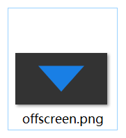

## アンチエイリアシング（Anti-Aliasing）

グラフィックスレンダリングパイプラインを使用して三角形を描画すると、RenderTargetが一定の格納精度を持つため、画像に一定のジャギーが存在する可能性があります。


**アンチエイリアシング（反走样）**の目標は、グラフィックスのエッジのジャギーを柔らかくし、画像を以下のようにすることです。


アンチエイリアシングについて、より詳細なドキュメントがあります。

- ：[アンチエイリアシング- LearnOpenGL CN (learnopengl-cn.github.io)](https://learnopengl-cn.github.io/04%20Advanced%20OpenGL/11%20Anti%20Aliasing/)

大部分のグラフィックスAPIは**マルチサンプルアンチエイリアシング（Multi Ssample Anti-Aliasing）**の特性をサポートしています。

MSAA以外にも、他のアンチエイリアシングアルゴリズムがあります。興味のある方は以下を読むことができます。

- [张亚坤 - 主流抗锯齿方案详解（一）MSAA](https://zhuanlan.zhihu.com/p/415087003)
- [张亚坤 - 主流抗锯齿方案详解（二）TAA](https://zhuanlan.zhihu.com/p/425233743)
- [张亚坤 - 主流抗锯齿方案详解（三）FXAA](https://zhuanlan.zhihu.com/p/431384101)

QRhiでは、以下のように特性がサポートされているかを確認できます。

``` c+=
rhi->isFeatureSupported(QRhi::Feature::MultisampleTexture)
```

スワップチェーンにMSAAをサポートさせたい場合、そのキーコードは以下の通りです。

``` c++
// DSアタッチメントを作成する際に、サンプル数を8に指定
mDSBuffer.reset( mRhi->newRenderBuffer(QRhiRenderBuffer::DepthStencil,QSize(),8,QRhiRenderBuffer::UsedWithSwapChainOnly));
mSwapChain->setDepthStencil(mDSBuffer.get());
mSwapChain->setSampleCount(8);     // リサンプル数を8に設定
mSwapChain->createOrResize();
```

パイプラインを作成する際には、パイプラインのサンプル数とレンダリングターゲットのサンプル数が一致していることを保証する必要があります。

``` c++
mPipeline->setSampleCount(mSwapChain->sampleCount());
```

注意が必要なのは、マルチサンプルを有効にしたTextureは回読できないことです。

MSAATextureを回読したい場合、RenderTargetを作成する際に、サンプル数が1の**ResolveTexture**を指定し、MSAATextureではなくResolveTextureを回読する必要があります。

```c++
QScopedPointer<QRhiTexture> msaaTexture;
QScopedPointer<QRhiTexture> msaaResolveTexture;
QScopedPointer<QRhiTexture> renderTargetTexture;
QScopedPointer<QRhiTextureRenderTarget> renderTarget;
QScopedPointer<QRhiRenderPassDescriptor> renderTargetDesc;

msaaTexture.reset(rhi->newTexture(QRhiTexture::RGBA8, QSize(1280, 720), 8, QRhiTexture::RenderTarget | QRhiTexture::UsedAsTransferSource));
msaaTexture->create();
msaaResolveTexture.reset(rhi->newTexture(QRhiTexture::RGBA8, QSize(1280, 720), 1, QRhiTexture::RenderTarget | QRhiTexture::UsedAsTransferSource));
msaaResolveTexture->create();

QRhiColorAttachment colorAttachment;
colorAttachment.setTexture(msaaTexture.get());						// msaaテクスチャを設定
colorAttachment.setResolveTexture(msaaResolveTexture.get());		// 解析用テクスチャを指定
```

renderTarget.reset(rhi->newTextureRenderTarget({ colorAttachment }));
renderTargetDesc.reset(renderTarget->newCompatibleRenderPassDescriptor());
renderTarget->setRenderPassDescriptor(renderTargetDesc.get());
renderTarget->create();
	
//...

QRhiReadbackDescription rb(msaaResolveTexture.get());		//msaaTextureではなくmsaaResolveTextureをリードバック
resourceUpdates->readBackTexture(rb, &rbResult);
cmdBuffer->endPass(resourceUpdates);
```

[ **チュートリアル例 17-MSAA** ](https://github.com/Italink/ModernGraphicsEngineGuide/blob/main/Source/1-GraphicsAPI/17-MSAA/Source/main.cpp) ：オフスクリーンレンダリングを使用してリサンプリング数が8の三角形を描画し、CPUにリードバックして画像をローカルに保存します。

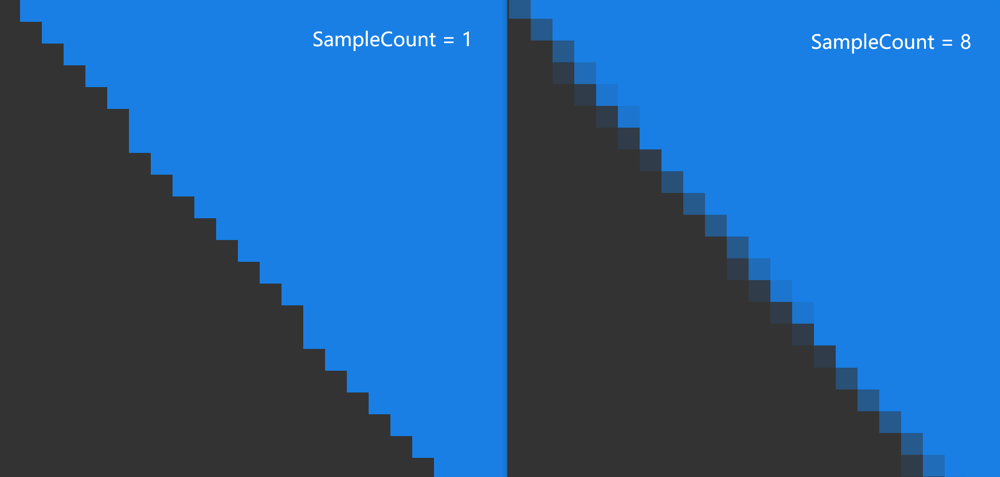