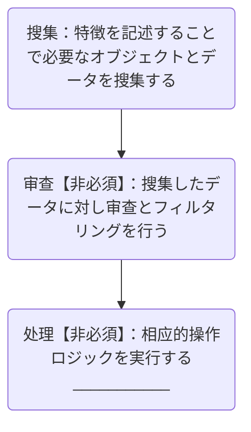

# Unreal Engine 5 開発 — プロシージャルコンテンツ管理

ゲーム体験の核心は常にコンテンツであることは否定できない。これは映画業界と非常に似ているが、ゲームと映画業界の制作プロセスには明らかな違いが存在する。ゲームは優れたインタラクティブフィードバックを備え、プレイヤーが深く関与できるようにするが、計算能力の制限という厳しい条件がダモクレスの剣のように高く掲げられ、ゲーム業界のコンテンツ生産を大きく束縛している。

映画業界はコンテンツ制作時に、ある程度大量の人材、物的資源、時間を投入することで「力大きければレンガでも飛ぶ」モデルを採用できる — 膨大なリソースを投入し、リソースの積み重ねと高強度の制作を通じて高品質なコンテンツを生み出す。

しかしゲーム業界はこれを真似することが難しい。計算能力の制限から、ゲームはコンテンツ要素を無制限に積み重ねることができず、そうした場合ゲームのカクツキ、動作の不安定さなどの問題が発生し、プレイヤー体験に深刻な影響を与える。

そのためゲーム業界でコンテンツ生産を行う前に、エンジニアリングの問題を解決することが特に重要となる。エンジニアリングプロセスを最適化し、技術手段を合理的に運用し、リソース利用効率を向上させることで、限られた計算能力の条件下でもゲームコンテンツの高品質・高効率な生産を実現し、プレイヤーの増え続けるニーズを満たすことができる。

## プロシージャル技術

過去、プロシージャルは主に開発者が注目する概念だったが、近年ゲームの工業化プロセスの加速に伴い、ゲームコンテンツ生産の各环节に静かに浸透し、精密な歯車が巨大な機械に組み込まれるように全体を効率的に運転させている。間違いなくプロシージャルはゲームコンテンツの生産能力を向上させる重要な原動力となり、ゲーム業界の発展に絶え間ない活力を注ぎ込んでいる。

[プロシージャル（Procedural）](https://en.wikipedia.org/wiki/Procedural_generation)アプリケーションの本質は、問題の解決プロセスをデータ資産として保存することで、後続の開発がこれらの操作データに依存して再利用、反復などを行えるようにすることである（概念的には、プログラム内のプログラムに過ぎない）。

ゲーム業界が現在プロシージャルを応用している主な分野は以下の通り：

- [**プロシージャルコンテンツ生成**](https://docs.unrealengine.com/5.2/en-US/procedural-content-generation-overview/)
- [**プロシージャルモデリング**](https://en.wikipedia.org/wiki/Procedural_modeling)
- [**プロシージャルテクスチャ**](https://en.wikipedia.org/wiki/Procedural_texture)
- [**プロシージャルアニメーション**](https://en.wikipedia.org/wiki/Procedural_animation)
- [**プロシージャルオーディオ**](https://en.wikipedia.org/wiki/Synthetic_media)

これらの技術は既に美術資産制作の日常に徐々に浸透しており、その顕著な特徴は**パラメータ調整だけでなくプログラミングによって資産を制作する**ことである。

Unreal Engineには非常に優れたプロシージャルサポートが備わっている：

### Procedural Content Generation


**Procedural Content Generation**はUnreal EngineにおけるPCG（Procedural Content Generation）用のツールセットで、テクニカルアーティスト、デザイナー、プログラマーに対し、資産（建物やバイオーム生成など）から世界全体まで、あらゆる複雑さのコンテンツに対応する迅速かつ反復可能なツールを構築する能力を提供する。

関連参考：

- [Procedural Content Generation Overview | Unreal Engine 5.5 Documentation | Epic Developer Community](https://dev.epicgames.com/documentation/en-us/unreal-engine/procedural-content-generation-overview?application_version=5.5)
- [『UE5 PCG』公式公開レッスン：Electric Dreams環境プロジェクトの詳細研究](https://www.bilibili.com/video/BV1y8411U7Hs)
- [Electric Dreams PCG技術詳解（一）——用語、ツールとグラフの紹介](https://mp.weixin.qq.com/s/mGWiPKvWU_NHTktIWA6LnA)
- [Electric Dreams PCG技術詳解（二）——溝、大型Assembly](https://mp.weixin.qq.com/s/xHdnrFTkywF_7OjqOuALbw)
- [Electric Dreams PCG技術詳解（三）——森林、岩石とシーン背景](https://mp.weixin.qq.com/s/YWcd8l-VphNLrOlg3zkSzA)
- [Electric Dreams PCG技術詳解（四）——遠景、霧、カスタムノード及びサブグラフ](https://mp.weixin.qq.com/s/CWTUcRIBTXw8WvhX3jrcBw)

### Meta Sounds


**Meta Sounds**はユーザー定義、サードパーティ拡張、グラフの再利用をサポートし、エディタ内でサウンドデザインを行える強力なツールを提供する。

関連参考：

- [MetaSounds in Unreal Engine | Unreal Engine 5.5 Documentation | Epic Developer Community](https://dev.epicgames.com/documentation/en-us/unreal-engine/metasounds-in-unreal-engine?application_version=5.5)
- [オーディオプログラミング基礎 - Italink](https://italink.github.io/ModernGraphicsEngineGuide/04-UnrealEngine/7.%E9%9F%B3%E9%A2%91%E5%BC%80%E5%8F%91) 
- [イベント講演 | 初心者向けMetaSoundガイド(公式字幕)](https://www.bilibili.com/video/BV15G4y1A7B5)

### Geometry Script


**Geometry Script**はBlueprintとPythonを使用してメッシュジオメトリを生成・編集するAPIセットを提供する。Editor Utility Widgets内でGeometry ScriptingとAsset Actionsを記述し、カスタムメッシュ分析関数ライブラリ、処理・編集ツールを作成できるほか、Actor Blueprint内でプロシージャルオブジェクトを作成し複雑なジオメトリクエリを実現することも可能。

関連参考：

- [Unreal Engineにおけるジオメトリスクリプティング入門 | Unreal Engine 5.5 ドキュメント | Epic Developer Community](https://dev.epicgames.com/documentation/zh-cn/unreal-engine/introduction-to-geometry-scripting-in-unreal-engine?application_version=5.5)

### Animation Blueprints


スケルタルメッシュをゲーム内でシミュレートまたは制御するためのBlueprint。アニメーションの混合、スケルトンの調整、毎フレーム使用する最終アニメーションポーズ（Pose）を定義するロジックを作成できる。

関連参考：

- [Animation Blueprints in Unreal Engine | Unreal Engine 5.5 Documentation | Epic Developer Community](https://dev.epicgames.com/documentation/en-us/unreal-engine/animation-blueprints-in-unreal-engine?application_version=5.5)

### Material Blueprint


シーンオブジェクトの表面属性を定義するためのBlueprint。様々な画像（テクスチャ）、ノードベースのマテリアル式、マテリアル自体の固有属性を使用して、シーンオブジェクトの最終的な表面属性を定義できる。

関連参考：

- [Unreal Engine Materials | Unreal Engine 5.5 Documentation | Epic Developer Community](https://dev.epicgames.com/documentation/en-us/unreal-engine/unreal-engine-materials?application_version=5.5)

### Texture Graph


**Texture Graph**はアーティストに対し、外部の画像編集パッケージを使用せずにUnreal Engine内で直接テクスチャ資産を作成または編集できるインターフェースを提供する。Material Editorに似た馴染みのあるノードグラフを利用し、一連のノードを出力テクスチャに接続できる。

Texture GraphをBlueprint、マテリアル、マテリアル関数と組み合わせることで、Unreal Engine内でのみ実現可能な独特のワークフローを獲得できる。

Texture Graphを使用すると多くの興味深いアプリケーションが可能で、筆者は最近以下の用途で使用している：

- **画像編集**：開発者にとって、エディタ操作に比べコードを記述する自由度ははるかに高い。

    

- **UI素材制作**：Unreal EngineのUIシステムは複雑なインターフェースエフェクト（エッジブラー、ドロップシャドウ、ニューモルフィズムなど）をサポートしていない。これはUIが全体のグラフィックコンテンツの一部に過ぎず、予算が少ないためであり、これらの特性を使用するには複雑なレンダリング構造が必要となる。しかしTexture Graphを利用することで、これらの効果に必要な素材画像を生成でき、簡単なエディタ拡張と組み合わせることで、このプロセスは非常にスムーズになる。
- **スタイル化参考生成**：Texture GraphにAI呼び出しノードを拡張することで、Unreal Engine原生のグラフィックコンテンツがAIを借りて容易にスタイル化参考を実現できる。例えば筆者は以下の用途で使用した：
    - プロジェクトコンテンツのためにエンジン起動時のスプラッシュ画像とサムネイルを生成
    - Scene Captureと組み合わせて動的にシーンのスタイル化ミニマップを生成
    - 特定のシーンのスタイル化ロードページを生成
    - ...

関連参考：

- [Getting Started with Texture Graph | Epic Developer Community](https://dev.epicgames.com/community/learning/tutorials/z0VJ/unreal-engine-getting-started-with-texture-graph)
- [[中国語ライブ]第51回 | UE5.4新機能のTextureGraph | 朱昌盛（天之川）](https://www.bilibili.com/video/BV1As421M7Bj/)
- [UE5.4テクスチャグラフ入門 CG世界](https://m.163.com/dy/article/J56TPVL50516BJGJ.html)
- [UE5.4新機能 - Texture Graph入門紹介 | CSDN | 電子雲と長距離もつれ](https://blog.csdn.net/grayrail/article/details/140191905)
- [UE5.4TextureGraph | GALAXIXアニメ大陸](https://www.bilibili.com/video/BV1FM4m1o7LE)

## プロシージャルコンテンツ管理

上記のプロシージャル技術の応用により、我々はかつてない創作効率を獲得した。過去と比較し、現在はより短い時間、より低い予算でより豊富なゲームコンテンツを生み出すことができる。これは開発効率を大幅に向上させるだけでなく、ゲームコンテンツの境界を広げ、プレイヤーにより多様な体験を提供する。

しかし何事にも両面性がある。より多くのコンテンツ生産は、管理コストの指数関数的な増加を意味する。資産管理、バージョン管理、テストと更新反復まで、各环节により多くの人材、物的資源、時間コストを投入する必要があり、膨大なコンテンツ体系が秩序正しく運行し、混乱やエラーが発生しないことを確保する。

筆者は以前シーン構築時にPCG技術の使用を非常に推奨していた。なぜなら生成パイプラインを統合することで、反復と最適化がより容易になるからである。

しかし実際には、現在業界におけるPCGの応用は依然として理想化されており、真に実践できる応用シーンは多くない。

その主な原因はPCGが「現実に接地していない」ことにある。現在大多数のゲーム制作チームにおけるシーンデザインの職務責任划分は一般的に以下の通り：

- **ゲームプランナー**：ゲームシーンの全体的なフレームワークを計画し、シーンの機能、ストーリー背景、スタイル定位、プレイヤーのシーン内体験フローなどを担当し、シーンデザインに明確な方向とニーズドキュメントを提供する。
- **コンセプトデザイナー**：プランナーのニーズに基づきシーンのコンセプトデザインを行い、手描きまたはデジタルペインティングなどの方式で、シーンの全体的なスタイル、雰囲気、主要建築と地形の概略形態などのコンセプトスケッチを描き、後続の詳細デザインに視覚的参考を提供する。
- **シーン原画デザイナー**：コンセプトデザインの基礎上で、シーン内の具体的な要素に対し詳細な原画デザインを行い、建築の構造、装飾細部、地形の起伏変化、植生と道具のスタイルなどを含み、正確な絵画形式で各要素の造型、色彩、マテリアルなどの細部を呈示し、モデラーに正確な制作青写真を提供する。
- **3Dモデラー**：3Dモデリングソフトウェアを使用し、シーン原画に基づきデザインされたシーン要素を3Dモデルに構築し、建築、地形、道具などの基礎フレームを構築し、体積と空間感を与え、初步的なUV分割を行い、後続のテクスチャ描画の準備をする。
- **マテリアルライトアーティスト**：3Dモデルにマテリアルとテクスチャを追加し、物体のリアルな質感（木材のテクスチャ、金属の光沢、石の粗さなど）を模擬する。同時にシーン内のライト効果を設定し、異なる雰囲気と光影効果を作り出し、シーンのリアリティと視覚的インパクトを強化する。
- **シーンサウンドデザイナー**：シーンのために適切なサウンドエフェクトを創作、選択、追加することを担当し、シーンのテーマ、感情、雰囲気などに基づきサウンドデザインを行い、採集、編集、ミキシングなどの操作を通じて、サウンドエフェクトをシーンと完璧に融合させ、シーンの没入感を強化する。
- **エフェクトアーティスト**：シーンのニーズに基づき、炎、煙、水流、魔法効果などの各種エフェクトをデザイン・制作し、シーンに生き生きとした趣味性を加え、プレイヤーの没入感を向上させる。
- **レベルデザイナー**：主にシーンのレイアウトと計画を担当し、ゲームプレイとプランナーの要求に基づき、モンスター、道具、クエストポイント、障害物などの要素をシーン内に合理的に配置し、プレイヤーの進行ルートとレベル難易度曲線をデザインし、プレイヤーがシーン内で良好なゲーム体験を得られるように確保する。
- **シーン最適化アーティスト**：制作完了したシーンに対し性能最適化を行い、モデル面数の削減、テクスチャの圧縮、ライトベイクの合理的設定などの手段を通じて、シーンのハードウェアリソース占有を低減し、ゲームの動作効率を向上させ、異なるデバイスでもスムーズに動作することを保証する。

シーンデザインの過程では、通常上記の職種間で密接なコミュニケーションと頻繁な反復が必要で、最終的な納品を完了できる。

PCGを使用する理由は、ゲームチームがコンテンツ原料（モデル、マテリアル、エフェクト、サウンドエフェクト...）の生産能力を大幅に向上させた後、同様に効率的な手段でシーン構築を完了し、性能最適化の問題を両立させる必要があるからである。

しかしPCGパイプラインデザインの複雑さから、多人協働は非常に困難である。具体的なプロジェクト内では、高いレベルのTAがPCGのロジックを記述する必要があり、「そのTA」は美術制作プロセスを精通し、原材料の規範性を監督し、同時にゲームプランナーのニーズに応え、変更に迅速に対応し、エンジン基盤を理解し、性能最適化戦略を制定する必要がある。


[関連情報](https://forum.quartertothree.com/t/the-matrix-awakens-an-unreal-engine-5-experience/154271/67)によると、Unreal Engineの《マトリックス：覚醒》サンプルの開発過程では、約`20-30`人が資産処理を担当し、チーム全体で`50-70`名のスタッフが在籍していた。これは間違いなく偉業である。

このサンプルではPCGが示す巨大な潜在力を見ることができる：「容易に」これほど壮大な都市を構築した。

PCGの実践が困難な原因は、多くのチームがEpicのようなチームクオリティを持つことが難しいことに直接帰結できる。

次に、PCGの目標は持続的に反復可能な生産パイプラインを归纳・总结することにあるが、ゲーム製品にとってプレイヤーを引きつけるのは永遠にコンテンツとクリエイティビティであり、それらは必然的に空飛ぶ馬のように自由である。

具体的なプロジェクトチーム内では、PCGは複数の職種の責任を集中させることができる。これには利点があり、迅速に反復に応えられるが、欠点もあり、各方面の人員のクリエイティビティ発揮を制限し、コンテンツクオリティと生産能力に影響を与える。

PCGと異なり、プロシージャルコンテンツ管理は一種の後処理に似ている：

- プロシージャルな手段でコンテンツ組織を収束させることを目的とする。

因此、本文は那些高深莫测的前沿技术を紹介することに着眼せず、現在のゲームコンテンツ生産過程に焦点を当て、一連の一般的なプ</think_never_used_51bce0c785ca2f68081bfa7d91973934>手段を整理・整合してUnreal Engine内の**オブジェクト（Object）**、**資産（Asset）**、**世界（World）**を管理する。

プロシージャルな手段でコンテンツを管理する理由は、簡単に言えば：

- 明らかに「直感的」な操作であっても、エディタレベルでは実現が難しい場合がある。

このジレンマは短い対話で説明できる：

>A：象を知っていますか？
>
>B：もちろん知っています。
>
>A：私は象の姿が非常に好奇です、描いてくれませんか？
>
>B：申し訳ありません、私は絵が描けないのでできません~

プロシージャルの目的は、具体的な目標を直接処理するのではなく、特徴を記述することで行いたいことを表現し、操作の入力と過程に一定の弾力性を持たせることである。以下のような回答を与えることに相当する：

> B：申し訳ありません、象を描くことはできませんが、象は非常に大きく、灰色の体、四本の脚は太くて丈夫、団扇のような大きな耳、長い鼻で物を巻き上げられ、二本の尖った長い歯があることを教えられます。後で見かけたらきっと一眼で認識できるでしょう~

ゲームプロジェクトにとって、一部のコンテンツ制作関連の重厚なエディタは通常、専門の人員が開発・委託する必要がある。しかしそれ以外にも、ゲームコンテンツ制作の過程には大量の細かい**マイクロニーズ**が存在する。これらのニーズのために専門の人員をエディタツール開発に配置する必要はないが、エディタツールの補助がなければこれらのタスクは完了が難しい。例えば：

- 座標領域`[X0,Y0  -  X1,Y1]`に基づき、該領域内のすべてのActorを選択し、サブレベルとしてエクスポートしてローカルテストを行う
- シーン内でシャドウを有効にしているすべての光源をフィルタリングし、そのシャドウの合理性を検査する
- すべてのメッシュコンポーネントを概観し、バウンディングボックスのサイズとその他の特徴に基づき、コンポーネントに一定の光影とカリングのLOD戦略を一括で付与する
- すべてのシーンエフェクトのバウンディングボックスサイズを概観し、エフェクトバウンディングボックスに異常項目が存在するか検索する
- 特定のコンポーネントの属性（位置変換、光影スイッチ、物理戦略、レンダリング属性など）を一括で調整する
- 資産の特定の属性のスイッチを一括で変更する
- 特定の特徴を持つActorを一括でフィルタリングし、ハイライト表示する
- シーン内のすべての静的モデル`SM_BigTree0001`を収集し、落葉が舞うパーティクルエフェクトコンポーネントと木の葉が擦れるサウンドエフェクトコンポーネントを追加で提供するカプセル化されたBlueprint`BP_BigTree0001`に一括で置き換える
- 特定の領域に一括でレイを送信してシーンをサンプリングし、レイ検出で得られたシーンデータを保存してエフェクト制作に使用する
- シーン内のすべての`StaticMeshActor`の`StaticMeshComponent`の`Disallow Nanite`属性を一括でプレビュー、ソート、検索、編集する
- 特定の領域の静的メッシュを自動的に階層インスタンス化静的メッシュコンポーネントにマージする
- ...

これらのニーズは通常、マップ編集、シーン管理、資産管理、性能最適化の過程で高頻度に出現する。体量の小さいゲームプロジェクトでは、コンテンツが段階的に累積されるため、通常「だめなら削除する」心構えで問題は大きくならないが、大型のゲームプロジェクトではコンテンツ間の関係が錯綜しており、PCG技術で一部の圧力を緩和できるものの、これらのマイクロニーズをタイムリーかつ適切に解決しなければ、コンテンツ管理も非常に制御不能になりやすい：


- ウィッチャー3 - オープンワールドのコンテンツ最適化パイプライン：https://www.youtube.com/watch?v=p8CMYD_5gE8

## プロシージャルコンテンツ処理プラグイン

Unreal Engineは間違いなく現在最も強力で汎用的なゲームエンジンであり、これは優れたコア構造設計に大きく依存している。Unreal Engine内のコンテンツを効率的にプロシージャル管理することを目標とする場合、その体系構造を深く理解することは特に必要で重要な意義を持つ。

この部分の内容を展開すると大量のスペースを占用するため、筆者は以前の基礎体系の[ドキュメント](https://zhuanlan.zhihu.com/p/636151878)を現在の関心点に基づき一部更新した。より多くの詳細に興味がある場合は、ネット上に多くの優れた剖析記事が存在する：

- コアアーキテクチャ：[InsideUE - 大钊](https://zhuanlan.zhihu.com/p/22813908)
- レンダリング体系：[博客园 - 向往 | Unreal Engineレンダリング体系の剖析 ](https://www.cnblogs.com/timlly/p/13512787.html)
- 資産管理：[知乎 - UE4の資源管理](https://zhuanlan.zhihu.com/p/357904199)

此外、適切なプロジェクト規範がなければ、神様が来ても首を縦に振るしかないことを提醒する：

- Unreal Engine規範ガイド：https://github.com/thejinchao/ue5-style-guide

プロシージャルコンテンツ処理は通常、三つの基本ステップにまとめられる：



上記のフローに対し、筆者はこれらのステップを完了するための簡単なエディタフレームワーク（**ProceduralContentProcessor**）を構築した。これはツールボックスとして、統一構造のエディタツールを容易に派生・拡張できる。プラグインのGithubリポジトリは以下の通り：

- https://github.com/Italink/ProceduralContentProcessor

後文はこのプラグインに基づき、各段階の具体的な処理ステップを説明する。

プラグインをプロジェクトの`Plugins`ディレクトリに配置した後、レベルエディタのエディタモードで`程序化内容处理器模式`を見つけることができる：


**Procedural Content Processor**は三つの使用可能なBlueprint資産を提供し、Blueprintを派生させて自身のエディタモードを拡張できる：

- **程序化资产处理器（ProceduralAssetProcessor）**：**資産（Asset）**操作関連のエディタツールを記述するために使用
- **程序化关卡处理器（ProceduralWorldProcessor）**：**レベル（World）**処理関連のエディタツールを記述するために使用
- **程序化Actor着色器（ProceduralActorColorationProcessor）**：Actorデバッグ着色戦略を記述するために使用


### 基本用法

**Procedural Content Processor**自体は複雑なメカニズムを提供していない。大部分はエンジンの原生機能に依存している。

一つの重要な点は：

- **CallInEditor（エディタ内で呼び出し）**がチェックされたBlueprint関数（または`UFUNCTION`中に`CallInEditor`識別子を持つC++関数）は、オブジェクトの詳細パネルに対応するボタンを生成し、該ボタンをクリックすると対応する関数ロジックが実行される：


これを契機として、大量のエディタツールを容易に記述できる。

程序化内容处理器のBlueprint`クラス設定`内の一部のオプションはエディタ大綱の表示に影響する：

- **Sort Priority**：ソート優先度、エディタ大綱中のドロップダウンボックスのソートに影響する。
- **Document Hyperlink**：該处理器のドキュメントリンク、エディタ大綱上の【? ボタン】をクリックすると対応するURLが開かれる。
- **Override UMGClass**：デフォルトの詳細パネルの代わりにUMGコントロールを使用、一般的にエディタのUIをカスタマイズするために使用。
- **Blueprint表示名称**：該处理器がエディタ大綱中に実際に表示される名称。
- **Blueprint描述**：該处理器がエディタ大綱中に表示される提示情報。
- **Blueprint命名空間**：該处理器がエディタ大綱中の分類、多級分類は`.`で区切る。


Blueprint属性中の一部の設定は詳細パネルに影響する：

- **可编辑实例**：可编辑实例がチェックされた属性のみ、オブジェクトの詳細パネルで編集でき、そうでない場合はBlueprintエディタ中でデフォルト値を変更する必要がある。
- **只读Blueprint**：チェックすると、該属性は編集不可になるがプレビュー可能。
- **配置变量**：チェックすると、該属性の値は配置ファイルに保存され、次回处理器を起動する時に前回の配置が読み込まれる。


> エディタ制作過程中、一部の属性标识とメタデータは非常に有用であるが、Blueprintエディタに公開されていない。ここで一つのプラグインを推奨する：https://github.com/DoubleDeez/MDMetaDataEditor

程序化内容处理器は四つのオーバーライド可能な基本イベント関数を持つ：

- `void Activate()`：处理器がアクティブになった時に呼び出される。
- `void Tick(DeltaTime)`：处理器がアクティブになった後、毎フレーム呼び出される。
- `void Deactivate()`：处理器が終了した時に呼び出される。
- `void PostEditChangeProperty(PropertyName)`：处理器属性が変更された時に呼び出される。


C++については、以下の関数をオーバーライドしてエディタを深度カスタマイズできる：

- `virtual TSharedPtr<SWidget> BuildWidget()`

UEの詳細パネルは非常に強力で、**属性 + 関数**の方式だけで簡単かつ使いやすいエディタを迅速に構築できる：


### 搜集

#### レベル

**程序化关卡处理器（ProceduralWorldProcessor）**については、エディタ関数中で`GetAll...()`関数を呼び出してActorsを搜集できる：


#### 資産

**程序化资产处理器（ProceduralAssetProcessor）**については、エディタ関数中で`GetAllAssetRegistry()`関数を呼び出して資産レジストリを取得し、資産を操作できる：


### 审查

#### Actor着色

プラグインにはさらに一つの資産タイプ — **程序化Actor着色器（ProceduralActorColorationProcessor）**が提供されている。

これは**ProceduralWorldProcessor**に比べ、`FLinearColor Colour(const UPrimitiveComponent* PrimitiveComponent)`というイベント関数が追加されており、これをオーバーライドすることで現在のシーン中のすべてのプリミティブコンポーネントに対しデバッグ着色を行える：

> エンジンバージョン>=5.4が必要


#### オブジェクト属性マトリックス

Unreal Engine中では、公式に**属性マトリックス**機能が提供されており、資産の特定の属性を一括で変更できる：


**Procedural Content Processor**はこれを基礎とし、プロシージャルな方式で任意のオブジェクト（UObject）の属性編集マトリックスを構築することをサポートする。

Blueprint中に**Procedural Object Matrix**タイプのメンバー変数を追加するだけでよい：


エディタ関数中で以下のインターフェースを呼び出すことでオブジェクト属性マトリックスを構築でき、オブジェクトの詳細パネルに表示される：

- `void ClearObjectMaterix()`：オブジェクトマトリックスをクリアする
- `void AddTextField(Owner, FieldName, FieldValue)`：簡単なプレビューテキストを追加、`{Owner}`行、`{FieldName}`列が`{FieldValue}`で填充されることを意味する
- `void AddPropertyField(Owner，PropertyName)`：属性エディタを追加、`{Owner}`行、`{PropertyName}`列が【OwnerオブジェクトのPropertyName属性】のエディタで填充されることを意味する
- `void AddPropertyFieldBySecondaryObject(Owner，SecondaryObject，SecondaryObjectPropertyName)`：属性エディタを追加、`{Owner}`行、`{SecondaryObjectPropertyName}`列が【SecondaryObjectオブジェクトのSecondaryObjectPropertyName属性】のエディタで填充されることを意味する


これはエンジン中の使用例である：


#### オブジェクト詳細ビュー

Unreal Engineの詳細パネルは任意のUObjectの属性を容易に編集できる：


しかし通常はオブジェクトを明確に選択する必要がある。プラグインには任意のオブジェクトの属性パネルを表示するためのBlueprint関数が提供されている：

- `void ShowObjectDetailsView(UObject* InObject)`

これにより、UI、ランタイムサブオブジェクト、一時オブジェクトなどの一部のオブジェクトの属性を容易に調整できる：


#### オブジェクトエディタ

以下のBlueprint関数を使用して対応するオブジェクトのエディタを開くことができる：

- `void ShowObjectEditor(UObject* InObject)`

### 处理

データの処理については、実際の業務ニーズに結びつけて具体的に実現する必要がある。現在まで**UProceduralContentProcessorLibrary**には以下のインターフェースが含まれており、必要に応じて自行追加できる：

#### オブジェクト操作

```C++
static TArray<UObject*> GetAllObjectsOfClass(UClass* Class, bool bIncludeDerivedClasses = true);

static TArray<UObject*> GetAllObjectsWithOuter(UObject* Outer, bool bIncludeNestedObjects = true);

static TArray<UClass*> GetAllDerivedClasses(const UClass* ClassToLookFor, bool bRecursive);

static UObject* DuplicateObject(UObject* SourceObject, UObject* Outer);

static int32 DeleteObjects(const TArray< UObject* >& ObjectsToDelete, bool bShowConfirmation = true, bool bAllowCancelDuringDelete = true);

static int32 DeleteObjectsUnchecked(const TArray< UObject* >& ObjectsToDelete);

static void ConsolidateObjects(UObject* ObjectToConsolidateTo, UPARAM(ref) TArray<UObject*>& ObjectsToConsolidate, bool bShowDeleteConfirmation = true);

static TSet<UObject*> GetAssetReferences(UObject* Object, const TArray<UClass*>& IgnoreClasses, bool bIncludeDefaultRefs = false);

static bool IsGeneratedByBlueprint(UObject* InObject);

static void ShowObjectDetailsView(UObject* InObject);

static void ShowObjectEditor(UObject* InObject);

static UObject* CopyProperties(UObject* SourceObject, UObject* TargetObject);

static void ForceReplaceReferences(UObject* SourceObjects, UObject* TargetObject);

static void SetObjectPropertyByName(UObject* Object, FName PropertyName, const int& Value);
DECLARE_FUNCTION(execSetObjectPropertyByName);
```

#### 資産操作


```C++
static bool ObjectIsAsset(const UObject* InObject);

static UBlueprint* GetBlueprint(UObject* InObject);

static bool IsNaniteEnable(UStaticMesh* InMesh);

static void SetNaniteMeshEnabled(UStaticMesh* InMesh, bool bEnabled);

static bool IsMaterialHasTimeNode(AStaticMeshActor* InActor);

static bool MatchString(FString InString,const TArray<FString>& IncludeList, const TArray<FString>& ExcludeList);

static float GetStaticMeshDiskSize(UStaticMesh* StaticMesh, bool bWithTexture = true);

static UStaticMesh* GetComplexCollisionMesh(UStaticMesh* InMesh);

static void SetStaticMeshPivot(UStaticMesh* InStaticMesh, EStaticMeshPivotType PivotType);

static UStaticMeshEditorSubsystem* GetStaticMeshEditorSubsystem();

static float GetLodScreenSize(UStaticMesh* InStaticMesh, int32 LODIndex);

static float GetLodDistance(UStaticMesh* InStaticMesh, int32 LODIndex);

static float CalcLodDistance(float ObjectSphereRadius, float ScreenSize);

static float CalcScreenSize(float ObjectSphereRadius, float Distance);

static float CalcObjectSphereRadius(float ScreenSize, float Distance);

static UTexture2D* ConstructTexture2D(UTextureRenderTarget2D* TextureRenderTarget2D, UObject* Outer, FString Name, TextureCompressionSettings CompressionSettings = TC_Default);

static UTexture2D* ConstructTexture2DByRegion(UTextureRenderTarget2D* TextureRenderTarget2D, FBox2D Region , UObject* Outer, FString Name, TextureCompressionSettings CompressionSettings = TC_Default);

static void UpdateTexture2D(UTextureRenderTarget2D* TextureRenderTarget2D, UTexture2D* Texture);

static FNiagaraSystemInfo GetNiagaraSystemInformation(UNiagaraSystem * InNaigaraSystem);

static FVector2D ProjectWorldToScreen(const FVector& InWorldPos, bool bClampToScreenRectangle);

static bool DeprojectScreenToWorld(const FVector2D& InScreenPos, FVector& OutWorldOrigin, FVector& OutWorldDirection);

static UPhysicalMaterial* GetSimplePhysicalMaterial(UPrimitiveComponent* Component);
```

#### Actor操作

```C++
static TArray<AActor*> BreakISM(AActor* InISMActor, bool bDestorySourceActor = true);

static AActor* MergeISM(TArray<AActor*> InSourceActors, TSubclassOf<UInstancedStaticMeshComponent> InISMClass, bool bDestorySourceActor = true);

static void SetHLODLayer(AActor* InActor, UHLODLayer *InHLODLayer);

static void SelectActor(AActor* InActor);

static void LookAtActor(AActor* InActor);

static AActor* SpawnTransientActor(UObject* WorldContextObject, TSubclassOf<AActor> Class, FTransform Transform);

static AActor* ReplaceActor(AActor* InSrc, TSubclassOf<AActor> InDst, bool bNoteSelectionChange = false);

static void ReplaceActors(TMap<AActor*, TSubclassOf<AActor>> ActorMap, bool bNoteSelectionChange);

static void ActorSetIsSpatiallyLoaded(AActor* Actor, bool bIsSpatiallyLoaded);

static bool ActorAddDataLayer(AActor* Actor, UDataLayerAsset* DataLayerAsset);

static bool ActorRemoveDataLayer(AActor* Actor, UDataLayerAsset* DataLayerAsset);

static bool ActorContainsDataLayer(AActor* Actor, UDataLayerAsset* DataLayerAsset);

static FName ActorGetRuntimeGrid(AActor* Actor);

static void ActorSetRuntimeGrid(AActor* Actor, FName GridName);
```

#### エディタインターフェース

``` c++
static void BeginTransaction(FText Text);

static void ModifyObject(UObject* Object);

static void EndTransaction();

static UUserWidget* AddDialog(UObject* Outer, TSubclassOf<UUserWidget> WidgetClass, FText WindowTitle = INVTEXT("Dialog"), FVector2D DialogSize = FVector2D(400, 300), bool IsModalWindow = true);

static EMsgBoxReturnType AddMessageBox(EMsgBoxType Type, FText Msg);

static UUserWidget* AddContextMenu(UUserWidget* ParentWidget, TSubclassOf<UUserWidget> WidgetClass, FVector2D SummonLocation = FVector2D::ZeroVector);

static void DismissAllMenus();

static void AddNotification(FText Notification, float FadeInDuration = 2, float ExpireDuration = 2, float FadeOutDuration = 2);

static void AddNotificationWithButton(FText Notification, UObject* Object, TArray<FName> FunctionNames);

static void PushSlowTask(FText TaskName, float AmountOfWork);

static void EnterSlowTaskProgressFrame(float ExpectedWorkThisFrame = 1.f, const FText& Text = FText());

static void PopSlowTask();

static void ClearAllSlowTask();
```

### 示例

目前プラグインには以下の簡単な示例参考が提供されている：


**Function Test**：インターフェーステスト

- ISM Merge and Break：ISM拆解合并インターフェースをテスト
- Actor Replace：Actor替换インターフェースをテスト

**Custom Debug View**：後処理デバッグビュー、シーン中の傾斜が特定の値より大きい区域を表示するために使用：


**CustomUMG**：エディタパネルのカスタマイズ方法を演示、通知、ポップアップ、ダイアログ、進捗バー、オブジェクト詳細パネル、オブジェクトエディタを表示：


**CustomObjectMatrix**：オブジェクト属性エディタの用法を演示：


**CustomActorColoration**：Actor着色の用法を演示

