プラグインはエンジンとプロジェクトコードの外部に存在し、UEにおいてプログラム機能を拡張する主な方法です。

プラグインは本質的にモジュール化されたコード設計であり、この設計に従うことでコード間の依存関係を減らし、後のイテレーションと保守を容易にします。

UEにおけるプラグインの標準的なファイル構造は以下の通りです。

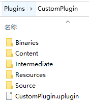

-   `Binaries`：コンパイルされた生成ファイルを格納
-   `Content`：プラグインのアセットコンテンツを格納
-   `Intermediate`：コンパイル過程で生成された中間ファイルを格納
-   `Resources`：プラグインのリソースファイル（アイコンなど、UEアセット以外）を格納
-   `Source`：コードソースファイルを格納し、複数のModuleを含むことが可能

-   `*.uplugin`：プラグインの構造組織ファイル

其中 `*.uplugin` の基本的な内容は以下の通りです。

``` c++
{
	"FileVersion": 3,				//ファイルバージョン
	"Version": 1,					//バージョン番号
	"VersionName": "1.0",			//バージョン名
	"FriendlyName": "CustomPlugin",	//別名
	"Description": "",				//説明
	"Category": "Other",			//カテゴリ
    "CreatedBy": "",				//作成者
	"CreatedByURL": "",				//作成者リンク
	"DocsURL": "",					//ドキュメントリンク
	"MarketplaceURL": "",			//マーケットプレイスリンク
	"SupportURL": "",				//サポートリンク
	"CanContainContent": false,		//コンテンツディレクトリを含むかどうか
	"IsBetaVersion": false,			//ベータ版かどうか
	"IsExperimentalVersion": false,	//実験的バージョンかどうか
	"Installed": false,				//埋め込まれているかどうか
	"Modules": [					//モジュール定義
		{
			"Name": "CustomPlugin",		//モジュール名
			"Type": "Editor",			//モジュールタイプ
			"LoadingPhase": "Default"	//ロードタイミング
		}
        //,								//その他のモジュール
        //{
        //	...    
        //}
	]
}
```

これらのパラメータの設定については、詳細は以下を参照してください。

-   https://docs.unrealengine.com/5.2/en-US/unreal-engine-modules

UEにおいてプラグインを開発する際の一般的なワークフローは以下の通りです。

-   `編集` - `プラグイン` をクリックして、プラグインパネルを開く

    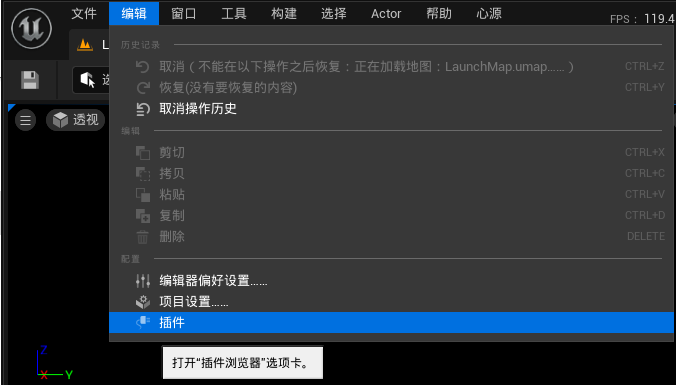

-   新しいプラグインを追加する

    

-   空白のプラグインを作成する

    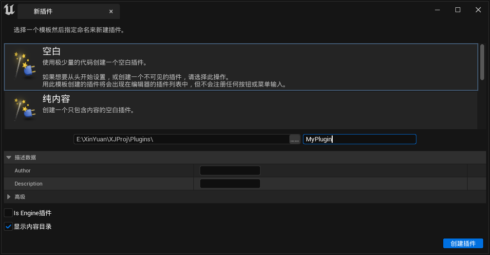

-   プロジェクト構造が変更されたため、この時点でIDEのプロジェクトファイルを再生成する必要があります

>   空白のプラグインは良いスタートポイントです。他のプラグインは単に付随的なコードテンプレートが追加されているだけです。もしそれらに慣れていない場合は、追加してみて内部のコードが具体的にどのような内容を追加しているかを確認し、その作用を理解した上で空白のプラグインに追加すれば良いです。

以下はC++プラグインに必須のファイルです。

``` c++
// MyPlugin.h

#pragma once

#include "CoreMinimal.h"
#include "Modules/ModuleManager.h"

class FMyPluginModule : public IModuleInterface
{
public:

	/** IModuleInterfaceの実装 */
	virtual void StartupModule() override;
	virtual void ShutdownModule() override;
};
```

``` c++
// MyPlugin.cpp

#include "MyPlugin.h"

#define LOCTEXT_NAMESPACE "FMyPluginModule"

void FMyPluginModule::StartupModule()
{
	// このコードはモジュールがメモリにロードされた後に実行されます。正確なタイミングは.upluginファイルでモジュールごとに指定されています。
}

void FMyPluginModule::ShutdownModule()
{
	// この関数はシャットダウン時にモジュールをクリーンアップするために呼び出される場合があります。動的リロードをサポートするモジュールの場合、モジュールをアンロードする前にこの関数が呼び出されます。
}

#undef LOCTEXT_NAMESPACE
	
IMPLEMENT_MODULE(FMyPluginModule, MyPlugin)		//プラグインエントリーを定義
```

UEはプラグインをロードする際に`StartupModule()`を呼び出し、プラグインをアンロードする際に`ShutdownModule()`を呼び出します。

プラグイン開発のコードフローは主に以下の通りです。

-   `StartupModule()`では、**コアモジュールの関数インターフェース**を呼び出すか、**コアモジュールのグローバルシングルトン**を使用して何らかの操作を行うか、あるいは何らかのロジックを**コアモジュールのエントリーポイント**にマウントして拡張を行います。
-   `ShutdownModule()`では、`StartupModule()`で行った操作をクリーンアップします。

ここで一般的ないくつかの関数モジュールは以下の通りです。

-   **FFileHelper** ：ファイル操作
-   **FPlatformProcess** ：プラットフォーム関連の操作
-   **FBlueprintEditorUtils** ：Blueprint操作
-   **FKismetEditorUtilities** ：エディタ操作
-   **FEdGraphUtilities** ：グラフ操作
-   **FComponentEditorUtils** ：コンポーネントエディタ操作
-   **FEnumEditorUtils** ：列挙操作
-   **FStructureEditorUtils** ：構造体操作
-   **FEditorFolderUtils** ：エディタフォルダ操作
-   **FMaterialEditorUtilities** ：マテリアル操作
-   **FPluginUtils** ：プラグイン操作
-   **UGameplayStatics** ：Gameplay関連操作
-   ...

グローバルシングルトンは以下の通りです。

-   `GEngine`、`GEditor`、`GWorld`：エンジン内でよく使用されるグローバルシングルトン
-   `FModuleManager::LoadModuleChecked<FAssetToolsModule>("AssetTools").Get()`：アセットの作成、削除、名前変更、インポート/エクスポート...
-   `FModuleManager::LoadModuleChecked<FAssetRegistryModule>(TEXT("AssetRegistry")).Get()`：アセットの検索、列挙...
-   `FModuleManager::LoadModuleChecked<ISettingsModule>("Settings")`：設定ファイルの関連管理
-   `FModuleManager::LoadModuleChecked<FPropertyEditorModule>("PropertyEditor")`：プロパティエディタの関連操作
-   `FModuleManager::LoadModuleChecked<FLevelEditorModule>(TEXT("LevelEditor"))`：レベルエディタの関連操作
-   `FModuleManager::LoadModuleChecked<FBlueprintEditorModule>("Kismet")`：Blueprintエディタの関連操作
-   ...

コアモジュールのエントリーポイントとは一般的に以下を指します。

-   **Callback 関数コールバック**
-   **Delegate デリゲート**

一般的なデリゲート定義の集合は以下の通りです。

-   **FCoreUObjectDelegates** ：UObject関連のデリゲート
-   **FCoreDelegates** ：コアモジュールの関連デリゲート
-   **FEditorDelegates** ：エディタモジュールの関連デリゲート
-   **FWorldDelegates** ：ゲームワールド関連のデリゲート
-   **FGameDelegates**
-   ...

プラグインのコードを記述してコンパイルを実行すると、プラグインの`Binaries`ディレクトリに以下のファイルが生成されます。

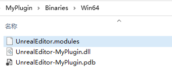

-   `*.module`：モジュールライブラリの基本情報を定義
-   `*.dll`：動的ライブラリ
-   `*.pdb`：プログラムデバッグデータベースで、ソースコードによるライブラリのブレークポイントデバッグに使用されます。詳細は[こちら](https://learn.microsoft.com/en-us/visualstudio/debugger/specify-symbol-dot-pdb-and-source-files-in-the-visual-studio-debugger)を参照してください。

其中`*.module`のファイル内容は以下の通りです。

``` c++
{
	"BuildId": "a36b278a-b317-44c3-8743-b82361b74343",
	"Modules": 
	{
		"MyPlugin": "UnrealEditor-MyPlugin.dll"
	}
}
```

ここで注意が必要なパラメータは`BuildID`です。これはエンジンによって生成され、プラグインの`BuildID`とエンジンの`BuildID`が一致しない場合、エディタでプロジェクトを起動するとエラーが発生します。

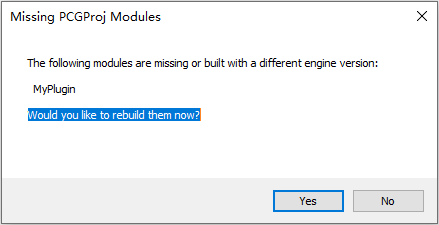

エンジンの`BuildID`は以下の方法で確認できます。

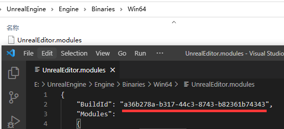

## 基礎

## メニューバー・ツールバーの拡張

エンジン開発の過程では、エンジンエディタのメニューバーやツールバーを拡張し、ボタンを追加して便利な操作を実行するニーズがよくあります。例えば以下のように。

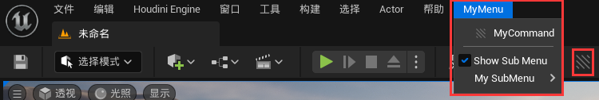

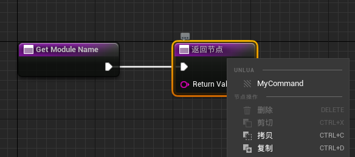

UE4ではメニューを拡張する主な方法は**FExtender**を通じて行われましたが、UE5ではより使いやすい新しい方法**UToolMenus**が導入されました。

**UToolMenus**はシングルトンクラスで、以下のコードでシングルトンインスタンスを取得できます。

``` c++
UToolMenus* ToolMenus = UToolMenus::Get();
```

UE5では、すべての拡張可能なメニューバー・ツールバーは`初期化時`に関数`UToolMenus::RegisterMenu`を呼び出して登録されます。

```c++
UToolMenu* UToolMenus::RegisterMenu(const FName InName,
                                    const FName InParent = NAME_None,
                                    EMultiBoxType InType = EMultiBoxType::Menu,
                                    bool bWarnIfAlreadyRegistered = true)
```

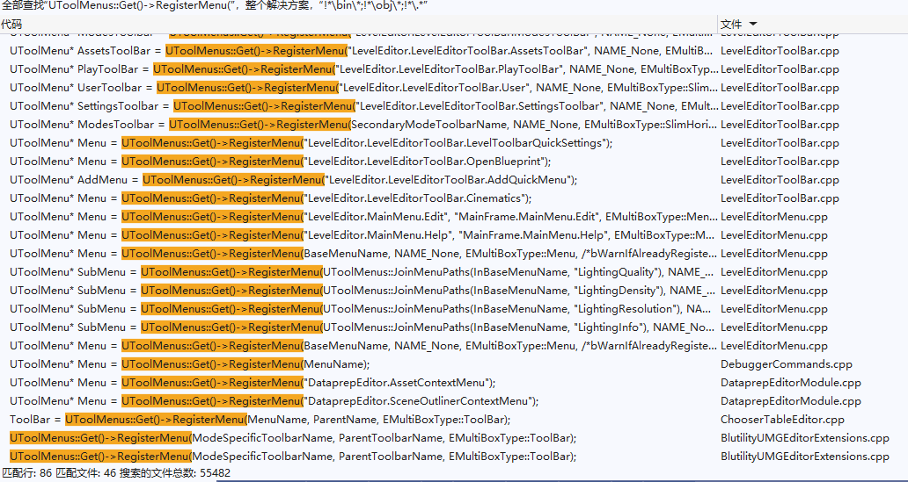

この関数は拡張可能な`ToolMenu`を登録するために使用され、各パラメータの意味は以下の通りです。

-   `InName`：登録に使用される連鎖フィールドで、`LevelEditor.LevelEditorToolBar.User`のような形式です。後でこのフィールドをKeyとして`UToolMenu`を取得できます。
-   `InParent`：ツールメニューの親を指定します。
-   `InType`：このToolMenuのタイプを指定します。このタイプによってメニューをどのように拡張できるかが決まります。以下の値を取ることができます。
    -   `MenuBar`：メニューバーで、メニューの拡張をサポートします。
    -   `ToolBar`：ツールバーで、ツールボタンを追加できます。
    -   `VerticalToolBar`：垂直ツールバー
    -   `SlimHorizontalToolBar`：水平ツールバーで、ツールバーの簡略版であり、アイコンとテキスト要素を水平に整列できます。
    -   `UniformToolBar`：
    -   `Menu`：メニューで、メニュー項目を追加できます。
    -   `ButtonRow`：行単位で配置されるボタンで、各行に最大数のボタンがあります。ツールバーに似ていますが、複数行にすることができます。
-   `bWarnIfAlreadyRegistered`：ブール値で、このフィールドが既に登録されている場合に警告を発します。

`メニューをプレビューするタイミング`では、関数`UToolMenus::GenerateWidget`が呼び出されて`ToolMenu`のコントロールが生成されます。

```c++
TSharedRef<SWidget> UToolMenus::GenerateWidget(const FName Name, const FToolMenuContext& InMenuContext)
```

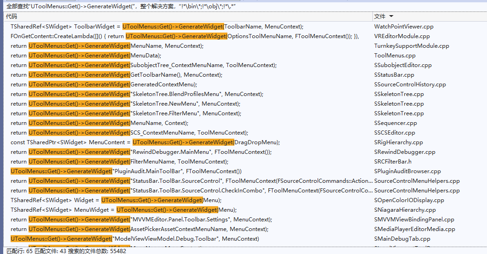

`ToolMenu`がRegisterされた後、プレビューされる前の任意のタイミングで、関数`UToolMenus::ExtendMenu`を通じてメニューバーの内容を拡張できます。

``` c++
UToolMenu* UToolMenus::ExtendMenu(const FName InName)
```

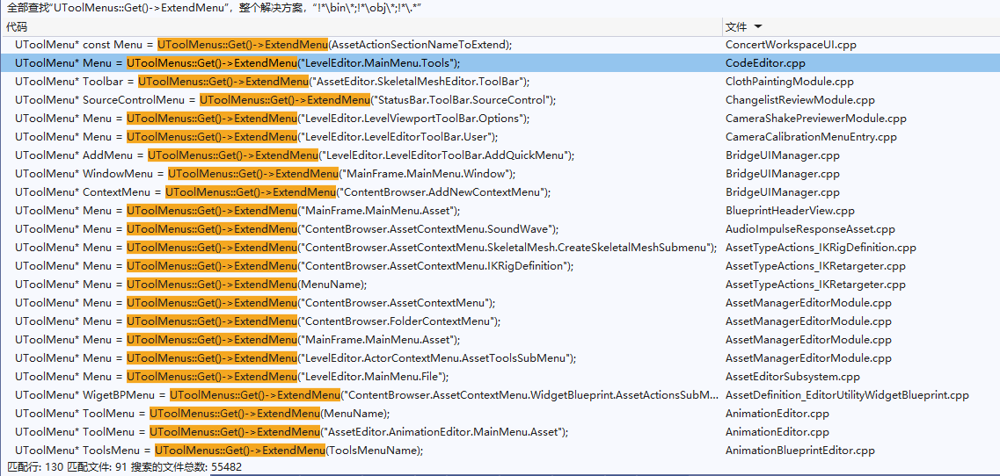

上記のコードには大量の拡張参考例がありますが、ここでは簡単なプラグイン拡張の例を示します。

``` c++
#pragma once

#include "Modules/ModuleManager.h"

class FCustomPluginModule : public IModuleInterface
{
public:
	virtual void StartupModule() override {
		//プラグイン起動時にUToolMenusの起動にコールバックを追加
		UToolMenus::RegisterStartupCallback(FSimpleMulticastDelegate::FDelegate::CreateRaw(this, &FCustomPluginModule::RegisterMenus));
	}

	virtual void ShutdownModule() override {
		//UToolMenusの起動コールバックを削除し、状態をリセット
		UToolMenus::UnRegisterStartupCallback(this);
		UToolMenus::UnregisterOwner(this);
	}
private:
	void RegisterMenus() {
		FToolMenuOwnerScoped OwnerScoped(this);
		UToolMenu* Menu = UToolMenus::Get()->ExtendMenu("LevelEditor.LevelEditorToolBar.PlayToolBar");
		FToolMenuSection& Section = Menu->FindOrAddSection("PluginTools");
		FToolMenuEntry& MenuEntry = Section.AddEntry(
			FToolMenuEntry::InitToolBarButton(			//ツールバーボタンを追加
				"CustomToolbarButton",
				FUIAction
				(
					FExecuteAction::CreateLambda([]() {
						FMessageDialog::Open(EAppMsgType::Ok, NSLOCTEXT("CustomNs", "HelloWorld", "Hello World!"));
					})
				)
			)
		);
		MenuEntry.InsertPosition = FToolMenuInsert(NAME_None, EToolMenuInsertType::First);
	}
};
```

このコードはレベルエディタメインパネルのツールバーにボタンを追加し、クリックすると`Hello World`のダイアログが表示されます。

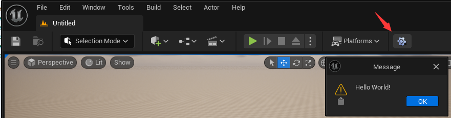

`UToolMenus::Get()`にブレークポイントを設定し、VSのデバッグウィンドウを通じてすべての拡張可能なフィールドリストを取得できます。

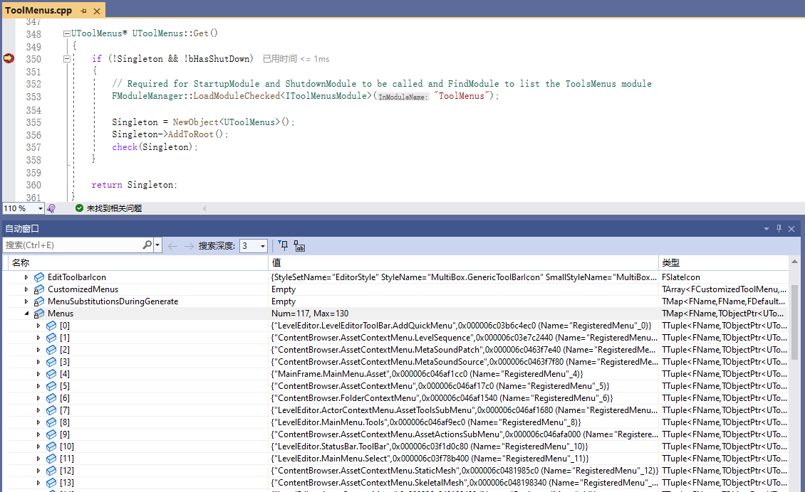

## アセット拡張


## ビューポート拡張

ビューポートを拡張するには以下のいくつかの構造体を使用する必要があります。

-   SEditorViewport
-   FEditorViewportClient

## ディテールパネル関連

**DetailView**はUEのリフレクションによってもたらされるもう一つの強力な機能です。

## Blueprint拡張

-   https://ikrima.dev/ue4guide/editor-extensions/custom-blueprints/blueprint-static-analysis/

## ユーザーエクスペリエンス

### 取り消し・やり直し

UObjectはトランザクションメカニズムを持っています。UObjectが`RF_Transactional`フラグを持っている場合、以下のコードを使用できます。

```C++
GEditor->BeginTransaction(NSLOCTEXT("NS", "Transaction", "Transaction"));       //トランザクション開始
Object->Modify();               //この操作はObjectの現在の状態をトランザクションに保存します

SomeChange(Object);             //Objectのいくつかのプロパティを変更

GEditor->EndTransaction();      //トランザクション終了、Objectの新しい状態をコミット
```

上記の操作により、SomeChangedが取り消し・やり直し可能になります。

>   詳細は以下を参照してください：https://blog.csdn.net/qq_29523119/article/details/96778797

エディタ開発では、特定のオブジェクトやウィンドウが取り消し・やり直し時に変更に応答する（例えば再構築など）必要がある場合がよくあります。UEは取り消し・やり直しイベントの監視に**FEditorUndoClient**インターフェースを提供しています。簡単なコード例は以下の通りです。

```C++
class FUndoRedoListener: public FEditorUndoClient{
public:
    FUndoRedoListener(){
        if (GEditor)
            GEditor->RegisterForUndo(this);     //適切なタイミングでこのリスナーを登録します。必ずしもコンストラクタである必要はありません。
    }
    ~FUndoRedoListener(){
        if (GEditor)
            GEditor->UnregisterForUndo(this);   //登録解除
    }
protected:
    virtual void PostUndo(bool bSuccess) override{      //エディタが取り消しを実行した後、この関数が呼び出されます
        RebuildSomething();
    }
    virtual void PostRedo(bool bSuccess) override{      //エディタがやり直しを実行した後、この関数が呼び出されます
        RebuildSomething();
    }
};
```

### フィードバックインタラクション

#### 通知


```c++
FNotificationInfo Info(FText::FromString(TEXT("This is notification")));
Info.FadeInDuration = 2.0f;
Info.ExpireDuration = 2.0f;
Info.FadeOutDuration = 2.0f;
FSlateNotificationManager::Get().AddNotification(Info);
```


``` c++
static TWeakPtr<SNotificationItem> NotificationPtr;
FNotificationInfo Info(FText::FromString(TEXT("This is notification")));
Info.FadeInDuration = 2.0f;
Info.FadeOutDuration = 2.0f;
Info.bFireAndForget = false;		
Info.bUseThrobber = false;
FNotificationButtonInfo BtYesInfo = FNotificationButtonInfo(
    NSLOCTEXT("NotificationNamespace","Yes", "Yes"),
    NSLOCTEXT("NotificationNamespace","Yes", "Yes"),
    FSimpleDelegate::CreateLambda([]() {
        TSharedPtr<SNotificationItem> Notification = NotificationPtr.Pin();
        if (Notification.IsValid())
        {
            Notification->SetEnabled(false);
            Notification->SetExpireDuration(0.0f);
            Notification->ExpireAndFadeout();	
            NotificationPtr.Reset();
        }
    }),
    SNotificationItem::ECompletionState::CS_None
);
Info.ButtonDetails.Add(BtYesInfo);
NotificationPtr = FSlateNotificationManager::Get().AddNotification(Info);
```

#### 進捗表示

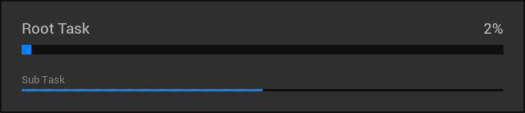

``` c++
float AmountOfWork = 50;
FScopedSlowTask RootTask(AmountOfWork, (NSLOCTEXT("SlowTaskNamespace", "This is slow root task", "This is slow root task")));
RootTask.MakeDialog();
for (int i = 0; i < 50; i++) {
    FScopedSlowTask SubTask(1, (NSLOCTEXT("SlowTaskNamespace", "This is slow sub task", "This is slow sub task ")));
    SubTask.MakeDialog();
    for (int j = 0; j < 2; j++) {
        FPlatformProcess::Sleep(0.5);
        SubTask.EnterProgressFrame(0.5, FText::FromString("Sub Task"));
    }
    RootTask.EnterProgressFrame(1, FText::FromString("Root Task"));
}
```

#### [ダイアログ](https://zhuanlan.zhihu.com/p/268069477)

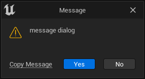

``` c++
EAppReturnType::Type Ret = FMessageDialog::Open(EAppMsgType::YesNo, NSLOCTEXT("NS", "message dialog", "message dialog"));
if (Ret == EAppReturnType::Yes) {	

}
```


## 基礎操作

### 文字列

#### TCHAR

> 通常、コード内の文字列は**ANSI**でエンコードされますが、**ANSI**がサポートする文字数が少ないため、文字列変数のリテラルを設定する際には**TEXT()**マクロを使用して**ANSI**リテラルを**TCHAR**（ネイティブUnicodeエンコード）に変換する必要があります。

``` c++
TCHAR* ThisIsTChars = TEXT("This is Raw String");
```

TCHARと原生文字列エンコード形式を変換したい場合は、以下のマクロを使用できます。

- **TCHAR_TO_ANSI** (str) 
- **TCHAR_TO_UTF8** (str) 
- **TCHAR_TO_UTF16** (str) 
- **TCHAR_TO_UTF32** (str) 
- **TCHAR_TO_WCHAR** (str) 
- **ANSI_TO_TCHAR** (str) 
- **UTF8_TO_TCHAR** (str) 
- ...

ゲームは性能要求が高いため、通常のStringではUEゲーム開発における様々なアプリケーションシナリオの性能要求を満たすことができません。そのためUE4は3つの常用文字列クラスを提供しています。

#### [FString](https://docs.unrealengine.com/4.27/zh-CN/ProgrammingAndScripting/ProgrammingWithCPP/UnrealArchitecture/StringHandling/FString/)

> 汎用的な文字列で、変更可能です。文字列操作のための大量のメソッドを提供します。

- コンストラクタ
    - static FString **Chr** ( TCHAR Ch )
    - static FString **ChrN** ( int32 NumCharacters, TCHAR Char )
    - static FString **FromInt** ( int32 Num )
    - static FString **SanitizeFloat** ( double InFloat, const int32 InMinFractionalDigits = 1 )
    - static FString **FromBlob** (const uint8* SrcBuffer,const uint32 SrcSize);
- フォーマット
    - static FString **Printf** (const FmtType& Fmt, Types... Args)
    - FString& **Appendf** (const FmtType& Fmt, Types... Args)
    - static FString **Format** (const TCHAR* InFormatString, const FStringFormatOrderedArguments& InOrderedArguments)
    - static FString **Format** (const TCHAR* InFormatString, const FStringFormatNamedArguments& InNamedArguments)

- 変換
    - void **ToUpperInline** ()
    - FString **ToUpper** ()
    - void **ToLowerInline** ()
    - FString **ToLower** ()
- マッチング
    - bool **Equals** (const FString& Other, ESearchCase::Type SearchCase = ESearchCase::CaseSensitive)
    - int32 **Compare** ( const FString& Other, ESearchCase::Type SearchCase = ESearchCase::CaseSensitive ) const
    - bool **IsNumeric** () 
    - bool **StartsWith** (const FString& InPrefix, ESearchCase::Type SearchCase = ESearchCase::IgnoreCase)
    - bool **EndsWith** (const FString& InSuffix, ESearchCase::Type SearchCase = ESearchCase::IgnoreCase ) 
    - bool **MatchesWildcard** (const FString& Wildcard, ESearchCase::Type SearchCase = ESearchCase::IgnoreCase)
    - bool **Contains** (const TCHAR* SubStr, ESearchCase::Type SearchCase = ESearchCase::IgnoreCase, 
        ESearchDir::Type SearchDir = ESearchDir::FromStart )

- トリミング
    - void **TrimStartAndEndInline** ()
    - FString **TrimStartAndEnd** () 
    - void **TrimStartInline** ()
    - FString **TrimStart** () 
    - void **TrimEndInline** ()
    - FString **TrimEnd** ()
    - void **TrimQuotesInline** (bool* bQuotesRemoved = nullptr);
    - FString **TrimQuotes** (bool* bQuotesRemoved = nullptr)
    - void **TrimCharInline** (const TCHAR CharacterToTrim, bool* bCharRemoved)
    - FString **TrimChar** (const TCHAR CharacterToTrim, bool* bCharRemoved = nullptr) 

- 検索
    - int32 **Find** ( const TCHAR* SubStr, ESearchCase::Type SearchCase = ESearchCase::IgnoreCase, 
        	ESearchDir::Type SearchDir = ESearchDir::FromStart, int32 StartPosition=INDEX_NONE ) 
    - bool **FindChar** ( TCHAR InChar, int32& Index )
    - bool **FindLastChar** ( TCHAR InChar, int32& Index ) 
    - int32 **FindLastCharByPredicate** (Predicate Pred, int32 Count)
    - int32 **FindLastCharByPredicate** (Predicate Pred)

- 分割
    - int32 **ParseIntoArray** ( TArray<FString>& OutArray, const TCHAR* pchDelim, bool InCullEmpty = true ) 
    - bool **Split** (const FString& InS, FString* LeftS, FString* RightS, ESearchCase::Type SearchCase,
        	ESearchDir::Type SearchDir = ESearchDir::FromStart) 

- 部分文字列
    -  void **LeftInline** (int32 Count, bool bAllowShrinking = true)
    -  FString **Left** ( int32 Count ) 
    -  void **LeftChopInline** (int32 Count, bool bAllowShrinking = true)
    -  FString **LeftChop** ( int32 Count )
    -  FString **Right** ( int32 Count )
    -  void **RightInline** (int32 Count, bool bAllowShrinking = true)
    -  FString **RightChop** ( int32 Count )
    -  void **RightChopInline** (int32 Count, bool bAllowShrinking = true)
    -  FString **Mid** (int32 Start, int32 Count) 
    -  void **MidInline** (int32 Start, int32 Count = MAX_int32, bool bAllowShrinking = true)
- 結合
    - static FString **Join** (const RangeType& Range, const TCHAR* Separator)
    - static FString **JoinBy** (const RangeType& Range, const TCHAR* Separator, ProjectionType Proj)
- 置換
    - FString **Replace** (const TCHAR* From, const TCHAR* To, ESearchCase::Type SearchCase = ESearchCase::IgnoreCase)
    - int32 **ReplaceInline** ( const TCHAR* SearchText, const TCHAR* ReplacementText, ESearchCase::Type SearchCase = ESearchCase::IgnoreCase )
    - FString **ReplaceQuotesWithEscapedQuotes** () 
    - void **ReplaceCharWithEscapedCharInline** ( const TArray<TCHAR>* Chars = nullptr )
    - FString **ReplaceCharWithEscapedChar** ( const TArray<TCHAR>* Chars = nullptr )
    - void **ReplaceEscapedCharWithCharInline** ( const TArray<TCHAR>* Chars = nullptr )
    - void **ConvertTabsToSpacesInline** (const int32 InSpacesPerTab);
    - FString **ConvertTabsToSpaces** (const int32 InSpacesPerTab)
- 反転
    - void **ReverseString** ();
    - FString **Reverse** ()

#### [FText](https://docs.unrealengine.com/4.27/zh-CN/ProgrammingAndScripting/ProgrammingWithCPP/UnrealArchitecture/StringHandling/FText/)

> テキストのローカライズ（多言語）をサポートするため、ユーザー向けのすべてのテキストにはこれを使用する必要があります。

##### テキストローカライズ（国際化）

#### [FName](https://docs.unrealengine.com/4.27/en-US/ProgrammingAndScripting/ProgrammingWithCPP/UnrealArchitecture/StringHandling/FName/)

> 命名に使用され、大文字小文字を区別しません。リソースを迅速に特定するため、作成時にFNameは文字列内容に基づいてハッシュ値を計算します。これにより比較ロジックを実装する際に文字列内容を比較する必要がなく、直接ハッシュ値が等しいかどうかを比較するだけで済みます。

> ### 相互変換
>
> ```c++
> TestString = TestName.ToString();
> TestString = TestText.ToString();
> 
> TestName = FName(*TestString);
> TestName = TestText;	 // FTextからFNameへの直接変換は存在しませんが、FString経由で変換できます。ただしFNameは大文字小文字を区別しないため、信頼性は低いです。
> 
> TestText = FText::FromName(TestName);
> TestText = FText::FromString(TestString);
> ```

#### パス

> FPaths
>
> FPackagePath

#### 正規表現

> https://blog.csdn.net/justtestlike/article/details/81393221

### 数学

UEの数学関数は以下の2つの名前空間に存在します。

- [FMath](https://docs.unrealengine.com/4.27/en-US/API/Runtime/Core/Math/FMath/)：UEの基礎数学ライブラリ
- [UkismetMathLibrary](https://docs.unrealengine.com/4.27/en-US/API/Runtime/Engine/Kismet/UKismetMathLibrary/)：Blueprintライブラリで、FMathを基に大量の関数をBlueprintに公開するためにカプセル化されています。

### 時間・日付

### [タイマー](https://docs.unrealengine.com/4.26/en-US/ProgrammingAndScripting/ProgrammingWithCPP/UnrealArchitecture/Timers/)

### ファイル操作

## 入出力

### FArchive

### ファイル

UEではシングルトンクラス**[IFileManager](https://docs.unrealengine.com/4.26/en-US/API/Runtime/Core/HAL/IFileManager/)**を通じて大量のファイル操作を提供しています。主な操作は以下の通りです。

- ファイルの読み書き、移動、削除、存在確認、読み取り可能確認、検索（再帰）
- ディレクトリの作成、削除、存在確認、走査

ファイルIOについては、**[FFileHelper](https://docs.unrealengine.com/4.27/en-US/API/Runtime/Core/Misc/FFileHelper/)**にもファイルの一括読み書きのための便利な静的メソッドが提供されています。

### バイトストリーム

### 画像

### シリアライズ

### Json

> 詳細は以下を参照：https://www.cnblogs.com/shiroe/p/14751769.html

### XML

## マルチスレッド

### FThread、FRunnable

### FStreamManager

### AsyncTask

### TaskGraph

## デバッグ

### ログ

- カスタムログカテゴリ

    ``` c++
    // ヘッダーファイルで宣言
    DECLARE_LOG_CATEGORY_EXTERN(CustomLogCategory, Log, All);
    ```

    ``` c++
    // ソースファイルで定義
    DEFINE_LOG_CATEGORY(CustomLogCategory);
    ```

- ログの出力

    ``` c++
    UE_LOG(CustomLogCategory,Log,TEXT("This is log %d"),123);
    ```

    - Log
    - Warning
    - Error

### アサーション

> コードの場所：`Engine\Source\Runtime\Core\Public\Misc\AssertionMacros.h`

- checkCode
- check
- checkf
- checkNoEntry
- checkNoReentry
- checkNoRecursion
- verify
- verifyf
- unimplemented
- ensure
- ensureMsgf
- ensureAlways
- ensureAlwaysMsgf

### 性能分析

### コンソールコマンド

## モデリングツール

``` c++
void UBPLibrary::SetStaticMeshPivot(UStaticMesh* InStaticMesh, EStaticMeshPivotType PivotType)
{
	if(InStaticMesh == nullptr)
		return;
	auto InteractiveToolsContext = NewObject<UEditorInteractiveToolsContext>();
	InteractiveToolsContext->InitializeContextWithEditorModeManager(&GLevelEditorModeTools(), nullptr);
	UE::TransformGizmoUtil::RegisterTransformGizmoContextObject(InteractiveToolsContext);

	InteractiveToolsContext->ToolManager->RegisterToolType("EditPivotTool", NewObject<UEditPivotToolBuilder>());
	UStaticMeshComponent* StaticMeshComp = NewObject<UStaticMeshComponent>();
	StaticMeshComp->SetStaticMesh(InStaticMesh);

	InteractiveToolsContext->TargetManager->AddTargetFactory(NewObject<UStaticMeshComponentToolTargetFactory>());
	UToolTarget* Target = InteractiveToolsContext->TargetManager->BuildTarget(StaticMeshComp, FToolTargetTypeRequirements());

	InteractiveToolsContext->ToolManager->SelectActiveToolType(EToolSide::Left, "EditPivotTool");
	GLevelEditorModeTools().SelectNone();
	GLevelEditorModeTools().GetSelectedComponents()->Select(StaticMeshComp);

	InteractiveToolsContext->ToolManager->ActivateTool(EToolSide::Left);
	if (auto EditTool = Cast<UEditPivotTool>(InteractiveToolsContext->ToolManager->ActiveLeftTool))
	{
		EditTool->SetTargets({ Target });
		EditTool->RequestAction((EEditPivotToolActions)PivotType);
		EditTool->Tick(0.1);
		EditTool->Shutdown(EToolShutdownType::Accept);
	}
}
```

## 開発心得

**合理的であれば存在する**という思考方式に基づいて**模倣**する。