# Niagara パフォーマンス最適化

**Niagara** は **Unreal Engine** が提供する汎用的なパーティクルシステムであり、特定の効果を制作する方法に関する優れたチュートリアルが多く存在しますが、Niagaraの使用管理とパフォーマンス最適化はしばしばエフェクトクリエイターによって無視されがちです。

筆者は長年この問題に苦しめられてきたため、本節では関連内容を補足し、読者がこれらの問題を可能な限り回避できるようにしたいと思います=.=。

## 使用方法

**パーティクルシステム（Particle System）** は3Dシーンの効果を豊かにする重要な手段であり、シーン内の **メッシュ（Mesh）** とは異なり、以下の特徴が顕著です：

- パーティクルの **数量** が多い
- パーティクルが時間とともに **運動** する

これら2つの特徴を満たさない（すなわち`数量が少ない`かつ`静的`）場合、クリエイターは **MeshActor** を使用するか、パーティクルを使用するかを検討する必要があります。

UEにおけるエフェクトは主に以下の2つのカテゴリに分類できます：

- **生成エフェクト** ：`SpawnSystemAtLocation`および`SpawnSystemAttached`を使用してシーン内に **動的に生成** されるエフェクト。
- **シーンエフェクト** ： **Actorの形式でシーンに配置** されるエフェクト。

これら2つのエフェクトには、それぞれ異なる注目点と対応する管理方法が存在します。

### バウンディングボックス

ゲームエンジンでは、毎フレームのレンダリングコストを削減するため、不可視なオブジェクトをカリングしてGPUのレンダリングに参加させないようにしています。以下の図に示します：


> この画像は：[马克·加尔维斯 - 主页 (optus23.github.io)](https://optus23.github.io/) より取得したものです。

[3Dビュー変換](https://zhuanlan.zhihu.com/p/597152918) を理解している場合は、カメラ行列を使用してオブジェクトのすべての頂点を計算することで、オブジェクトがカメラの範囲内にあるかどうかを判断できることを知っているはずです。


しかし、1つのオブジェクトには数千数万の頂点が存在する可能性があり、各頂点ごとに計算を行うと、ゲームエンジンはPPTプレーヤーのようになってしまいます~

このプロセスを簡略化するため、ゲームエンジンはトリックを使用し、オブジェクトを囲む単純なボックスを使用してオブジェクトの頂点の代わりにカメラカリングの計算を行います。ボックスの頂点数は少なく、可視性の判断は正確ではありませんが、パフォーマンスの向上は非常に顕著です。

> 論理的には：このボックスが見える限り、必ずそのオブジェクトが可視であることを証明できると認定できます。


> オブジェクトのバウンディングボックスを表示：`ShowFlag.Bounds 1`

したがって、以下の点を理解する必要があります： **エンジンがオブジェクトがカメラの範囲内にあるか、または遮られているかを判断する場合、一般的にはオブジェクト自体の頂点情報ではなく、オブジェクトのバウンディングボックスを参照します。**

**静的メッシュ（StaticMesh）** の場合、その頂点は静的であるため、アセットの作成時にエンジンが自動的にバウンディングボックス情報を生成しています。

しかし、エフェクトの場合、パーティクルは動的であるため、バウンディングボックスを静的に生成することはできません。

UEにおいて **CPUパーティクル** の場合、エンジンは毎フレームNiagaraのバウンディングボックスの境界を再計算します：


しかし、 **GPUパーティクル** はその実装の特殊性（すべてのパーティクルデータがGPU内に存在し、パーティクル数が非常に多いことが多い）により、CPU側でパーティクルのバウンディングボックスをリアルタイムで計算することができません。開発者は **必ず**  **固定境界** を設定する必要があります。つまり、手動でバウンディングボックスのサイズを設定する必要があります。

> GPUパーティクルはGPU駆動のレンダリングパイプラインであり、プロセス全体でCPUとのインタラクションはほとんどありません。グラフィックスレンダリングパイプラインのデータは多くの場合一方向（CPU->GPU）と見なすことができます。GPUからデータを読み戻すこともできますが、このプロセスには一定の遅延が存在し、パフォーマンスコストが非常に高いです。）

Niagaraでは、以下の場所で **パーティクルエミッター** のバウンディングボックスを設定できます：


最も簡単な方法は **パーティクルシステム全体** にバウンディングボックスを設定することです：


**クリエイターはバウンディングボックスの正確性を保証する必要があります** （バウンディングボックスは可能な限り最小の領域でエフェクトの全体的な運動空間をカバーする）。そうしないと、以下の結果が生じます：

- エフェクトのバウンディングボックスが実際の運動空間と一致しない場合、誤った視覚的カリングが発生します：


- エフェクトのバウンディングボックスが大きすぎる場合、視野範囲内にないにもかかわらずエフェクトがカリングされず、依然としてレンダリングが実行され、不要な損耗が発生します。

  

### ライフサイクル

**シーンエフェクト** の場合、そのライフサイクルはシーンがActorレベルで管理するため、一般的には気にする必要はありません。一方、 **生成エフェクト** のライフサイクル管理には、理解する必要のあるいくつかの詳細が存在します：

**生成エフェクト** とは、 **UNiagaraFunctionLibrary** 下のいくつかの関数を使用して生成されるエフェクトです：

``` c++
UNiagaraComponent* SpawnSystemAtLocation(const UObject* WorldContextObject,
                                         class UNiagaraSystem* SystemTemplate, 
                                         FVector Location, 
                                         FRotator Rotation = FRotator::ZeroRotator,
                                         FVector Scale = FVector(1.f), 
                                         bool bAutoDestroy = true,
                                         bool bAutoActivate = true, 
                                         ENCPoolMethod PoolingMethod = ENCPoolMethod::None,
                                         bool bPreCullCheck = true);

UNiagaraComponent* SpawnSystemAttached(UNiagaraSystem* SystemTemplate,
                                       USceneComponent* AttachToComponent,
                                       FName AttachPointName,
                                       FVector Location, 
                                       FRotator Rotation,
                                       FVector Scale, 
                                       EAttachLocation::Type LocationType, 
                                       bool bAutoDestroy, 
                                       ENCPoolMethod PoolingMethod, 
                                       bool bAutoActivate = true,
                                       bool bPreCullCheck = true);
```

**SpawnSystemAtLocation** は指定された位置にパーティクルコンポーネントを生成するために使用され、 **SpawnSystemAttached** は別のシーンコンポーネントにアタッチするために使用されます。ライフサイクルに関しては、主に以下のパラメータに注目する必要があります：

- **bAutoActivate** ：自動的にアクティブ化するかどうか。trueの場合、直ちにパーティクル効果が再生されます。
- **bAutoDestroy** ：自動的に破棄するかどうか。trueの場合、パーティクルの再生が完了した後にコンポーネントが破棄されます。
- **bPreCullCheck** ：プレカリング。trueの場合、生成されたパーティクルシステムのバウンディングボックスが視錐台の範囲内にない場合、パーティクルコンポーネントは生成されず、nullが返されます。
- **PoolingMethod** ：プール操作。パーティクルコンポーネントを再利用するメカニズム。その値は以下の通りです：
  - **None**
  - **AutoRelease** ：自動解放。再生が終了した後、自動的にエフェクトプールに保存され再利用されます。
  - **ManualRelease** ：手動解放。 **ReleaseToPool** を手動で呼び出す必要があり、これによりパーティクルコンポーネントが再利用されます。
  - ManualRelease_OnComplete：非公開オプション。Niagara内部の状態制御に使用されます。使用しないでください。
  - FreeInPool：非公開オプション。Niagara内部の状態制御に使用されます。使用しないでください。

#### エフェクトプール

> 詳細なメカニズムについては、以下の記事を参照してください：[【UE4】特效池 - 知乎 (zhihu.com)](https://zhuanlan.zhihu.com/p/394772587)

##### キャッシュメカニズム

エフェクトプールの主な目的はパーティクルコンポーネントを再利用することです。そのキャッシュメカニズムは以下のように考えることができます：

- 生成パラメータにプール操作が含まれている場合（`PoolingMethod != ENCPoolMethod::None`）、Niagaraはエフェクトプール内で同じタイプの再利用可能なコンポーネントが存在するかどうかを検索します。存在する場合はそれを使用し、存在しない場合は新しいパーティクルコンポーネントを作成し、その使用時間を記録します。
- 新しく作成されたパーティクルコンポーネントは解放されません（ **bAutoDestroyが無効になることを意味します** ）。エフェクトプールに保存され管理されます。
- **AutoRelease** のパーティクルコンポーネントの場合、再生が終了すると、エフェクトプールはそれを再利用可能としてマークします。
- **ManualRelease** のパーティクルコンポーネントの場合、 **ReleaseToPool** が呼び出されると、パーティクルがすでに再生を完了している場合は直ちに再利用可能としてマークされ、そうでない場合はプール操作が **ManualRelease_OnComplete** に変更され、再生が完了した時点で再利用可能としてマークされます。

##### クリーンアップ方法

**UNiagaraComponentPool** には定期的なクリーンアップメカニズムがあり、主な2つのキーパラメータは以下の通りです：

- **GNiagaraSystemPoolKillUnusedTime** ：デフォルトは180
- **GNiagaraSystemPoolingCleanTime** ：デフォルトは30

上記の設定に対応する自動クリーンアップメカニズムはおおよそ以下のように考えることができます：UNiagaraComponentPoolは30秒ごとに180秒以上再利用されていないパーティクルコンポーネントをクリーンアップします。

> 実際にはTickによるクリーンアップではなく、再利用が行われるたびにクリーンアップが実行されるため、必ずしも30秒ではなく、誤差が大きくなる可能性があります。

Worldを切り替えると、 **UNiagaraComponentPool** はCleanupを実行します。

また、 **UNiagaraComponentPool::ClearPool(UNiagaraSystem* System)** を手動で呼び出してクリーンアップすることもできます。

#### 注意点

- プール操作（ **PoolingMethod** ）が存在する場合、 **bAutoDestroy** は無効になります。
- プールメカニズムが正常に動作する前提は、パーティクルシステムが再生を終了できることです。以下に注意してください：
  - パーティクルシステムにライフサイクルが無限のエミッターが存在しないことを確認してください。
  - ResetParticles(true)を呼び出すと、Completeに到達しません。
  - スケーラブルカリングの **カリング反応が休眠** の場合、 **カリングされたエフェクトは再利用されず** 、 **OnSystemFinishedがトリガーされません** （厳密には完了とは言えません）。
- プール操作があるパーティクルコンポーネントに対しては、 **DestoryComponentを呼び出さないでください** 。プール内のパーティクルコンポーネントはWorldを切り替える際にクリーンアップされるか、定期的にクリーンアップされます。
- **SpawnSystemAttached** にプール操作が含まれている場合、新しく生成されたパーティクルコンポーネントの **実際の所有者はWorldであり、アタッチされたコンポーネントではありません** 。パーティクルコンポーネントは **アタッチされたコンポーネントの破棄とともに破棄されません** 。
- **AutoRelease** のパーティクルコンポーネントに **ReleaseToPool** を呼び出すとエラーが発生します。
- **AutoRelease** もプール操作も有効になっていないパーティクルに対しては、そのライフサイクルを厳密に管理する必要があります。

### スケーラビリティ

バウンディングボックスを設定することで、 **視覚的に** パーティクルをカリングすることができますが、注意すべき点は、パーティクルシステムは通常のシーンオブジェクトとは異なり、 **シミュレーションのコスト** も存在することです！

これは現在、多くのエフェクトアーティストがNiagaraを使用する際に容易に無視する問題であり、多くの人はパーティクルが見えなくなるとパーティクルが停止すると思っていますが、実際にはそうではなく、依然として以下の処理が実行されています：


生成エフェクトの場合、一定のライフサイクルを持つため、ほとんどの場合、そのシミュレーションコストは問題になりません。

しかし、シーンエフェクトの場合、シーンに配置されたNiagaraActorの数が多すぎると、プログラム全体に大きな影響を与えます。

この問題を解決するため、UEは **エフェクトタイプ（NiagaraEffectType）** というアセットを提供し、Niagara Systemの **シミュレーションにおける最適化戦略** を制御するために使用されます。


以下の場所でNiagaraSystemが使用するエフェクトタイプを指定できます：


これを使用することで、以下のニーズを満たすことができます：

- パーティクルシステムの最遠表示距離を限定する
- 現在のビューポート内に表示される最大パーティクルシステムの数を制限する
- パフォーマンス予算に基づいてパーティクルの効果を調整する
- エミッターの生成数のスケーリング係数を調整する

その設定パネルは以下の通りです：


システムおよびエミッターのスケーラビリティ設定を追加できます。各設定は異なるパフォーマンスレベルに対応するスケーラビリティ戦略を示します：


パラメータの意味は以下の通りです：

- ローカルプレイヤーに対するカリングを実行する：ローカルプレイヤーによって生成、アタッチ、作成されたエフェクトのカリングを許可するかどうか。

- 更新頻度：`生成のみ`、`低`、`中`、`高`、`連続`

  **NiagaraEffectType** と **NiagaraComponent** は同様に **NiagaraWorldManager** によって管理され、 **NiagaraEffectType** は個別にTickされます。ここでの更新頻度は、 **NiagaraSystem** の現在の状態を検出する頻度を指します。頻度が高いほどカリング反応が迅速になりますが、パフォーマンスコストも大きくなります。

- カリング反応：`破棄`、`破棄してクリア`、`休眠`、`休眠してクリア`

  クリアするとすべてのパーティクルが直ちに終了し、NiagaraSystemがカリングされます。クリアしない場合は新しいパーティクルが生成されず、既存のパーティクルのライフサイクルがすべて終了した後にカリングされます。

  破棄と休眠の違いは、破棄がパーティクルを直接破棄するのに対し、休眠はパーティクルを隠して活性化を待つだけであることです。

  シーンエフェクトの場合、シーンに配置されたActorであるため、破棄後に再生成されないため、一般的に休眠に設定し、具体的な破棄とロードは大世界によって管理されます。

  生成エフェクトの場合、一般的に一度生成されるため、休眠に設定するとメモリを占有し続けるため、一般的に破棄に設定します。

- 重要性プロセッサ：`年齢`、`距離`

  重要性プロセッサは主に以下の **最大システムインスタンス** と関連します。最大システムプロキシは現在同じタイプのパーティクルシステムのインスタンスをいくつ許可するかを決定し、重要性プロセッサはパーティクルのソートの優先度を決定します。例えば距離を目標とする場合、10個のパーティクルシステムが存在し、最大システムインスタンスが5の場合、 **NiagaraEffectType** は最近接の5つのパーティクル効果のみを保持します。

- システムスケーラビリティ設定

  **設定リスト** 。設定項目を追加するたびに、その項目がどの環境で有効になるかを設定できます。

  

  - 最大距離：エフェクトと現在のプレイヤーの距離に基づいてパーティクルをカリングする。

  - カリングプロキシモード：`インスタンス化されたレンダリング`。 **インスタンス化されたレンダリング** を有効にすると、不可視のパーティクルシステムが作成され、他のすべてのカリングされた同じタイプのパーティクルシステムはそれを使用してレンダリングされ、大量のシミュレーションコストを回避できます。

  - 最大システムプロキシ：最大システムプロキシ数。

  - 予算調整：一定の予算に基づいてパーティクルシステムのスケーラビリティ戦略を調整する。
  - 可視性カリング：可視性に基づいてカリングを実行する。

> 具体的な説明については、エディターパネルのTooltipを参照してください。

シーンエフェクトについては、すべてのシーンエフェクトに統一して以下のようなエフェクトタイプを設定することを強く推奨します：


この設定により達成される効果は：パーティクルシステムが不可視になると、レンダリングが停止するだけでなく、シミュレーションも停止することです。


特定のエフェクトが独自のカリング戦略を必要とする場合、Niagaraは個々の NiagaraSystem および NiagaraEmitter に対して **スケーラビリティオーバーライド** をサポートし、NiagaraEffectTypeの設定を **上書き** することができます：


**Niagara Effect Type** の詳細な設定例については、以下を参照してください：https://www.youtube.com/watch?v=-P3yaZNgeg0

### LOD

NiagaraはLODDistanceの組み込み変数を提供し、その数値に基づいてNiagaraのパフォーマンスパラメータを距離に応じて適応させることができます。


例えば、生成数にLODを作成することが一般的です：


### ウォームアップ時間

シーンに配置されたループエフェクトには、通常「プレヒート」時間が存在します。Niagaraでは、システムのウォームアップ時間を設定することで、このプレヒートプロセスを省略することができます：


可視性カリングが有効なシーンエフェクトの場合、休眠カリングによってパーティクルが再活性化されると、プレヒートプロセスが再び再生されます：


しかし、ウォームアップ時間を設定してプレヒートプロセスを省略すると、効果は以下のようになります：


### エミッター数の管理

理想的な状況は、2つのエミッターが使用するレンダラーパラメータが完全に一致する場合、同じエミッターを使用するべきであることです。

なぜなら、エミッター内の1つのレンダラーは1つのグラフィックスレンダリングパイプラインに対応し、パーティクルシステムは本質的にグラフィックスレンダリングパイプラインに必要なインスタンス化データを処理するためです。

エミッターが1つ多いと、レンダリングデータが1つ多くなり、パーティクルバッファを多く維持する必要があります。

パーティクルの運動メカニズムを調整したい場合は、カスタムModuleを作成する方式で拡張できます。

### CPUパーティクルとGPUパーティクルの区別

CPUパーティクル：少数のパーティクルレンダリングに適しています。データがCPU内に存在するため、シーン全体の情報を取得でき、ゲームロジックとのインタラクションが容易で、パーティクル間のイベント通信、高精度の物理衝突をサポートし、バウンディングボックスの境界を動的に計算できます。

GPUパーティクル：非常に低いパフォーマンスコストを持ち、大量（十万級）のパーティクルレンダリングに適しています。

区別する際、最初に考慮する次元はパーティクル数です。パーティクル数が非常に少ない（例えば数個または数十個）場合、CPUパーティクルを使用することが最適です（数個のパーティクルのためにGPUのスケジューリングコストを増やす必要はないため）。

数が1000を超える場合、機能要件がCPUパーティクルの特性を必要とするかどうかを考慮します。必要としない場合は、優先的にGPUパーティクルを使用します。

パーティクル数が非常に多いが、CPUパーティクルの特性を使用する必要がある場合、より低いコードレベルでGPUパーティクルの機能を拡張する必要があります。

## 最適化

パフォーマンス最適化については、大多数の場合、美術的なニーズを満たしながら、パフォーマンスの低下を引き起こさないことを追求します。

この指標は非常に曖昧であり、大多数の初心者にとってできることは、後から手直しすることだけです。

したがって、第一点が非常に重要です。パフォーマンス問題を発見できるようにならなければ、最適化計画を立てることはできません。

### パフォーマンスの特定

UEはシーンの実行パフォーマンスを検出するための多くのコマンドとツールを提供しています。以下の動画を参考にすることができます：

- [[官方培训\]22-UE资产优化 | Epic 肖月_哔哩哔哩_bilibili](https://www.bilibili.com/video/BV1FT411x7hU/?spm_id_from=333.337.search-card.all.click)
- [[UnrealCircle苏州\]UE4性能优化 | 周华 苏州谜匣数娱_哔哩哔哩_bilibili](https://www.bilibili.com/video/BV1FV411G72Q/?vd_source=e173296de020f10e8476ed443bbdfaed)
- [【搬运】UnrealFest2023 UE5性能优化_哔哩哔哩_bilibili](https://www.bilibili.com/video/BV1Yj41147dh/?vd_source=e173296de020f10e8476ed443bbdfaed)

エンジン開発者にとっては、一般的に **RenderDoc** 、 **Unreal Insight** 、各種Statコマンドを熟练に使用する必要があります。これらから非常に詳細なパフォーマンスデータを取得できます。

Niagaraについては、UEはNiagaraの実行状況を監視するための専用ツール—— **Niagaraデバッガー（Niagara Debugger）** を提供しています。

以下の場所でNiagaraDebuggerを開くことができます：


また、NiagaraSystemの詳細パネルからデバッガーを起動することもできます：


#### デバッグHud

`デバッグHud`ページでは、多くのNiagaraデバッグビューを設定できます。

`デバッグビューを有効にする`をオンにすると、現在のシーンで実行中のすべてのパーティクルシステムのパーティクル数とメモリを表示できます：


`システム境界を表示`をオンにしてNiagaraSystemのバウンディングボックスを表示できます：


`システム属性を表示`をオンにし、`属性一致文字列`を追加して、パーティクルシステムのデバッグプレビュービューを追加できます：


同様にパーティクル属性をプレビューすることもできます：


シーン内のパーティクルシステムが多い場合、他のパーティクルデバッグビューの干渉を排除するため、`名前フィルタ`を設定してデバッガーが注目するパーティクルシステムを選択できます：


> この設定は`New`で始まる名前のパーティクルシステムのみを注目します。

#### 視效大纲视图

視效大纲はシーン内のNiagaraに対して **フレームキャプチャ** を行うために使用され、3つのビューモードをサポートします：


`キャプチャ（Capture）`をクリックすると、Niagaraの実行状況をキャプチャできます（キャプチャの遅延時間とフレーム数を設定できます）：

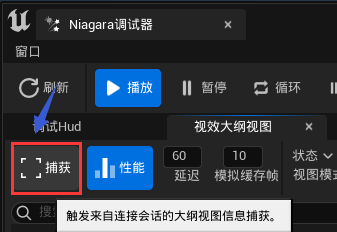

状態モードでは、シーン内のすべてのパーティクルシステムの活性化状況、シミュレーションタイプ（CPU/GPU）、パーティクル数を表示できます：

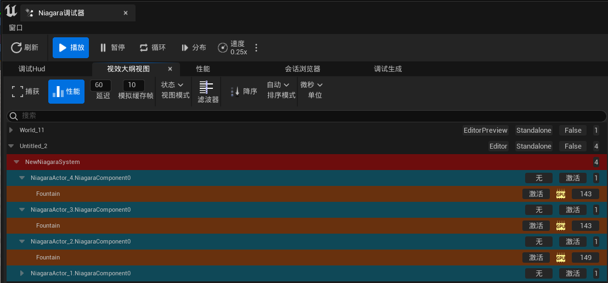

性能モードでは、パーティクルシステムのゲームスレッドとレンダリングスレッドでの実行コストをさらに表示できます：

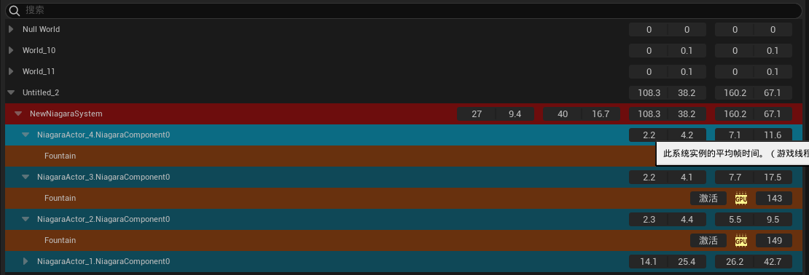

デバッグモードでは、パーティクルシステムの実行時の具体的なパーティクルデータを取得できます：

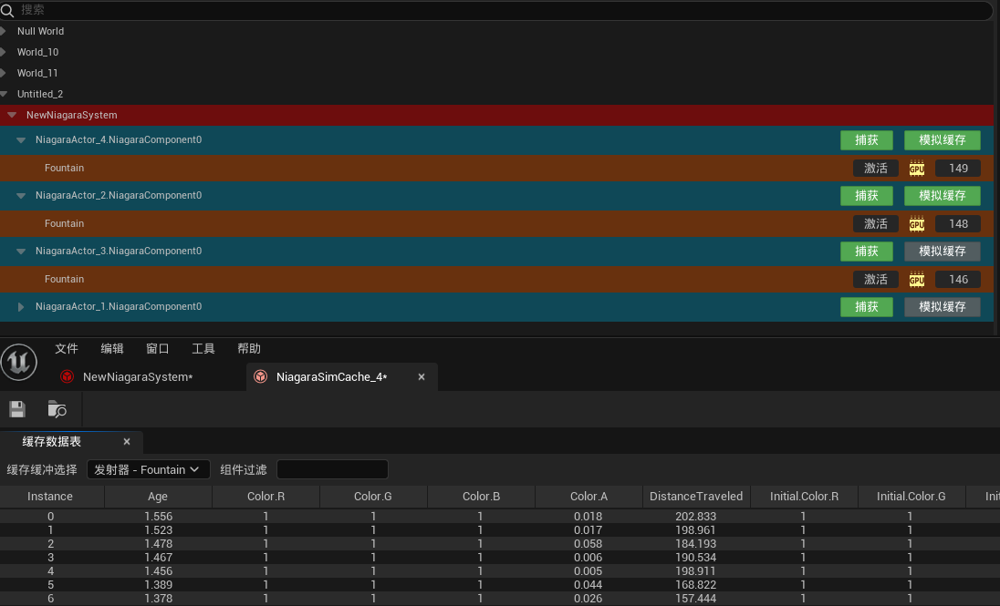

#### 性能

性能ビューでは、いくつかのテスト手段を提供しています：

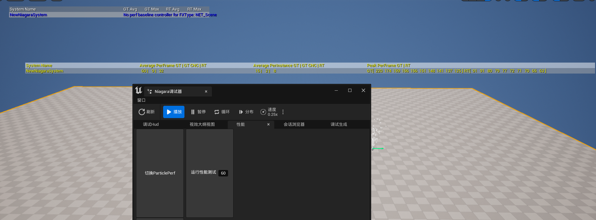

#### デバッグ生成

デバッグ生成はエフェクトパーティクルをSpawnするためのインターフェースを提供します。パーティクルシステムを設定した後、`システムを生成`をクリックするだけです（PIEモードである必要があります）：

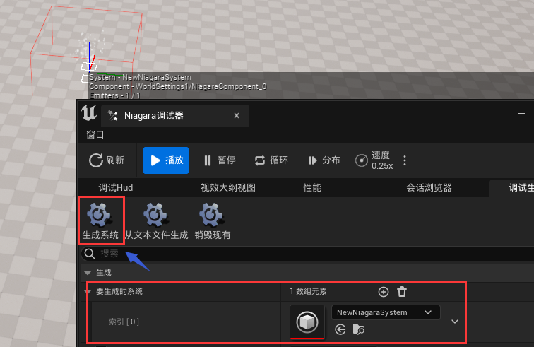

#### モジュール性能

Niagaraのエディターでは、各モジュールの時間消費状況を取得できます：

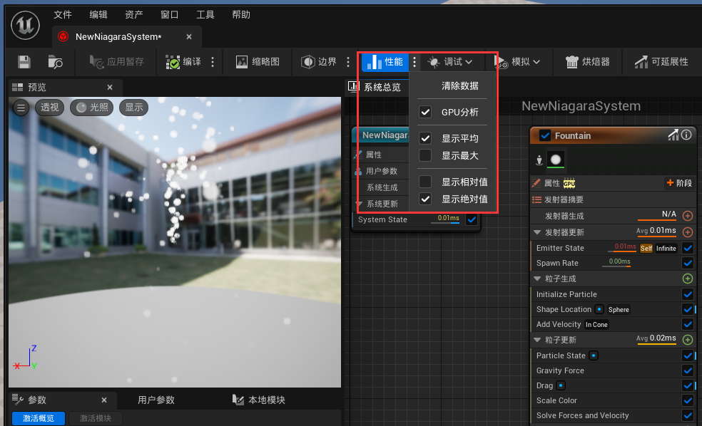

#### リソース占有

アセットのコンテンツメニューで`サイズマップ`をクリックして、参照されているテクスチャのサイズを表示できます：

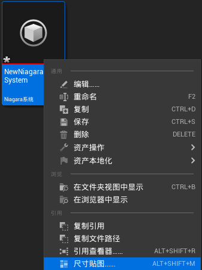

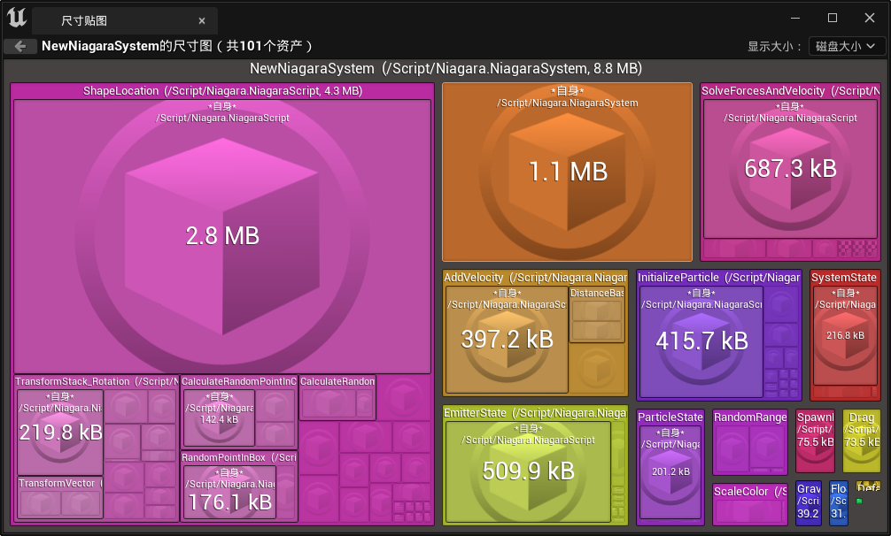

#### 問題点と提案

- Unreal Engine 5.1バージョン以前、Niagara Systemに **再コンパイルBUG** が存在しました。その現象は、ゲーム内で初めてパーティクルを生成すると、パーティクルシステム全体の再コンパイルがトリガーされることです。これは、Niagara System Editorでリソースを保存する際に、ゲームモードとは異なるいくつかの設定が保存され、パーティクルシステムのHashIDが一致せず、コンパイルキャッシュが無効になるためです。したがって、パーティクルシステムのゲーム環境での実行性能を評価する必要がある場合、筆者はパッケージ環境でテストすることを推奨します。
- Unreal EngineはNiagaraに非常に完善な付属ツールを提供していますが、大規模なチームにとっては使いやすいですが、管理しにくいです。筆者は上記のツールセットを基に、さらに拡張し、自動化プロセスを追加して、マクロなパーティクルシステム管理を完成させることを強く推奨します。
- マテリアルの最適化、モデルの簡略化、Overdrawの低減など、一般的なレンダリング最適化はNiagaraにも同様に適用されます。

### 制作最適化

後から手直しする過程で得られた最適化経験は非常に貴重であり、クリエイターがどのように性能に優れたパーティクルエフェクトを制作するかを徐々に理解することができます。

以下は、エフェクトアーティストの制作を最適化するのに役立ついくつかの心得です（主にGPUパーティクルに対応）。

#### 算力認知

`1920 x 1080`は現在のコンピュータディスプレイの一般的な解像度であり、これは画面に約 **200万** 個のピクセルが存在することを意味し、コンピュータが1フレームの画像を描画するために少なくとも200万回のピクセルレベルの数値処理を行う必要があることを意味します。現在の中級ハードウェアデバイスでは、1秒間に数百枚の画像を容易に描画できます。この驚くべき算力はグラフィックス処理ユニット（GPU）の高速な発展によるものです。中央処理ユニット（CPU）とは異なり、CPUはコンピュータのスケジューリングセンターであり、そのアーキテクチャはシステムのあらゆる面を考慮する必要がありますが、GPUは一方向に進む方法であり、そのアーキテクチャには大量の計算ユニットが組み込まれてグラフィックス演算のニーズを満たしています。

> 現在の最先端の消費者向けグラフィックスカード`GeForce RTX 4090`を例にとると、760億個以上のトランジスタ、16000個以上の計算コアを持っています。


この上限を明確にした後、`単一GPUパーティクル`を`ピクセル点`に簡単に対応させることができます。つまり、通常の中級グラフィックスカードでも百万級のパーティクル効果を容易にシミュレーションできます。

但し、百万級は通常システムの上限であり、すべての性能予算をパーティクルシステムに割り当てることはできないため、一般的には全体のパーティクル数が10万を超えると、全体のレンダリングシステムに性能圧力を与える可能性があります。

この10万個のパーティクルを対応する数の`1x1`ピクセル点に変換してタイリングすると、約`300x300`サイズの画像に対応します：


パーティクルシステムの **占屏面積** が **タイリング面積** に近いほど、性能が良いことを意味します（OverDrawが少ないため）。

以下は、平凡ですが14万個のパーティクル数を持つNiagaraSystemです。この大きな数に匹敵するべき表現効果を裏切っています：

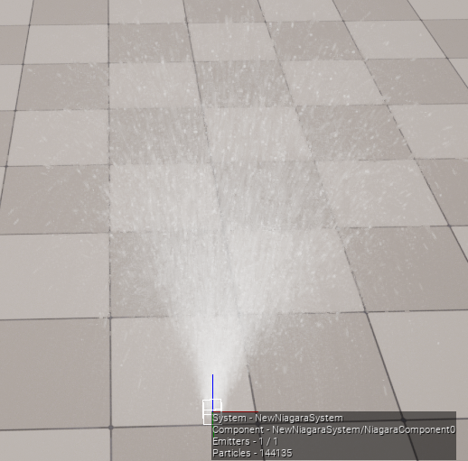

また、視野が遠ざかるにつれ、OverDrawがますます深刻になります：


> この問題はLODカーブを使用して距離に応じてパーティクル数を最適化することで解決できます。

#### 底层原理

Niagara自体はUEが提供するプログラマブルなデータプロセッサであり、NiagaraEditorではこのプロセッサの処理構造を自由に管理できます：

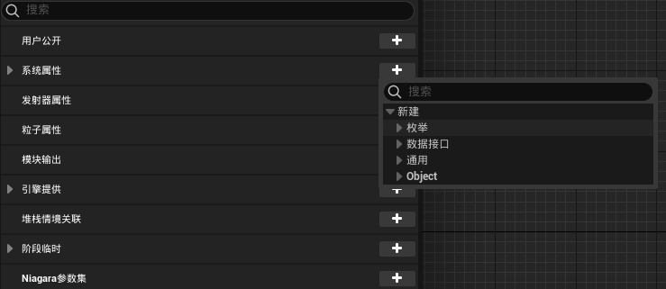

そして、各 **ステージ（Stage）** で、エンジンが提供する可視化ノードを使用して対応する **モジュール（Module）** を作成し、データの処理ロジックを制定できます：

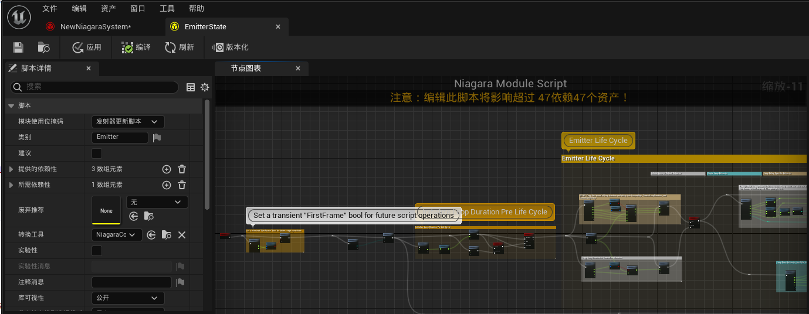

これらの可視化ノードロジックはComputerShaderのコードに翻訳されます：

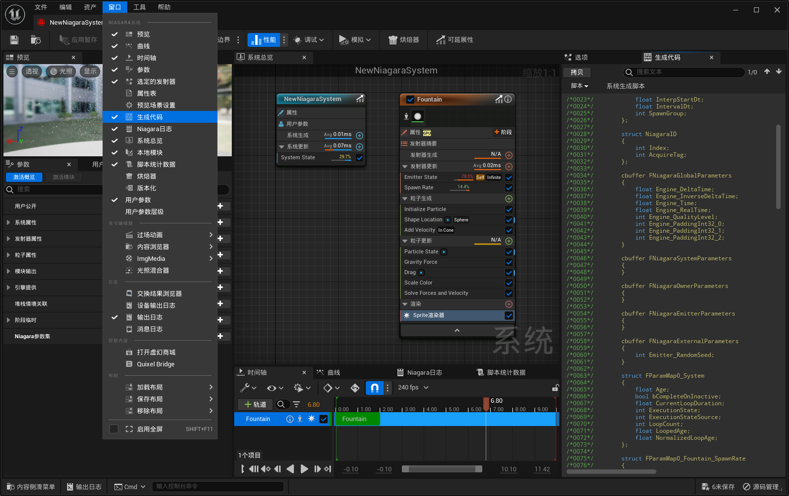

データ処理の結果は、レンダラーの対応する属性スロットにバインドされ、レンダラーがパーティクル効果の最終的な表現を完成させるために提供されます：

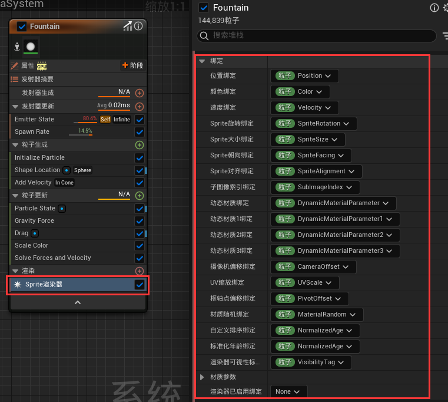

データ処理レベルから思考すると、私たちの鍵となる目標はどのように効率的なデータプロセッサを制作するかであるため、Niagaraの底层モジュールの原理を掌握することは、全体的な性能と効果の制御に非常に重要です。

ここに非常に優れたチュートリアルがあります：

- [[官方培训\]09-UE粒子基础 | 肖月 Epic bilibili](https://www.bilibili.com/video/BV1ea411V76f/?vd_source=e173296de020f10e8476ed443bbdfaed)

#### 序列帧烘培

Niagara Editorはパーティクルエフェクトを序列帧に烘培することをサポートしています。固定視点のエフェクトに対しては、この方案を採用して大幅な最適化を達成できます。

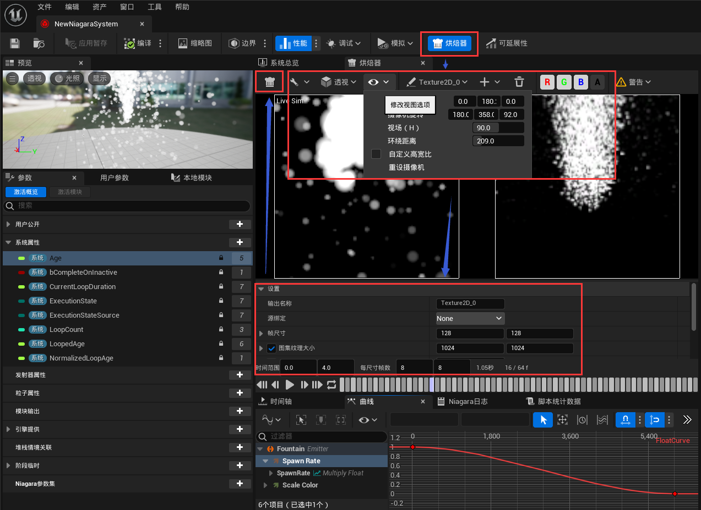

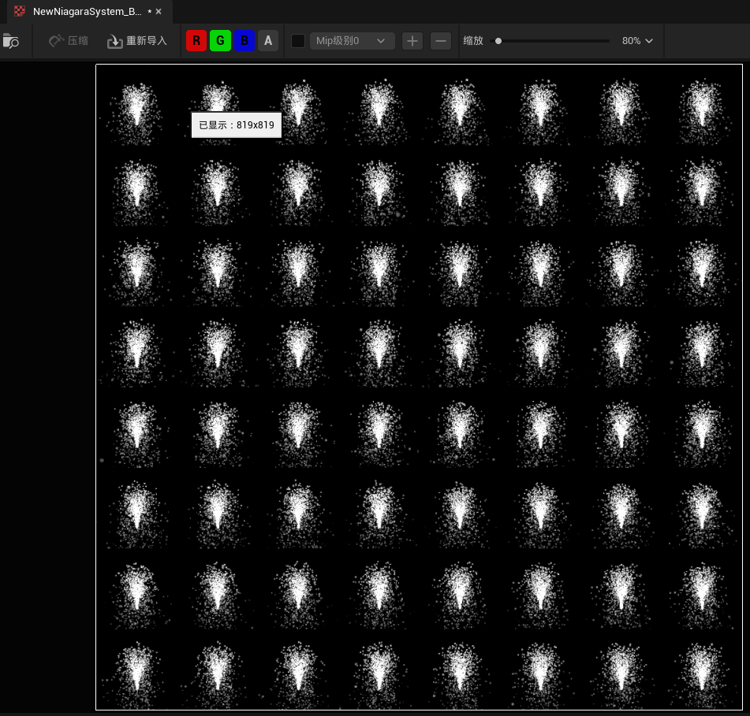

#### 程序化内容生成

パーティクルシステムは主に **大量** **動的** な物体のシミュレーションに **適用** されますが、特定のニーズがある場合にのみ、パーティクルシステムを使用して **リアルタイムのシミュレーション** を行う必要があります：

- インタラクティブな動的効果を制作する
- 視覚的な死角のない立体的な効果を作り出す必要がある
- 非常に大きな数量の大規模なクラスター

上記の使用シーンを除いて、通常は **静的マテリアルを烘培** することで所望の表現効果を達成できます。

したがって、パーティクル効果を制作する際には、パーティクルシステムを使用してリアルタイムのシミュレーションを行う必要があるかどうかを真剣に審視する必要があります。

必要がある場合は、さらに思考します：パーティクルシステムの中でリアルタイムに計算されるいくつかの段階を、すでにプレハブ化された静的データに置き換えることができるかどうか。

例えば、シーンに関連するエフェクトを制作する場合、パーティクルのシミュレーションにはいくつかのシーン情報を入力として必要とする可能性がありますが、これらのシーンデータの大多数は静的であるため、実行時にシーンの関連情報をリアルタイムで計算する必要はありません。エディターでこれらのデータを静的に生成できるため、少ない性能コストでシーンと高度に融合したエフェクトを制作できます。これはパーティクルシステムの数が多い場合に特に顕著な向上をもたらします。

また、Niagara上で **程序化内容生成（PCG）** のアセットを制作することもできます：

-   **Niagara System** の **ユーザーパラメータ（User Parameters）** で、パーティクルシステムが必要とするシーンデータを追加します（ここでは`SpawnPositionArray`という変数を追加しました）：

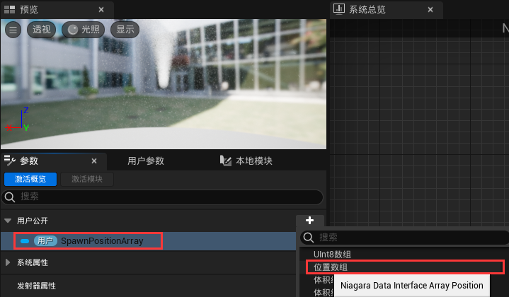

- 新しい **Actorブループリント** を作成し、 **NiagaraComponent** を追加し、 **Niagara System** を指定します。

- ブループリントの **BeginPlay** イベントで、Niagaraに追加したパラメータを設定し、パラメータ入力を `変数に昇格` します（`Partcile Spawn Position Array`）：

  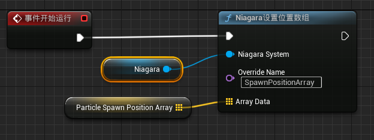

- ブループリントに関数（例えば`CalcParticleSpawnPositionArray`という名前）を追加し、 **Call In Editor** をオンにします。この関数でシーン情報を取得し（性能を気にする必要はなく、Actorをスキャンしたり、レイを打ったりできます）、ブループリント変数の値（`Partcile Spawn Position Array`）を填充します：

  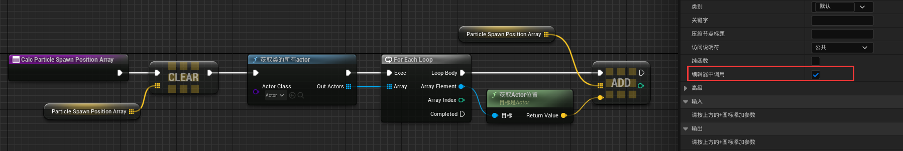

- ブループリントをシーンに配置すると、その詳細パネルで、以前に作成した関数がクリック可能なボタンになっていることがわかります：

  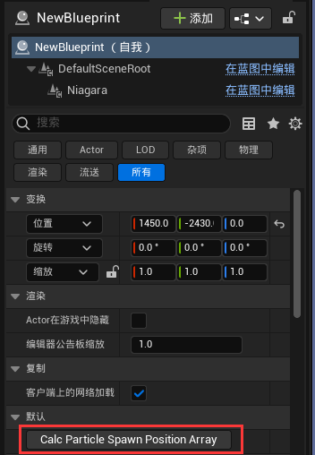

- ボタンをクリックすると対応する関数ロジックが実行され、ブループリント属性が填充されます。これらの属性値は保存時にシリアル化され、正常にゲームを起動するとBeginPlayが実行され、これらのデータがNiagaraに提交されます。
- その後、Niagaraで対応するModuleを作成してこの部分のデータを使用できます。

> 注意点：`CalcParticleSpawnPositionArray`で直接Niagaraのパラメータ値を設定することはできず、ブループリントの変数属性のシリアル化を借りてシーンデータを保存する必要があります。
>
> これは、Niagaraのパラメータを設定する関数（`NiagaraSet...`で始まる）が直接データをNiagaraのデータプロセッサにアップロードし、保存しないため、関数を通じてNiagaraのパラメータを設定しても、NiagaraSystemの詳細パネルでパラメータの変更が必ずしも表示されない（一部の属性タイプはエディターデータの戻り同期が行われるため、詳細パネルで変更が表示される）ためです。