# Fluid Ninja

**Fluid Ninja** は驚くべきインタラクティブな流体シミュレーションプラグインで、極めて低いパフォーマンス消費で圧倒的な効果を制作できます：

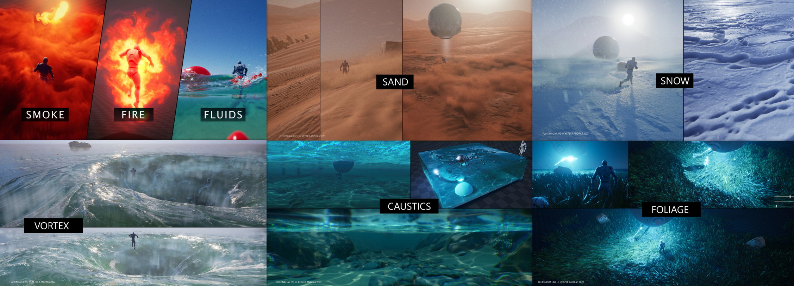

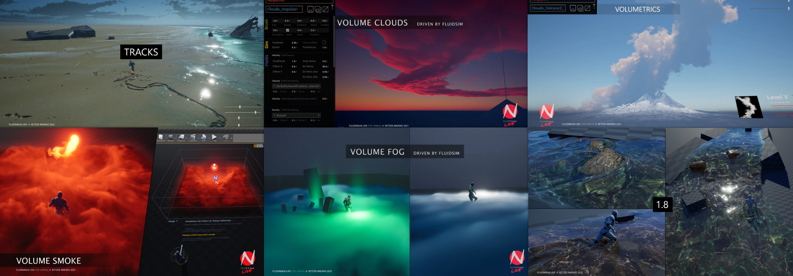

- 作者YouTube：https://www.youtube.com/c/AndrasKetzer
- ユーリアルマーケットプレイス：https://www.unrealengine.com/marketplace/en-US/product/fluidninja-live
- ディスカッションコミュニティ（Discord）：https://discord.com/invite/rgEtwua2tu

作者のYoutubeには多くの動画チュートリアルがあります：

- [FluidNinja LIVE - ALL IN ONE TUTORIAL and making FX from scratch - YouTube](https://www.youtube.com/watch?v=vXalfRAnXak&t=3869s)

- [FluidNinja 中国語講座 - 陶仁賢 ](https://space.bilibili.com/22866318/channel/seriesdetail?sid=2277642)

## 入手方法

学生ユーザーの場合、Fluid Ninjaの`Discordコミュニティ`から学生無料版をダウンロードできます：

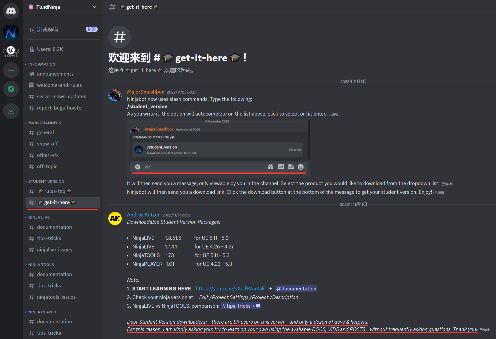

商用ユーザーの場合、ユーリアルマーケットプレイスでFluidNinjaプラグインを購入してください：

- https://www.unrealengine.com/marketplace/en-US/product/fluidninja-live

## サンプル

`Content/FluidNinjaLive/Tutorial/Levels/`に大量のサンプルレベルがあり、これらのレベルには詳細な説明文が含まれています：

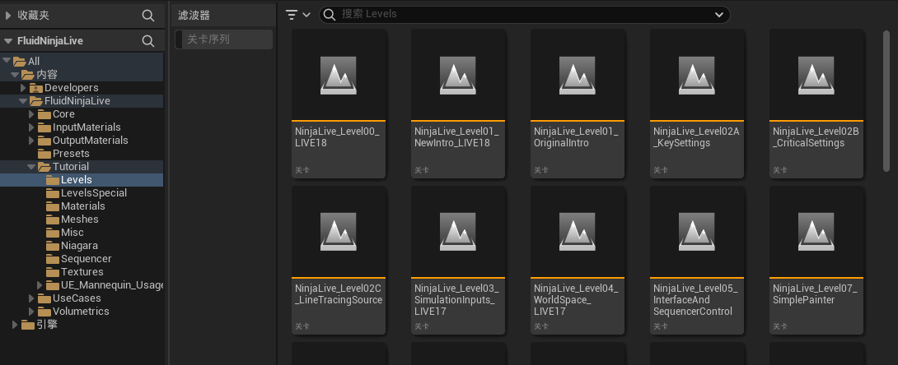

最良の学習方法は、これらのレベルを順番に再現し、パラメータ設定を理解することです：

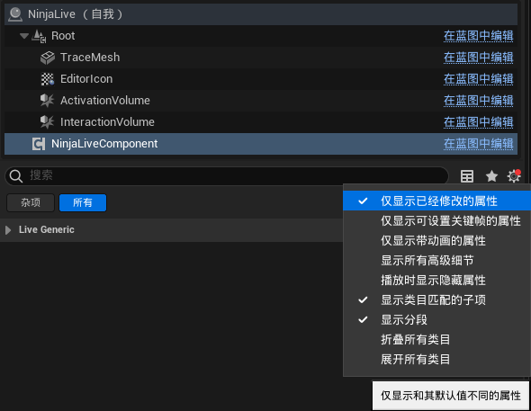

## 主要なBlueprint

### NinjaLiveComponent

NinjaLiveComponentはFluidNinjaのコアで、静的メッシュ（一般的にはパッチ、**トレースメッシュ（Trace Mesh）** と呼ばれる）を搭載する必要があります。流体シミュレーションの最終結果はトレースメッシュのマテリアルとして出力されます：

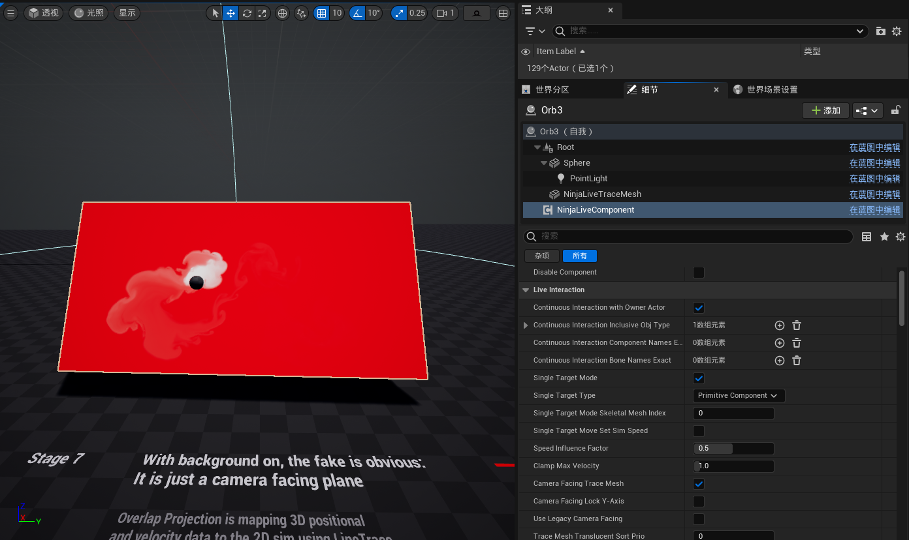

> 上図の赤いパッチがトレースメッシュです

### NinjaLive

NinjaLiveはFluid Ninjaが提供するデフォルトのActorで、NinjaLiveComponentのパラメータをラップし、大多数のケースに対応するトレースパッチを含んでいます。NinjaLiveComponentの設定を簡略化し、以下のような追加機能を提供します：

- ActivationVolumeを通じてNinjaFluidをカリング・スリープさせ、ActivationVolumeに入った場合にのみNinjaLiveComponentをアクティブにする
- InteractionVolumeを通じてより細かい粒度でインタラクション領域を設定する

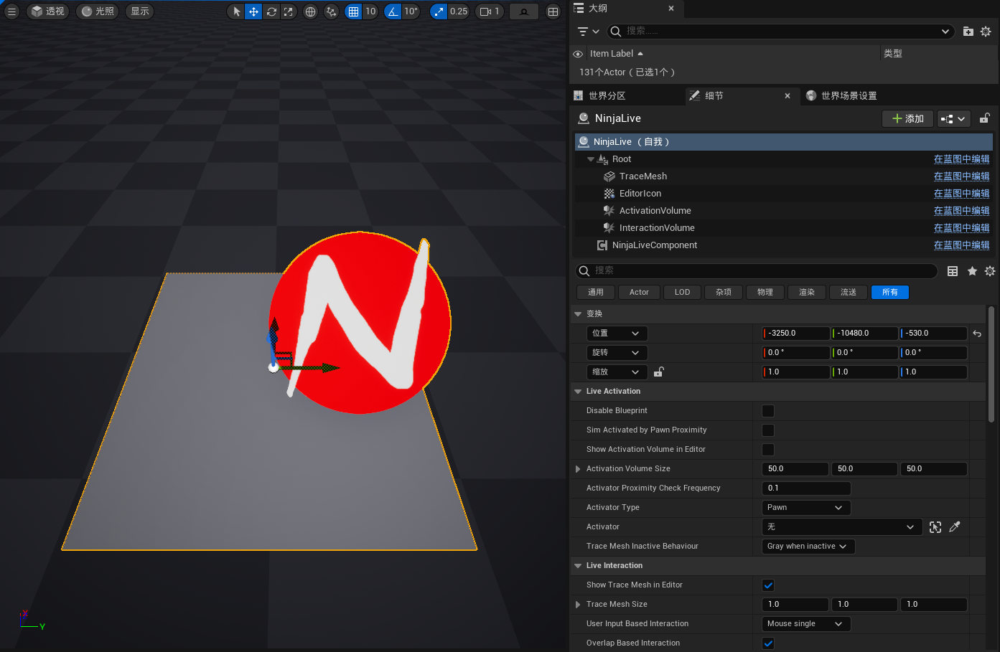

### NinjaLive_Utilities

NinjaLive_Utilities（Blueprint Actor）は以下のような便利なデバッグ機能を提供します：

- このBlueprintに最も近いプレイヤーを自動制御する
- マウスを表示する
- アンチエイリアス、デプスオブフィールド、モーションブラーの品質を調整する
- エディタの120FPS制限を解除する
- ...

このBlueprintをシーンにドラッグして設定できます：

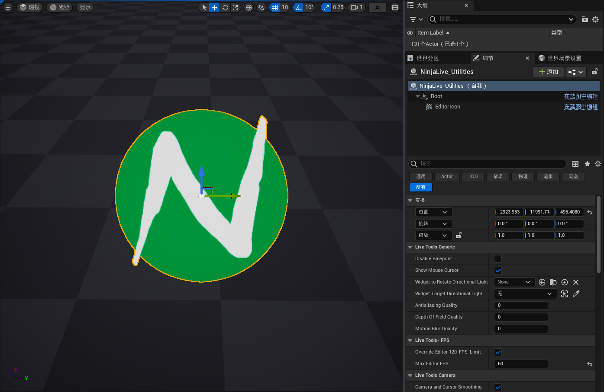

### NinjaLive_PresetManager

NinjaLive_PresetManager（Blueprint Actor）はNinjaLiveのパラメータプリセットを調整するために使用されます。

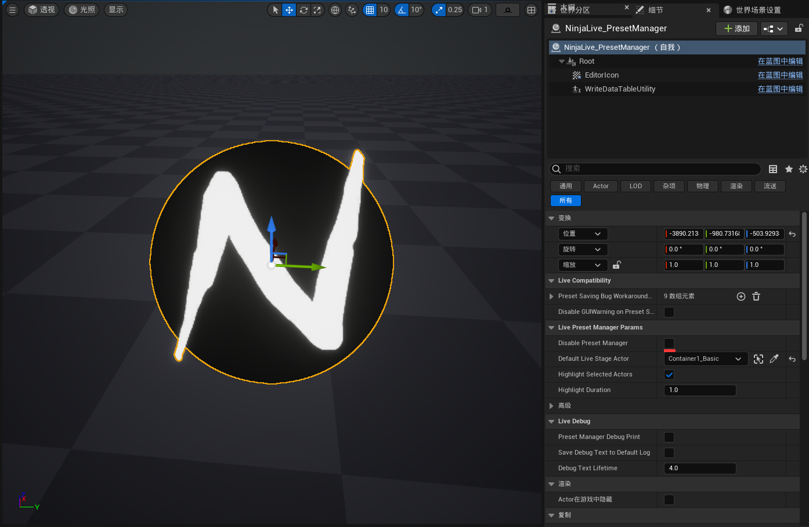

シーンにドラッグしてPIEを起動すると、以下のパネルが表示されます：

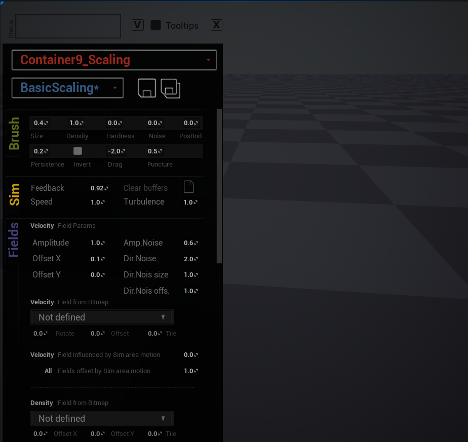

### NinjaLive_MemoryPoolManager

NinjaLive_MemoryPoolManager（Blueprint Actor）はFluidNinjaのメモリ戦略を設定するために使用されます。

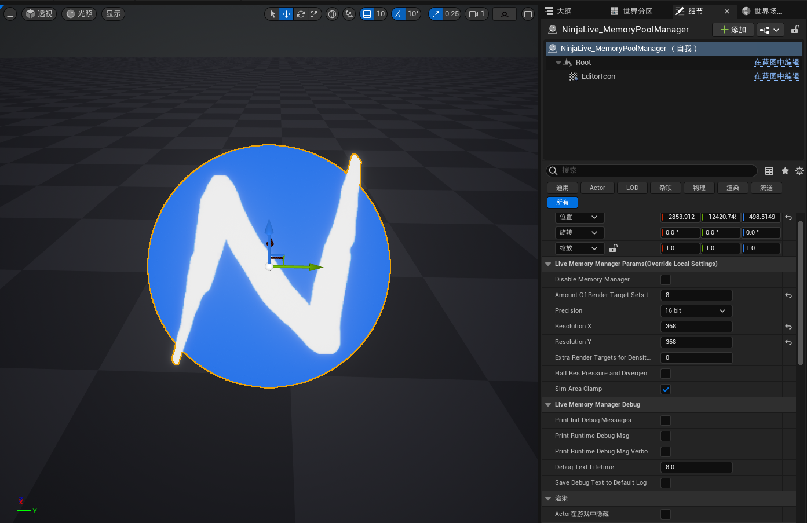

## シミュレーションプロセス

FluidNinjaのアセットディレクトリには、`Help`という名前のBlueprintがあります：

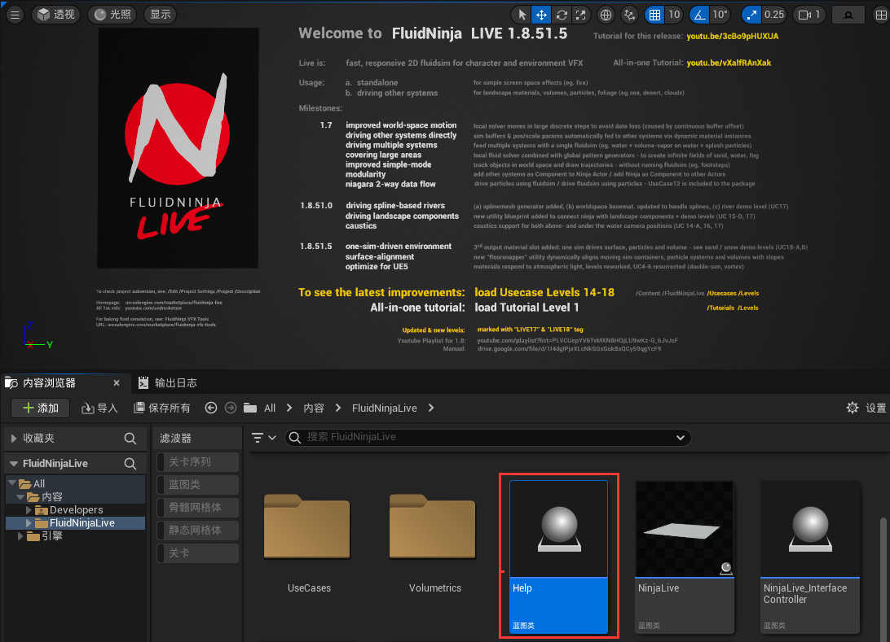

この中にFluid Ninjaシミュレーションのフローチャートが詳細に記述されています：

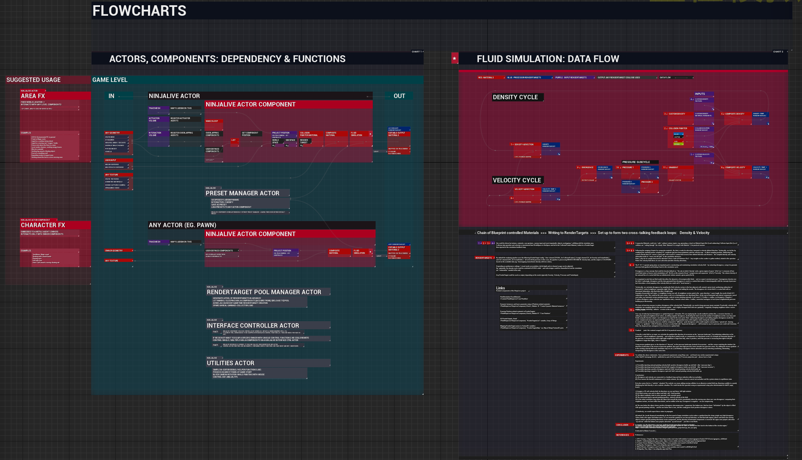

NinjaFluidのコアは以下の点にあります：

- **Density（密度）** テクスチャと **Velocity（速度）** テクスチャを構築する
- **ノイズ（Noise）** を重ねて流体のランダム性を高める
- **ブラシ（Brush）** を調整して流体の形状を制御する
- **出力マテリアル（Output Material）** を組み合わせる
- 最終結果を **トレースメッシュ（Trace Mesh）** のマテリアル表面に出力する
- 所望の結果を得る：

- Densityはシングルチャンネルテクスチャで、値域は[0,1]で、現在位置の流体密度を表します。
- Velocityはデュアルチャンネルテクスチャで、値域は[0,1]で、現在位置の流体のベクトル速度を表します。[0,1]に正規化されているため、速度0は実際にはRG値(0.5,0.5)に対応します。上図では：
  - VelocityテクスチャのRチャンネルは水平速度に対応し、値が`<0.5`の場合流体は左に、`>0.5`の場合右に流れます
  - VelocityテクスチャのGチャンネルは垂直速度に対応し、値が`<0.5`の場合流体は上に、`>0.5`の場合下に流れます
- FluidNinjaは3チャンネルマテリアルの入力を許可し、RGチャンネルはVelocityを、BチャンネルはDensityを表します

## 使用フロー

制作プロセスでは、本質的に **NinjaLiveComponent** を操作することになり、その **設定項目カテゴリ（Categories）** は以下の通りです：

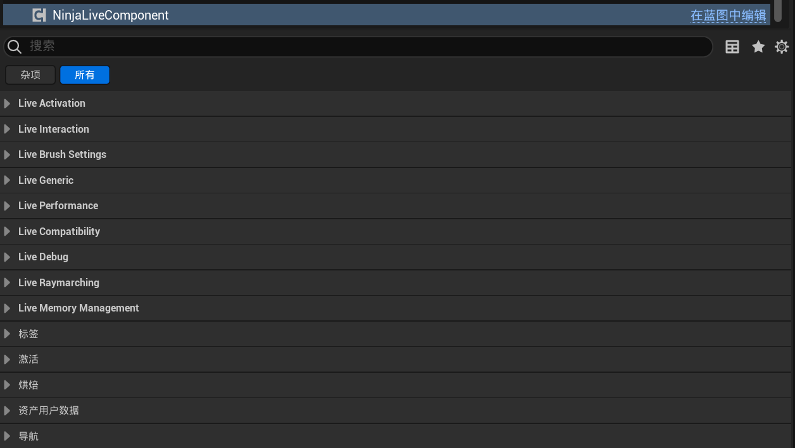

- `Live Activation` ：Disable Componentオプションのみが存在し、Blueprintを通じて動的に設定してカリングできます。
- `Live Interaction` ：インタラクションに関するすべての設定、例えばインタラクション対象のフィルタリング、トレースメッシュの向き・ロック、ワールド座標オフセットなど。
- `Live Brush Setting` ：ブラシのパラメータ設定。
- `Live Generic` ：一般設定で、主に効果のプリセット、入力、出力を調整します。
- `Live Performance` ：パフォーマンス設定で、効果の反復回数、FPS範囲制限、LODなどを設定できます。
- `Live Compatibility` ：互換性設定で、コリジョンチャンネル、入力の上書きなどを設定できます。
- `Live Debug` ：デバッグ設定で、ヒント情報を印刷するためのいくつかのチェックボックスが提供されます。
- `Live Raymarching` ：Raymarchingを設定します。
- `Live Memory Management` ：メモリ管理を設定します。

### 入力の構築

ここでの入力は主に **密度（Density）** と **速度（Velocity）** を指し、関連する入力設定パラメータは主に **NiagaraComponent** の`Live Generic`カテゴリ下にあります。Fluid Ninjaの入力ソースは以下の種類があります：

- 静的テクスチャ
- 動的マテリアル
- シーンカメラキャプチャ
- レンダーターゲット（RenderTarget）
- ストリーミングビデオ
- マウス入力
- シーンインタラクション：静的メッシュ、動的メッシュ、スケルタルメッシュ、破壊可能オブジェクト...

> 上記の入力は独立しているわけではなく、共存可能です。FluidNinjaは複数の入力を混合します。詳細は`Help.uasset`のフローチャートを参照してください。

マップ`Content/FluidNinjaLive/Tutorial/Levels/NinjaLive_Level03_SimulationInputs_LIVE17.umap`には、NinjaFluid入力の完全なサンプルがあります。以下にこれらの入力のキーステップを記録します：

#### 静的テクスチャ（Texture）

静的テクスチャの入力設定はNinjaPresetデータテーブルにあります：

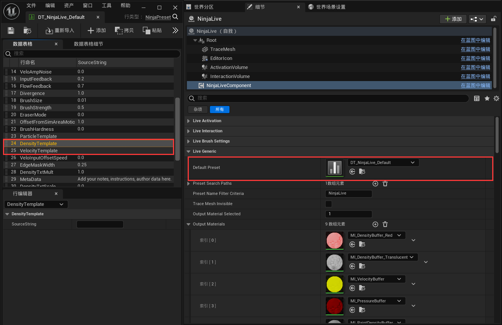

通常、データテーブルの内容を直接変更することはなく、 **テストレベル** で **NinjaLive_PresetManager** が提供するエディタパネルを利用してプリセットテーブルをエクスポートします：

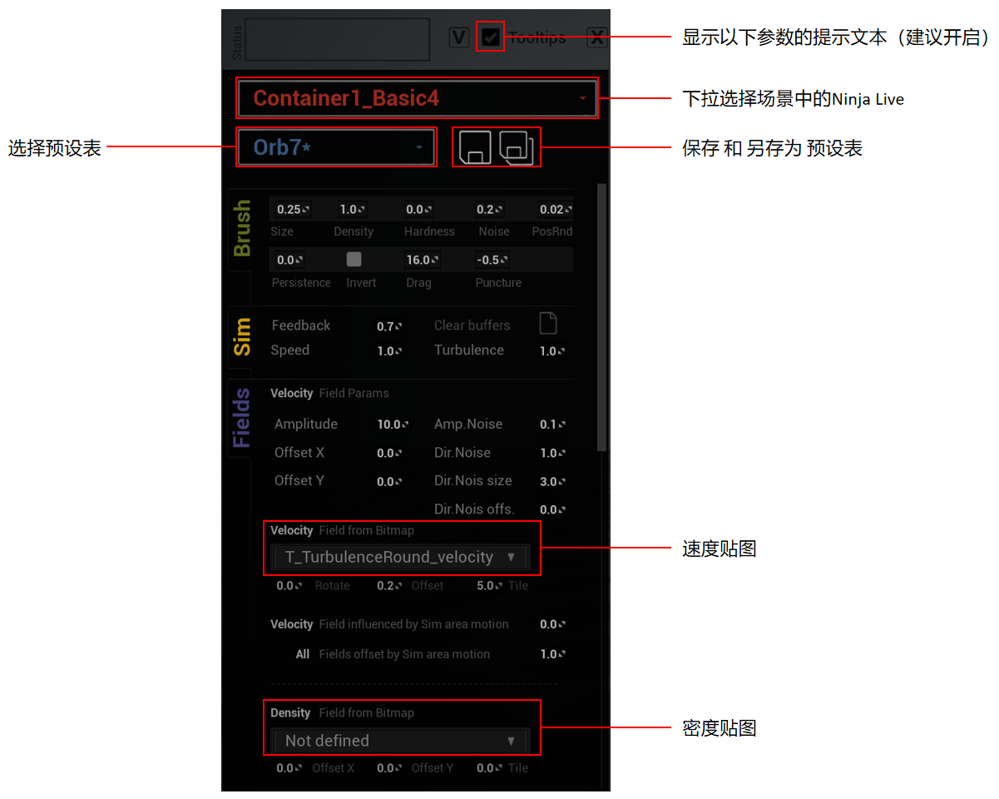

#### 動的マテリアル（Material）

マテリアルの入力設定は **NinjaComponent** の `Live Generic` カテゴリ下にあります：

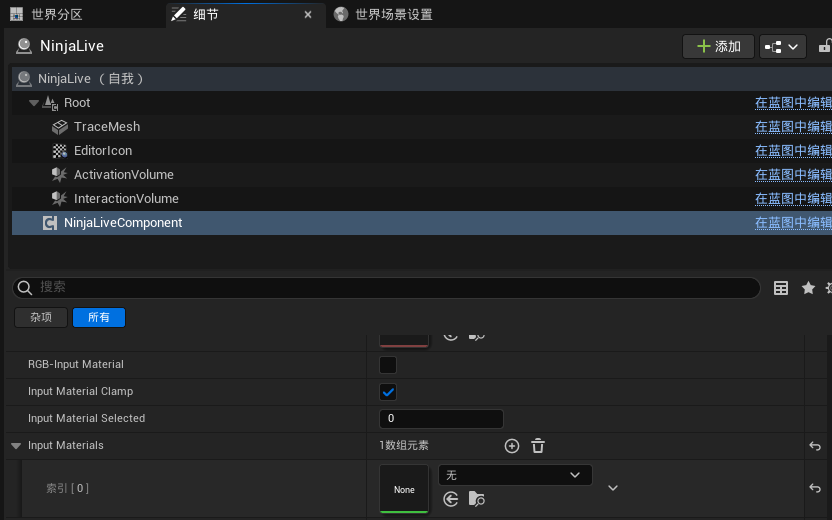

- **Input Materials** パラメータで使用可能な入力マテリアルを追加できます。複数追加することで、 **NinjaLive_PresetManager** で切り替えてプレビューできます。
- **Input Material Selected** インデックスを調整して、現在使用する入力マテリアルを選択します。
- **RGB-Input Material** をチェックすると、マテリアルのRGチャンネルがVelocityテクスチャとして、BチャンネルがDensityテクスチャとして使用されます。そうでない場合、 **デフォルトではマテリアルのRチャンネルのみがDensityテクスチャとして使用されます**
- **Input Material Clamp** をチェックすると、UV座標が[0,1]以外の画像がクリップされます。

Ninja Fluidの入力マテリアルには、`マテリアルドメイン`を`ポストプロセス`に設定し、`投影光線によるシャドウ検出`をオフにする必要があります：

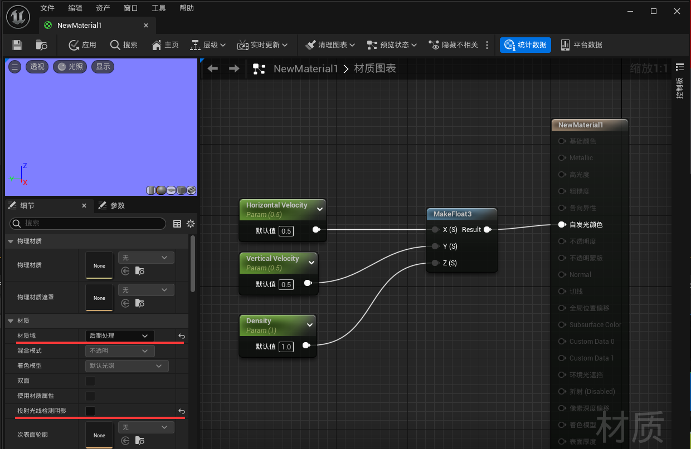

#### シーンカメラキャプチャ（Scene Capture 2D）

FluidNinjaはカメラを使用してシーンをキャプチャし、カメラ画面内の画像を流体シミュレーションの入力として使用できます。具体的な設定は **NinjaComponent** の `Live Generic` カテゴリ下にあります：

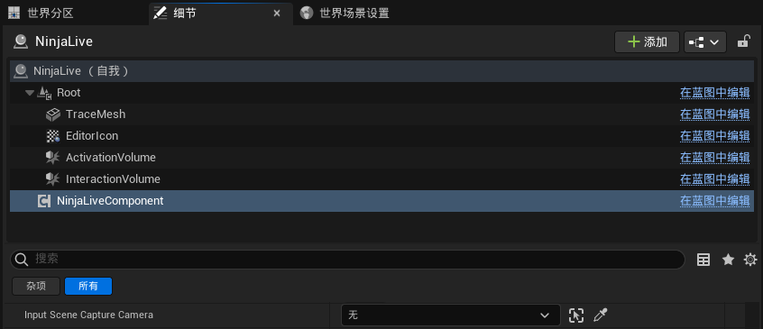

- **Input Scene Capture Camera** で現在シーンに存在するActorを選択できます

サンプル：

- **Ninja Live** 、 **Cube** 、 **シーンキャプチャ2D（Scene Capture 2D）** を作成し、カメラをキャプチャ対象のCubeに向ける

  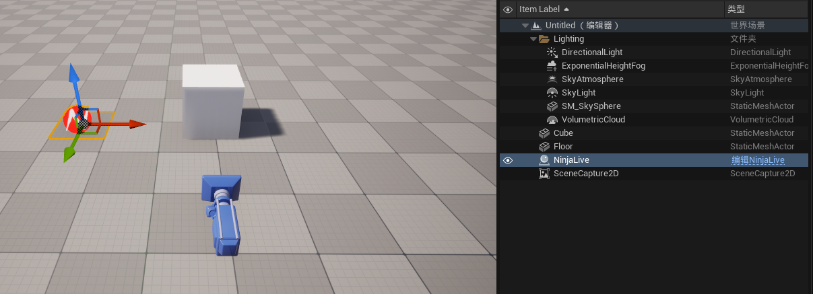

- **Ninja Live** の **Ninja Component** でシーンキャプチャ2Dを設定し、直感的なマテリアル出力を選択する：

  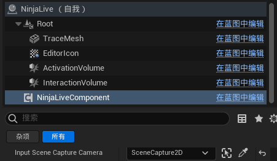

  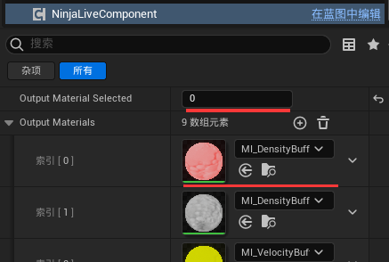

  - PIEを実行すると、以下の効果が見られます：

    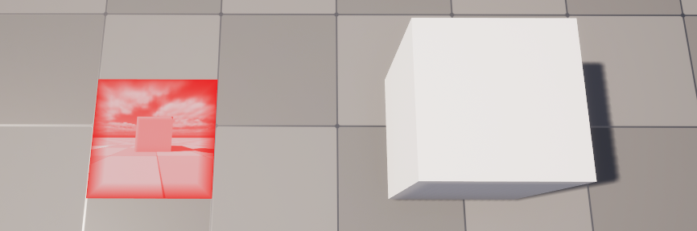

  - シーンキャプチャ2Dでキャプチャの設定（カメラのパラメータ、オブジェクトのフィルタリング...）を調整し、 **NinjaLive_PresetManager** を利用してパラメータ効果を調整できます：

    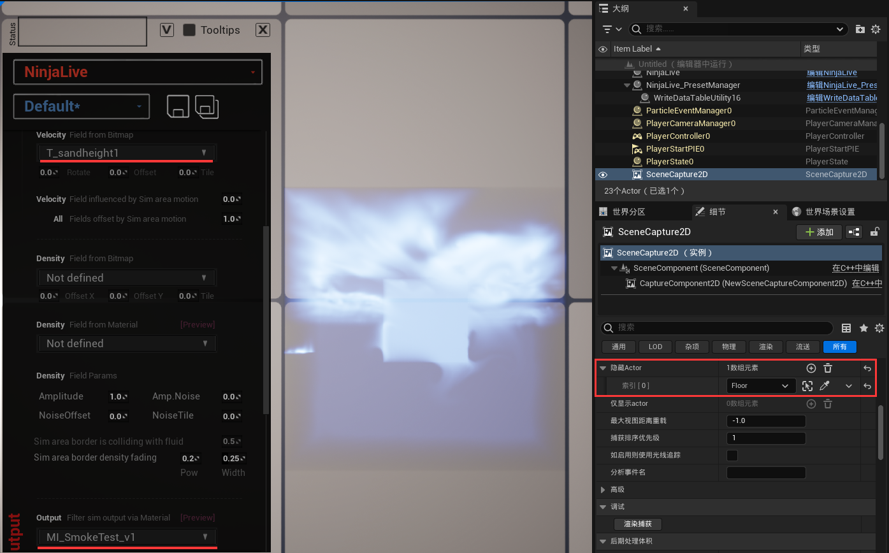

#### レンダーターゲット（RenderTarget）

マテリアルの入力設定は **NinjaComponent** の `Live Generic` カテゴリ下にあります：

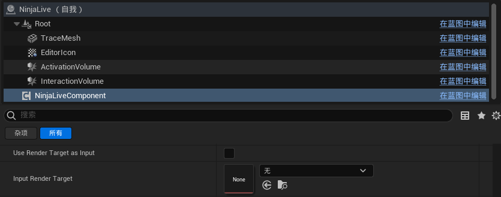

- **Use Render Target as Input** をチェックすると、下方の **Input Render Target** が流体シミュレーションの入力として使用されます
- **Input Render Target** は読み取るRender Targetを指定するために使用されます

Fluid Ninjaでは、この方案は **形状制御可能な3D流体** の制作に使用できます

Level3には以下のサンプルがあります：

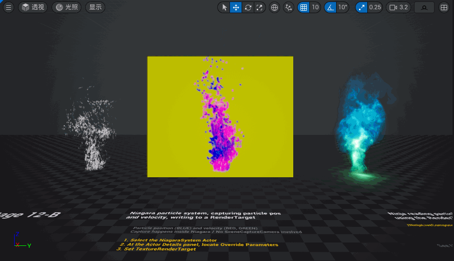

- 左側はNiagaraパーティクルシステム、中央は投影されたRT、右側はRT+出力マテリアルを利用して最終的に表示される効果です

サンプル：

- コンテンツブラウザで【Niagaraパーティクルシステム】を新規作成し、【既存システムからコピー】を選択する

  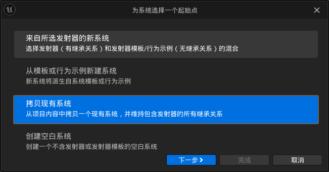

- `ライブラリのみ`のチェックを外し、`標準`カテゴリで **NS_ParticleCaptureBasic** を見つける：

  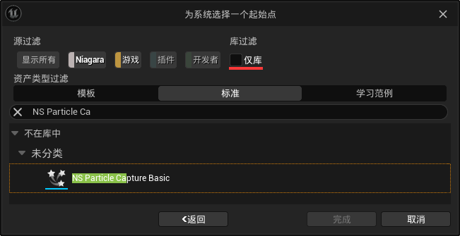

- 作成後パーティクルシステムを開くと、2つのデフォルトエミッタが含まれていることがわかります：

  - **NE_ParticleCaptureBasic** ：Emptyエミッタのパーティクルを、メッシュ座標を通じてRenderTargetにマッピングするために使用されます。AttributeReaderでどのエミッタをキャプチャするかを選択できます。
  - **Empty** ：シミュレーション用のパーティクルエミッタ

  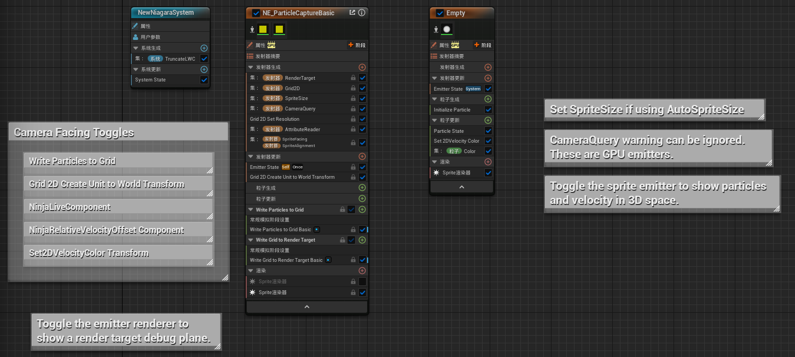

- 以下に発射速度（60）を設定し、四散するランダム初速度を追加すると、以下の効果が見られます：

  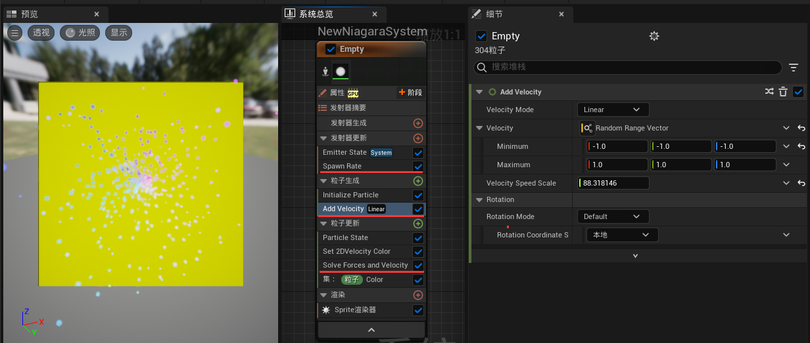

- **NE_ParticleCaptureBasic** はキャプチャしたパーティクルデータを利用し、すべてのパーティクルの座標に基づいて **「投影」** を一张RenderTargetに行います。ユーザーパラメータでこの投影プロセスの策略を設定できます：

  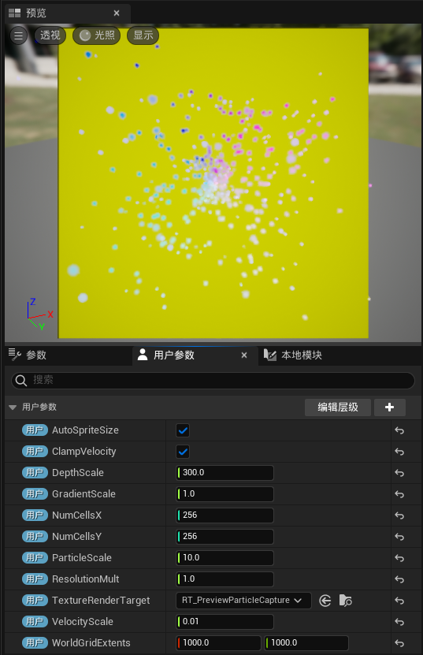

- ユーザーパラメータでは、デフォルトで`RT_PrevivewParticleCapture`をRT出力として使用します。これは他のパーティクルシステムと共用される可能性があるため、直接使用すると他のロジック（チュートリアルレベル）と衝突する場合があります。そのため、自身で一张RTを作成する必要があります：

  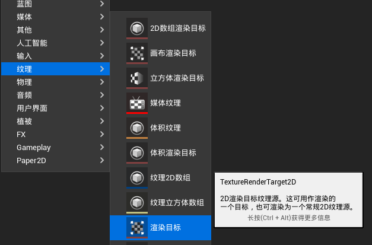

- NiagaraSystemのデフォルトパラメータで指定し、ユーザーパラメータを調整してRTのマッピング規則を理解します：

  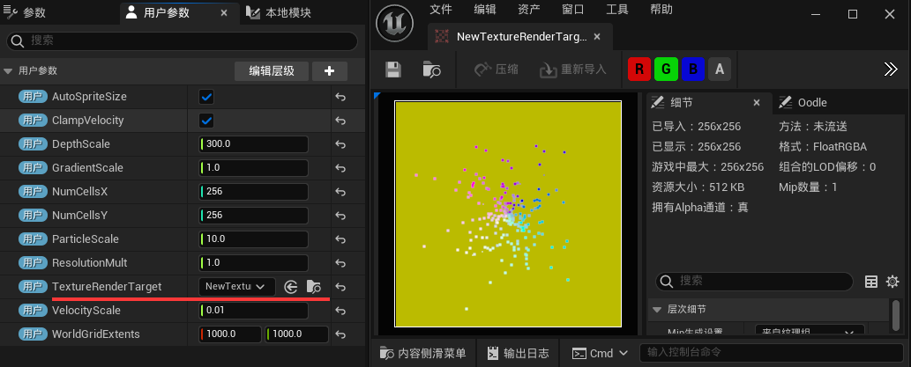

- 設定したNiagaraSystemをシーンにドラッグして配置し、シーンに浮かせてNinjaLiveActorを配置します。NinjaLiveの詳細パネルで`TraceMeshSize`を`(5,5,1)`に設定し、NinjaLiveComponentの詳細で`カメラ面向きトレースメッシュ（Camera Facing Trace Mesh）`をオンにし、RT入力をオンにして先ほど作成したRTを指定し、出力マテリアルを`MI_DensityBuffer_Red`に選択します：

  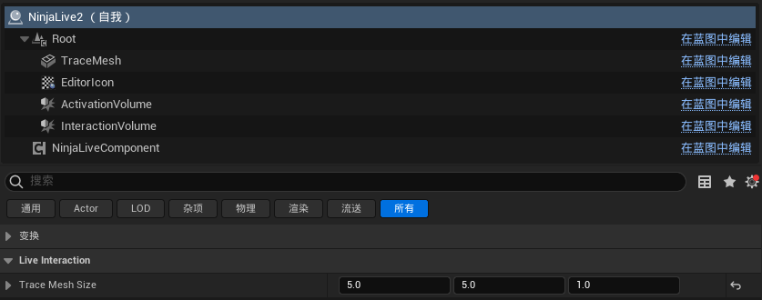

  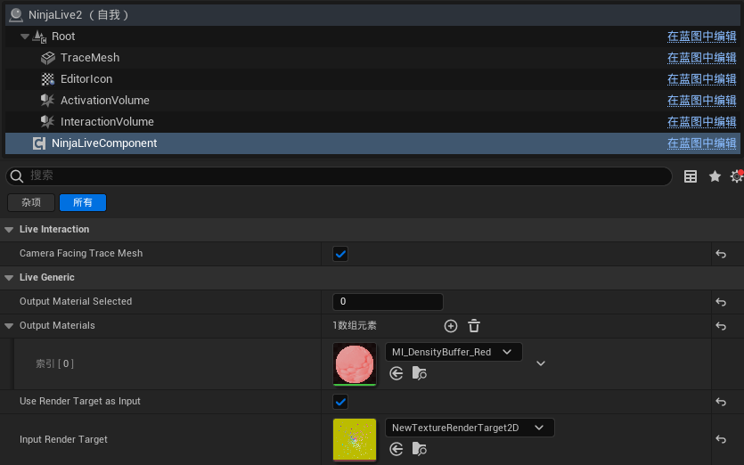

- PIEを起動すると、以下の効果が見られます：

  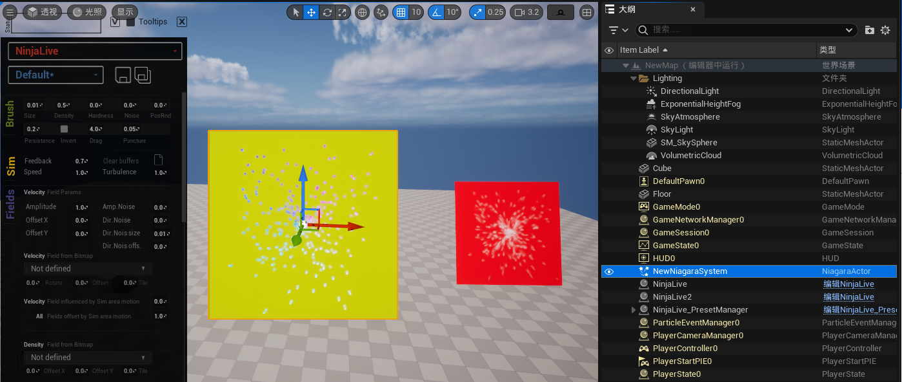

- 実際には、NiagaraSystemをレンダリングする必要はなく、シミュレーションデータだけが必要です。**NS_ParticleCaptureBasic** がデフォルトでオンになっているのはデバッグを容易にするためです。そのため、パーティクルエミッタのレンダラーをオフにできます：

  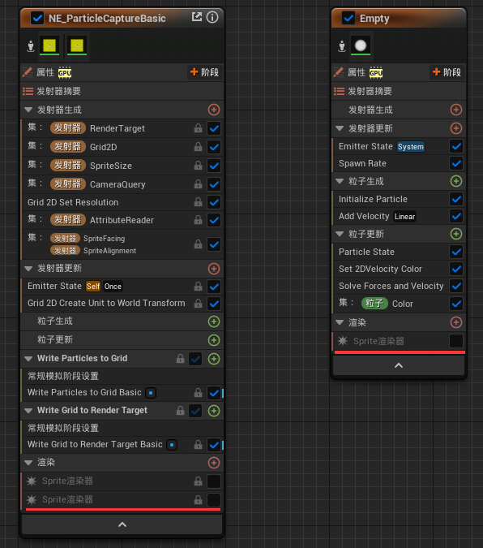

- さらに、RTのレンダリングもカメラ位置に依存するため、より正確な平面画像を取得するために、**NiagaraSystem** と **NinjaLive** の位置を重ね、適切な出力マテリアル効果を選択すると、以下のように表示されます：

  

#### ビデオ入力

ビデオファイルをNinjaFluidの入力として使用するには、以下の3つのパラメータを指定する必要があります：

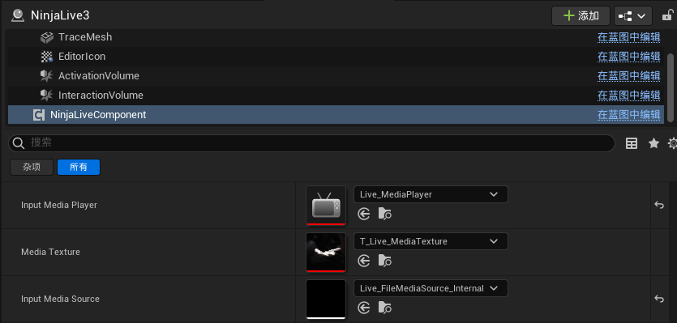

- **Input Media Player** ：ビデオプレーヤー
- **Media Texture** ：ビデオ描画に使用するテクスチャ
- **Input Media Source** ：ビデオ再生ソース

UEでビデオを再生する方法については、記事 https://zhuanlan.zhihu.com/p/135963353 を参照してください

サンプル：

- NinjaLiveActorを追加し、ビデオをDensity入力として指定し、上方向のVelocityテクスチャ`T_Crumple`を設定し、出力マテリアル`MI_Candle1`を組み合わせると、以下の効果が得られます：

#### ユーザー入力

NinjaLiveActorはデフォルトでマウス入力をオンにしており、その効果は以下の通りです：

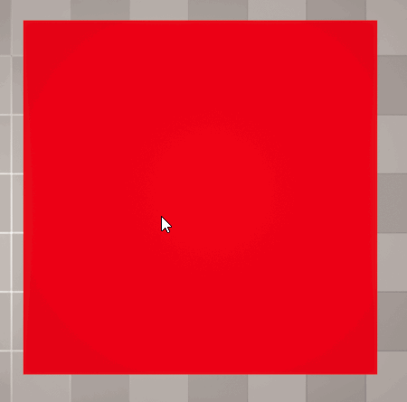

以下の場所でオフにできます：

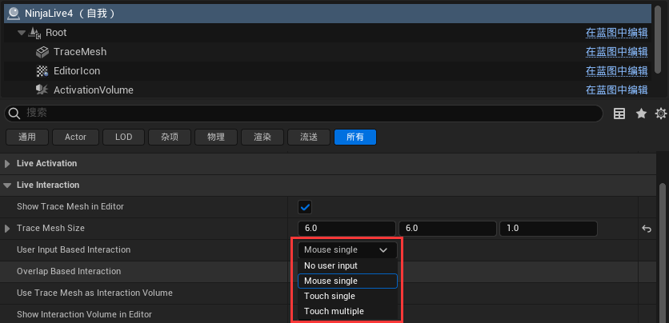

#### コリジョンインタラクション

Fluid Ninjaは物理コリジョンを入力として使用し、インタラクティブな流体効果を実現できます。簡単なサンプルは以下の通りです：

- NinjaLiveActorを追加する

  - `Trace Mesh Size`と`Interaction Volume Size`を`(5,5,1)`に設定する
  - NinjaLiveComponent\Live Brush Settingsを設定する。そうしないと、コリジョンブラシが小さすぎて結果が見えない場合があります
    - `Brush Scaled By Interacting Obj Size`をチェックする
    - `Primitive Obj Brush Scale`を20に設定する

- 小白人を追加すると、以下の効果が見られます：

  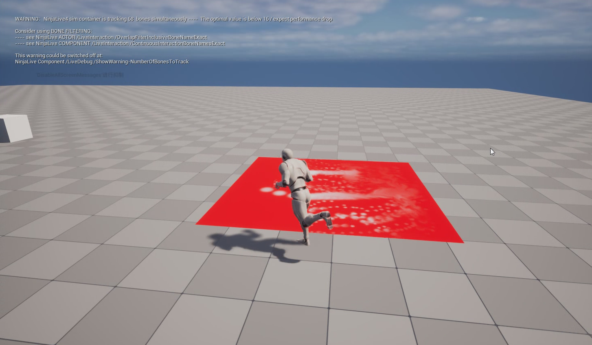

この効果はUEの物理コリジョンメカニズムによって実現され、その完全なパラメータはすべて `NinjaLiveComponent\Live Interaction` にあります：

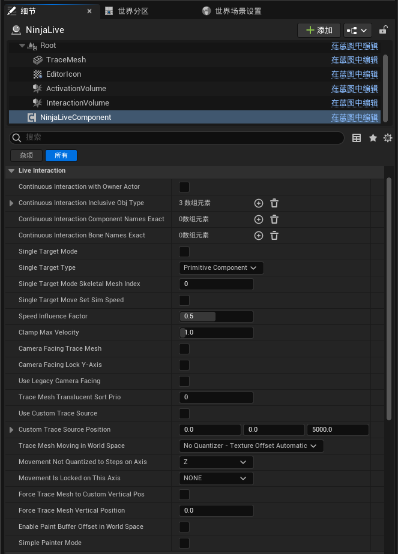

- **Continuous Interaction with Owner Actor** ：このコンポーネントを持つActorと持続的にインタラクションする
- **Continuous Interaction incluisve Obj Type** ：インタラクションするコリジョンオブジェクトタイプをフィルタリングする
- **Continuous Interaction Component Name** ：インタラクションするコンポーネント名をフィルタリングする
- **Continuous Interaction Bone Names Exact** ：インタラクションする骨格名をフィルタリングする
- **Single Target Mode** ：シングルターゲットモード。オンにすると、FluidNinjaはコリジョンによって生成された画像がすべて一つのターゲットから生成されたとみなし、コリジョンパスをスムーズにし、断層をなくすことができます（補間）
- **Single Target Type**
- **Single Target Mode Skeletal Mesh Index**
- **Single Target Move Set Sim Speed**
- **Speed Influence Factor** ：速度影響因子
- **Clamp Max Velocity** ：最大速度を截断する
- **Camera Facing Trace Mesh** ：TraceMeshが常にカメラを面向く
- **Camera Facing Lock Y-Axis** ：カメラのY軸をロックする
- **Use Legacy Camera Facing**
- **Trace Mesh Translucent Sort Prio**
- **Use Custom Trace Source** ：カスタムトレースリソースを使用する。オンにすると、以下の位置をカメラ位置としてコリジョン検出を行う
- **Custom Trace Source Position** ：自動トレースリソースの位置
- **Trace Mesh Moving in World Space** ：TraceMeshがワールド空間にある
- **Movement Not Quantized to Steps OnAxis**
- **Movements is Locked on This axis** ：特定の軸の移動をロックする
- **Force Trace Mesh to Custom Vertical Pos**
- **Force Trace Mesh Vertical Position** ：TraceMeshの位置をロックする
- **Enable Paint Buffer Offset in World Spacing** ：ワールド空間でのペイントバッファオフセットを有効にする
- **Simple Painter Mode** ：単純なペイントモードで、コリジョン入力はない

**NinjaLiveActor** の場合、上記パラメータがさらにカプセル化され、以下のパラメータを調整できます：

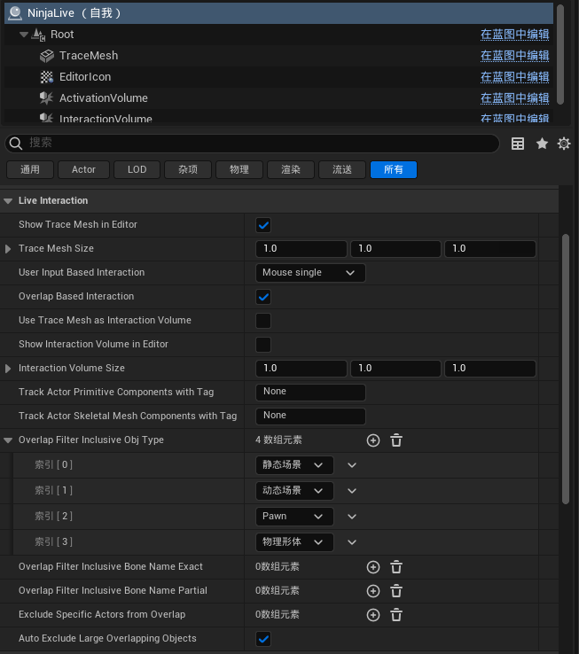

- **Overlap Based Interaction** ：コリジョンインタラクションを有効にする
- **Interaction Volume Size** ：インタラクションボリュームサイズ
- 以下のパラメータは **どのオブジェクトがインタラクションボリュームと「作用」できるか** をフィルタリングするために使用されます。
  - **Track Actor Primitive Components With Tag** ：このタグを持つコンポーネントを追跡する
  - **Track Actor Skeletal Mesh Components With Tag** ：このタグを持つスケルタルメッシュコンポーネントを追跡する
  - **Overlap Filter Inclusive Obj Tab** ：含めるオブジェクトコリジョンタイプ
  - **Overlap Filter Inclusive Bone Name Exact** ：含める骨格名。空の場合、すべての骨格が処理される
  - **Overlap Filter Inclusive Bone Name Partial** ：含める骨格名フィールド。例えばFootを入力すると、Footを含むすべての骨格名が含まれる
  - **Exclude Specific Actors from Overlap** ：オーバーラップから除外する特定のActorタイプ
  - **Auto Exclude Large Overlapping Objects** ：大きなオーバーラップオブジェクトを自動的に除外する

### ブラシの調整

ブラシはFluidNinja入力テクスチャの作用領域のスケール因子を制御するために使用され、そのパラメータ設定は以下の通りです：

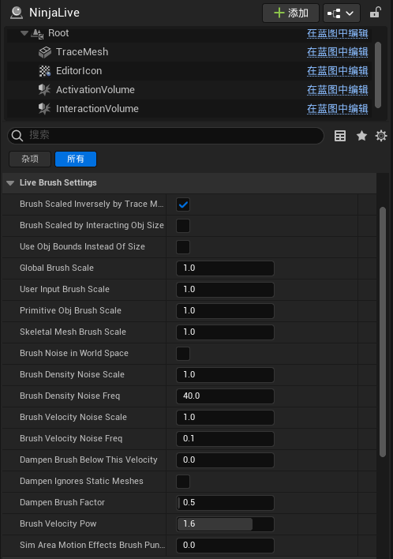

いくつかのキーパラメータ：

- **Brush Scaled Inversely by Trace Mesh Size** ：ブラシがトレースメッシュのサイズに応じてスケーリングされる
- **Brush Scaled by Interacting Obj Size** ：ブラシがインタラクションオブジェクトのサイズに応じてスケーリングされる
- **Use Obj Bounds Instead of Size** ：インタラクションオブジェクトの境界をブラシサイズとして使用する
- **Global Brush Scale** ：グローバルブラシスケール係数

> コリジョンインタラクションの効果がほとんど見えない場合、ブラシが小さすぎる可能性が高いです

### プリセット設定

プリセットテーブルには流体シミュレーションに関するパラメータが含まれています：

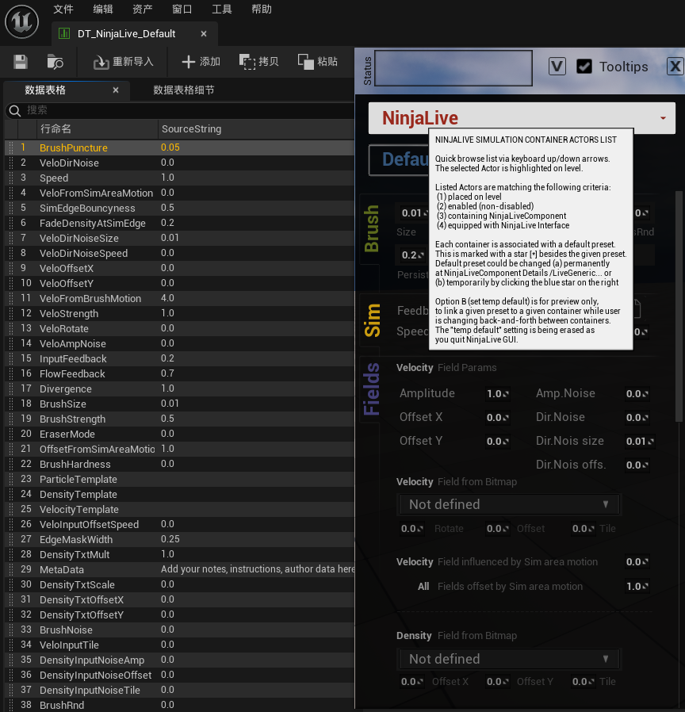

**NinjaLive_PresetManager** でパラメータのヒント情報を読み、調整して効果との関連性を理解します。パラメータ設定後、新しいテーブルとして保存します。

### 出力マテリアル

FluidNinjaLiveのコンテンツディレクトリには、使用されるコアマテリアルが定義されています：

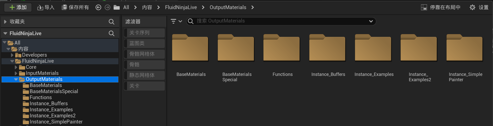

`Instance_*`フォルダ下のマテリアルインスタンスを直接使用できます

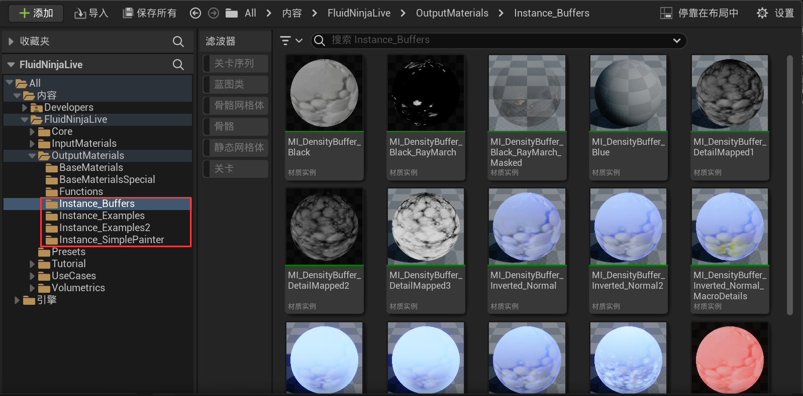

または、新しいマテリアルインスタンスを作成し、親をFluidNinjaが提供するベースマテリアル（ファイル名が`M_NinjaOutput_`で始まる）に設定します：

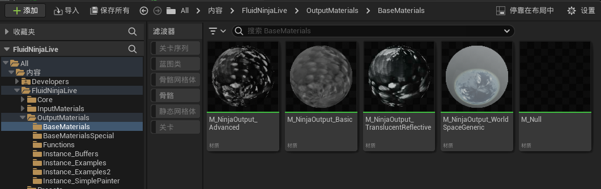

- **M_NinjaOutput_Basic** ：ベースマテリアル
- **M_NinjaOutput_Advanced** ：高度なマテリアル
- **M_NinjaOutput_TranslucentReflective** ：透明反射マテリアル
- **M_NinjaOutput_WorldSpaceGeneric** ：ワールド空間マテリアル
- ...

M_NinjaOutput_Basicを例にとると、多くの調整可能なパラメータプリセットが提供されています：

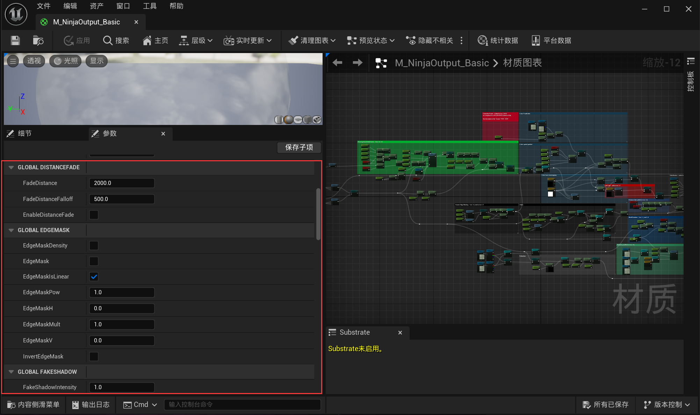

FluidNinjaのTutorialとUsercaseレベルには、参考になる多くのマテリアルサンプルがあります。具体的なパラメータの意味は、再現することで学習できます。

## まとめ

FluidNinjaのアイデアは巧妙で、使用するには少し手間がかかりますが、キーステップは明確です：

- シミュレーションプロセスに必要なDensity（密度）テクスチャとVelocity（速度）テクスチャを構築し、適切なブラシとプリセットを使用し、対応するマテリアルを組み合わせて最終的に所望の効果を表示します。

### 优缺点

- FluidNinjaは2Dパッチを使用して3D視覚効果を偽装し、通常のパーティクル流体シミュレーションよりもはるかに低いパフォーマンス消費です。しかし、十分にリアルな3D効果を偽装するには、十分にリアルな2D入力が必要です。そうでない場合、特定の視点からFluidNinjaのトレースメッシュパッチが容易に看破される可能性があります。
- FluidNinjaは流体の入力を構築する多くの方法（テクスチャ、マテリアル、RT、Niagara、カメラ...）を提供し、ほとんどの開発ニーズを満たすことができます。しかし、細部が多く使用しにくく、所望の効果を自由自在に制作するには深い学習が必要です。
- FluidNinjaはパーティクルを完全に代替することはできず、**インタラクティブな** 流体シミュレーション（煙、炎、水など）により適しています。