# Unreal Engine 5 オープンワールド

筆者は以前、非技術的なオープンワールドの雑談を整理しました：

- [ゲーム開発雑談-オープンワールド - 知乎 / Italink](https://zhuanlan.zhihu.com/p/648572742)

この記事では、UE5を使用してオープンワールドを制作する際に注意すべき点と、直面する可能性のある問題についてより詳細に説明します。

## ワールドパーティション

UE5でオープンワールドマップを制作する場合、**パーティション（Partition）** と **ストリーミング（Streaming）** の概念を明確にする必要があります。ここに **必見！ 必見！ 必見！** のコンテンツがあります：

- [Unreal Engineで仮想ワールドを構築する | Unreal Engine 5.3ドキュメント (unrealengine.com)](https://docs.unrealengine.com/5.3/ja/ja/building-virtual-worlds-in-unreal-engine/)
- [Unreal Fest 2023 - Building Bigger](https://www.bilibili.com/video/BV1UC4y1V7jt)
- [[UFSH2023\]小さなシーンの作成から大世界の構築までのワークフローアップグレード | Chris Murphy Epic Games](https://www.bilibili.com/video/BV1GK4y1676a/)

また、分かりやすい解説動画もあります：

- [【UE地形】ワールドパーティション（World Partition）とは？ 使い方は？- bilibili](https://www.bilibili.com/video/BV1ik4y1A77p/)
- [UE5 World Partition Part 1 Concepts - YouTube](https://www.youtube.com/watch?v=fDgKV3SjDTI)

簡単に言えば、UEはマップを多数の **セル（Cell）** に分割し、**プレイヤー（ストリーミングソース）** の移動に伴って周囲のセルを **ストリーミング（Streaming）** します：

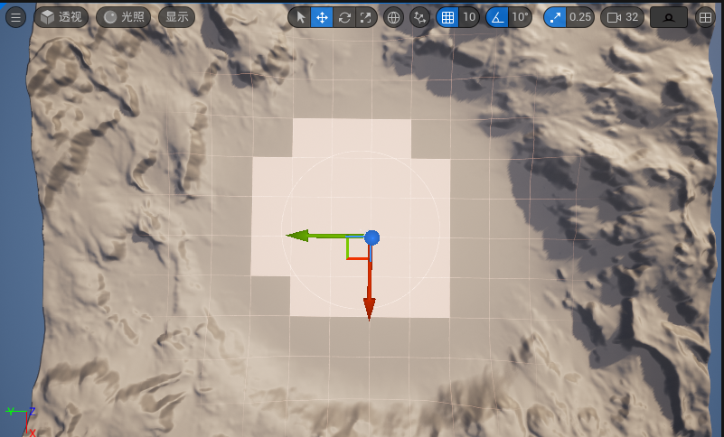

上図では4方向の分割しか見えませんが、実際にUEのワールドパーティションは **スパースクワッドツリー** 方式を採用してストリーミングを行い、複数のグリッドレベル（Level）を持っています。見えているのはLevel0だけです：

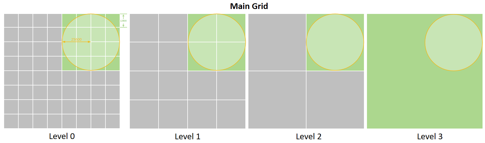

### パーティション

ワールドパーティションは、**オブジェクトのバウンディングボックス** に基づいて、どの **グリッドレベル（Grid Level）** の **セル（Cell）** に所属するかを決定します。

例えば、ワールドパーティション内に次のようなオブジェクトが存在し、赤色領域がそれらの **バウンディングボックス（Bound）** の **水平方向の面積（Area）** であるとします：


ワールドパーティションは分割時に、最も低いグリッドレベルから始めて、オブジェクトをその面積をちょうど包含できるセルに分割します。

したがって、上記のオブジェクト分布の最終的な分割状況は次のようになります：

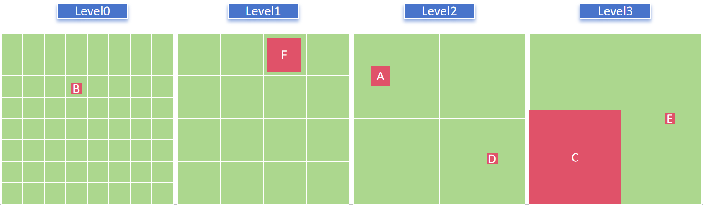

ここでパーティション関連のパラメータを設定できます：

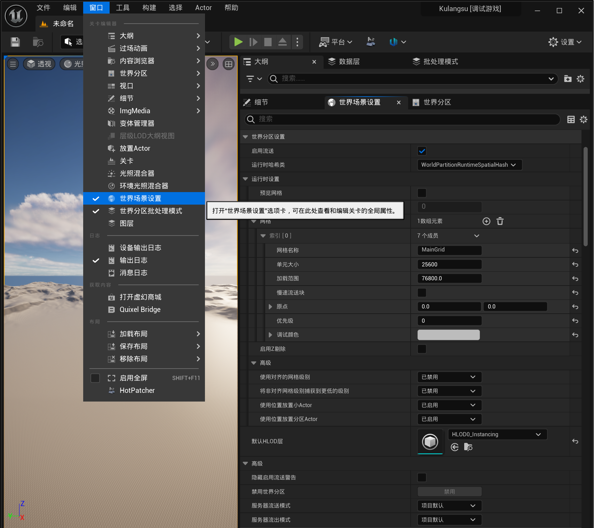

**プレビューグリッド** をオンにすると、エディタビューでシーンのストリーミングビューを確認できます：

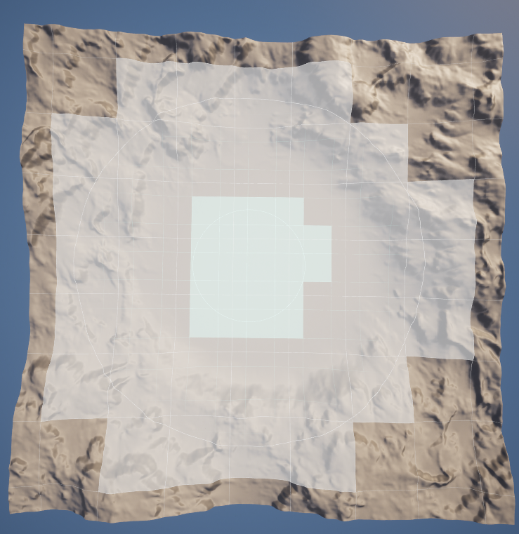

### ストリーミング

シーンに新規作成されたActorはデフォルトでストリーミングに参加し、アンロードされます。Actorの詳細パネルで関連設定を調整できます：

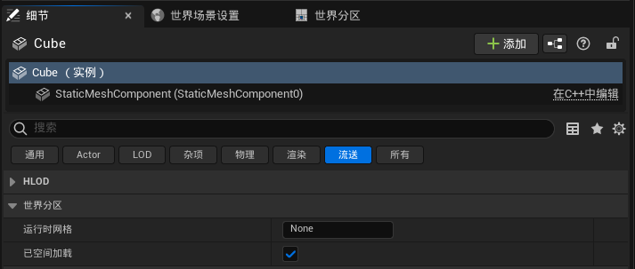

- **ランタイムグリッド** ：このActorが所属するワールドパーティショングリッド。Noneの場合は **MainGrid** に指定されます。
- **空間的にロード済み** ：オンにするとActorはワールドパーティションのストリーミングに参加し、オフにするとActorはシーン内で常にロードされ、ストリーミングに参加しません。

ワールドパーティションのストリーミングは **ストリーミングソース（Streaming Source）** によってトリガーされます。

ストリーミングソースに対応するC++インターフェースは **IWorldPartitionStreamingSourceProvider** です：

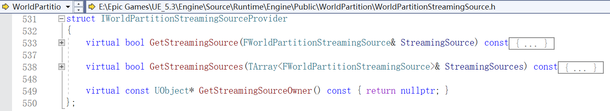

**プレイヤーコントローラ（PlayerController）** はデフォルトのストリーミングソースです：


人物がマップの右下隅にいる場合、上記の分割状況と組み合わせると、全体のロード状況は次のようになる可能性があります：

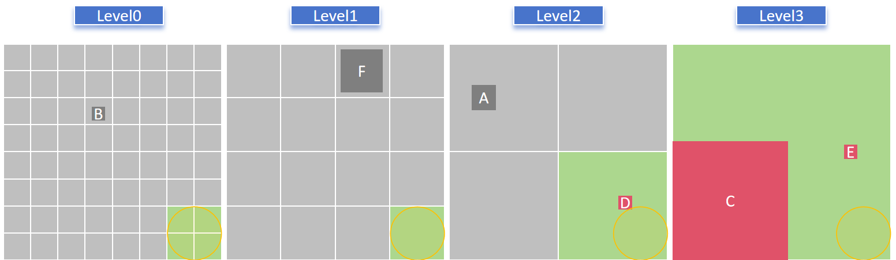

**ワールドパーティションストリーミングソースコンポーネント（WorldPartitionStreamingSourceComponent）** を使用して、他のActorもストリーミングソースにすることもできます：


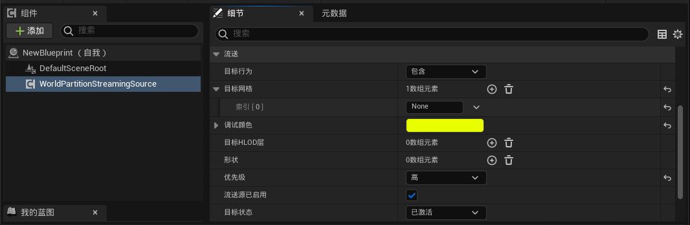

#### デバッグビュー

公式はストリーミングのプロセスをプレビューするためのコマンドを提供しています：

- `wp.Runtime.ToggleDrawRuntimeHash2D`

  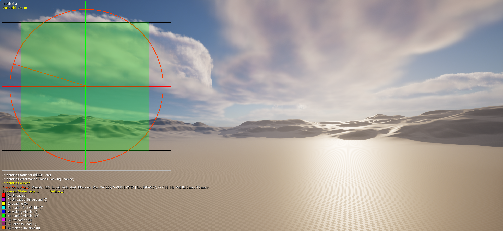

- `wp.Runtime.ToggleDrawRuntimeHash3D`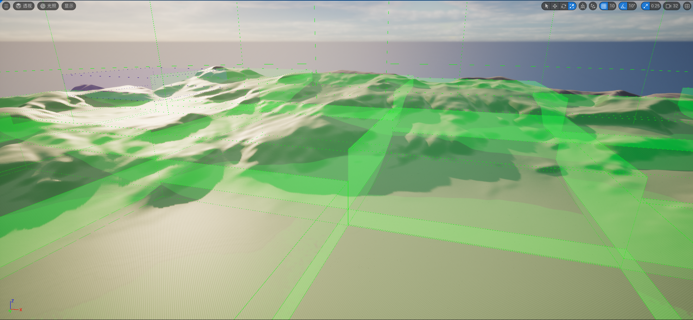

- プレビュービューを有効にした後：
  - コマンド `wp.Runtime.ShowRuntimeSpatialHashGridLevel ${LevelIndex}` を使用してプレビューするレベルを調整します。
  - コマンド `wp.Runtime.ToggleDrawRuntimeCellsDetails` を使用して、セルロードの時間を確認できます：

    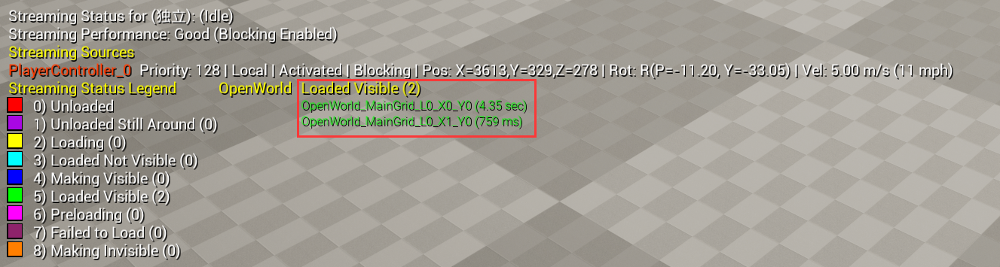

  - コマンド `wp.Runtime.ShowRuntimeSpatialHashCellStreamingPriority 1` を使用して、セルストリーミングの優先度ヒートマップを確認します：

    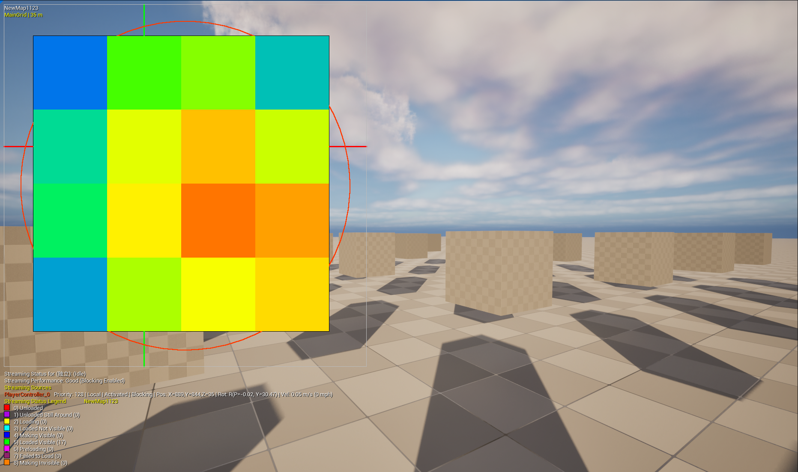

#### 重要な設定

##### マルチプレイ

マルチプレイ時、サーバーはデフォルトでストリーミングを有効にしておらず、シーンストリーミングはプレイヤーのローカル行為に過ぎません：

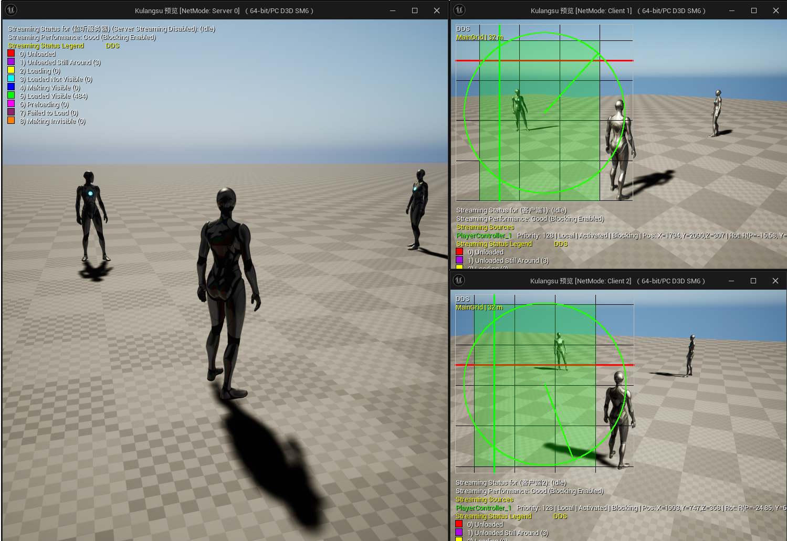

コマンド `wp.Runtime.EnableServerStreaming 1` を使用してサーバー上のストリーミングを有効にできます：

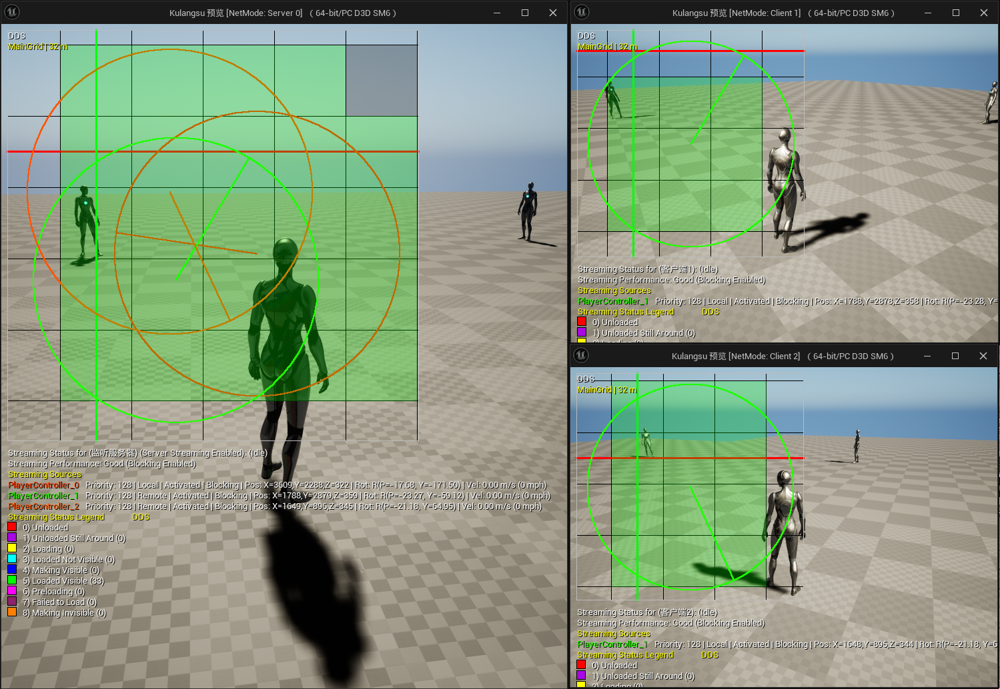

##### ストリーミング最適化

ワールドパーティションはデフォルトでストリーミング最適化を有効にしており、毎フレームストリーミング状態を更新するわけではありません。以下の設定で最適化戦略を調整できます：

- `wp.Runtime.UpdateStreaming.EnableOptimization true` ：デフォルトはtrueで、ストリーミング最適化を有効にします。
- `wp.Runtime.UpdateStreaming.ForceUpdateFrameCount 0` ：デフォルトは0で、固定フレーム数ごとにストリーミング状態を更新するよう設定できます。
- `wp.Runtime.UpdateStreaming.LocationQuantization 400` ：デフォルトは400で、移動距離が400を超えた場合にストリーミング状態の更新をトリガーします。
- `wp.Runtime.UpdateStreaming.RotationQuantization 10` ：デフォルトは10で、回転角度が10を超えた場合にストリーミング状態の更新をトリガーします。

### コードフロー

開発者にとって、ワールドパーティションのフローを深く理解することはプロジェクト全体の管理に不可欠です！美術スタッフはスキップ可能です。

ここでは主なステップをいくつか取り上げて説明します。

UEワールドパーティションのコア構造は **UWorldPartition** です。

これは **AWorldSettings** に格納されており、次の方法で取得できます：

```c++
UWorldPartition* UWorld::GetWorldPartition() const
{
	AWorldSettings* WorldSettings = GetWorldSettings(/*bCheckStreamingPersistent*/false, /*bChecked*/false);
	return WorldSettings ? WorldSettings->GetWorldPartition() : nullptr;
}
```

Actorのワールドパーティションへのサポートは主に、Actor基底クラスに追加された **エディタ下** の仮想関数によって実現され、ワールドパーティションのActor記述を作成します：

```c++
class AActor: public UObject
#if WITH_EDITOR
	virtual TUniquePtr<class FWorldPartitionActorDesc> CreateClassActorDesc() const;
#endif
}
```

サブクラスはこれをオーバーライドして、次のような構造を埋めることができます：

```c++
class FWorldPartitionActorDesc
{
	// 永続的
	FGuid							Guid;
	FTopLevelAssetPath				BaseClass;
	FTopLevelAssetPath				NativeClass;
	FName							ActorPackage;
	FSoftObjectPath					ActorPath;
	FName							ActorLabel;
	FVector							BoundsLocation;
	FVector							BoundsExtent;
	FName							RuntimeGrid;
	bool							bIsSpatiallyLoaded;
	bool							bActorIsEditorOnly;
	bool							bActorIsRuntimeOnly;
	bool							bActorIsHLODRelevant;
	bool							bIsUsingDataLayerAsset; // DataLayers配列がDataLayersアセットパスを表すか、非推奨版Data LayersのFNameを表すかを知るために使用
	FName							HLODLayer;
	TArray<FName>					DataLayers;
	TArray<FGuid>					References;
	TArray<FName>					Tags;
	FPropertyPairsMap				Properties;
	FName							FolderPath;
	FGuid							FolderGuid;
	FGuid							ParentActor; // 親との設定を検証するために使用（レイヤー/配置の互換性問題に警告）
	FGuid							ContentBundleGuid;
	
	// 一時的
	mutable uint32					SoftRefCount;
	mutable uint32					HardRefCount;
	UClass*							ActorNativeClass;
	mutable TWeakObjectPtr<AActor>	ActorPtr;
	UActorDescContainer*			Container;
	TArray<FName>					DataLayerInstanceNames;
	bool							bIsForcedNonSpatiallyLoaded;
};
```

エンジン内には多くのオーバーライドが存在します：

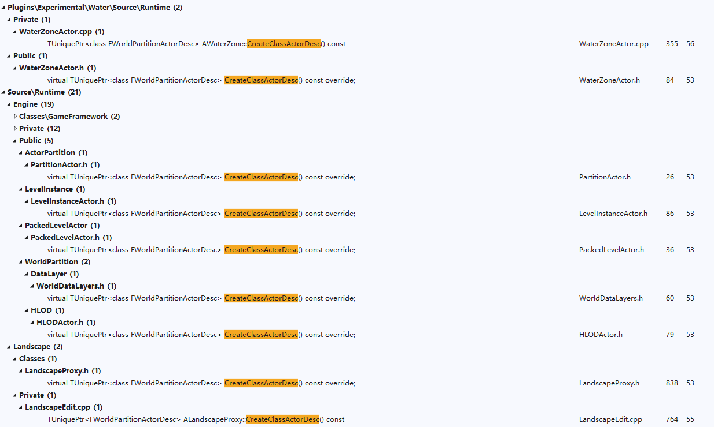

エディタ下でワールドパーティションマップに新しいActorを作成すると、**FWorldPartitionActorDesc** が自動的に作成されます：

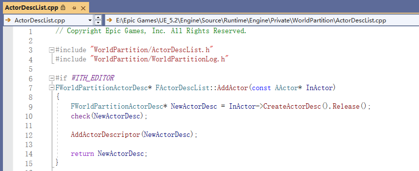

エディタ内で作成されたすべてのActorDescは **UWorldPartition** の `ActorDescContainer` に格納されます：

```c++
class UWorldPartition final 
    : public UObject
    , public FActorDescContainerCollection
    , public IWorldPartitionCookPackageGenerator
{

	UPROPERTY(Transient)
	TObjectPtr<UActorDescContainer> ActorDescContainer;		// ActorDescを格納するコンテナ、**MainContainer**とも呼ばれる

	UPROPERTY()
	TObjectPtr<UWorldPartitionRuntimeHash> RuntimeHash;		// Actorのパーティション分割戦略をカスタマイズするために使用

	UPROPERTY(Transient)
	TObjectPtr<UWorld> World;
};
```

`ActorDescContainer` は一時変数でシリアル化には参加しませんが、パッケージ化時に保存されます：

```c++
bool UWorldPartition::GatherPackagesToCook(IWorldPartitionCookPackageContext& CookContext)
{
	TArray<FString> PackagesToCook;
	if (GenerateContainerStreaming(ActorDescContainer, &PackagesToCook))
	{
		FString PackageName = GetPackage()->GetName();
		for (const FString& PackageToCook : PackagesToCook)
		{
			CookContext.AddLevelStreamingPackageToGenerate(this, PackageName, PackageToCook);
		}
		return true;
	}
	return false;
}
```

#### パーティション

**UWorldPartition** のActorパーティション分割戦略は `RuntimeHash` によって実現されます。エディタ下では、`RuntimeHash` はマップの起動時に毎回再分割され、パッケージ化時にも分割データがベイクされます：

```c++
bool UWorldPartition::PrepareGeneratorPackageForCook(IWorldPartitionCookPackageContext& CookContext, TArray<UPackage*>& OutModifiedPackages)
{
	check(RuntimeHash);
	return RuntimeHash->PrepareGeneratorPackageForCook(OutModifiedPackages);
}

bool UWorldPartition::PopulateGeneratorPackageForCook(IWorldPartitionCookPackageContext& CookContext, const TArray<FWorldPartitionCookPackage*>& InPackagesToCook, TArray<UPackage*>& OutModifiedPackages)
{
	check(RuntimeHash);
	return RuntimeHash->PopulateGeneratorPackageForCook(InPackagesToCook, OutModifiedPackages);
}

bool UWorldPartition::PopulateGeneratedPackageForCook(IWorldPartitionCookPackageContext& CookContext, const FWorldPartitionCookPackage& InPackagesToCook, TArray<UPackage*>& OutModifiedPackages)
{
	check(RuntimeHash);
	return RuntimeHash->PopulateGeneratedPackageForCook(InPackagesToCook, OutModifiedPackages);
}

UWorldPartitionRuntimeCell* UWorldPartition::GetCellForPackage(const FWorldPartitionCookPackage& PackageToCook) const
{
	check(RuntimeHash);
	return RuntimeHash->GetCellForPackage(PackageToCook);
}
```

エディタ下でオープンワールドマップを起動すると、`UWorldPartition::OnBeginPlay` が呼び出されます：

```c++
void UWorldPartition::OnBeginPlay()
{
	TArray<FString> OutGeneratedStreamingPackageNames;
	GenerateStreaming((bIsPIE || IsRunningGame()) ? &OutGeneratedStreamingPackageNames : nullptr);

	// GeneratedStreamingPackagesを準備
	check(GeneratedStreamingPackageNames.IsEmpty());
	for (const FString& PackageName : OutGeneratedStreamingPackageNames)
	{
		// UWorldPartition::IsValidPackageNameで時間を浪費しないようにメモリパッケージとして設定（PIEのGenerateStreamingはエディタワールドで実行）
		FString Package = FPaths::RemoveDuplicateSlashes(FPackageName::IsMemoryPackage(PackageName) ? PackageName : TEXT("/Memory/") + PackageName);
		GeneratedStreamingPackageNames.Add(Package);
	}

	RuntimeHash->OnBeginPlay();
}
```

この中の `GenerateStreaming` 関数はさらに `UWorldPartition::GenerateContainerStreaming` を呼び出し、この関数内で **MainContainter** から **すべてのContainterとActorDescを再帰的に検索** します。

一部のActorDescは自身のContainterを保持しており、**FLevelInstanceActorDesc** がその特例です。これはシーンに配置されたレベルインスタンスで、主なコード定義は次の通りです：

```c++
class FLevelInstanceActorDesc : public FWorldPartitionActorDesc
{
public:
	FLevelInstanceActorDesc();
	virtual ~FLevelInstanceActorDesc() override;

	virtual bool IsContainerInstance() const override;
	virtual bool GetContainerInstance(const UActorDescContainer*& OutLevelContainer, 
                                      FTransform& OutLevelTransform, 
                                      EContainerClusterMode& OutClusterMode) const override;
protected:
	FTransform LevelInstanceTransform;
	ELevelInstanceRuntimeBehavior DesiredRuntimeBehavior;
	TWeakObjectPtr<UActorDescContainer> LevelInstanceContainer;  // レベルインスタンスのActorDescContai
private:
	void RegisterContainerInstance(UWorld* InWorld);
	void UnregisterContainerInstance();
};
```

すべてのContainterとActorDescを収集した後、次の関数が呼び出されます：

```c++
bool UWorldPartitionRuntimeSpatialHash::GenerateStreaming(UWorldPartitionStreamingPolicy* StreamingPolicy,
                                                          const IStreamingGenerationContext* StreamingGenerationContext,
                                                          TArray<FString>* OutPackagesToGenerate);
```

この関数の主体フローは：

- シーン内のすべてのグリッド設定を収集（WorldSettingだけでなく、一部のActorも提供します。例えば **ASpatialHashRuntimeGridInfo** は主にHLODに使用されます）
- すべてのActorDescを走査し、ActorDesc内の `ランタイムグリッド（RuntmeGrid）` 設定に基づいて対応するGridの **FActorSetInstance** に分割
- 各Gridの **FActorSetInstance** に対して、次の関数を呼び出す：

  ```c++
  FSquare2DGridHelper GetPartitionedActors(const FBox& WorldBounds, 
                                           const FSpatialHashRuntimeGrid& Grid, 
                                           const TArray<const FActorSetInstance*>& ActorSetInstances)
  ```

  これにより、Grid内のすべてのActorが具体的な **セル（Cell）** に分割されます。

#### ストリーミング

ストリーミングのロジックは主に次の場所にあります：

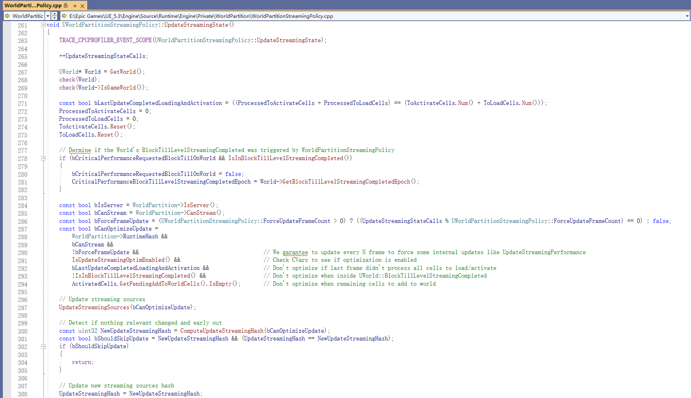

### 重要な問題

ワールドパーティション（World Partition）によりシームレスロードの大世界を容易に実現できますが、ストリーミングの特性から多くの制限が生まれます。これには通常、より成熟した制作チームと専門的なエンジンチームが必要で、設計時にワールドパーティションの特性を十分に考慮し、**ワールドパーティションのストリーミング戦略を監督する専門スタッフ** が必要です。

#### 境界を跨ぐ

以前のオブジェクト分割とストリーミング状況を観察します：


いくつかの「奇妙な」現象が見られます：

- 物体`E`のバウンディングボックスがワールドパーティションの軸線上にあるため、Level3に分割され、常にロードされることになります。しかし、そのバウンディングボックスの領域は明らかに非常に小さいです。

この問題は非常に発生しやすいです：

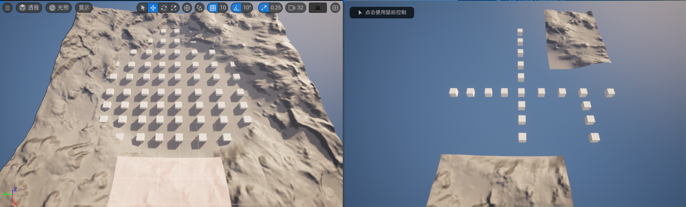

##### 解決策

エンジンはこの現象を緩和するためのコマンドを提供しています：

- `wp.Runtime.RuntimeSpatialHashUseAlignedGridLevels` ：グリッドレベルのアップアライメントを有効にするかどうか
- `wp.Runtime.RuntimeSpatialHashSnapNonAlignedGridLevelsToLowerLevels` ：アライメントされていない物体をより低いグリッドレベルに分割する
- `wp.Runtime.RuntimeSpatialHashPlaceSmallActorsUsingLocation ` ：バウンディングボックスがセルサイズより小さい物体は直接Locationで分割する
- `wp.Runtime.RuntimeSpatialHashPlacePartitionActorsUsingLocation` ：バウンディングボックスがセルサイズより小さいパーティション物体（植生、水体、地形）は直接Locationで分割する

ここに関連する説明があります：

- [Tech Note: World Partition Spatially Loaded Actors are Always Loaded  - Epic Developer Community Forums ](https://forums.unrealengine.com/t/tech-note-world-partition-spatially-loaded-actors-are-always-loaded/661466)

しかし、これは良い解決策ではありません。これらの問題を回避するため、UEは開発チームが自身のシーンニーズに応じて **RuntimeHashClass** をカスタマイズすることを許可しています。ここで置き換えます：

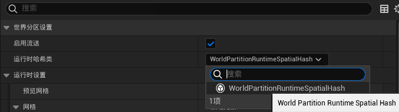

> 参考：`Engine\Source\Runtime\Engine\Private\WorldPartition\RuntimeSpatialHash\RuntimeSpatialHashGridHelper.cpp`

UE5.3では、公式は上記の設定をエディタに公開し、ワールドパーティションの座標原点を調整できるようにしました。これは大部分のニーズを満たすことができます：

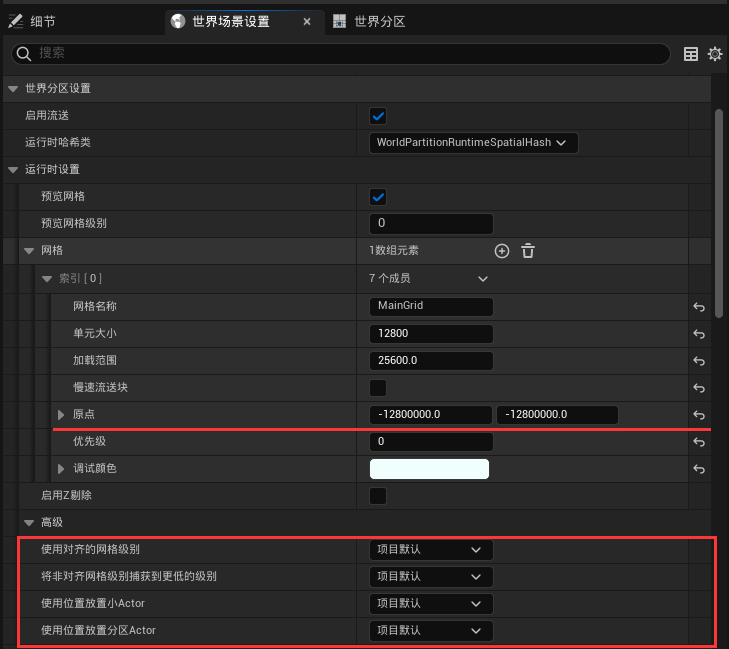

#### ロード優先度

ワールドパーティションのストリーミングのため、シーン内の一部の運動物体に異常が発生する可能性があります。重力が最も一般的な例です：


上図の問題点は：

- 一部の立方体があるセルに分割され、分割アルゴリズムの限界により地面が別のセルに分割されているため、地面のセルがロード範囲外になると物体が地底に落下します。

他の状況でもこの問題が発生する可能性があります：

- ワールドパーティションのストリーミングは **セル単位（Cell）** で行われ、**Actor単位ではありません** 。セルがストリーミングソースのロード範囲内にある場合、そのセルのすべてのActorが **非同期** に **ロード（Loading）** されます。このロード順序は保証されていないため、立方体が先にロードされ、地面が後にロードされる場合、その間に物理Tickが実行されると物体が地面に落下します。（シーンの負荷が大きい場合、これが発生しやすくなります）

##### 解決策

この問題を解決する主なアイデアは：

- 重力を支える物体が所在するワールドパーティショングリッドに、より大きなロード範囲を設定する。
- 重力物体を、重力を支える物体よりロード優先度の低いワールドパーティショングリッドに移動する。

#### データ永続性

ワールドパーティションに参加するActorはデータ永続性を持ちません。ロード後の物体を変更し、アンロードすると、変更されたデータは保存されません。

例えば：ワールドパーティションに浮いている一群の立方体があり、ロード後に重力で地面に落下します。アンロードして再ロードすると、立方体は以前の状態を正しく保存し、地面に落ちていることがわかります：


しかし、コンソールコマンド `gc.ForceCollectGarbageEveryFrame 1` を有効にすると：


この時に立方体を再ロードすると、立方体は初期位置に戻ります。

最初の例で物体の変更が保存されるという錯覚を生むのは、ロード範囲外のセルが即座に解放されるのではなく、`Unloaded Still Around` 状態になっているためです。これにより、次回ロードする際に即座に再利用できるようになります。セルが真正面にアンロードされるタイミングは次回のGC時です。

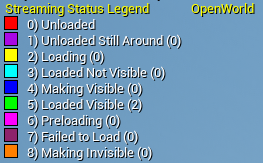

##### 解決策

この問題はストリーミングの特性によって引き起こされます：

- 流入時にアセットがメモリにロードされ、流出時にアセットがアンロード（リソースの破棄）されますが、アセットの変更は保存されません。

それでは、流出時にアセットの変更を保存する必要があるのでしょうか？

- 明らかに不要です。永久的な変更（ゲームを再開した後も以前の変更が残り、元に戻せない）を行う場合を除きます。

通常、このような変更は一定のスコープ（ライフサイクル）内で維持されます。例えば、ゲームを再開したり、レベルを再入場したり、セーブデータを再開したりすると、このような変更は失われるべきです。

ただし、現在はストリーミングによってデータが失われないようにしたいだけです。

そのため、実際に必要なのは：

- この部分のデータがストリーミングに参加しないようにする、つまりデータを合理的なスコープに保存し、Actorに保存しないことです。

UE5.3では実験的なプラグイン **LevelStreamingPersistence** が提供され、開発者がこの問題を解決するのを助けています。


このプラグインは **ULevelStreamingPersistenceSettings** を通じて、エンジン内で永続化が必要な属性を設定します：

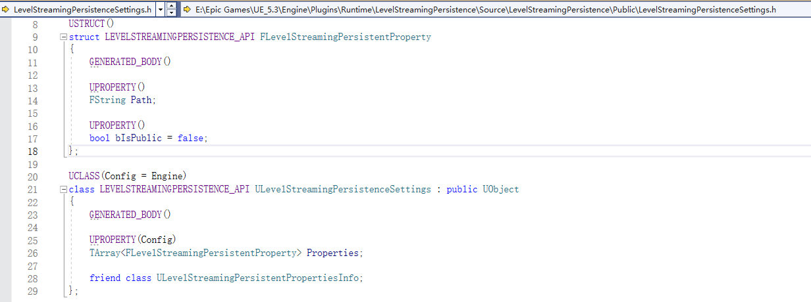

ワールドパーティションがセルをストリーミングする際、上記の設定に基づいて流出するセル内の永続化属性を持つデータが保存され、流入するセルに対しては以前の履歴値が割り当てられます：

上記の重力問題を解決するには、`DefaultEngine.ini` に次の設定を追加するだけです：

```c++
[/Script/LevelStreamingPersistence.LevelStreamingPersistenceSettings]
Properties=(Path="/Script/Engine.SceneComponent:RelativeLocation",bIsPublic=False)
Properties=(Path="/Script/Engine.SceneComponent:RelativeRotation",bIsPublic=False)
```

**PropertyPath** を通じてどの属性を永続化するかを決定すると、非常に広範な範囲が対象になる可能性があります。例えば、上記の設定はすべてのシーンコンポーネントの位置と回転をシリアル化しますが、すべてのシーンコンポーネントが永続化を必要とするわけではありません。このプラグインは、どのオブジェクトをシリアル化する必要があるかをさらにフィルタリングするためのデリゲートも提供しています：

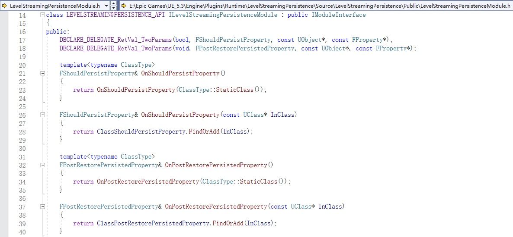

この中の `bIsPublic` は、保存された属性値が手動で変更できるかどうかを決定します。ストリーミングによる自動シリアル化だけでなく、操作のインターフェースは主に **ULevelStreamingPersistenceManager** にあります：

```c++
class ULevelStreamingPersistenceManager : public UWorldSubsystem
{
	GENERATED_BODY()

	// シリアル化
	bool SerializeTo(TArray<uint8>& OutPayload);
	bool InitializeFrom(const TArray<uint8>& InPayload);

	// プロパティ値を設定し、必要に応じてエントリを作成します。成功した場合はtrueを返します。
	template <typename ClassType, typename PropertyType>
	bool SetPropertyValue(const FString& InObjectPathName, const FName InPropertyName, const PropertyType& InPropertyValue);

	// 既存のエントリのプロパティ値を設定します。成功した場合はtrueを返します。
	template <typename PropertyType>
	bool TrySetPropertyValue(const FString& InObjectPathName, const FName InPropertyName, const PropertyType& InPropertyValue);

	// プロパティ値を取得します（存在する場合）。成功した場合はtrueを返します。
	template<typename PropertyType>
	bool GetPropertyValue(const FString& InObjectPathName, const FName InPropertyName, PropertyType& OutPropertyValue) const;

	// 提供された文字列値から変換されたプロパティ値を既存のエントリに設定します。成功した場合はtrueを返します。
	bool TrySetPropertyValueFromString(const FString& InObjectPathName, const FName InPropertyName, const FString& InPropertyValue);

	// プロパティ値を取得し、文字列に変換します（存在する場合）。成功した場合はtrueを返します。
	bool GetPropertyValueAsString(const FString& InObjectPathName, const FName InPropertyName, FString& OutPropertyValue);
};
```

#### ランタイム生成

ワールドパーティションの分割はエディタ内で行われるため、ランタイム生成（Spawn）された物体はワールドパーティションのストリーミングに参加しません。次のようなシナリオを想像してみてください：

- シーン内で重力を持つ小球をSpawnし、地面に落下させます。キャラクターがこの領域から離れて地面が流出すると、小球が地底に落下します。

これは明らかに望ましい結果ではありません。一般的に、キャラクター以外のシーン内のすべての常駐物体は、最初からマップレベルに配置されるべきです。

ただし、特殊なニーズが存在する場合もあります：

- 一部のシーン物体はランタイムのイベント依存関係が存在するため、ランタイムで **生成（Spawn）** する必要があります。

##### 解決策

- 物体の位置が固定されている場合、事前にシーンに占位用のActorを配置することで、ランタイムで設定可能にすることができます。
- 物体が一定の領域に存在する場合、その領域に **トリガーボリューム（Trigger Volume）** を配置し、トリガーロジックで物体のライフサイクルを制御できます。トリガー領域のサイズがワールドパーティションのロード範囲を超える場合は、トリガーボリュームをロード優先度の高いグリッドに配置し、ストリーミングソースコンポーネントを追加する必要があります。

#### 人物传送

ワールドパーティション内で人物を传送（Teleport）する場合、ストリーミングに一定の時間が必要なため、人物を直接目標位置に移動させると周囲の物体がロードされていない可能性があり、キャラクターが重力で地底に落下することがあります。

##### 解決策

この問題に対処するには、目標領域をプリロードし、ロード完了を待つ必要があります。

- 方案一：キャラクターのTickを無効にし、キャラクターを目標点に传送し、キャラクター自身をストリーミングソースとして周囲領域のストリーミングをトリガーします。**輪询（FTSTicker）** で目標領域のロード完了を待ち、完了したらTickを有効にします。ハッカー帝国のMassフレームワークにも対応する参考があります：

  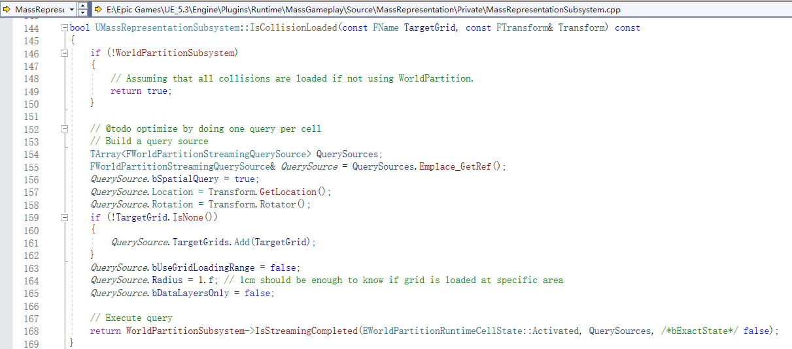

- 方案二：目標位置にストリーミングソースコンポーネントを持つActorをSpawnし、ストリーミングを有効にし、輪询でロード完了を待ちます。完了したらキャラクターを传送します：

  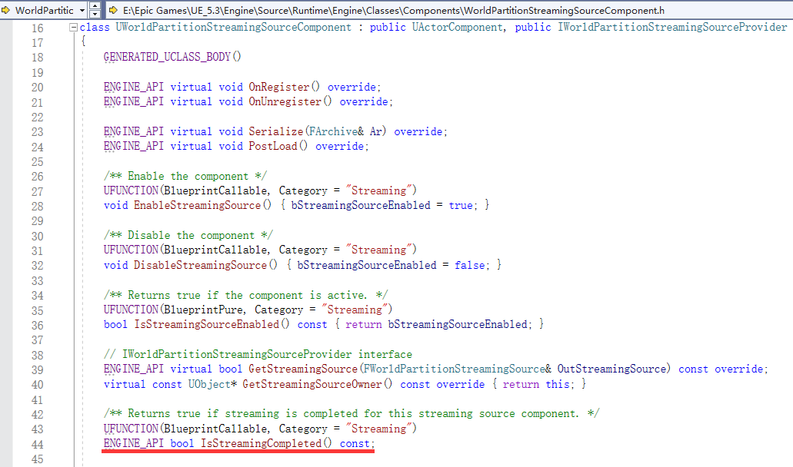

### One File Per Actor

OFPAはチームメンバーが同一マップの異なるActorを共同で編集できるようにします。

従来のマップは **すべてのActor** をWorldに対応するアセットパッケージに格納しますが、UEのオープンワールドマップはデフォルトで [ **一Actor一ファイル（One File Per Actor、略称OFPA）** ](https://docs.unrealengine.com/5.3/ja/ja/one-file-per-actor-in-unreal-engine/) を有効にしており、各Actorが1つのファイルに対応します。

これらのファイルはプロジェクトのContentディレクトリ内の`__ExternalActors__`および`__ExternalObjects__`フォルダの対応するマップパス下に格納されます。下図は`OpenWorld`という名前のマップ内のすべてのActorを示しています：

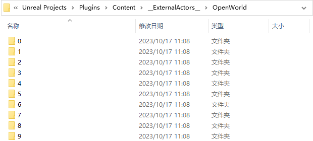

シーンアウトラインでActorの実際のファイルパスを取得できます：

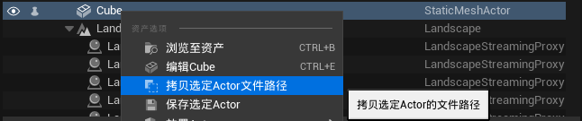

通常、すべてのActorは`__ExternalActors__`に格納され、`__ExternalObjects__`はUObject（非Actor）オブジェクト（各種Setting、アウトライングループなど）を格納します。

### HLOD

ワールドパーティションのストリーミングにより、全シーンの性能負荷をストリーミングソースの周囲領域に縮小できます：


ゲームロジックにとって、このストリーミングは当然な最適化ですが、シーンにとってはストリーミングによって遠景のシーンがアンロードされることを望まないため、HLODがこの問題を解決するために存在します。

**HLODはワールドパーティション内で遠景を表示するために使用** され、オープンワールドマップでの使用方法は通常のマップ（UE4）のHLODと異なります：

- [Unreal Engineにおけるワールドパーティション - 階層的詳細レベル | Unreal Engine 5.3ドキュメント (unrealengine.com)](https://docs.unrealengine.com/5.3/ja/ja/world-partition---hierarchical-level-of-detail-in-unreal-engine/)

公式ドキュメントにもHLODの詳細な説明が不足しているため、その位置付けを理解していない方はHLODを誤用しやすくなります。ワールドパーティションでHLODを使用する本来の意図は：

- **セル（Cell）** 内の **すべてのActor** を低精度のセルモデルプロキシに統合し、セルがストリーミングソースのロード範囲外になった場合、この簡易モデルを表示することで、遠景を表示しながらレンダリングコスト（低精度モデルとマテリアルの使用）を削減し、オクルージョンカリングの計算量（Actor数の削減）を最適化することです。

  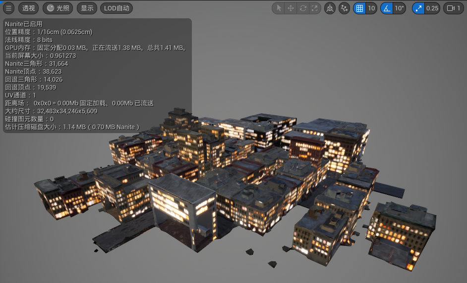

  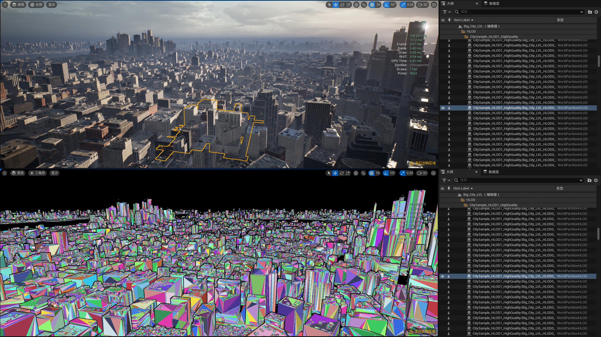

ここでマップ全体の **デフォルト（缺省）HLOD層** 設定を行うことができ、すべてのActorに有効になります：

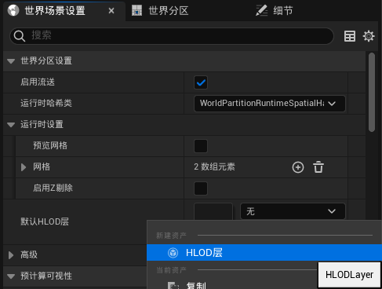

アセットの設定パネルは次の通りです：

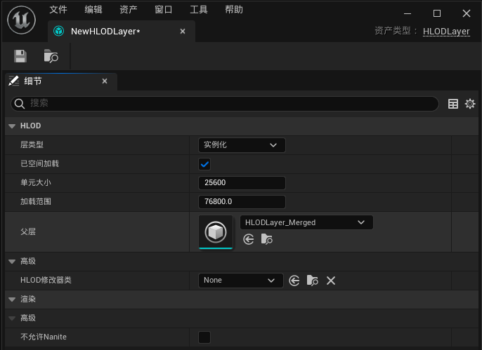

- **層タイプ** ：HLODを生成するための戦略
    - **インスタンス化** ：対応するモデルの最も低いレベルのLODを使用（Naniteモデルの場合はこのLODから新しいNaniteデータを生成）。
    - **統合** ：パーティション内の静的メッシュを統合。
    - **簡略化** ：パーティション内のメッシュを統合し、統合したメッシュに基づいてメッシュの簡略化を実行。枝葉が繁雑な木など、幾何学形状が複雑な物体に適しています。
    - **近似** ：パーティション内のメッシュを統合し、統合したメッシュに基づいてメッシュの近似を実行。建物、石など、幾何学形状が丸みを帯びた物体に適しています。
    - **カスタム** ：HLOD生成戦略をカスタマイズ。

- **空間的にロード済み** ：生成されたHLODがストリーミングを有効にするかどうか。有効にすると、このHLOD層のためにHLOD Gridが作成され、生成されたHLODActorがこのGridに配置されます。
    - **セルサイズ** ：HLOD Gridのセルサイズを設定。値はMain Gridのセルサイズの整数倍にすることが望ましい。
    - **ロード範囲** ：HLOD Gridのロード範囲を設定。値はMain Gridのセルサイズの整数倍にすることが望ましい。
    - **親層** ：生成されたHLOD簡易モデルに対して、親HLOD層で再処理し、より簡略化されたHLOD簡易モデルを生成。通常、より大きなロード範囲を持ちます。

注意事項：

- ハッカー帝国のシーン物体は主に角張った建物であり、カスタマイズされた近似メッシュ戦略を統一的に使用しています。シーンに木、水体、植生など、より複雑な物体種類が存在する場合、より細分化された処理戦略をカスタマイズする必要があります。これには非常に厳格なアセット管理戦略が必要です。さらに、HLOD関連のコードフローとUEが提供するメッシュ処理アルゴリズムを深く理解することは、オープンワールドプロジェクトの性能最適化に非常に価値があります。
- HLODは1つのグリッドのセルを1つの簡易モデルに統合しますが、ある領域に複数のグリッドが存在する場合、その領域に複数の簡易モデルが生成され、異なるグリッド間のモデルは統合されません。したがって、通常、すべてのシーン物体はMainGridに配置され、MainGrid内の物体からHLODを生成する必要があります。小型物件はロード範囲の小さいグリッドに配置し、HLODの生成に参加させないことができます。

### データ層

データ層はUE5がオープンワールドのために提供する機能で、アウトラインフォルダに類似した用法を持ちます：

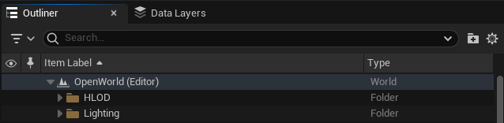

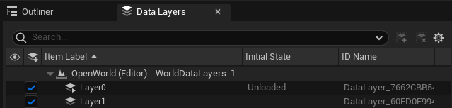

ただし、フォルダとは異なり、次の2つの重要な機能を提供します：

- エディタでマップを開くときに、デフォルトでこのカテゴリのLayerをロードしないように設定できます。
- ランタイムで関連インターフェースを通じてLayerを **ロードおよびアンロード** できます。

なぜデータ層を使用する必要があるのでしょうか？

- データ層を利用してシーン物体を **カテゴリ別に層化** 、**領域別に分塊** することで、**エディタの全シーンロード負荷を緩和** できます。多人編集時には、各メンバーが自身が関心を持つ領域を選択的にロードできるため、大規模シーンの管理と多人協作において非常に重要です。これが適切に処理されていない場合、シーン制作プロセスの混乱の始まりとなります。
- エディタ下の分類は **後続のシーン最適化に有効な根拠を提供** できます。
- データ層はワールドパーティションのストリーミングに参加する **サブレベル** です。

ここでデータ層パネルを開くことができます：

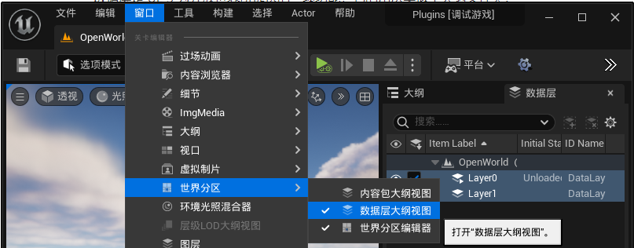

右クリックして **このマップ** の **データ層** を作成します：

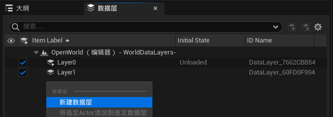

このようにして **すべてのマップで共用可能な** **データ層アセット** を作成します：

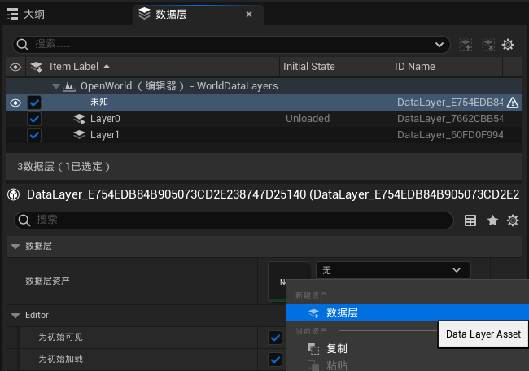

ここで手動でActorが所属するデータ層を設定できます：

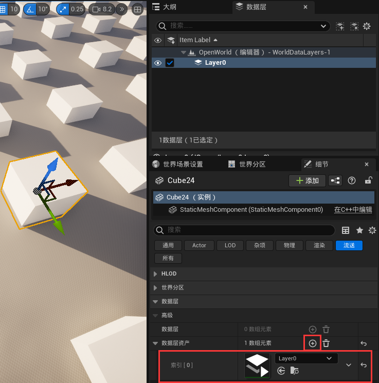

または、次のようにします：

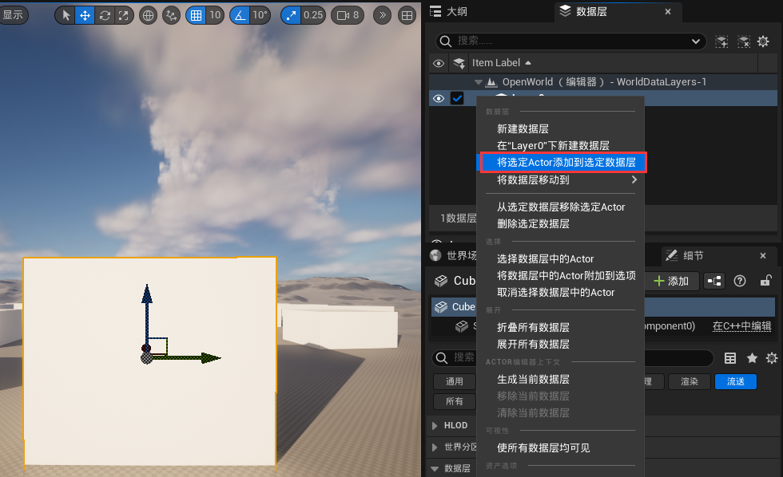

データ層の **現在のコンテキスト（Current Context）** を設定することもでき、新規作成されたActorは自動的に現在のデータ層に追加されます：

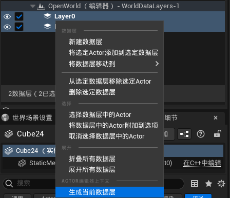

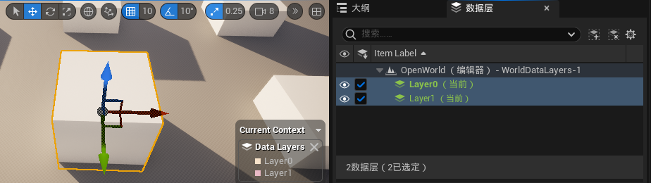

次のようにして現在のデータ層を削除またはクリアします：

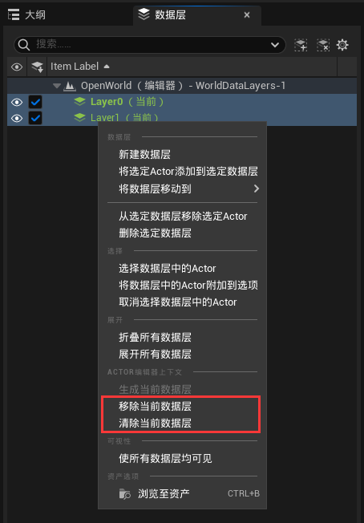

### レベルインスタンス

UE5はレベルインスタンス化（Level Instancing）機能を提供し、ワールドパーティションの編集体験を改善および簡略化することを目的としています。

- [Unreal Engineにおけるレベルインスタンス化 | Unreal Engine 5.3ドキュメント (unrealengine.com)](https://docs.unrealengine.com/5.3/ja/ja/level-instancing-in-unreal-engine/)

レベルインスタンスの本来の意図は、一連のActorをグループ化し、ワールド全体で配置および再利用可能なレベルインスタンスを作成することです。しかし、パッケージ化時にメインレベルのワールドパーティションに埋め込むことができる上、現在UE5のデータ層の使用が普及していないため、UE4に慣れた開発チームは **オープンワールドマップのサブレベル** として使用することを好む場合が多いです。

5.3では、以前レベルインスタンス内のActorに **ランタイムグリッド** を設定できなかった問題も解決されました：

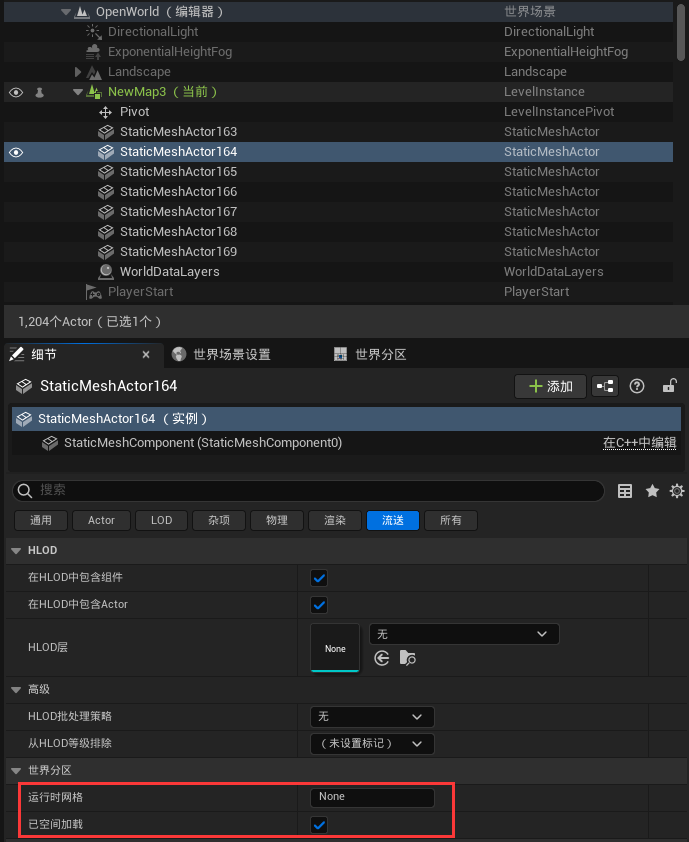

レベルインスタンス内のActorには「メインワールドのみ」のオプションが追加されました。これをオンにすると、このActorはレベルインスタンスマップを開いたときにのみロードされ、他のマップにレベルインスタンスとしてロードされた場合にはロードされません：

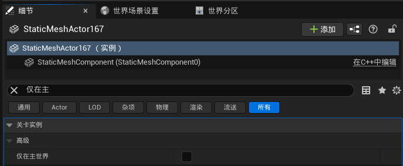

## シーン制作

多くの内容が記載された記事があります：

- [【UE5】ディレクトリ、アセット命名規範 - 知乎 (zhihu.com)](https://zhuanlan.zhihu.com/p/484119115)

ここにいくつかの提案があります：

- UEは単なるエンジン技術のサプライヤーであり、多くの優れた技術能力と汎用エディタを提供しますが、標準的なシーン制作ソリューションは存在しません。これには、開発チームが大量の試行錯誤コストをかけて技術の蓄積と選定を行う必要があります。

- 人間の力には限界があることを理解する必要があるため、アセット制作時には可能な限りプロシージャルを採用し、管理プロセスでは可能な限り自動化を使用し、適切な定量化指標を見つけて制作プロセスを追跡可能、反復可能にすることが望ましいです：
    - HoudiniとUE5のPCGフレームワーク：
        - [[UE5 PCG] 公式公開講座：Electric Dreams環境プロジェクトの詳細研究](https://link.zhihu.com/?target=https%3A//www.bilibili.com/video/BV1y8411U7Hs)
        - [Electric Dreams PCG技術詳解（一）——用語、ツールと図表紹介](https://link.zhihu.com/?target=https%3A//mp.weixin.qq.com/s/mGWiPKvWU_NHTktIWA6LnA)
        - [Electric Dreams PCG技術詳解（二）——溝、大型Assembly](https://link.zhihu.com/?target=https%3A//mp.weixin.qq.com/s/xHdnrFTkywF_7OjqOuALbw)
        - [Electric Dreams PCG技術詳解（三）——森林、岩石とシーン背景](https://link.zhihu.com/?target=https%3A//mp.weixin.qq.com/s/YWcd8l-VphNLrOlg3zkSzA)
        - [Electric Dreams PCG技術詳解（四）——遠景、霧、カスタムノード及びサブチャート](https://link.zhihu.com/?target=https%3A//mp.weixin.qq.com/s/CWTUcRIBTXw8WvhX3jrcBw)
    - [Unreal Engine自動化システム | Unreal Engine 5.3ドキュメント</think_never_used_51bce0c785ca2f68081bfa7d91973934>