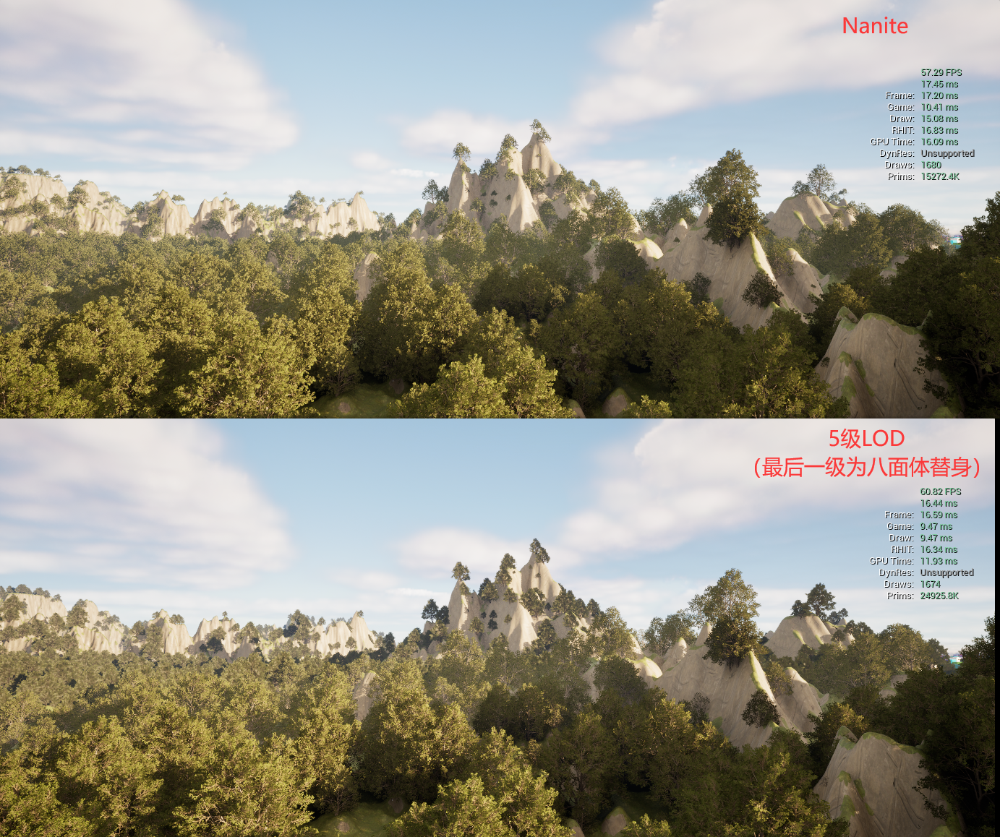

# オープンワールドにおける植生最適化技術

多くの方が大型ゲームで美しい自然風景を目にし、その芸術的な表現に驚嘆したことがあるかと思います：

> 《対馬島の魂》

> 《ホライズン2 西の絶境》

> 《トムブレイダー：シャドウ》

> 《コナ：精神の橋》

> 《燕雲十六声》

> 《アサシン クリード：オデッセイ》

しかし、これらのゲームはどれもUEで作られていません...

Unreal Engine 5は非常に強力ですが、万能ではないことを認める必要があります。上記のようにゲームプロジェクトの性能要求を満たす自然シーンを構築するには、エンジン技術以外にも多くの課題に直面します。

オープンな自然シーンにおいて、植生が性能問題を引き起こす頻度と影響は、光とエフェクトに匹敵することが多いです。

UE5で植生最適化について言及すると、多くの人が最初に思い浮かぶのは面数削減、インスタンス化、距離クリッピング、マテリアル最適化、LODまたはNaniteの使用などでしょう...

これらのアセットレベルの調整と複雑な特化手段では、オープンシーンにおける繁茂した植生エコロジーを支えることは難しい場合が多いです。

そこで、本稿では植生最適化に関するいくつかの戦略と観点を説明します。

## 植物アセット制作

ほとんどの3Dモデリングソフトウェアで植物アセットを制作できますが、ゲーム業界では **[Speed Tree](https://store.speedtree.com/)** が主流の植生制作ツールです。

岩石、物品、建築などの一般的なモデルとは異なり、植物は通常非常に多くの茎と葉を持っています。ジオメトリの観点からは、植物モデルは通常大量の密集した頂点とポリゴンを持っており、非常に高いレンダリングコストをもたらします。以下に例を示します：

- これほど繁茂していない木でも、三角形数が200万に達しています。この膨大な頂点データ量と大量の重複描画は、GPUに大きな負荷をかけます。

このように植物の構造をモデルのジオメトリで表現する方法を**モデルツリー/草**と呼びます。通常、この規模のアセットはゲームプロジェクトで大量に使用することはできません。

現在のゲームプロジェクトでは、より多くの場合**インサートシート/マスク**の方式で植物アセットを制作しています。一部の枝や葉を1枚のテクスチャシートに押し込み、枝に大量のインサートシートを挿入することで枝葉が茂った様子を表現します。これは非常に賢い制作方法で、効果に若干の欠点はありますが、性能面での利得は非常に大きいです。

インサートシートの方式は、ゲーム業界で植生レンダリングの最も効率的な方法として長らく認められてきましたが、いくつかの欠点も存在します：

- 視覚的な欠陥が存在し、近接カメラでは容易に破綻します。
- マスクマテリアルを使用するため、頂点数は減少しますが、依然として大量のOverDrawが存在し、シャドウの描画コストがより高くなります。
- 植物モデルに枝葉の頂点特徴が欠けているため、グローバルイルミネーションの効果が損なわれます。

UE5の仮想ジオメトリ技術であるNaniteの登場により、この状況に変化が生まれました。

Naniteの利点は、GPU駆動のパイプラインを使用して、ジオメトリの詳細を迅速に切り替え、不可視な三角形を即座にカリングすることで、視覚効果に影響を与えることなく、頂点利用率（スクリーン占有率）を最大限に向上させることです。

> 前文で使用したモデルツリーは、画像のピクセル数が100万にも満たないのに、頂点数が200万に達しています。明らかに大部分の頂点は画面効果への貢献が低いです。

Naniteに関しては、公式の優れた使用ガイドがあります：

- [ドキュメント | Nanite仮想化ジオメトリ (epicgames.com)](https://dev.epicgames.com/documentation/zh-cn/unreal-engine/nanite-virtualized-geometry-in-unreal-engine)
- [[公式トレーニング]23-UE向け美術アセット作成 | Epic 李文磊](https://www.bilibili.com/video/BV18X4y1k7R1/)

Nanite植生についても、公式はより詳細な比較を行っています：

- [Vegetation Best Practices for UE5 | Epic Developer Community (epicgames.com)](https://dev.epicgames.com/community/learning/talks-and-demos/2lyj/unreal-engine-vegetation-best-practices-for-ue5)

公式のテストレポートによると、同じNaniteを有効にした前提下で、従来のレンダリング方式とは全く異なる結果が示されました —— モデルツリーを使用した場合の性能がインサートシートツリーよりも優れています。

この分析結果に基づき、Naniteを利用してモデルツリーの方式でより効率的に植生をレンダリングできるかということになりますが、答えは否定的です。

> 有効な論拠の1つは：前文に挙げたゲームのスクリーンショット画面は、Naniteのような仮想ジオメトリ技術を使用していませんが、驚くべき自然エコロジー風景を構築しています。一方、...

### Nanite の傷

否定する理由は頂点データ量やビデオメモリ占有率を気にするからではなく、植生はシーン内で通常インスタンス化されて描画されるためです。特にオープンワールドシーンでは、ブロック間の性能負荷の均衡を非常に重視します。Naniteを採用した**単一**のモデルツリーが確かにより良い性能を発揮する可能性がありますが、これは性能に優れた統一的な植生戦略を構築することを妨げることにもなります。

以下では、Naniteを使用する際の問題点をいくつかの側面から説明します。観点は多少主観的な場合があり、誤りがあれば、どうか指摘していただければ幸いです。

- より高い効果期待に伴い、性能バランスの制御が難しくなる
- モデルの最適化戦略を特化できず、かつ性能最適なモデル最適化処理方式ではない
- 固定精度グラデーションの静的データは、性能に優れた密集植生を組織しやすい

#### より高い効果期待に伴い、性能バランスの制御が難しくなる

UE5が発表されたとき、多くの方がデモが示す画面効果に震撼されたと思います。当時、多くの人が次世代のゲーム画面が到来するのではないかと考えたかもしれません：

信じるかどうかは別として、私は信じました（イヌマスク）。私が知っている多くのチームも信じました。

信じた人々は、ここ数年間公式のガチャガチャとして、多くの苦労をしました。これは商業プロジェクトにとって、無視できない影響を与えます。

しかし、批判は批判として、Naniteは確かに画期的な技術であり、従来のLODよりも絶対的な優位性を持っています。ここ数年の公式の最適化と反復を経て、その信頼性も徐々に向上しています。

現在、それは確かに実際のゲームプロジェクトで広く使用されることができますが、Naniteがもたらす問題は通常それ自体にあるのではなく、他の点にあります。

：「Naniteを使っているのだから、百万三角形の小石を作るのは当然だろう。どうせ自動的に面数が削減される。」

：「これだけの頂点数で木と呼べるのか？細部がなくなっている。これでUE5を使っていると言えるのか？誰を馬鹿にしているのか？」

このような状況は通常、UEを使用する新興チームで発生します。実際、UEの人気が高まったのはそれほど昔のことではなく、UEを使用するチームの多くは深いエンジン技術の蓄積がない（国内では特に）ため、このような新興技術に対して、これらのチームはマーケティングの言葉に盲目的に従いやすく、コンテンツ制作パイプラインの反復と蓄積を弱めたり、甚だしきは無視したりすることになります。

Naniteの加持により、経営者や開発チームはゲーム画面に対してより高い要求を持つ傾向があります。最適化の観点から見ると、Naniteは頂点利用率を向上させることができますが、より詳細なソースアセットを使用すると、ディスク占有率が大きくなり、シーン画面全体に従来よりも多くの密集した頂点が存在することになります。

其中、頂点の数量はいくつかのレンダリングフェーズの性能消耗に深刻な影響を与えます：

- Shadow Mapの構築
- 速度バッファの描画

また、ディスク占有率は最終的なパッケージサイズに影響するだけでなく、より重要なのはプロジェクトシーン管理の難易度を大幅に増加させることです。

対馬島の魂を例にとると、マップがそれほど大きくない（28.62 km2）、モデルの種類が少ない、精度も高くないと感じるかもしれませんが、パッケージサイズは50GB以上に達しています。さらに恐ろしいのは、開発時のアセットサイズです：

筆者はこのGDCを見ることを非常に推奨します。大型プロジェクトのアセット管理について概念を持つことができます：

- [Zen of Streaming: Building and Loading 'Ghost of Tsushima' (youtube.com)](https://www.youtube.com/watch?v=Ur53sJdS8rQ&t=794s)

仮にUEのNaniteを使用して対馬島の魂のようなシーンを再現する場合、保守的にアセット精度を4～5倍に向上させると、このような膨大なプロジェクトアセットがもたらす管理コストがどれほど高いか想像できます。

したがって、ゲームプロジェクトの場合、筆者はシーン美術効果に対する期待をできるだけ管理することを推奨します。それはゲーム性の反復に影響を与えたり、甚だしきは妨げたりしてはなりません。

> もしゲームシーンが開発機で安定して80フレームで動作せず、ゲームプレイや他のモジュールの性能予算と反復空間を深刻に侵食する場合、どんなに美しく構築されても、ゲーム性が不足していれば、何の意味があるでしょうか？
> 筆者は、大部分のプレイヤーがゲームが写真級のリアルな画面を持っているだけで愚かに購入することはないと信じています。

#### モデルの最適化戦略を特化できず、かつ性能最適なモデル最適化処理方式ではない

通常、モデルを最適化する手段は2つあります：

- **面数削減（Reduce）** ：ソースモデルのジオメトリデータを削除して簡略化されたモデルを取得します。
- **リメッシュ（Remesh）** ：ボクセル化されたモデルアルゴリズムを通じて、一定のボクセル精度でソースモデルに近似し、簡略化されたモデルを取得します。

これら2つの戦略には異なる適用シーンがあります：

- 面数削減：シートに適しており、地形、建築、植物、水体シートなど、ジオメトリの角を追求するモデルに通常使用されます。
- リメッシュ：モデルが閉じている、ジオメトリ形状が比較的丸みを帯びているモデルに適しており、石、建築、道具など、極少数の頂点でソースモデルのジオメトリ形状を保証することが通常できます。

木の場合、これら2つの戦略を採用して同じ三角形数の簡易モデルを生成するとします：

> Naniteは面数削減のアルゴリズムを使用しています。面数削減後のモデルがNaniteのある精度グラデーションになると理解できます。Naniteの戦略は画面の失真を保証することを優先するため、この木を直接Naniteで使用する場合、どれだけの距離でこの精度が表示されると思いますか？明らかに非常に遠い距離ですが、その時でも多くの頂点が存在します。

これら2つの戦略にはそれぞれの問題が存在します：

- リメッシュ：モデルがふくらみ、UVマッピングが異常な場所に黒いブロックが出現します。（実際、効果の良いリメッシュモデルを生成するには、ボクセルアルゴリズムのパラメータを多く微調整して特化する必要があります）
- 面数削減：大量の葉の細部が失われます。

この点について、筆者は多くの試行を行いました。戦略が統一された自動化モデル処理アルゴリズムでは、効果の良い植物LODを得ることは難しいと明確に言えます。

植生最適化がなぜこんなに難しいのか、多くの場合、大家がエンジン内でそれを常規モデルとしてレンダリングメカニズムで最適化するためです。しかし、ゲーム中の植生を本当にうまく作るためには、最も重要な部分は制作上のテクニックです。

人工的にLODを制作する場合、美術スタッフは少ない主枝干で可能な限り大きな覆蓋範囲を作り、副枝干で主枝干の局部細部を追加することができます。低レベルのLODを制作する場合、一定数量の副枝干を剪除するだけで済みます。

また、頂点色を調整して主枝干と副枝干を区別し、最終的に植物頂点色の重みに基づいた面数削減方式を採用することもできます。

> 通常、木に頂点色を刷ることは植物の風力計算時の頂点偏移幅度の重みとして使用されます。この重み因子に基づいて、区域簡略化幅度の重みとしても使用できます。

この方式は植物モデルのいくつかの高精度LODを生成するために使用できますが、残念ながら、このように生成された簡易モデルは依然として高い頂点数を持つ場合が多いです（上記のように1500+頂点に簡略化すると、モデルはすでに面目がなくなっています）。頂点数をさらに大幅に減少させたい（主枝を剪除してはならず、そうしないと大きな視覚欠陥が生じる）が、モデルの表示効果を保証したい場合、明らかに簡略化の方式では達成できません。Remeshの方式では、木が非常にふくらんでUVマッピング異常の問題が発生し、表示効果が良くないため、この問題を解決する他の手段はありますか？

答えはYesです。私たちの最終的な目的はモデルの表示効果を保証することであり、ジオメトリ構造ではないため、これはモデル最適化の別の戦略 —— **替身（Impostor）** を引き出します。

> 替身は筆者自身の訳です。代理と訳すとProxyと混同しやすく、冒名顶替者と訳すとあまり良い響きではありません。

通常、替身は植生モデルの最後のレベルLODとして使用されます。比較的一般的な替身戦略には以下のいくつかがあります：

- **ビルボード（Billboard）** ：特定の角度のモデルをテクスチャに描画します。
- **フリップブック（Flipbook）** ：複数の角度のモデルをテクスチャに描画し、最後にマテリアルでプレイヤーの視点に基づいて表示するテクスチャを切り替えます。
- **カードクラウド（Billboard Cloud/ Mesh Card Cloud）** ：モデルを多くのメッシュインサートシートに描画し、ソースモデルと相似した視点効果を重ねて出します。
- **八面体（Octahedron）** ：一定の視点分布のモデルをテクスチャに描画し、最後にマテリアルで複数の角度の画像を補間して信頼できる視点遷移効果を呈します。

- [游戏场景植被优化 —— Impostor - Italink的视频 - 知乎](https://www.zhihu.com/zvideo/1790733617217019905)

これらの替身戦略の実現原理は複雑ではなく、原理を理解した後、容易に替身生成パイプラインを構築することができます。ただし、使用できる専用SDKがいくつか存在します：

- [Simplygon - 3Dゲームコンテンツ最適化の標準を樹立](https://www.simplygon.com/)
- [InstaLOD - 3Dコンテンツの生産と自動最適化に必要なすべて](https://instalod.com/zh/)

筆者がテストで使用したのはInstaLOD（個人使用は無料）で、これはUEプラグインを提供し、多くのモデル処理アルゴリズムが含まれています：

**八面体（Octahedron）** については、UEが専用のプラグインを提供しています：

その使用方法については、この記事を参照してください：

- [【性能最適化】impostor在虚幻中使用（植被优化） - 知乎 (zhihu.com)](https://zhuanlan.zhihu.com/p/693799380)

原理に興味のある方は、このブログを参照してください：

- https://shaderbits.com/blog/octahedral-impostors

> 実際のプロジェクトにとって最も価値のあるのはエディタではなく、モデル処理に関するコードインターフェースであり、これはプロジェクトチームが自身のプロジェクト仕様に合ったモデル生成パイプラインを構築するのに役立ちます。

これらの多くの替身戦略の中で、誰の性能効果がより良いかという質問があるかもしれません。

BillboardとFlipbookは非常に少ない頂点数、小さいテクスチャサイズ、および簡単なシェーダプログラムを持っているため、性能効果は間違いなく最も良いですが、表示効果は往々にして良くないです。

比較的論争のあるのは主にカードクラウドと八面体の方式です。以前の多くの3Aプロジェクトで採用されていたのは基本的にカードクラウドの方式でしたが、筆者はUEフォーラムで、実は多くの人が八面体を推奨していることを発見しました。

筆者は簡単な対比テストを行いました。具体的に誰が優れているかはより多くのデータサポートが必要かもしれません：

**ソースモデル**

- 三角形数：639639
- テクスチャサイズ：4096
- GPU時間：15.52ms

 **カードクラウド**

- 三角形数：32
- テクスチャサイズ：2048
- GPU時間：10.81ms

**八面体**

- 三角形数：32
- テクスチャサイズ：2048
- GPU時間：7.75ms

八面体の性能と画面表示がカードクラウドの方式より明らかに優れていることがわかりますが、最後のレベルLODとして使用する場合、カードクラウドのテクスチャサイズにはまだ大きな最適化スペースがあります。具体的にどの方案を採用するかは人それぞれの意見が分かれるかもしれません。

 八面体を採用する場合、木の効果に影響を与えることなく、このようなLODチェーンを制作することができます：

このような精度グラデーションは、インスタンス化と組み合わせることで、性能消耗を非常に低く抑えることができます。対照的に、Naniteを使用して同じ目的を達成することは困難です。なぜなら、現在のNaniteが採用している**自動**面数削減アルゴリズムは、木のようなモデルに対して退化効率が低いためです。画面の失真を保証することを優先するため、精度の平均分布を総合的に考慮して画面の失真を保証し、重要部位の区別が不足しています。通常、より多くの頂点細部を持ち、Impostorがもたらす性能向上はNaniteでは完全に比べられないからです。

これは筆者が行った簡単な対比テストです：

- Naniteは間違いなく最も保真度の高い効果細部を持っていますが、性能消耗はLODに比べてかなり高くなっています。また、Naniteはカメラ視点に基づいたジオメトリスケジューリングであるため、視点が急速に回転する場合（ゲームプロジェクトで非常に一般的）、GPU消耗に深刻な変動が発生します！

上記のLODチェーンは、別の問題についても思考を引き起こします：

- 多画質互換の問題。従来のLOD戦略では、通常LODの**偏移（Bias）**を調整して異なる画質の互換性を実現します。例えば、高画質ではLODチェーンが`LOD0`から開始し、低画質ではLODチェーンを`LOD1`またはLODから開始することで、頂点数を大幅に削減し、シーン性能を向上させることができます。しかし、Naniteではどうすればよいですか？

モデルのLODは通常人為的に監督されており、**明確な最適化幅度**と**平滑な遷移効果**を保証する必要があります。この目的を達成するために、通常各モデルのLODは**人工**制作されるか、**パラメータが統一されていない**モデル簡略化戦略が使用されます。

Naniteは異なり、すべてのモデルに統一された面数削減戦略を採用しています。この戦略は視覚効果を保証することを可能な限り優先して頂点を最適化するため、異なるモデルの特徴によって、一部のモデルは退化効率が高く、一部は低くなります。

Naniteも偏移と退化乗数を調整することができますが、統一されたパラメータを使用すると必ず上記の戦略を打破し、モデルの視覚効果が保証されなくなり、ユーザーが受け入れられない異常や甚だしきは破面が発生する可能性があります。

これは植生だけでなく、Naniteを使用するすべてのモデルが直面する必要のある問題です。

#### 固定精度グラデーションの静的データは、性能に優れた密集植生を組織しやすい

筆者のNaniteに対する認識はいくつかの段階を経てきました：

1. 「できるだけ使用」：何も考えずにNaniteをオンにする。
2. トラブルに遭遇：草にはNaniteを使用すべきではない。このような密集したインスタンス化レンダリングの物体でNaniteをオンにすると、いくつかのバグが発生する。
3. 再度トラブルに遭遇：Naniteの特性はHISMメカニズムに適合しない。理論的にHISMを使用して効率的にレンダリングする必要のある物体には、Naniteをオンにすることはできない。
4. いくつかのプロジェクトの制作手段を深く理解した後 —— まともな人は誰がNaniteで植生を作るのか。

最初のトラブルについて言うと、Naniteの面数削減は単一インスタンスに友好的であり、数百万の三角形を持つジオメトリが比較的丸みを帯びたモデルを容易に空ピクセルに減らして最後にカリングすることができます。しかし、草や木のようにインスタンス化されて数万個のインスタンスになる場合、Naniteの退化はインスタンスを効率的に減らすことができず、大量の頂点は間違いなくNaniteのスケジューリング計算に巨大なオーバーヘッドをもたらし、他のGPUタスクの計算リソースをさらに侵食します。これは中低級機種で特に明らかです。

> 現在の画面内のNaniteのインスタンス数が一定の閾値を超えると、画面異常が発生する可能性さえあります。いくつかのエンジン指令がこの現象を改善するのに役立つ可能性がありますが。

2つ目のトラブルについては、世界分区のHLODと結びつけて説明する必要があります。HLODはオープンワールドにおいてストリーミングロード範囲外に表示するための**遠景代理**です。通常のモデルは分区内で**Merge** + **Remesh（リメッシュ）**を行って遠景HLODを生成することができますが、植生はできません。Mergeして1つのMeshにすることはできませんし、Mergeして1つのMeshにした後、植生の効果を保証しながら頂点数を大幅に削減してマテリアルを最適化する良い戦略がないため、大規模な植生を制作する場合、インスタンス化の方式で敷設する必要があります。世界分区ユニット間の性能負荷の均衡を保証するため、植物の種類数を厳格に管理する必要があります。美術効果においては、一定の妥協が必要になる場合が多いです。

> 距離カリングは通常深刻な視覚欠陥を引き起こします。いくつかの手段（例えば霧、角）を用いて植生を遠距離で遮ることができる場合、遠景代理の問題を考慮する必要はなくなります。この場合、植物を通常のMeshと見なし、Naniteをオンにして世界分区のアンロードまたは距離カリングと組み合わせることで、良好な性能効果を達成することができます。

通常、植生は近距離でHISMの方式で組織されており、ロード範囲を超えると：

- 小型植生の場合、遠景代理を表示しないことができます。地形草を使用する場合、通常草の色が地形の色と基本的に一致することを保証する必要があります。これにより、遠距離で特別に明らかな視覚欠陥が生じなくなります。地形草を使用しない場合、プロシージャル草を使用する場合、エディタ内でプロシージャルブループリントからトップビューで1枚の色テクスチャをベイクし、デカールの方式でレンダリングして草の遠景代理とすることができます。
- 大型植生の場合、通常木を指します。ロード範囲を超えると、HISMを最低レベルLODのISMに退化させてHLODとすることができます（HISMはクラスタ划分とLOD切り替えスケジューリングのオーバーヘッドを持っています）。例えばこのように：

> 植生のLODは平滑に遷移する必要があります。ロード範囲を超えるとHISMがISMになるため、ロード距離の左側と右側のLODレベルが一致することを保証する必要があります。これは、モデルのLODグラデーションがロード距離内に分布していることを意味します。UEは現在画面空間の大きさをモデルLODの切り替え基準として使用しているため、制作時に対応する距離に変換する必要があります。

世界分区の加持があっても、シーンを無限に大きく構築できるわけではありません。その利点は主にシームレスロードにあります。コンピュータのリアルタイム計算リソースは有限であり、この合批メカニズムを通じて距離をさらに拡大することができますが、範囲が大きくなるほど性能オーバーヘッドが大きくなり、ゲームプレイの予算が少なくなります。したがって、キャラクターが見える距離は依然として一定の範囲内に維持する必要があります。例えば768m：

> 木だけでなく、他のモデル、パーティクル、動的マテリアル効果などもこの規則に従うことを推奨します。

## 植生組織

植生制作パイプラインを確定した後、植生がシーン内で計画される方式を考慮する必要があります。

### 構築方式

UEで大量の植生を作成する主な方式は以下の通りです：

- **植生編集モード（Foliage EdMode）**

    

- **地形草地タイプ（Landscape Foliage Type）**

    

- **プロシージャルコンテンツ生成フレームワーク** 

これらの方式にはそれぞれの使用シーンがあります：

- 植生編集モード：ちゃんとしたゲームプロジェクトにとって、私は**植生編集モードは絶対に触ってはならないもの**としか言えません。このような植生を刷る方式は、返工コストが非常に高く、クロスプラットフォームの性能適合も難しいです。

- PCG：PCGフレームワークは間違いなく最適な植生編集方式です。これを使用すると、容易かつ迅速にエコロジー群落を構築することができ、いくつかの拡張可能なパラメータをカスタマイズしてクロスプラットフォームの適合を行うことができます。
- 地形草地タイプ：密集した草の描画に適しています。UE内の実装は対馬島の[プロシージャル草](https://www.bilibili.com/video/BV1SF411N7RW/)の管理プロセスを参考にしているはずです。プレビュー時に非同期タスクを通じて草のクラスタを生成します。非常に効率的ですが、地形草地タイプを使用すると草の密度を記述するための地形レイヤーを占有するため、大規模な使用には適していません。

### 分区とストリーミング

まず、UE5世界分区に関する内容を再確認します。以前筆者が整理した関連記事があります：

- [Unreal Engine 5 開発 — オープンワールド制作 - 知乎 (zhihu.com)](https://zhuanlan.zhihu.com/p/670363215)

前段時間、公式もいくつかの比較的重要な構築ガイドを提供しました：

- [世界構築ガイド (qq.com)](https://mp.weixin.qq.com/s/sbsDIN6dUtq5CGhqRBR5oQ)
- [Advanced World Building in Unreal Engine - Chris Murphy / Epic Games for WA Games Week 2023 - YouTube](https://www.youtube.com/watch?v=gJKGMFcg29c&t=2211s)

**ストリーミング（Streaming）**についても一定の概念を持っていると思います：

これは筆者が個人テストプロジェクトで使用しているグリッド設定です：

| GirdName            | Cell Size | Loading Range | Priority | BlockOnSlowStreaming |
| ------------------- | --------- | ------------- | -------- | -------------------- |
| MainGrid（Default） | 12800     | 25600         | 0        | false                |
| DeferGrid           | 25600     | 25600         | -9       | true                 |
| AdvanceGrid         | 51200     | 51200         | 9        | true                 |
| SmallGrid           | 6400      | 12800         | -9       | false                |

通常、256mのロード範囲は視野内の大部分の表示効果が正常であることを保証できます。以下は3Dビューでの効果です（遠くのキャラクターは256m下の小さな黒点です）：

シーンモデルは通常`Main Gird`に配置されますが、セルサイズ（CellSize）もHLOD合批の距離大小に影響するため、筆者は植生を`AdvanceGrid`に配置することを推奨します。

植生は他の通常の静的モデルとは異なり、オープンワールドシーンでMerge+Remeshするだけで高品質な遠景代理を生成することができません。植生はMergeして1つのMeshにすることができませんし、Mergeして1つのMeshにした後、植生の効果を保証しながら頂点数を大幅に削減してマテリアルを最適化する良い戦略がないため、大規模な植生を制作する場合、インスタンス化の方式で敷設する必要があります。世界分区ユニット間の性能負荷の均衡を保証するため、植物の種類数を厳格に管理する必要があります。美術効果においては、一定の妥協が必要になる場合が多いです。

> 距離カリングは通常深刻な視覚欠陥を引き起こします。いくつかの手段（例えば霧、角）を用いて植生を遠距離で遮ることができる場合、遠景代理の問題を考慮する必要はなくなります。この場合、植物を通常のMeshと見なし、Naniteをオンにして世界分区のアンロードまたは距離カリングと組み合わせることで、良好な性能効果を達成することができます。

通常、植生は近距離でHISMの方式で組織されており、ロード範囲を超えると：

- 小型植生の場合、遠景代理を表示しないことができます。地形草を使用する場合、通常草の色が地形の色と基本的に一致することを保証する必要があります。これにより、遠距離で特別に明らかな視覚欠陥が生じなくなります。地形草を使用しない場合、プロシージャル草を使用する場合、エディタ内でプロシージャルブループリントからトップビューで1枚の色テクスチャをベイクし、デカールの方式でレンダリングして草の遠景代理とすることができます。
- 大型植生の場合、通常木を指します。ロード範囲を超えると、HISMを最低レベルLODのISMに退化させてHLODとすることができます（HISMはクラスタ划分とLOD切り替えスケジューリングのオーバーヘッドを持っています）。例えばこのように：

> 植生のLODは平滑に遷移する必要があります。ロード範囲を超えるとHISMがISMになるため、ロード距離の左側と右側のLODレベルが一致することを保証する必要があります。これは、モデルのLODグラデーションがロード距離内に分布していることを意味します。UEは現在画面空間の大きさをモデルLODの切り替え基準として使用しているため、制作時に対応する距離に変換する必要があります。

世界分区の加持があっても、シーンを無限に大きく構築できるわけではありません。その利点は主にシームレスロードにあります。コンピュータのリアルタイム計算リソースは有限であり、この合批メカニズムを通じて距離をさらに拡大することができますが、範囲が大きくなるほど性能オーバーヘッドが大きくなり、ゲームプレイの予算が少なくなります。したがって、キャラクターが見える距離は依然として一定の範囲内に維持する必要があります。例えば768m：

> 木だけでなく、他のモデル、パーティクル、動的マテリアル効果などもこの規則に従うことを推奨します。

## シャドウ最適化

植生のシャドウ消耗は通常シーン全体で占める割合が非常に大きいです。なぜなら、大量の密集した重複三角形を持っているためです。

では、シャドウをどのように最適化するのでしょうか？

まず、なぜシャドウが必要なのかという問題を考える必要があります。シャドウをオフにすると、以下のように表示されます：

プレイヤーに上記の対比画面を見せた後、「シャドウのある画面が好きですか、それともシャドウのない画面が好きですか？」と質問すると、プレイヤーの回答は大概率で「シャドウのある画面が好きです」になるでしょう。

さらに「なぜシャドウのある画面が好きですか？」と質問すると、大多数の回答は「シャドウがないと画面が違和感を感じるから」になるでしょう。

確かに、シャドウをオフにすると、画面の空間層次関係が非常に悪くなり、人間の空間に対する直感的な感受に違反します。

ゲーム開発の過程で、プレイヤーの真の意図を揣摩する必要があります。ここでも同様で、本質的にプレイヤーが在意しているのはシャドウを欲しがっているわけではなく、彼らはシャドウが何であるかさえ在意していない可能性があります。彼らは単にシャドウがないことで生じる違和感のある画面が嫌いなだけです。

通常、ゲームプロジェクトでは、物理的または学術的に正しいことを追求することは意味がないか、あるいはコスパが高くない場合が多いです。ここでは、プレイヤーの深层次的な需求を保証し、性能に優れた方式で画面の層次感を十分に表現するだけで十分です。

このような扁平な画面を見て：

層次感を増やしたい場合、何が思い浮かびますか？

SSAOです！

> Lumenを使用した後、SSAOはデフォルトでオフになっています。以下の指令でオンにすることができます：
>
> `r.Lumen.ScreenProbeGather.ShortRangeAO 0`
>
> `r.Lumen.DiffuseIndirect.SSAO 1`  

- AOの画面に対する重み收益を高めることができれば、画面の層次感はより良くなりますが、このような考えは現在のLumenと相悖しています。興味のある方は試してみてください。

AOを向上させることは画面中の細かい空間感を増やすことができますが、大面積の空間シャドウがない場合、画面は依然として奇妙に見える可能性があります。

草については、直接草の動的シャドウをオフにし、接触シャドウをオンにすることができます。接触シャドウは画面空間に基づいたシャドウアルゴリズムと見なすことができ、草のために量身定制されたシャドウ戦略です：

> モデルコンポーネントで接触シャドウをオンにした後、定向光源で接触シャドウの長さを設定することができます。

- 上記の対比図から、接触シャドウの効果が動的シャドウに非常に近いことがわかりますが、性能損耗は非常に低いです。

木については、草のように画面空間のシャドウアルゴリズムを使用することはできませんが、シャドウに提交する頂点データを最適化することができます。私たちはLODの方式で木をレンダリングするため、画面に表示されているのがLOD0であっても、LOD0でシャドウを描画する必要はなく、LOD2またはLOD3...を使用することができます。

UEでは、エンジン指令`r.ForceLODShadow`を通じて、ShadowMapの構築に使用するLODをロックすることができます：

> 対比図から、異なるLODのシャドウにはいくつかの細かい差異が存在することがわかりますが、言わなければ誰が知っているでしょう？

## 衝突及び交互最適化

木の衝突制作については、具体的にプロジェクトのシャドウに対する要求に依存します。前文のいくつかのメッシュ処理アルゴリズムを熟知した後、木の衝突体の生成パイプラインを容易に構築することもできます。例えば、Remeshのふくらむ特性を利用して、少数の頂点を持つ綿菓子のような衝突体を容易に生成することができます。あるいは、頂点色の分布に基づいて、幹部分のみの衝突を生成することもできます...

交互については、近距離で使用するHISMが真の個体ではなく、通常正常に交互することができません。

交互が必要な場合、HISMにいくつかの特殊処理を行う必要があります。例えば、エンジン内で**UFoliageInstancedStaticMeshComponent**を拡張し、インスタンスのダメージ計算を処理することができます：

需要がある場合、自分でHISMを派生させて、近距離のインスタンスを実際のActorに退化させることもできます。ここでは、世界分区の方式でこの退化を管理することを推奨しません。

## その他

- HISMのWPO速度書き込みをオフにすることを試してください：

- マテリアルのWPO最大描画距離を制限します。
- 距離カリングは通常深刻な視覚欠陥を引き起こします。いくつかの手段（例えば霧、角）を用いて植生を遠距離で遮ることができる場合、遠景代理の問題を考慮する必要はなくなります。この場合、植物を通常のMeshと見なし、Naniteをオンにして世界分区のアンロードまたは距離カリングと組み合わせることで、良好な性能効果を達成することができます。