# Qtデスクトップ水面波エフェクト

- Githubリポジトリ：https://github.com/Italink/DesktopWaveEffect.git

<p style="text-align:center"><iframe width="560" height="315" src="//player.bilibili.com/player.html?isOutside=true&aid=753422025&bvid=BV1yk4y1B72b&cid=197938359&p=1&autoplay=false" scrolling="no" border="0" frameborder="0" framespacing="0" allowfullscreen="true"></iframe></p>

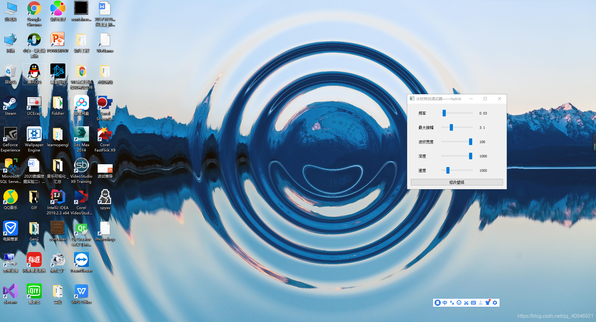

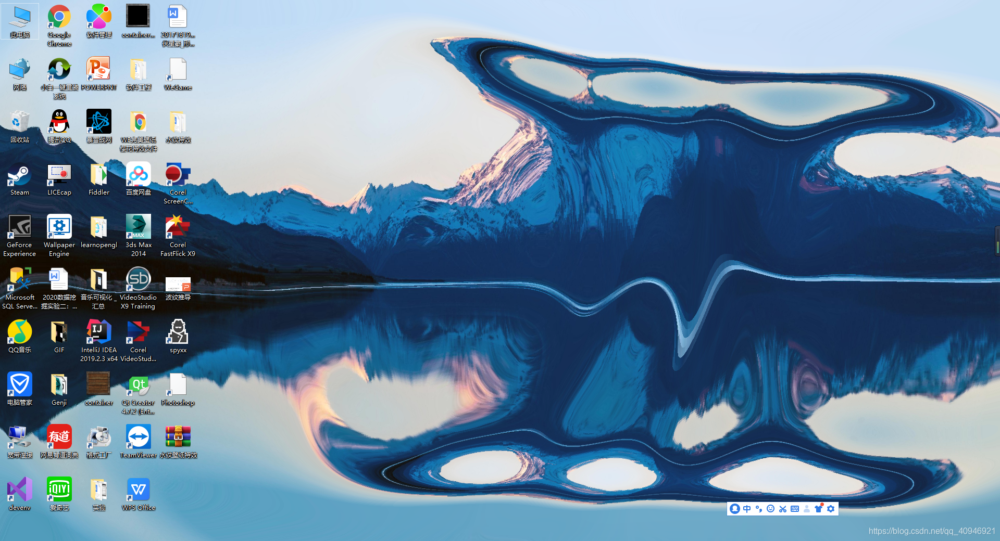

## 実装ツール

- Qt+OpenGL

## 実装機能
- 波のシミュレーション：水面波形を生成し、水面の光の屈折計算を完了
- ウィンドウをデスクトップに埋め込み
- 最上位ウィンドウがデスクトップを遮っているか監視し、遮っている場合は波の更新を停止
- グローバルマウスフック

## 原理
### 波形生成

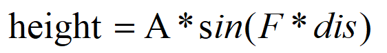


水面波形は、振源までの距離（dis）をパラメータとする正弦波と近似できる。ここでAは最大振幅、Fは周波数、disは現在の点（xy）と振源の距離である。本質的には二元関数であり、この関数によって以下のような曲面効果を構築できる：

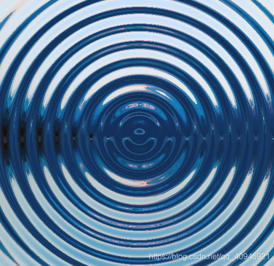

その半断面は普通の正弦関数となる：

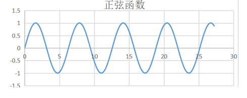

これで水面波形の計算は完了するのか？明らかにそう単純ではない。水面の波形は単なる正弦波ではない（ブロガーも詳細は不明）が、いくつかの水面効果を観察すると、波は常に小さなリング状の波形として表示され、時間とともに外部に拡散することがわかる。

そこで何をする必要があるのか？

正弦波の一小部分を強調表示し、他の部分をほぼ0に抑制する必要がある。表示されるこの部分は時間とともに外部に拡散する。最大振幅を変更することでこの効果を実現できる。つまり振幅を定数ではなく関数にする必要がある。よく考えると、どのような関数がこの要件を満たすのか？

もちろん万能なガウス関数である：

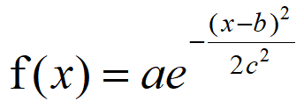

ガウス関数において：

aは最大振幅（ピーク）を表す
bは対称軸を表す
cは鐘状の幅に関連する
a=1、b=10、c=2の場合、以下のグラフが得られる：

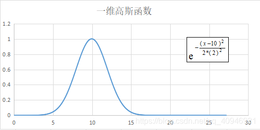

このガウス関数を正弦関数の最大振幅として使用する（両者を乗算）：

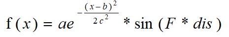

以前のパラメータを使用すると、以下の結果が得られる：

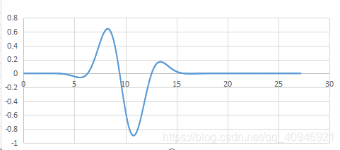

つまりおおよそ以下のような波形となる：

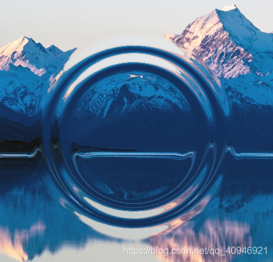

拡散を実現するため、ガウス関数の対称軸を時間（T）と関連付け、時間の経過とともに対称軸を比例的に増大させる。拡散速度を制御するために変数Vを追加できる：

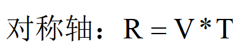

さらに変数Wで波の幅を制御する。

以上をまとめると、水波纹の曲面方程式は以下の通りとなる：

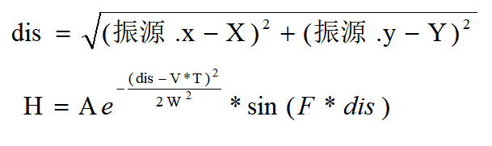

ここで：

- Aは最大振幅を表す
- Vは拡散速度を表す
- Tは時間を表す
- Wは幅係数を表す
- Fは周波数を表す

### 水面屈折計算

このステップでは、画像上のある画素点が水面屈折を経た後に実際に出力すべき色を計算する。OpenGLでは、この部分のコードはフラグメントシェーダで完成する（したがって前のステップもフラグメントシェーダ内で行われる）。

#### 法線の計算
波の半断面を用いて説明する。人の視線は上から下であり、モデルは大まかに以下のように観察される（光は水→空気→人間の目の順で進むが、導出のために光を人間の目から発せられるものとして逆に考える）：

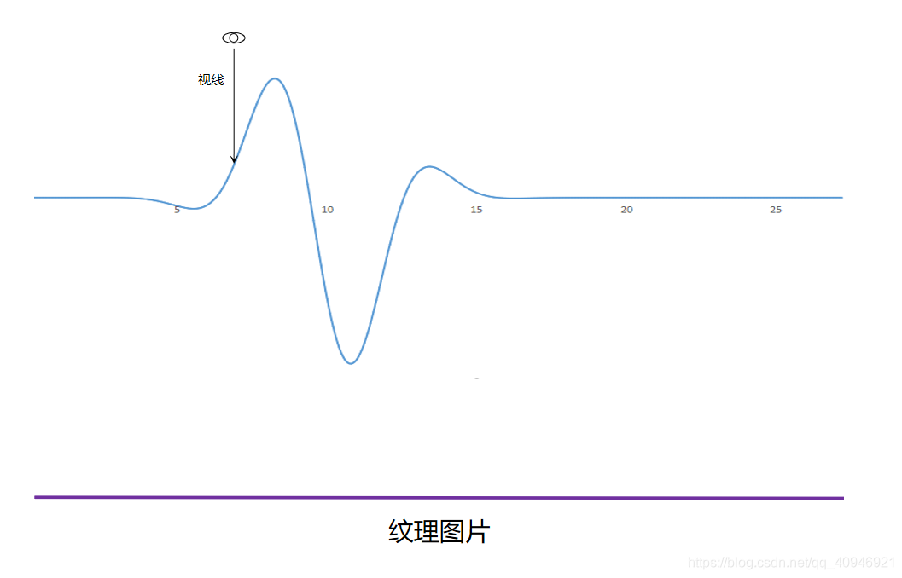

画像上のある画素点が水面屈折を経た後に実際にテクスチャ画像のどの位置に対応するかを計算する必要がある。

視線が水面屈折を経た後の方向を計算するには、視線が水面上の対応する点（平面）の法線を取得する必要がある。法線を通じて入射方向→屈折方向の計算を完成させることができる。

水面は関数によって構築されるため、理論的には関数を偏導関数で求めて2つの接ベクトルを計算し、それらのクロス積を取ることで点平面の法線を取得できる。しかし関数は非常に複雑であり、導出後の関数は非常に大きくなり計算も困難となる。そのため、点平面の法線を計算するための抜け道を用いる：

点平面付近の2つの共線でない点の高さを求め、2つの方向ベクトルを構成し、それらのクロス積を求めることで法線を計算する。これにより得られるデータは非常に正確ではないが、十分に使用可能であり、効率も低くない。

#### 屈折光の方向の計算
GLSLはrefract（入射ベクトル、法線、屈折相対係数）という関数を提供して屈折を計算する。

したがって入射ベクトル(0,0,-1)と法線がわかれば、屈折ベクトルの計算は関数を呼び出すだけで非常に簡単である（水から空気への屈折係数は4/3で、約1.33である）。

#### 座標オフセットの計算

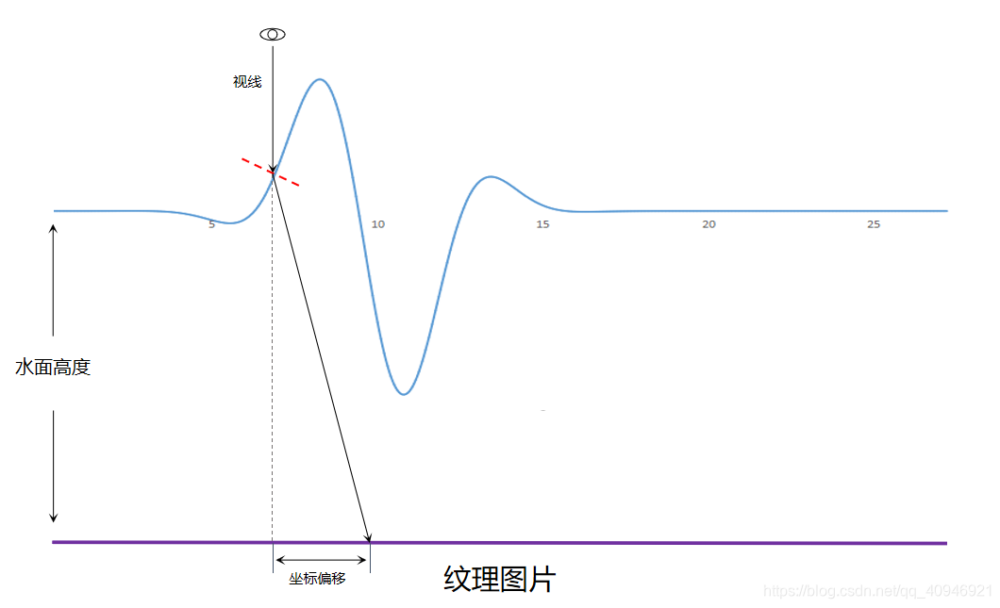

屈折ベクトルを取得した後、屈折ベクトルのz値が実際の高さ（水面高さ+波形高さ）に等しくなるように伸縮するだけで、水面屈折後のxyのオフセット値を算出できる。元の座標+オフセット座標で水面屈折後の座標が得られる。またテクスチャ座標の取り得る値は[0,1]であるため、ウィンドウ幅に基づいて座標の標準化を行う必要がある。

### 大功告成！
ブロガー自身が実装したフラグメントシェーダのコードを添付する：

``` glsl
#version 330 core
out vec4 FragColor;
 
uniform sampler2D texture;
 
uniform vec3 data[50];          //dataは(マウスx、マウスy、実行時間)を伝達：多振源をサポート
uniform int data_size;          //現在有効なdataの長さ
uniform vec2 screen_size;   //スクリーンサイズ
uniform float frequency;    //周波数
uniform float amplitude;    //最大振幅
uniform float wave_width;   //波の幅
uniform float depth;        //水平面から背景画像までの深度
uniform float speed;
 
in vec2 TexCoord;
 
void main()
{
    float height;
    float upHeight;
    float rightHeight;
    for(int i=0;i<data_size;i++){
        float time = data[i].z;    //マウスクリック後の時間
        float dis = distance(data[i].xy,gl_FragCoord.xy);  //マウス位置から現在のフラグメント位置までの距離
 
        //現在のフラグメントの振幅を計算：ここではガウス関数を利用して現在の時間に表示される波形を強調表示
        float amplit = amplitude*pow(2.74,-(dis-time*speed)*(dis-time*speed)/2/(wave_width*wave_width))*sin(dis*frequency);      
 
        height += amplit*sin(dis*frequency);              //現在の波形の高さ
 
        dis=distance(data[i].xy,gl_FragCoord.xy+vec2(0,1));
 
        upHeight += amplitude*pow(2.74,-(dis-time*speed)*(dis-time*speed)/2/(wave_width*wave_width))*sin(dis*frequency)*sin(dis*frequency);
 
        dis=distance(data[i].xy,gl_FragCoord.xy+vec2(1,0));
 
        rightHeight += amplitude*pow(2.74,-(dis-time*speed)*(dis-time*speed)/2/(wave_width*wave_width))*sin(dis*frequency)*sin(dis*frequency);
    }
 
 
    vec3 up = vec3(0,1,upHeight-height);
 
    vec3 right = vec3(1,0,rightHeight-height);
 
    vec3 normal = cross(up,right);
 
    vec3 view = vec3(0,0,-1);
 
    vec3 re = refract(view,normal,1.33);
 
    vec2 coordOffset = re.xy*((height+depth)/re.z)/screen_size;
 
    FragColor = texture2D(texture,TexCoord+coordOffset);
}
```