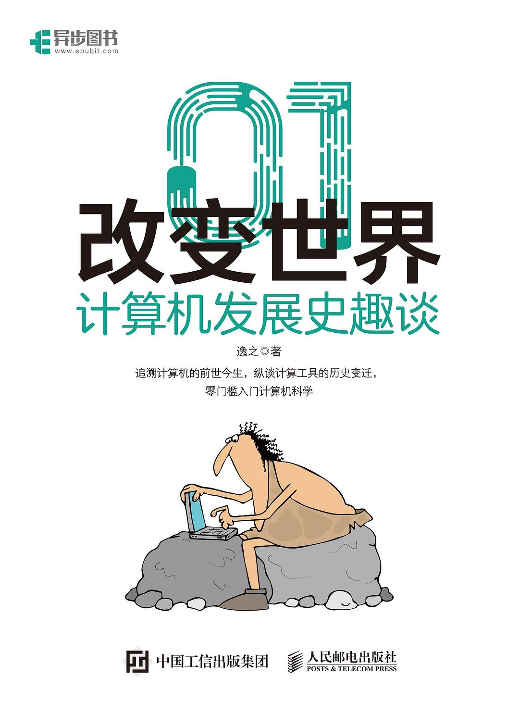

# 컴퓨터 발전사

**"나에게 받침점을 주면, 나는 온 지구를 들 수 있다"** 는 고대 그리스 물리학자 아르키메데스의 널리 알려진 명언으로, 이론의 강력함을 보여줍니다.

노자의 《도덕경》에도 **"도는 일을 생기게 하고, 일은 이를 생기게 하며, 이는 삼을 생기게 하고, 삼은 만물을 생기게 한다"** 라고 적혀 있어 도의 무한한 파생 공간을 설명합니다.

현실 사회에서는 여러분이 아마도 **"이론은 성립하니, 실천을 시작하라"** 와 같은 재미있는 영상을 본 적이 있을 것입니다. 블로거가 평범한 이론 하나로 매우 놀라운 효과를 만들어내는 것은 이와 유사한 증명입니다.

우리의 컴퓨터 체계도 마찬가지로 몇 가지 기본 이론 위에 구축되어 있지만, 여러분은 그 '도'가 무엇인지 알거나 생각해 본 적이 있나요?

고대 원시 사회로 돌아가 보면, 인류 초기의 계산 실천은 세기를 시작으로 하였습니다. 자신의 손가락 외에도 조상들은 매듭, 산수 막대, 주판 등을 이용하여 이산적인 수의 단위를 나타냈습니다.

> 전설에 따르면 페르시아 왕이 군대를 원정 보내 때, 그의 경비대에게 예즈드 강 위의 다리를 60일 동안 지키도록 명령했습니다. 하지만 당시 60은 매우 큰 수였고, 어떻게 날짜를 정확히 세울 수 있었을까요? 그 당시에는 문자가 없었지만, 영리한 페르시아 왕은 가죽 끈에 60개의 매듭을 만들어 병사들에게 매일 하나씩 풀어주고, 모든 매듭을 풀면 임무가 완료되어 집에 돌아갈 수 있다고嘱咐했습니다.

**매듭은 세기뿐만 아니라 사건을 기록하는 데도 사용될 수 있습니다**

동한 말기 유가 학자이자 경학 대가인 정현은 《주역 정강성 주》 일서에서 "사건이 크면 큰 매듭을 묶고, 사건이 작으면 작은 매듭을 묶는다" 라고 말했습니다.

1937년 《귀주 묘민 개황》 일서에는 "묘민은 글자를 거의 알지 못해 여전히 상고 시대의 매듭 기사遗풍을 유지하고 있다. 일이 생기면暗中에 풀로 기록하는데, 간단한 예는 오래 지나도 아직 기억할 수 있다" 라고 언급되어 있습니다.

문자가 아직 탄생하지 않은 시대, 매듭이 정보를 기록하는 역사적重任을 지고 있었습니다.

이제 한 가닥의 끈이 얼마나 큰 잠재력을 가지고 있는지 생각해 보겠습니다:

- 오늘이 무슨 요일인지 기록하기 위해 매듭을 묶을 수 있습니다.
- 집에 끈 하나를 두고, 매듭을 묶거나 묶지 않으면 가족이 집에 돌아와 끈을 보고 저녁에 집에서 식사할지 여부를 알 수 있습니다.
- ...

요약하면, 매듭은 세기에 사용될 수 있으며, 숫자에 따라 **해석**하여 **해당하는** 논리를 도출할 수 있습니다. 이는 즉, 어떤 사물이든 매듭을 이용하여 기록할 수 있지만, 이에는 **끈이 충분히 길어야 한다**는 전제가 있습니다.

한 가닥의 끈으로 더 많은 데이터를 기록하기 위해 조상들은 더 많은 관측 상태를 추가하는 방법을 생각해냈습니다. 원래는 매듭의 수만 중요하게 생각했지만, 이후 매듭의 위치와 종류까지 고려하게 되었습니다. 쉽게 말하면: 원래 최대 5개의 매듭을 묶을 수 있었던 끈에, 매듭의 위치를 조합하거나 매듭의样式를 구분하면 더 많은 정보로分化할 수 있습니다.

이것이 수제의雏形입니다. 현대 사회에서는 통용되는 수제가 십진법 계수법으로, 0, 1, 2, 3, 4, 5, 6, 7, 8, 9의 10개의 기본 숫자를 포함하며, 10이 되면 자리 올림합니다.

하지만 컴퓨터에서는 이진법을 사용하는데, 그 이유는 다음과 같습니다:

- **물리적으로 상태 전환이 쉽다**

  > 현실에는 두 가지 안정적인 상태를 가진 물리 소자가 존재합니다 (예: 트랜지스터의 도통과 차단, 릴레이의 접속과 단절, 전기 펄스 레벨의 높고 낮음 등).
  >
  > 예를 들어, 앞에 가로선이 하나 있을 때 넘어가라고 하면 힘껏 차면 되고, 넘어가지 말라고 하면 살짝 차거나 아예 차지 않으면 됩니다. 하지만 앞에 가로선이 두 개 있을 때 선 사이에 차라고 하면 조절하기가 비교적 어렵습니다.

- **비트의 연산 규칙이 간단하다**

  > 예를 들어 곱셈 규칙은 1 X 0 = 0 X 1 = 0, 0 X 0 = 0, 1 X 1 = 1의 세 가지만 있습니다.

- **이진수의 0, 1 숫자와 논리량 "거짓"과 "참"이 일치하여 논리 연산을 수행하기 용이하다**

컴퓨터는 데이터를 **메모리**에 저장하지만, 이는 단순히 정보의载体일 뿐입니다. 정보가 "해석"될 수 없다면 의미가 없습니다:

> 예를 들어, 나가 5개의 매듭이 묶인 끈 하나를 아무렇게나 너에게 던지면, 그것이 무슨 의미를 나타내는지 알 수 있나요?

컴퓨터에서는 무엇이 해석자 역할을 수행할까요? 다음과 같은 흐름을 생각해 보십시오:

> 우리의 데이터는 컴퓨터에 저장되어 있으며, 운영 체제는 이를 파일 시스템의 각 파일로 해석합니다. mp3 파일을 열 때는 해당 소프트웨어가 이를 오디오 데이터로 해석하고, 컴퓨터의 오디오 장치가 이를 우리가 실제로 들을 수 있는 소리로 해석합니다.

위 흐름에서는 하드웨어만 데이터를 해석하는 것이 아니라 소프트웨어层面에서도 해석하며, 심지어 우리 인간 자체도其中에参与하고 있습니다 (귀가 들은 소리 데이터를解析하는 것).

컴퓨터가 디스크上의 데이터를 해석하는 것뿐만 아니라, 우리도 이 세계에서 얻은 데이터를 해석하고 있음을 발견할 수 있습니다. 가장 큰 차이는 **인간은 현실 세계의 데이터와 규칙을 통제할 수 없지만**, **컴퓨터에서는 우리가 거의 무능하지 않다**는 것입니다:

우리는 **입력 장치**를 이용하여 컴퓨터와 대화할 수 있으며, 그의 **CPU(중앙 처리 장치)**가 **메모리**上의 데이터를 임의로 변경하도록 도와주고, 마지막으로 출력 장치가 이를呈现、反馈、解读해줍니다.

> 흔한 입력 장치로는 키보드, 마우스, 카메라, 스캐너, 광펜, 손글씨 입력판, 게임杆, 마이크 등이 있습니다.
>
> 흔한 출력 장치로는 프린터, 프로젝터, 디스플레이, 스피커 등이 있습니다.

컴퓨터의 역사에 대해서는 저자는过多로赘述하지 않겠습니다. 만약 관심이 있다면 《01이 세계를 바꾼다: 컴퓨터 발전사 재미있게 이야기》를 읽어보는 것을 추천합니다.

