# C++ 기초

## 학습 경로

C++ 초보자에게 가장 좋은 학습 방법은 분명히 각종 문제 풀이 플랫폼에 참여하는 것입니다:

- LeetCode：https://leetcode-cn.com/
- 牛客网（Nowcoder）：https://www.nowcoder.com
- Virtual Judge：https://link.zhihu.com/?target=https%3A//vjudge.net/
- 杭电HDUOJ：https://link.zhihu.com/?target=http%3A//acm.hdu.edu.cn/
- PTA | 프로그래밍 실험 보조 교육 플랫폼：(https://pintia.cn/problem-sets/dashboard)
- ...

프로그래밍 훈련을 통해 C++의 기본 문법과 각종 데이터 구조 및 알고리즘을 빠르게 익힐 수 있으며, 자신의 프로그래밍 사고력을 형성할 수 있습니다. 또한 문제 풀이는 자료 읽기만 하는 것보다 지루하지 않습니다.

저자는 **초보자가 이 단계에서 1~2년을 투자하여 연마할 것을 강력히 권장합니다** .

《C++ Primer Plus》、《C++ Templates》 등의 도구 책은 대략 읽어보면 됩니다. 적어도 C++에 무엇이 있는지 알고, 해당 문제가 발생했을 때 다시 자세히 읽으면 됩니다.

《STL 소스 분석》과 같은 소스 코드 분석 및 엔지니어링 실습 관련 책은 깊이 읽는 것을 권장하지 않습니다. 이러한 책은 대량의 특정 엔지니어링 실습 경험으로 쌓여 있기 때문에 관련 엔지니어링 경험이 없는 친구들에게는 수익이 매우 적습니다. 사람의 생명과 에너지는 한정되어 있으며, 현대 사회가 왜 고도로 발전했는가? 바로 우리가 거인의 어깨에 서 있기 때문입니다.

학습 과정에서 함께 토론할 수 있는 포럼이 몇 가지 있습니다:

- Stack Over Flow：https://stackoverflow.com/
- CSDN：https://www.csdn.net/
- 掘金（Juejin）：https://juejin.cn/
- 知乎（Zhihu）：https://www.zhihu.com/hot
- 牛客（Nowcoder）：https://www.nowcoder.com/discuss

여기 매우 좋은 C++ 튜토리얼이 있습니다:

- https://www.bilibili.com/video/BV1Wd4y1t7fZ/

또한 완전한 C++ 리소스 모음도 있습니다:

- https://github.com/fffaraz/awesome-cpp

입문 단계를 넘기면 친구들은 엔지니어링 실습에 접근할 수 있습니다. 이 단계에서는 **품질이 높은** 프로젝트를 **계속 시도하며** 참고해야 합니다.

> 여기서 저자는大家에게 Qt를学习할 것을建议합니다. Qt의 코드는 수십 년 동안 반복 개발되었으며 코드 품질이 매우 높습니다. 가장 중요한 것은 **문서가 완비되어 있다**는 것입니다! Qt를 단순한 GUI 프레임워크로 생각하지 마십시오. 개인적으로 현재 학습 수익이 가장 높은 C++ 프레임워크라고 생각합니다 (후속 장에서 자세히 설명).
>
> Qt Creator에는 많은 공식 예제가 제공되며 Github에도 대량의 고품질 프로젝트가 있습니다.
>
> 어떤 프레임워크를学习하든, **반드시 반드시 반드시** 프레임워크의 공식 문서를 먼저 읽어보십시오. 일반적으로 그곳이 정보가 가장 완전한 곳입니다.

학습 과정에서 그 엔지니어링 아키텍처, 디자인 패턴 등을 많이思考하십시오...

여기 몇 권의 책을推荐합니다:

- 《C++ 코드 깔끔하기》
- 《리팩토링: 기존 코드 설계 개선》
- 《디자인 패턴》
- 《Effective C++》《More Effective C++》

## 발전 경로

학부생에게 저자가建议하는 발전 경로는 다음과 같습니다:

- 1~2년을 투자하여 열심히 문제를 풀고 ACM、蓝桥杯（Blue Bridge Cup）、PAT 등 각종 프로그래밍 대회에 참가합니다.
- 1~2년을 투자하여 열심히 엔지니어링을 작성하고 계속 시도하며 오류를 수정하고, 참고 자료를 많이 찾고, 코드를 리팩토링하며 자신의 아키텍처 능력을 연마합니다.

> 여기 저자가参考 기준을 하나给합니다: 4년 동안 문제 풀이량 300+，총 코드량 20만+행

- 3학년이 되면 이력서를投简历하여 인턴을 찾을 수 있습니다.沟通能力을锻炼하는 것을注意하십시오.

> 당신이一定阶段까지发展하면, 자신의技术를限制하는 것은能力가 아니라时间과精力임을发现할 것입니다.学习过程中孤独할 수도 있지만,最终적으로는集体로回归해야 합니다~
>
> 하지만放心하십시오.他们가 당신과 공감할 수 있습니다.

- 4학년은 졸업 디자인과答辩을好好准备하십시오.成绩와无关하게 자신에게无愧하면 됩니다.

### 발전 방향

- 음성 비디오 스트리밍 미디어 개발
- 클라이언트
- 게임 개발
- 서버
- 그래픽스, 엔진
- 임베디드
- 고성능
- 네트워크 보안
- 인공 지능
- ...

> 위 방향의技术要求를了解할 필요가 있다면,招聘网站를打开하십시오.例如:
>
> - 牛客（Nowcoder）：https://www.nowcoder.com/jobs/recommend/campus
> - Boss直聘（Boss Zhipin）：https://www.zhipin.com/
> - 前程无忧（51job）:https://jobs.51job.com/
> - 智联招聘（Zhaopin）:https://landing.zhaopin.com/
> - 猎聘（Liepin）：https://www.liepin.com/
> - 脉脉（Maimai）：https://maimai.cn/
>
> 또는公司의招聘网站,比如:
>
> - 网易（NetEase）：https://hr.game.163.com/index.html
> - 腾讯（Tencent）：https://careers.tencent.com/
>
>对应的岗位职责就是你的学习目标


## 오해

국내 C++ 기술 환경은 특히 일부 대학에서 매우 친절하지 않습니다. 많은 사람들이 **C++의 어려움을 과도하게 과장** 할 수 있습니다. C++에 대해 이야기하면 다음과 같은 생각이 떠오를 수 있습니다:

- C++는 백엔드 개발에 사용됩니다.
- C++는 이미 구식이지 않나요? Python、Go、Rush... 미래에 모두 그것을 대체할 것입니다.
- ...

对此, 저자也只能说无知者无畏...

그들을 탓할 수도 없습니다. 국내 인터넷 기업이盛行하기 때문이며,它们는 주로业务逻辑를导向으로 하여开发效率와维护成本을 더看重합니다.

C++는业务를 위해诞生한 것이 아니라 컴퓨터技术에 더专注합니다. 많은东西가存在即合理하지만,确实一些历史包袱도存在합니다...

而那些后起之秀는一些应用场景에极大的优化를做了,它们를使用하여开发体验确实较大的提升가 있습니다.

之前章节의一句话를引用합니다: **"道生一, 一生二, 二生三, 三生万物"** .道에越接近하면掌握해야 하는东西가越少이며,掌握之后衍生할 수 있는"物"가更多입니다.但万千事物中에서所谓的 **道** 를寻到하려면 훨씬难합니다.你可能需要自己的人性化思维를矫正하여自己的思考方式를一台计算机,一个机器처럼 만들어야 합니다.这样你才能发现 — C++가多么的优雅~

>培训班의坑에入하지 않도록切记하십시오.培训班课程의质量가多么高은暂不谈,学习本来就是自己의信息搜集和整理能力를锻炼하는 것입니다.老想着捷径를走면,别人에 의해韭菜를割히기容易합니다.无欲则刚~


## 컴파일

**통합 개발 환경** (IDE: Integrated Development Environment )을 컴파일러로当成하는 것은很多初学小伙伴의弊病입니다.编译器에谈到하면,可能第一反应会是 Visual Studio、Visual Studio Code、Clion、XCode、Dev、VC...

虽然现代开发过程中开发者很少去直接操作编译器,但你需要至少这个东西를了解하여自己의知识体系中雾区가存在하지 않도록避免해야 합니다.

>后续的反射章节中,编译器의实现에直接接触하게 됩니다.

编译器에 대해百度百科中如下定义가 있습니다:

> **[c++编译器](https://baike.baidu.com/item/c%2B%2B%E7%BC%96%E8%AF%91%E5%99%A8/2311223)**
>
> [编译器](https://baike.baidu.com/item/编译器/8853067)는 " [高级语言](https://baike.baidu.com/item/高级语言/299113)"를 " [机器语言](https://baike.baidu.com/item/机器语言/2019225)（低级语言）"로翻译하는程序입니다.
>
>一个现代编译器의主要工作流程: [源代码](https://baike.baidu.com/item/源代码/3814213) (source code) → [预处理器](https://baike.baidu.com/item/预处理器/9067800) (preprocessor) → 编译器 (compiler) → [汇编程序](https://baike.baidu.com/item/汇编程序/298210) (assembler) → [目标代码](https://baike.baidu.com/item/目标代码/9407934) (object code) → [链接器](https://baike.baidu.com/item/链接器/10853221) (Linker) → [可执行程序](https://baike.baidu.com/item/可执行程序/5723075) (executables).

> **维基百科** ：https://en.wikipedia.org/wiki/C%2B%2B

常见的C++编译器有: GCC/G++、ICC、Clang、MSVC、BCC.

>程序开发者而言,往往无需深入了解这些编译器细节,只需要它们가存在하는 것과存在的意义를知道即可.
>
>它们에 대한讨论은知乎 [各个C/C++编译器有什么特长和不足？](https://www.zhihu.com/question/23789676)를查阅할 수 있습니다.

如果你还C++의编译器를用过지 않았다면? UP와一起用一遍吧~

如果你有 **Visual Stuidio** 를 가지고 있다면,如下目录에서 **cl.exe** 를找到할 수 있습니다.

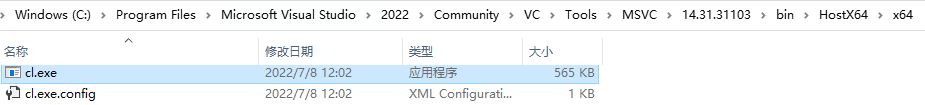

**地址栏** 에 `cmd`를输入하고 `回车键`를按下하면,当前目录에서控制台窗口를创建할 수 있습니다:

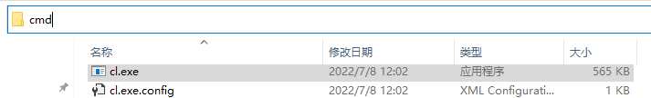

控制台中 `cl.exe /help`를输入하고 `回车键`를按下하면,它的帮助文档를看到할 수 있습니다:

>输入过程中 `Tab键`를按하면自动补全가 가능합니다.

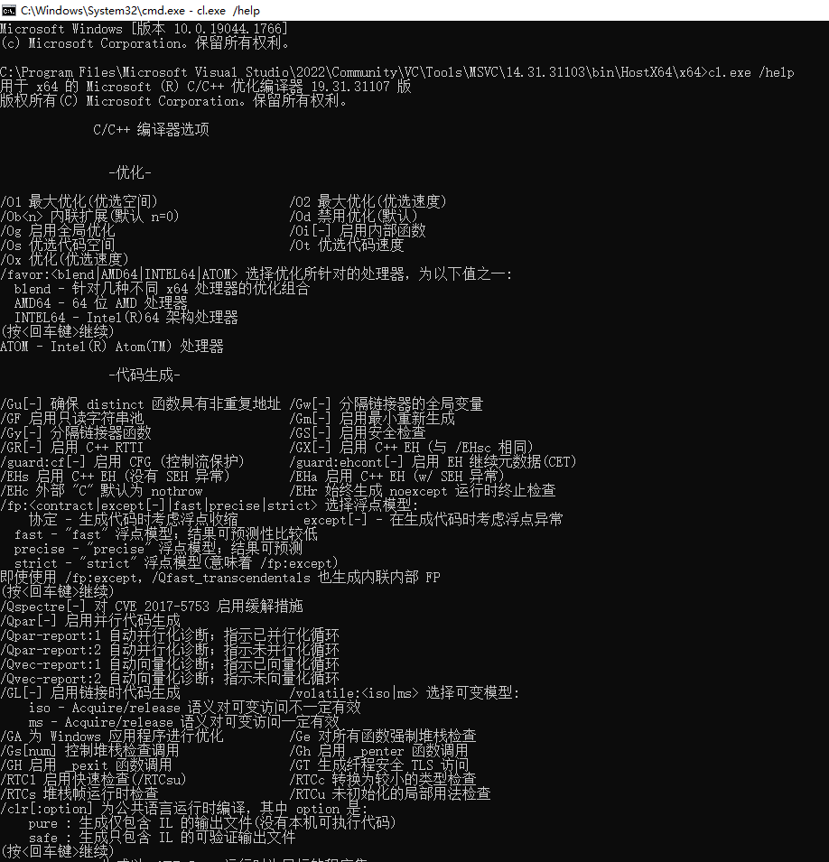

这些参数를看着是否有点眼熟?哟,这不是VS의项目配置吗?

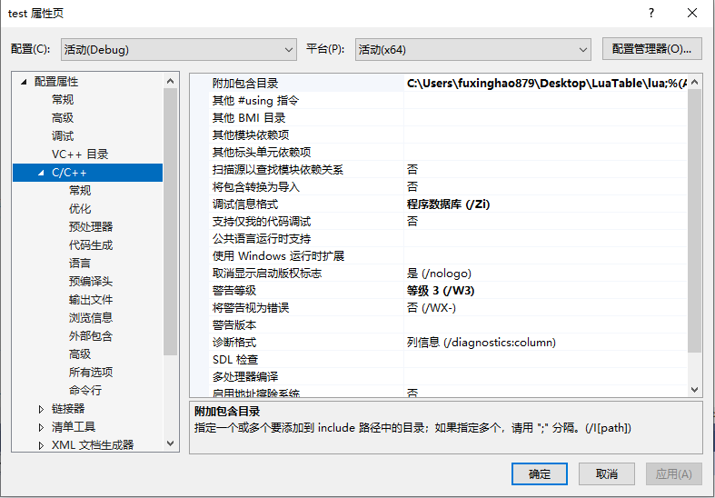

cl.exe는命令行程序입니다.下面我们将这个命令行程序를用하여我们自己의命令行程序를生成할 것입니다.

首先,任意路径下에서新文件를新建하고 **main.cpp** 로命名합니다.其代码如下:

``` c++
#include <iostream>

/**
* argc 为参数的个数
* argv 为参数字符串数组
*/

int main(int argc,char** argv) {
	std::cout << "argc: " << argc << std::endl;
	for (int i = 0; i < argc; i++) {
		std::cout << i <<": " << argv[i] << std::endl;
	}
	return 0;
}
```

windows文件浏览器의地址栏中 `cmd`+`回车`를输入하여控制台窗口를打开하고,先 `cl.exe+回车` 명령어를输入하여测试합니다:

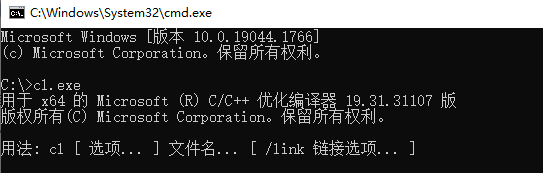

>如果错误가出现한다면: **cl.exe 不是内部或外部命令,也不是可执行的程序** 
>
>控制台程序가当前的工作目录下에서该文件를找到하지 못하기 때문입니다.这个问题를解决하기 위해操作系统往往会提供 **环境变量** 设置를 제공합니다.它允许一些特定目录下의文件가全局访问가 가능하도록 합니다.环境变量에 대해 [此处](https://baike.baidu.com/item/%E7%8E%AF%E5%A2%83%E5%8F%98%E9%87%8F/1730949?fr=aladdin)를查阅하십시오.

接下来我们还需要控制台의运行环境를初始化하여 cl.exe가正确地 C++의标准库路径를搜索할 수 있도록 합니다. VS의如下目录에서 **vcvars64.bat** 文件를找到할 수 있습니다:

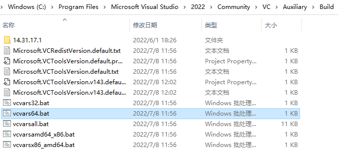

它를我们刚刚的控制台窗口中로拖拽하고 `回车`를按下하면,成功地环境를初始化할 수 있습니다:

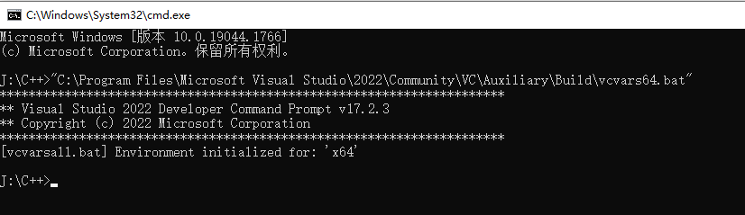

接下来再 `cl.exe main.cpp` 명령어를输入하여该文件를编译합니다:

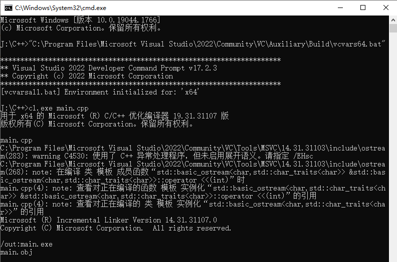

编译成功하면两个文件를生成합니다:

- **main.obj** ：目标文件,编译时的中间文件

- **main.exe** ：windows下的可执行文件

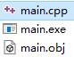

>这里实际上 cl.exe가多个步骤를进行합니다:
>
> - 预编译：源文件（`*.c`，`*.cpp`）를 `*.i` 文件로输出합니다:源代码中的预处理指令,比如#define, #include, #if...를编译합니다.
> - 编译：`*.i` 를 `*.s` 文件로编译합니다:高级语言를汇编语言로转换합니다.
> - 汇编：`*.s` 를 `*.o` 文件로编译합니다:汇编语言를机器指令로转换합니다.
> - 链接：`*.o` 文件를链接하여最终可执行文件（windows下为`*.exe`）로合并합니다.

再控制台中 `main.exe A B C` 명령어를输入하면,如下打印를看到할 수 있습니다:

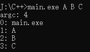

其中参数0은程序的启动路径이며,后面的A、B、C则是我们的附加参数입니다.

在之后的开发过程中,你可能会碰到大量类似这样的命令行程序:

- 它们没有图形界面,只通过参数解析를 통해各类工作를完成합니다.一些复杂的参数에 대해 Qt의 QCommandLineParser와 같은 많은开源的 **CommandLine 파싱 라이브러리** 가 있으며, Github上也有许多可供使用합니다.
- 图形界面程序에 대해也可以该参数를利用하여一些其他功能를实现할 수 있습니다.比如,注册表中启动参数를追加하여程序执行时开机自启인지判断하도록 할 수 있습니다.
- cmd中 `where 指令名` 을输入하면对应的命令行程序的存储位置를找到할 수 있습니다.比如: `where winget` 을输入하면 winget의路径를得到합니다.

> Visual Studio中에서也可手动该参数를设置하여开发时的调试에用于할 수 있습니다:
>
> 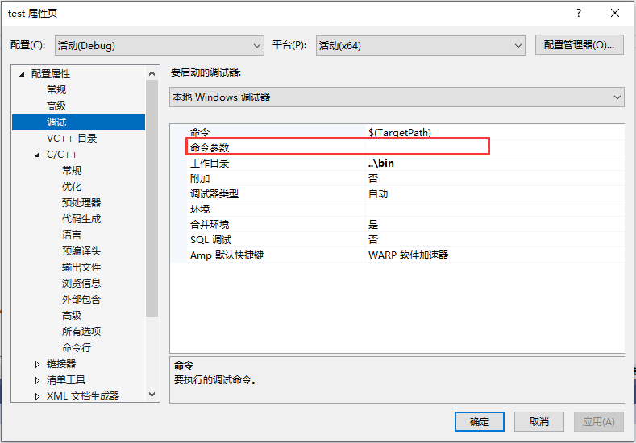

如果你有Qt를 가지고 있다면,同样如下目录에서 **MinGW** 의编译套件를找到할 수 있습니다:（关于它的使用,跟上面的步骤大同小异）

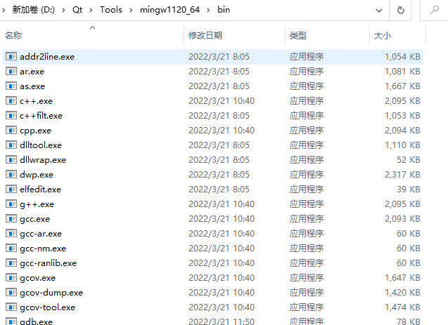

关于C++的编译流水线,读者可以这个文章를查看합니다:

- https://github.com/green7ea/cpp-compilation


## 라이브러리

现实生活中,各类随处可见的设备,你会发现它们都是由一块一块零件拼装起来的,比如常见的 —— 手机,它的组成有电池、屏幕、传感器....

如果手机가零件组成的不是而是一个整体라면,那么可能会发生下面的场景:

- 用户而言,明明只是屏幕坏了,却要整个手机를更换해야 합니다...
- 手机厂商而言,需要更多的方向를把控하여研发压力가倍增하며,不得不投入를扩大해야 합니다.如果公司架构不当,决策权가过度中央에汇集하면研发部门의发展를阻遏할 수 있습니다.

计算机는现实世界的影射로看做할 수 있으며, C++中也必然这类问题가存在합니다.为此,工程师们经常会程序를 **模块化** 로 만들어一些特定功能的集合를一个 **라이브러리（Library）** 에封装합니다.这样的好处有:

- 工程的开发和维护的压力를各个 라이브러리에分摊하여开发团队中的每个人都会轻松许多합니다.
- 超大型工程中, 라이브러리的依赖关系를分析하여编译时间를大幅缩减할 수 있습니다.
- 还能 라이브러리를使用하여程序에插件를扩展할 수 있습니다.

关于 라이브러리, 저자는阅历尚浅하여只会用也说不明白하지만,这里非常非常好的仓库가 하나 있으며一定能帮上你:

- https://github.com/robotology/how-to-export-cpp-library


## 코딩 규范

团队协作中,彼此之间的认知负担를减轻하기 위해往往团队的成员가某一编码规范를遵循하도록要求합니다.就比如:

- Google编码规范：https://google.github.io/styleguide/cppguide.html
- GNU编码规范：https://www.gnu.org/prep/standards/standards.html
- LLVM编码规范：https://llvm.org/docs/CodingStandards.html
- Linux内核编码规范：https://www.kernel.org/doc/Documentation/process/coding-style.rst
- Qt API风格：https://doc.qt.io/archives/qq/qq13-apis.html

每个团队对编码风格的要求可能都不太一样,因此往往需要读者 "타 지역의 풍습에 맞춰 살다" .丑陋的代码는两类만 있습니다:

- 规范를遵循하지 않는代码
- 规范가统一하지 않는代码