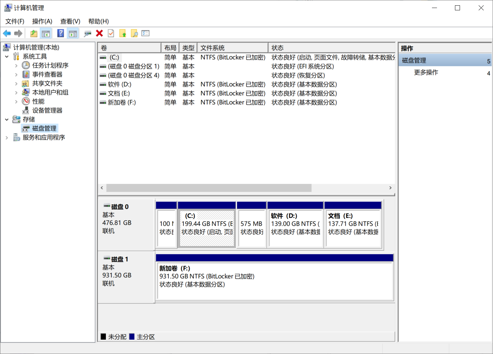
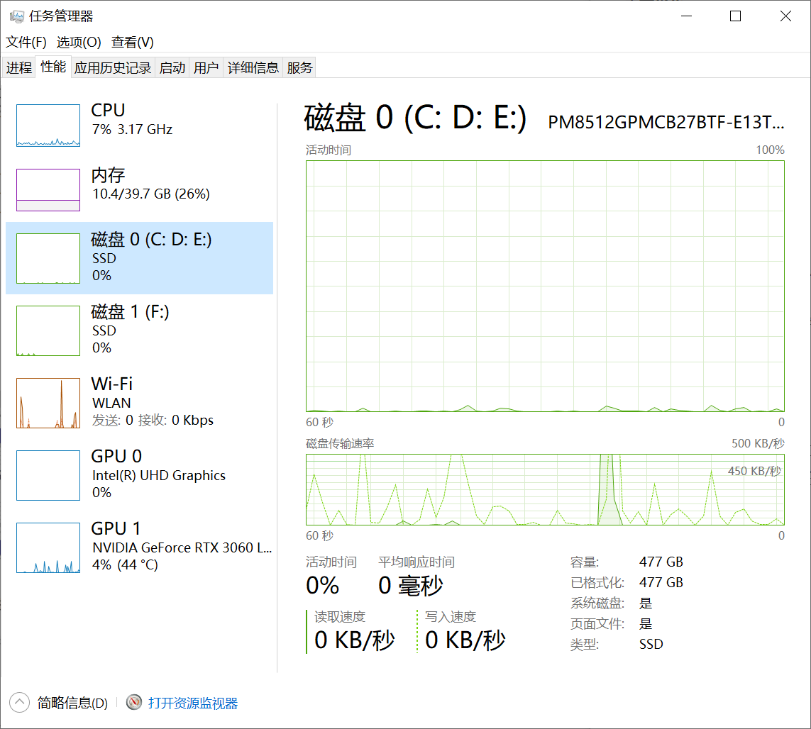
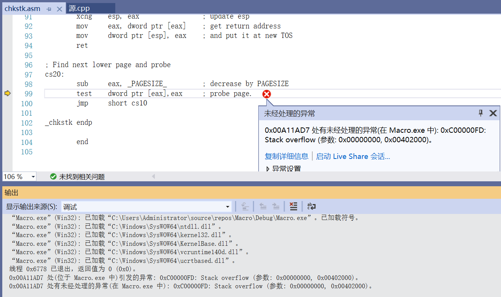
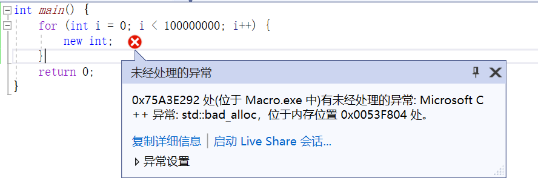
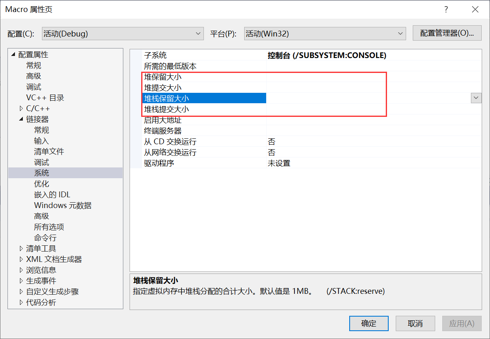
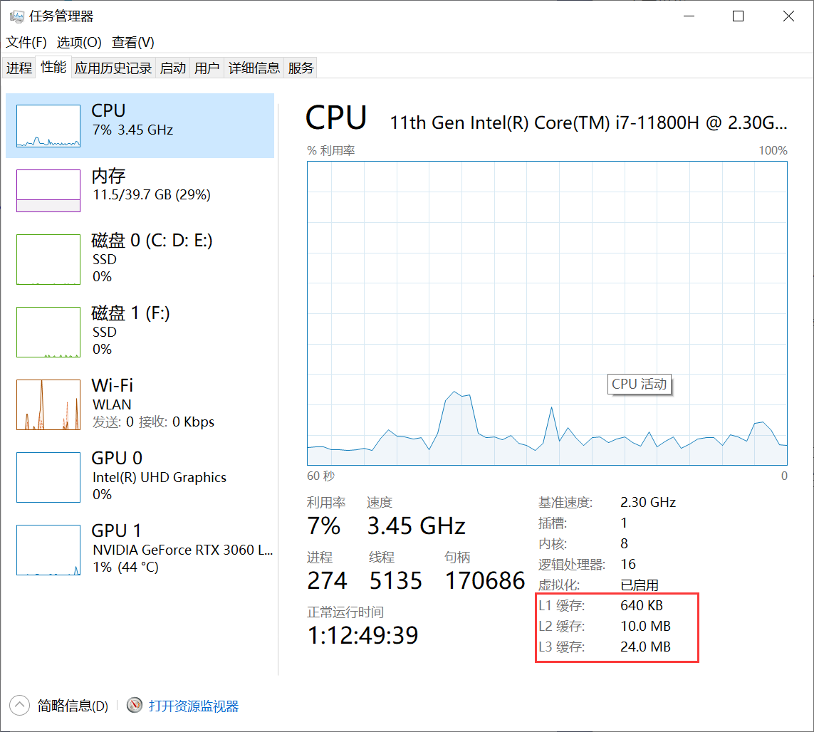

# 메모리 관리

메모리에서 주의해야 할 사항을 자세히 설명하는 훌륭한 글이 있습니다:

-   https://blog.csdn.net/zju_fish1996/article/details/108858577

이미 훌륭한 글이 있으므로, 본 섹션에서는 보충 내용을 다룹니다.

## 기본 개념

컴퓨터의 다양한 데이터는 일반적으로 **디스크**에 **저장**됩니다. 데스크톱 아이콘 `이 PC`를 `마우스 오른쪽 버튼` 클릭 — `관리` — `저장` — `디스크 관리`로 이동하면 디스크를 탐색하고 조작할 수 있습니다:



**작업 관리자**와 **리소스 모니터**에서 디스크의 현재 실행 상태를 확인할 수도 있습니다:



디스크의 데이터가 사용될 때 운영 체제는 해당 데이터를 메모리로 로드합니다. 메모리에 대한 설명은 [백도백과](https://baike.baidu.com/item/%E5%86%85%E5%AD%98/103614)에서 확인할 수 있습니다:

> 메모리는 [컴퓨터](https://baike.baidu.com/item/计算机/140338?fromModule=lemma_inlink)의 중요한 부품으로, [내부 메모리](https://baike.baidu.com/item/内存储器/834392?fromModule=lemma_inlink)와 [주 메모리](https://baike.baidu.com/item/主存储器/10635399?fromModule=lemma_inlink)라고도 하며, CPU의 연산 데이터와 [하드 디스크](https://baike.baidu.com/item/硬盘/159825?fromModule=lemma_inlink) 등 [외부 저장 장치](https://baike.baidu.com/item/外部存储器/4843180?fromModule=lemma_inlink)와 교환하는 데이터를 일시적으로 저장하는 데 사용됩니다. 외부 저장 장치와 [CPU](https://baike.baidu.com/item/CPU/120556?fromModule=lemma_inlink) 간의 통신 다리 역할을 하며, 컴퓨터의 모든 프로그램은 메모리에서 실행되므로 메모리 성능은 컴퓨터 전체 성능에 영향을 미칩니다. 컴퓨터가 실행되면 [운영 체제](https://baike.baidu.com/item/操作系统/192?fromModule=lemma_inlink)는 연산이 필요한 데이터를 메모리에서 CPU로 전송하여 연산을 수행하고, 연산이 완료되면 CPU는 결과를 전송합니다.

### 스택(Stack)과 힙(Heap)

프로그램(Windows의 `exe`)도 데이터의 일종으로, 시작 시 운영 체제는 **고정 크기**의 두 개 메모리를 미리 할당합니다:

- **스택(Stack)** ：주로 함수 스택의 호출 실행에 사용
- **힙(Heap)** ：프로그램 실행 시 동적으로 메모리를 요청하는 주소를 저장하는 데 사용

> 스택의 크기는 고정되지만, 힙의 크기는 구현에 따라 달라지며 사용된 컴파일러에 의존합니다. 힙은 동적으로 할당된 메모리 주소를 연결 리스트로 저장하는 것으로 간주할 수 있으며, MSVC의 힙 **기본 미리 할당 크기는 1MB**이지만 실행 시 사용되는 공간은 1MB를 초과할 수 있습니다.

컴파일러와 플랫폼에 따라 기본 크기가 다릅니다. Windows의 MSVC를 예로 들어 다음 프로그램을 실행하면:

``` c++
int main() {
	char arr[10000000];
	return 0;
}
```

스택에서 프로그램의 미리 할당된 크기를 초과하는 메모리를 생성하거나 사용했기 때문에 Stack Overflow 오류가 발생합니다:



다음 프로그램을 다시 실행하면:

``` c++
int main() {
	for (int i = 0; i < 100000000; i++) {
		new int;
	}
	return 0;
}
```

해당하는 빈 메모리 블록이 없을 때 동적 할당이 실패합니다:



컴파일러를 통해 프로그램의 미리 할당된 스택과 힙 공간 크기를 수동으로 설정할 수 있습니다. Visual Studio에서는 프로젝트 구성에서 수정할 수 있습니다:



> 저자가 사용하는 VS2022에는 **한국어화 오류**가 있어 Stack이 잘못된 "스택"으로 번역되었습니다.

- 명령어: https://learn.microsoft.com/en-us/cpp/build/reference/stack-stack-allocations

### 메모리 조각화

C++에서 `new`/`delete`를 사용하여 동적 메모리를 생성하고 해제하지만, 실제로는 운영 체제마다 메모리 할당 인터페이스가 다릅니다. 예를 들어 Windows는 `VirtualAlloc`/`VirtualFree`를 사용하고, Unix와 Mac은 `mmap`/`munmap`을 사용합니다.

프로그램 실행 중 메모리를频繁하게 할당하고 회수하면 할당된 메모리 사이에 많은 연속적이고 작은 메모리가 발생합니다. 운영 체제의 메모리 할당 알고리즘은 완벽하지 않아 **빈 메모리를 계속 사용할 수 없게** 되는데, 이러한 메모리를 **메모리 조각**이라고 합니다.

### 메모리 정렬

대부분의 CPU는 바이트 단위로 메모리를 읽고 쓰지 않으며, 일반적으로 2, 4, 6, 8바이트를 메모리 액세스 단위로 사용합니다. 이는 메모리 IO 효율을 높이는 데 유리하며, 자세한 내용은 다음을 참고하세요:

- https://zhuanlan.zhihu.com/p/83449008

작업, 하드웨어, 플랫폼에 따라 메모리 정렬에 차이가 있습니다. 개발자는 관련 용어를 모르면 쉽게 함정에 빠질 수 있습니다. 예를 들어:

- SIMD를 사용하려면 16바이트 정렬을 보장해야 합니다.
- GPU에서 요청한 Buffer 사이에 최소 정렬 오프셋 제한이 있습니다.
- 렌더링 API마다 벡터 정렬 방식에 차이가 있습니다.

``` c++
D3D9:{
    {  4,  4,  4,  4 }, // Uint8
    {  4,  4,  4,  4 }, // Uint10
    {  4,  4,  8,  8 }, // Int16
    {  4,  4,  8,  8 }, // Half
    {  4,  8, 12, 16 }, // Float
};

D3D11:{
    {  1,  2,  4,  4 }, // Uint8
    {  4,  4,  4,  4 }, // Uint10
    {  2,  4,  8,  8 }, // Int16
    {  2,  4,  8,  8 }, // Half
    {  4,  8, 12, 16 }, // Float
};

GL、Vulkan、Metal: {
    {  1,  2,  4,  4 }, // Uint8
    {  4,  4,  4,  4 }, // Uint10
    {  2,  4,  6,  8 }, // Int16
    {  2,  4,  6,  8 }, // Half
    {  4,  8, 12, 16 }, // Float
};
```

### 고속 캐시

메모리의 읽기/쓰기 속도는 빠르지만 CPU 연산 속도가 더 빠르므로, CPU는 데이터의 도착(읽기)과 전송(저장)을 기다리는 데 많은 시간을 소비합니다. CPU의 메모리 액세스 평균 시간을 줄이기 위해 컴퓨터 저장 시스템에는 **CPU 고속 캐시**가 도입되었습니다. [백도백과](https://baike.baidu.com/item/CPU%E7%BC%93%E5%AD%98)에서 정의는 다음과 같습니다:

> 컴퓨터 시스템에서 **CPU 고속 캐시**(영어: CPU Cache)는 프로세서가 메모리에 액세스하는 평균 시간을 줄이기 위한 부품입니다.
>
> 피라미드형 저장 시스템에서 CPU 레지스터 다음으로 두 번째 층에 위치하며, 용량은 [메모리](https://baike.baidu.com/item/内存)보다 훨씬 작지만 속도는 프로세서 주파수에 근접합니다.
>
> 프로세서가 메모리 액세스 요청을 보내면 먼저 캐시에 요청 데이터가 있는지 확인합니다. 존재하면(히트) 메모리에 액세스하지 않고 직접 데이터를 반환하며, 존재하지 않으면(미스) 메모리의 해당 데이터를 캐시에 로드한 후 프로세서에 반환합니다.
>
> 캐시가 효과적인 이유는 프로그램 실행 시 메모리 액세스가 지역성(Locality) 특징을 보이기 때문입니다. 이 지역성은 공간 지역성(Spatial Locality)과 시간 지역성(Temporal Locality)을 포함하며, 이 지역성을 효과적으로 활용하면 캐시 히트율을 매우 높일 수 있습니다.
>
> 프로세서 관점에서 캐시는 투명한 부품입니다. 따라서 프로그래머는 일반적으로 캐시 작업을 직접 조작할 수 없지만, 캐시의 특징에 따라 프로그램 코드를 특정 최적화하여 캐시를 더 잘 활용할 수 있습니다.

Windows에서 작업 관리자를 열어 컴퓨터의 Cache 정보를 확인할 수 있습니다:



프로그램이 메모리 블록에 액세스하면 주변 영역을 함께 캐시에 로드할 수 있습니다(추가로 일부 내용을 로드해도 비용이 많이 들지 않기 때문). 다음에 액세스할 메모리가 이미 캐시에 로드된 경우(캐시 히트), CPU는 메모리에 액세스하지 않아 속도가 향상됩니다.

다음 예제 코드는 캐시의 중요성을 이해할 수 있게 합니다:

``` c++
#include <iostream>
#include <chrono>
#include <vector>

class ClockGuard {			//한 스코프의 실행 시간을 출력하는 클래스
public:
	ClockGuard(const std::string& inDest)
		:mDesc(inDest)
	{
		mStartTime = std::chrono::steady_clock::now();
	}
	~ClockGuard() {
		std::chrono::steady_clock::time_point currentTime = std::chrono::steady_clock::now();
		double durationNs = std::chrono::duration<double, std::nano>(currentTime - mStartTime).count();
		std::cout << mDesc << " Cost: " << durationNs << " Ns" << std::endl;
	}
private:
	std::string mDesc;
	std::chrono::steady_clock::time_point mStartTime;
};

const size_t bigger_than_cachesize = 10 * 1024 * 1024;
long* ptr = new long[bigger_than_cachesize];
void ClearCPUCache() {				//캐시를 비우려는 시도
	for (int i = 0; i < bigger_than_cachesize; i++){
		ptr[i] = rand();
	}
}

int main(int argc,char** argv) {
	std::vector<int*> continuous(1000);		//메모리가 연속적인 배열
	std::vector<int*> dispersive(1000);		//메모리가 분산된 배열

	for (int*& item : continuous) {		
		item = new int;
	}

	const int spacing = 10000;	   		//메모리 간격, 이 값을 조정하여 cache의 영향을 확인
	for (int*& item : dispersive) {	   		
		item = new int[spacing];
	}

	ClearCPUCache();
	{
		ClockGuard guard("continuous");		//연속적인 메모리에 값을 할당, 캐시 히트율이 높음
		for (int*& item : continuous) {
			*item = 1;
		}
	}
    
	ClearCPUCache();
	{
		ClockGuard guard("dispersive");		//분산된 메모리에 값을 할당, 캐시 히트율이 낮음 
		for (int*& item : dispersive) {
			*item = 1;
		}
	}

	return 0;
}
```

메모리 컨텍스트 조정을 최소화하면 캐시 히트율을 효과적으로 높일 수 있습니다. 인간의 뇌도 이런 메커니즘이 있으니 확인해 보세요:

<p style="text-align:center"><iframe width="560" height="315" src="//player.bilibili.com/player.html?aid=218871639&bvid=BV1o8411x7aE&cid=855664393&page=1&autoplay=false" scrolling="no" border="0" frameborder="0" framespacing="0" allowfullscreen="true"></iframe></p>

캐시에 대한 더 깊은 내용은 다음 글을 참고하세요:

- https://zhuanlan.zhihu.com/p/490910129

### 하드웨어 가속

메모리에는 캐시 메커니즘 외에도 **흑마법** 같은 사용 방식이 있습니다. 예를 들어 다음 코드:

``` C++
#include <iostream>
#include <chrono>
#include <vector>

class ClockGuard {
public:
	ClockGuard(const std::string& inDest)
		:mDesc(inDest) {
		mStartTime = std::chrono::steady_clock::now();
	}
	~ClockGuard() {
		std::chrono::steady_clock::time_point currentTime = std::chrono::steady_clock::now();
		double durationNs = std::chrono::duration<double, std::nano>(currentTime - mStartTime).count();
		std::cout << mDesc << " Cost: " << durationNs << " Ns" << std::endl;
	}
private:
	std::string mDesc;
	std::chrono::steady_clock::time_point mStartTime;
};

const size_t bigger_than_cachesize = 10 * 1024 * 1024;
long* ptr = new long[bigger_than_cachesize];
void ClearCPUCache() {
	for (int i = 0; i < bigger_than_cachesize; i++) {
		ptr[i] = rand();
	}
}

int main(int argc, char** argv) {
	std::vector<int> src(100000);
	std::vector<int> dst(100000);

	ClearCPUCache();
	{
		ClockGuard guard("Copy");		//일반 C++ 복사
		for (int i = 0; i < src.size(); ++i) {
			dst[i] = src[i];
		}
	}
	ClearCPUCache();
	{
		ClockGuard guard("Map");		//메모리 복사
		memcpy(dst.data(), src.data(), src.size());
	}

	return 0;
}
```

C++ 문법에서 `for (int i = 0; i < src.size(); ++i) { dst[i] = src[i]; }`보다 간단한 코드를 작성할 수 없지만, `memcpy`를 사용하면 동일한 작업을 수행하면서 성능이 크게 향상됩니다. 이는 `memcpy`가 어셈블리 수준의 최적화를 사용하며 하드웨어 특성과 강하게 관련되어 있기 때문입니다:

- ARM64 아키텍처에서 memcpy 구현 원리: https://blog.csdn.net/m0_46250244/article/details/115055101

그래픽스 학습 과정에서 GPU에서도 유사한 작업을 접하게 될 것이므로, 하드웨어의 시스템 구조를 자세히 이해해야 합니다.

### 최적화 방향

综上，内存优化的主要策略其实主要就是围绕着以下几点：

- **메모리 조각화를 줄이고 캐시 히트율을 높이기**
- **응용 시나리오와 하드웨어 특성을 결합하여 효율적인 메모리 작업 방법 사용**

## 객체 생명주기 관리

현대 프로그램 개발 과정에는 수많은 객체가 존재합니다. 스택에 요청된 객체는 스코프를 벗어나면 자동으로 해제되지만, 힙에 요청된 객체는 생명주기를 수동으로 관리해야 합니다. C++에서는 new와 delete가 일대일로 대응되도록 보장해야 합니다. 이상적인 경우는 다음과 같습니다:

``` c++
void Func(){
    Object* object = new Object;
    //...
    delete object;
}
```

하지만 현실은 잔인합니다. 코드에 논리 분기나 중첩 함수가 있거나 객체의 생명주기가 전달되면 delete를 수동으로 제어하기 어려워집니다:

``` c++
void Func(){
    Object* object = new Object;
    if(...){
        //Do something 
        delete object;
        return;
    }
    else if(...){
        //Do something 
        delete object;
        return;
    }
    else if(...){
        //Do something 
        delete object;
        return;
    }
}
```

이에 객체 생명주기를 자동으로 관리하는 전략이 필요하며, 현재 주요 방식은 두 가지입니다:

- 스마트 포인터
- 가비지 컬렉션

### 스마트 포인터

C++의 다양한 라이브러리에는 공유 포인터 개념이 제공되며, 핵심 아이디어는 다음과 같습니다:

- 실제 객체 포인터를 외부 객체로 감싸고, 외부 객체의 생성, 소멸, 복사를 모니터링하여 공용 메모리를 사용해 포인터의 참조를 기록합니다. 참조가 0이 되면 객체를 파괴합니다.

간단한 모방 예시는 다음과 같습니다:

```c++
struct SharedPtrRefData{
    uint refCount = 0; 
};

template<Typename _Ty>
class SharedPtr{
public:
	SharedPtr(_Ty* rawPtr)						//생성자
    	: mRawPtr(rawPtr)
        , mRefData(new SharedPtrRefData)		//공용 메모리 새로 생성
    {
        mRefData->refCount++;					//참조 카운트 +1
	}
    
    SharedPtr(const SharedPtr<_Ty>& other){		//복사 함수
        mRefData = other.mRefData;				//공용 메모리 전달
        mRefData->refCount++;					//참조 카운트 +1
    }
    
    ~SharedPtr(){								//소멸 함수
        mRefData->refCount--;					//참조 카운트 -1
        if(mRefData->refCount == 0){	
            delete mRawPtr;						//객체 파괴
            delete mRefData;					//공용 메모리 파괴
        }
    }
private:
    _Ty* mRawPtr;
    SharedPtrRefData* mRefData;
};
```

이 구조는 다음 프레임워크에서 구현됩니다:

- C++ 표준 라이브러리： **std::shared_ptr**
- Unreal Engine： **TSharedPtr**
- Qt： **QSharedPointer**

SharedPtr를 사용하면 포인터 객체에 액세스할 때 반드시 해제되지 않았음을 보장할 수 있지만, 때로는 "공유 포인터"가 **객체의 생명주기를 연장하지 않지만 나중에 객체가 파괴되었는지 판단할 수 있도록** 원할 수 있습니다. 프레임워크에서는 이 구조를 **WeakPtr**라고 하며, 다음과 대응됩니다:

- C++ 표준 라이브러리： **std::weak_ptr**
- Unreal Engine： **TWeakPtr**
- Qt： **QWeakPointer**

std를 예로 들어:

```c++
#include <iostream>

int main() {
	std::shared_ptr<int> sptr(new int);
	std::weak_ptr<int> wptr(sptr);
	if (const std::shared_ptr<int>& lock = wptr.lock()) {
		std::cout << "exist !!!" << std::endl;
	}
	else {
		std::cout << "not exist" << std::endl;
	}
	sptr.reset();
	if (const std::shared_ptr<int>& lock = wptr.lock()) {
		std::cout << "exist !!!" << std::endl;
	}
	else {
		std::cout << "not exist !" << std::endl;
	}
	return 0;
}

/*
exist !!!
not exist !
*/
```

위 SharedPtr의 간단한 코드에서 `refCount`가 0이 되면 객체와 공용 메모리가 동시에 파괴되지만, 실제로 `SharedPtrRefData`에는 `refCount`와 `weakCount` 두 개의 카운터가 존재합니다. `refCount`가 0이 되면 객체만 파괴되고 공용 메모리는 파괴되지 않아 WeakPtr가 여전히 공유 메모리에 액세스하여 객체가 존재하는지 확인할 수 있습니다. `weakCount`도 0이 되어야 공용 메모리가 파괴됩니다.

노출 포인터의 경우 delete는 객체 메모리만 파괴하고 포인터가 가리키는 주소는 여전히 존재하므로 관리가 잘못되면 야생 포인터가 발생하여 메모리 누수가 발생합니다. WeakPtr는 이 문제를 해결합니다.

또 다른 경우는 new로 생성된 객체가 일반 객체처럼 스코프를 벗어나면 파괴되도록 원하는 경우입니다:

``` c++
class Example{
public:
    Example()
   		: mObject(new Object)
    {}
    ~Example(){
        delete mObject;
    } 
private:
    Object* mObject;
}
```

이 경우 다음을 사용할 수 있습니다:

- C++ 표준 라이브러리： **std::unique_ptr**
- Unreal Engine： **TUniquePtr**
- Qt： **QScopedPointer**

> Qt의 명명이 그 역할을 더 잘 나타내는 것 같습니다.

위 코드를 UniquePtr로 다시 작성하면 다음과 같습니다:

``` c++
class Example{
public:
    Example()
   		: mObject(new Object)
    {}
private:
    std::unique_ptr<Object> mObject;
};
```

스마트 포인터는 개발 과정의 대부분 문제를 해결할 수 있지만 완벽하지 않습니다. 다음 **주의 사항**이 있습니다:

- 스마트 포인터를 사용할 때 생성 또는 `reset` 함수에서 new 객체를尽量 사용하고, 스마트 포인터 외부에서 노출 포인터를 조작하지 마세요.

  ``` c++
  
  ```
  
- `std::shared<int> sptr(this)`를 사용할 수 없습니다. this로 공유 포인터를 생성하려면 this의 클래스가 `enable_shared_from_this` 템플릿을 상속해야 합니다.
- 불필요한 SharedPtr를大量使用하면 일정한 낭비가 발생합니다. SharedPtr를 사용하는 본래 목적은 객체의 생명주기를 유지하는 것이므로, 인터페이스를封装할 때 인터페이스가 객체의 생명주기를 전달할 필요가 없다면 SharedPtr를 노출하지 말고 WeakPtr 또는 RawPtr를 사용해야 합니다.
- 멀티스레드 환경에서 사용할 때 사용하는 SharedPtr가 스레드 안전한지 확인하여 참조 카운트가 정상적으로 작동하도록 보장해야 합니다.

此外，还有一些 **隐患** ：

- 공유 포인터를 사용할 때 매개변수의 생명주기를 무시하기 쉽습니다. 내부에 공유 포인터가 있으면 메모리 누수가 발생합니다:

  ``` c++
  #include <iostream>
  #include <functional>
  
  class Exmaple {
  public:
  	Exmaple() {
  		std::cout << "Create" << std::endl;
  	}
  	~Exmaple() {
  		std::cout << "Destroy" << std::endl;
  	}
  };
  
  int main(int argc, char** argv) {
  	{
  		std::function<void()> func0;
  		{
  			std::shared_ptr<Exmaple> sptr(new Exmaple);
  			std::function<void()> func1 = [sptr]() {};	//공유 포인터를 캡처 매개변수로 사용
  			std::cout << "---------0" << std::endl;
  			//func0 = func1;		//주석을 해제하면 Example이 1과 2 사이에 해제됨
  		}
  		std::cout << "---------1" << std::endl;
  	}
  	std::cout << "---------2" << std::endl;
  	return 0;
  }
  /*
  lambda의 캡처 매개변수는 스코프를 벗어나고 function 참조가 없을 때만 해제됨
  function을及时销毁或重置하지 않으면 캡처 매개변수가 계속 존재하여 메모리 누수가 발생함
  */
  ```

- SharedPtr에 순환 참조 문제가 존재합니다.

  ```c++
  #include <iostream>
  
  struct B;
  
  struct A {
  	~A() {
  		std::cout << "destruct A" << std::endl;
  	}
  	std::shared_ptr<B> mB;
  };
  
  struct B {
  	~B() {
  		std::cout << "destruct B" << std::endl;
  	}
  	std::shared_ptr<A> mA;
  };
  
  int main() {
  	{
  		std::shared_ptr<A> a(new A);
  		std::shared_ptr<B> b(new B); 
  		a->mB = b;
  		b->mA = a;
  	}
  	return 0;	//객체가 해제되지 않음
  }
  ```

- SharedPtr의 파괴는 즉시 이루어지므로 대형 시스템에서 한 번에大量 객체를 파괴하면 끊김이 발생할 수 있습니다.

공유 포인터에 대한 더 깊은 내용은 다음 글을 참고하세요:

- https://zhuanlan.zhihu.com/p/532215950

### 가비지 컬렉션

공유 포인터의 결점을 해결하기 위해 일부 고급 언어와 대형 프레임워크는 가비지 컬렉션(Garbage Collection) 메커니즘을 제공하여 순환 참조 문제를 해결하고 지연 파괴를 구현합니다.

> C++의 특성(역사적 이유)으로 인해 서툰 가비지 컬렉션 메커니즘이 C++ 표준에 들어가면 더 혼란스러워지므로 C++의 가비지 컬렉션은 일반적으로 프레임워크 자체에서 사용자 정의합니다. UE와 Qt는 C++ 표준 범위를 벗어나网友们戏称其为U++和Q++입니다.

현재笔者가较多了解한 GC 메커니즘은 다음과 같습니다:

- Unreal Engine
- Qt、FBX SDK
- Lua

开发者而言，关于GC主要需要了解两点：

- 객체 간의 참조 관계를 어떻게 표시할지
- 가비지 컬렉션을 어떻게 수행할지

Java, C#, Python, Lua 등 고급 언어는 가상 머신의 특성으로 객체 간의 참조를 모니터링하기 쉽지만, C++에서는 객체 간의 참조를 수동으로 설정하거나 리플렉션을 통해 분석해야 합니다.

Qt는 QObject를 기본 클래스로 사용하며 메모리 회수가 매우 간단합니다:

```cpp
class QObject{
public:
    QObject(QObject * parent = nullptr);
private:
    QVector<QObejct*> children;
    QObject *parent;
}
```

- QObject에는 parent 포인터와 children 목록이 있으며 QObject를 파괴할 때 children도 동시에 파괴합니다.
- QObject는 deleteLater() 함수를 제공하여 객체를 배열에 추가하고 이벤트 처리 루프가 끝난 후 파괴합니다.

FBX SDK는 FbxObject를 기본 클래스로 사용하며 인스턴스를 생성할 때 부모 객체를 지정해야 합니다:

```cpp
FbxManager* lManager = FbxManager::Create();
FbxIOSettings* lIOSettings = FbxIOSettings::Create(lManager, "");
FbxScene* scene = FbxScene::Create(lManager,"");
FbxSkeleton* skeletonNode = FbxSkeleton::Create(scene,"SkeletonRoot");
FbxCluster* rootCluster = FbxCluster::Create(skeletonNode, "");
```

- 부모 객체가 해제되면 자식 객체도 해제됩니다.

위 두 프레임워크의 메모리 회수 주체 구조는 매우 간단하며, 루프 문제에 대해 parent를 지정할 때 검사를 수행하고 루프가 발생하면 직접 오류를 출력합니다.

UE의 GC 메커니즘은 훨씬 복잡합니다. UE에서 참조를 구성하는 주요 방식은 두 가지입니다:

- UProperty（리플렉션）：UE는 UObject의 Property를 분석하여 두 객체 간의 참조를 확인합니다.
- FGCObject：참조 관계를 수동으로 구성하는 인터페이스 클래스입니다. UE의绝大多数 프레임워크(UMG, Editor, Niagara 등)는 FGCObject를 상속하여 GC 참조 관리 메커니즘을 구현하여开发者가某些 인터페이스를 호출할 때 객체 간의 참조를 암시적으로 구성합니다.

UE의 회수 방식은 비교적 복잡하여 여기서는展开하지 않으며 일반적으로定时定量 회수하는 것을了解하면 됩니다.

여기서는 간단한 마크-청소 알고리즘을介绍하며 핵심은 다음과 같습니다:

- 모든 회수 가능한 객체를 배열에 저장합니다.
- 객체 간의 참조 관계를 저장합니다.
- 전역 루트 노드를拥有하며 다른 노드가该 노드에 도달하는 참조 관계가 있으면该 노드는可达性이 있는 것으로 간주합니다.
- 가비지 컬렉션 시 게임 스레드를挂起하여所有 객체가使用되지 않도록 보장합니다.
- 루트 노드에서遍历하여所有可达性 노드를标记합니다.
- 객체 배열을遍历하여不可达性 노드를 파괴합니다.

간단한 버전의 구현은 다음과 같습니다(更多细节请查看：[Mark-and-Sweep：垃圾收集算法](https://link.zhihu.com/?target=https%3A//www.geeksforgeeks.org/mark-and-sweep-garbage-collection-algorithm/))：

```cpp
class ObjectBase{
public:
    typedef short ID;
public:
    ObjectBase();
    virtual ~ObjectBase();
    void addRefrence(ObjectBase * ref);     //객체 참조 추가
    void removeRefrence(ObjectBase* ref);   //객체 참조 제거
private:
    friend class ObjectManagement;
    ID id;                      //该 객체에唯一 ID 할당
    std::list<ID> refrence;     //참조 객체의 ID 목록
};
```

> 여기서는 short를 사용하는데, 이는 2바이트로 2^15(32767)개의 수를表示할 수 있어 ID로足够하기 때문입니다.

所有 ObjectBase 객체를管理하기 위해 전역 관리 객체 **GObjectManagement**를创建하며 생성 시该 객체를其中에添加하고 파괴 시 제거합니다:

```cpp
ObjectBase::ObjectBase(){
    GObjectManagement.AddObject(this);
}

ObjectBase::~ObjectBase(){
    GObjectManagement.RemoveObject(this);
}
```

ObjectManagement의定义如下：

```cpp
class ObjectManagement {
public:
    ObjectManagement() {
        for (int i = 0; i < mObjects.size(); i++) {     //Id 스택 초기화
            mObjects[i].object = nullptr;
            mIdStack[i] = i;
        }
    }
    void AddObject(ObjectBase* obj) {       //객체 추가
        if (obj != nullptr) {
            obj->id = allocId();
            mObjects[obj->id].object = obj;
            ++mCurrentNumberOfObject;
            mMaxIdOfObject = std::max(mMaxIdOfObject, obj->id);
        }
    }
    void RemoveObject(ObjectBase* obj) {    //객체 제거
        if (obj != nullptr) {
            mObjects[obj->id].object = nullptr;
            freeId(obj->id);
            --mCurrentNumberOfObject;
        }
    }
    void GarbageCollection() {              //가비지 컬렉션
        MarkObjects(0);        //这里假设0号节点是游戏全局的根节点，从它开始遍历，标记可达对象
        for (int i = 0; i <= mMaxIdOfObject; i++) {     //简单遍历所有对象，销毁不可达对象
            if (!mObjects[i].reachable) {
                delete mObjects[i].object;
            }
            else {      //还原状态，为下一此可达性遍历做准备
                mObjects[i].reachable = false;
            }
        }
    }

    void MarkObjects(const ObjectBase::ID& Id) {                //深度遍历所有节点
        ObjectBase* obj = mObjects[Id].object;
        if (obj != nullptr && !mObjects[Id].reachable) {        //要求节点不可达，为了避免出现环路
            mObjects[Id].reachable = true;
            for (auto& subId : obj->refrence) {
                MarkObjects(subId);
            }
        }
    }

private:
    ObjectBase::ID allocId() {                  //从栈顶分配Id
        assert(mIdStackTop < mIdStack.size());
        return mIdStack[mIdStackTop++];
    }
    
    void freeId(ObjectBase::ID id) {            //回收Id
        assert(mIdStackTop > 0);
        mIdStack[--mIdStackTop] = id;
    }

public:
    struct ObjectItem{
        ObjectBase* object;
        bool reachable = false;
    };

    static const int MAX_NUMBER_OF_OBJECT = std::numeric_limits<ObjectBase::ID>().max();

    std::array<ObjectItem, MAX_NUMBER_OF_OBJECT> mObjects;      //这里创建了32767大小的定长数组，用于存储所有的Object
    
    std::array<ObjectBase::ID, MAX_NUMBER_OF_OBJECT> mIdStack;  //该定长数组用于模拟栈来分配和回收ID，保证Id不会快速膨胀
    ObjectBase::ID mIdStackTop = 0;                             //栈顶索引

    ObjectBase::ID mCurrentNumberOfObject = 0;                  //当前存在的Object数量
    ObjectBase::ID mMaxIdOfObject = 0;                          //整个程序中所使用过的最大ID，用于减少遍历数
};

//全局静态对象
static ObjectManagement GObjectManagement;
```

下面编写代码进行简单测试：

```cpp
class Object : public ObjectBase {
public:
    Object(std::string name):mName(name){
        std::cout << "construct object : " << mName << std::endl;
    }
    virtual ~Object(){
        std::cout << "destruct object : " << mName << std::endl;
    }
private:
    std::string mName;
protected:
};

int main() {
    Object* root = new Object("Root");                      //默认把第一个节点当做游戏根节点
    Object* a = new Object("A");
    Object* b = new Object("B");
    Object* c = new Object("C");                            
    Object* d = new Object("D");
    Object* e = new Object("E");
    Object* f = new Object("F");

    root->addRefrence(a);                                   //    root
    root->addRefrence(b);                                   //    /  \ 
    b->addRefrence(c);                                      //   A    B
    b->addRefrence(d);                                      //       / \ 
    c->addRefrence(e);                                      //      C   D
    c->addRefrence(f);                                      //     / \ 
    e->addRefrence(f);                                      //    E - F

    std::cout << "Garbage Collection : 0" <<std::endl;      // 没有对象被回收
    GarbageCollection();
    std::cout << "-----------------------" << std::endl;

    b->removeRefrence(c);                                   //  去除B对C的引用，C、E、F将会被销毁
    std::cout << "Garbage Collection : 1" << std::endl;
    GarbageCollection();
    std::cout << "-----------------------" << std::endl;
}
```

``` c++
construct object : Root
construct object : A
construct object : B
construct object : C
construct object : D
construct object : E
construct object : F
Garbage Collection : 0
-----------------------
Garbage Collection : 1
destruct object : C
destruct object : E
destruct object : F
-----------------------
```

## 内存调度框架

开源社区에는 메모리 조각화를减少하고 캐시 히트율을 높이기 위한 많은 메모리 스케줄링 프레임워크가出现했으며比较知名的有：

### [mimalloc](https://github.com/microsoft/mimalloc)

mimalloc은出色的[性能](https://github.com/microsoft/mimalloc#performance)特征을 가진通用分配器입니다.最初由 Daan Leijen 为[Koka](https://koka-lang.github.io/)和[Lean](https://github.com/leanprover/lean)语言的运行时系统开发 

- **小而一致** ：该库使用简单且一致的数据结构，大约有 8k LOC。这使得它非常适合集成和适应其他项目。对于运行时系统，它提供了用于单调*心跳*和延迟释放的钩子（对于具有引用计数的有界最坏情况时间）。
- **空闲列表分片** ：每个“mimalloc 页”有许多较小的列表，而不是一个大的空闲列表（每个大小类），这减少了碎片并增加了局部性——及时分配的东西在内存中分配得很近。（一个 mimalloc 页包含一个大小级别的块，在 64 位系统上通常是 64KiB）。
- **自由列表多分片** ：好主意！我们不仅将每个 mimalloc 页面的空闲列表分片，而且对于每个页面，我们都有多个空闲列表。特别是，有一个用于线程本地`free`操作的列表，另一个用于并发`free` 操作。从另一个线程中释放现在可以是单个 CAS，而无需线程之间的复杂协调。由于将有数千个单独的空闲列表，争用自然分布在堆上，并且在单个位置上竞争的机会将很低——这与跳过列表等随机算法非常相似，其中添加随机预言机消除了需要对于更复杂的算法。
- **急切页面重置** ：当“页面”变空时（由于空闲列表分片的机会增加），内存被标记为操作系统未使用（“重置”或“清除”）减少（真实）内存压力和碎片，特别是在长时间运行的程序。
- **安全** : *mimalloc*可以在安全模式下构建，添加保护页、随机分配、加密空闲列表等，以防止各种堆漏洞。性能损失通常比我们的基准平均高出 10% 左右。
- **一流的堆** ：有效地创建和使用多个堆来跨不同区域进行分配。堆可以一次销毁，而不是单独释放每个对象。
- **有界** ：它不会受到*膨胀* 的影响，有界最坏情况分配时间 ( *wcat* )，有界空间开销（约 0.2% 元数据，分配大小最多浪费 12.5%），并且没有内部点仅使用原子操作的争用。
- **快速** ：在我们的基准测试中， *mimalloc*优于其他领先的分配器（*jemalloc*、*tcmalloc*、*Hoard*等），并且通常使用更少的内存。一个不错的特性是它在广泛的基准测试中始终表现良好。对于较大的服务器程序，也有很好的巨大操作系统页面支持。

### [oneTBB](https://www.intel.com/content/www/us/en/developer/tools/oneapi/onetbb.html)

英特尔® oneAPI 线程构建块 (oneTBB) 是一个灵活的性能库，即使您不是线程专家，也可以简化为跨加速架构的复杂应用程序添加并行性的工作。

- **指定逻辑性能，而不是线程**
  运行时库自动将逻辑并行映射到线程上，从而最有效地利用处理器资源——无需您管理线程。
- **以线程为目标提高性能**
  专注于并行化计算密集型工作的特定目标，提供更高级别、更简单的解决方案。
- **与其他线程包共存 **
  它能够与其他线程无缝兼容，使您可以灵活地保持旧代码不变，并使用 oneTBB 进行新的实现。
- **强调可扩展的数据并行编程**
  oneTBB 强调数据并行编程，而不是将程序分解成功能块并为每个功能块分配一个单独的线程，从而使多个线程能够在集合的不同部分上工作。通过将集合分成更小的部分，这可以很好地扩展到更多的处理器。随着您添加处理器和加速器，程序性能会提高。

### [jemalloc](https://github.com/jemalloc/jemalloc)

jemalloc 是一个通用的`malloc(3)`实现，它强调避免碎片化和可扩展的并发支持。它旨在用作系统提供的内存分配器，如在 FreeBSD 的 libc 库中，以及用于链接到 C/C++ 应用程序。jemalloc 提供了许多超出标准分配器功能的内省、内存管理和调整功能。

### [tcmalloc](https://github.com/google/tcmalloc)

TCMalloc 是 Google 对 C`malloc()`和 C++ 的自定义实现，`operator new`用于C 和 C++ 代码中的分配内存。此自定义内存分配框架是 C 标准库（在 Linux 上通常通过`glibc`）和 C++ 标准库提供框架的替代方案。

- 性能随应用程序的并行程度提升
- 依附于C++14 和 C++17 进行了优化，并且在保证性能优势的情况下与标准略有不同（这些在[TCMalloc 参考](https://github.com/google/tcmalloc/blob/master/docs/reference.md)中注明）
- 允许在某些架构下提高性能的扩展，以及其他行为，例如指标收集

- 通过管理特定大小的内存块（称为“页面”）从操作系统执行分配。
- 将单独的页面（或在 TCMalloc 中称为“跨度”的页面运行）用于特定的对象大小。例如，所有 16 字节的对象都放置在专门为该大小的对象分配的“跨度”中。在这种情况下获取或释放内存的操作要简单得多。
- 将内存保存在*缓存中*以加快对常用对象的访问。如果以后重新分配此类内存，即使在释放后保留此类缓存也有助于避免代价高昂的系统调用。

### 使用方法

这些框架的使用方法也很简单，它们提供了自己的内存分配和释放接口，我们只需覆盖C++的operator，并使用这些内存接口来操作内存即可：

> 以mimalloc，使用下面的代码可以覆盖C++的 `new` 和 `delete`

```c++
#include <vcruntime_new.h>

_NODISCARD _Ret_notnull_ _Post_writable_byte_size_(_Size) _VCRT_ALLOCATOR
void* __CRTDECL  operator new  (size_t Size) { return mi_malloc(Size ? Size : 1); }

_NODISCARD _Ret_notnull_ _Post_writable_byte_size_(_Size) _VCRT_ALLOCATOR
void* __CRTDECL operator new[](size_t Size) { return mi_malloc(Size ? Size : 1); }

_NODISCARD _Ret_maybenull_ _Success_(return != NULL) _Post_writable_byte_size_(_Size) _VCRT_ALLOCATOR
void* __CRTDECL operator new  (size_t Size, const std::nothrow_t&) { return mi_malloc(Size ? Size : 1); }

_NODISCARD _Ret_maybenull_ _Success_(return != NULL) _Post_writable_byte_size_(_Size) _VCRT_ALLOCATOR
void* __CRTDECL operator new[](size_t Size, const std::nothrow_t&) { return mi_malloc(Size ? Size : 1); }

void __CRTDECL operator delete  (void* Ptr) { mi_free(Ptr); }
void __CRTDECL operator delete[](void* Ptr) { mi_free(Ptr); }
void __CRTDECL operator delete  (void* Ptr, const std::nothrow_t&) { mi_free(Ptr); }
void __CRTDECL operator delete[](void* Ptr, const std::nothrow_t&) { mi_free(Ptr); }
void __CRTDECL operator delete  (void* Ptr, size_t Size) { mi_free(Ptr); }
void __CRTDECL operator delete[](void* Ptr, size_t Size) { mi_free(Ptr); }
void __CRTDECL operator delete  (void* Ptr, size_t Size, const std::nothrow_t&) { mi_free(Ptr); }
void __CRTDECL operator delete[](void* Ptr, size_t Size, const std::nothrow_t&) { mi_free(Ptr); }

_NODISCARD _Ret_notnull_ _Post_writable_byte_size_(_Size) _VCRT_ALLOCATOR
void* __CRTDECL operator new  (size_t Size, std::align_val_t Alignment) { return mi_malloc_aligned(Size ? Size : 1, (std::size_t)Alignment); }

_NODISCARD _Ret_notnull_ _Post_writable_byte_size_(_Size) _VCRT_ALLOCATOR
void* __CRTDECL operator new[](size_t Size, std::align_val_t Alignment) { return mi_malloc_aligned(Size ? Size : 1, (std::size_t)Alignment); }

_NODISCARD _Ret_maybenull_ _Success_(return != NULL) _Post_writable_byte_size_(_Size) _VCRT_ALLOCATOR
void* __CRTDECL operator new  (size_t Size, std::align_val_t Alignment, const std::nothrow_t&) { return mi_malloc_aligned(Size ? Size : 1, (std::size_t)Alignment); }

_NODISCARD _Ret_maybenull_ _Success_(return != NULL) _Post_writable_byte_size_(_Size) _VCRT_ALLOCATOR
void* __CRTDECL operator new[](size_t Size, std::align_val_t Alignment, const std::nothrow_t&) { return mi_malloc_aligned(Size ? Size : 1, (std::size_t)Alignment); }

void __CRTDECL operator delete  (void* Ptr, std::align_val_t Alignment) { mi_free(Ptr); }
void __CRTDECL operator delete[](void* Ptr, std::align_val_t Alignment) { mi_free(Ptr); }
void __CRTDECL operator delete  (void* Ptr, std::align_val_t Alignment, const std::nothrow_t&) { mi_free(Ptr); }
void __CRTDECL operator delete[](void* Ptr, std::align_val_t Alignment, const std::nothrow_t&) { mi_free(Ptr); }
void __CRTDECL operator delete  (void* Ptr, size_t Size, std::align_val_t Alignment) { mi_free(Ptr); }
void __CRTDECL operator delete[](void* Ptr, size_t Size, std::align_val_t Alignment) { mi_free(Ptr); }
void __CRTDECL operator delete  (void* Ptr, size_t Size, std::align_val_t Alignment, const std::nothrow_t&) { mi_free(Ptr); }
void __CRTDECL operator delete[](void* Ptr, size_t Size, std::align_val_t Alignment, const std::nothrow_t&) { mi_free(Ptr); }
```

在 Unreal Engine 中，它实现了一个内存分配器基类 **FMalloc** ，派生了以下子类，使用`FMemory::Malloc` / `FMemory::Free`调用内存分配器的接口，从而允许在不同内存分配器之间进行切换：

- **Ansi** ：标准的c分配器，直接调用malloc、free、realloc。
- **Stomp** ：有助于追踪分配过程中读写造成的问题，如野指针，内存越界等。

- **TBB** ：Thread Building Blocks，Intel提供的64位可伸缩内存分配器

- **Jemalloc** ：主要用于 Unix 的内存分配器。

- **Binned** ：装箱内存分配器，主要用于IOS。

  - **Binned** ：装箱分配器将一块内存（ **Pool** ）划分为许多不同大小的槽位，比如Binned在PC上把64KB划分成41个不同的槽位，从尾部往前分配空闲槽位：

  - **Binned2** ：Binned2分配器支持线程本地内存分配，不需要每次都加锁。这在频繁小块内存分配、释放时可以提升不少性能。

  - **Binned3** ：使用虚拟内存地址（逻辑内存地址），可以通过排列它来高速执行Pool的Index搜索，以便可以从内存的指针计算出目标大小的Pool 。

- **Mimalloc** ：一个优于 tcmalloc 和 jemalloc 的通用内存分配器

Unreal Engine中不同平台内存分配器的支持情况如下

|              | **Ansi** | **TBB** ® | **Jemalloc** ® | **Binned** | **Binned2** | **Binned3** | **Mimalloc** ® | **Stomp** |
| :----------: | :------: | :------: | :-----------: | :--------: | :---------: | :---------: | :-----------: | :-------: |
| **Android**  |    √     |          |               |     √      |   default   | √（64bits） |               |           |
|   **IOS**    |    √     |          |               |  default   |             |             |               |           |
| **Windows**  |    √     | defalut  |               |     √      |      √      | √（64bits） |       √       |     √     |
|  **Linux**   |    √     |          |       √       |     √      |   default   |             |               |     √     |
|   **Mac**    |    √     | default  |               |     √      |      √      |             |               |     √     |
| **HoloLens** |    √     |          |               |            |             |   default   |               |           |


## 基础库优化

在内存的应用级别，C++的基础容器和算法有很大的优化空间，这就不得不谈一下 C++ STL 库，它的缺点很多：

- 某些 STL 实现（尤其是 Microsoft STL）具有较差的性能特征，使其不适合游戏开发。
- STL 有时很难调试，因为大多数 STL 实现都使用神秘的变量名和不寻常的数据结构。
- STL 分配器有时使用起来很痛苦，因为它们有很多要求并且一旦绑定到容器就无法修改。
- STL 包含过多的功能，这些功能可能会导致代码超出预期。告诉程序员他们不应该使用该功能并不容易。
- STL 是通过非常深入的函数调用实现的。这导致在非优化构建中的性能不可接受，有时在优化构建中也是如此。
- STL 不支持包含对象的对齐。
- STL 容器不允许您在不提供要从中复制的条目的情况下将条目插入容器。这可能效率低下。
- 在 STLPort 等现有 STL 实现中发现的有用 STL 扩展（例如 slist、hash_map、shared_ptr）不可移植，因为它们在其他 STL 版本中不存在或在 STL 版本之间不一致。
- STL 缺少游戏程序员认为有用的有用扩展（例如 intrusive_list），但可以在可移植的 STL 环境中对其进行最佳优化。
- STL 的规范限制了我们有效使用它的能力。例如，STL 向量不能保证使用连续内存，因此不能安全地用作数组。
- STL 在性能之前强调正确性，而有时您可以通过减少学术上的纯粹性来获得显着的性能提升。
- STL 容器具有私有实现，不允许您以可移植的方式处理它们的数据，但有时这却是很重要的（例如节点池）。
- 所有现有版本的 STL 都至少在其某些容器的空版本中分配内存。这并不理想，并且会阻止优化，例如在某些情况下可以大大提高性能的容器内存重置。
- STL 的编译速度很慢，因为大多数现代 STL 实现都非常大。

> 摘自 https://github.com/electronicarts/EASTL/blob/master/doc/Design.md

它最大的缺点就是：

- **STL在性能之前强调正确性，为了追求学术的纯粹性，它并没有为了性能铤而走险，剑走偏锋**

举个例子，相信很多小伙伴在使用 `std::vector` 的时候，都知道应该尽量使用`reserve` 提前分配从而避免扩容导致的内存重分配，而对于 `set`、`map` 这类容器，其实也可以提前分配好节点的内存，这样不仅可以减少内存的分配次数，还能保证容器元素在内存中是连续的，访问时缓存的命中率可以大幅提升

如果你对比过 STL 和 UE 的内存分配器，可以发现明显的区别：

- STL 使用 Allocator 为容器中新增的元素分配内存
- UE 的 Allocator 为整个容器存重新分配内存，UE中容器都支持像 `std::vector` 那样的扩容机制

为了解决上面的问题，很多引擎都维护着一套自己的基础库，而开源的，主要有以下的一些方案：

### [EASTL](https://github.com/electronicarts/EASTL)

EASTL 是一个包含容器、算法和迭代器的 C++ 模板库，可用于跨多个平台的运行时和工具开发，它的实现相当广泛和健壮，并且强调性能高于所有其他考虑因素。

- EASTL 具有简化且更灵活的自定义分配方案。
- EASTL 的代码更易于阅读。
- EASTL 有扩展容器和算法。
- EASTL 具有专为游戏开发而设计的优化。

在上述各项中，唯一与 STL 不兼容的区别是内存分配的情况。

### [foonathan](https://github.com/foonathan/memory)

foonathan也是为了解决STL存在的缺陷，但与EASTL不同，它并没有尝试更改 STL。

### [STL C++17 polymorphic memory source](https://www.rkaiser.de/wp-content/uploads/2021/03/embo2021-pmr-STL-for-Embedded-Applications-en.pdf)

在C++17以前，完成STL容器的内存分配需要借助allocator，它主要有以下缺陷：

- allocator是模板签名的一部分，不同allocator的容器，无法混用

  ```c++
  vector<int,allocator0> v0;
  vector<int,allocator1> v1;
  v0 = v1;  //Error
  ```

- allocator内存对齐无法控制，需要传入自定义allocator

- allocator没有内部状态

C++17中为容器提供了新的内存分配方法 ——` <memory_resource>`

它的用法就像是下面这样：

```C++
#include <memory_resource>
#include <vector>
#include <string>            
#include <iostream>

class CustomMemoryResource :public std::pmr::memory_resource{   //自定义memory_source
public:
    CustomMemoryResource() {}
private:
    virtual void* do_allocate(const size_t _Bytes, const size_t _Align) override {
        return ::operator new(_Bytes,std::align_val_t(_Align));
    }                                                                                                                                             
    virtual void do_deallocate(void* _Ptr, size_t _Bytes, size_t _Align){
        ::operator delete(_Ptr,_Bytes, std::align_val_t(_Align));
    };
    virtual bool do_is_equal(const memory_resource& _That) const noexcept {
        return this==&_That;
    };
};
int main() {
    std::pmr::unsynchronized_pool_resource ms1; //非线程安全的池分配器
    std::pmr::synchronized_pool_resource ms2;   //同步池分配器
    CustomMemoryResource custom_memory_source;  //自定义分配器
    char buffer[20];
    std::pmr::monotonic_buffer_resource mbr(std::data(buffer),std::size(buffer),&custom_memory_source);   //单调缓存分配器，从buffer中分配内存，直到调用mbr.release()内存才会释放，超出缓存会使用上级分配器进行分配
    {
        std::pmr::vector<std::pmr::string> vec{ &mbr };
        vec.push_back("Hello World");
        vec.push_back("One Two Three");
    }   //vec 的内存不会释放
    mbr.release();  //此时才会释放mbr中的内存
}
```

从上面的代码可以看出 **MemoryResouce** 完美解决了 **allocator** 存在的问题，我们只需使用来自于命名空间`std::pmr`的容器。

它是怎么做到的呢？

以`std::pmr::vector`为例，找到它的定义：

```C++
namespace pmr {
    template <class _Ty>
    using vector = std::vector<_Ty, polymorphic_allocator<_Ty>>;
} // namespace pmr
```

非常简单，它只是一个使用了`polymorphic_allocator`的`std::vector`，找到它定义，可以发现如下代码：

```C++
template <class _Ty>
class polymorphic_allocator {
public:
    //...
    _NODISCARD __declspec(allocator) _Ty* allocate(_CRT_GUARDOVERFLOW const size_t _Count) {
        // get space for _Count objects of type _Ty from _Resource
        void* const _Vp = _Resource->allocate(_Get_size_of_n<sizeof(_Ty)>(_Count), alignof(_Ty));
        return static_cast<_Ty*>(_Vp);
    }

    void deallocate(_Ty* const _Ptr, const size_t _Count) noexcept /* strengthened */ {
        // return space for _Count objects of type _Ty to _Resource
        // No need to verify that size_t can represent the size of _Ty[_Count].
        _Resource->deallocate(_Ptr, _Count * sizeof(_Ty), alignof(_Ty));
        
private:
    memory_resource* _Resource = _STD pmr::get_default_resource();    
};
```

不难发现它其实只是在原来的Allocator接口上调用memory_resource的方法。

## 参考资料

[[UE4\] Memory Allocationについて - Qiita](https://qiita.com/EGJ-Yutaro_Sawada/items/4983d0ebfa945611d324)

[UE4内存分配器概述 - 可可西 - 博客园](https://www.cnblogs.com/kekec/p/12012537.html)

[UE4 Gamedev Guide - Allocators malloc](https://ikrima.dev/ue4guide/engine-programming/memory/allocators-malloc/)

[游戏引擎开发新感觉！(6) c++17内存管理](https://zhuanlan.zhihu.com/p/96089089)