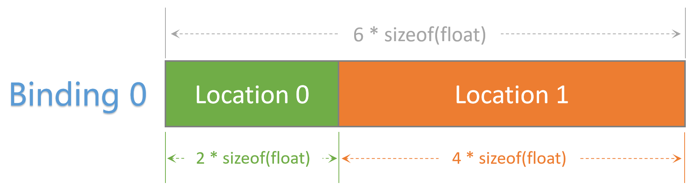
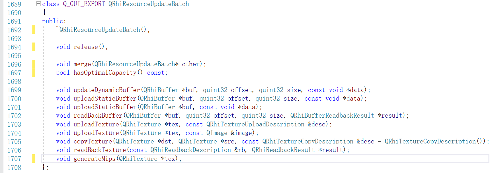
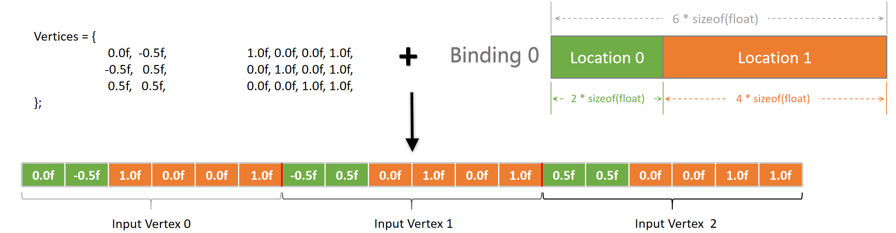
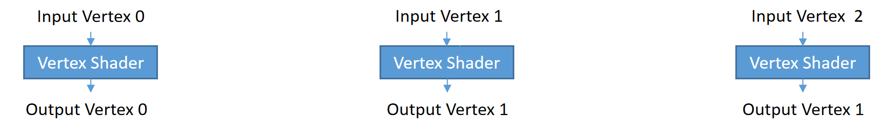
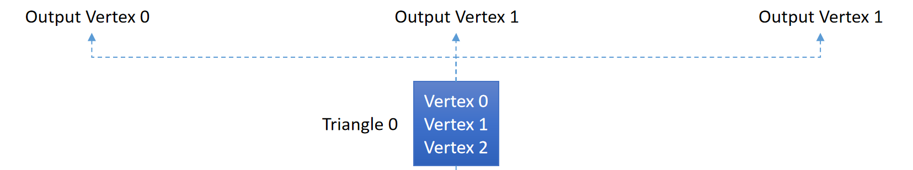
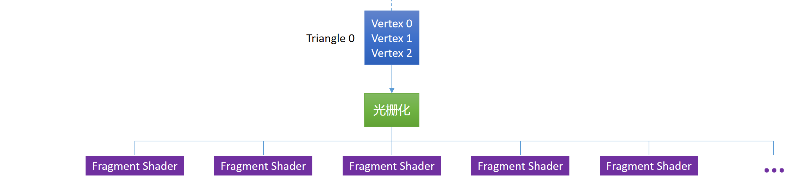
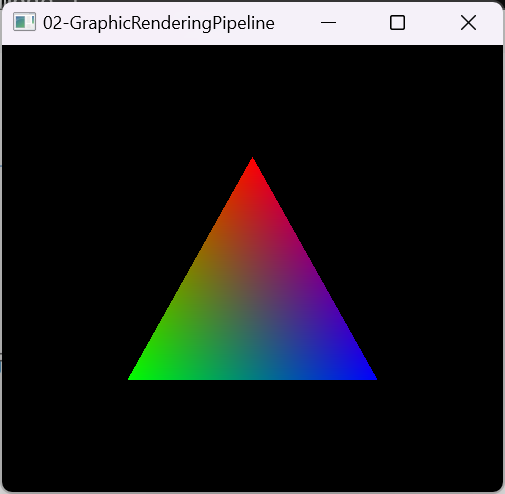

# 그래픽 렌더링 파이프라인

이전 섹션에서 그래픽 렌더링 파이프라인의 개념을 간단히 살펴보았는데, 그 기본 흐름은 다음과 같습니다:


눈으로 보는 것보다 손으로 직접 하는 것이 훨씬 낫습니다. [QEngineUtilities](https://github.com/Italink/QEngineUtilities)를 클론하고 자신의 프로젝트에 연결했는지 확인하세요. 우리의 학습 목표는 그래픽 렌더링이지 UI가 아니므로 QRhiWindow가 더 좋은 시작점입니다. QRhiWindow의 핵심 구조는 다음과 같습니다:

``` c++
class QRhiWindow :public QWindow {
protected:
	virtual void onInit(){}									//렌더링 리소스 초기화 후 호출
	virtual void onRenderTick() {}							//프레임마다 호출
	virtual void onResize(const QSize& inSize) {}			//창 크기가 변경될 때 호출
	virtual void onExit() {}								//창이 닫힐 때 호출
protected:
	QSharedPointer<QRhiEx> mRhi;
	QScopedPointer<QRhiSwapChain> mSwapChain;
	QScopedPointer<QRhiRenderBuffer> mDSBuffer  ;
	QScopedPointer<QRhiRenderPassDescriptor> mSwapChainPassDesc;
};
```

우리는 QRhiWindow를 상속받는 새 클래스를 만들고 위의 몇 가지 가상 함수를 재정의하고 몇 가지 보호된 멤버 변수를 사용하여 자신의 렌더링 로직을 구현할 수 있습니다.

## 렌더링 구조 초기화

렌더링을 시작하기 전에 일반적으로 렌더링에 사용할 몇 가지 구조를 생성해야 하지만, 렌더링 구조의 초기화를 `onInit` 함수에 넣는 대신 `onRenderTick`에 넣고 논리 스위치를 통해 초기화를 제어해야 한다는 점에 유의해야 합니다.

전체 과정은 다음과 같습니다:

``` c++
class MyRhiWindow :public QRhiWindow {
private:
    bool bNeedInit;
public:
    MyRhiWindow()
        :bNeedInit(true)
    {}
protected:				
	virtual void onRenderTick() override {
        if(bNeedInit){
            /*
            * 렌더링 리소스 초기화 로직 실행
            */
          
            bNeedInit = false;    // 초기화 스위치 해제
        }
    }								
};
```

`onRenderTick`은 프레임마다 실행되므로 이렇게 하면 일부 구조를 재구성해야 할 때 스위치만 다시 켜면 되고 `onInit`을 통일적으로 호출할 필요가 없다는 장점이 있습니다.

QEngineUtilities는 이 구조를 약간 단순화하여 사용 방식을 더 **사용자 친화적**으로 만들었습니다. 위의 코드는 다음과 같이 등가로 대체할 수 있습니다:

``` c++
class MyRhiWindow :public QRhiWindow {
private:
    QRhiEx::Signal mSigInit;		//초기화 신호
public:
    MyRhiWindow(){
        mSigInit.request();			//초기화 요청
    }
protected:				
	virtual void onRenderTick() override {
        if(mSigInit.ensure()){		//초기화 로직이 실행될 수 있도록 보장
            /*
            * 렌더링 리소스 초기화 로직 실행
            */
        }
    }								
};
```

### 정점 버퍼 생성

다음과 같은 정점 데이터를 사용한다고 가정해 보겠습니다:

``` c++
static float VertexData[] = {										//정점 데이터
	//position(xy)		color(rgba)
	 0.0f,  -0.5f,		1.0f, 0.0f, 0.0f, 1.0f,
	-0.5f,   0.5f,		0.0f, 1.0f, 0.0f, 1.0f,
	 0.5f,   0.5f,		0.0f, 0.0f, 1.0f, 1.0f,
};
```

> 정점 데이터는 단순히 정점 위치를 의미하는 것이 아니라 기하학적 표현 효과에 영향을 줄 수 있는 모든 데이터를 의미합니다.常見的有：位置，颜色，法向量，UV（纹理坐标）等。

그래픽 렌더링 파이프라인이 이러한 정점 데이터에 액세스할 수 있도록 하기 위해 GPU 측에서 정점 데이터를 저장하는 버퍼(VertexBuffer)를 생성해야 합니다:

``` c++
QScopedPointer<QRhiBuffer> mVertexBuffer;	
```

```c++
mVertexBuffer.reset(mRhi->newBuffer(QRhiBuffer::Immutable, QRhiBuffer::VertexBuffer, sizeof(VertexData)));
mVertexBuffer->create(); //QRhi에서 렌더링 리소스 객체의 create 함수를 호출해야 실제 GPU 리소스가 생성됩니다. 이전까지는 매개변수 상태 기계를 조정하는 것일 뿐입니다.
```

### 정점 입력 레이아웃 생성

파이프라인이 정점 데이터의 구조를 파싱할 수 있도록 하기 위해 정점 입력 레이아웃을 설명하는 구조——**QRhiVertexInputLayout**을 생성해야 합니다:

```c++
QRhiVertexInputLayout inputLayout;
inputLayout.setBindings({
    QRhiVertexInputBinding(6 * sizeof(float))		
});

inputLayout.setAttributes({
    QRhiVertexInputAttribute(0, 0 , QRhiVertexInputAttribute::Float2, 0),
    QRhiVertexInputAttribute(0, 1 , QRhiVertexInputAttribute::Float4,  sizeof(float) * 2 ),
});
```

`setBindings`는 각 VertexBuffer에서 단일 정점 데이터의 스팬을 설명하는 데 사용됩니다.

- VertexBuffer가 하나만 있으므로 **QRhiVertexInputBinding**을 하나만 생성하면 됩니다. 이 VertexBuffer에서 위치를 나타내기 위해 2개의 float를 사용하고 색상을 나타내기 위해 4개의 float를 사용하므로 단일 정점 데이터의 스팬은 `6*sizeof(float)`입니다.

`setAttributes`는 파이프라인 정점 데이터에서 각 속성의 레이아웃을 결정하는 데 사용됩니다.

**QRhiVertexInputAttribute** 생성의 핵심 매개변수는 다음과 같습니다:

- **binding（int）** ：해당 정점 속성이哪个QRhiVertexInputBinding에 위치하는지(즉,哪个VertexBuffer에서 데이터를 읽어올지) 결정하는 데 사용됩니다.
- **location（int）** ：해당 정점 속성이 셰이더에서의 위치를 정의하는 데 사용됩니다. 순서가 뒤죽박죽일 수 있고任意일 수 있지만 inputLayout에서 값이 유일해야 하며 하드웨어 제한을 초과하지 않아야 합니다.
- **format（Format）** ：해당 정점 속성의 데이터 타입을 설명하는 데 사용됩니다.常見的比如Float，Float2，Float3，Float4...
- **offset（quint32）** ：해당 정점 속성이 단일`정점 데이터`에서 메모리의 오프셋을 설명하는 데 사용됩니다.

综上，我们创建了这样的顶点输入的布局描述：



如果在顶点着色器中使用它，它的结构定义必须是：

```glsl
layout(location = 0) in vec2 position;		//这里需要与上面的inputLayout对应，变量名可以是任意的
layout(location = 1) in vec4 color;
```

### 创建流水线

在QRhi中，创建图形渲染管线非常简单，就像这样：

``` c++
QScopedPointer<QRhiGraphicsPipeline> mPipeline;		
```

``` c++
mPipeline.reset(mRhi->newGraphicsPipeline());
```

创建流水线需要我们至少配置：

- 顶点输入布局（Vertex Input Layout）
- 着色器资源绑定（Shader Resource Bindings），也就是上一节所提到的 描述符集布局绑定
- 顶点着色器（Vertex Shader）和片段着色器（Fragment Shader）
- 和 渲染目标（RenderTarget） 一致的 重采样数（SampleCount） 和 渲染通道描述（RenderPassDescriptor）

首先，我们先装配之前创建好的顶点输入布局：

``` 
mPipeline->setVertexInputLayout(inputLayout);
```

由于我们目前还没有Uniform输入，因此可以创建一个空的着色器资源绑定：

```
QScopedPointer<QRhiShaderResourceBindings> mShaderBindings;
```

```c++
mShaderBindings.reset(mRhi->newShaderResourceBindings());
mShaderBindings->create();
mPipeline->setShaderResourceBindings(mShaderBindings.get());	
```

由于图像是直接绘制在交换链的 当前渲染目标 上，所以 重采样数 和 渲染通道描述 可以直接从交换链中 获取：

``` c++
mPipeline->setSampleCount(mSwapChain->sampleCount());
mPipeline->setRenderPassDescriptor(mSwapChainPassDesc.get());
```

GLSL代码的语法跟C语言非常相似，比较明显的区别就是：

- 着色器代码中会定义各种 `in`，`out`，`uniform` 描述的变量
- 着色器代码中只有一些[基础类型](https://registry.khronos.org/OpenGL/specs/gl/GLSLangSpec.4.60.html#variables-and-types)，可以使用Block（类似struct），但需要注意内存布局和对齐。
- 着色器代码中拥有很多 **GPU版本** 的[内置数学函数](https://registry.khronos.org/OpenGL/specs/gl/GLSLangSpec.4.60.html#built-in-functions)
- 各个阶段的着色器有它固定的[代码结构](https://registry.khronos.org/OpenGL/specs/gl/GLSLangSpec.4.60.html#built-in-variables)和[内置变量](https://registry.khronos.org/OpenGL/specs/gl/GLSLangSpec.4.60.html#built-in-variables)

GLSL的基础结构并不复杂，就比如我们接下来要使用的代码，相信读懂它，对你来说很轻松：

```c++
QShader vs = mRhi->newShaderFromCode(QShader::VertexStage, R"(#version 440
    layout(location = 0) in vec2 position;		//这里需要与上面的inputLayout 对应
    layout(location = 1) in vec4 color;

    layout (location = 0) out vec4 vColor;		//输出变量，这里的location是out的，而不是in

    out gl_PerVertex { 							//Vulkan GLSL中固定的定义
        vec4 gl_Position;						
    };

    void main(){
        gl_Position = vec4(position,0.0f,1.0f);	//根据输入的position，设置实际的顶点输出
        vColor = color;							//将输入的color传递给fragment shader
    }
)");
Q_ASSERT(vs.isValid());

QShader fs = mRhi->newShaderFromCode(QShader::FragmentStage, R"(#version 440
    layout (location = 0) in vec4 vColor;		//上一阶段的out变成了这一阶段的in
    layout (location = 0) out vec4 fragColor;	//片段着色器输出，location 为 0 表示输出到 render target 的第一个颜色附件上
    void main(){
        fragColor = vColor;
    }
)");
Q_ASSERT(fs.isValid());

mPipeline->setShaderStages({					//将着色器安装到流水线上
    QRhiShaderStage(QRhiShaderStage::Vertex, vs),
    QRhiShaderStage(QRhiShaderStage::Fragment, fs)
});
```

最后，我们要做的就是，创建流水线：

``` c++
mPipeline->create();
```

## 上传渲染数据

上面创建好了流水线和顶点缓冲区（VertexBuffer），现在我们需要将顶点数据上传到顶点缓冲区中，这里我们使用另一个信号 ：

``` c++
QRhiEx::Signal mSigSubmit;		//用于提交资源的信号
```

在QRhi中， **QRhiResourceUpdateBatch** 可以用来合并 资源 的提交指令，我们可以通过下面的方式来创建它：

``` c++
QRhiResourceUpdateBatch* batch = mRhi->nextResourceUpdateBatch();
```

它提供了以下操作：



由于我们的 VertexBuffer 是 `QRhiBuffer::Immutable` 类型（即静态不可变）的，所以可以这样来上传：

```c++
batch->uploadStaticBuffer(mVertexBuffer.get(), VertexData);		//上传顶点数据
```

之后，我们再将这些资源提交指令录制在 指令缓冲（Command Buffer）中：

```C++
cmdBuffer->resourceUpdate(batch);
```

结合上面的 渲染结构初始化，现在`onRenderTick`的代码看上去应该是：

``` c++
virtual void onRenderTick() override {
    if(mSigInit.ensure()){		
        // doing somethin
    }
    QRhiRenderTarget* renderTarget = mSwapChain->currentFrameRenderTarget();	//交互链中的当前渲染目标
	QRhiCommandBuffer* cmdBuffer = mSwapChain->currentFrameCommandBuffer();		//交互链中的当前指令缓冲
    
    if (mSigSubmit.ensure()) {
		QRhiResourceUpdateBatch* batch = mRhi->nextResourceUpdateBatch();
		batch->uploadStaticBuffer(mVertexBuffer.get(), VertexData);				//上传顶点数据
		cmdBuffer->resourceUpdate(batch);
	}
}	
```

## 录制渲染指令

在QRhi中，想对一个渲染目标（Render Target）进行渲染，需要开启一个渲染通道（Render Pass），并在渲染结束时关闭，就像是这样：

```c++
const QColor clearColor = QColor::fromRgbF(0.0f, 0.0f, 0.0f, 1.0f);			//使用该值来清理 渲染目标 中的 颜色附件
const QRhiDepthStencilClearValue dsClearValue = { 1.0f,0 };					//使用该值来清理 渲染目标 中的 深度和模板附件
cmdBuffer->beginPass(renderTarget, clearColor, dsClearValue, nullptr);		//开启一个渲染通道

/*
* 渲染逻辑
*/

cmdBuffer->endPass();														//关闭渲染通道
```

`beginPass` 和 `endPass` 的定义如下：

``` c++
void beginPass(QRhiRenderTarget *rt,
               const QColor &colorClearValue,
               const QRhiDepthStencilClearValue &depthStencilClearValue,
               QRhiResourceUpdateBatch *resourceUpdates = nullptr,
               BeginPassFlags flags = {});

void endPass(QRhiResourceUpdateBatch *resourceUpdates = nullptr)
```

可以看到`beginPass` 和 `endPass` 中也能使用 **QRhiResourceUpdateBatch** ，它与 `cmdBuffer->resourceUpdate(batch)` 作用一致，这里我们需要注意的是：

- `nextResourceUpdateBatch()` 是从池中获取可操作的 **QRhiResourceUpdateBatch** 实例，而当前可操作实例仅有一个，这意味着：在调用`nextResourceUpdateBatch`之后，再调用一次`nextResourceUpdateBatch` 就会出错。除非我们使用 `QRhiCommandBuffer::resourceUpdate` ， `beginPass` 或者 `endPass`，这些函数会处理  **QRhiResourceUpdateBatch** 实例，并destory它，让池中的下一个 **QRhiResourceUpdateBatch** 实例可以被正常使用。
- 当开启一个渲染通道之后，就无法再上传渲染数据，这也就意味着我们需要在`beginPass` 和 `endPass`之外去提交渲染数据。 

而执行渲染，主要是以下几个固定步骤：

- 设置渲染管线（QRhiGraphicsPipeline）
- 设置视口（QRhiViewport）
- 设置描述符集布局绑定（QRhiShaderResourceBindings）
- 设置顶点输入（QRhiCommandBuffer::VertexInput）
- 调用draw函数

也就对应这样的代码：

```C++
//设置图形渲染管线
cmdBuffer->setGraphicsPipeline(mPipeline.get());	

//设置图像的绘制区域
cmdBuffer->setViewport(QRhiViewport(0, 0, mSwapChain->currentPixelSize().width(), mSwapChain->currentPixelSize().height()));		
//设置描述符集布局绑定，如果不填参数（为nullptr），则会使用渲染管线创建时所使用的描述符集布局绑定
cmdBuffer->setShaderResources();	

//将 mVertexBuffer 绑定到 Binding 0
const QRhiCommandBuffer::VertexInput vertexInput(mVertexBuffer.get(), 0);	
//内存偏移值为0，只有一个VertexInput
cmdBuffer->setVertexInput(0, 1, &vertexInput);		

//执行绘制，其中 3 代表着有 3个顶点数据输入
cmdBuffer->draw(3);															
```

在创建图形渲染管线的时候，我们创建了顶点缓冲区和顶点输入布局，但并没有构建顶点缓冲区和图形渲染管线的连接，直到录制渲染指令的时候，才做了实际的绑定。

在绑定之后，流水线会从对应 Binding Index 的Buffer中，按之前定义好的布局去读取数据，就像是这样：



由于我们draw的参数为3，所以流水线只会读取前三个顶点数据，交由 顶点着色器 进行处理：



在几何装配阶段，会按不同的策略来挑选顶点，组装成一个基础图元（Point，Line，Triangle），流水线默认的策略是 `QRhiGraphicsPipeline::Topology::Triangles`，该策略会依次读取三个顶点数据组装成三角形：



再经由光栅化阶段后，几何图形上的每个片段（像素）都会被片段处理器进行处理：



### 图元拓扑（Primitive Topology）

在上面创建流水线的代码中，我们并没有设置流水线的图元拓扑，如果想要设置，可以调用：

``` c++
mPipeline->setTopology(QRhiGraphicsPipeline::Topology::Triangles);
```

图元拓扑就决定了在几何装配阶段，流水线如何挑选顶点来组装基础图元，在QRhi中，支持以下几种拓扑策略：

```c++
enum Topology {
    Triangles,
    TriangleStrip,
    TriangleFan,
    Lines,
    LineStrip,
    Points,
    Patches   //用于镶嵌控制和评估着色器
};
```

QRhi默认使用的是 `Triangles`，假设现在有六个顶点（下方使用索引描述），不同拓扑对应的组装策略是：

- **Triangles** ：组装得到2个三角形`{0,1,2},{3,4,5}`
- **TriangleStrip** ：组装得到4个三角形`{0,1,2},{2,1,3}{2,3,4},{4,3,5}`，顶点的异常索引顺序，是由于流水线会依据顶点的时钟顺序来判断三角形的正反面，所以在组装TriangleStrip的时候会确保时钟顺序不变。
- **TriangleFan** ：组装得到4个三角形`{0,1,2},{0,2,3},{0,3,4},{0,4,5}`
- **Lines** ：组装得到3条线`{0,1},{2,3},{4,5}`
- **LineStrip** ：组装得到5条线`{0,1},{1,2},{2,3},{3,4},{4,5}`
- **Points** ：组装得到6个点`{0},{1},{2},{3},{4},{5}`

这里有一个Vulkan中的图示：


## 大功告成

执行程序，如果可以看到下方图像，说明我们成功了！！！



可以此处找到完整的代码：

- https://github.com/Italink/ModernGraphicsEngineGuide/blob/main/Source/1-GraphicsAPI/02-GraphicRenderingPipeline/Source/main.cpp

这里有一个很好的视频讲解了图形渲染管线基础：

- [上帝视角看GPU（1）：图形流水线基础](https://www.bilibili.com/video/BV1P44y1V7bu)

此外，你还可以尝试一下：

- 修改 图元 拓扑，绘制点，线。
- 绘制矩形，圆形或者其他多边形图像。
- 增加一些其他的顶点属性