# 3D 공간

## 3D 변환

현대 컴퓨터 그래픽 디스플레이는 모두 2D 이미지를 표시하지만, 실제로 인간의 망막 표면에 투영되는 이미지도 2D입니다. 그렇다면 인간은 왜 2D 이미지에서 거리감과 공간감을 느낄 수 있을까요?

이는 우리의 뇌가 이미지의 일부 세부 사항을 포착하여 3D 공간 정보를 재구성할 수 있기 때문입니다. 예를 들어 다음과 같습니다:

- 가까운 물체는 크고 먼 물체는 작은 공간 원근감

  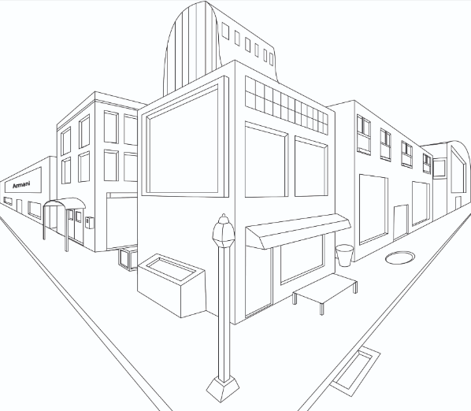

- 빛과 그림자가 만드는 입체감

  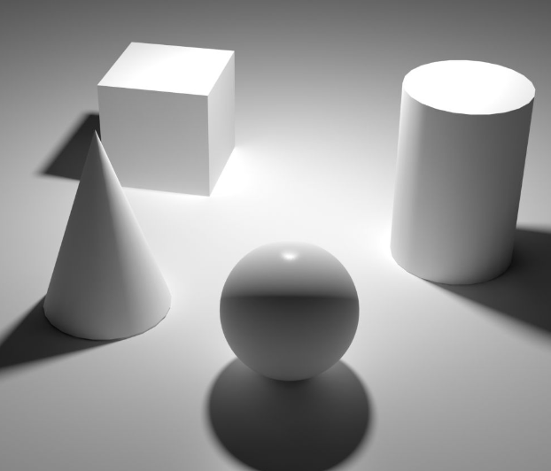

단일 프레임 이미지가 담고 있는 정보 외에도, 인간의 눈은 이미지의 움직임 상태에 따라 공간 정보를 복원합니다. 예를 들어 운동 시차가 그렇습니다:


물론 다른 요인들도 있지만, 여기서는 자세히 다루지 않겠습니다. 관심 있는 분들은 다음을 참고하세요:

- Wiki Depth Perception：https://en.wikipedia.org/wiki/Depth_perception

컴퓨터의 이미지 형성 과정은 다음과 같습니다:


간단히 말해 3D 공간의 물체를 `Near Plane（근접 평면）`에 평평하게 붙이는 것이라고 볼 수 있습니다.

이론적으로 3D 공간의 물체는 컴퓨터에서 단순히 일련의 데이터일 뿐이며, 근접 평면에 붙은 이미지도 또 다른 일련의 데이터입니다. 우리가 해야 할 일은 단순히 일련의 데이터를 다른 일련의 데이터로 변환하는 것입니다.

중고등학교에서 배운 지식을回顾하며 다음 시나리오를 생각해 보세요:

- 삼각형을 수평으로 5단위平移하려면 어떻게 할까요?
  - 매우 간단합니다. 삼각형의 모든 정점 좌표의 X값에 `5를 더하면` 됩니다.

- 삼각형을 좌표 원점을 중심으로 180도 회전하려면 어떻게 처리해야 할까요?
  - 삼각형 좌표를 직각(데카르트) 좌표계에서 극좌표계로 변환한 후, 각도에 `180도를 더하고` 다시 직각 좌표계로 변환하면 변환 후의 정점을 얻을 수 있습니다.
- 삼각형을 원래 크기의 2배로 확대하려면 어떻게 해야 할까요?
  - 모든 정점의 좌표값에 `2를 곱하면` 됩니다.

위의 몇 가지 경우는 그래픽 데이터의 대부분 처리 방식을 포함하며, 처리 흐름이 고정된 템플릿임을 발견할 수 있을 것입니다. 컴퓨터에서 고정된 템플릿의 실행 흐름은 하드웨어 수준에서 대량의 최적화를 할 수 있음을 의미합니다.

그래서 더 간단히 할 수 있는 방법은 없을까요? 모든 가능한 작업을 실행할 수 있는 하나의 템플릿을 사용하면 컴퓨터가 이 템플릿에 대해 극한의 최적화를 할 수 있습니다.

답은 물론 있습니다. 이 템플릿은 [선형 대수](https://baike.baidu.com/item/%E7%BA%BF%E6%80%A7%E4%BB%A3%E6%95%B0) 체계를 기반으로 구축됩니다.

3차원 좌표 `(X,Y,Z)`를 `(Tx,Ty,Tz)`단위平移하려면, 해당 좌표에 [Homogeneous_Coordinates（동차 좌표）](https://en.wikipedia.org/wiki/Homogeneous_coordinates)를 추가한 후 **Translation Matrix（平移 행렬）**을 곱합니다:

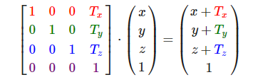

다른 좌표 성분에서 `(S1,S2,S3)`크기로缩放하려면 **Scale Matrix（缩放 행렬）**을 곱합니다:

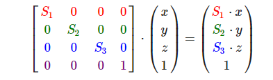

X축을 중심으로 θ각도 회전하려면 **Rotate Matrix（회전 행렬）**을 곱합니다:

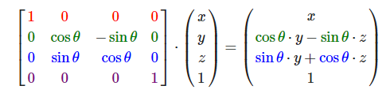

Y축인 경우:

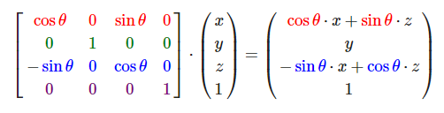

Z축인 경우:

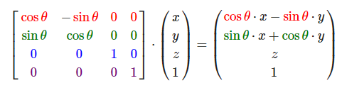

C++에서 대부분의 수학 라이브러리는 벡터와 행렬에 대한 다양한 편의 함수를 제공합니다. Qt에서는 다음과 같은 데이터 구조를 제공합니다:

- [QVector2D](https://doc.qt.io/qt-6/qvector2d.html)
- [QVector3D](https://doc.qt.io/qt-6/qvector3d.html)
- [QVector4D](https://doc.qt.io/qt-6/qvector4d.html)
- [QMatrix4x4](https://doc.qt.io/qt-6/qmatrix4x4.html)

예를 들어 다음과 같은 코드가 있습니다:

``` c++
QVector4D pos(1, 1, 1, 1);

QMatrix4x4 model;
model.translate(QVector3D(1,0,0));
model.scale(0.5);
model.rotate(180, QVector3D(1, 0, 0));

QVector4D result = model * pos;
```

이 코드의 의미는 다음과 같습니다:

- `model 행렬`을 사용하여 `pos 벡터`를 먼저 X축을 중심으로 180도 회전시킨 후, 원래 크기의 0.5배로缩放하고, 마지막으로 X축 방향으로 1단위平移합니다.

Qt의 벡터는 **열 저장**을 사용하기 때문에 변환을 처리하기 위해 **좌측 곱셈** 방식을 사용해야 하므로, 전체 과정이 뒤집혀 보일 수 있습니다.

행렬 곱셈 구문을 기억하시나요? — **앞 행 곱 뒤 열**

이 특성에 따라 실제로 원하는 것은 `벡터`에 `행렬`을 곱하여 변환 후의 `벡터`를 얻는 것입니다.

다음 그림은 **열 저장된 벡터가 좌측 곱셈을 사용해야 하는 이유**를 곱셈 계산 결과의 타입에서 설명합니다:

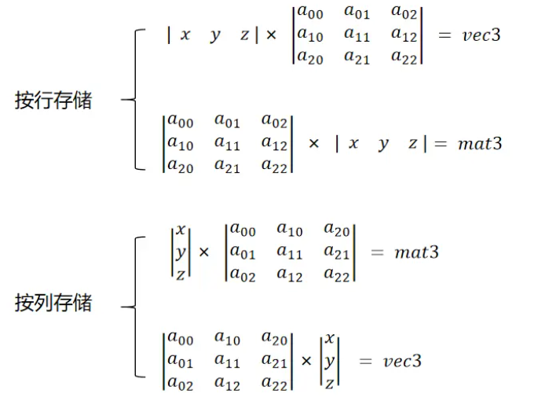

3D 공간의 변환은 행렬을 통해 이루어지지만, 모든 변환을 하나의 행렬에 섞어 넣으면 변환의二次 처리加工이 매우 어려워집니다.

따라서 현대 그래픽스에서 3D 공간의 변환은 몇 가지 단계로 나누며, 각 단계는 다른 처리 책임을 가지고 있습니다:

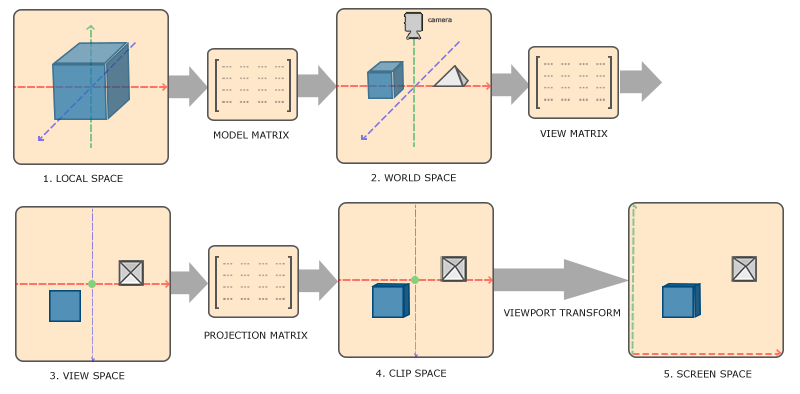

- 그래픽이 원래 위치한 공간을 **Local Space（로컬 공간）**이라고 합니다. **Model Matrix（모델 행렬）**을 통해 그 좌표를 **World Space（월드 공간）**으로 변환할 수 있으며, **모델 행렬의 책임은 물체의平移, 회전,缩放을 처리하는 것**입니다.
- **View Matrix（뷰 행렬）**을 통해 **World Coordinate（월드 좌표）**를 **View Space（뷰 공간）**의 좌표로 변환할 수 있으며, **뷰 행렬의 책임은 시점의 위치와 시야의 방향을确立하는 것**입니다.
- 다시 **Projection Matrix（투영 행렬）**을 통해 **View Coordinate（뷰 좌표）**를 **Clip Space（클립 공간）**의 좌표로 변환할 수 있으며, **투영 행렬의 책임은 뷰 공간의 영역을 표준 장치 좌표계（NDC）에 투영하는 것**입니다.
- **Clip Coordinate（클립 좌표）**는 **Viewport Transform（뷰포트 변환）**을 거쳐 최종적으로 **Screen Space（스크린 공간）**으로 변환됩니다.

Qt에서는 CPU 측에서 다음과 같은 코드를 사용하여 이러한 변환을 처리할 수 있습니다:

``` c++
QMatrix4x4 corrMatrix = mRhi->clipSpaceCorrMatrix();  //클립 공간 보정 행렬

QMatrix4x4 project ;
// Fov를 90도로 설정하고, FrameBuffer의 너비 높이 비율을 전달하며, 근접 평면 거리를 0.01로, 원거리 평면 거리를 1000으로 설정
project.perspective(90.0, renderTarget->pixelSize().width() /(float) renderTarget->pixelSize().height(), 0.01, 1000);		

QMatrix4x4 view;
// 위치(10,0,0)에서 (0,0,0)을 바라보며, 시선의 상방 벡터는 수직 상방（Y축 양방향）입니다.
view.lookAt(QVector3D(10, 0, 0), QVector3D(0, 0, 0), QVector3D(0, 1, 0));

QMatrix4x4 model;
model.translate(QVector3D(1, 0, 0));
model.scale(0.5);
model.rotate(180, QVector3D(1, 0, 0));

UniformBlock ubo;
ubo.MVP = (corrMatrix * project * view * model).toGenericMatrix<4, 4>();
batch->updateDynamicBuffer(mUniformBuffer.get(), 0, sizeof(UniformBlock), &ubo);
```

Shader에서는 다음과 같이 사용합니다:

```c++
QShader vs = mRhi->newShaderFromCode(QShader::VertexStage, R"(#version 440
    layout(location = 0) in vec3 inPosition;
    layout(binding = 0) uniform UniformBlock{
        mat4 MVP;
    }UBO;
    out gl_PerVertex { vec4 gl_Position; };
    void main()
    {
        gl_Position = UBO.MVP * vec4(inPosition ,1.0f);
    }
)");
```

### Normalized Device Coordinates（표준 장치 좌표계, NDC）

이전 장에서 다음과 같은 정점 데이터를 사용했습니다:

``` c++
static float VertexData[] = {                                       //정점 데이터
    //position(xy)      color(rgba)
     0.0f,  -0.5f,      1.0f, 0.0f, 0.0f, 1.0f,
    -0.5f,   0.5f,      0.0f, 1.0f, 0.0f, 1.0f,
     0.5f,   0.5f,      0.0f, 0.0f, 1.0f, 1.0f,
};
```

그리고 정점 셰이더:

```cpp
QShader vs = mRhi->newShaderFromCode(QShader::VertexStage, R"(#version 440
    layout(location = 0) in vec2 position;		//여기서는 위의 inputLayout과 일치해야 합니다
    layout(location = 1) in vec4 color;

    layout (location = 0) out vec4 vColor;		//출력 변수, 여기의 location은 out입니다, in이 아닙니다

    out gl_PerVertex { 							//Vulkan GLSL에서 고정된 정의
        vec4 gl_Position;						
    };

    void main(){
        gl_Position = vec4(position,0.0f,1.0f);	//입력된 position에 따라 실제 정점 출력을 설정합니다
        vColor = color;							//입력된 color를 fragment shader에 전달합니다
    }
)");
```

이를 통해 삼각형을 그렸습니다:


정점 위치의 `0.0f`, `-0.5f`, `0.5f`가 의미하는 바를 이미 추측했을 수 있습니다.仿佛这些 정점 좌표의取值范围是[-1,1]？这是因为图形API为了让坐标运算不受显示器分辨率的影响，都使用了 **Normalized Device Coordinates（표준 장치 좌표계, NDC）**의概念。

OpenGL을 예로 들면, 오른손 좌표계를 따릅니다:

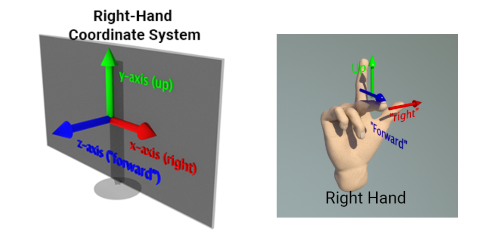

任一轴向的取值范围为[-1,1]，就像这样：

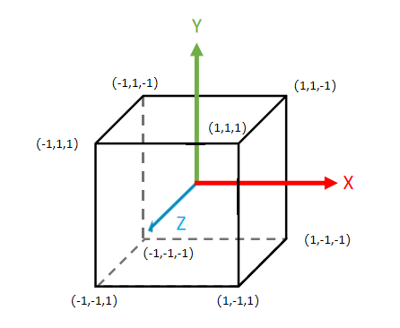

范围外에落在하는 **정점**은 일부 전략에 따라 기본 요소가 클리핑되어 화면에 표시되지 않습니다:


이 과정에 대한 자세한 내용은 다음을 참고하세요:

- https://registry.khronos.org/vulkan/specs/1.3/html/chap24.html

Vulkan도 오른손 좌표계를 사용하지만, Vulkan은 차세대 OpenGL로 선언되면서 OpenGL과 동일하다면 Vulkan이라고 불릴 수 없기 때문에 몇 가지 독특한 점을 가지고 있습니다. 따라서 **Vulkan의 Y축은 아래를 향하며, Z축（깊이）의取值范围은[0,1]로 변경**되었습니다. 다음과 같습니다:

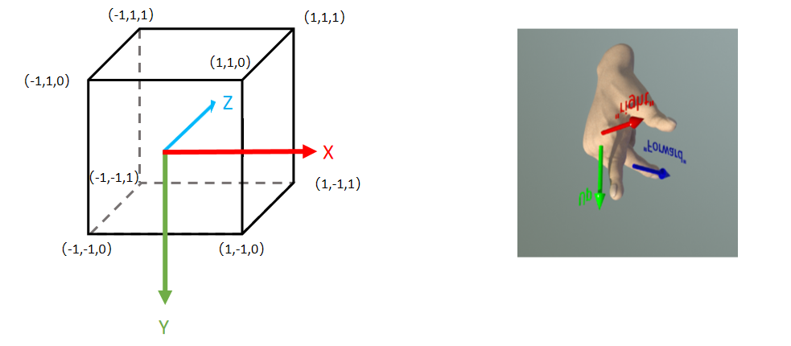

DirectX와 Metal은 이와 다릅니다. **DirectX와 Metal의 NDC는 왼손 좌표계를 사용하며, 깊이 값范围은[0,1]**입니다:

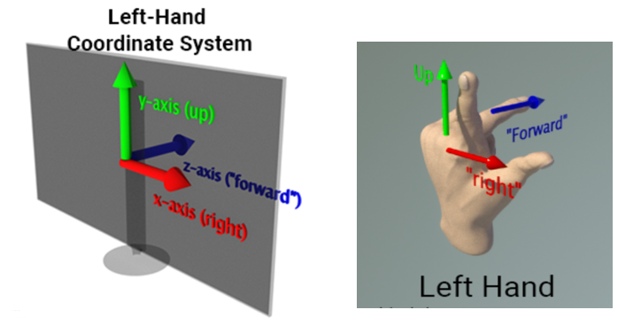

이들의 차이와 세부 사항에 대한 내용은 다음을 참고하세요:

- https://www.scratchapixel.com/lessons/mathematics-physics-for-computer-graphics/geometry/coordinate-systems.html

#### NDC差异解决方案

이러한 图形API 표준 좌표계의差异는无疑给RHI的封装增加了一些难题，各个引擎对此都有自己的解决方案。

QRhi에서 사용할 때는 정점 데이터를统一遵循OpenGL의 NDC（即右手坐标系，任一轴向的取值范围为[0,1]）即可。

`QRhi::clipSpaceCorrMatrix()`를 통해当前图形API的矫正矩阵를获取할 수 있으며, 이를 사용하여所有顶点를处理하면对应API的NDC空间으로转换할 수 있습니다.

该功能依赖于QRhi中的以下实现：

``` c++
QMatrix4x4 QRhiGles2::clipSpaceCorrMatrix() const
{
    return QMatrix4x4(); // identity
}

QMatrix4x4 QRhiVulkan::clipSpaceCorrMatrix() const
{
    // See https://matthewwellings.com/blog/the-new-vulkan-coordinate-system/

    static QMatrix4x4 m;
    if (m.isIdentity()) {
        // NB the ctor takes row-major
        m = QMatrix4x4(1.0f, 0.0f, 0.0f, 0.0f,
                       0.0f, -1.0f, 0.0f, 0.0f,
                       0.0f, 0.0f, 0.5f, 0.5f,
                       0.0f, 0.0f, 0.0f, 1.0f);
    }
    return m;
}

QMatrix4x4 QRhiD3D11::clipSpaceCorrMatrix() const
{
    // Like with Vulkan, but Y is already good.

    static QMatrix4x4 m;
    if (m.isIdentity()) {
        // NB the ctor takes row-major
        m = QMatrix4x4(1.0f, 0.0f, 0.0f, 0.0f,
                       0.0f, 1.0f, 0.0f, 0.0f,
                       0.0f, 0.0f, 0.5f, 0.5f,
                       0.0f, 0.0f, 0.0f, 1.0f);
    }
    return m;
}

QMatrix4x4 QRhiD3D12::clipSpaceCorrMatrix() const
{
    // Like with Vulkan, but Y is already good.

    static QMatrix4x4 m;
    if (m.isIdentity()) {
        // NB the ctor takes row-major
        m = QMatrix4x4(1.0f, 0.0f, 0.0f, 0.0f,
                       0.0f, 1.0f, 0.0f, 0.0f,
                       0.0f, 0.0f, 0.5f, 0.5f,
                       0.0f, 0.0f, 0.0f, 1.0f);
    }
    return m;
}

QMatrix4x4 QRhiMetal::clipSpaceCorrMatrix() const
{
    // depth range 0..1
    static QMatrix4x4 m;
    if (m.isIdentity()) {
        // NB the ctor takes row-major
        m = QMatrix4x4(1.0f, 0.0f, 0.0f, 0.0f,
                       0.0f, 1.0f, 0.0f, 0.0f,
                       0.0f, 0.0f, 0.5f, 0.5f,
                       0.0f, 0.0f, 0.0f, 1.0f);
    }
    return m;
}
```

对于一些二维的顶点，我们可以简单的翻转一下坐标的Y值，这也是上一节中纹理 [无属性渲染](https://link.zhihu.com/?target=https%3A//stackoverflow.com/questions/2588875/whats-the-best-way-to-draw-a-fullscreen-quad-in-opengl-3-2) ，为什么要用`Y_UP_IN_NDC`对顶点翻转的来由：

```c++
QShader vs = mRhi->newShaderFromCode(QShader::VertexStage, R"(#version 450
    layout (location = 0) out vec2 vUV;
    out gl_PerVertex{
        vec4 gl_Position;
    };
    void main() {
        vUV = vec2((gl_VertexIndex << 1) & 2, gl_VertexIndex & 2);      /
        gl_Position = vec4(vUV * 2.0f - 1.0f, 0.0f, 1.0f);
#if Y_UP_IN_NDC              //因为DX，GL与VK的NDC不一致，因此这里需要做一些兼容处理
	gl_Position.y = - gl_Position.y;
#endif 
    })"
    , QShaderDefinitions()   //该参数只是简单的在代码开头添加 #define Y_UP_IN_NDC 1        
    .addDefinition("Y_UP_IN_NDC", mRhi->isYUpInNDC())
);
```

### Frame Buffer 坐标 差异

此外，我们还需要注意图形API之间不仅仅有NDC的差异，FrameBuffer的坐标空间也有不同，由于[历史原因](https://gamedev.stackexchange.com/questions/83570/why-is-the-origin-in-computer-graphics-coordinates-at-the-top-left)，早期的计算机阴极射线管（CRT）从左上角到右上角绘制图像，所以在大多数传统图形API，通常 **以左上角为帧图像的坐标原点** ，OpenGL成立之初想要改变这一点，让坐标系的使用更符合人类的通识（即二维平面上，使用左下角作为坐标原点，Y轴朝上，X轴朝右），但可惜的是，已经有太多的框架已经适应并普遍遵循原先的规定，这反倒导致了我们在 **使用 OpenGL 的时候还需要对纹理进行上下翻转（Flip Y）** ，在现代图形API （DirectX、Metal、Vulkan）， 都已经向历史妥协，所以大家在使用时注意遵循 ”传统“：

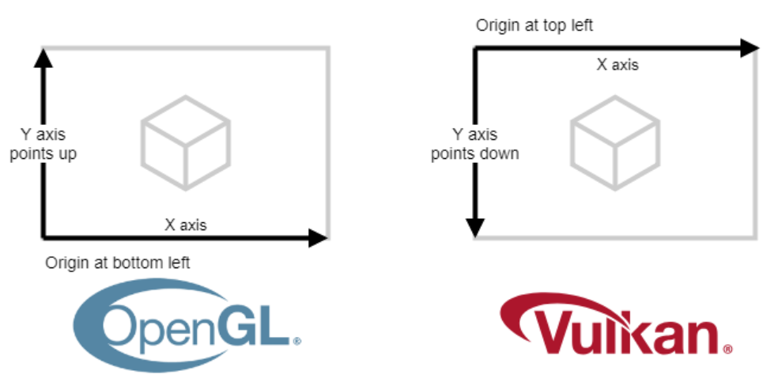

### 示例

根据上面的一些描述，我们可以制作一些简单的小程序，比如一个随时间变换的立方体：

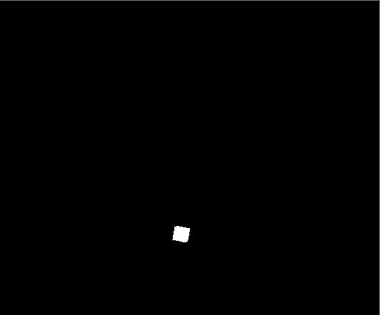

示例代码位于 [05-3D](https://github.com/Italink/ModernGraphicsEngineGuide/blob/main/Source/1-GraphicsAPI/05-3D/Source/main.cpp)

核心代码只是：

``` c++
QShader vs = mRhi->newShaderFromCode(QShader::VertexStage, R"(#version 440
    layout(location = 0) in vec3 inPosition;
    layout(binding = 0) uniform UniformBlock{
        mat4 MVP;
    }UBO;
    out gl_PerVertex { vec4 gl_Position; };
    void main()
    {
        gl_Position = UBO.MVP * vec4(inPosition ,1.0f);
    }
)");
Q_ASSERT(vs.isValid());
```

``` c++
QMatrix4x4 corrMatrix = mRhi->clipSpaceCorrMatrix();  //裁剪空间矫正矩阵

QMatrix4x4 project;
project.perspective(90.0, renderTarget->pixelSize().width() / (float)renderTarget->pixelSize().height(), 0.01, 1000);	// 设置Fov为90度，传入FrameBuffer的宽高比，设置近平面距离为0.01，远平面距离为1000

QMatrix4x4 view;
view.lookAt(QVector3D(10, 0, 0), QVector3D(0, 0, 0), QVector3D(0, 1, 0));		// 从位置(10,0,0) 看向 (0,0,0)，视线的上向量为竖直向上（Y轴正方向）

float time = QTime::currentTime().msecsSinceStartOfDay() / 1000.0f;			//获取当前时间的秒数（浮点类型）
float factor = qAbs(qSin(time));						//利用正弦函数让Y值随时间在[0,1]之间变化
QMatrix4x4 model;
model.translate(QVector3D(0, factor * 5, 0));			//随时间上下移动
model.scale(factor);									//随时间缩放
model.rotate(time * 180, QVector3D(1, 1, 1));			//随时间旋转

UniformBlock ubo;
ubo.MVP = (project * view * model).toGenericMatrix<4, 4>();
batch->updateDynamicBuffer(mUniformBuffer.get(), 0, sizeof(UniformBlock), &ubo);
```


### 建议与技巧

上述文章并不完备，这里还有一些相关参考：

- https://learnopengl-cn.github.io/01%20Getting%20started/08%20Coordinate%20Systems/

3D空间变换涉及到大量的线性代数运算，里面的一些概念和细节，很难用一篇文章去涵盖，这里笔者再次推荐读者一定要去阅读一下《3D数学基础 图形和游戏开发 （第2版）》的前十章内容，它里面涵盖了图形学所必须的极大部分基础知识，认真过一遍，保证你的知识体系里面没有盲区~

对于一个没有经历过透视变换的矩阵，它的平移，旋转，缩放参数是可提取的，在ImGuiZmo中有以下代码：

```c++
void DecomposeMatrixToComponents(const float* matrix, float* translation, float* rotation, float* scale)
{
  matrix_t mat = *(matrix_t*)matrix;

  scale[0] = mat.v.right.Length();
  scale[1] = mat.v.up.Length();
  scale[2] = mat.v.dir.Length();

  mat.OrthoNormalize();

  rotation[0] = RAD2DEG * atan2f(mat.m[1][2], mat.m[2][2]);
  rotation[1] = RAD2DEG * atan2f(-mat.m[0][2], sqrtf(mat.m[1][2] * mat.m[1][2] + mat.m[2][2] * mat.m[2][2]));
  rotation[2] = RAD2DEG * atan2f(mat.m[0][1], mat.m[0][0]);

  translation[0] = mat.v.position.x;
  translation[1] = mat.v.position.y;
  translation[2] = mat.v.position.z;
}
```

当我们想要实现一个始终面向相机公告牌效果时，可以将View矩阵中的Rotate信息给去掉，如果不希望随相机的距离缩放，可以把Scale信息也给去掉，或者说直接这样（伪代码）：
```glsl
mat4 Model,View,Projection;
vec3 position;

mat3 CorrMatrix = inverse(View);		//丢弃平移参数，求它的逆矩阵来矫正旋转和缩放
vec3 facingCameraPos = Projection * View * Model * (CorrMatrix * position, 1.0f);
```

## Camera

相信接触过3D场景的小伙伴大多知道 **摄像机（Camera）** 的概念，在很多3D游戏中都提供这样的操作：

- 使用 WASD 移动相机的位置，使用鼠标来控制视角的旋转

而 Camera 的本质其实是在提供上文所提到的 **视图矩阵（View Matrix）** 和 **投影矩阵（Projection Matrix）**

我们可以窗口系统的输入事件，来调整这些矩阵。

这里有笔者封装好的一个Camera类：

- https://github.com/Italink/QEngineUtilities/blob/main/Core/Src/Utils/QCamera.cpp

``` c++
class QCamera :public QObject {
	Q_OBJECT
    Q_PROPERTY(QVector3D Position READ getPosition WRITE setPosition)
    Q_PROPERTY(QVector3D Rotation READ getRotation WRITE setRotation)
    Q_PROPERTY(float FOV READ getFov WRITE setFov)
    Q_PROPERTY(float NearPlane READ getNearPlane WRITE setNearPlane)
    Q_PROPERTY(float FarPlane READ getFarPlane WRITE setFarPlane)
    Q_PROPERTY(float MoveSpeed READ getMoveSpeed WRITE setMoveSpeed)
    Q_PROPERTY(float RotationSpeed READ getRotationSpeed WRITE setRotationSpeed)
public:
	QCamera();

	void setupWindow(QWindow* window);

	float getYaw();
	float getPitch();
	float getRoll();

	void setYaw(float inVar);
	void setPitch(float inVar);
	void setRoll(float inVar);

	QVector3D getPosition();
	void setPosition(const QVector3D& newPosition);

	void setRotation(const QVector3D& newRotation);
	QVector3D getRotation();

	float getRotationSpeed() const { return mRotationSpeed; }
	void setRotationSpeed(float val) { mRotationSpeed = val; }

	float getMoveSpeed() const{ return mMoveSpeed; }
	void setMoveSpeed(float val) { mMoveSpeed = val; }
	float& getMoveSpeedRef() { return mMoveSpeed; }

	void setFov(float val);
	float getFov() { return mFov; }

	void setAspectRatio(float val);
	float getAspectRatio() { return mAspectRatio; }

	void setNearPlane(float val);
	float getNearPlane() { return mNearPlane; }

	void setFarPlane(float val);
	float getFarPlane() { return mFarPlane; }

	QMatrix4x4 getProjectionMatrixWithCorr(QRhiEx* inRhi);
	QMatrix4x4 getProjectionMatrix();
	QMatrix4x4 getViewMatrix();
};
```

要想使用它，只需使用创建一个QCamera，并调用`void QCamera::setupWindow(QWindow* window)` 就能将窗口的输入事件跟Camera进行绑定，之后我们可以通过以下函数来获取模型矩阵和投影矩阵：

```c++
QMatrix4x4 getProjectionMatrixWithCorr(QRhiEx* inRhi);  //获取带裁剪空间矫正的透视矩阵
QMatrix4x4 getProjectionMatrix();
QMatrix4x4 getViewMatrix();
```

如果你想封装自己的Camera类，这里有一个很好的文章：

- https://learnopengl-cn.github.io/01%20Getting%20started/09%20Camera/

### Mipmap

在上一节中 [缓冲区与纹理](https://zhuanlan.zhihu.com/p/630886324) 中，通过 **minFilter** 可以确定在图像被缩小显示时，使用何种策略来根据纹理坐标的 **邻近像素** 确定当前的像素值，使用线性（Linear）采样会根据像素周边四个的邻近像素来确定颜色，可是当图像的缩放比例非常大的时候，比如将一张图像的寸尺从`1000*1000`，缩放到`10*10`，使用Linear采样的时候，只会根据四个邻近像素点来确定颜色，明显会导致采样不足，出现 [摩尔纹](https://baike.baidu.com/item/%E6%91%A9%E5%B0%94%E7%BA%B9) 现象，就像这样：


为了解决这个问题，现代图形API引入了另一个概念 — **多级渐远纹理（Mipmap）**

开启Mipmap会比原纹理多约三分之一的空间大小，，它的原理可以看作是将图像每次缩放到原先图像一半的新图像作为一个 **Mip Level** ，就像是这样：


图形渲染管线在执行时，会根据uv和texture尺寸，选用合适的 Mip Level 进行采样

在QRhi中，我们只需要在创建纹理使用`QRhiTexture::Flag::MipMapped | QRhiTexture::UsedWithGenerateMips`：

```c++
mTexture.reset(mRhi->newTexture(QRhiTexture::RGBA8,
                                mImage.size(), 
                                1 , 
                                QRhiTexture::Flag::MipMapped | QRhiTexture::UsedWithGenerateMips ));
mTexture->create();
```

并在采样器创建时，指定 Mip Level 之间的过滤模式：

``` c++
mSampler.reset(mRhi->newSampler(
    QRhiSampler::Filter::Linear,
    QRhiSampler::Filter::Nearest,
    QRhiSampler::Filter::Linear,			//使用线性过滤
    QRhiSampler::AddressMode::Repeat,	
    QRhiSampler::AddressMode::Repeat,
    QRhiSampler::AddressMode::Repeat
));
mSampler->create();
```

最后在录制 图像资源的上传指令 后，使用`QRhiResourceUpdateBatch::generateMips(QRhiTexture *tex)`录制mips的生成指令：

``` c++
batch->uploadTexture(mTexture.get(), mImage);
batch->generateMips(mTexture.get());
```

再执行程序一看，可以看到摩尔纹已经消失了：

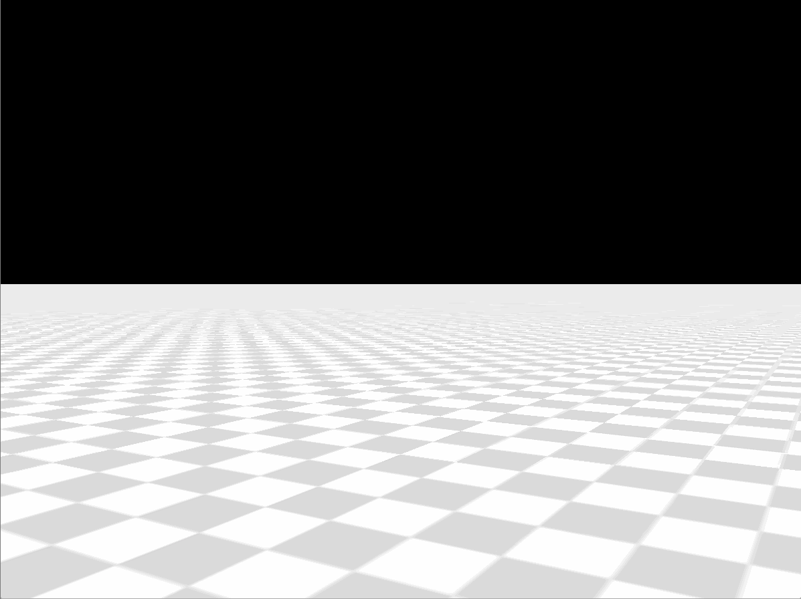

示例代码位于该教程的 ：

- [06-3DWithCamera](https://github.com/Italink/ModernGraphicsEngineGuide/blob/main/Source/1-GraphicsAPI/06-3DWithCamera/Source/main.cpp)

关于 Mipmap，这里有一篇很好的文章：

- [Clawko - 图形学底层探秘 - 纹理采样、环绕、过滤与Mipmap的那些事](https://zhuanlan.zhihu.com/p/143377682)