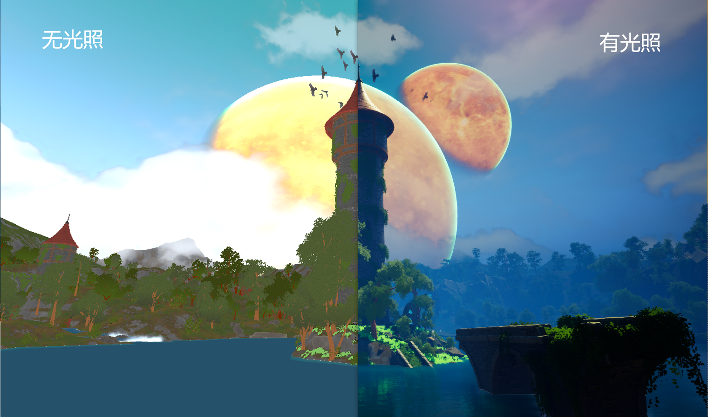
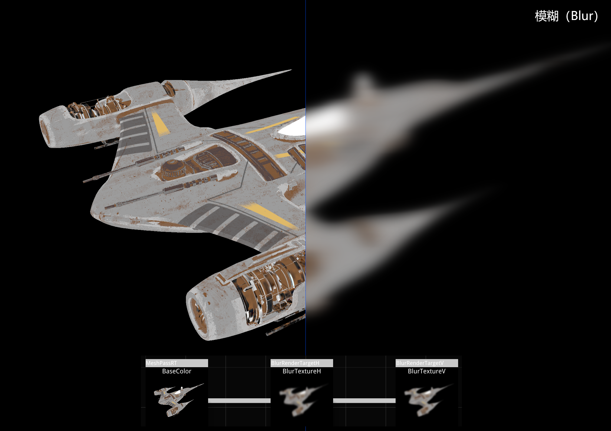
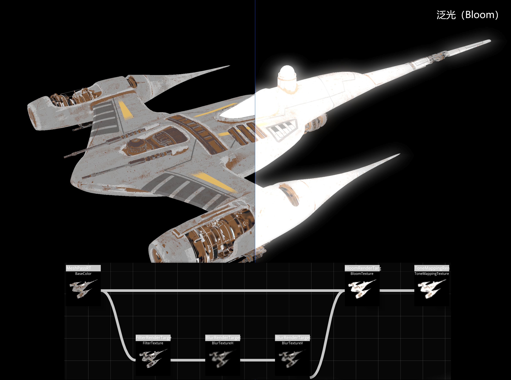
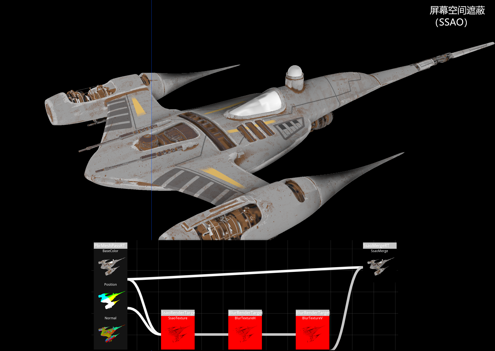
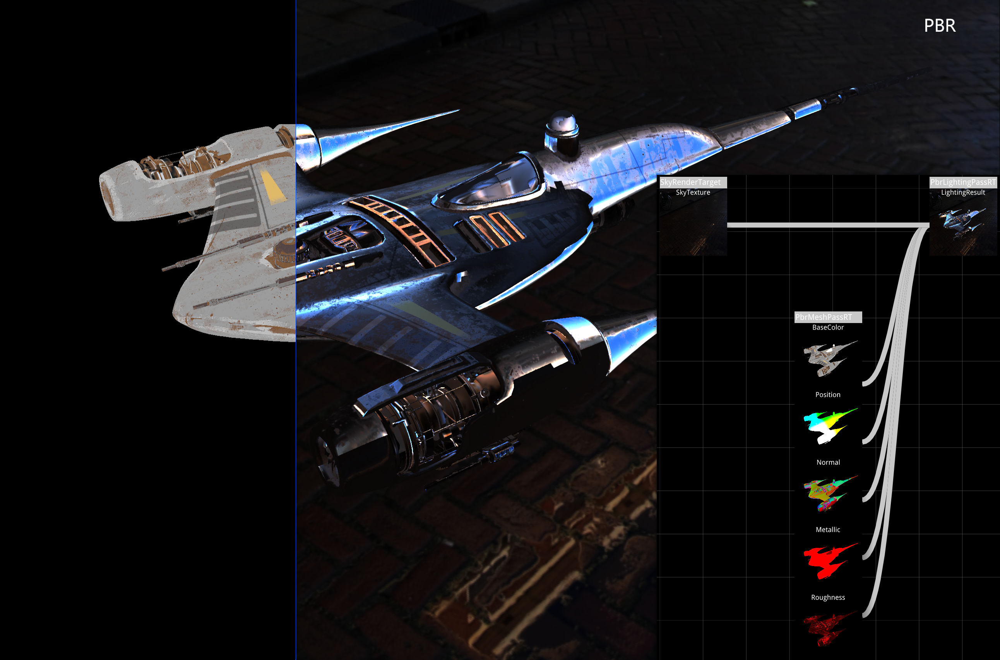
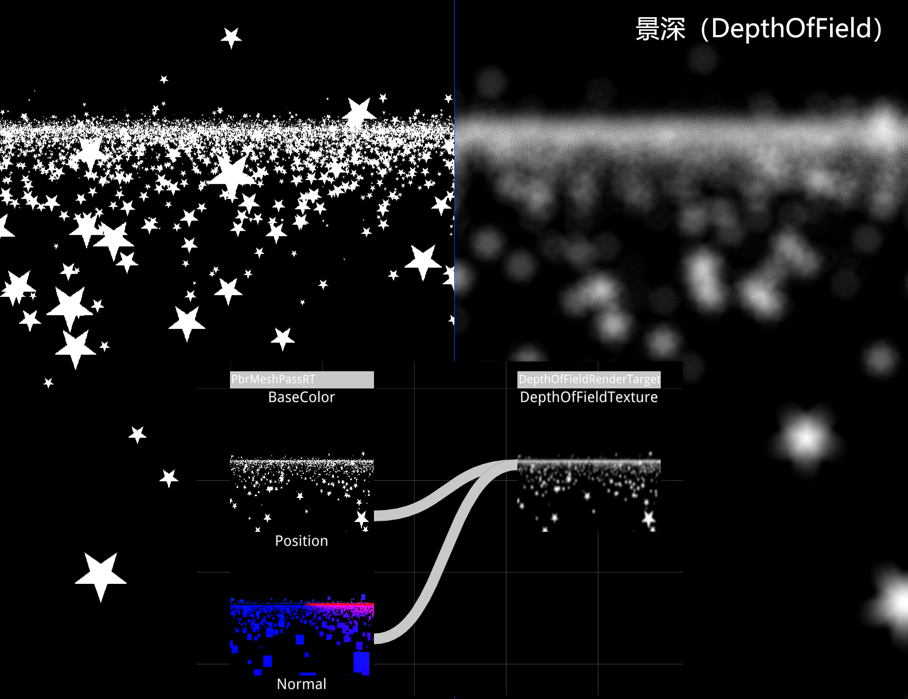
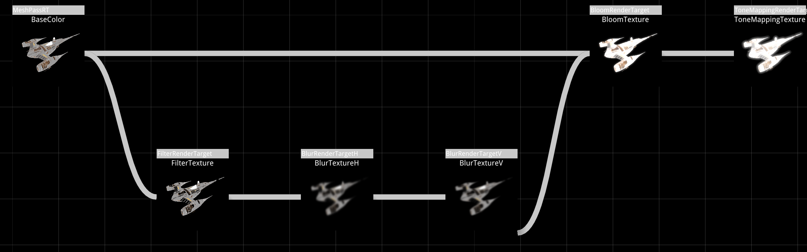
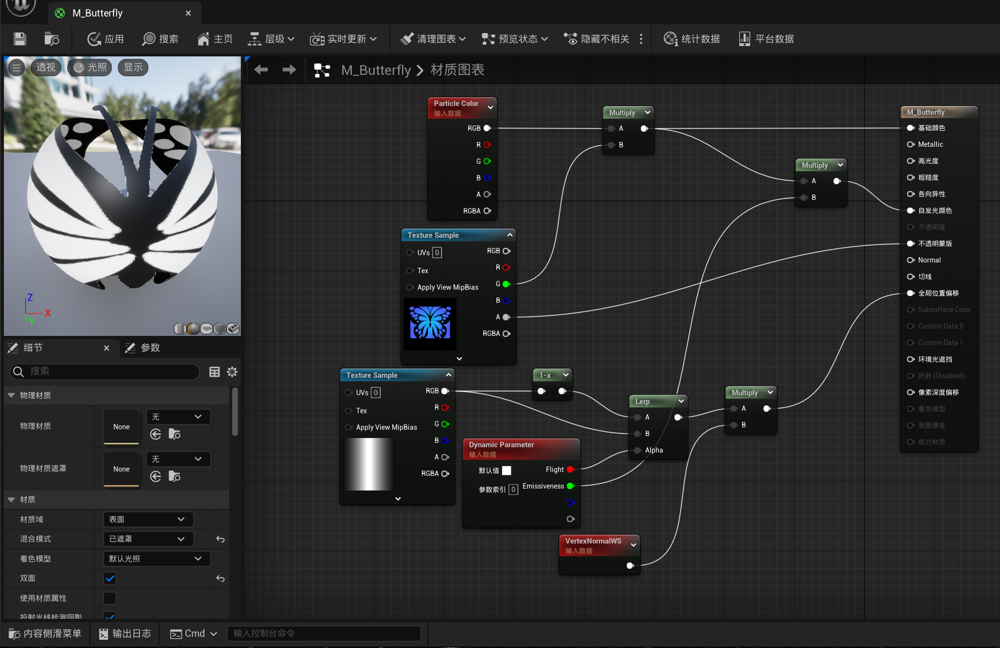
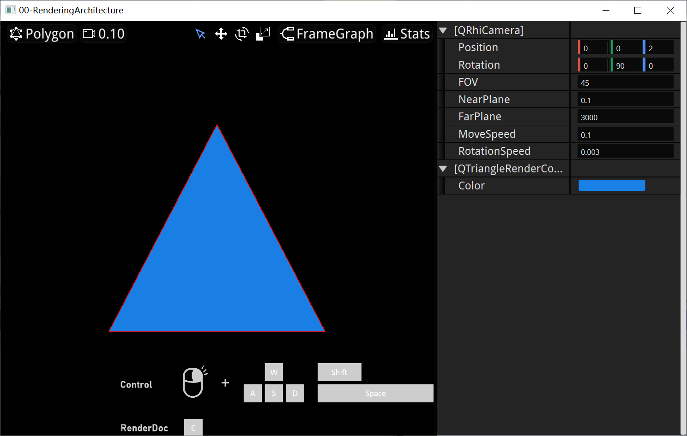

# 렌더링 아키텍처

이전 장에서는 **QRhi**를 사용하여 그래픽을 그리는 방법을 배웠지만, 그래픽 렌더링은 단순히 그래픽 API를 사용하는 것 이상의 내용입니다. 3D 장면에서 그래픽 복잡도가 높아지면 RHI 인터페이스를 직접 사용하여 선형 로직을 작성하는 것이 코드를 매우 혼란스럽게 만들기 때문에, 현대 그래픽 엔진은 RHI 기반에서 추가로封装(래핑)합니다.

예를 들어 파이프라인 실행을 **렌더 항목(RenderItem)**으로封装할 수 있으며, 이 경우 전체 렌더링 과정은 다음과 같을 수 있습니다:

```C++
void onRenderTick(QRhiCommandBuffer* cmdBuffer){
    QRhiResourceUpdateBatch* batch = rhi->nextResourceUpdateBatch();
 
    for(auto item: renderItems){
        item->tryUpload(batch);
        item->updated(batch);
    }
    
    cmdBuffer->beginPass(renderTarget, clearColor, dsClearValue, batch);
   
    for(auto item: renderItems)
        item->draw(cmdBuffer);
    
    cmdBuffer->endPass();
}
```

이렇게 하면 많은 기하图形(도형)을 한 이미지에 그리기 위한 코드 구조를 매우 쉽게组织할 수 있습니다:


이 **렌더 과정(RenderPass)**을 일반적으로 **BasePass** / **MeshPass** / **PrimitivePass**라고 합니다.

이 Pass의 역할은 3D 장면의 거의 모든 기하形体(도형)를 그리는 것입니다.

하지만 MeshPass만으로 얻는 그래픽 효과는 종종 비교적朴素(단순)합니다. Pass 내부 렌더 항목의 파이프라인 쉐이딩 로직을 조정하여 그래픽 효과를 풍부하게 할 수 있지만(전방 렌더링), 현대 그래픽 렌더링에서는 다중 프레임(다중 Pass) 처리로 전체 화면 효과를 조정합니다(지연 렌더링 + 후처리).

이 설명이 이해하기 어려울 수 있지만, 아래 다이어그램을 보면 이해할 수 있을 것입니다:













이러한 다중 Pass 렌더링 로직을 더 잘 지원하기 위해 현대 그래픽 엔진은 해당 구조를封装하며, 일반적으로 **Render Graph / Frame Graph / Scene Graph**라고 합니다.

## RenderGraph

RenderGraph에 대한 자세한 설명은 많은 우수한 글이 있으며, 강력히 추천합니다:

- [不知名书杯 | Frame Graph 이해하기](https://zhuanlan.zhihu.com/p/639001043)
- [向往 | 유니얼 렌더링 시스템 분석(11) - RDG](https://www.cnblogs.com/timlly/p/15217090.html)
- [丛越 | 게임 엔진随笔 0x03: 확장 가능한 렌더 파이프라인 아키텍처](https://zhuanlan.zhihu.com/p/70668533)
- [Ubp.a | FrameGraph|설계&DX12 기반 구현](https://zhuanlan.zhihu.com/p/147207161)

참고할 수 있는 구현은 다음과 같습니다:

- [Unreal Engine | Render Dependency Graph](https://docs.unrealengine.com/5.3/en-US/render-dependency-graph-in-unreal-engine/)
- [Unity | Render Graph System](https://docs.unity3d.com/Packages/com.unity.render-pipelines.core@17.0/manual/render-graph-system.html)
- [O3DE | Pass System](https://docs.o3de.org/docs/atom-guide/dev-guide/passes/pass-system/)
- [Qt Quick | Scene Graph](https://doc.qt.io/qt-6/qtquick-visualcanvas-scenegraph.html)

저자는 이 튜토리얼 코드에서 간단한 RenderGraph를 구현했으며, 아래에서는 주로 의사 코드 형식으로 저자의 설계思路와 개발 과정에서遇到한 문제를 설명합니다.

> 다른 사람이 축적한成果을 학습하는 것은 매우 큰 도전입니다. 개발자와 동일한困境을 겪지 않았기 때문에, 왜 이렇게 해야 하는지设身处地(입장을 바꿔) 생각하기 어렵기 때문입니다~

RenderGraph의 주요 설계 목표는 렌더依赖图(의존성 그래프) 구성을 완료하는 것입니다:



이러한 렌더 구조를 구현하려면 코드层面에서 어떻게 설계할까요?

저자는 먼저 **RenderPassNode**를 추상화했습니다:

``` c++
class IRenderPassNode{
    virtual void onRecrecteResource() = 0;  			 //여기서 RenderPass에 필요한 RHI 리소스 생성
    virutal void onRenderTick(QRhiCommandBuffer*) = 0;	 //렌더링 로직 실행
       
    virtual QVariant setupInputParam(QString) = 0;		 //외부에서 해당 Pass의 입력 매개변수 채우기
    virtual QVariant getOutputParam(QString) = 0;	 	 //외부에서 해당 Pass의 출력 매개변수 가져오기
protected:
    QMap<QString,QVariant> mInputs;						 //입력 매개변수
    QMap<QString,QVariant> mOutputs;					 //출력 매개변수
}
```

이 기반에서 **MeshPass**의 로직은 다음과 같아졌습니다:

``` c++
class QMeshPassNode: public IRenderPassNode {
public:
    void addRenderItem(...);
    void removeRenderItem(...);
public:
    QVector<RenderItem> mRenderItems;
    QRhiTextureRenderTarget mRenderTarget;
private:
    void onRecrecteResource() {
        createRenderTarger(mRenderTarget);
        mOutput["BaseColor"] = mRenderTarget.ColorAttachment0;		//출력 매개변수 등록
            
        for(auto item: mRenderItems){							    //모든 Item의 렌더 리소스 생성
            item->createResources();
        }
    }
    
    void onRenderTick(QRhiCommandBuffer* cmdBuffer) override {
        QRhiResourceUpdateBatch* batch = rhi->nextResourceUpdateBatch();
        
        for(auto item: mRenderItems){				//모든 Item의 리소스 업로드 및 업데이트
            item->tryUpload(batch);
            item->updated(batch);
        }

        cmdBuffer->beginPass(mRenderTarget, clearColor, dsClearValue, batch);

        for(auto item: mRenderItems)				//Item의 그리기 실행
            item->draw(cmdBuffer);

        cmdBuffer->endPass();
    }
}
```

다른 몇 가지润色(보완)을 추가하여 저자는 첫 번째 버전의 FrameGraph 구조를 완성했습니다:

``` c++
widget.setFrameGraph(
    QFrameGraph::Begin()
    .addPass(
        QMeshRenderPass::Create("MeshPass")				//MeshPass 생성
        .addComponent(										//정적 메시 컴포넌트 추가
            QStaticMeshRenderComponent::Create("StaticMesh")
            .setStaticMesh(QStaticMesh::CreateFromFile(RESOURCE_DIR"/Model/mandalorian_ship/scene.gltf"))
            .setRotation(QVector3D(-90, 0, 0))
        )
    )
    .addPass(
        QPixelFilterRenderPass::Create("BrightPixels")						//이 Pass는 이미지에서 밝기 값이 1.0을 초과하는 픽셀 필터링
        .setTextureIn_Src("MeshPass",QMeshRenderPass::Out::BaseColor)		//이 Pass의 입력을 MeshPass 출력의 BaseColor로 설정
        .setFilterCode(R"(
				const float threshold = 1.0f;
				void main() {
					vec4 color = texture(uTexture, vUV);
					float value = max(max(color.r,color.g),color.b);
					outFragColor = (1-step(value, threshold)) * color * 100;
				}
			)")
    )
    .addPass(
        QBlurRenderPass::Create("Blur")												//이 Pass는 이미지 블러 처리
        .setBlurIterations(1)
        .setTextureIn_Src("BrightPixels", QPixelFilterRenderPass::Out::Result)		//이 Pass의 입력을 BrightPixels의 출력 결과로 설정
    )
    .addPass(
        QBloomRenderPass::Create("Bloom")											//이 Pass는 원본 이미지와 번쩍이는 이미지 혼합
        .setTextureIn_Raw("MeshPass", QMeshRenderPass::Out::BaseColor)
        .setTextureIn_Blur("Blur", QBlurRenderPass::Out::Result)
    )
    .addPass(
        QToneMappingRenderPass::Create("ToneMapping")								//이 Pass는 이미지 톤 매핑
        .setTextureIn_Src("Bloom", QBloomRenderPass::Out::Result)
    )
    .end("ToneMapping", QToneMappingRenderPass::Out::Result)						//톤 매핑 결과를 화면에 출력
)
```

이 코드는 다음과 같은 RenderGraph를 구축합니다:


이 구현은 매우 간단하며, QRhi가 RenderGraph의 일부 역할을 완료했기 때문입니다.

[이전 장](https://italink.github.io/ModernGraphicsEngineGuide/01-GraphicsAPI/6.%E5%9B%BE%E5%BD%A2%E6%B8%B2%E6%9F%93%E8%BF%9B%E9%98%B6/#_2)에서 언급했듯이: **현대 그래픽 API는 리소스 동기화를 수동으로 관리해야 합니다**.

현대 그래픽 엔진은 RenderGraph에서 리소스의 의존성 관계를 분석하여 리소스 동기화를 자동으로 관리합니다.

QRhi에서는 이 부분 로직이 이미 구현되어 있으므로 우리는 신경 쓸 필요가 없습니다.

하지만 위의 구현은 완벽하지 않습니다:

- FrameGraph 구축은 메인 스레드에서 이루어지며, 너무 많은 리소스를 한 번에 생성하면 UI가卡顿(뻗는 현상)됩니다.

- FrameGraph 구조가 고정되어 있습니다. FrameGraph 전체를 한 번에 생성하여 렌더러에装配(조립)하기 때문에, 기존 코드 구조로 렌더 구조를 동적으로 조정하는 것은 매우 어렵습니다. 예를 들어 현재 카메라 공간에 발광物体(오브젝트)가 없다고 판단하면 `BloomPass`를 제거할 수 있는가? `BloomPass`를 제거하는 것은 실제로 `BloomPass`의 입력을 직접 다음 Pass에 연결하는 것과 같습니다, 다음과 같이:

   

- 리소스 간의 의존성과 재생성을 잘 처리하지 못합니다. 예를 들어 창 크기가 변경되면 일부 Pass의 RT를 재생성해야 하며, RT의 Texture 재생성은 이후 해당 Texture를 사용하는 **ShaderResourceBindings**도 재생성해야 함을 의미합니다. 하지만 현재做法(방법)은 매우蠢(어리석습니다): 창 크기가 변경되면 FrameGraph 내의 모든 리소스를 재생성합니다. 리소스 생성이 모두 **IRenderPassNode**의 `onRecrecteResource` 함수에 들어 있기 때문이며, 이 함수는 모든 리소스 생성을 포함하므로 편의를 위해 통합 호출했습니다. 나중에 저자가 다른 추상 함수 `onResizeAndLink`를 추가하여 RT 및 Bindings 재생성 로직을 추가했지만, 이 부분 구조는 여전히 사용하기 어렵습니다.

이 FrameGraph가 매우拉垮(나쁘다)지만 "又不是不能用"(쓸 수는 없나?):


> 이 글을 쓰기 위해서가 아니었다면, 분명히重构(재구성)하기 위해 밤을 새우지 않았을 것입니다.T.T

重构 인터페이스方面(측면)에서는 주로 UE의 RDG를 참고했으며, 위 코드는重构 후 다음과 같아졌습니다:

``` c++
class MyRenderer: public IRenderer {
	Q_OBJECT
	Q_PROPERTY_VAR(int, BlurIterations) = 2;
	Q_PROPERTY_VAR(int, BlurSize) = 20;
	Q_PROPERTY_VAR(int, DownSampleCount) = 4;

	Q_PROPERTY_VAR(float, Gamma) = 2.2f;
	Q_PROPERTY_VAR(float, Exposure) = 1.f;
	Q_PROPERTY_VAR(float, PureWhite) = 1.f;

	Q_CLASSINFO("BlurIterations", "Min=1,Max=8")
private:
	QStaticMeshRenderComponent mStaticComp;
public:
	MyRenderer()
		: IRenderer({ QRhi::Vulkan })
	{
		mStaticComp.setStaticMesh(QStaticMesh::CreateFromFile(RESOURCE_DIR"/Model/mandalorian_ship/scene.gltf"));
		mStaticComp.setRotation(QVector3D(-90, 0, 0));

		addComponent(&mStaticComp);

		getCamera()->setPosition(QVector3D(20, 15, 12));
		getCamera()->setRotation(QVector3D(-30, 145, 0));
	}
protected:
	void setupGraph(QRenderGraphBuilder& graphBuilder) override {
		QMeshPassBuilder::Output meshOut
			= graphBuilder.addPassBuilder<QMeshPassBuilder>("MeshPass");

		QPixelFilterPassBuilder::Output filterOut = graphBuilder.addPassBuilder<QPixelFilterPassBuilder>("FilterPass")
			.setBaseColorTexture(meshOut.BaseColor)
			.setFilterCode(R"(
				const float threshold = 0.5f;
				void main() {
					vec4 color = texture(uTexture, vUV);
					float value = max(max(color.r,color.g),color.b);
					outFragColor = (1-step(value, threshold)) * color;
				}
			)");

		QBlurPassBuilder::Output blurOut = graphBuilder.addPassBuilder<QBlurPassBuilder>("BlurPass")
			.setBaseColorTexture(filterOut.FilterResult)
			.setBlurIterations(BlurIterations)
			.setBlurSize(BlurSize)
			.setDownSampleCount(DownSampleCount);

		QBloomPassBuilder::Output bloomOut = graphBuilder.addPassBuilder<QBloomPassBuilder>("BloomPass")
			.setBaseColorTexture(meshOut.BaseColor)
			.setBlurTexture(blurOut.BlurResult);

		QToneMappingPassBuilder::Output tonemappingOut = graphBuilder.addPassBuilder<QToneMappingPassBuilder>("ToneMappingPass")
			.setBaseColorTexture(bloomOut.BloomResult)
			.setExposure(Exposure)
			.setGamma(Gamma)
			.setPureWhite(PureWhite);

		QOutputPassBuilder::Output cout
			= graphBuilder.addPassBuilder<QOutputPassBuilder>("OutputPass")
			.setInitialTexture(tonemappingOut.ToneMappingReslut);
	}
};

int main(int argc, char** argv) {
	QEngineApplication app(argc, argv);
	QRenderWidget widget(new MyRenderer());
	widget.showMaximized();
	return app.exec();
}
```

비교적 큰 변경 사항은 다음과 같습니다:

**RenderComponent**는 이전과 같이 `MeshPass.addComponent`하는 대신 **Renderer**에存储(저장)됩니다.

다중 스레드를 지원하며, RenderThread에서 **Renderer**를驱动(구동)하여 **每帧(프레임마다)** `setupGraph` 함수를执行합니다. 이 함수의 주요 역할은:

- **QRenderGraphBuilder**가 제공하는 `setup`으로 시작하는 일련의 함수를 사용하여 리소스描述(설명)를创建합니다. 이 함수는 **尝试创建(생성 시도)** RHI 리소스하고, (이전 매개변수와 일치하지 않아)失效(무효)된 리소스를标记합니다.

  ``` c++
  void setupBuffer(QRhiBufferRef& buffer, const QByteArray& name, QRhiBuffer::Type type, QRhiBuffer::UsageFlags usages, int size);
  
  void setupTexture(QRhiTextureRef& texture, const QByteArray& name, QRhiTexture::Format format, const QSize& pixelSize, int sampleCount = 1, QRhiTexture::Flags flags = {});
  
  void setupSampler(QRhiSamplerRef& sampler,
                    const QByteArray& name,
                    QRhiSampler::Filter magFilter,
                    QRhiSampler::Filter minFilter,
                    QRhiSampler::Filter mipmapMode,
                    QRhiSampler::AddressMode addressU,
                    QRhiSampler::AddressMode addressV,
                    QRhiSampler::AddressMode addressW = QRhiSampler::Repeat);
  
  void setupShaderResourceBindings(QRhiShaderResourceBindingsRef& bindings, const QByteArray& name, QVector<QRhiShaderResourceBinding> binds);
  
  void setupRenderBuffer(QRhiRenderBufferRef& renderBuffer,
                         const QByteArray& name,
                         QRhiRenderBuffer::Type type,
                         const QSize& pixelSize,
                         int sampleCount = 1,
                         QRhiRenderBuffer::Flags flags = {},
                         QRhiTexture::Format backingFormatHint = QRhiTexture::UnknownFormat);
  
  void setupRenderTarget(QRhiTextureRenderTargetRef& renderTarget,
                         const QByteArray& name,
                         const QRhiTextureRenderTargetDescription& desc,
                         QRhiTextureRenderTarget::Flags flags = {});
  
  void setupGraphicsPipeline(QRhiGraphicsPipelineRef& pipeline,
                             const QByteArray& name,
                             const QRhiGraphicsPipelineState& state);
  
  void setupComputePipeline(QRhiComputePipelineRef& pipeline,
                            const QByteArray& name,
                            const QRhiComputePipelineState& state);
  ```

- `addPass`를 통해 실제 렌더링 로직을添加합니다.

  ``` c++
  void addPass(std::function<void(QRhiCommandBuffer*)> executor)
  ```

- Pass 리소스와 기능을划分(구분)하기 **便于(편리하게)** 하기 위해 `IRenderPassBuilder` 추상 클래스를 제공하며, 그 구조는 다음과 같습니다:

  ``` c++
  class IRenderPassBuilder {
  	friend class QRenderGraphBuilder;
  	virtual void setup(QRenderGraphBuilder& builder) = 0;
  	virtual void execute(QRhiCommandBuffer* cmdBuffer) = 0;
  };
  ```

  `setupGraph`에서 함수 `QRenderGraphBuilder::addPassBuilder`를 통해添加할 수 있습니다:

  ``` C++
  void setupGraph(QRenderGraphBuilder& graphBuilder) override {
      QMeshPassBuilder::Output meshOut
          = graphBuilder.addPassBuilder<QMeshPassBuilder>("MeshPass");
  }
  ```

  이는 본질적으로 다음과 같습니다:

  ``` c++
  void setupGraph(QRenderGraphBuilder& graphBuilder) override {
      mMeshPassBuilder->setup(graphBuilder);
      mMeshPassBuilder->addPass(std::bind(&QMeshPassBuilder::execute, mMeshPassBuilder, std::placeholders::_1));
      QMeshPassBuilder::Output meshOut = mMeshPassBuilder->getOutput();
  }
  ```

우리는 다음과 같은 구조로 **IRenderPassBuilder**를定义할 수 있습니다:

``` c++
class QPixelFilterPassBuilder : public IRenderPassBuilder {
public:
	QPixelFilterPassBuilder();

	QRP_INPUT_BEGIN(QPixelFilterPassBuilder)					//입력 정의
		QRP_INPUT_ATTR(QRhiTextureRef, BaseColorTexture);		
		QRP_INPUT_ATTR(QString, FilterCode);
	QRP_INPUT_END()

	QRP_OUTPUT_BEGIN(QPixelFilterPassBuilder)					//출력 정의
		QRP_OUTPUT_ATTR(QRhiTextureRef, FilterResult);
	QRP_OUTPUT_END()
public:
	void setup(QRenderGraphBuilder& builder) override			//각종 리소스描述装配, 입력 읽기, 출력 채우기
	{
		if (mFilterCode != mInput._FilterCode) {				//입력 가져오기
			mFilterCode = mInput._FilterCode;
			mFilterFS = QRhiHelper::newShaderFromCode(QShader::FragmentStage, R"(#version 450
				layout (binding = 0) uniform sampler2D uTexture;
				layout (location = 0) in vec2 vUV;
				layout (location = 0) out vec4 outFragColor; )"
				+ mFilterCode.toLocal8Bit());
		}
		if (!mFilterFS.isValid())
			return;

       
		builder.setupTexture(mRT.colorAttachment, "FilterTexture", mInput._BaseColorTexture->format(), mInput._BaseColorTexture->pixelSize(), 1, QRhiTexture::RenderTarget | QRhiTexture::UsedAsTransferSource);
		builder.setupRenderTarget(mRT.renderTarget, "FilterRenderTarget", { mRT.colorAttachment.get() });
		builder.setupSampler(mSampler, "FilterSampler",
			QRhiSampler::Linear,
			QRhiSampler::Linear,
			QRhiSampler::None,
			QRhiSampler::ClampToEdge,
			QRhiSampler::ClampToEdge);

		builder.setupShaderResourceBindings(mBindings, "FilterBindings", {
			QRhiShaderResourceBinding::sampledTexture(0,QRhiShaderResourceBinding::FragmentStage,mInput._BaseColorTexture.get(), mSampler.get()),
			});

		QRhiGraphicsPipelineState PSO;
		PSO.sampleCount = mRT.renderTarget->sampleCount();
		PSO.shaderResourceBindings = mBindings.get();
		PSO.renderPassDesc = mRT.renderTarget->renderPassDescriptor();
		PSO.shaderStages = {
			{ QRhiShaderStage::Vertex, builder.getFullScreenVS() },
			{ QRhiShaderStage::Fragment, mFilterFS }
		};
		builder.setupGraphicsPipeline(mPipeline, "FilterPipeline", PSO);
		mOutput.FilterResult = mRT.colorAttachment;				//출력 채우기
	}

	void execute(QRhiCommandBuffer* cmdBuffer) override			//렌더링 로직 실행
	{
		if (!mFilterFS.isValid())
			return;
		cmdBuffer->beginPass(mRT.renderTarget.get(), QColor::fromRgbF(0.0f, 0.0f, 0.0f, 0.0f), { 1.0f, 0 });
		cmdBuffer->setGraphicsPipeline(mPipeline.get());
		cmdBuffer->setViewport(QRhiViewport(0, 0, mRT.renderTarget->pixelSize().width(), mRT.renderTarget->pixelSize().height()));
		cmdBuffer->setShaderResources(mBindings.get());
		cmdBuffer->draw(4);
		cmdBuffer->endPass();
	}

private:
	QShader mFilterFS;
	QString mFilterCode;
	struct RTResource {
		QRhiTextureRef colorAttachment;
		QRhiTextureRenderTargetRef renderTarget;
	};
	RTResource mRT;
	QRhiGraphicsPipelineRef mPipeline;
	QRhiSamplerRef mSampler;
	QRhiShaderResourceBindingsRef mBindings;
};
```

### 设计原则

종합적으로 RenderGraph의 주요 설계 원칙은 다음과 같습니다:

- 렌더 구조가 **动态可变(동적으로 변경 가능)** 하도록 하기 위해 `Setup`阶段(단계)가 있으며, **每帧(프레임마다)** RenderGraph를 재구축합니다(단지 **리소스描述创建**와 **의존성 관계组织** 및 **Executor** 로직添加).
- `Setup`이 완료된 후 `Compile`过程(과정)으로 진행하며,此时(이때)我们可以拿到 **当前帧**의所有 리소스描述和 의존성 관계입니다. 이때 리소스描述에 따라 (또는 풀에서 재사용하여) 실제 **RHI 리소스**를创建하고, 의존 리소스 간의 의존성 관계에 따라 **Executors 之间(사이)** 에 리소스 동기화 Execute 명령을 **穿插(삽입)** 하며,其他(다른)一些执行优化를处理합니다.
- `Compile`阶段之后 `Execute`阶段로进入하며,此时所有 **리소스描述句柄**가 실제 RHI 리소스에对应합니다.所有 RHI 관련 로직은 **Executor**에서 처리해야 합니다.
- `Execute`阶段执行结束后 **리소스描述和 RHI 리소스绑定**를 **清理(정리)** 합니다. RHI 리소스는 풀로回归(돌아갑니다). RenderGraph의每次执行之间持久性이不存在하기 때문에, RenderGraph가 한 번 `Setup`을执行하여创建한 **리소스描述는下一帧(다음 프레임)으로延续(이어갈) 필요가 없습니다**(일부 예외 제외).

QRhi로 RenderGraph 구조를 구현하는 것은 어렵지 않습니다. QRhi 자체가 리소스 동기화를 처리했기 때문이며, `QRhi::new...()`로 얻는 것은 리소스描述이고 `create` 함수를 호출할 때만 실제 RHI 리소스를创建하기 때문입니다. QRhi의 구현이有些特殊(특별)하기 때문에 저자는 위 설계 원칙을 완전히 따르지 않고 리소스를 관리했으며,关键(핵심)은当下(현재) 사용需求를照顾(충족)하는 것입니다.

## MeshPass

MeshPass는 매우特殊한 RenderPass입니다. 3D 공간의 기하图形(도형) 거의 모두 이 Pass에서 그려지기 때문이며,其他 RenderPass의重点(중점)은 기하 원소 그리기가 아닌 이미지 처리에 있습니다.

위 설계思想下,我们的 MeshPass의 `execute` 함수는大概(대략) 다음과 같습니다:

``` c++
void execute(QRhiCommandBuffer* cmdBuffer){
    QRhiResourceUpdateBatch* batch = rhi->nextResourceUpdateBatch();
 
    for(auto item: renderItems){
        item->tryCreate(rhi,mRenderTarget);
        item->tryUpload(batch);
        item->updated(batch);
    }
    
    cmdBuffer->beginPass(mRenderTarget, clearColor, dsClearValue, batch);
   
    for(auto item: renderItems)
        item->draw(cmdBuffer,viewport);
    
    cmdBuffer->endPass();
}
```

**IRenderItem**의 추상 구조는大概 다음과 같습니다:

``` c++
class IRenderItem{
protected:
    virtual void create(QRhi* rhi, QRhiRenderTaget* rt) = 0;
    virtual void upload(QRhiResourceUpdateBatch* batch) = 0;
public:
    void tryCreate(QRhi* rhi,QRhiRenderTaget* rt){ 
        if(needCreate())
            create(rhi,rt);
    }    
    void tryUpload(QRhiResourceUpdateBatch* batch{ 
        if(needUpload())
            upload(batch);
    }
    virtual void updated(QRhiResourceUpdateBatch* batch) = 0;
    virtual void draw(QRhi* commandBuffer, QRhiViewport viewport) = 0;
}
```

삼각형을 그릴 수 있는 RenderItem을 구현하려면 다음과 같은 구조를实现(구현)하면 됩니다:

``` c++
class QTriangleRenderItem: public IRenderItem{
public: 
   	QSharedPointer<QRhiBuffer> mVertexBuffer;
	QSharedPointer<QRhiShaderResourceBindings> mShaderBindings;	
    QScopedPointer<QRhiGraphicsPipeline> mPipeline;	
protected:
    void create(QRhi* rhi, QRhiRenderTaget* rt) override{
        mVertexBuffer = ...;
        mShaderBindings = ...;
        mPipeline = ...;
    }
    void upload(QRhiResourceUpdateBatch* batch) override{
       	batch->uploadStaticBuffer(mVertexBuffer.get(), VertexData);	
    }
    void updated(QRhiResourceUpdateBatch* batch) override{}
    void draw(QRhi* cmdBuffer, QRhiViewport viewport) override{
        cmdBuffer->setGraphicsPipeline(mPipeline.get());						
		cmdBuffer->setViewport(viewport);		
		cmdBuffer->setShaderResources();										
		const QRhiCommandBuffer::VertexInput vertexInput(mVertexBuffer.get(), 0);	
		cmdBuffer->setVertexInput(0, 1, &vertexInput);								
		cmdBuffer->draw(3);	
    }
}
```

이 구조는扩展(확장)하기非常容易(매우 쉽습니다).但一些功能需求出现后问题才慢慢暴露出来:

-多种类型의 MeshPass가存在할 수 있습니다. 예를 들어正常(일반) MeshPass의 RT는 하나의 색상 첨부 파일을 가지지만, 지연 렌더링 MeshPass는 여러 첨부 파일을 가질 수 있습니다. 예를 들어 PBR의 경우 `BaseColor`, `Position`, `Normal`, `Metallic`, `Roughness`가 있으며, MeshPass의 RT는 Render Item의 파이프라인 **SampleCount**, **RenderPassDescriptor**, **TargetBlends** 및 **FragmentShader**에서 해당 색상 첨부 파일을如何(어떻게)填充(채울지)에影响(영향)을 미칩니다.
-我们可能希望全局复用 Render Item의 파이프라인数据,新的 파이프라인을生成하고其中一些状态를顶替(대체)하여某些功能을完成합니다. 예를 들어:
  -鼠标点选(마우스 선택)制作时,我们可以一张 RT上所有 Item의 ID를绘制하고,鼠标点击时点击한 픽셀을 CPU로回读(읽어오면)比对(비교)하여我们点击한 Item이哪个인지知道할 수 있습니다.这需要我们流水线的 **FragmentShader** 和 **StencilState**를覆盖(덮어쓰기)합니다.
  -ShadowMap制作时相机视角从场景深度를绘制해야 하며,这需要我们流水线的 **ShaderResourceBindings(ViewMatrix)** 和 **FragmentShader**를覆盖합니다.

因此 Render Item을设计할 때 RHI 리소스와 명령을直接操作하면后续一些功能扩展을受限(제한)하게 됩니다.

为此我们得进一步封装하여 파이프라인 사용에一定弹性(유연성)을具备하게 합니다.

这里笔者封装的结构是 **QPrimitiveRenderProxy**이며,以下功能을提供합니다:

- **QRhiGraphicsPipeline**创建를包裹(래핑)하며 MeshPass Render Target适配功能을提供합니다.
- **QRhiUniformBlock**을封装하여 파이프라인에 Uniform 매개변수를简单方式로快速创建할 수 있습니다.
-纹理资源를封装하여自动绑定添加 및 Shader定义生成을 할 수 있습니다.
- **Create**, **Upload**, **Update**, **Draw** 로직을回调函数로存储하며,本质上这也是一种可被复用的状态입니다.
- SubPipeline机制을提供하여 Proxy를模板으로 하여子管线을创建하고一些 파이프라인状态를顶替할 수 있습니다. Proxy가变动时 SubPipeline也会重建합니다.

在此基础上三角形绘制을完成하려면 다음 코드를编写하면 됩니다:

``` c++
class QTriangleRenderComponent: public IRenderComponent {			// IRenderComponent는文章中的 IRenderItem에对应
	Q_OBJECT
	Q_PROPERTY(QColor Color READ getColor WRITE setColor)
public:
	QColor getColor() const { return mColor; }
	void setColor(QColor val) { mColor = val; }
private:
	QScopedPointer<QRhiBuffer> mVertexBuffer;
	QSharedPointer<QPrimitiveRenderProxy> mProxy;
	QColor mColor = QColor::fromRgbF(0.1f, 0.5f, 0.9f, 1.0f);
protected:
	void onRebuildResource() override {
		mVertexBuffer.reset(mRhi->newBuffer(QRhiBuffer::Immutable, QRhiBuffer::VertexBuffer, sizeof(VertexData)));
		mVertexBuffer->create();

		mProxy = newPrimitiveRenderProxy();

		mProxy->addUniformBlock(QRhiShaderStage::Fragment, "UBO")
			->addParam("Color", mColor);

		mProxy->setInputBindings({
			QRhiVertexInputBindingEx(mVertexBuffer.get(), 2 * sizeof(float))
		});

		mProxy->setInputAttribute({
			QRhiVertexInputAttributeEx("inPosition",0, 0, QRhiVertexInputAttribute::Float2, 0),
		});
		mProxy->setShaderMainCode(QRhiShaderStage::Vertex, R"(
			void main(){
				gl_Position = vec4(inPosition, 0.0f,1.0f);
			}
		)");
		mProxy->setShaderMainCode(QRhiShaderStage::Fragment, QString(R"(
			void main(){
				%1
			})")
			.arg(hasColorAttachment("BaseColor")? "BaseColor = UBO.Color;" : "")
			.toLocal8Bit()
		);
		mProxy->setOnUpload([this](QRhiResourceUpdateBatch* batch) {
			batch->uploadStaticBuffer(mVertexBuffer.get(), VertexData);
		});
		mProxy->setOnUpdate([this](QRhiResourceUpdateBatch* batch, const QPrimitiveRenderProxy::UniformBlocks& blocks, const QPrimitiveRenderProxy::UpdateContext& ctx) {
			blocks["UBO"]->setParamValue("Color", QVariant::fromValue(mColor));
		});
    }
};
```

### Material

材质에 대해 저자가首次接触한概念은 [Learn OpenGL](https://learnopengl-cn.github.io/02%20Lighting/03%20Materials/)에서였으며,当时理解中材质는 다음과 같은 UniformBlock이었습니다:

``` c++
struct Material {
    vec3 ambient;
    vec3 diffuse;
    vec3 specular;
    float shininess;
}; 
```

但一些引擎接触后材质가那么简单하지 않다는 것을发现했습니다:

- [Unreal Engine | Material](https://docs.unrealengine.com/5.3/en-US/unreal-engine-materials/) 

- [O3DE | Material](https://docs.o3de.org/docs/atom-guide/look-dev/materials/material-system/)

- [Unity | Material](https://docs.unity3d.com/Manual/materials-introduction.html)

- [Godot | Material](https://docs.godotengine.org/en/stable/classes/class_material.html)

各个引擎中材质系统实现都有所差异但它们都遵循这一原则:材质는图形의表面属性를定义하며,物体视觉外观를控制하는 "皮肤"으로视为될 수 있습니다.

Unreal Engine의材质系统은无疑最为强大하며,其材质系统은图形外观를控制하는所有功能을涵盖합니다.它提供一系列参数로 파이프라인裁剪测试,深度测试,模板测试,混合模式,背面剔除...를控制합니다.

不同的 **着色模型(Shading Model)**에 대해材质表达式插槽을提供하며,大量的材质函数节点을提供하여对应的 Shader代码로转换할 수 있으며, 쉽게着色器资源(Buffer, Sampler 및 Texture)를创建하고自动으로着色器资源绑定을创建할 수 있습니다.



材质系统의架构는引擎의整个渲染体系를考虑해야 하며,本教程은更多的是渲染尝试를进行하기 때문에(主要是精力不足 때문), 저자가封装한 **QMaterial**에서는 단순히参数和纹理를提供하는结构입니다:

``` C++
struct QMaterial {
	QMap<QString, QVariant> mProperties;
};
```

**QPrimitiveRenderProxy**에서材质添加는这些属性에 대해自动으로 **UniformBuffer** 和 **Texture**를创建하여 MeshPass中 **RenderComponet**构建时使用할 수 있도록 합니다.

具体的使用方法는 다음을参考하십시오:

- https://github.com/Italink/ModernGraphicsEngineGuide/blob/main/Source/2-EngineTechnology/00-RenderingArchitecture/Source/main.cpp



``` c++
#include "QEngineApplication.h"
#include "QRenderWidget.h"
#include "Render/IRenderComponent.h"
#include "Render/RenderGraph/PassBuilder/QMeshPassBuilder.h"
#include "Render/PassBuilder/QOutputPassBuilder.h"

static float VertexData[] = {
	//position(xy)	
	 0.0f,  -0.5f,
	-0.5f,   0.5f,
	 0.5f,   0.5f,
};

class QTriangleRenderComponent: public IRenderComponent {
	Q_OBJECT
	Q_PROPERTY(QColor Color READ getColor WRITE setColor)
public:
	QColor getColor() const { return mColor; }
	void setColor(QColor val) { mColor = val; }
private:
	QScopedPointer<QRhiBuffer> mVertexBuffer;
	QSharedPointer<QPrimitiveRenderProxy> mProxy;
	QColor mColor = QColor::fromRgbF(0.1f, 0.5f, 0.9f, 1.0f);
protected:
	void onRebuildResource() override {
		mVertexBuffer.reset(mRhi->newBuffer(QRhiBuffer::Immutable, QRhiBuffer::VertexBuffer, sizeof(VertexData)));
		mVertexBuffer->create();

		mProxy = newPrimitiveRenderProxy();

		mProxy->addUniformBlock(QRhiShaderStage::Fragment, "UBO")
			->addParam("Color", mColor);

		mProxy->setInputBindings({
			QRhiVertexInputBindingEx(mVertexBuffer.get(),2 * sizeof(float))
		});

		mProxy->setInputAttribute({
			QRhiVertexInputAttributeEx("inPosition",0, 0, QRhiVertexInputAttribute::Float2, 0),
		});
		mProxy->setShaderMainCode(QRhiShaderStage::Vertex, R"(
			void main(){
				gl_Position =vec4(inPosition, 0.0f,1.0f);
			}
		)");
		mProxy->setShaderMainCode(QRhiShaderStage::Fragment, QString(R"(
			void main(){
				%1
			})")
			.arg(hasColorAttachment("BaseColor")? "BaseColor = UBO.Color;" : "")
			.toLocal8Bit()
		);
		mProxy->setOnUpload([this](QRhiResourceUpdateBatch* batch) {
			batch->uploadStaticBuffer(mVertexBuffer.get(), VertexData);
		});
		mProxy->setOnUpdate([this](QRhiResourceUpdateBatch* batch, const QPrimitiveRenderProxy::UniformBlocks& blocks, const QPrimitiveRenderProxy::UpdateContext& ctx) {
			blocks["UBO"]->setParamValue("Color", QVariant::fromValue(mColor));
		});
    }
};

class QOutliningPassBuilder : public IRenderPassBuilder {
	QRP_INPUT_BEGIN(QOutliningPassBuilder)
		QRP_INPUT_ATTR(QRhiTextureRef, BaseColor);
	QRP_INPUT_END()

	QRP_OUTPUT_BEGIN(QOutliningPassBuilder)
		QRP_OUTPUT_ATTR(QRhiTextureRef, OutliningResult)
	QRP_OUTPUT_END()
private:
	QRhiTextureRef mColorAttachment;
	QRhiTextureRenderTargetRef mRenderTarget;
	QShader mOutliningFS;
	QRhiSamplerRef mSampler;
	QRhiShaderResourceBindingsRef mOutliningBindings;
	QRhiGraphicsPipelineRef mOutliningPipeline;
public:
	QOutliningPassBuilder() {
		mOutliningFS = QRhiHelper::newShaderFromCode(QShader::FragmentStage, R"(#version 450
			layout (location = 0) in vec2 vUV;
			layout (location = 0) out vec4 outFragColor;

			layout (binding = 0) uniform sampler2D uBaseColor;

			void main() {
				vec2 texOffset = 1.0 / textureSize(uBaseColor, 0);		// single texel size 가져오기
		
				vec3 maxdiff = vec3(0.f);
				vec3 center = texture(uBaseColor,vUV).rgb;
				
				maxdiff = max(maxdiff, abs(texture(uBaseColor,vUV+vec2(texOffset.x,0)).rgb - center));
				maxdiff = max(maxdiff, abs(texture(uBaseColor,vUV-vec2(texOffset.x,0)).rgb - center));
				maxdiff = max(maxdiff, abs(texture(uBaseColor,vUV+vec2(0,texOffset.y)).rgb - center));
				maxdiff = max(maxdiff, abs(texture(uBaseColor,vUV-vec2(0,texOffset.y)).rgb - center));

				const vec4 outliningColor = vec4(1.0,0.0,0.0,1.0);
				
				outFragColor = length(maxdiff) > 0.1 ? outliningColor : vec4(center,1.0f);

			}
		)");
	}
	void setup(QRenderGraphBuilder& builder) override {
		builder.setupTexture(mColorAttachment, "Outlining", QRhiTexture::Format::RGBA32F, mInput._BaseColor->pixelSize(), 1, QRhiTexture::RenderTarget | QRhiTexture::UsedAsTransferSource);
		builder.setupRenderTarget(mRenderTarget, "OutliningRT", QRhiTextureRenderTargetDescription(mColorAttachment.get()));

		builder.setupSampler(mSampler, "OutliningSampler", QRhiSampler::Nearest, QRhiSampler::Nearest, QRhiSampler::None, QRhiSampler::ClampToEdge, QRhiSampler::ClampToEdge, QRhiSampler::ClampToEdge);

		builder.setupShaderResourceBindings(mOutliningBindings, "OutliningBindings", {
			QRhiShaderResourceBinding::sampledTexture(0, QRhiShaderResourceBinding::FragmentStage,mInput._BaseColor.get() ,mSampler.get()),
		});
		QRhiGraphicsPipelineState PSO;
		PSO.shaderResourceBindings = mOutliningBindings.get();
		PSO.sampleCount = mRenderTarget->sampleCount();
		PSO.renderPassDesc = mRenderTarget->renderPassDescriptor();
		QRhiGraphicsPipeline::TargetBlend targetBlends;
		targetBlends.enable = true;
		PSO.targetBlends = { targetBlends };
		PSO.shaderStages = {
			QRhiShaderStage(QRhiShaderStage::Vertex, builder.getFullScreenVS()),
			QRhiShaderStage(QRhiShaderStage::Fragment, mOutliningFS)
		};
		builder.setupGraphicsPipeline(mOutliningPipeline, "OutliningPipeline", PSO);

		mOutput.OutliningResult = mColorAttachment;
	}
	void execute(QRhiCommandBuffer* cmdBuffer) override {
		const QColor clearColor = QColor::fromRgbF(0.0f, 0.0f, 0.0f, 1.0f);
		const QRhiDepthStencilClearValue dsClearValue = { 1.0f,0 };
		cmdBuffer->beginPass(mRenderTarget.get(), clearColor, dsClearValue);
		cmdBuffer->setGraphicsPipeline(mOutliningPipeline.get());
		cmdBuffer->setViewport(QRhiViewport(0, 0, mRenderTarget->pixelSize().width(), mRenderTarget->pixelSize().height()));
		cmdBuffer->setShaderResources(mOutliningBindings.get());
		cmdBuffer->draw(4);
		cmdBuffer->endPass();
	}
};

class MyRenderer : public IRenderer {
private:
	QTriangleRenderComponent mComp;
public:
	MyRenderer()
		: IRenderer({QRhi::Vulkan})
	{
		addComponent(&mComp);
	}
protected:
	void setupGraph(QRenderGraphBuilder& graphBuilder) override {
		QMeshPassBuilder::Output meshPassOut = graphBuilder.addPassBuilder<QMeshPassBuilder>("MeshPass");

		QOutliningPassBuilder::Output outliningOut = graphBuilder.addPassBuilder<QOutliningPassBuilder>("OutliningPass")
			.setBaseColor(meshPassOut.BaseColor);

		QOutputPassBuilder::Output ret = graphBuilder.addPassBuilder<QOutputPassBuilder>("OutputPass")
			.setInitialTexture(outliningOut.OutliningResult);
	}
};

int main(int argc, char **argv){
	qputenv("QSG_INFO", "1");
	QEngineApplication app(argc, argv);
	QRenderWidget widget(new MyRenderer());
	widget.showMaximized();
    return app.exec();
}

#include "main.moc"
```