Slate는 UE에서 제공하는 UI 프레임워크이며, 그 핵심 개념은 다음과 같습니다:

-   [Slate 아키텍처|언리얼 엔진 5.2 문서 ](https://docs.unrealengine.com/5.2/zh-CN/understanding-the-slate-ui-architecture-in-unreal-engine/)

UI에 대한 몇 가지 기본 개념은 다음을 참고하세요:

-   [현대 그래픽 엔진 입문 가이드（七）— GUI](https://zhuanlan.zhihu.com/p/605656730)

## 기초

UE에서 Slate를 사용하려면 세 가지 핵심 구조를 이해해야 합니다:

-   **FSlateApplication** ：전역 싱글톤으로, 모든 UI의 스케줄링 센터입니다.
-   **SWindow** ：최상위 창으로, 크로스플랫폼 창 인스턴스(FGenericWindow)를 보유하며 창 관련 구성 및 조작을 제공합니다.
-   **SWidget** ：위젯으로, 창 영역을 나누고 자체 영역 내의 상호작용 및 그리기 이벤트를 처리합니다.

### 기본 사용법

UE에서 간단한 Slate 사용 예시는 다음과 같습니다:

```C++
auto Window = SNew(SWindow)							//창 생성
    .ClientSize(FVector2D(600, 600))				//창 크기 설정
    [												//창 내용 채우기
        SNew(SHorizontalBox)						//수평 박스 생성
        + SHorizontalBox::Slot()					//자식 컨트롤 슬롯 추가
        [											
            SNew(STextBlock)						//텍스트 박스 생성
            .Text(FText::FromString("Hello"))		//텍스트 박스 내용 설정
        ]
        + SHorizontalBox::Slot()					//자식 컨트롤 슬롯 추가
        [
            SNew(STextBlock)						//텍스트 박스 생성
            .Text_Lambda([](){ 						//텍스트 박스 내용 설정	
                return FText::FromString("Slate");
            })		
        ]
	];
FSlateApplication::Get().AddWindow(Window, true);	//해당 창 등록 및 즉시 표시
```

Slate의 코드 스타일은 다음과 같습니다:

-   Slate 컨트롤의 클래스 명명은 일반적으로 `S`로 시작합니다
-   다음 함수를 통해 Slate 컨트롤을 빠르게 구축할 수 있습니다:
    -   `SNew( WidgetType, ... )`：일반적인 생성 방식
    -   `SAssignNew( ExposeAs, WidgetType, ... )`：생성 완료 후 컨트롤을 `ExposeAs`에 할당
    -   `SArgumentNew( InArgs, WidgetType, ... )`：매개변수 집합을 사용하여 생성

-   생성 코드 표현식에서 컨트롤의 생성 매개변수를 설정하기 위해 일부 함수를 사용할 수 있으며, 이러한 함수는 모두 컨트롤 자체의 참조를 반환하므로 체인 호출이 가능합니다
    -   `operatpr .`를 통해 함수를 호출하여 컨트롤의 속성 및 이벤트를 설정할 수 있습니다
    -   **SPanel**의 하위 클래스는 `operator +SPanelType::Slot`을 사용하여 자식 컨트롤의 슬롯을 추가할 수 있습니다 
    -   **SCompoundWidget** `와 ` **SPanel::Slot**은 `operator []`를 사용하여 자식 컨트롤을 채울 수 있습니다
    -   Slate의 속성 및 이벤트는 여러 방식으로 바인딩할 수 있으며, 위의 `.Text(...)`는 정적 값을 설정하는 것이고, 함수를 바인딩하여 속성 값을 동적으로 가져올 수도 있습니다:
        -   `Text_Lambda(...)`
        -   `Text_Raw(...)`
        -   `Text_Static(...)`
        -   `Text_UObject(...)`

컨트롤 개발에서는 일부 경험(합리적인 것이 존재함)에 의존하고 IDE의 지원을 받아 코드를 작성할 수 있습니다.

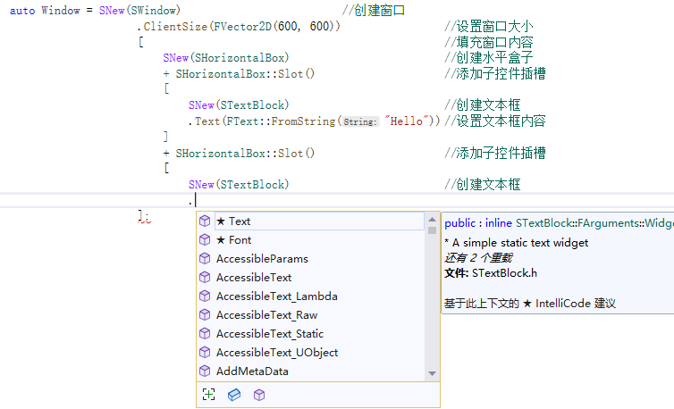

Slate는 Game UI와 Editor UI로 동시에 사용할 수 있습니다

Editor에서 다음 방식으로 UI를 추가할 수 있습니다:

```C++
auto Window = SNew(SWindow)							//최상위 창이 있어야 함
    .Title(FText::FromString("CustomWindow"))		//창 제목 설정
	.ClientSize(FVector2D(600, 600))				//창 크기 설정
	[												//창 내용 채우기
		SNew(SSpacer)								//자체 컨트롤, 여기서는 빈 채우기				
	];

//방법1：해당 창 등록 및 즉시 표시
FSlateApplication::Get().AddWindow(Window, true);	

//방법2：해당 창 등록, 표시하지 않고 ShowWindow를 수동으로 호출하여 표시
FSlateApplication::Get().AddWindow(Window, false);	//해당 창 등록 및 즉시 표시
Window->ShowWindow();
```

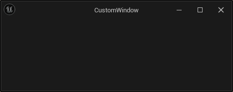

`DockTab` 방식으로 창을 추가할 수도 있습니다:

``` c++
// Tab 페이지 생성기 등록
FGlobalTabmanager::Get()->RegisterTabSpawner(FName("CustomTab"),FOnSpawnTab::CreateLambda([](const FSpawnTabArgs& Args){
    return SNew(SDockTab)
        [
        	SNew(SSpacer)
    	];
}));
FGlobalTabmanager::Get()->TryInvokeTab(FTabId("CustomTab"));		//Tab 페이지 활성화 시도
```

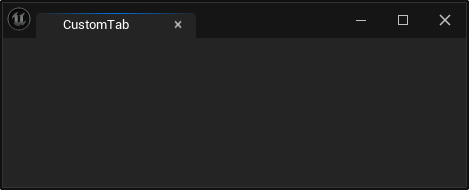

Game에서 다음 방식으로 UI를 추가할 수 있습니다:

``` C++
GEngine->GameViewport->AddViewportWidgetContent(
		SNew(SSpacer)
);
```

GameViewport에는 다른 인터페이스도 사용할 수 있습니다:

``` c++
class UGameViewportClient : public UScriptViewportClient, public FExec
{
	virtual void AddViewportWidgetContent( TSharedRef<class SWidget> ViewportContent, const int32 ZOrder = 0 );
	virtual void RemoveViewportWidgetContent( TSharedRef<class SWidget> ViewportContent );
	virtual void AddViewportWidgetForPlayer(ULocalPlayer* Player, TSharedRef<SWidget> ViewportContent, const int32 ZOrder);
	virtual void RemoveViewportWidgetForPlayer(ULocalPlayer* Player, TSharedRef<SWidget> ViewportContent);
	void RemoveAllViewportWidgets();
	void RebuildCursors();
};
```

>   자세한 내용은：https://docs.unrealengine.com/5.2/en-US/using-slate-in-game-in-unreal-engine/

### 기본 개념

UI 개발을 위해 다음 기본 개념을 이해해야 합니다:

-   **창의 기본 상태** ：활성화(Active)，포커스(Focus)，가시성(Visible)，모달(Modal)，변환(Transform)
-   **레이아웃 전략 및 관련 개념** ：
    -   박스 레이아웃(HBox，VBox)，플로우 레이아웃(Flow)，그리드 레이아웃(Grid)，앵커 레이아웃(Anchors)，오버랩 레이아웃(Overlap)，캔버스(Canvas)
    -   패딩(Padding)，마진(Margin)，간격(Spacing)，정렬 방식(Alignment)
-   **스타일 관리** ：아이콘(Icon)，스타일(Style)，브러시(Brush)
-   **폰트 관리** ：폰트 타입(Font Family)，텍스트 너비 측정(Font Measure)
-   **크기 계산** ：컨트롤 크기 계산 전략
-   **상호작용 이벤트** ：마우스，키보드，드래그，포커스 이벤트，이벤트 처리 메커니즘，마우스 캡처
-   **그리기 이벤트** ：그리기 요소，영역 클리핑
-   **기본 컨트롤** ：라벨(Label)，버튼(Button)，체크박스(Check)，콤보박스(Combo)，슬라이더(Slider)，스크롤바(Scroll Bar)，텍스트박스(Text)，대화상자(Dialog)，색상 선택(Color)，메뉴바(Menu Bar)，메뉴(Menu)，상태바(Status Bar)，스크롤 패널(Scroll ），스택(전환) 패널(Stack/Switcher)，리스트 패널(List)，트리 패널(Tree)...
-   **국제화** ：텍스트 지역화 번역(Localization)

UI 프레임워크에哪些 전역 데이터와操作이 있는지了解하고，UE에서 `Get`，`Set`을 입력하여 IDE提示에 따라 간단히 살펴볼 수 있습니다:

>   이는一定의 코딩 규范을 따르는 것이带来하는好处를体现합니다

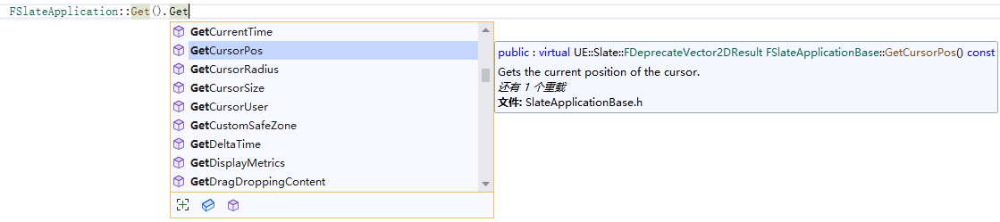

### SWidget

**SWidget**은 Slate UI 개발 과정에서 개발자가 가장 자주接触하는 타입이며，모든 UI 컨트롤의 기본 클래스입니다

개발자而言，其基本 골격을了解하고哪些 속성을调整할 수 있는지知道해야 합니다:

``` c++
TAttribute<bool> EnabledState,  						//활성화 상태，컨트롤과 상호작용할 수 있는지 지정，비활성화되면 회색으로 표시
TAttribute<EVisibility> Visibility,						//가시성 전략
TSharedPtr<IToolTip> ToolTip,							//툴팁 컨트롤
TAttribute<FText> ToolTipText,							//툴팁 텍스트 내용
TAttribute<TOptional<EMouseCursor::Type> > Cursor,		//마우스 스타일
float RenderOpacity,									//렌더링 투명도
TAttribute<TOptional<FSlateRenderTransform>> Transform,	//렌더링 변환
TAttribute<FVector2D> TransformPivot,					//렌더링 변환 중심
FName Tag,												//태그
bool ForceVolatile,										//강제 UI 무효화
EWidgetClipping Clipping,								//클리핑 전략
EFlowDirectionPreference FlowPreference,				//UI 흐름 방향
TOptional<FAccessibleWidgetData> AccessibleData,		//데이터 저장
TArray<TSharedRef<ISlateMetaData>> MetaData				//메타데이터
```

>   자세한 내용은：https://docs.unrealengine.com/5.2/zh-CN/slate-ui-widget-examples-for-unreal-engine/

哪些 함수를调用할 수 있는지:

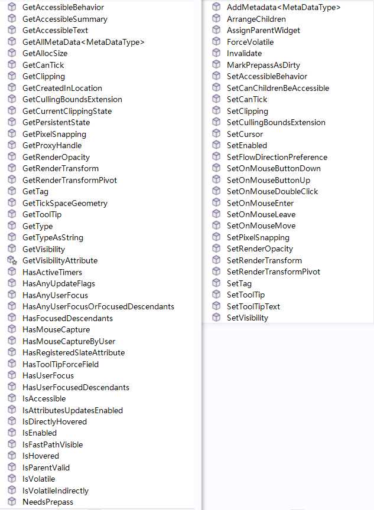

哪些 함수를覆写(Override)할 수 있는지:

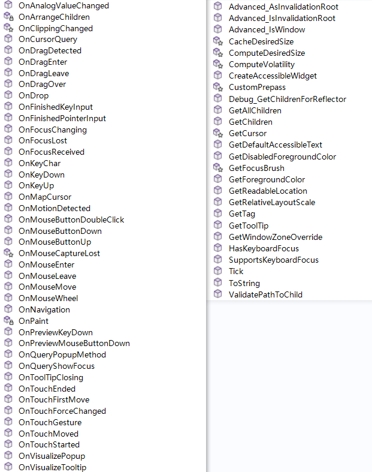

### SWindow

**SWindow**는 **SCompoundWidget**을 상속하며，이렇게 하는 것은 **SWindow**가 **SWidget**과 같은 코드 스타일을 사용할 수 있도록 하기 위함입니다，다음 속성을 가지고 있습니다:

``` c++
EWindowType Type;								//창 타입
FWindowStyle Style;     						//창 스타일
FText Title;									//창 제목
float InitialOpacity;							//초기 투명도

FVector2D ScreenPosition 						//창 좌표
FVector2D ClientSize;							//창 클라이언트 영역 크기
TOptional<float> MinWidth;						//최소 너비
TOptional<float> MinHeight;						//최소 높이
TOptional<float> MaxWidth;						//최대 너비
TOptional<float> MaxHeight;						//최대 높이
FMargin LayoutBorder;							//창 내용의 마진
FMargin UserResizeBorder;						//창 영역 조정 시 응답 거리

EAutoCenter AutoCenter; 						//중앙 정렬 전략
ESizingRule SizingRule;							//창 크기 처리 전략
FWindowTransparency SupportsTransparency; 		//창 투명도 전략
EWindowActivationPolicy ActivationPolicy;		//활성화 처리 전략

bool IsInitiallyMaximized;						//초기 시 최대화로 표시
bool IsInitiallyMinimized;						//초기 시 최소화로 표시
bool IsPopupWindow;								//Pop up 창인지 여부（작업 표시줄 아이콘 없음）
bool IsTopmostWindow;							//최상위 창인지 여부
bool FocusWhenFirstShown;						//첫预览 시 포커스获得
bool AdjustInitialSizeAndPositionForDPIScale;	//DPI에 따라 창 초기 좌표 및 크기调整
bool UseOSWindowBorder;							//운영 체제 자체의 창 테두리 사용
bool HasCloseButton;							//닫기 버튼이 있는지 여부
bool SupportsMaximize;							//최대화를 지원하는지 여부
bool SupportsMinimize;							//최소화를 지원하는지 여부
bool ShouldPreserveAspectRatio;					//가로세로비를 잠글지 여부
bool CreateTitleBar;							//제목栏을 생성할지 여부
bool SaneWindowPlacement;						//창을 화면 내에 제약할지 여부
bool bDragAnywhere;								//任意位置로 드래그할 수 있는지 여부
bool bManualManageDPI;							//DPI를 수동으로调整할지 여부
```

자주 사용하는 함수는 다음과 같습니다:

``` c++
void MoveWindowTo( FVector2D NewPosition );
void ReshapeWindow( FVector2D NewPosition, FVector2D NewSize );
void ReshapeWindow( const FSlateRect& InNewShape );
void Resize( FVector2D NewClientSize );
void MorphToPosition( const FCurveSequence& Sequence, const float TargetOpacity, const FVector2D& TargetPosition );
void MorphToShape( const FCurveSequence& Sequence, const float TargetOpacity, const FSlateRect& TargetShape );

void ShowWindow();
void HideWindow();
void BringToFront( bool bForce = false );
void RequestDestroyWindow();
void EnableWindow( bool bEnable );
void Maximize();
void Restore();
void Minimize();
```

### 개발流程

Slate 개발의绝대多数工作内容은 다음으로归纳할 수 있습니다:

-   **컨트롤 속성 설정**
-   **이벤트 로직 바인딩**
-   **계층 구조 조직**

SWidget은 추상 기본 클래스이며，UE는不同的使用方式에 따라 이를派生하여四大类로划分합니다:

-   **SCompoundWidget** ：ChildSlot을 설정할 수 있습니다

    >   Slate가 개발자에게提供하는主要扩展方式이며，一般적으로 이를 상속하는 것은 기존의 SWidget을利用하여一系列의 Widget을组织하기 위함입니다.

-   **SPanel** ：SWidget의 컨테이너로看作할 수 있으며，一个或多个 ChildSlot을包含할 수 있으며，SWidget을添加하는 데 사용합니다.

    > Slate는已经足够多的 SPanel을派生하여 Slate의 레이아웃 등各类操作을组织하는 데 사용하며，一般情况下其派生는很少进行합니다.

- **SLeafWidget** ：리프 컨트롤，ChildSlot을包含하지 않습니다

    > 其派生는主要是为了自定义一些拥有独特 渲染和尺寸处理机制 的 컨트롤

- **SWeakWidget** ：이벤트上的归属가 아닌逻辑上的归属를定义합니다.

    > SPanel中的 SWidget은事件上具有层级关系，但有时一些特殊情况가出现할 수 있습니다，比如按钮点击 시 메뉴를打开하는 경우，메뉴는该按钮에隶属于看作될 수 있지만，本质上 메뉴는新窗口을开启하는 것이므로，它们在事件传递上并不存在层级关系，因此 SWeakWidget을利用하여这个问题를解决해야 합니다.一般情况下其使用는很少进行합니다.

大多时候，我们会新增一个 C++类，**SCompoundWidget**을 상속하고，`Construct`函数中에서 자식 컨트롤을填充하며，就像这样:

``` c++
class SCustomWidget: public SCompoundWidget
{
public:
	SLATE_BEGIN_ARGS(SCustomWidget) {}				//Slate 매개변수定义
	SLATE_END_ARGS()
public:
	void Construct(const FArguments& InArgs){		//SNew 사용은本质上该函数를调用하는 것입니다
        ChildSlot									//자식 컨트롤填充
        [
            SNew(STextBlock)
            .Text(FText::FromString("This is body"))
        ];
    }
};
```

这样我们就可以使用如下代码来创建该控件:

``` c++
auto MyWidget = SNew(SCustomWidget);
```

如果想增加 **매개변수(Argument)** ，比如说让文本内容可以设置，那么可以把定义改为:

``` c++
class SCustomWidget : public SCompoundWidget
{
public:
	SLATE_BEGIN_ARGS(SCustomWidget)							
		: _Text(FText::FromString("Default")) {		//매개변수 기본值初始化，变量名은 매개변수定义时的变量名前에下划线를加한 것입니다
		}				
		SLATE_ARGUMENT(FText,Text)					//매크로 SLATE_ARGUMENT를使用하여 매개변수定义
	SLATE_END_ARGS()
public:
	void Construct(const FArguments& InArgs) {		
		Text = InArgs._Text;						//传递进来的 매개변수接收
		ChildSlot									
        [
            SNew(STextBlock)
            .Text(Text)								//文本内容传递
        ];
	}
private:
	FText Text;
};
```

这样就可以使用如下代码设置控件内容:

``` c++
auto MyWidget = SNew(SCustomWidget)
    				.Text(FText::FromString("Hello"));
```

当然，我们也可以不走 FArguments的方式，直接这样:

```c++
class SCustomWidget : public SCompoundWidget
{
public:
	SLATE_BEGIN_ARGS(SCustomWidget){}				
	SLATE_END_ARGS()
public:
	void Construct(const FArguments& InArgs, FText InText) {	//直接从 Construct的函数参数中传入
		Text = InText;						
		ChildSlot									
		[
            SNew(STextBlock)
            .Text(Text)
		];
	}
private:
	FText Text;
};

```

``` c
auto MyWidget = SNew(SCustomWidget,FText::FromString("Hello"));	  //SNew的参数列表中에서 Text传入
```

如果想让上述参数能够绑定委托，就需要使用 Slate的 **속성(Attribute)** 机制:

``` c++
class SCustomWidget : public SCompoundWidget
{
public:
	SLATE_BEGIN_ARGS(SCustomWidget)							
		: _Text(FText::FromString("Default")) {		
		}				
		SLATE_ATTRIBUTE(FText,Text)							//매크로 SLATE_ATTRIBUTE를使用하여 매개변수定义
	SLATE_END_ARGS()
public:
	void Construct(const FArguments& InArgs) {		
		Text = InArgs._Text;								//传递进来的 매개변수接收
		ChildSlot									
			[
				SNew(STextBlock)
				.Text(Text)									//文本 속성传递
			];
	}
private:
	TAttribute<FText> Text;									//TAttribute로 속성包裹
};
```

然后就能使用这样的代码:

```C++
auto MyWidget = SNew(SCustomWidget)
		.Text_Lambda([](){
			return FText::FromString("Hello");
		});
```

如果想增加一些控件的事件处理回调，比如说当上面文本变动时的做一些处理，那么可以用 Slate 的 **이벤트(Event)** 机制:

``` c++
class SCustomWidget : public SCompoundWidget
{
public:
	SLATE_BEGIN_ARGS(SCustomWidget)							
		: _Text(FText::FromString("Default")) {		
		}				
		SLATE_ATTRIBUTE(FText,Text)							
		SLATE_EVENT(FSimpleDelegate, OnTextChanged)	//매크로 SLATE_EVENT를使用하여 이벤트声明
	SLATE_END_ARGS()
public:
	void Construct(const FArguments& InArgs) {		
		Text = InArgs._Text;	
		OnTextChanged = InArgs._OnTextChanged;		//이벤트委托传递
		ChildSlot									
		[
			SNew(STextBlock)
			.Text(Text)
		];
	}
	void SetText(FText InText) {
		Text = InText;
		OnTextChanged.ExecuteIfBound();				//委托执行
	}
	FText GetText(){
		return Text.Get();
	}
private:
	FSimpleDelegate OnTextChanged;					//委托定义
	TAttribute<FText> Text;
};
```

``` c++
auto MyWidget = SNew(SCustomWidget)
    .Text_Lambda([](){
        return FText::FromString("Hello");
    })
    .OnTextChanged_Lambda([](){						//文字变动时日志打印
        UE_LOG(LogTemp,Warning,TEXT("Oh, Text is changed!"));
    });
```

此外，`SLATE_BEGIN_ARGS(...)`和`SLATE_END_ARGS()`之间还有其他可供使用的宏，使用频率不高，因此这里不展开描述，具体可以查看:

-   `Engine\Source\Runtime\SlateCore\Public\Widgets\DeclarativeSyntaxSupport.h`

综上，Slate的开发流程基本如此。

### 控件一览

这里主要是为了建立  **컨트롤<--->타입** 的映射，有什么 컨트롤이 있는지知道하며，这些 컨트롤을使用할 때，UE源码中大量的用例可供参考，此外 UE还提供相应的调试工具。

#### 基础

- `SButton`：버튼


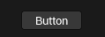

- `SCheckBox`：체크박스


- `SComboBox<OptionType>`：自定义元素的 콤보박스，菜单项的 컨트롤生成器를提供해야 합니다


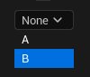

- `STextComboBox` ：텍스트 콤보박스


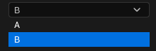

- `SComboButton`：콤보 버튼，ComboBox와不同的是，ComboButton은完整菜单的生成器를提供해야 하며，菜单项生成器가 아닙니다

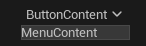

- `SInputKeySelector`：키 입력 선택기


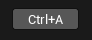

- `SNumericDropDown<NumType>`：숫자 드롭다운 컨트롤


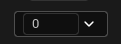

- `SNumericEntryBox<NumType>`：숫자 선택 박스


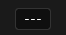

- `SRotatorInputBox = SNumericRotatorInputBox<float>`：회전 입력 박스


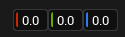

- `SSlider`：슬라이더


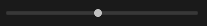

- `SSpinBox<NumericType>`：自定义数字类型的 스피너 박스


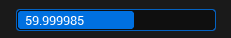

- `SVectorInputBox = SNumericVectorInputBox<float, UE::Math::TVector<float>, 3>`：벡터 입력 박스


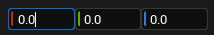

- `SVolumeControl`：볼륨 조절 컨트롤


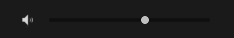

##### 文本

- `STextBlock`：텍스트 표시 블록


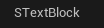

- `SRichTextBlock`：리치 텍스트 표시 블록

- `SEditableText`：편집 가능한 텍스트


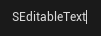

- `SInlineEditableTextBlock`：단행 텍스트 편집 블록（편집 시에만 테두리가 표시됨）


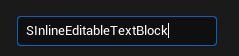

- `SEditableTextBox`：편집 가능한 텍스트 박스


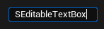

- `SSuggestionTextBox`：지능형 제안 및 입력 기록이 있는 텍스트 박스


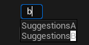

- `SSearchBox`：검색 박스


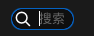

- `SMultiLineEditableText`：다행 텍스트 편집 블록


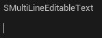

- `SMultiLineEditableTextBox`：다행 편집 가능한 텍스트 박스


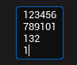

- `SHyperlink`：하이퍼링크


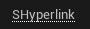

##### 颜色

- `SColorBlock`：단일 색상의 표시 컨트롤


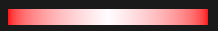

- `SSimpleGradient`：간단한 그라디언트 색상의 표시 컨트롤，시작 색상과 종료 색상만 설정할 수 있습니다


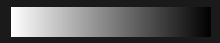

- `SComplexGradient`：복잡한 그라디언트 색상의 표시 컨트롤，任意 색상数量로组成的 그라디언트 색상을支持합니다


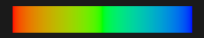

- `SColorPicker`：단일 색상调节的整合 컨트롤（모듈 **AppFramework**를引入해야 함）


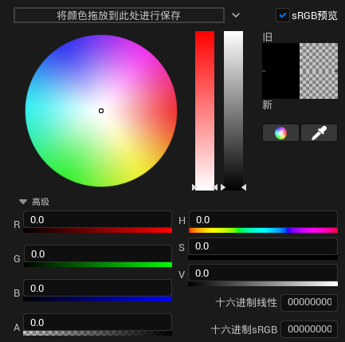

##### 图像

- `SImage`：이미지를 표시하는 데 사용합니다


##### 导航	

- `SBreadcrumbTrail`


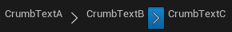

##### 通知

- `SErrorHint`：에러 아이콘，ToolTip을设置할 수 있습니다


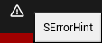

- `SErrorText`：빨간색 배경의 텍스트 블록


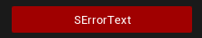

- `FNotificationInfo`：컨트롤이 아닌，메시지通知에使用합니다


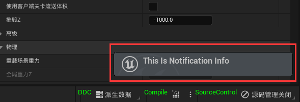

```c++
FNotificationInfo NotificationInfo(FText::FromString("FNotificationInfo"));
NotificationInfo.Text = FText::FromString("This Is Notification Info");
NotificationInfo.bFireAndForget = true;
NotificationInfo.ExpireDuration = 100.0f; 
NotificationInfo.bUseThrobber = true;
FSlateNotificationManager::Get().AddNotification(NotificationInfo);
```

- `SProgressBar`：진행률 바


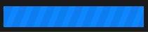

- `SHeader`：제목 컨트롤


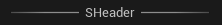

  - `SScrollBar`：스크롤 바


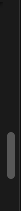

  - `SSpacer`：空白 컨트롤，一般적으로 레이아웃中填充하는 데使用합니다

#### 控件容器（SPanel）

##### 布局与尺寸

- `SVerticalBox`：수직 레이아웃

- `SHorizontalBox`：수평 레이아웃

- `SOverlay`：오버랩 레이아웃

- `SGridPanel`：그리드 레이아웃


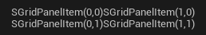

- `SUniformGridPanel`：统一 그리드大小를使用하는 그리드 레이아웃 패널。

- `SWrapBox`：플로우 레이아웃，排列方向을设置할 수 있으며，컨트롤이尺寸을超出时换行합니다。


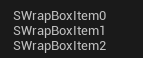

- `SUniformWrapPanel`：统一大小를使用하는 플로우 레이아웃

- `SCanvas`：任意坐标和大小를使用하여 Child를放置할 수 있습니다

- `SConstraintCanvas` :정적

- `SSplitter`：드래그分割线을 통해 Widget间分割的大小를调整할 수 있습니다


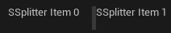

- `SScrollBox`：Content에 스크롤 바를添加합니다

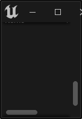

- `SWidgetSwitcher`：Widget切换 컨트롤，Widget을全部 Slot에添加하고，Slot Index를设置하여对应的 Widget을切换显示합니다


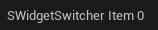

- `SDPIScaler`：DPI缩放을调整하는 데使用합니다

- `SBox`：Content의固定尺寸、最小尺寸或者最大尺寸를控制합니다


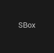

- `SScaleBox`：Content의尺寸를统一缩放합니다


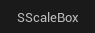

##### 视图

- `SListView`：리스트 뷰


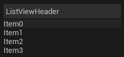

- `STileView`：타일 뷰


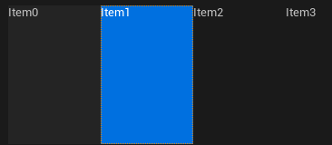

- `STreeView`：트리 뷰


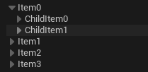

##### 停靠窗口

- `SDockTab`


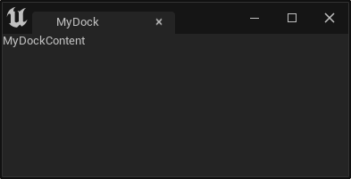

```C++
const TSharedRef<SDockTab> MajorTab = SNew(SDockTab).TabRole(ETabRole::MajorTab);
TabManager = FGlobalTabmanager::Get()->NewTabManager(MajorTab);

TabManager->RegisterTabSpawner(FName("MyDockTab"), FOnSpawnTab::CreateLambda([](const FSpawnTabArgs& Args) {
    TSharedRef<SDockTab> Tab = SNew(SDockTab).Content()[SNew(STextBlock).Text(FText::FromString("MyDockContent"))];
    return Tab;
})).SetDisplayName(FText::FromString("MyDock"))
    .SetMenuType(ETabSpawnerMenuType::Hidden);
TabManager->TryInvokeTab(FName("MyDockTab"));
```

##### 其他

- `SBackgroundBlur`：Content의背景을模糊 처리합니다


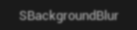

- `SBorder`：Content에 테두리를添加합니다


- `STooltipPresenter`：Content에 ToolTip을添加합니다

- `SExpandableArea`：Content를展开或收纳할 수 있도록 허용합니다


- `SFxWidget`
- `SMenuAnchor`：영역에 컨텍스트 메뉴를增加합니다

### 代码参考

UE는 **컨트롤 리플렉터**를提供하여对应 UI의创建代码를快速定位할 수 있으며，其启动点은编辑器主面板의`顶部菜单栏` - `工具` - `调试` - `控件反射器`에位于합니다:


另外，官方的引擎源码中也提供了一个 **SlateViewer** 工程展示了大部分 Slate 컨트롤的基本使用:


IDE的 **代码搜索工具**를借助하여引擎中对应 컨트롤的参数示例를找到할 수 있으며，`Visual Studio`中에서는`解决方案资源管理器`中에서`类的派生关系`를查看하여所有 컨트롤을概览할 수 있습니다:


## 高级定制

上述技能能满足 UI开发的绝대多数需求，但一些复杂的交互机制和渲染逻辑을涉及해야 할 때，自定义 SLeafWidget이 필요합니다

这里有一个很好的示例， 可拖拽移动的 컨트롤을实现했습니다:


代码如下:

``` c++
#pragma once
#include "Styling/StyleColors.h"
#include "Brushes/SlateColorBrush.h"

class SCustomSlateWidget :public SLeafWidget {
	SLATE_DECLARE_WIDGET(SCustomSlateWidget, SLeafWidget)	//매크로 SLATE_DECLARE_WIDGET을使用하여 Slate 컨트롤声明
public:
	SLATE_BEGIN_ARGS(SCustomSlateWidget) {}
	SLATE_END_ARGS()
	void Construct(const SCustomSlateWidget::FArguments InArgs) {
		SetCursor(EMouseCursor::GrabHand);					//컨트롤 영역에 마우스进入 시 스타일设置
	}
protected:
	FReply OnMouseButtonDown(const FGeometry& MyGeometry, const FPointerEvent& MouseEvent) override {
		if (MouseEvent.IsMouseButtonDown(EKeys::LeftMouseButton)) {
			LastMouseDownPosition = MyGeometry.AbsoluteToLocal(MouseEvent.GetScreenSpacePosition());//마우스 위치를 화면 공간에서 컨트롤의 로컬 공간으로转换
			return FReply::Handled().CaptureMouse(SharedThis(this));								//전역 마우스移动을 고频率捕获开始
		}
		return FReply::Handled();
	}
	FReply OnMouseMove(const FGeometry& MyGeometry, const FPointerEvent& MouseEvent) override{
		if (MouseEvent.IsMouseButtonDown(EKeys::LeftMouseButton)) {
			auto Window = FSlateApplication::Get().FindWidgetWindow(SharedThis(this));					//该 컨트롤의 창获取
			auto CurrentMousePosition = MyGeometry.AbsoluteToLocal(MouseEvent.GetScreenSpacePosition());
			auto CurrWindowPosition = Window->GetPositionInScreen();
			auto TargetPosition = CurrentMousePosition + CurrWindowPosition - LastMouseDownPosition;	//位置移动计算
			Window->MoveWindowTo(TargetPosition);
		}
		return FReply::Handled();
	}
	FReply OnMouseButtonUp(const FGeometry& MyGeometry, const FPointerEvent& MouseEvent) override {
		LastMouseDownPosition = FVector2D::ZeroVector;
		return FReply::Handled().ReleaseMouseCapture();											//	마우스捕获释放
	}
	int32 OnPaint(const FPaintArgs& Args, const FGeometry& AllottedGeometry, const FSlateRect& MyCullingRect, FSlateWindowElementList& OutDrawElements, int32 LayerId, const FWidgetStyle& InWidgetStyle, bool bParentEnabled) const override {
		static FSlateFontInfo FontInfo = FCoreStyle::GetDefaultFontStyle("Bold",30);
		static const FSlateBrush* Bursh = FAppStyle::GetBrush("WhiteBrush");
		FLinearColor BackgroundColor = IsHovered()? FLinearColor(0.6f, 0.5f, 0.9f) : FLinearColor(0.1f, 0.5f, 0.9f);
		FSlateDrawElement::MakeBox(OutDrawElements, LayerId, AllottedGeometry.ToPaintGeometry(), Bursh, ESlateDrawEffect::None, BackgroundColor);		//背景绘制
		FSlateDrawElement::MakeText(OutDrawElements, LayerId, AllottedGeometry.ToPaintGeometry(), FText::FromString("Hello Slate"), FontInfo);			//文字绘制
		return LayerId;
	}
	FVector2D ComputeDesiredSize(float LayoutScaleMultiplier) const override {
		return FVector2D::ZeroVector;															// 零向量使用 시 부모 컨트롤의内容를填充
	}
private:
	FVector2D LastMouseDownPosition = FVector2D::ZeroVector;
};

// 下方代码는 cpp中에放置해야 합니다
SLATE_IMPLEMENT_WIDGET(SCustomSlateWidget)							// 매크로 SLATE_IMPLEMENT_WIDGET을使用하여代码实现生成
void SCustomSlateWidget::PrivateRegisterAttributes(FSlateAttributeInitializer& AttributeInitializer) 	//此函数를必须实现합니다
{
}
```

``` c++
FSlateApplication::Get().AddWindow(
    SNew(SWindow)
    .ClientSize(FVector2D(200,200))					//창尺寸를 200*200으로设置
    .SizingRule(ESizingRule::FixedSize)				//창尺寸固定
    .SupportsMaximize(false)						//최대화关闭
    .SupportsMinimize(false)						//최소화关闭
    .CreateTitleBar(false)							//제목栏不创建
    .AutoCenter(EAutoCenter::PreferredWorkArea)		//居中显示
    .IsTopmostWindow(true)							//최상위
    [
        SNew(SCustomSlateWidget)
    ]
);
```

自定义 **SLeafWidget** 的工作流程는:

-   매크로 **SLATE_DECLARE_WIDGET(WidgetType, ParentType)** 를使用하여 컨트롤声明
-   매크로 **SLATE_IMPLEMENT_WIDGET(WidgetType)** 를 cpp中에서使用하여代码实现定义，并函数实现:
    -   `void WidgetType::PrivateRegisterAttributes(FSlateAttributeInitializer& AttributeInitializer)`
-   컨트롤尺寸计算的函数覆写:
    -   `virtual FVector2D SWidget::ComputeDesiredSize(float LayoutScaleMultiplier) const = 0`
-   各类交互事件覆写。
-    컨트롤的属性状态机调整
-   属性状态机依据，`绘制函数（OnPaint）`中에서绘制元素添加

### 交互事件

SWidget은非常多的交互事件（On으로开头的虚函数）를提供하여开发者가覆写할 수 있도록 합니다:

- `OnFocusReceived`：포커스获得
- `OnFocusLost`：포커스失去
- `OnFocusChanging`：포커스发生变化
- `OnKeyChar`：키보드输入时
- `OnKeyDown`：키보드按键按下
- `OnKeyUp`：키보드按键抬起
- `OnMouseButtonDown`：마우스按键按下
- `OnMouseButtonUp`：마우스按键抬起
- `OnMouseMove`：마우스移动
- `OnMouseEnter`：마우스进入到 Widget区域的瞬间
- `OnMouseLeave`：마우스离开到 Widget区域的瞬间
- `OnMouseButtonDoubleClick`：마우스双击
- `OnMouseWheel`：마우스滚轮滚动
- `OnDragEnter`：东西를拖拽하여 Widget区域에进入的瞬间
- `OnDragLeave`：东西를拖拽하여 Widget区域에离开的瞬间
- `OnDragOver`：东西를拖拽하여 Widget区域에覆盖的时候
- `OnDrop`：Widget上에拖拽的东西释放
- ...

>   详细说明은，SWidget的定义을请看하세요，上面에各个事件的说明及触发时机가 있으며，用法에 대한 것은 UE源码中에서相应的用例를搜索할 수 있습니다.

使用说明:

- 这些事件는 **FSlateApplication** 이负责调用하며，其函数参数는一般적으로该事件携带的所有信息를包含하며，我们只需其覆盖（override）하여事件数据에根据自己的逻辑을做即可。

- 事件的返回类型은 **FReply** 이며，事件的后续处理를定义하는 데使用하며，其构造函数는私有的，必须如下静态函数를使用하여实例创建:

    -  `FReplay::Handled()`：该事件已被处理되었음을说明하며，事件는下一级로继续传递되지 않습니다.
    -  `FReplay::Unhandled()`：该 컨트롤은该事件를处理하지 않음을说明하며，事件는下一级로继续传递됩니다.

    **FReply** 는事件结束时一些处理를做하기 위한一系列操作을提供합니다:


### 绘制事件

SWidget의实际绘制函数는`Paint`이지만，绘制过程中一些固定步骤가存在하므로，Slate는绘制事件`OnPaint`을公开하여我们가自定义绘制逻辑을 할 수 있도록 하며，其定义은如下:

``` c++
virtual int32 OnPaint(const FPaintArgs& Args, 
                      const FGeometry& AllottedGeometry,
                      const FSlateRect& MyCullingRect, 
                      FSlateWindowElementList& OutDrawElements, 
                      int32 LayerId,
                      const FWidgetStyle& InWidgetStyle,
                      bool bParentEnabled) const = 0;
```

参数说明:

- `const FPaintArgs&` Args：绘制事件的参数，绘制的当前时间、间隔、父窗口...을得到할 수 있습니다
- `const FGeometry& ` AllottedGeometry：该 SWidget에分配된几何大小（父窗口에相对于）
- `  const FSlateRect&` MyCullingRect：该 SWidget的裁剪举行，绘制中该矩形에根据绘制元素를丢弃할 수 있습니다
- `FSlateWindowElementList&` OutDrawElements：这是整个 SWindow的绘制元素列表，我们绘制는该对象를修改하는 것입니다.
- `int32` LayerId：绘制的 LayerID，一般적으로 UI分层에使用하여同层级的绘制元素에统一处理를做하기方便합니다.
- `const FWidgetStyle&` InWidgetStyle：父窗口에서传递过来的 Style
- `bool` bParentEnabled：父窗口是否处于开启状态。

`OnPaint`函数中에서，我们는主要 **FSlateDrawElement** 中很多`Make`로命名이开头的静态函数를通过하여绘制元素를创建하며，其中有:

``` c++
static void MakeBox( //盒子绘制，Brush设置을通过하여，颜色块也可以，图片也可以
	FSlateWindowElementList& ElementList,
	uint32 InLayer,
	const FPaintGeometry& PaintGeometry,
	const FSlateBrush* InBrush,
	ESlateDrawEffect InDrawEffects = ESlateDrawEffect::None,
	const FLinearColor& InTint = FLinearColor::White );

static void MakeRotatedBox(...);		//旋转이 있는盒子绘制
static void MakeGradient(...);			//渐变的盒子绘制
static void MakeText(...);				//文本绘制
static void MakeShapedText(...);		//形状文本绘制
static void MakeLines(...);				//线条绘制
static void MakeSpline(...)				//曲线绘制
static void MakeDrawSpaceSpline(...);	 //绘制空间中曲线绘制
static void MakeCubicBezierSpline(...);  //三阶贝塞尔曲线绘制
static void MakeViewport(...)			//FSlateViewport绘制
static void MakeCustom(...);	 		//自定义元素绘制，元素的 Render函数를自行实现可
static void MakeCustomVerts(...);		//顶点에根据绘制
static void MakePostProcessPass(...);	//后期滤镜（模糊）绘制
```

这些函数는 UE中非常多的使用가 있으며，相关代码를搜索하여参考할 수 있습니다.

>   详见：`Runtime\SlateCore\Public\Rendering\DrawElements.h`

#### FSlateBrush

**FSlateBrush** 는填充区域를控制하는 데使用하며，界面中较高的使用频率가 있으므로，Slate는也一些它的便捷扩展를提供합니다:


- **FSlateBorderBrush** ：테두리填充
- **FSlateBoxBrush** ：盒子 브러시
- **FSlateRoundedBoxBrush** ：圆角矩形 브러시
- **FSlateColorBrush** ：颜色 브러시
- **FSlateImageBrush** ：图片
    - **FSlateVectorImageBrush** ：벡터图
- **FSlateDynamicImageBrush** ：图片를动态切换할 수 있는 브러시
- **FSlateNoResource** ：任何资源도不带有的 브러시

> 上面的一些 브러시本质上都是一些特定的参数를通过하여 **FSlateBrush** 를构造하는 것이며，上述 브러시가组合이需要的情况가出现하면，它们的构造参数를根据自行组合할 수 있습니다.

UE中에서는一些内置的 **FSlateBrush** 를提供하며，源码中에서`::Get().GetBrush`를搜索하여相关使用를查找할 수 있습니다:


##### 示例

假如整个 SWidget을红色로填充하고 싶다면，这样的代码를使用할 수 있습니다:

```c++
int32 SCustomSlateWidget::OnPaint(const FPaintArgs& Args,
                                  const FGeometry& AllottedGeometry,
                                  const FSlateRect& MyCullingRect,
                                  FSlateWindowElementList& OutDrawElements,
                                  int32 LayerId,
                                  const FWidgetStyle& InWidgetStyle,
                                  bool bParentEnabled) const {
    static FSlateColorBrush ColorBrush(FColor(255,0,0));
	FSlateDrawElement::MakeBox(OutDrawElements,
                               LayerId, 
                               AllottedGeometry.ToPaintGeometry(),
                               &ColorBrush,
                               ESlateDrawEffect::None, 
                               ColorBrush.TintColor.GetColor(InWidgetStyle));
	return LayerId;
}
```

#### ESlateDrawEffect

**ESlateDrawEffect** 는 Slate에一些效果를提供하며，它는以下值일 수 있습니다:

``` c++
enum class ESlateDrawEffect : uint8
{
	None					= 0,			//无效果
	NoBlending			= 1 << 0,			//无混合
	PreMultipliedAlpha	= 1 << 1,			//预乘 Alpha
	NoGamma				= 1 << 2,			//Gamma矫正不进行
	InvertAlpha			= 1 << 3,			//透明度反转
	// ^^ These Match ESlateBatchDrawFlag ^^

	NoPixelSnapping		= 1 << 4,			//像素对齐关闭
	DisabledEffect		= 1 << 5,			//禁用状态的效果
	IgnoreTextureAlpha	= 1 << 6,			//纹理中的透明度忽略
	ReverseGamma			= 1 << 7		//Gamma逆转
};
```

#### FSlateFontInfo

**FSlateFontInfo** 는字体信息를指定하는 데使用하며，UE里的字体资产에对应， 它的部分定义은如下:

``` c++
struct SLATECORE_API FSlateFontInfo
{
	/**The font object (valid when used from UMG or a Slate widget style asset) */
	TObjectPtr<const UObject> FontObject;

	/**The material to use when rendering this font */
	TObjectPtr<UObject> FontMaterial;

	/**Settings for applying an outline to a font */
	FFontOutlineSettings OutlineSettings;

	/**The composite font data to use (valid when used with a Slate style set in C++) */
	TSharedPtr<const FCompositeFont> CompositeFont;

	/**The name of the font to use from the default typeface (None will use the first entry) */
	FName TypefaceFontName;

	/**
	 * The font size is a measure in point values. The conversion of points to Slate Units is done at 96 dpi.  So if 
	 * you're using a tool like Photoshop to prototype layouts and UI mock ups, be sure to change the default dpi 
	 * measurements from 72 dpi to 96 dpi.
	 */
	int32 Size;

	/**The uniform spacing (or tracking) between all characters in the text. */
	int32 LetterSpacing = 0;

	/**The font fallback level. Runtime only, don't set on shared FSlateFontInfo, as it may change the font elsewhere (make a copy). */
	EFontFallback FontFallback;
};
```

UE中에서는专门的字体编辑器를提供하며，C++中에서直接它를构造하는 것은比较麻烦하지만，UE也一些内置的 **FSlateFontInfo** 를提供하며，比如:

- `FCoreStyle::Get().GetFontStyle("NormalFont")`
- `FCoreStyle::Get().GetFontStyle("SmallFont")`
- `FCoreStyle::GetDefaultFontStyle("Regular",FontSize);`
- `FCoreStyle::GetDefaultFontStyle("Bold",FontSize)`
- `FCoreStyle::GetDefaultFontStyle("Italic",FontSize);`
- `FCoreStyle::GetDefaultFontStyle("Mono",FontSize);`

##### FontMeasure

大多数 GUI框架都 **字体测量（FontMeasure）** 的概念가 있습니다:特定字体格式의某个文本의绘制宽度和高度를测量。

UE中에서는，如下方式를通过하여测量할 수 있습니다（伪代码）:

``` c++
FSlateApplication::Get().GetRenderer()->GetFontMeasureService()->Measure(
    const FText& Text,						//文本
    const FSlateFontInfo& InFontInfo,		//字体
    float FontScale							//字体缩放
) -> FVector2D								//宽度（X）和高度（Y）返回
```

### 性能优化

Slate는 UI의`Paint`和`Tick`性能을优化하기 위해，一个 **SInvalidationPanel** 컨트롤을提供하며，该 컨트롤은子 컨트롤中消耗较高的操作을缓存할 수 있도록 하며，一些特定操作으로导致 **缓存失效（Invalidate）** 될 때만，重新执行을 합니다.

详见：[理解虚幻引擎Slate 架构 - 轮询数据流和委托 | 虚幻引擎5.2文档 ](https://docs.unrealengine.com/5.2/zh-CN/understanding-the-slate-ui-architecture-in-unreal-engine/#轮询数据流和委托)

我们는手动으로子 컨트롤의`Invalidate()`函数를调用하여缓存失效를让할 수 있습니다:

``` c++
void SWidget::Invalidate(EInvalidateWidgetReason InvalidateReason);
```

**EInvalidateWidgetReason** 的值는以下일 수 있습니다:

``` c++
enum class EInvalidateWidgetReason : uint8
{
	None = 0,
	Layout = 1 << 0,		//Widget所需的大小를更改해야 하는 경우，布局를无效化하세요。这是一个昂贵的无效操作이므로，만약你가只一个小部件를重新绘制해야 하는 경우，它를使用하지 마세요
	Paint = 1 << 1,				//绘制无效化
	Volatility = 1 << 2,		//Volatility变动时触发
	ChildOrder = 1 << 3,		//自 컨트롤添加或移除时触发，无效化하면 Child的顺序를重建
	RenderTransform = 1 << 4,	//RenderTransform变动时触发
	Visibility = 1 << 5,		//가시性变动时触发
	AttributeRegistration = 1 << 6,		//属性绑定時触发
	Prepass = 1 << 7,					//Prepass无效化

	/**
	 * 만약你가绘制或大小와 관련된 일반 속성을更改하는 경우，Paint无效化를使用하세요.
	 * 또한 만약更改된 속성이 Volatility에 어떤 영향을 미치는 경우，Volatility를无效化하여它를重新计算하고缓存할 수 있도록 하는 것이重要합니다.
	 */
	PaintAndVolatility = Paint | Volatility,
	/**
	 * 만약你가绘制或大小와 관련된 일반 속성을更改하는 경우，Layout无效化를使用하세요.
	 * 또한 만약更改된 속성이 Volatility에 어떤 영향을 미치는 경우，Volatility를无效化하여它를重新计算하고缓存할 수 있도록 하는 것이重要합니다.
	 */
	LayoutAndVolatility = Layout | Volatility,
};
```

Slate는 **属性（SlateAttribue）** 기반의方式를提供합니다:属性的变动과缓存的重建을挂钩

具体的做法는:

-   **TSlateAttribute** 를使用하여属性包裹（**TAttribute** 的用途와不同）， **TSlateAttribute** 包裹的属性는构造初始化时参数`(*this)`를传递해야 합니다

-   `void WidgetType::PrivateRegisterAttributes(...)`函数中에서，宏 **SLATE_ADD_MEMBER_ATTRIBUTE_DEFINITION(_Initializer, _Property, _Reason)** 를使用하여属性注册

这里有一个简短的示例:

``` c++
class SCustomSlateWidget :public SLeafWidget {
	SLATE_DECLARE_WIDGET(SCustomSlateWidget, SLeafWidget)
public:
	SLATE_BEGIN_ARGS(SCustomSlateWidget){}
	SLATE_END_ARGS()
	void Construct(const SCustomSlateWidget::FArguments InArgs){			
	}
protected:
	SCustomSlateWidget()
		: ClickedCounter(*this) {	//SlateAttribute初始化
	}
	FReply OnMouseButtonDown(const FGeometry& MyGeometry, const FPointerEvent& MouseEvent) override {
		ClickedCounter.Set(*this, ClickedCounter.Get() + 1);		//计数器+1，这里는 마우스按下를点击로当做
		return FReply::Handled();
	}
	int32 OnPaint(const FPaintArgs& Args, const FGeometry& AllottedGeometry, const FSlateRect& MyCullingRect, FSlateWindowElementList& OutDrawElements, int32 LayerId, const FWidgetStyle& InWidgetStyle, bool bParentEnabled) const override {
		static FSlateFontInfo FontInfo = FCoreStyle::GetDefaultFontStyle("Bold",30);
		FSlateDrawElement::MakeText(OutDrawElements, LayerId, AllottedGeometry.ToPaintGeometry(), FText::FromString(FString::FromInt(ClickedCounter.Get())), FontInfo);					//当前 마우스点击的次数绘制
		return LayerId;
	}
	FVector2D ComputeDesiredSize(float LayoutScaleMultiplier) const override {
		return FVector2D::ZeroVector;															
	}
private:
	TSlateAttribute<int> ClickedCounter;	 	//마우스点击次数를记录的计数器
};
```

``` c++
SLATE_IMPLEMENT_WIDGET(SCustomSlateWidget)
void SCustomSlateWidget::PrivateRegisterAttributes(FSlateAttributeInitializer& AttributeInitializer) {
    //ClickedCounter的值变动과重绘事件挂钩
	//SLATE_ADD_MEMBER_ATTRIBUTE_DEFINITION(AttributeInitializer, ClickedCounter, EInvalidateWidgetReason::Paint);
}
```

``` c++
FSlateApplication::Get().AddWindow(
    SNew(SWindow)
    .SupportsMaximize(false)
    .SupportsMinimize(false)
    .IsTopmostWindow(true)
    .ClientSize(FVector2D(200,200))
    .SizingRule(ESizingRule::FixedSize)
    .CreateTitleBar(false)
    .AutoCenter(EAutoCenter::PreferredWorkArea)
    [
        SNew(SInvalidationPanel)			// SInvalidationPanel로 감싸기
        [
            SNew(SCustomSlateWidget)
        ]
    ]
);
```

이 코드는 클릭 가능한 사각형을 생성합니다:


사각형을 클릭하면 `ClickedCounter`가 1 증가하지만 화면에 변화가 없습니다. `PrivateRegisterAttributes`에서 주석 처리된 코드를 해제하면:

``` c++
void SCustomSlateWidget::PrivateRegisterAttributes(FSlateAttributeInitializer& AttributeInitializer) {
    // ClickedCounter 값 변경을 다시 그리기 이벤트와 연결
	SLATE_ADD_MEMBER_ATTRIBUTE_DEFINITION(AttributeInitializer, ClickedCounter, EInvalidateWidgetReason::Paint);
}
```

프로그램을 다시 시작하면 `ClickedCounter`가 변경될 때 UI가 다시 그려지는 것을 확인할 수 있습니다:


## Slate에서 UMG로

UE의 로직 프로그래밍은 UObject 위에 구축되어 있지만, Slate는 극한의 성능을追求하기 위해 UObject와 같은 무거운 메커니즘을 사용하여 UI 객체를 관리하지 않습니다.

Slate에서는 **공유 포인터(Shared Pointer)** 방식을 사용하여 UI 객체의 수명 주기를 관리합니다.

게임 개발자의 UI 개발 효율을 높이기 위해 UE는 UObject를 사용하여 Slate 컨트롤을 한 층 감싸고, 리플렉션을 통해 Slate 컨트롤의 일부 속성과 함수를 노출시켰으며, 시각화된 UI 디자인을 지원합니다. 이 층의 인터페이스가 바로 우리가 잘 알고 있는 **UMG**입니다.

**UMG**에 대한 자세한 내용은 공식 문서에서 확인할 수 있습니다:

-   https://docs.unrealengine.com/5.2/zh-CN/umg-ui-designer-for-unreal-engine/

다음은 Slate와 UMG의 관계를 잘 보여주는 간단한 코드입니다:

``` c++
#pragma once

#include "UObject/ObjectMacros.h"
#include "Widgets/Text/STextBlock.h"
#include "Components/Widget.h"
#include "CustomUWidget.generated.h"

UCLASS(meta = (DisplayName = "CustomWidget"))					// DisplayName은 컨트롤 이름
class UMGEXTENDUTILITIES_API UCustomWidget : public UWidget
{
	GENERATED_BODY()
protected:
	virtual TSharedRef<SWidget> RebuildWidget() override {						// 컨트롤을 재구축하고 멤버 변수에 할당
		return SAssignNew(MyTextBlock,STextBlock);
	}
	virtual void SynchronizeProperties() override {								// UObject의 속성을 Slate 컨트롤에 동기화
		MyTextBlock->SetText(Text);
		Super::SynchronizeProperties();
	}
	virtual void ReleaseSlateResources(bool bReleaseChildren) override {		// Slate 리소스 해제
		MyTextBlock.Reset();
	}

#if WITH_EDITOR
	virtual const FText GetPaletteCategory() override {							// 에디터의 컨트롤 분류
		return FText::FromString("CustomCategory");
	}
#endif

public:
	UFUNCTION(BlueprintCallable)		// 함수를 블루프린트에 공개
	FText GetText() const {
		return Text;
	}
	UFUNCTION(BlueprintCallable)
	void SetText(FText InText) {
		Text = InText;
		if (MyTextBlock) {				// 컨트롤이 이미 생성된 경우 직접 값을 컨트롤에 설정
			MyTextBlock->SetText(Text);
		}
	}
protected:
	UPROPERTY(EditAnywhere, BlueprintGetter = "GetText", BlueprintSetter = "SetText")
	FText Text;							// 속성을 에디터에 공개

	TSharedPtr<STextBlock> MyTextBlock;	// 실제 Slate 컨트롤
};
```


C++에서 UMG를 사용하는 방법은 다음과 같습니다:

``` c++
UWidget* UMGWidget = LoadObject<UWidget>(nullptr, TEXT("{AssetPath}"));    			   // 에셋에서 로드하거나 NewObject로 생성 가능
TSharedPtr<SWidget> SlateWidget = UMGWidget->TakeWidget();                             // 새 SWidget을 생성
TSharedPtr<SWidget> CachedSlateWidget = UMGWidget->GetCachedWidget();                  // 이전에 생성된 SWidget 가져오기
// 이후 Slate 사용 방식과 동일하게 사용
```

### 수명 주기 관리

**UWidget**은 **UObject**의 가비지 컬렉션을 따르며, **SWidget**의 공유 포인터를 보유합니다. 컨트롤이 표시되는 동안(`TSharedPtr<SWidget>`이 여전히 존재할 때) **UWidget**이 가비지 컬렉션되지 않도록 하기 위해 UMG는 **FGCObject**를 상속하는 **SObjectWidget**을 사용하여 **UWidget**에 참조를 추가합니다.


위의 예제 코드로 돌아가면 `UWidget::TakeWidget()`을 호출하여 얻는 것은 `UWidget::RebuildWidget()`에서 생성된 컨트롤이 아니라, 이를 다시 **SObjectWidget**으로 감싼 것임을 알 수 있습니다. 생성 과정에서의 계층 관계는 다음과 같습니다:


소멸 시의 해제 순서는 다음과 같습니다:


-   **SObjectWidget**은 **FGCObject**를 상속하며, UWidget에 대한 참조를 추가하여 **SObjectWidget**이 존재하는 동안 **UWidget**이 GC되지 않도록 보장합니다.
-   컨트롤 소멸이 시작되면 **SObjectWidget**의 참조 카운트가 0이 되어 소멸되며, 이때 UWidget에 대한 참조가 해제됩니다.
-   **UWidget**의 참조가 0이 되면 다음 가비지 컬렉션 시에 해제되며, 이때 비로소 보유하고 있던 **SWidget** 공유 포인터가 해제됩니다.