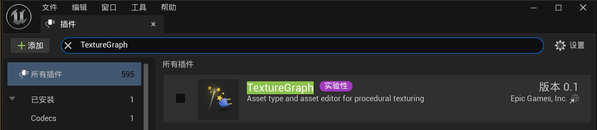
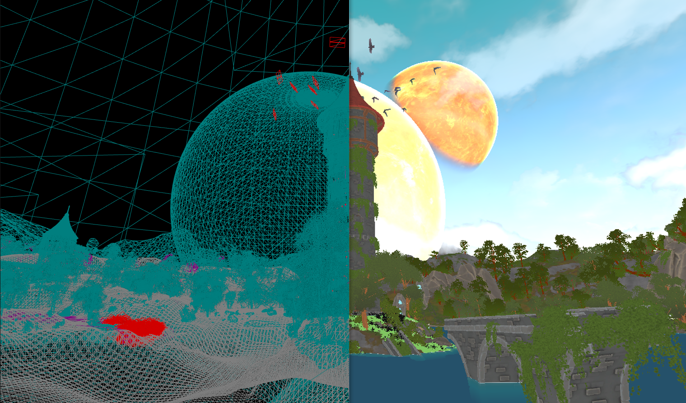
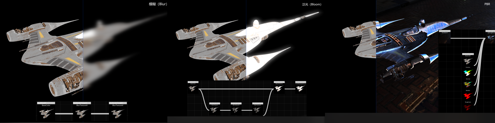
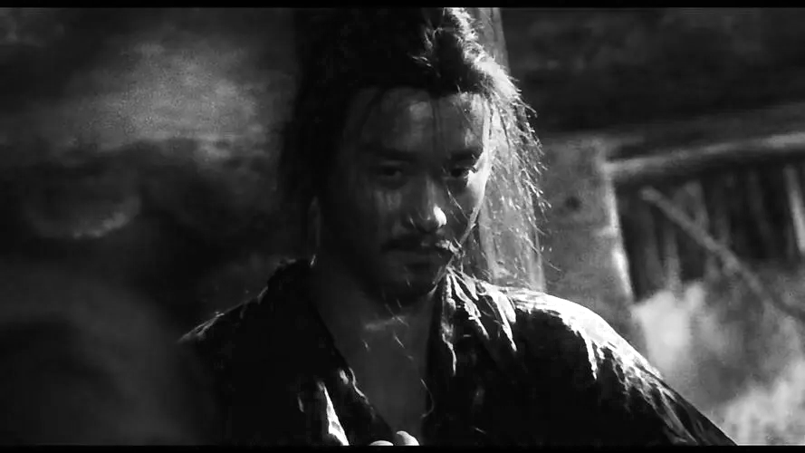
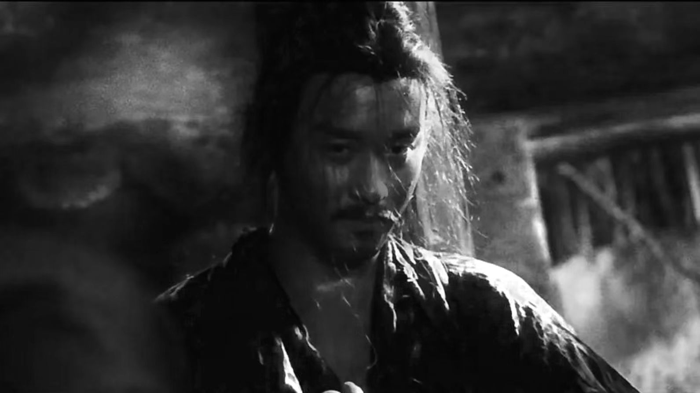

# Unreal Engine 5 개발 - Texture Graph

**Texture Graph**는 UE 5.4에서 출시된 실험적 플러그인으로, 주로程序化 텍스처 생성에 사용됩니다.



Texture Graph의 사용법과 소개에 대한 완성도 높은 자료는 다음과 같습니다:

- [[중문 라이브] 제51기 | UE5.4 신기능 TextureGraph | 주창성（천지천）](https://www.bilibili.com/video/BV1As421M7Bj/)
- [UE5.4 텍스처 그래프 입문 CG世界](https://m.163.com/dy/article/J56TPVL50516BJGJ.html)
- [UE5.4 신기능 - Texture Graph上手简介 | CSDN | 전자구름과 장거리 얽힘](https://blog.csdn.net/grayrail/article/details/140191905)
- [UE5.4TextureGraph | GALAXIX动漫大陆](https://www.bilibili.com/video/BV1FM4m1o7LE)

많은 분들이 플러그인 소개를 보고 '조금 유용해 보이지만 내게는 별 관련 없어 보인다'고 느낄 수 있지만, 실제로는 매우 강력한 플러그인입니다!

## 개요

그래픽 개발자라면 많은 **그래픽 렌더링 파이프라인（Graphics Rendering Pipeline）**을 사용하여 기하图形 **（Primitive）**을 **렌더 타겟（Render Target）**（텍스처, 이미지로 이해할 수 있음）에 그리는 과정을 알 것입니다. 이 과정을 일반적으로 **Base Pass**（또는 **Mesh Pass**, **Primitives Pass**）라고 합니다:



최종적으로 관객에게呈现되는 화면은 Base Pass에서 출력된 이미지를 기반으로 전역 조명, 후처리 등 추가 효과를 적용하는 경우가 많습니다:


이러한 효과는 일반적으로 여러 Render Pass를 사용하여 생성합니다. Render Pass는 일부 텍스를 입력으로 필요로 하여 최종적으로 일부 RT를 생성하며, 생성된 RT는 또 다른 Render Pass의 텍스처 입력으로 사용될 수 있습니다. 이러한 Render Pass를 노드로 간주하고 입력 출력을 선으로 연결하면 최종적으로 그래프 구조를 얻게 됩니다:



우리는 이를 일반적으로 **Render Graph / Frame Graph**라고 부릅니다.

우리가 사용하는 Texture Graph도 유사한流程를 따르지만, Render Graph는 게임 화면 한 프레임을 그리는 데 사용되는 반면, Texture Graph는 **일반적으로** **에디터 단계에서 텍스처 에셋을 생성**하는 데 사용됩니다.

## 용途

Texture Graph는 본질적으로程序化 텍스처를 만드는 도구이지만, 실제 기능 집합은 성숙한程序化 텍스처 도구（예: [Substance Designer](https://www.adobe.com/hk_en/products/substance3d/apps/designer.html)）보다 훨씬 부족합니다. 이는程序化 텍스처에 깊이 이해하지 못하고 PS를熟练하게 사용할 수 없지만 코드를 작성할 수 있고一定的 이미지 처리 지식 기반을 갖춘 저와 같은 사람에게 적합합니다.

저는 다음과 같은 일에 Texture Graph를 사용합니다:

1. 노드를 드래그하여 간단한 이미지 처리를 위한 로직을 빠르게 작성합니다. 개발자에게는 입력 출력이 명확할 때 코드를编写하는 것이 에디터를操作하는 것보다 더 직관적이고 효율적입니다.
2. 재사용 가능한 텍스처 생성 파이프라인을 구축하는 것, 즉 템플릿화입니다.大量의 소스（입력）텍스처가存在하거나 소스 텍스처가 시간 주기에 따라频繁하게迭代되는 경우非常有用합니다.

## 사용 사례

아래 몇 가지 사용 사례를 통해 저가 Texture Graph로 무엇을 했는지 간단히介绍하겠습니다.

### 이미지 처리 소도구

얼마 전 《동사서독》을 다시 보았는데, 특정镜头가 매우 멋졌습니다 0.0


배경으로 사용하려고 했는데 화풍이有点油腻해서 흑백으로 바꾸면 좋을 것 같아 그레이스케일 처리했습니다:



괜찮아 보이지만 코가 약간 광택이 나서 이상하게 느껴져 PS를 열었습니다:
- 지우개 펜을试해보았지만 흐려져서不行.
- 테두리 도구로 밝은 부분을框选하여 밝기 범위를调정했지만,调정 후边缘를平滑하게 할 수 없었습니다.

明明很简单的逻辑인데 코가 너무 밝지 않게 하려고半天을折腾했지만 해결되지 않아 결국 Qt를 열어 렌더 파이프라인을 작성했고 몇 줄의 코드로解决했습니다.片段着色器 코드는大概 다음과 같습니다（数值는 정확하지 않음）:

``` c++
void main(){
    vec4 TextureColor = texture(Texture, UV);
    float Gray = (TextureColor.r + TextureColor.g + TextureColor.b) / 3;		// 그레이스케일 처리
    if( UV.x > 0.53 && UV.x < 0.56 && UV.y > 0.45 && UV.y < 0.51)					// 영역筛选
    {
        if(Gray > 0.2)															// 그레이값이 0.2보다 큰 부분筛选
        {
            Gray = 0.2 + (Gray - 0.2) * 0.1; 									// 0.2를超過하는 부분의 그레이를 원래의 0.1배로缩放.
        }
    }
    OutFragColor = vec4(Gray, Gray, Gray, 1);
}
```

최종效果는 괜찮았습니다:



물론 Python, CV로도 빠르게实现할 수 있지만 많은 UE를会하는 분들은 코드를编写하지 못하고那些复杂的软件를使用하지 못합니다（UE를学懂하는 것만으로도已经很难了）. 하지만他们通常都会写材质이므로 Texture Graph의意义는 UE를会하는 분들이也能简单的 이미지 처리를做而不需要简单한需求를 위해某个软件를学习하는 데花大气力하지 않아도 된다는 것입니다.

Texture Graph로 동일한功能을完成하는 것도非常简单합니다:


###拟态 버튼贴图生成器

很多 UI 프레임워크는一般적으로一些 UI特效를支持하며,其中常见的有:
- Blur（模糊）
- DropShadow（阴影）
-拟态

UE의 UI 시스템은一直被人诟病하는데,
一是非常难用,


### 소형 지도生成器


1. 

2. 
3. 텍스처로 사용할 때.


它主要适用于这样的场景:
- 빠르게 할 수 있을 때
- 
- 


초기 게임 엔진에는 Render Graph 개념이 없었으므로 게임의 그래픽 렌더링 구조가固化되어 확장성이很差었습니다.

现代 게임 엔진에서는一般적으로 Render Graph를构造하여 게임 화면 한 프레임을绘制하는 데 사용합니다.


开发자에게友好한 이미지 처리 도구로,简单히 말해编程으로 이미지를 수정할 수 있는 [PS](https://www.adobe.com/hk_en/products/photoshop.html)로理解할 수 있습니다.


만약 당신이傻瓜式的 것을厌倦했다면