# Unreal Engine 5 개발 — 절차적 콘텐츠 관리

게임 경험의 핵심은 항상 콘텐츠라는 사실은 부인할 수 없으며, 이는 영화 산업과 매우 유사하지만 게임과 영화 산업의 제작 프로세스에는显著한 차이가 존재한다. 게임은 뛰어난 상호작용 피드백을 통해 플레이어가 깊이 참여할 수 있게 하지만, 계산 능력 제한이라는 엄격한 조건은 마치 머리 위에悬하는 다모클레스 칼과 같아 게임 산업의 콘텐츠 생산을极大地 구속하고 있다.

영화 산업은 콘텐츠 창작 시一定程度에서 다량의 인력, 물자 및 시간 투자를 통해 "力大砖飞(힘이 크면 벽돌도 날린다)" 모드를采用할 수 있다. 즉, 막대한 자원을投入하고 자원堆积 및高强度 제작을 통해 고품질 콘텐츠를 생산하는 것이다.

그러나 게임 산업은 이를 모방하기 어렵다. 계산 능력의 제약으로 인해 게임은 콘텐츠 요소를 무节制하게堆砌할 수 없으며, 그렇지 않으면 게임卡顿,运行不稳定等 문제가 발생하여 플레이어 경험에严重影响를 미친다.

따라서 게임 산업에서 콘텐츠 생산 전에工程化 문제를 해결하는 것은尤为关键하다.工程流程를优化하고 기술手段을合理运用하여资源利用效率를提升시켜야만 제한된 계산 능력 조건下에서 게임 콘텐츠의 고품질,高效率 생산을实现하고 플레이어의日益增长하는需求을满足할 수 있다.

## 절차적 기술

과거에는 절차적(Procedural)이 주로 개발자가聚焦하는 개념이었지만, 최근 게임工业化进程의加速에 따라它은悄然히 게임 콘텐츠 생산의各个环节에渗透되어 정밀 기어가庞大한 기계에嵌入된 것처럼整体을高效运转시키는 역할을 한다.毫无疑问, 절차적은 게임 콘텐츠产能提升的关键驱动力로已然成为되어 게임 산업의发展에源源不断的活力를注入하고 있다.

[절차적（Procedural）](https://en.wikipedia.org/wiki/Procedural_generation)应用的本质는 문제의求解过程을数据资产으로存储하는 것으로,后续开发이这些操作数据에依靠하여复用,迭代等를进行할 수 있게保证하는 것이다(概念上,它就是一个程序,只不过是程序中的程序이다).

게임 산업当下对절차적的应用主要有:

- [ **절차적 콘텐츠生成** ](https://docs.unrealengine.com/5.2/en-US/procedural-content-generation-overview/)
- [ **절차적建模** ](https://en.wikipedia.org/wiki/Procedural_modeling)
- [ **절차적纹理** ](https://en.wikipedia.org/wiki/Procedural_texture)
- [ **절차적动画** ](https://en.wikipedia.org/wiki/Procedural_animation)
- [ **절차적音频** ](https://en.wikipedia.org/wiki/Synthetic_media)

이러한 기술은 실제로美术资产制作的日常当中에逐渐渗透되어 있으며,它的显著特征는: **编程을 통해资产을制作하는 것, 단순히参数调整만 하는 것이 아니다**이다.

Unreal Engine에는非常优秀的 절차적支持가 있다:

### Procedural Content Generation

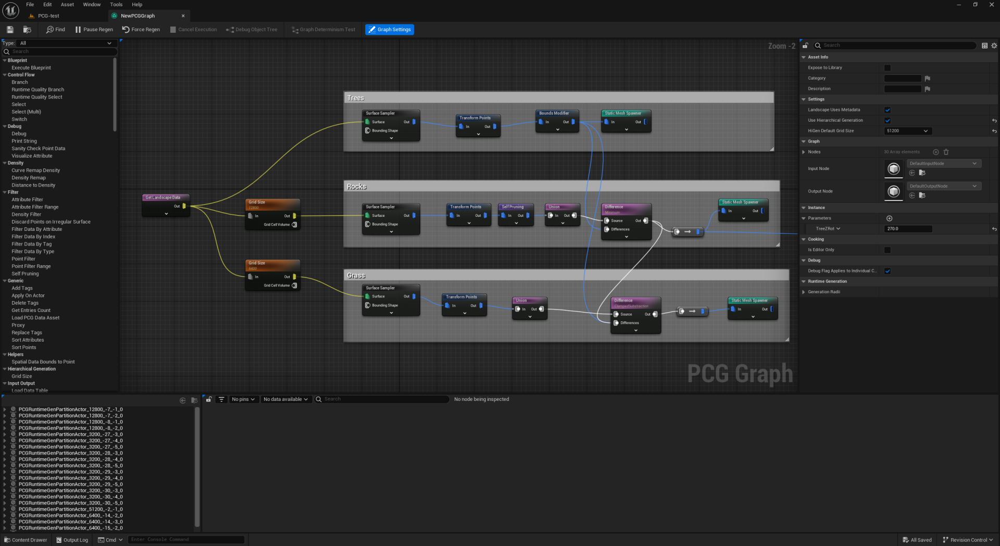

**Procedural Content Generation**은虚幻中 PCG를 위한工具集으로,技术美术师,设计师 및程序员에게 빠르고迭代적인工具과任何复杂性 콘텐츠(资产(예:建筑物或生物群落生成)부터整个世界까지)를构建하는能力를提供한다.

相关参考:

- [Procedural Content Generation Overview | Unreal Engine 5.5 Documentation | Epic Developer Community](https://dev.epicgames.com/documentation/en-us/unreal-engine/procedural-content-generation-overview?application_version=5.5)
- [『UE5 PCG』공식 공개 강의: Electric Dreams 환경 프로젝트 심층 연구](https://www.bilibili.com/video/BV1y8411U7Hs)
- [Electric Dreams PCG技术详解（一）——术语、工具和图表介绍](https://mp.weixin.qq.com/s/mGWiPKvWU_NHTktIWA6LnA)
- [Electric Dreams PCG技术详解（二）——沟壑、大型Assembly](https://mp.weixin.qq.com/s/xHdnrFTkywF_7OjqOuALbw)
- [Electric Dreams PCG技术详解（三）——森林、岩石和场景背景](https://mp.weixin.qq.com/s/YWcd8l-VphNLrOlg3zkSzA)
- [Electric Dreams PCG技术详解（四）——远景、雾气、自定义节点及子图表](https://mp.weixin.qq.com/s/CWTUcRIBTXw8WvhX3jrcBw)

### Meta Sounds


**Meta Sounds**는用户自定义,第三方可扩展,图表重复利用을支持하며编辑器中声音设计을进行할 수 있는强大工具을提供한다.

相关参考:

- [MetaSounds in Unreal Engine | Unreal Engine 5.5 Documentation | Epic Developer Community](https://dev.epicgames.com/documentation/en-us/unreal-engine/metasounds-in-unreal-engine?application_version=5.5)
- [音频编程基础 - Italink](https://italink.github.io/ModernGraphicsEngineGuide/04-UnrealEngine/7.%E9%9F%B3%E9%A2%91%E5%BC%80%E5%8F%91) 
- [活动演讲 | 初学者的MetaSound指南(官方字幕)](https://www.bilibili.com/video/BV15G4y1A7B5)

### Geometry Script

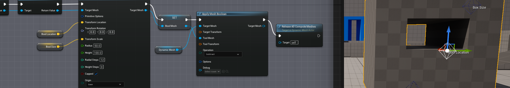

**Geometry Script**는蓝图和Python을使用하여网格体几何体를生成和编辑하는 API 세트를提供한다.编辑器工具控件(Editor Utility Widgets)中几何体脚本(Geometry Scripting)和资产操作(Asset Actions)을编写하여自定义网格体分析函数库,处理和编辑工具을创建할 수 있으며, Actor蓝图中它을使用하여 절차적对象를创建하고复杂的几何查询을实现할 수도 있다.

相关参考:

- [虚幻引擎中的几何体脚本编写简介 | 虚幻引擎 5.5 文档 | Epic Developer Community](https://dev.epicgames.com/documentation/zh-cn/unreal-engine/introduction-to-geometry-scripting-in-unreal-engine?application_version=5.5)

### Animation Blueprints

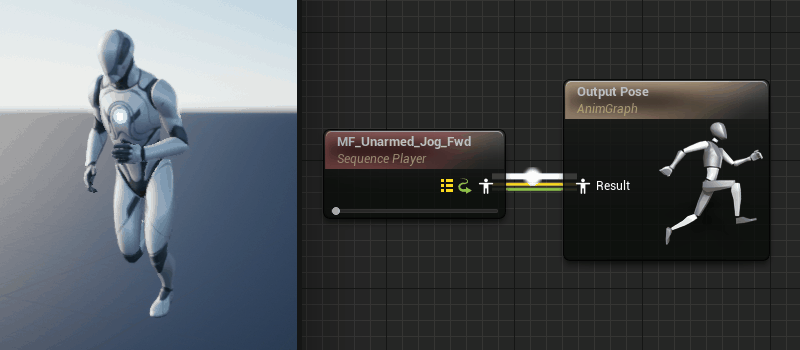

骨骼网格体를模拟하거나 게임中控制하기 위한蓝图로,其中动画을混合하고骨架을调整하며每帧使用的最终动画姿势(Pose)를定义하는逻辑을创建할 수 있다.

相关参考:

- [Animation Blueprints in Unreal Engine | Unreal Engine 5.5 Documentation | Epic Developer Community](https://dev.epicgames.com/documentation/en-us/unreal-engine/animation-blueprints-in-unreal-engine?application_version=5.5)

### Material Blueprint

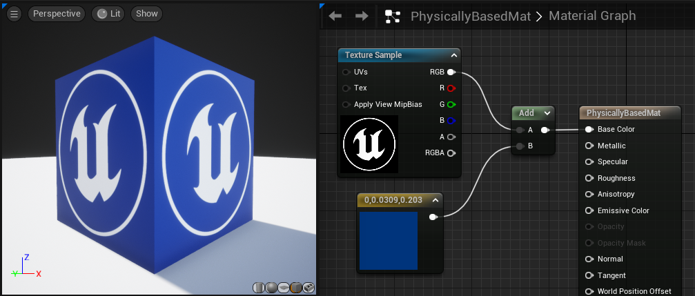

场景对象表面属性를定义하기 위한蓝图로,各种图像(纹理),节点 기반의材质表达式以及材质本身的固有属性를使用하여场景物体最终的表面属性를定义할 수 있다.

相关参考:

- [Unreal Engine Materials | Unreal Engine 5.5 Documentation | Epic Developer Community](https://dev.epicgames.com/documentation/en-us/unreal-engine/unreal-engine-materials?application_version=5.5)

### Texture Graph

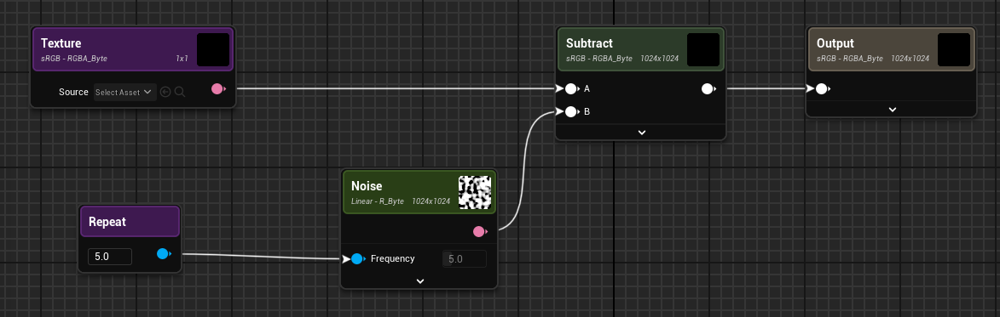

**Texture Graph**는艺术家에게 Unreal Engine中直接纹理资源를创建或编辑할 수 있는界面를提供하며,外部图像编辑包이 필요하지 않다. Material Editor와类似的熟悉한节点图을利用하여一系列节点를输出纹理에连接할 수 있다.

纹理图表을蓝图,材质 및材质函数과结合하여 Unreal Engine中만实现할 수 있는独特的工作流程를获得할 수 있다.

Texture Graph를使用하여很多有意思的应用을 할 수 있으며, 예를 들어笔者最近它을 사용하여:

- **P图**: 개발来说,代码编写的自由度는编辑器操作相比하여 훨씬 높다.

    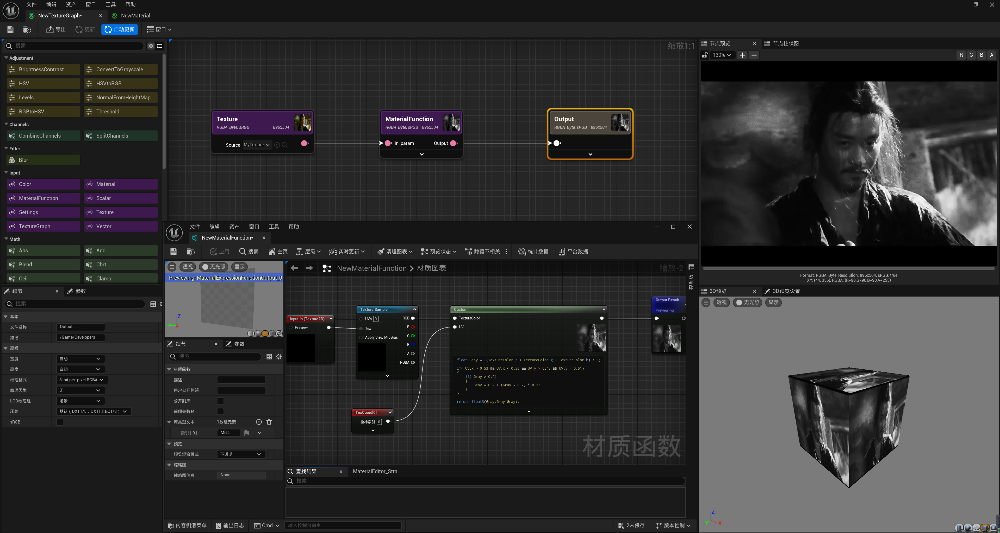

- **UI素材制作**: 虚幻的UI系统은边缘模糊(Blur),投射阴影(DropShadow),拟态(Neumorphism)等复杂的界面特效를支持하지 않는다.这는 UI가整个图形内容的一小部分으로少量的预算만 가지고 있으며这些特性使用需要较为复杂的渲染结构이기 때문이다.但Texture Graph를借助하여这些效果所需的素材图을生成하고一些简单的编辑器扩展과配合하면这套流程가非常丝滑할 것이다.
- **风格化参考生成**: Texture Graph에 AI调用节点를扩展하여虚幻引擎原生的图形内容가 AI를借助하여轻易地一些风格化参考을实现할 수 있다.例如笔者가它을使用하여生成한 것:
    - 项目内容为引擎启动加载时的Splash图和缩略图生成
    - Scene Capture와结合하여动态地场景为风格化的小地图生成
    - 某些场景为风格化的加载页面生成
    - ...

相关参考:

- [Getting Started with Texture Graph | Epic Developer Community](https://dev.epicgames.com/community/learning/tutorials/z0VJ/unreal-engine-getting-started-with-texture-graph)
- [[中文直播]第51期 | UE5.4新功能之TextureGraph | 朱昌盛（天之川）](https://www.bilibili.com/video/BV1As421M7Bj/)
- [UE5.4纹理图入门 CG世界](https://m.163.com/dy/article/J56TPVL50516BJGJ.html)
- [UE5.4新功能 - Texture Graph上手简介 | CSDN | 电子云与长程纠缠](https://blog.csdn.net/grayrail/article/details/140191905)
- [UE5.4TextureGraph | GALAXIX动漫大陆](https://www.bilibili.com/video/BV1FM4m1o7LE)

## 절차적 콘텐츠 관리

上面提到的这些절차적技术的应用은我们에게前所未有的创作效能를赋予하며,过去相比现在我们은更短的时间内更低的预算으로更为丰富的游戏内容를产出할 수 있다.这는开发效率를显著提升시킬 뿐만 아니라游戏内容的边界를拓宽하여玩家에게更多元化的体验를带来한다.

然而凡事皆有两面性이다.更多内容的产出은 또한管理成本가指数级增长할 것을意味한다.资产管理,版本控制부터测试与更新迭代까지每一个环节都需要更多的人力,物力和时间成本를投入하여庞大的内容体系가有序运行하고任何混乱或差错가出现하지 않도록确保해야 한다.

笔者之前场景搭建时非常推崇PCG技术를使用했는데,这는生成管线을整合하는 것이迭代和优化하기更容易하기 때문이다.

但实际上目前业界对于PCG的应用은还是比较理想化이며真正能落地的应用场景并不多다.

其很大的原因은 PCG가 땅에 닿지 않는다는 점이다.目前大多数游戏制作团队场景设计的岗位职责划分一般是:

- **游戏策划**: 游戏场景的整体框架规划负责,包括场景的功能,故事背景,风格定位,玩家在场景中的体验流程等,场景设计에明确的方向和需求文档提供.
- **概念设计师**: 策划的需求根据场景的概念设计进行,手绘或数字绘画等方式通过场景的整体风格,氛围,主要建筑和地形的大致形态等概念草图绘制,后续的详细设计에视觉参考提供.
- **场景原画设计师**: 概念设计的基础上场景中的具体元素에详细的原画设计进行,包括建筑的结构,装饰细节,地形的起伏变化,植被和道具的样式等,精确的绘画形式通过每个元素的造型,色彩,材质等细节呈现,建模师에准确的制作蓝图提供.
- **3D建模师**: 3D建模软件使用场景原画根据设计好的场景元素를三维模型构建,包括建筑,地形,道具等的基础框架搭建,体积和空间感赋予,初步的UV拆分进行后续的纹理绘制准备.
- **材质灯光师**: 3D模型에材质和纹理添加物体的真实质感模拟,如木材的纹理,金属的光泽,石头的粗糙感等.同时场景中的灯光效果设置不同的氛围和光影效果营造场景的真实感和视觉冲击力增强.
- **场景音效师**: 场景为合适的音效创作,选择和添加负责场景的主题,情感,氛围等根据音效设计进行采集,编辑,混音等操作通过音效与场景完美融合场景的沉浸感增强.
- **特效师**: 场景的需要根据各种特效设计和制作,如火焰,烟雾,水流,魔法效果等场景增添生动性和趣味性玩家的沉浸感提升.
- **关卡设计师**: 主要场景的布局和规划负责游戏玩法和策划要求根据怪物,道具,任务点,障碍物等元素在场景中的位置合理安排玩家的行进路线和关卡难度曲线设计玩家在场景中良好的游戏体验确保.
- **场景优化师**: 已经制作完成的场景에性能优化进行模型面数减少,纹理压缩,合理光照烘焙设置等手段通过场景对硬件的资源占用降低游戏的运行效率提高不同设备上流畅运行保证.

场景设计的过程中通常需要以上岗位之间密切的沟通与频繁的迭代才能最终的交付完成.

PCG를使用하는 이유는游戏团队가内容原料(模型,材质,特效,音效...)的生产产能大幅提升之后同样高效的手段去场景搭建完成并性能优化问题兼顾需要하기 때문이다.

但PCG管线设计的复杂性由于多人协作는非常非常非常困难하며具体到实际项目里面可能较高水准的TA负责PCG的逻辑编写需要한다.而"它"은美术制作流程精通原材料的规范性监管同时游戏策划的需求兼顾变更及时响应还得引擎底层了解性能优化策略制定해야 한다.

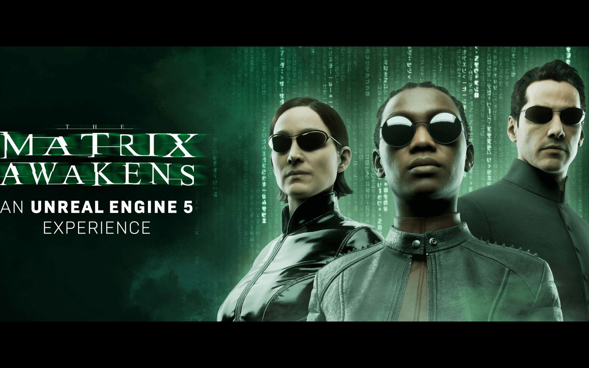

[相关信息](https://forum.quartertothree.com/t/the-matrix-awakens-an-unreal-engine-5-experience/154271/67)에 따르면虚幻引擎的 《黑客帝国 : 觉醒》示例的开发过程中大约 `20-30` 人负责资产处理整个团队有 `50-70` 名工作人员这毫无疑问绝对是一次壮举이다.

这个示例里面我们能看到 PCG 所展现出的巨大潜力: "轻而易举" 就搭建出了这么恢宏的城市.

而PCG落地困难的原因我们可以直接归结于很多团队很难拥有像Epic一样的团队质量이다.

其次PCG的目标在于归纳和总结出一条可持续迭代的生产管线但对于游戏产品来说吸引玩家的永远是内容和创意而它们必然是天马行空的이다.

具体到项目团队中PCG可以让多个岗位的职责集中到一起它既有优势可以快速地响应迭代也有劣势限制各方人员的创意发挥从而影响内容质量和产能이다.

PCG와不同的是절차적内容管理更像是一种后处理:

- 旨在以程序化的手段让内容组织变得收敛.

因此本文没有着眼于介绍那些高深莫测的前沿技术而是聚焦于当下游戏内容生产过程中梳理和整合一系列常见的程序化手段去管理虚幻引擎中的 **对象（Object）** , **资产（Asset）** 和 **世界（World）** 이다.

而使用程序化的手段去管理内容其原因简单来说就是: 

- 一些明明看起来很"直观"的操作在编辑器层面我们就是很难做到.

这种窘境可以用一段简短的对话来阐述:

>A: 코끼리를 알아?
>
>B: 물론 알아.
>
>A: 나는 그模样가非常好奇해, 그림으로 그려줄 수 있나?
>
>B: 죄송해, 나는 그림을 그릴 줄 몰라서 할 수 없어~

而程序化的目的就在于我们并不是直接对具体的目标进行处理而是通过特征描述我们想要做的事情这样使得操作的输入和过程可以具有一定的弹性.相当于给出了这样的回答:

> B: 죄송해, 비록 코끼리를 그릴 수는 없지만告诉你할 수 있어. 코끼리는特别高大하고灰色的身体에四条腿又粗又壮하며蒲扇一样的大耳朵가 있고长长的鼻子로东西를卷起할 수 있으며两颗又尖又长的牙齿가 있어.以后你见到它肯定都一眼就能认出来~

对于游戏项目来说一些内容制作相关的重型编辑器通常需要由专业的人员进行开发和委托但除此之外游戏内容制作的过程中也存在大量琐碎的 **微需求** 虽然没必要为这些需求安排专业的人员去开发编辑器工具但如果没有编辑器工具的辅助这些任务将会很难完成比如说:

- 坐标区域 `[X0,Y0  -  X1,Y1]` 根据该区域所有的Actor选中子关卡로导出本地测试进行
- 场景中所有开启阴影的光源筛选其阴影的合理性检查
- 所有网格体组件概览包围盒的大小及其他特征根据组件에一定光影和剔除的LOD策略批量给予
- 所有场景特效的包围盒大小概览特效包围盒是否存在异常项检索
- 特定组件的属性批量调整比如 位移变换,光影开关,物理策略,渲染属性...
- 资产的某些属性的开关批量修改
- 特定特征的Actor批量筛选并给予高亮显示.
- 场景中所有的静态模型 `SM_BigTree0001` 搜集封装好的蓝图 `BP_BigTree0001` 로批量替换它为树模型额外提供了落叶飘散的粒子特效组件以及树叶摩梭的音效组件
- 某个区域批量发送射线对场景进行采样射线检测得到场景数据存下来用于制作特效
- 批量预览,排序,搜索和编辑场景中所有`StaticMeshActor`的`StaticMeshComponent`的 `Disallow Nanite` 属性
- 某个区域的静态网格自动合并为层级实例化静态网格体组件
- ...

这些需求通常会高频出现在地图编辑,场景管理,资产管理,性能优化的过程中在体量较小的游戏项目中由于内容是渐进累加的通常抱着不行咱就砍的心态一般不会产生太大的问题但在大型的游戏项目中内容之间的关系错综复杂虽然通过PCG技术能缓解一部分压力但如果没有及时妥善地去解决好这些微需求内容管理也是非常容易失控的:

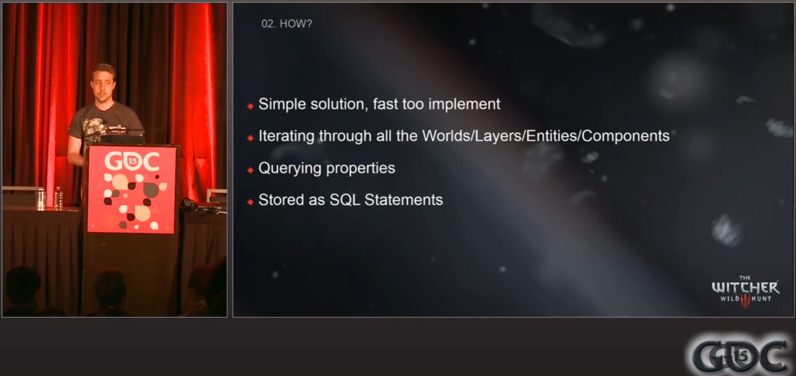

- 巫师3 - 开放世界的内容优化管线: https://www.youtube.com/watch?v=p8CMYD_5gE8

## 程序化内容处理插件

虚幻引擎毫无疑问是目前最强大最通用的游戏引擎这很大程度得益于其优秀的核心结构设计既然我们的目标是对虚幻引擎中的内容进行高效地程序化管理那么深入了解它的体系结构就显得尤为必要且具有重要意义이다.

由于展开这部分内容将会占用大量的篇幅因此笔者对之前基础体系的[文档](https://zhuanlan.zhihu.com/p/636151878)根据当前的关注点更新了部分内容如果对更多的细节感兴趣网上也有很多优秀的剖析文章:

- 核心架构: [InsideUE - 大钊](https://zhuanlan.zhihu.com/p/22813908)
- 渲染体系: [博客园 - 向往 | 剖析虚幻渲染体系 ](https://www.cnblogs.com/timlly/p/13512787.html)
- 资产管理: [知乎 - UE4的资源管理](https://zhuanlan.zhihu.com/p/357904199)

此外需要提醒的是如果没有恰当的项目规范就是上帝来了也得直摇头:

- 虚幻引擎规范指南: https://github.com/thejinchao/ue5-style-guide

程序化内容处理通常可以囊括为三个基本步骤:

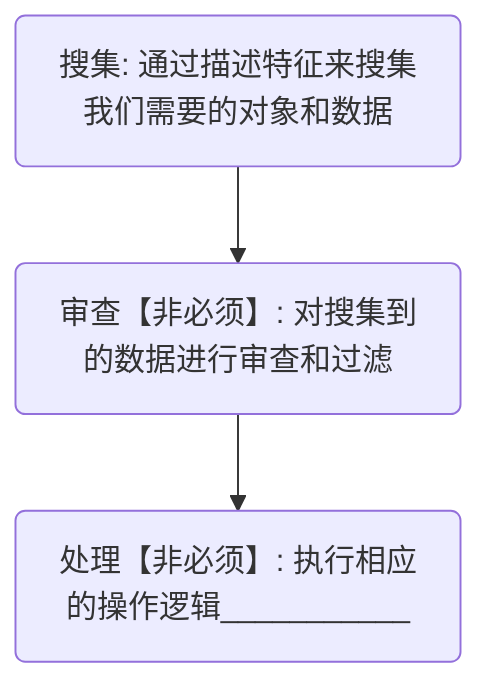
``` mermaid
graph TD
	A(搜集: 通过描述特征来搜集我们需要的对象和数据)
	B(审查【非必须】: 对搜集到的数据进行审查和过滤 )
	C(处理【非必须】: 执行相应的操作逻辑___________)
	A --> B
	B --> C

```

针对如上的流程笔者搭建了一个简单小巧的编辑器框架（ **ProceduralContentProcessor** ）用来完成这些步骤它作为一个工具箱可以轻易派生和扩展统一结构的编辑器工具插件的Github仓库是:

- https://github.com/Italink/ProceduralContentProcessor

后文将基于这个插件阐述每个阶段具体处理的步骤.

放置插件到项目的`Plugins`目录后可以在关卡编辑器的编辑器模式下找到 `程序化内容处理器模式`:

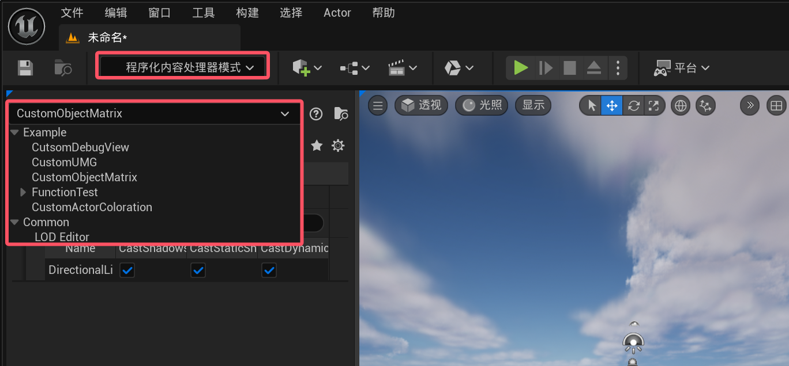

**Procedural Content Processor**  提供了三个可用的蓝图资产可以派生蓝图来扩展自己的编辑器模式:

- **程序化资产处理器（ProceduralAssetProcessor）** : 用于编写 **资产（Asset）** 操作相关的编辑器工具
- **程序化关卡处理器（ProceduralWorldProcessor）** : 用于编写 **关卡（World）** 处理相关的编辑器工具
- **程序化Actor着色器（ProceduralActorColorationProcessor）** : 用于编写Actor调试着色策略.

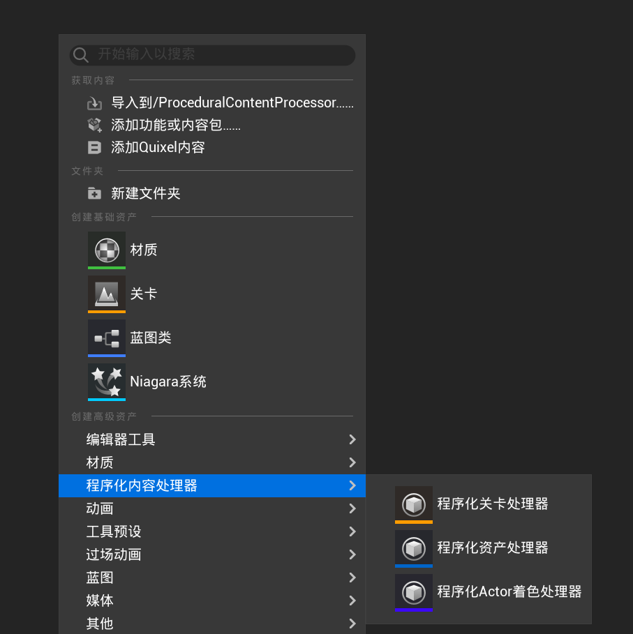

### 基本用法

**Procedural Content Processor** 本身并没有提供大多复杂的机制它大多是依托于引擎的原生功能.

一个关键点是:

- **CallInEditor（在编辑器中调用）** 勾选了的蓝图函数（或是`UFUNCTION`中具有`CallInEditor`标识符的C++函数）会在对象的细节面板上生成相应的按钮点击该按钮将会执行对应的函数逻辑:

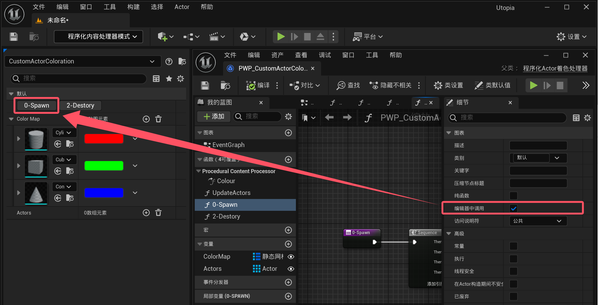

以此为契机我们可以轻易编写大量的编辑器工具.

程序化内容处理器的蓝图`类设置`中的一些选项将会影响到编辑器大纲的显示:

- **Sort Priority** : 排序优先级编辑器大纲中下拉框的排序影响.
- **Document Hyperlink** : 该处理器的文档链接编辑器大纲上的 【? 按钮】点击将打开对应的网址.
- **Override UMGClass** : UMG控件使用默认的细节面板顶替一般用于自定义编辑器的UI.
- **蓝图显示名称** : 该处理器在编辑器大纲中的真实显示名称.
- **蓝图描述** : 该处理器在编辑器大纲中的提示信息.
- **蓝图命名空间** : 该处理器在编辑器大纲中的分类多级分类以`.`隔开.

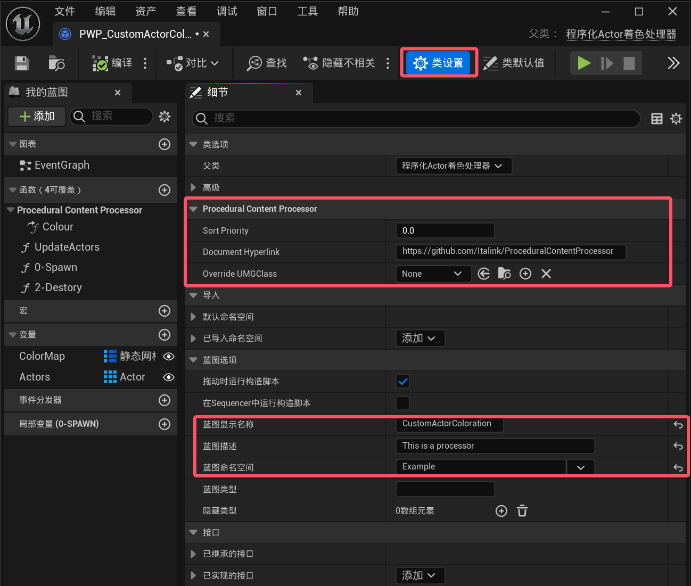

蓝图属性中的一些配置会对细节面板有所影响:

- **可编辑实例** : 只有勾选了可编辑实例的属性才能在对象的细节面板上编辑否则只能在蓝图编辑器中修改默认值.
- **只读蓝图** : 勾选后该属性将变得不可编辑但会预览.
- **配置变量** : 勾选后该属性的值将会被存到配置文件中下次启动处理器时会读取之前的配置.

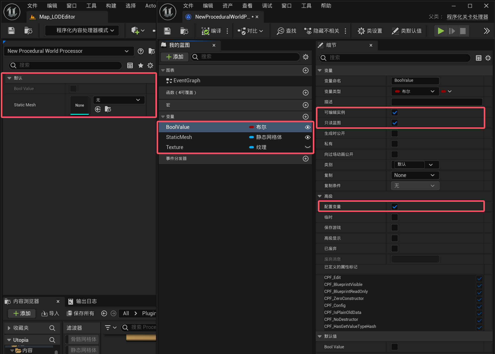

> 在编辑器制作过程中一些属性标识和元数据非常有用但它们并没有公开给蓝图编辑器这里推荐一个插件: https://github.com/DoubleDeez/MDMetaDataEditor

程序化内容处理器拥有四个可覆写的基本事件函数:

- `void Activate()`: 处理器激活时调用.
- `void Tick(DeltaTime)`: 处理器激活后每帧调用.
- `void Deactivate()`: 处理器退出时调用.
- `void PostEditChangeProperty(PropertyName)`: 处理器属性变更时调用.

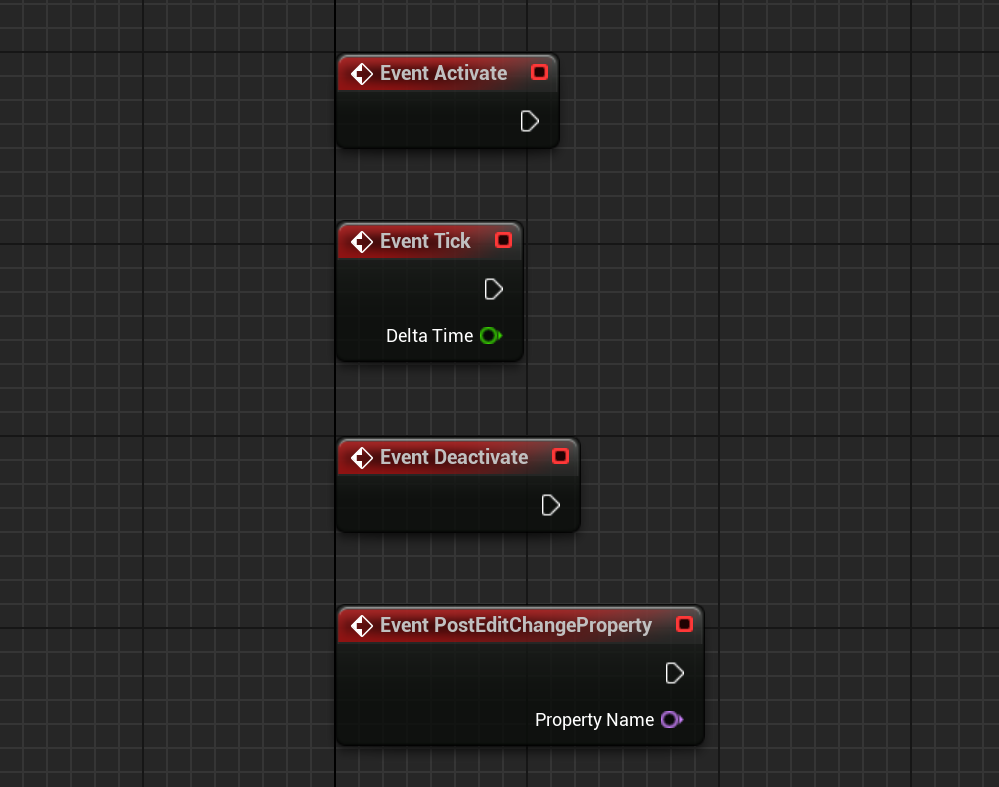

对于C++而言可以覆写如下函数来深度定制编辑器:

- `virtual TSharedPtr<SWidget> BuildWidget()`

UE的细节面板非常强大仅仅通过 **属性 + 函数** 的方式我们就可以快速搭建出简单易用的编辑器:

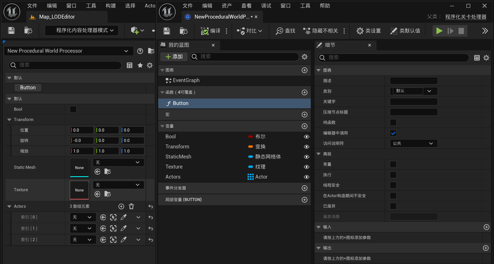

### 搜集

#### 关卡

对于 **程序化关卡处理器（ProceduralWorldProcessor）** 可以在编辑器函数中调用 `GetAll...()` 函数来搜集Actors:

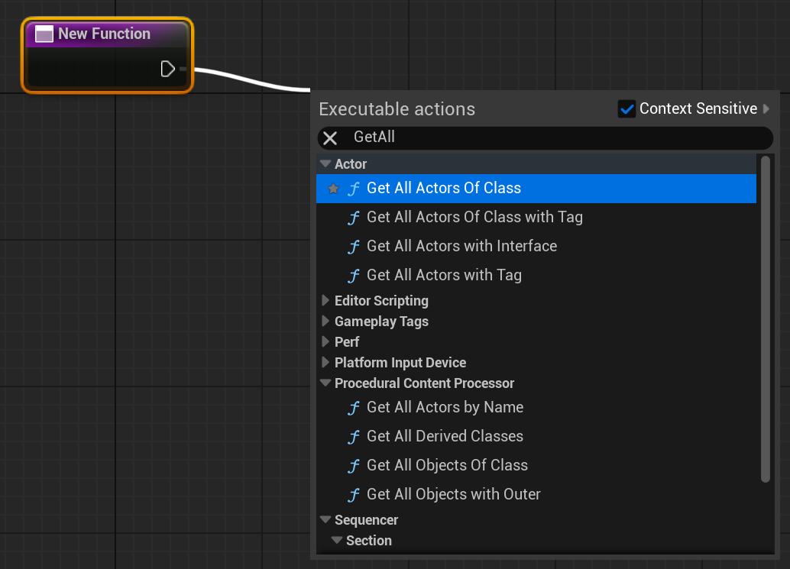

#### 资产

对于 **程序化资产处理器（ProceduralAssetProcessor）** 则可以编辑器函数中调用 `GetAllAssetRegistry()` 函数获取到资产注册表从而操作资产.

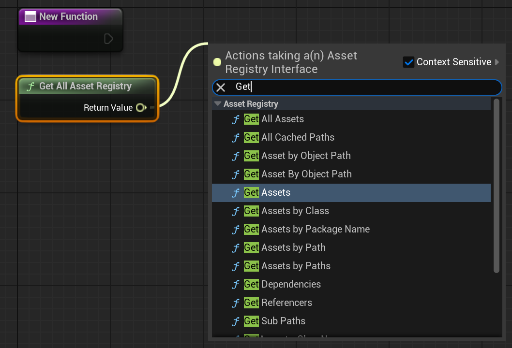

### 审查

#### Actor着色

插件里还提供了一个资产类型 — **程序化Actor着色器（ProceduralActorColorationProcessor）** 

它相较于 **ProceduralWorldProcessor** 多了一个事件函数`FLinearColor Colour(const UPrimitiveComponent* PrimitiveComponent)`可以通过覆写它来对当前场景中所有的图元组件进行调试着色:

> 需要引擎版本>=5.4

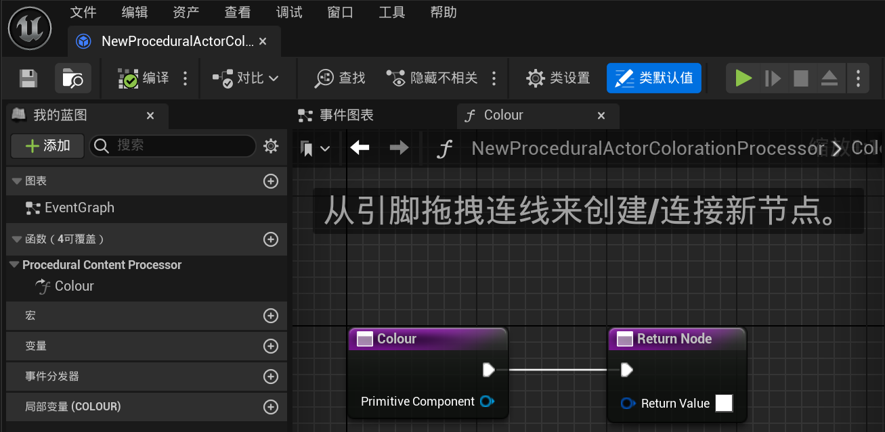

#### 对象属性矩阵

在虚幻引擎中官方提供了一个 **属性矩阵** 的功能用来批量更改资产的某些属性:

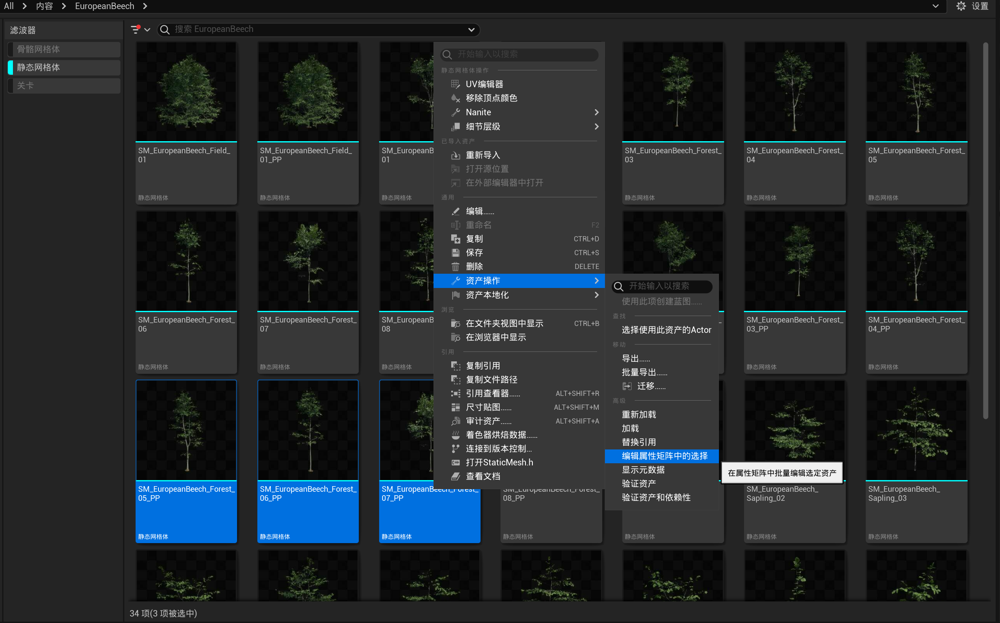

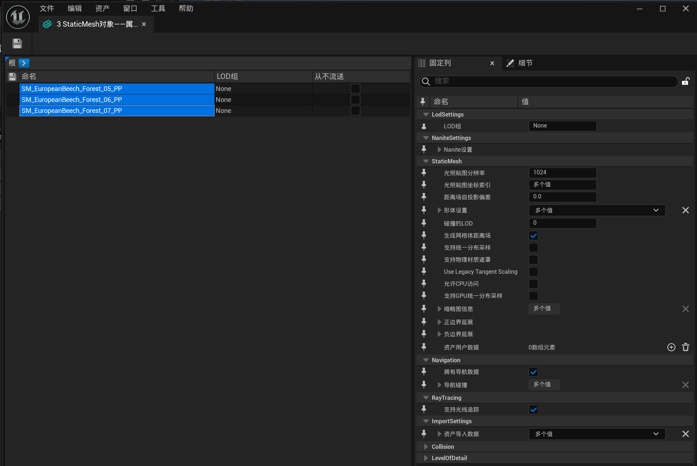

**Procedural Content Processor** 在它的基础上支持以程序化的方式来构建任意对象（UObject）的属性编辑矩阵.

我们只需要在蓝图中添加一个 **Procedural Object Matrix** 类型的成员变量:

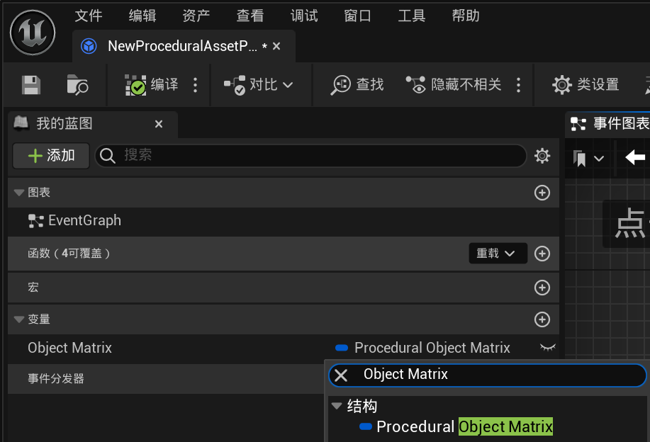

在编辑器函数中调用如下接口就能构造对象属性矩阵它会显示在对象的细节面板上:

- `void ClearObjectMaterix()`: 清理对象矩阵
- `void AddTextField(Owner, FieldName, FieldValue)`: 添加简单的预览文本意味着`{Owner}`行`{FieldName}`列将被填充为`{FieldValue}`
- `void AddPropertyField(Owner，PropertyName)`: 添加属性编辑器意味着`{Owner}`行`{PropertyName}`列将被填充为 【Owner对象PropertyName属性】的编辑器.
- `void AddPropertyFieldBySecondaryObject(Owner，SecondaryObject，SecondaryObjectPropertyName)`: 添加属性编辑器意味着`{Owner}`行`{SecondaryObjectPropertyName}`列将被填充为 【SecondaryObject对象SecondaryObjectPropertyName属性】的编辑器.

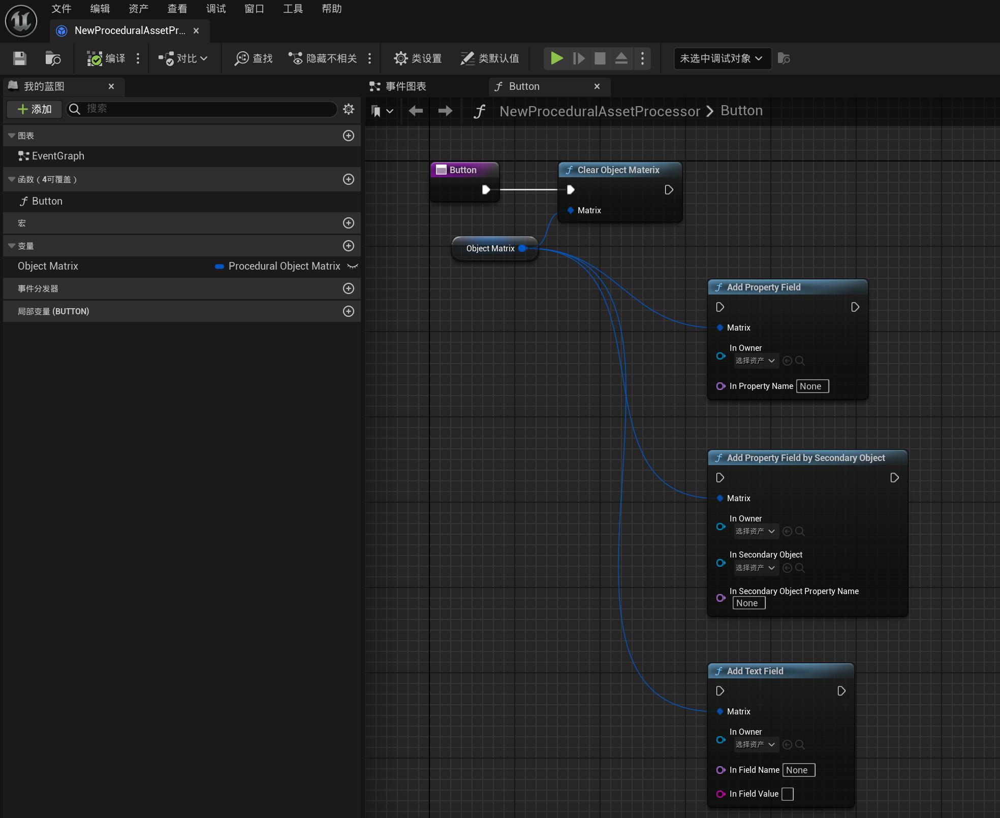

这是引擎中的一个使用示例:

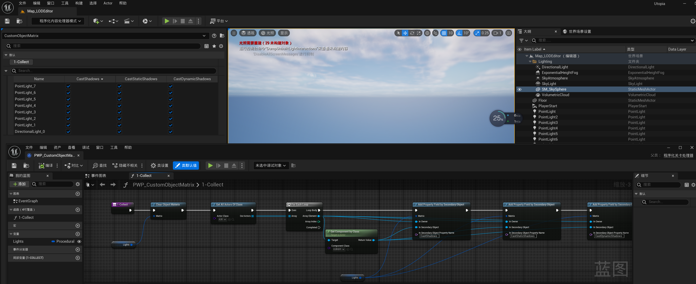

#### 对象细节视图

虚幻的细节面板可以轻松编辑任意UObject的属性:

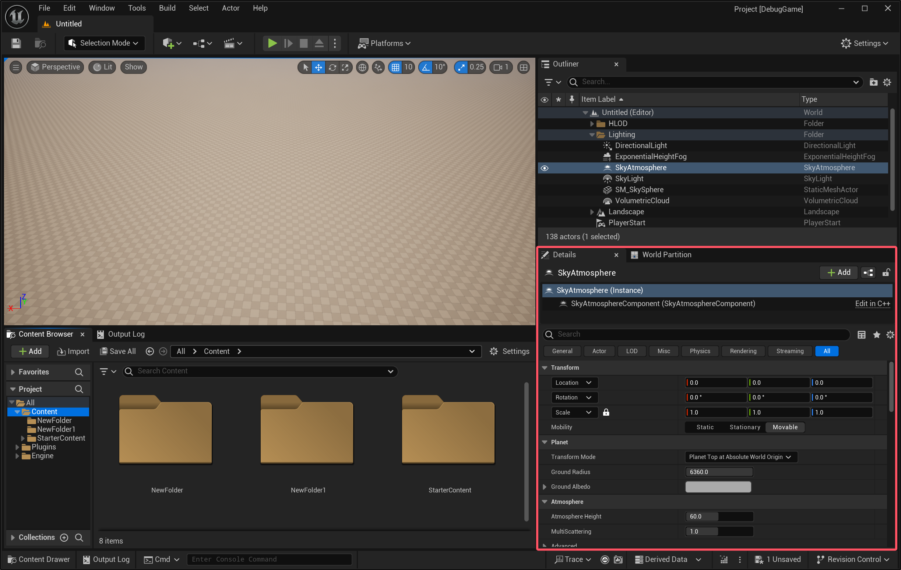

但它通常需要明确去选中对象插件中提供了一个蓝图函数用来显示任意对象的属性面板:

- `void ShowObjectDetailsView(UObject* InObject)`

这样就可以轻易调整一些对象的属性比如UI运行时子对象临时对象等

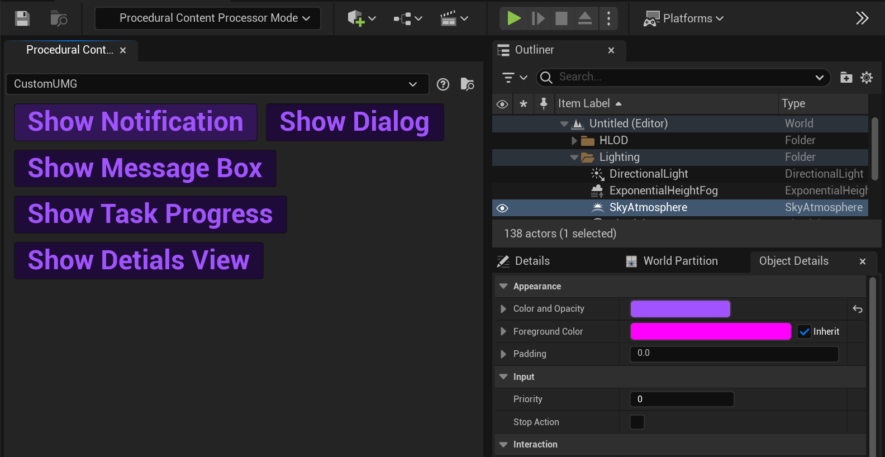

#### 对象编辑器

使用如下蓝图函数可以打开对应对象的编辑器:

-  `void ShowObjectEditor(UObject* InObject)`

### 处理

对于数据的处理就需要结合实际的业务需求具体去实现截止到目前 **UProceduralContentProcessorLibrary** 中包含了如下接口如有需要可自行添加:

#### 对象操作

```C++
static TArray<UObject*> GetAllObjectsOfClass(UClass* Class, bool bIncludeDerivedClasses = true);

static TArray<UObject*> GetAllObjectsWithOuter(UObject* Outer, bool bIncludeNestedObjects = true);

static TArray<UClass*> GetAllDerivedClasses(const UClass* ClassToLookFor, bool bRecursive);

static UObject* DuplicateObject(UObject* SourceObject, UObject* Outer);

static int32 DeleteObjects(const TArray< UObject* >& ObjectsToDelete, bool bShowConfirmation = true, bool bAllowCancelDuringDelete = true);

static int32 DeleteObjectsUnchecked(const TArray< UObject* >& ObjectsToDelete);

static void ConsolidateObjects(UObject* ObjectToConsolidateTo, UPARAM(ref) TArray<UObject*>& ObjectsToConsolidate, bool bShowDeleteConfirmation = true);

static TSet<UObject*> GetAssetReferences(UObject* Object, const TArray<UClass*>& IgnoreClasses, bool bIncludeDefaultRefs = false);

static bool IsGeneratedByBlueprint(UObject* InObject);

static void ShowObjectDetailsView(UObject* InObject);

static void ShowObjectEditor(UObject* InObject);

static UObject* CopyProperties(UObject* SourceObject, UObject* TargetObject);

static void ForceReplaceReferences(UObject* SourceObjects, UObject* TargetObject);

static void SetObjectPropertyByName(UObject* Object, FName PropertyName, const int& Value);
DECLARE_FUNCTION(execSetObjectPropertyByName);
```

#### 资产操作


```C++
static bool ObjectIsAsset(const UObject* InObject);

static UBlueprint* GetBlueprint(UObject* InObject);

static bool IsNaniteEnable(UStaticMesh* InMesh);

static void SetNaniteMeshEnabled(UStaticMesh* InMesh, bool bEnabled);

static bool IsMaterialHasTimeNode(AStaticMeshActor* InActor);

static bool MatchString(FString InString,const TArray<FString>& IncludeList, const TArray<FString>& ExcludeList);

static float GetStaticMeshDiskSize(UStaticMesh* StaticMesh, bool bWithTexture = true);

static UStaticMesh* GetComplexCollisionMesh(UStaticMesh* InMesh);

static void SetStaticMeshPivot(UStaticMesh* InStaticMesh, EStaticMeshPivotType PivotType);

static UStaticMeshEditorSubsystem* GetStaticMeshEditorSubsystem();

static float GetLodScreenSize(UStaticMesh* InStaticMesh, int32 LODIndex);

static float GetLodDistance(UStaticMesh* InStaticMesh, int32 LODIndex);

static float CalcLodDistance(float ObjectSphereRadius, float ScreenSize);

static float CalcScreenSize(float ObjectSphereRadius, float Distance);

static float CalcObjectSphereRadius(float ScreenSize, float Distance);

static UTexture2D* ConstructTexture2D(UTextureRenderTarget2D* TextureRenderTarget2D, UObject* Outer, FString Name, TextureCompressionSettings CompressionSettings = TC_Default);

static UTexture2D* ConstructTexture2DByRegion(UTextureRenderTarget2D* TextureRenderTarget2D, FBox2D Region , UObject* Outer, FString Name, TextureCompressionSettings CompressionSettings = TC_Default);

static void UpdateTexture2D(UTextureRenderTarget2D* TextureRenderTarget2D, UTexture2D* Texture);

static FNiagaraSystemInfo GetNiagaraSystemInformation(UNiagaraSystem * InNaigaraSystem);

static FVector2D ProjectWorldToScreen(const FVector& InWorldPos, bool bClampToScreenRectangle);

static bool DeprojectScreenToWorld(const FVector2D& InScreenPos, FVector& OutWorldOrigin, FVector& OutWorldDirection);

static UPhysicalMaterial* GetSimplePhysicalMaterial(UPrimitiveComponent* Component);
```

#### Actor 操作

```C++
static TArray<AActor*> BreakISM(AActor* InISMActor, bool bDestorySourceActor = true);

static AActor* MergeISM(TArray<AActor*> InSourceActors, TSubclassOf<UInstancedStaticMeshComponent> InISMClass, bool bDestorySourceActor = true);

static void SetHLODLayer(AActor* InActor, UHLODLayer *InHLODLayer);

static void SelectActor(AActor* InActor);

static void LookAtActor(AActor* InActor);

static AActor* SpawnTransientActor(UObject* WorldContextObject, TSubclassOf<AActor> Class, FTransform Transform);

static AActor* ReplaceActor(AActor* InSrc, TSubclassOf<AActor> InDst, bool bNoteSelectionChange = false);

static void ReplaceActors(TMap<AActor*, TSubclassOf<AActor>> ActorMap, bool bNoteSelectionChange);

static void ActorSetIsSpatiallyLoaded(AActor* Actor, bool bIsSpatiallyLoaded);

static bool ActorAddDataLayer(AActor* Actor, UDataLayerAsset* DataLayerAsset);

static bool ActorRemoveDataLayer(AActor* Actor, UDataLayerAsset* DataLayerAsset);

static bool ActorContainsDataLayer(AActor* Actor, UDataLayerAsset* DataLayerAsset);

static FName ActorGetRuntimeGrid(AActor* Actor);

static void ActorSetRuntimeGrid(AActor* Actor, FName GridName);
```

#### 编辑器接口

``` c++
static void BeginTransaction(FText Text);

static void ModifyObject(UObject* Object);

static void EndTransaction();

static UUserWidget* AddDialog(UObject* Outer, TSubclassOf<UUserWidget> WidgetClass, FText WindowTitle = INVTEXT("Dialog"), FVector2D DialogSize = FVector2D(400, 300), bool IsModalWindow = true);

static EMsgBoxReturnType AddMessageBox(EMsgBoxType Type, FText Msg);

static UUserWidget* AddContextMenu(UUserWidget* ParentWidget, TSubclassOf<UUserWidget> WidgetClass, FVector2D SummonLocation = FVector2D::ZeroVector);

static void DismissAllMenus();

static void AddNotification(FText Notification, float FadeInDuration = 2, float ExpireDuration = 2, float FadeOutDuration = 2);

static void AddNotificationWithButton(FText Notification, UObject* Object, TArray<FName> FunctionNames);

static void PushSlowTask(FText TaskName, float AmountOfWork);

static void EnterSlowTaskProgressFrame(float ExpectedWorkThisFrame = 1.f, const FText& Text = FText());

static void PopSlowTask();

static void ClearAllSlowTask();
```

### 示例

目前插件中已经提供了一些简单的示例参考:

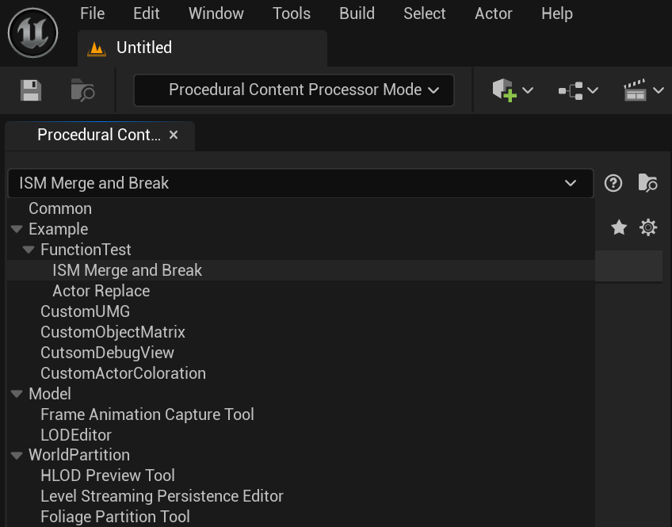

**Function Test** : 接口测试

- ISM Merge and Break: ISM拆解合并接口测试
- Actor Replace: Actor替换接口测试

**Custom Debug View** : 后处理调试视图用于查看场景中坡度大于某个值的区域:

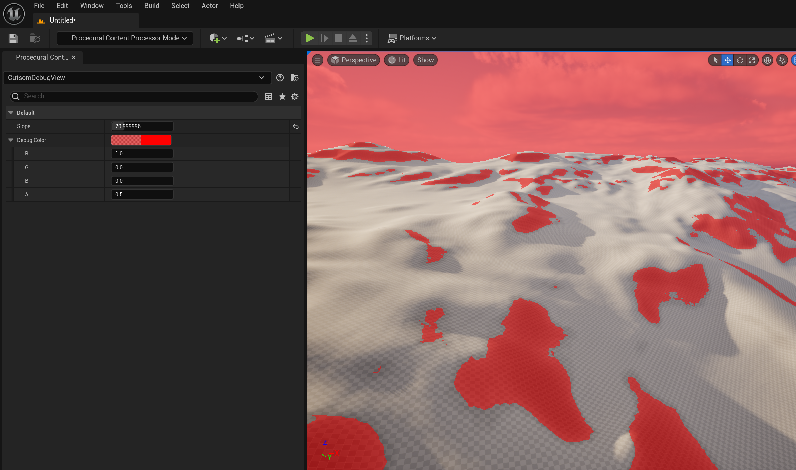

**CustomUMG** : 演示如何自定义编辑器面板显示通知弹窗对话框进度条对象细节面板对象编辑器:

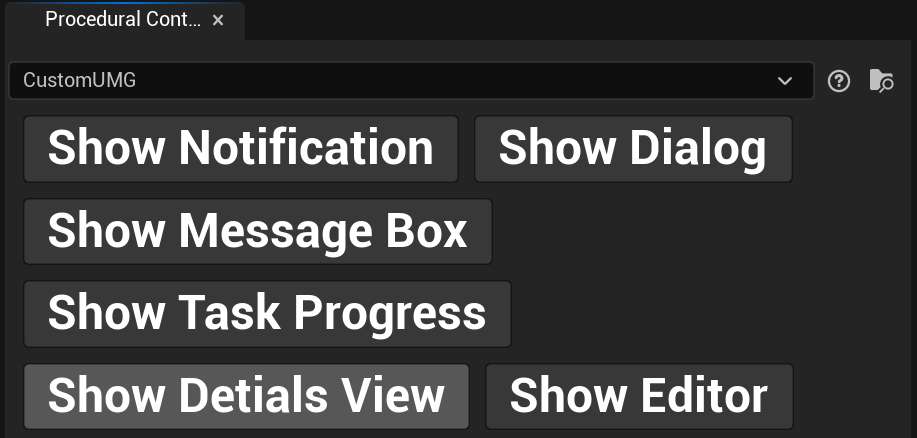

**CustomObjectMatrix** : 演示对象属性编辑器的用法:

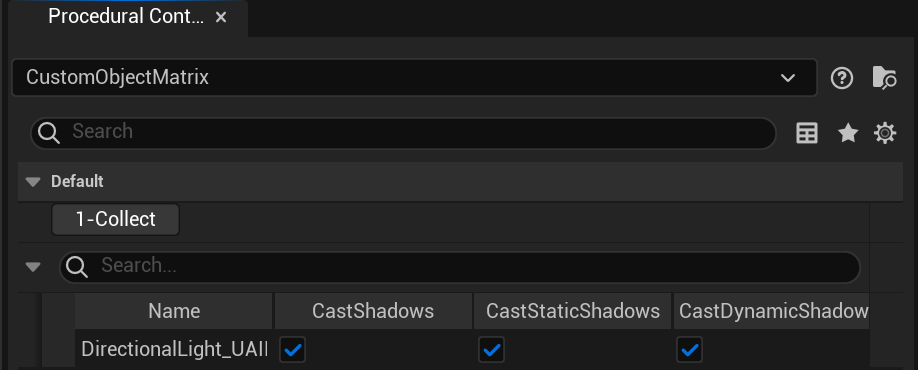

**CustomActorColoration** : 演示Actor着色的用法

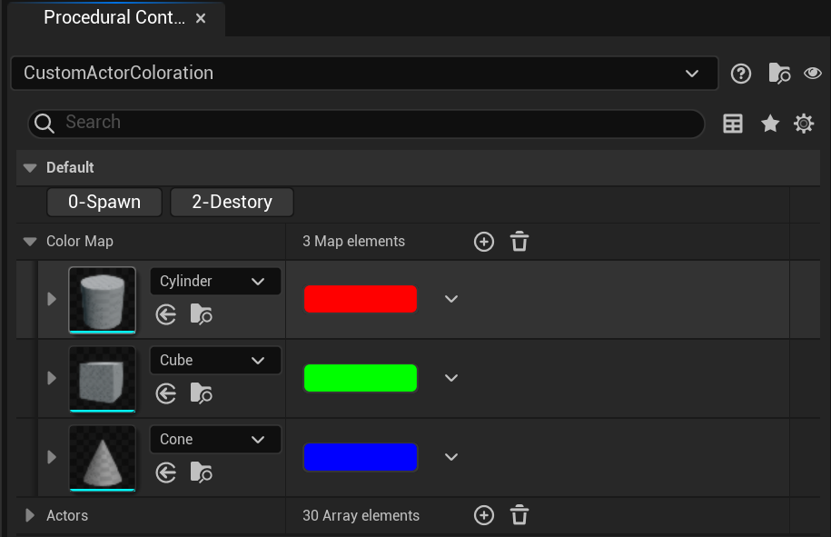