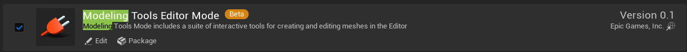
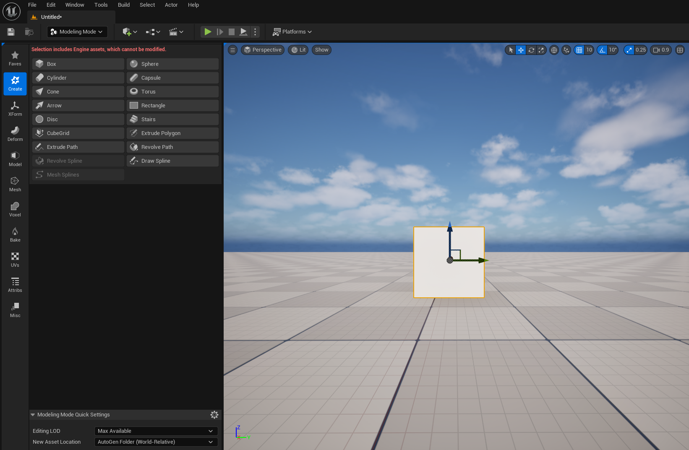
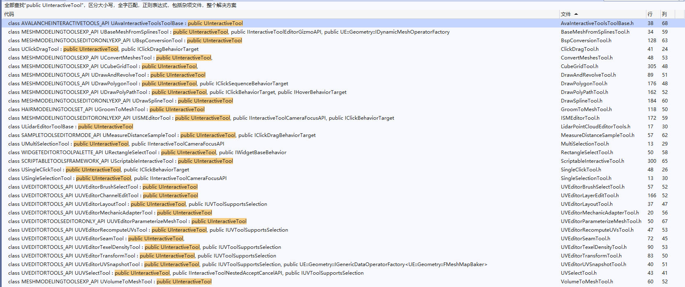
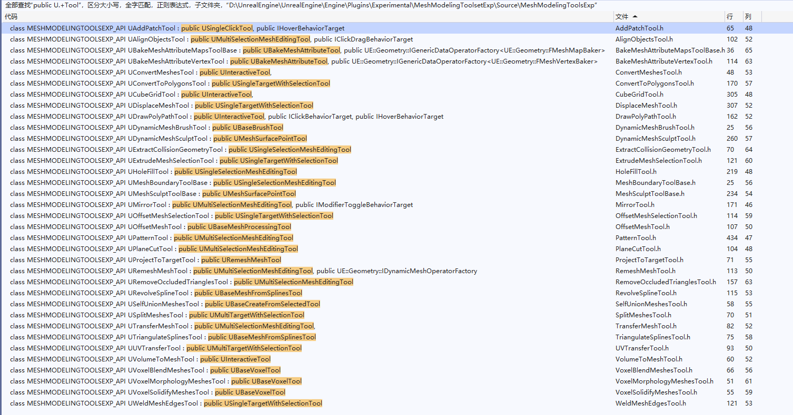
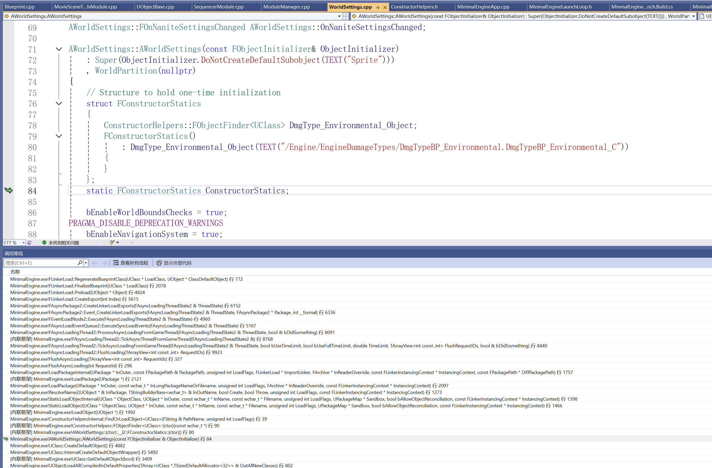
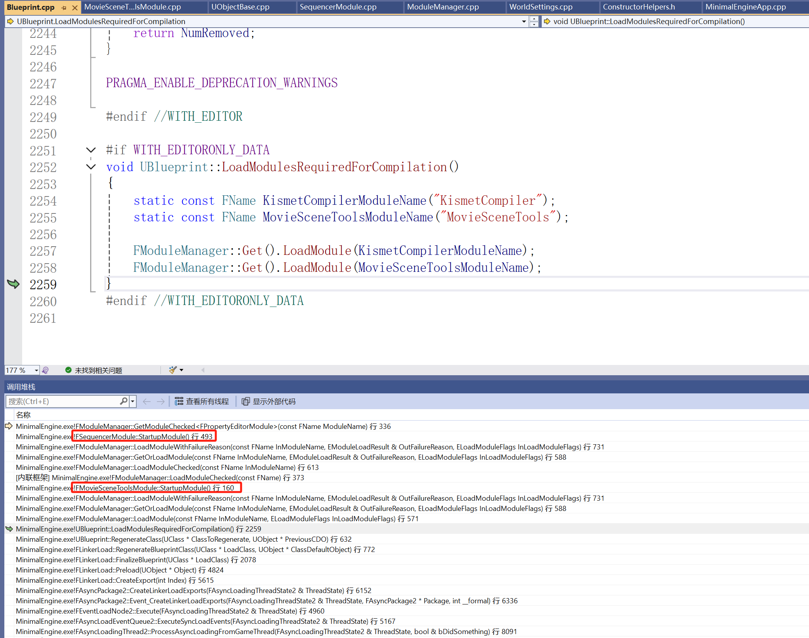

# 기하학 처리

최근 친구의 초대를 받아 함께 참가한 선전에서 열린 제5회 전국 인공지능 대회에서 3등상을 수상했습니다. 이 대회 과정에서 학술 분야의 동료들과 교류하며 업무에서 접하지 못했던 많은 지식과 경험을 배웠지만, 유일한 아쉬운 점은 경쟁자로서만 참가할 수 있어 다른 참가 팀의 프로세스와 전략을 보지 못해 함께 배우고 교류하기 어렵다는 점입니다. 원래 대회에서 대가들을 만나면 직접 이력서를递(제출)하려고 했는데 아쉽네요T.T

본론으로 돌아가서, 대회 문제의 과제는 다음과 같습니다:

- 입력된 이미지 집합에서 특정 물체를 선택한 후 고품질 모델로 재구성

초기阶段에서 우리는 이 과제에 대해 많은方案测试를 진행했고, 최종적으로 전략을 확정한 후 주로 두 단계로 나누었습니다:

- 이미지에서 특정 물체를 선택하고 모델로 변환
- 모델을 최적화하여 산업 생산 요구 사항을 충족

첫 번째 단계는 다른 동료가负责했으며, 그의 연구方向와 관련되어 공개할 수 없습니다0.0

기하학 최적화 부분은 저가负责했는데, 초기 계획은 기하학 처리 SDK를 사용하는 것이었습니다. 예를 들어 이전에 언급했던 다음 SDK들이 있죠:

- [Simplygon - 树立 3D 游戏内容优化标准](https://link.zhihu.com/?target=https%3A//www.simplygon.com/)
- [InstaLOD - 生产和自动优化3D内容所需的一切](https://link.zhihu.com/?target=https%3A//instalod.com/zh/)

하지만 이 SDK들은 상업용 유료 제품이며 환경과绑定되어 있기 때문에, 대회 프로그램을 가상 환경에提交해야 하는 경우 사용할 수 없었습니다. 몇 가지 오픈소스 기하학 알고리즘과 라이브러리도 있지만 보통 완전하지 않아서, 결국 Unreal Engine에 눈을 돌렸습니다0.0. 최종적으로 완료한 후에는 이렇게 말할 수밖에 없습니다:

- 정말 좋아요!

## 모델링 도구

여러분은 Unreal Engine의 모델링 도구 플러그인을 사용해 본 적이 있나요?





이 플러그인은 매우 완전한 기하학 처리 도구를 제공하기 때문에, 저는 이를 분리하여单独使用할 수 있을지 생각했습니다.

실제로 시도해 보았을 때, 처음에는 메시 처리 인터페이스 수준에서逻辑를 살펴보았지만 분리하기가 쉽지 않았습니다. 그 이유는 본질적으로 다른 플러그인인 **GeometryScript**와 동일한底层을 사용하기 때문입니다.

하지만 **交互工具框架(InteractiveToolsFramework)**에 주목했을 때, 설계 초기부터 오프라인操作情况을考虑했던 것 같아出乎意料地容易했습니다~

패널에서 볼 수 있는 모든操作은 **UInteractiveTool**이며, 엔진 내에서大量의派生 클래스가 만들어져 있습니다:



其中 메시 처리와 관련된 것은 다음과 같습니다:



만약我们想要一个 메시에 대해 **Remesh**操作을执行하려면, 다음과 같은 코드를 작성하면 됩니다:

``` c++
void UMinimalEngineCommandlet::Remesh(UStaticMesh* StaticMesh, int TargetPercentage, float InSmoothingStrength, int MaxRemeshIterations, bool bSplitEdge)
{
    // 에디터 도구 생성
	FCommandletEditorModeTools CommandletTools;   
    
    // 인터랙티브 도구 컨텍스트 생성
	auto InteractiveToolsContext = NewObject<UEditorInteractiveToolsContext>();                  
	
    // 컨텍스트 초기화
    InteractiveToolsContext->InitializeContextWithEditorModeManager(&CommandletTools, nullptr);   
	
    // 변환 도구注册
    UE::TransformGizmoUtil::RegisterTransformGizmoContextObject(InteractiveToolsContext);         

    // RemeshTool 빌더 생성
	auto ToolBuilder = NewObject<URemeshToolBuilder>();											  
	
    // 컨텍스트에 도구注册,注册名称은"MyTool"
    InteractiveToolsContext->ToolManager->RegisterToolType("MyTool", ToolBuilder);	
    
    // 컨텍스트에 타겟 선택 팩토리 추가
	InteractiveToolsContext->TargetManager->AddTargetFactory(NewObject<UStaticMeshComponentToolTargetFactory>());  
	
    // 컨텍스트에서 MyTool 선택
    InteractiveToolsContext->ToolManager->SelectActiveToolType(EToolSide::Left, "MyTool");

    // 임시 StaticMeshComponent 생성, 수정할 StaticMesh를 에셋으로 설정
	UStaticMeshComponent* StaticMeshComp = NewObject<UStaticMeshComponent>();
	StaticMeshComp->SetStaticMesh(StaticMesh);

    // 에디터 도구에서 임시 컴포넌트 선택
	CommandletTools.SelectComponents({ StaticMeshComp });

    // 왼쪽 도구激活, MyTool에对应
	InteractiveToolsContext->ToolManager->ActivateTool(EToolSide::Left);
    
    //激活된 도구获取
	if (auto Tool = Cast<URemeshTool>(InteractiveToolsContext->ToolManager->ActiveLeftTool)) {
		
        // 도구运行参数配置传递
        Tool->SetSettings(TargetPercentage, InSmoothingStrength, MaxRemeshIterations, bSplitEdge);
		
        // 렌더링循环模拟
        InteractiveToolsContext->ToolManager->Render(nullptr);
        
        // 도구任务执行循环模拟
		while (!Tool->CanAccept()) {
			Tool->Tick(0.01f);
		}
        
        // 도구结果接受请求模拟
		Tool->Shutdown(EToolShutdownType::Accept);
	}
}
```

其中 **FCommandletEditorModeTools**는重新派生한 클래스입니다.因为编辑器面板工具에서使用하는 것은全局单例이기 때문입니다:

``` c++
// UnrealEngine\Engine\Source\Editor\UnrealEd\Private\UnrealEdGlobals.cpp
FEditorModeTools& GLevelEditorModeTools()
{
	checkf(!IsRunningCommandlet(), TEXT("The global mode manager should not be created or accessed in a commandlet environment. Check that your mode or module is not accessing the global mode tools or that scriptable features of modes have been moved to subsystems."));
	if (!ensureMsgf(Internal::EditorModeToolsSingleton.IsValid(), TEXT("The level editor is not started up yet. If you need to access the global mode manager early in the startup phase, please use FLevelEditorModule::OnLevelEditorCreated to gate the access.")))
	{
		Internal::EditorModeToolsSingleton = MakeShared<FEditorModeTools>();
	}
	return *Internal::EditorModeToolsSingleton.Get();
}
```

某些考虑로 인해 명령行环境에서使用할 수 없으므로,简单한派生를 통해 구현합니다. **FEditorModeTools**의本质는 선택 기능을 수행하는 것뿐입니다:

``` c++
#pragma once

#include "CoreMinimal.h"
#include "EditorModeManager.h"

class FPreviewScene;
class UWorld;

class FCommandletEditorModeTools : public FEditorModeTools
{
public:
	FCommandletEditorModeTools();
	virtual ~FCommandletEditorModeTools() override;

	// FEditorModeTools 인터페이스
	virtual USelection* GetSelectedActors() const override;
	virtual USelection* GetSelectedObjects() const override;
	virtual USelection* GetSelectedComponents() const override;
	virtual UWorld* GetWorld() const override;
	void SelectActors(TArray<AActor*> Actors);
	void SelectComponents(TArray<USceneComponent*> Components);
protected:
	UWorld* CommandletWorld = nullptr;
	USelection* ActorSet = nullptr;
	USelection* ObjectSet = nullptr;
	USelection* ComponentSet = nullptr;
	FPreviewScene* PreviewScene = nullptr;
};
```

``` c++
#include "CommandletEditorModeTools.h"
#include "Engine/Selection.h"
#include "PreviewScene.h"
#include "Elements/Framework/TypedElementSelectionSet.h"

FCommandletEditorModeTools::FCommandletEditorModeTools()
{
	CommandletWorld = UWorld::CreateWorld(EWorldType::Editor, true);
	CommandletWorld->AddToRoot();

	UTypedElementSelectionSet* ActorAndComponentsSelectionSet = NewObject<UTypedElementSelectionSet>(GetTransientPackage(), NAME_None, RF_Transactional);
	ActorSet = USelection::CreateActorSelection(GetTransientPackage(), NAME_None, RF_Transactional);
	ActorSet->SetElementSelectionSet(ActorAndComponentsSelectionSet);
	ActorSet->AddToRoot();

	ComponentSet = USelection::CreateComponentSelection(GetTransientPackage(), NAME_None, RF_Transactional);
	ComponentSet->SetElementSelectionSet(ActorAndComponentsSelectionSet);
	ComponentSet->AddToRoot();

	ObjectSet = USelection::CreateObjectSelection(GetTransientPackage(), NAME_None, RF_Transactional);
	ObjectSet->SetElementSelectionSet(NewObject<UTypedElementSelectionSet>(ObjectSet, NAME_None, RF_Transactional));
	ObjectSet->AddToRoot();
}

FCommandletEditorModeTools::~FCommandletEditorModeTools()
{
	if (UObjectInitialized()){
		CommandletWorld->RemoveFromRoot();
		ActorSet->RemoveFromRoot();
		ComponentSet->RemoveFromRoot();
		ObjectSet->RemoveFromRoot();
	}
}

USelection* FCommandletEditorModeTools::GetSelectedActors() const
{
	return ActorSet;
}

USelection* FCommandletEditorModeTools::GetSelectedObjects() const
{
	return ObjectSet;
}

USelection* FCommandletEditorModeTools::GetSelectedComponents() const
{
	return ComponentSet;
}

UWorld* FCommandletEditorModeTools::GetWorld() const
{
	return CommandletWorld;
}

void FCommandletEditorModeTools::SelectActors(TArray<AActor*> Actors)
{
	ActorSet->DeselectAll();
	for (auto Actor : Actors) {
		ActorSet->Select(Actor);
	}
}

void FCommandletEditorModeTools::SelectComponents(TArray<USceneComponent*> Components)
{
	ComponentSet->DeselectAll();
	for (auto Component : Components) {
		ComponentSet->Select(Component);
	}
}
```

**URemeshToolBuilder**는 엔진에서提供하는 타입이 아닙니다.这里同样是对 **URemeshMeshToolBuilder**를简单派生한 클래스입니다.因为 **URemeshMeshTool**의大部分变量和函数都是`protected`로 선언되어 있어,派生를 통해它们을使用할 수 있기 때문입니다:

```c++
UCLASS()
class URemeshToolBuilder : public URemeshMeshToolBuilder
{
	GENERATED_BODY()
public:
	virtual UMultiSelectionMeshEditingTool* CreateNewTool(const FToolBuilderState& SceneState) const override{
    	return NewObject<URemeshTool>(SceneState.ToolManager);
    }
};

UCLASS()
class URemeshTool : public URemeshMeshTool
{
	GENERATED_BODY()
public:
	void SetSettings(int TargetPercentage, float InSmoothingStrength = 0.25f, int MaxRemeshIterations = 20, bool bSplitEdge = true){
        this->BasicProperties->SmoothingStrength = InSmoothingStrength;
        this->BasicProperties->MaxRemeshIterations = MaxRemeshIterations;
        this->BasicProperties->TargetTriangleCount *= TargetPercentage / 100.0f;
        this->BasicProperties->bSplits = bSplitEdge;
        this->Preview->InvalidateResult();          // 当前工具的结果失效,这会重新激活工具任务的执行
    }
};
```

其他工具에 대해서도基本用法는 같습니다.只是Tick模拟时有些细微한地方需要注意합니다.比如上面에서手动으로 렌더링循环을模拟했죠:

``` C++
InteractiveToolsContext->ToolManager->Render(nullptr);
```

有些工具의 경우 실제预览场景가缺乏하기 때문에崩溃를导致할 수 있습니다.이를直接移除해도通常结果运行에影响를 미치지 않습니다.如果影响가 있다면工具的输入环境를补全해야 합니다.比如 **UHoleFillTool**은哪些洞을填充할지选择해야 하므로,配置设置之前手动으로 다음 함수를调用할 수 있습니다:

``` c++
void UHoleFillTool::SelectAll()
```

有些复杂的任务의 경우异步状态更新가涉及될 수 있습니다.工具的Tick模拟之外,可能还需要模拟引擎的Tick입니다.这时可以调用以下函数:

``` c++
while (!Tool->CanAccept()) {
    Tool->Tick(0.01f);
    FakeEngineTick(CommandletTools.GetWorld(), 0.01f, 1); 
}
```

``` C++
void FakeEngineTick(UWorld* InWorld, float InDelta /*= 0.03f*/, int InCount /*= 1*/)
{
	for (int i = 0; i < InCount; i++) {
		if (IsRunningCommandlet()) {
			GEngine->EmitDynamicResolutionEvent(EDynamicResolutionStateEvent::EndFrame);
			CommandletHelpers::TickEngine(InWorld);
			GEngine->EmitDynamicResolutionEvent(EDynamicResolutionStateEvent::EndFrame);
		}
		else if (FSlateApplication::IsInitialized()) {
			FApp::SetDeltaTime(InDelta);
			bool bIsTicking = FSlateApplication::Get().IsTicking();
			GEngine->EmitDynamicResolutionEvent(EDynamicResolutionStateEvent::EndFrame);
			GEngine->Tick(FApp::GetDeltaTime(), false);
			FSlateApplication::Get().PumpMessages();
			FSlateApplication::Get().Tick();
			GFrameCounter++;

			if (!bIsTicking && GIsRHIInitialized) {
				if (FSceneInterface* Scene = InWorld->Scene) {
					ENQUEUE_RENDER_COMMAND(BeginFrame)([](FRHICommandListImmediate& RHICmdList) {
						GFrameNumberRenderThread++;
						GFrameCounterRenderThread++;
						FCoreDelegates::OnBeginFrameRT.Broadcast();
						});

					ENQUEUE_RENDER_COMMAND(EndFrame)([](FRHICommandListImmediate& RHICmdList) {
						FCoreDelegates::OnEndFrameRT.Broadcast();
						RHICmdList.EndFrame();
						});
					FlushRenderingCommands();
				}
				ENQUEUE_RENDER_COMMAND(VirtualTextureScalability_Release)([](FRHICommandList& RHICmdList) {
					GetRendererModule().ReleaseVirtualTexturePendingResources();
					});
			}

			FTaskGraphInterface::Get().ProcessThreadUntilIdle(ENamedThreads::GameThread);

			FSlateApplication::Get().GetRenderer()->Sync();

			FThreadManager::Get().Tick();

			FTSTicker::GetCoreTicker().Tick(FApp::GetDeltaTime());

			GEngine->TickDeferredCommands();

			GEngine->EmitDynamicResolutionEvent(EDynamicResolutionStateEvent::EndFrame);

			FAssetCompilingManager::Get().FinishAllCompilation();
		}
	}
}
```

这些를搞清楚之后, Unreal Engine은直接神器로 불릴 만합니다!

我们可以在编辑器中参数를调整하여各个步骤的结果를直观地看到,从而快速地最优策略를调整할 수 있습니다.最终调整好的策略를封装하여独立的命令行程序로打包, 알고리즘侧에서调用하도록 할 수 있습니다.

这里 Unreal의 에디터 모듈에 대해吐嘈一下합니다.因为我们要 (모델링插件 -> 交互工具框架 -> 编辑器模块)을包含하는命令行程序를打包해야 하므로,新的引擎启动循环을创建하고 UBT에一些配置和调整를 했지만,默认打包된包에는很多奇奇怪怪的依赖가存在합니다.即使一些裁剪을 했어도最终包体는 1G+가 됩니다.

仔细调查해 보니,引擎循环에进入时已经 400+개의 모듈이加载되었습니다.代码를 보니 눈물이 나왔습니다T.T:

- 比如 AWorldSettings构造时 DmgType을加载하는 경우

    

- 还有蓝图类型注册时,一整个电影序列编辑器를链式加载하는 경우(依赖가巨大):

    

一些思考:

笔者는工作经历中经常性能优化 관련疑难杂症에遇到했습니다.比较常见的是:

- 三维重建得到的模型甚至一些人工建模的模型很多时候都不能直接在引擎里面使用.它们需要满足一定的规格,而这个规格는时间和体量에 따라不断发生改变.

모델의 생성자也好,管理者也好,都被这个问题折磨得半死不活입니다.

早期笔者는几何处理管线을搭建하여这个问题에应对하려고尝试했습니다.虽然参数化输入이었지만,很多时候良好的结果를得到하려면最终还是人为主观判断가需要되었습니다.

这也是我们比赛策略上存在的不足 —— 创新가缺乏하며,基本都是已有的算法和工具上建立되어 있으며,大多是一些代码和工程问题입니다.

业务开发一线을退出하고这次比赛에参加함으로써,很多前沿技术方向를了解하게 되었습니다.拿三维重建技术来说,已经非常成熟了,而它距离实时渲染,感觉只差一座桥梁了.而 AI는这类可量化的问题에非常擅长합니다.

但是,可恶,我不会啊T.T,感兴趣的老哥可以试试~