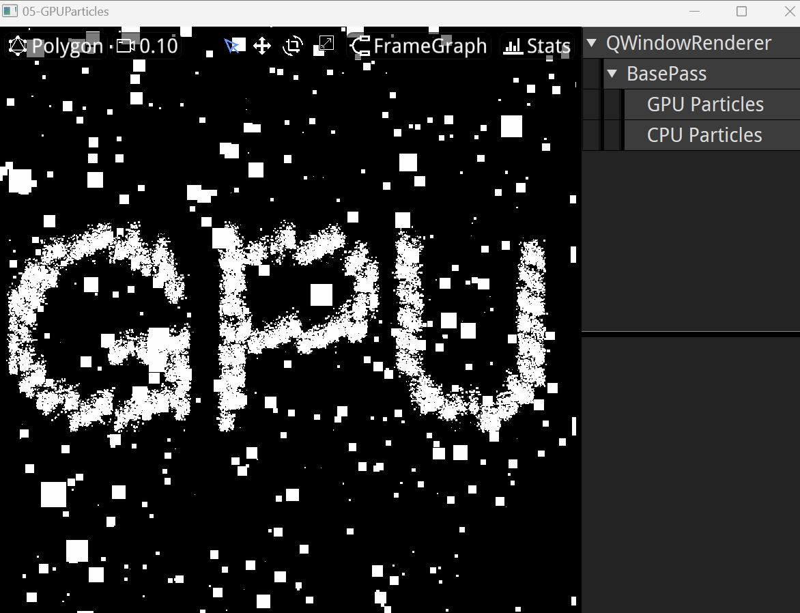
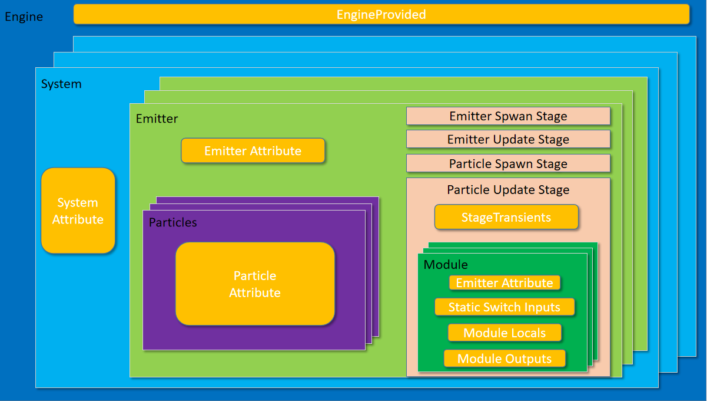
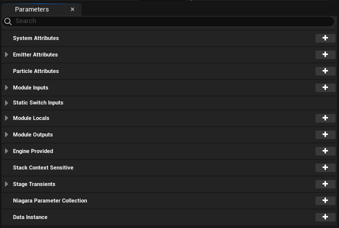
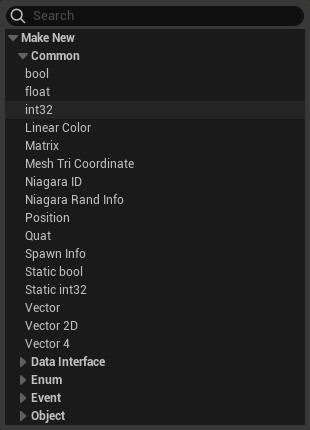
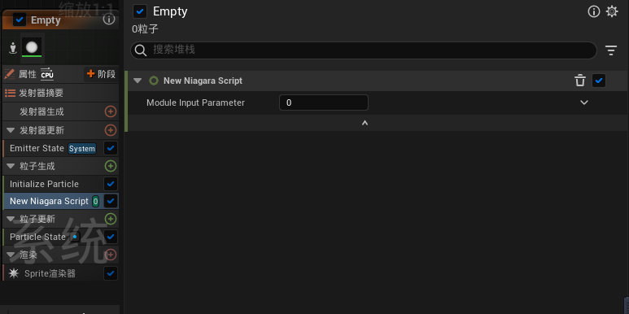
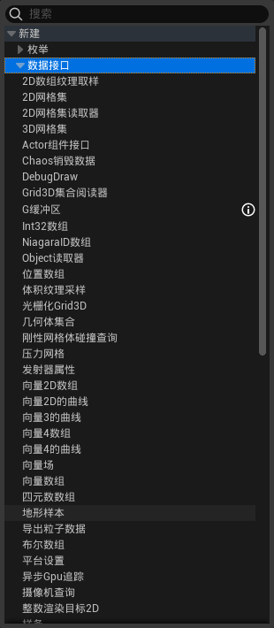
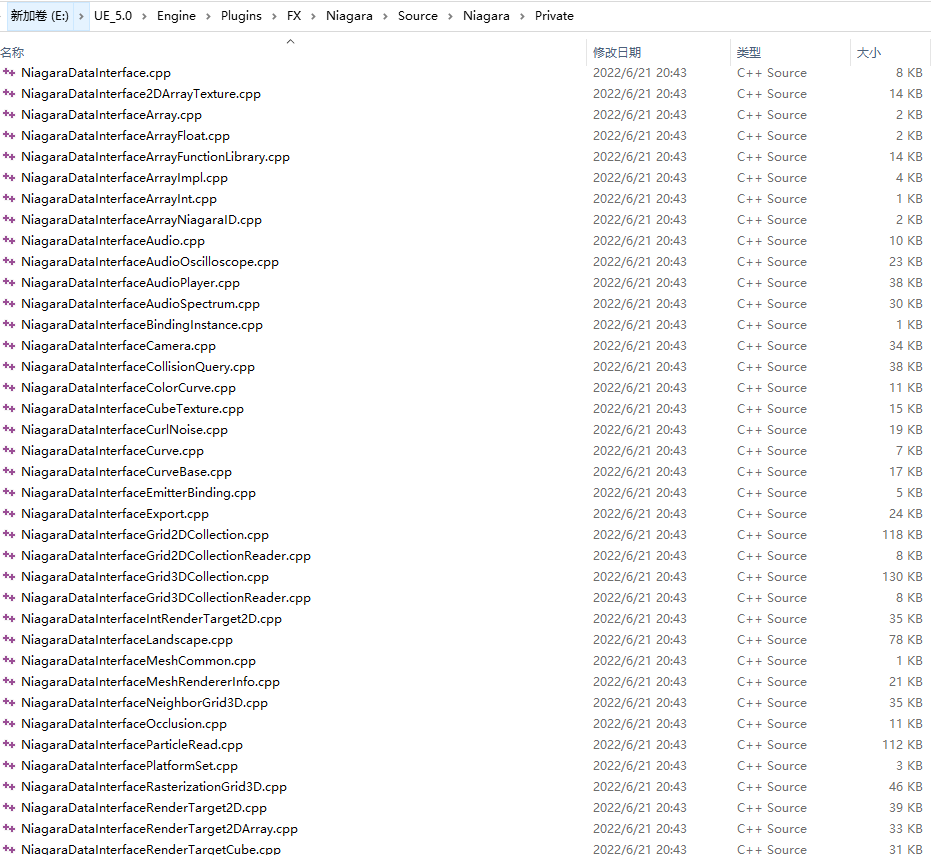
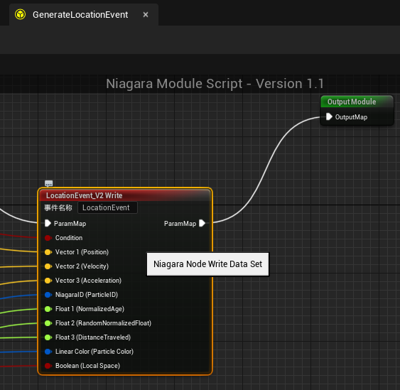
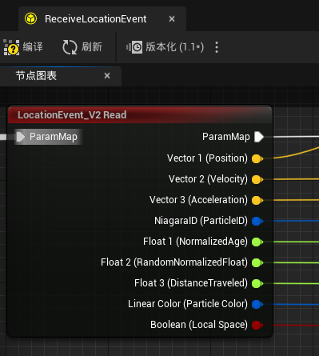
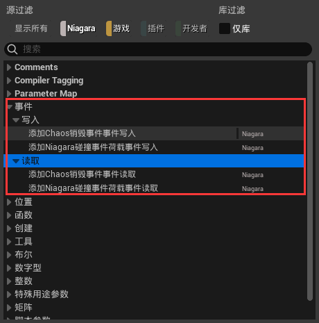

# 파티클 시스템（Particle System）

> 파티클 시스템（Particle System）은 3차원 컴퓨터 그래픽스에서 특정한 흐릿한 현상을 시뮬레이션하는 기술을 나타내며, 이 현상들은 기타 전통적인 렌더링 기술로는 사실적인 물리 운동 규칙을 구현하기 어렵다. 파티클 시스템을 자주 사용하여 시뮬레이션하는 현상으로는 불, 폭발, 연기, 물 흐름, 스파크, 낙엽, 구름, 안개, 눈, 먼지, 유성 꼬리 또는 발광 궤적과 같은 추상적인 시각 효과 등이 있다.
>
> [《백두바이크》— 파티클 시스템](https://baike.baidu.com/item/%E7%B2%92%E5%AD%90%E7%B3%BB%E7%BB%9F)

## 원리

파티클 시스템은 주로 **대량으로 움직이는** 객체를 렌더링하는 데 적합하며, 그 핵심 작업 흐름은 복잡하지 않다. 그래픽 API에 익숙한 분들은 GPU로 객체를 그리기 위해 `DrawCall`을 호출해야 한다는 것을 알고 있을 것이다. 파티클 시스템에는 매우 많은 작은 파티클이 존재하기 때문에 일반적인 방법은 다음과 같을 수 있다:

``` c++
for(int i = 0; i < particles.num(); i++){
    drawParticle(particles[i]);
}
```

이렇게 하면确实效果를达到할 수 있지만,大量의 `DrawCall` 호출과 파티클 간의 많은 중복 데이터로 인해 파티클 시스템의 렌더링 소모가 매우 높아져 렌더링할 수 있는 파티클 수가 매우 제한적이다.

파티클 데이터를 최대한 재사용하고 `DrawCall`을 줄이기 위해,大家应该都想到了—— **인스턴싱（Instancing）**

인스턴싱의 개념과 사용법은 다음을 참조하세요:

- [Learn OpenGL - Instancing](https://learnopengl-cn.github.io/04%20Advanced%20OpenGL/10%20Instancing/)

인스턴싱을 통해 파티클 시스템의 `DrawCall`을 병합하고 파티클 간의 동일한 데이터를 재사용할 수 있다.

위 개념을 명확히 하면 파티클 시스템이 단순히 인스턴싱 렌더링을 사용하는 작업 흐름이라는 것을 이해할 수 있다. 이维度에서 파티클 효과를制作하는 방법을思考할 때,我们考虑的是:

- 파티클 시스템에 필요한 인스턴스 데이터（Instance Data）를如何构建할 것인가.
- 인스턴스 데이터를如何利用하여 파티클 효과를 렌더링할 것인가.

이 두 관점에서出发하면 파티클 시스템의 작업 파이프라인을很容易搭建할 수 있다. 다음은架构层面에서 파티클 시스템의一些细节을阐述할 것이다:

간단한 파티클의 경우 다음과 같은 데이터 구조를使用할 수 있다:

``` c++
struct Particle{   		//파티클의 속성 구조 
	vec3 position;
	vec3 rotation;
	float size;
  	float age;
	//...
}
```

대부분의 파티클 시스템架构에서는 **파티클 에미터（Particle Emitter）** 라는 구조를使用하며, 데이터를 저장하는 **파티클 풀（Particle Pool）** 을维护하고 파티클의 **생성（Spawn）**, **更新（Update）** 및 **回收（Recycle）** 을负责한다. **파티클 렌더러（Particle Renderer）** 를使用하여 파티클 풀의 데이터를 렌더링하면 파티클 효과를得到할 수 있다. 이过程可以看作是:

``` c++
class ParticleEmitter{
protected:
    void Tick() override{
        Spawn();				//생성阶段:新 파티클 创建
        UpdateAndRecycle();		//更新阶段:각 파티클의 상태 데이터를 更新하고死亡한 파티클을 回收
        Render();				//렌더링阶段:파티클 렌더러를 使用하여 파티클 효과를 렌더링
    }
private:
    vector<Particle> mParticlePool;
    ParticleRenderer mParticleRenderer;
};
```

### 파티클 풀

컴퓨터의 메모리资源는有限하기 때문에 파티클 시스템은 **프로그램 실행 중 파티클 풀의 메모리 사용량이 계속膨胀하지 않도록** 보장해야 한다.为此 파티클 시스템은往往以下手段을 통해 이 문제를避免한다:

- 파티클의 발사数量를限制.
- 파티클에生命周期을具备시키고,生命周期을 초과한 파티클을及时回收.

이것은 또한 파티클 풀에 메모리优化的基础를提供한다:

- 파티클의 발사数量와生命周期을 알고 현재 컴퓨터의 최대 프레임 수를结合하면 해당 에미터의 최대 파티클 수를很容易估算할 수 있으며, 이数量의 메모리는往往一开始就 파티클 풀에分配되어 파티클 풀의 메모리 재分配로 인한 오버헤드를避免한다.
- 파티클 풀이并行回收할 수 있도록（배열에서 한 요소를移除할 때后方 요소를之前的位置에填充해야 하는 것을避免）往往两个相同大小的 파티클 풀을交替迭代하여使用한다.

만약 파티클을更新하고回收하려면 다음과 같은代码를写出할 수 있다:

``` c++
vector<Particle> ParticlePool;
ParticlePool.reserve(10000);			//10000개의 파티클 데이터를存放할 수 있는 메모리를预分配

int index = -1;
for(int i = 0; i < ParticlePool.size(); i++){
    if(ParticlePool[i].isAlive()){
        index++;
        ParticlePool[index] = ParticlePool[i];
        ParticlePool[index].position = ...;
        ParticlePool[index].size = ...;
        ...;
    }
}
ParticlePool.reseize(index);
```

이것의逻辑复杂度는 O(n)이며, 더优化하려면 for循环을并行处理할 수 있지만 위 코드 구조에서는做到할 수 없다.其原因은:

- 내부循环逻辑가外部共有变量 `index`에读写을进行한다.
- `ParticlePool`의不同区域에同时读和写을进行하므로并行时乱序执行로 인해数据混乱이出现한다.

이 문제를解决하기 위해我们一般两个 `ParticlePool`을交替处理하고局部线程中原子操作을 통해 `index`를读写한다.因此 ParticleEmitter의结构代码는 다음과 같이变成될 수 있다:

``` c++
class ParticleEmitter{
protected:
    void InitPool(){
        mParticlePool[0].reserve(...);
        mParticlePool[1].reserve(...);
        mCurrentPoolIndex = 0;
        mNextPoolIndex = 1;
        mCurrentNumOfParticle = 0;
    }
    void Tick() override{
        Spawn();				
        UpdateAndRecycle();		
        Render();				
    }
private:
    vector<Particle> mParticlePool[2];
    int mCurrentPoolIndex;
    int mNextPoolIndex;
    int mCurrentNumOfParticle;
    
    ParticleRenderer mParticleRenderer;
};
```

### 생성阶段

파티클의 생성阶段은主要新 파티클을生成하여 파티클 풀에存放하고初始化하는过程이며, 이过程可以看作是:

``` c++
void Spwan(){ 
 	SpwanPerFrame(mParticlePool[mCurrentPoolIndex],mCurrentNumOfParticle,100);  	    //每帧 100개의 파티클生成
}

// 发射机制 可自定义
void SpwanPerFrame(vector<Particle>& ParticlePool,int& NumOfParticle, int NumOfNewParticle){
    for(int i = 0; i < NumOfNewParticle ; i++ ){ 			//NumOfNewParticle은新增 파티클의数量
        Particle& NewParticle =  ParticlePool[NumOfParticle];	
        NumOfParticle++;
        InitializeParticle(NewParticle);
    }
}

// 初始化机制 可自定义
void InitializeParticle(Particle& particle){
    particle.position = vec3(0.0f,0.0f,0.0f);
    //particle...
}
```

> 여기注意해야 할 점은 `Spawn` 함수가每帧调用된다는 것이다. 에미터는 **每帧** 固定数量를发射하는发射机制 외에도 **每秒** "固定"数量를发射하는 경우도 있지만,不同系统环境下游戏의每秒帧数가不可预知하기 때문에 이러한 **时段에 따라发射数量를确定하는发射机制** 에 대해 파티클数量를精确控制하기는很难다.

### 更新回收阶段

此阶段의伪代码는 다음과 같이看作是:

``` c++
void UpdateAndRecycle(){ 	
    int IndexOfNextBuffer = -1;	  			//初始索引
    for_each_thread(int i = 0 ; i < mCurrentNumOfParticle ; i++){		//并行for
        const Particle& CurrentParticle = mParticlePool[mCurrentPoolIndex][i];
        if(CurrentParticle.isActive()){	
            int CurrentIndex = atomicAdd(IndexOfNextPool,1);			//原子操作을使用하여外部公共变量를读写
            Particle& NextParticle = mParticlePool[mNextPoolIndex][CurrentIndex];
            UpdateParticleStatus(CurrentParticle,NextParticle);
        }
    }
    CurrentParticlesBufferSize = IndexOfNextBuffer;	//当前存活的 파티클数量를更新
    swap(mCurrentPoolIndex,mNextPoolIndex);			//当前 파티클 풀的索引를交换
}

// 粒子状态更新机制 可自定义
void UpdateParticleStatus(const Particle& CurrentParticle, Particle& NextParticle){
    NextParticle.position = CurrentParticle.position;
    //NextParticle...
}
```

### 绘制阶段

绘制本身은 단순히 파티클的数据를利用하여 렌더링하는过程이며,其基本过程은 다음과 같이看作是:

``` c++
void Render(){
    mParticleRenderer.BindAttribute("position",mParticlePool[mCurrentPoolIndex],offset0,stride0);
    mParticleRenderer.BindAttribute("color",mParticlePool[mCurrentPoolIndex],offset1,stride1);
    ...;
    mParticleRenderer.drawInstancing();
}
```

该阶段은 파티클의本质를体现한다:파티클은 단순히一堆数据이며, 파티클 시스템（에미터）는只不过是这些数据를批量处理하여 파티클 렌더러의 **属性插槽** 에绑定함으로써 파티클 효과의 렌더링을完成하는 것이다.

### CPU VS GPU

上面提到 파티클 시스템本质上都是一堆 파티클数据를围绕하여处理하는过程이며,主要可划分为:

- **生成阶段** 和 **更新回收阶段** :这两个阶段은主要 파티클数据를处理하는过程이며, Niagara는 **可视化脚本** 을提供하여这两个阶段에自定义操作을提供한다.最终脚本은:
  - CPU:노드拼接의 C++代码를通过하여 Niagara의 가상 머신에서执行된다.
  - GPU:Niagara는 노드图에 따라 **NiagaraHlslTranslator** 를通过하여对应的 **HLSL** 代码로翻译하여 **ComputerShader** 가调用하도록 한다.
- **绘制阶段** :CPU 파티클이든 GPU 파티클이든相同的 렌더러를使用할 수 있다.区别在于: **CPU 파티클은数据를 GPU에上传해야 하지만, GPU 파티클의 데이터는本身 GPU에存在하므로传输가 필요 없다** .

上述过程은逻辑上大同小异하며,其中需要注意的是 GPU 파티클的回收. GPU 파티클은 ComputeShader를调用하여 **并行** 处理每个 파티클하지만,更新回收阶段에서는数据的重定位가涉及된다. GPU가高效的并行을能够하는原因은正是每一条分支上的数据가互不相通且互不影响하기 때문이다.而我们要实现 GPU 파티클的回收,就必须这一规定을 "打破"해야 한다.当下而言,这样的效果를达到하기 위한主要途径은两条가 있다:

- 图形渲染管线:光栅化을禁用하고 TransformFeedback（OpenGL）/ Stream Output（DX）, Geometry Shader中死亡 파티클을回收（提交하지 않음）

  > Geometry Shader本身就线性操作을带有한다.因为这个过程会不定数量的新顶点를生成하기 때문에 GPU가内存에数据를写入할 때肯定加锁重定位을进行한다.这也是上面为什么有人이 TransformFeedback和 Stream Output을使用하여 GPU 파티클을制作하는原因이다.当然这也是游戏中 GS를尽量避免해야 하는原因이다.顺带提一下, Stream Output은 DX의正统特性이며, TransformFeedback은 Khronos의待遇가 좋지 않다. Vulkan中甚至官方支持를提供하지 않으며, Metal更是对应功能的 API都没有.

- 通用计算管线:SSBO Atomic:硬件的更新에 따라目前较高版本的渲染驱动都会 SSBO（Shader Storage Buffer Object）를支持한다.这里我们的关注点은主要:SSBO가 Atomic操作을支持한다는 것이다.它的加持를有了으면 CS中并行的 파티클을处理하고 Atomic操作을使用하여 파티클数据重定位（即上面伪代码中的 NewIndex）을进行할 수 있다.新的 파티클数据에 대해서는另一个特性——间接渲染（Indirect Draw）을通过하여:直接 GPU上的数据를利用하여 DrawCall을调用할 수 있다.这样全程都 CPU与 GPU之间的 파티클传输을避免한다.下面는简易的 GLSL 代码를提供한다:

  ``` glsl
  layout (local_size_x = LOCAL_SIZE) in;
  struct Particle {
      vec3 position;
      vec3 rotation;
      vec3 scaling;
      vec3 velocity;
      float life;
  };
  layout(std140,binding = 0) buffer InputParticlesBuffer{
      Particle inputParticles[PARTICLE_MAX_SIZE];
  };
  layout(std140,binding = 1) buffer OutputParticlesBuffer{
      Particle outputParticles[PARTICLE_MAX_SIZE];
  };
  layout(std140,binding = 2) buffer ParticleRunContext{
  	int inputCounter;			//初始值은当前 파티클数
  	int outputCounter;		 	//初始化为-1
  	float duration;
  	float lifetime;
  };
  
  #define inID  gl_GlobalInvocationID.x
  #define inParticle inputParticles[inID]
      
  void main(){												//注意:GPU的并行은无序的
      if(inID >= inputCounter||inParticle.life>lifetime)		//此处阶跃函数 step을使用하여优化할 수 있다
          return;
      uint outID = atomicAdd(outputCounter,1);				//atomicAdd는 GLSL的原生函数이지만操作对象가 SSBO로부터来源해야 한다
      outputParticles[outID].life = inParticle.life + duration;
  }
  ```

> **着色器存储缓冲区对象（[ Shader Storage Buffer Object ](https://www.khronos.org/opengl/wiki/Shader_Storage_Buffer_Object)）** 은可读可写的缓冲区数据를提供하기 위해使用된다.
>
> 它的用法는 UniformBuffer와几乎一模一样하며,它们之间的主要区别은:
>
> - **Storage Buffer 可以非常大的显存을申请** : OpenGL 规范은 Uniform Buffer의大小이 **16KB** 에达할 수 있도록保证하며, Storage Buffer는 **128 MB** 에达할 수 있다.
>- **Storage Buffer 是可写的,甚至原子（Atomic）操作을支持** :Storage Buffer의读写은可能乱序的이므로往往一些内存屏障를增加하여同步을保证해야 한다.
> - **Storage Buffer 可变存储을支持** :这意味着 Storage Buffer中的块（Block）에서无界数组를定义할 수 있다.就像 `int arr[];` 一样,着色器中 `arr.length` 를使用하여数组长度를得到할 수 있다.而 Uniform Buffer中的块에서는数组를定义할 때数组大小을明确指定해야 한다.
>- **相同条件下, SSBO的访问会 Uniform Buffer보다慢** :Storage Buffer는通常缓冲区纹理一样访问되며, Uniform Buffer数据는内部着色器可访问的内存을通过하여读取된다.
> 
> 功能上讲, [Image Load Store](https://www.khronos.org/opengl/wiki/Image_Load_Store)访问를通过할 때 SSBO는 [缓冲区纹理](https://www.khronos.org/opengl/wiki/Buffer_Texture)的更好接口로认为될 수 있다.
> 
> OpenGL은 AtomicCounter的功能을提供하며,其本质上就是该特性이다.

上述은 GPU 파티클的回收을完成했지만,它其实还一个比较严重的问题을带来한다——每次回收时 파티클的数量가变化하지만,数据가 GPU中에位于하기 때문에 CPU中 `DrawCall` 을调用할 때又必须这个参数를知道해야 한다.

GPU上的数据를回读하는 것은肯定不行하다.因为现代图形 API는都是指令缓存的方式를通过하여渲染을加速하기 때문이다.简单点说,某一刻 GPU的指令缓存中可能两帧甚至以上的指令还处理되지 않은 상태가存在한다.如果我们要数据를回读하려면当前指令가立即执行되도록保证해야 한다.也就是说渲染线程을阻塞하고数据返回를等待해야 한다.这个操作은整个引擎而言简直就是致命打击이다.不过好在解决方法가 있다.

OpenGL4.0的更新中,新特性——[Indirect Rendering](https://www.khronos.org/opengl/wiki/Vertex_Rendering#Indirect_rendering)（间接渲染,也叫 **Indirect Draw** ）을提供한다.它은我们가 GPU上的数据를使用하여 `DrawCall` 을调用할 수 있도록允许한다.以下는官方对它的定义이다:

> [ **Indirect Rendering** ](https://www.khronos.org/opengl/wiki/Vertex_Rendering#Indirect_rendering)
>
> 间接渲染은直接 GPU上的数据를 DrawCall参数로使用할 수 있도록允许한다.例如, [glDrawArrays](https://www.khronos.org/opengl/wiki/GLAPI/glDrawArrays)的参数에는原始类型,顶点数和起始顶点가 있다.间接绘制命令 [glDrawArraysIndirect](https://www.khronos.org/opengl/wiki/GLAPI/glDrawArraysIndirect)를使用할 때缓冲区对象中에서相应参数를获取한다.
>
> 这个功能은 GPU->CPU->GPU往返을避免하기 위해 GPU가渲染할参数를决定하도록 하며, CPU가做的只是何时绘图命令를发出할지以及该命令가哪个 [Primitive](https://www.khronos.org/opengl/wiki/Primitive)를使用할지决定하는 것이다.

> Niagara源码中 Indirect를搜索하면相关用法的定义을找到할 수 있다.其主要的结构은以下에位于한다:
>
> - `NiagaraVertexFactories\Public\NiagaraDrawIndirect.h`
> - `Niagara\Private\NiagaraGPUInstanceCountManager.cpp`

####优缺点

- **CPU** 粒子
  - 优点
    - CPU端에서完整的游戏环境에访问할 수 있으며,其他 파티클或游戏逻辑와互动을进行할 수 있다.
    - 较高的硬件配置가无需하며,显卡가可编程管线和 인스턴싱 렌더링을支持하면 된다.

  - 缺点
    - 只能 CPU端에서线性地 파티클数据를迭代하므로 CPU的性能损耗가严重하다.
    - 粒子数据가 CPU端内存中에位于하기 때문에,渲染时统一将 파티클数据를 GPU中에上传해야 한다.这一传输过程的损耗가极其严重하다.

- **GPU** 粒子
  - 优点

    - 粒子数据가全程 GPU端에서生成和处理되므로 CPU和 GPU之间的数据传输을避免한다.
    - GPU中的并行单元을依靠하여 파티클数据를处理하므로 파티클处理所需的耗时를大大降低한다.

  - 缺点

    - GPU 파티클的数据가显存中에位于하기 때문에实时计算包围盒边界를无法进行한다.因此我们需要 GPU 파티클에手动固定边界를指定해야 한다.
    - 游戏环境와很好地交互을不能进行하지만,深度, Scene Capture,距离场을通过하여效果를逼近할 수 있다.
    - 硬件配置에一定要求가 있으며, CS, SSBO Atomic, Indirect Draw을支持해야 한다（PC端에独显가基本没问题이며,移动端的支持가不是特别完善）.

## 粒子系统架构示例

本教程的代码中也较为简单的 파티클架构를搭建했으며,具体请参考:

> 目前代码示例中还一些问题가存在한다. QRhi는并没有直接 **Indirect Rendering** 을支持하며,笔者는此处에部分原生 Vulkan代码를嵌入했으며,目前还内存屏障를改成하여同步을做하지 않고直接次级指令缓冲区를提交하여阻塞等待: `mRhi->finish()` 를进行한다.

- 代码:https://github.com/Italink/QEngineUtilities/blob/main/Source/Core/Source/Public/Asset/QParticleEmitter.h
- 示例1——[CPU和GPU粒子](https://github.com/Italink/ModernGraphicsEngineGuide/tree/main/Source/3-GraphicsTechnology/05-GPUParticles/Source/main.cpp)



- 示例2——[景深](https://github.com/Italink/ModernGraphicsEngineGuide/blob/main/Source/3-GraphicsTechnology/07-PostEffect/10-DepthOfField/Source/main.cpp)


## Niagara

Unreal Engine 的 Niagara 系统은非常强大하며,它本质上是 **可编程的数据处理器（CPU or GPU） 和 实例化 렌더러** 를提供하는 것이다.这一层面에서它을思考하면我们可以非常多惊艳的效果를实现할 수 있다.

### 作用域

大多数文章中此处的作用域를 "命名空间"라고称하지만,它确实变量命名을区分하는作用을起着하지만,开发者而言更为重要的是这些变量作用域所代表的生命周期이다.

以下는 UE中 Niagara的大体结构이며,其中 **黄色部分** 은 Niagara中可管理变量的作用域를代表한다:



Niagara编辑器中你可以参数面板을通过하여这些作用域的变量에增删改을进行할 수 있다.



- **EngineProvided** :该作用域를使用하는主要目的은引擎中变量를读取하기 위해서이다.常见的有 DeltaTime.


- **System Attribute** :单个 파티클 시스템이持有的属性变量.




- **Emitter Attribute** :单个 파티클 에미터가持有的属性变量.

- **Particle Attribute** :单个 파티클이持有的属性变量.

- **Module Inputs** :模块输入变量,即模块가外部设置에公开하는变量.它은模块的设置面板에显示된다:




- **Static Switch Inputs** :模块静态分支输入变量,编译期优化脚本的逻辑分支으로用作된다.

- **Module Locals** :模块本地变量.

- **Module Outputs** :模块输出变量.

- **Stage Transients** :阶段临时变量.

- **User Expose** :用户公开变量.这里里的变量는主要 Niagara外部的模块（C++或蓝图）调用에公开하기 위해서이다.底层上它은其他变量와本质上的不同가 있으며,下文细说한다.

> 这些作用域所代表的详细意义에 대해서는 다음을参阅할 수 있다: [UE4:Niagara的变量与HLSL - 知乎 (zhihu.com)](https://zhuanlan.zhihu.com/p/342315125)

### 底层核心—FNiagaraDataSet

Niagara属性本身은一堆数据이며,它은代码上对应的结构为 **FNiagaraDataSet** （除了 **User Expose** ）.其简要结构如下:

``` c++
class FNiagaraDataSet{
	/** Table of free IDs available to allocate next tick. */
	TArray<int32> FreeIDsTable;

	/** Number of free IDs in FreeIDTable. */
	int32 NumFreeIDs;

	/** Max ID seen in last execution. Allows us to shrink the IDTable. */
	int32 MaxUsedID;

	/** Tag to use when new IDs are acquired. Should be unique per tick. */
	int32 IDAcquireTag;

	/** Table of IDs spawned in the last tick (just the index part, the acquire tag is IDAcquireTag for all of them). */
	TArray<int32> SpawnedIDsTable;

	/** GPU buffer of free IDs available on the next tick. */
	FRWBuffer GPUFreeIDs;

	/** NUmber of IDs allocated for the GPU simulation. */
	uint32 GPUNumAllocatedIDs;

	/**
	Actual data storage. These are passed to and read directly by the RT.
	This is effectively a pool of buffers for this simulation.
	Typically this should only be two or three entries and we search for a free buffer to write into on BeginSimulate();
	We keep track of the Current and Previous buffers which move with each simulate.
	Additional buffers may be in here if they are currently being used by the render thread.
	*/
	TArray<FNiagaraDataBuffer*, TInlineAllocator<2>> Data;
    
    	/** Buffer containing the current simulation state. */
	FNiagaraDataBuffer* CurrentData;

	/** Buffer we're currently simulating into. Only valid while we're simulating i.e between PrepareForSimulate and EndSimulate calls.*/
	FNiagaraDataBuffer* DestinationData;

	/* Max instance count is the maximum number of instances we allow. */
	uint32 MaxInstanceCount;
	/* Max allocation couns it eh maximum number of instances we can allocate which can be > MaxInstanceCount due to rounding. */
	uint32 MaxAllocationCount;
}
```

上面的结构来看, **FNiagaraDataSet** 은开篇提到 粒子发射器 基本过程 中所需要的数据结构를提供한다:

- 存储分配的最大值（容量, ID）
- `TArray<FNiagaraDataBuffer*, TInlineAllocator<2>> Data` 는两个交替迭代的缓冲区이며, `FNiagaraDataBuffer* CurrentData` , `FNiagaraDataBuffer* DestinationData` 는缓冲器를指向하는两个指针로快速 Swap을用于한다.

其中核心的存储结构为 **FNiagaraDataBuffer** 이며,它은 **关注层面仅仅只是内存数据** 이다.其简要结构如下:

``` c++
class FNiagaraDataBuffer : public FNiagaraSharedObject{
//////////////////////////////////////////////////////////////////////////
	//CPU Data
	/** Float components of simulation data. */
	TArray<uint8> FloatData;
	/** Int32 components of simulation data. */
	TArray<uint8> Int32Data;
	/** Half components of simulation data. */
	TArray<uint8> HalfData;

	/** Table of IDs to real buffer indices. */
	TArray<int32> IDToIndexTable;
	//////////////////////////////////////////////////////////////////////////

	//////////////////////////////////////////////////////////////////////////
	// GPU Data
	/** Location in the frame where GPU data will be ready, for CPU this is always the first group, for GPU is depends on the features used as to which phase. */
	ENiagaraGpuComputeTickStage::Type GPUDataReadyStage = ENiagaraGpuComputeTickStage::First;
	/** The buffer offset where the instance count is accumulated. */
	uint32 GPUInstanceCountBufferOffset;
	/** GPU Buffer containing floating point values for GPU simulations. */
	FRWBuffer GPUBufferFloat;
	/** GPU Buffer containing integer values for GPU simulations. */
	FRWBuffer GPUBufferInt;
	/** GPU table which maps particle ID to index. */
	FRWBuffer GPUIDToIndexTable;
	/** GPU Buffer containing half values for GPU simulations. */
	FRWBuffer GPUBufferHalf;
#if NIAGARA_MEMORY_TRACKING
	int32 AllocationSizeBytes = 0;
#endif
	//////////////////////////////////////////////////////////////////////////

	/** Number of instances in data. */
	uint32 NumInstances;
	/** Number of instances the buffer has been allocated for. */
	uint32 NumInstancesAllocated;
	/** Stride between components in the float buffer. */
	uint32 FloatStride;
	/** Stride between components in the int32 buffer. */
	uint32 Int32Stride;
	/** Stride between components in the half buffer. */
	uint32 HalfStride;
	/** Number of instances spawned in the last tick. */
	uint32 NumSpawnedInstances;
	/** ID acquire tag used in the last tick. */
	uint32 IDAcquireTag;

	/** Table containing current base locations for all registers in this dataset. */
	TArray<uint8*> RegisterTable;//TODO: Should make inline? Feels like a useful size to keep local would be too big.
	RegisterTypeOffsetType RegisterTypeOffsets;
};
```

Niagara中 FNiagaraDataSet을持有的类有:

- **FNiagaraEmitterInstance** :Niagara发射器实例

  ```c++
  class FNiagaraEmitterInstance{
      struct FEventInstanceData
  	{
  		TArray<FNiagaraScriptExecutionContext> EventExecContexts;
  		TArray<FNiagaraParameterDirectBinding<int32>> EventExecCountBindings;
  
  		TArray<FNiagaraDataSet*> UpdateScriptEventDataSets;			//更新阶段的数据集
  		TArray<FNiagaraDataSet*> SpawnScriptEventDataSets;			//生成阶段的数据集
  
  		TArray<bool> UpdateEventGeneratorIsSharedByIndex;
  		TArray<bool> SpawnEventGeneratorIsSharedByIndex;
  
  		/** Data required for handling events. */
  		TArray<FNiagaraEventHandlingInfo> EventHandlingInfo;
  		int32 EventSpawnTotal = 0;
  	};
      /** particle simulation data. Must be a shared ref as various things on the RT can have direct ref to it. */
  	FNiagaraDataSet* ParticleDataSet = nullptr;						//粒子数据
  };
  ```

- **FNiagaraSystemInstance** :Niagara系统实例

  ``` c++
  class FNiagaraSystemInstance{
  	// registered events for each of the emitters
  	typedef TPair<FName, FName> EmitterEventKey;
  	typedef TMap<EmitterEventKey, FNiagaraDataSet*> EventDataSetMap;	
  	EventDataSetMap EmitterEventDataSetMap;							//Niagara系统事件集
  };
  ```

- **FNiagaraDICollisionQueryBatch** :包含碰撞事件

  ``` c++
  class FNiagaraDICollisionQueryBatch{
      FNiagaraDataSet *CollisionEventDataSet = nullptr;
  };
  ```


- **FNiagaraScriptExecutionContextBase** :Niagara脚本（Module）执行上下文

  ``` c++
  struct FNiagaraDataSetExecutionInfo{
      FNiagaraDataSet* DataSet;
  	FNiagaraDataBuffer* Input;
  	FNiagaraDataBuffer* Output;
  }
  struct FNiagaraScriptExecutionContextBase{
      UNiagaraScript* Script;
      TArray<FNiagaraDataSetExecutionInfo, TInlineAllocator<2>> DataSetInfo;
  }
  ```

由此可以看出 Niagara中的 **粒子数据** 和 **事件** 都是 **FNiagaraDataSet** 를基于한다.当然这里有个特例就是前面提到的 **User Expose** 이며,它은 **FNiagaraParameterStore** 에存储되며,模块에不可见하다. Niagara系统中只读取을可以进行한다.即 **FNiagaraParameterStoreBinding** 을通过하여其他属性에绑定한다.它을使用하는主要目的은 Niagara与外部数据的交互手段을提供하기 위해서이다.

`Niagara\Classes\NiagaraDataSetAccessor.h` 에内部读写 FNiagaraDataSet的很多模板函数을提供한다. Int32를 예로 들면:

``` c++
template<typename TType>
struct FNiagaraDataSetAccessorInt32
{
	static FNiagaraDataSetReaderInt32<TType> CreateReader(const FNiagaraDataSet& DataSet, const FName VariableName) { }
	static FNiagaraDataSetWriterInt32<TType> CreateWriter(const FNiagaraDataSet& DataSet, const FName VariableName) { }
};
```

而 Niagara的编辑器层面에서는并没有直接 **FNiagaraDataSet** 을处理하며,而是 **FNiagaraVariable** 을管理编辑하여 **FNiagaraDataSetCompiledData** 中에存储한 후最后编译을进行한다:

``` c++
struct FNiagaraDataSetCompiledData
{
	GENERATED_BODY()

	/** Variables in the data set. */
	UPROPERTY()
	TArray<FNiagaraVariable> Variables;

	/** Data describing the layout of variable data. */
	UPROPERTY()
	TArray<FNiagaraVariableLayoutInfo> VariableLayouts;

    //...
};
```

至此 Niagara的底层核心就告一段落了.细节에过多深入할 필요는 없다.

### 数据接口—Data Interface

基本数据类型（数值,向量...）不足以所有的应用场景을满足한다.有些情况下 파티클 시스템은骨骼,纹理,距离场,音频...等很多复杂的数据结构에访问할可能需要한다.

对此 Niagara는 **Data Interface** 라는机制을提供하여专门复杂的数据结构를处理한다.任意作用域的属性를新建할 때 **DateInterface** 下以下条目을看到할 수 있다:



它은代码底层上对应结构— **UNiagaraDataInterface** 이다.

上面的所有接口均它을派生自한다.这里它을提的主要原因은:我们也 **插件中这个类을派生하여自定义을进行할 수 있다** 는 것이다.

Niagara源码中有大量的派生示例이存在한다:



### 事件机制

Niagara的事件机制同样上文提到的 **FNiagaraDataSet** 를基于한다.

**GenerateLocationEvent** 를 예로 들면:


它的脚本을打开하면 다음을看到할 수 있다:



该脚本的核心은 **LocationEvent_V2 Wirte** 这个节点을调用하는 것이다.这个节点은创建을无法进行한다.因为它은引擎序列化产生的 것이며,它的节点原型은 **UNiagaraNodeWriteDataSet** 이다.其结构如下:

``` c++
class UNiagaraNodeDataSetBase : public UNiagaraNode
{
public:
	FNiagaraDataSetID DataSet;
	TArray<FNiagaraVariable> Variables;
	TArray<FString> VariableFriendlyNames;
};

class UNiagaraNodeWriteDataSet : public UNiagaraNodeDataSetBase{
	FName EventName;
};
```

再</think_never_used_51bce0c785ca2f68081bfa7d91973934>它的事件处理器 **Receive Location Event** 를来看하면:




**LocationEvent_V2_Read** 와之前的 **LocationEvent_V2 Wirte** 가对应하는 것을看到할 수 있다.节点原型은 **UNiagaraNodeWriteDataSet** 이다.

其中 Niagara中自行创建을可以进行的事件有:



它们也是 **UNiagaraNodeDataSetRead ** / **UNiagaraNodeDataSetWrite ** 을通过하여 **FNiagaraDataSet** 에读写을进行한다.其执行逻辑은很简单하지만我们只需要搞清楚:

- 这两个节点은什么地方的 FNiagaraDataSet에读写을进行하는가?
- 事件은什么时候进行处理하는가?

#### 事件数据的持有者

**FNiagaraSystemInstance** 的定义中有如下函数이存在한다:

``` c++
class FNiagaraSystemInstance{
 //...
    typedef TPair<FName, FName> EmitterEventKey;
	typedef TMap<EmitterEventKey, FNiagaraDataSet*> EventDataSetMap;	
	EventDataSetMap EmitterEventDataSetMap;							//Niagara系统事件集
};

FNiagaraDataSet* FNiagaraSystemInstance::CreateEventDataSet(FName EmitterName, FName EventName)
{
    FNiagaraDataSet*& OutSet = EmitterEventDataSetMap.FindOrAdd(EmitterEventKey(EmitterName, EventName));
    if (!OutSet) {
        OutSet = new FNiagaraDataSet();
    }
    return OutSet;
}
```

Niagara发射器가初始化（重置或重编译으로导致될可能）时,如下函数을调用한다:

``` c++
void FNiagaraEmitterInstance::Init(int32 InEmitterIdx, FNiagaraSystemInstanceID InSystemInstanceID){
    const int32 UpdateEventGeneratorCount = CachedEmitter->UpdateScriptProps.EventGenerators.Num();
    const int32 SpawnEventGeneratorCount = CachedEmitter->SpawnScriptProps.EventGenerators.Num();
    const int32 NumEvents = CachedEmitter->GetEventHandlers().Num();
    
    if (UpdateEventGeneratorCount || SpawnEventGeneratorCount || NumEvents)
    {
        EventInstanceData = MakeUnique<FEventInstanceData>();
        EventInstanceData->UpdateScriptEventDataSets.Empty(UpdateEventGeneratorCount);
        EventInstanceData->UpdateEventGeneratorIsSharedByIndex.SetNumZeroed(UpdateEventGeneratorCount);
        int32 UpdateEventGeneratorIndex = 0;
        for (const FNiagaraEventGeneratorProperties &GeneratorProps : CachedEmitter->UpdateScriptProps.EventGenerators)
        {
            FNiagaraDataSet *Set = ParentSystemInstance->CreateEventDataSet(EmitterHandle.GetIdName(), GeneratorProps.ID);
            Set->Init(&GeneratorProps.DataSetCompiledData);

            EventInstanceData->UpdateScriptEventDataSets.Add(Set);
            EventInstanceData->UpdateEventGeneratorIsSharedByIndex[UpdateEventGeneratorIndex] = CachedEmitter->IsEventGeneratorShared(GeneratorProps.ID);
            ++UpdateEventGeneratorIndex;
        }

        EventInstanceData->SpawnScriptEventDataSets.Empty(SpawnEventGeneratorCount);
        EventInstanceData->SpawnEventGeneratorIsSharedByIndex.SetNumZeroed(SpawnEventGeneratorCount);
        int32 SpawnEventGeneratorIndex = 0;
        for (const FNiagaraEventGeneratorProperties &GeneratorProps : CachedEmitter->SpawnScriptProps.EventGenerators)
        {
            FNiagaraDataSet *Set = ParentSystemInstance->CreateEventDataSet(EmitterHandle.GetIdName(), GeneratorProps.ID);
            Set->Init(&GeneratorProps.DataSetCompiledData);

            EventInstanceData->SpawnScriptEventDataSets.Add(Set);
            EventInstanceData->SpawnEventGeneratorIsSharedByIndex[SpawnEventGeneratorIndex] = CachedEmitter->IsEventGeneratorShared(GeneratorProps.ID);
            ++SpawnEventGeneratorIndex;
        }

        EventInstanceData->EventExecContexts.SetNum(NumEvents);
        EventInstanceData->EventExecCountBindings.SetNum(NumEvents);

        for (int32 i = 0; i < NumEvents; i++)
        {
            ensure(CachedEmitter->GetEventHandlers()[i].DataSetAccessSynchronized());

            UNiagaraScript* EventScript = CachedEmitter->GetEventHandlers()[i].Script;

            //This is cpu explicitly? Are we doing event handlers on GPU?
            EventInstanceData->EventExecContexts[i].Init(EventScript, ENiagaraSimTarget::CPUSim);
            EventInstanceData->EventExecCountBindings[i].Init(EventInstanceData->EventExecContexts[i].Parameters, SYS_PARAM_ENGINE_EXEC_COUNT);
        }
    }
}
```

这个函数里主要的操作有:

- 如果发射器中事件生成器가存在하면 **FEventInstanceData** 를创建한다.

- 末尾会所有的事件处理器에初始化을进行한다.

- 代码中 **CachedEmitter->UpdateScriptProps.EventGenerators** , **CachedEmitter->SpawnScriptProps.EventGenerators** 를遍历하여 **EventDataSet** 을生成한다.它的定义을追踪하면如下代码을找到할 수 있다:

  ``` c++
  void FNiagaraEmitterScriptProperties::InitDataSetAccess()
  {
  	EventReceivers.Empty();
  	EventGenerators.Empty();
  
  	if (Script && Script->IsReadyToRun(ENiagaraSimTarget::CPUSim))
  	{
  		//UE_LOG(LogNiagara, Log, TEXT("InitDataSetAccess: %s %d %d"), *Script->GetPathName(), Script->ReadDataSets.Num(), Script->WriteDataSets.Num());
  		// TODO: add event receiver and generator lists to the script properties here
  		//
  		for (FNiagaraDataSetID &ReadID : Script->GetVMExecutableData().ReadDataSets)
  		{
  			EventReceivers.Add( FNiagaraEventReceiverProperties(ReadID.Name, NAME_None, NAME_None) );
  		}
  
  		for (FNiagaraDataSetProperties &WriteID : Script->GetVMExecutableData().WriteDataSets)
  		{
  			FNiagaraEventGeneratorProperties Props(WriteID, NAME_None);
  			EventGenerators.Add(Props);
  		}
  	}
  }
  ```

  而它的定义如下:

  ``` c++
  class FNiagaraVMExecutableData{
      UPROPERTY()
  	TArray<FNiagaraDataSetProperties> WriteDataSets;
  };
  ```

  其中 **WriteDataSets** 은又是 **FHlslNiagaraTranslator** 가脚本节点编译时生成하는 것이다.调用堆栈如下:

  ``` C++
  void UNiagaraNodeWriteDataSet::Compile(...)
  {
      //...
  	Translator->WriteDataSet(AlteredDataSet, Variables, ENiagaraDataSetAccessMode::AppendConsume, Inputs, Outputs);
  }
  
  void FHlslNiagaraTranslator::WriteDataSet(...)
  {
      //...
  	TMap<int32, FDataSetAccessInfo>& Writes = DataSetWriteInfo[(int32)AccessMode].FindOrAdd(DataSet);
  }
  
   FNiagaraTranslateResults FHlslNiagaraTranslator::Translate(...){
      for (TPair <FNiagaraDataSetID, TMap<int32, FDataSetAccessInfo>> InfoPair : DataSetWriteInfo[0]){
          CompilationOutput.ScriptData.WriteDataSets.Add(SetProps);
      }
  }
  ```

至此我们可以得出:

- Niagara Module Script中只要 **UNiagaraNodeWriteDataSet** 이包含되면事件生成器로定义된다.
- 事件数据的持有者은 **FNiagaraSystemInstance** 이다.

#### 事件的处理时机

`FNiagaraEmitterInstance::Tick` 中如下代码이存在한다:

``` c++
void FNiagaraEmitterInstance::Tick(float DeltaSeconds)
{
    //...
    if (EventInstanceData.IsValid())
	{
		// Set up the spawn counts and source datasets for the events. The system ensures that we will run after any emitters
		// we're receiving from, so we can use the data buffers that our sources have computed this tick.
		const int32 NumEventHandlers = CachedEmitter->GetEventHandlers().Num();
		EventInstanceData->EventSpawnTotal = 0;
		for (int32 i = 0; i < NumEventHandlers; i++)
		{
			const FNiagaraEventScriptProperties& EventHandlerProps = CachedEmitter->GetEventHandlers()[i];
			FNiagaraEventHandlingInfo& Info = EventInstanceData->EventHandlingInfo[i];

			Info.TotalSpawnCount = 0;//This was being done every frame but should be done in init?
			Info.SpawnCounts.Reset();

			//TODO: We can move this lookup into the init and just store a ptr to the other set?
			if (FNiagaraDataSet* EventSet = ParentSystemInstance->GetEventDataSet(Info.SourceEmitterName, EventHandlerProps.SourceEventName))
			{
				Info.SetEventData(&EventSet->GetCurrentDataChecked());
				uint32 EventSpawnNum = CalculateEventSpawnCount(EventHandlerProps, Info.SpawnCounts, EventSet);
				Info.TotalSpawnCount += EventSpawnNum;
				EventInstanceData->EventSpawnTotal += EventSpawnNum;
			}
		}
	}
}
```

上述代码은事件处理的逻辑를表面한다:

- 发射器가 Tick时所有事件处理器를遍历하여 **系统实例 ParentSystemInstance** 에서事件的 DataSet을读取하여 **FNiagaraEventHandlingInfo** 에写入한다.脚本读取에供한다.

### 使用建议

特效在中艺术效果를追求的同时还必须保证:

-   粒子系统에正确的包围盒和可延展性를设置하지 않으면场景中 **粒子莫名其妙消失** 的问题이出现할可能가 있다.
-   Spawn特效的生命周期을严格管控하여 `Pool Method` 与生命周期处理操作（预裁剪,可延展性剔除, AutoDestroy）冲突이出现하는 것을避免한다.

优化에 대해서는了解해야 한다:

- 如何粒子发射器的数量를缩减하는가?

  >   理想的情况是:只要两个发射器所使用的渲染器参数가完全一致하면它们就应该同一个发射器를使用한다.
  >
  >   因为发射器中的一个渲染器은一条图形渲染管线에对应하며,粒子系统本质上是图形渲染管线所需的实例化数据를处理하는 것이다.
  >
  >   多一个发射器就会多一份渲染数据를 가지며,并且多一个粒子缓冲区를维护해야 한다.
  >
  >   如果只是粒子的运动机制을调整하려면自定义 Module的方式를通过하여扩展을进行할 수 있다.

- 如何该 CPU粒子를使用할지还是 GPU粒子를使用할지界定하는가?

  >   CPU粒子은动态地包围盒边界를计算할 수 있지만它은少量的粒子渲染에만适用于한다.
  >
  >   GPU粒子은大量的粒子数据를渲染하는 데使用할 수 있지만必须其에 **准确的包围盒边界** 를设置해야 한다.
  >
  >   界定的分割线은主要粒子数量이다.如果千,萬级别的粒子数量이면必须 GPU粒子를使用해야 한다.
  >
  >   少量粒子,比如几个,建议 CPU粒子를使用한다.

- 效果를追求하기 위해不得以 CPU粒子를使用할 때主要两点을考虑해야 한다:

  - CPU粒子的执行은串行的이므로粒子系统复杂度的增加에 따라其性能损耗가成倍增加한다.

  - CPU粒子在渲染线程中的性能瓶颈은主要粒子数据的传输（带宽有限）이다.这也是为什么它并不大量粒子的绘制에适用于하지 않는原因이다.

- 粒子系统的工作方式은常规的 Pipeline과不同다.如果场景中放置的单个物件이면你需要 Actor（Game Object）를考虑使用해야 하며,粒子系统을使用하지 않아야 한다.
- 粒子系统的复杂度和数量를控制하는 외에도其他手段을通过하여粒子的性能消耗를降低할 수 있다:
  - 粒子拥挤을避免하여 Overdraw을减少한다.
  - 透明度을限制한다.
  - ...

- 离线（编辑器时）Niagara模拟所需的数据를生成한다.
- 善用 Niagara 调试器 和 Insight 

## 相关文章

- UE4Niagara系列教程 - https://www.zhihu.com/column/c_1323697556422369280