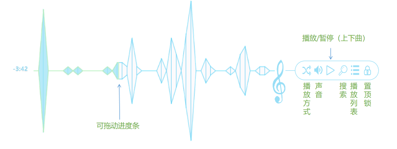
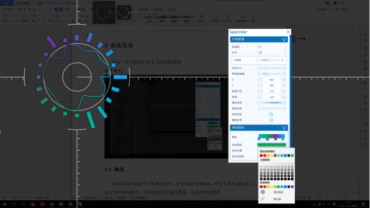
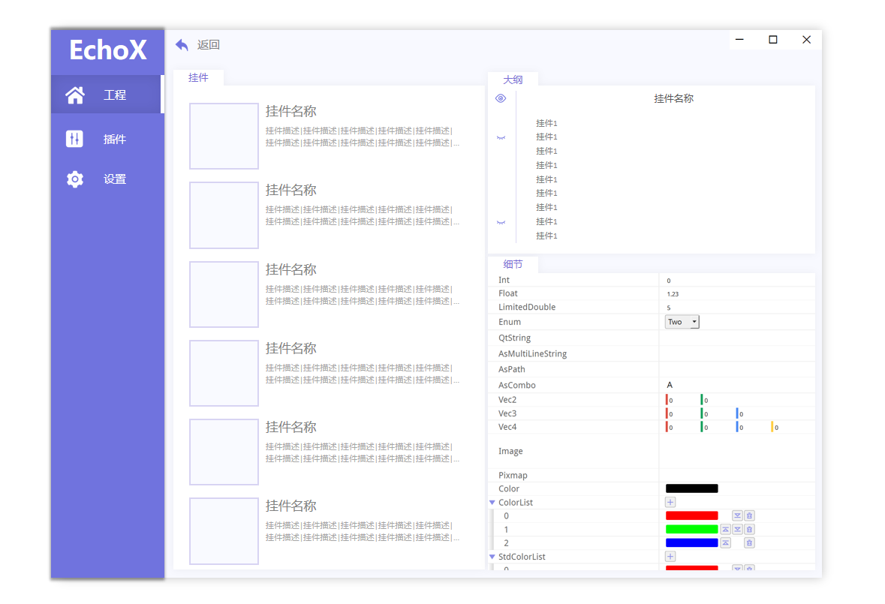
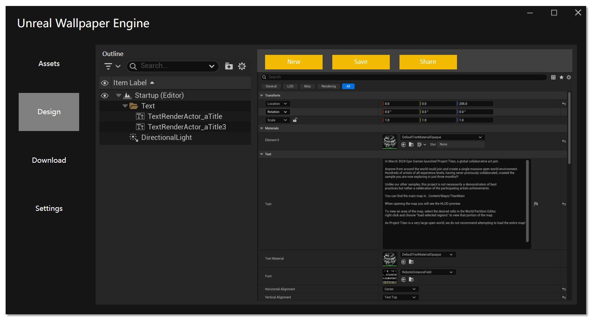

# Cosmos 개발 로그 - 기원

개발자에게 사용자의 칭찬을 받는 제품을 만드는 것은 꿈이자 임무다.

그러나 제품 간의 규모에도 차이가 있으며, 목표가 거대한 상업 지도나 복잡한 기술 아키텍처에 닿을 때 개인 개발자의 미미한 힘으로는 거대한 나무를 흔드는 개미와 다를 바 없다.

프로젝트 규모가 지수적으로 확장됨에 따라 생산성을 높이기 위해 다량의 인력을 쌓아야 했고, 이 거대한 산업용 조립 라인에서 각 참여자는 정밀 기기의 표준화된 부품으로 이기화되어 프로세스의 기어 맞물림 속에서 창작의 자율성을 잃고 요구사항 반복과 KPI 평가에 깊숙이 휘둘리며 점차 디지털 홍수 속의 차가운 통계 단위로 전락한다.

예를 들어 UP(업로더)을 보면, 최근 작업 내용은 주로 파이프라인(큰 구덩이 파기)과 최적화(뒷처리)에는 집중했는데, 이는 상대적으로 핵심적인 책임이지만 부인할 수 없는 사실은 이로 인해 UP이 제품 콘텐츠와 사용자 경험을 추구하는 초심에서 점점 멀어지고 있을 뿐만 아니라 처음 기술을 배웠을 때의 동기력을 서서히 잃고 있다는 것이다.

## 개인 프로젝트 역사

UP이 학생 시절 Specinker를 개발했던 시기는 학습 동기가 가장 높았던 시기였는데, 그때는 디자인 도면과 PPT를 열심히 만들고 조금씩 반복하며 조금씩 발전했고, 이 과정에서不少의 사용자를 얻기도 했다:

### Version 1.0 — 2018-09-10

이것은 UP이 학습 초기阶段로, 제작 목적은 간단했고 목표를 너무 거대하게 정하지 않았으며 스펙트럼 표시 기능이 있는 미니 플레이어 하나만 원했다.

### Version 2.0 — 2019-05-17

### Version 3.0 — 2019-12-31

### Version 4.0 — 2021-03-21

### EchoX — 2023-07-06

### Unreal Wallpaper Engine — 2025-03-21

## 위치

이런 배경下, 수많은 선택을 거쳐 UP은 결심하고 현재 인생阶段에서 마지막으로 긴 '자유 시간'을 확보해 독립적인 '작품' —— **Cosmos**를 만들기로 했다.

- Cosmos는 언리얼 엔진 기반의 메타버스 데모 Demo다.

효과层面에서 UP은 최대한 화려한 사용자 경험으로 반복 개발할 것이다.

기술层面에서 Cosmos의 기술体系는 반드시 매우 강력할 것이다.

, 이는 UP의 많은 기대를 담고 있다.

UP의 많은 기대를 담고 있지만 먼저 사과해야 할 것은 Cosmos가 Specinker의 계승이 아니라는 점이다. 이를 포기한 이유도 직관적이다:

- 오디오 시각화는 이미 신선한 것도 아니다. UP이 개발을 시작했을 때, 전문 소프트웨어의 스펙트럼 시각화를 제외하면 사용자层面에서는 대부분 Rainmeter를 사용했지만 이는 너무 오래되고 한계가 많아 UP이 Specinker를 개발하기로 선택한 이유 —— 재미있고 도전적이었다. 하지만 현재에는 오디오와 연결된 곳이라면 어디서나 스펙트럼을 볼 수 있는데, 예를 들어 일부 플레이어에 스펙트럼이 추가되었고 Steam에도 스펙트럼 도구가 많이 생겼으며 심지어 더 좋고 화려하게 만들었다.

이렇게 많은 잡담을 했으니 0.0, 이 새로운 작품의 대략적인 위치를 간단히 말해보자:

- 다음과 같은 태그를 가질 수 있다:
    - 서드 퍼슨
    - 우주
    - 오픈 월드
    - AI Agent