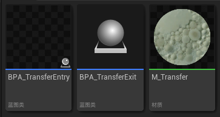
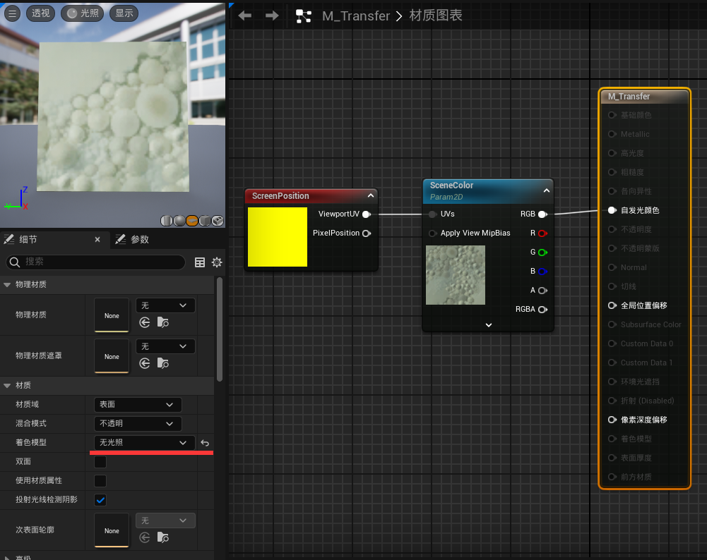
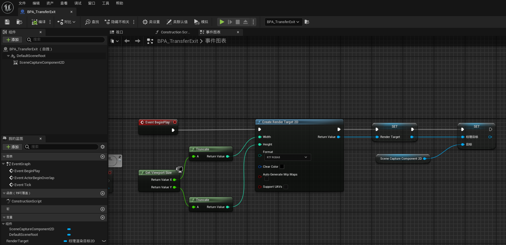
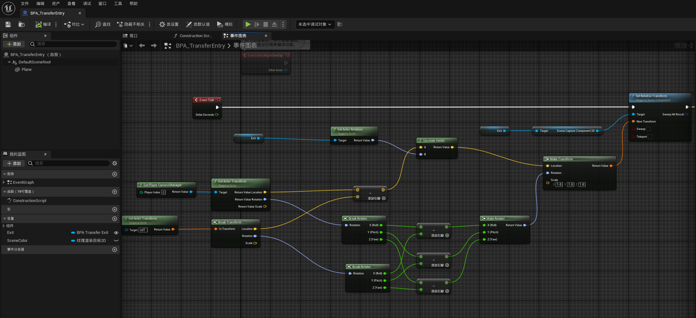
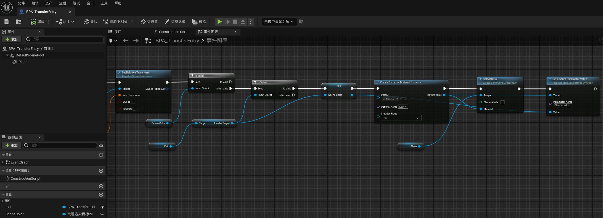
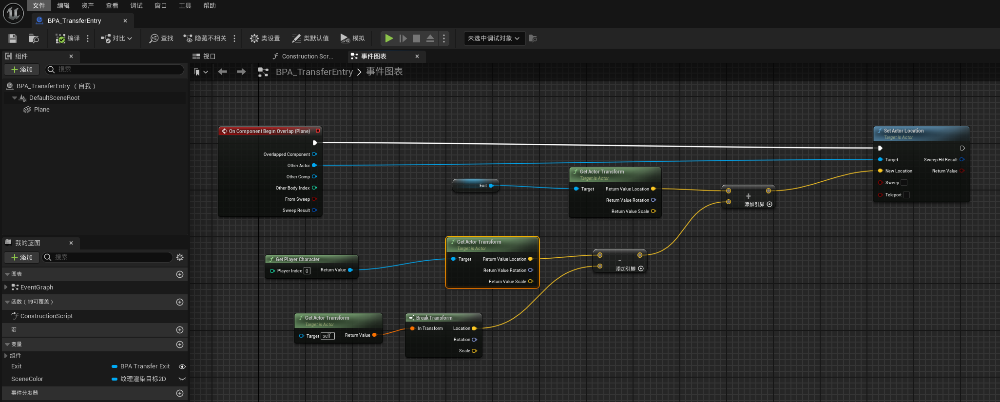
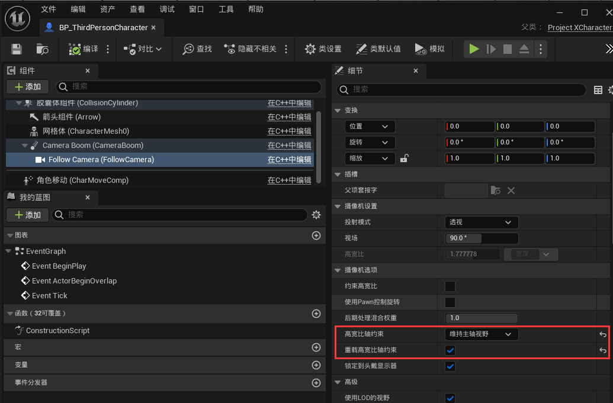

# 포탈 효과

## 데모

## 원리

- 입구 포인트와 출구 포인트 블루프린트 Actor를 제작합니다. 출구 포인트 블루프린트에는 `Scene Capture 2D Component`가 포함되어 있으며, 그 시점 매개변수가 플레이어 카메라 매개변수와 완전히 일치해야 합니다. 또한 플레이어 카메라와 입구 포인트의 상대 위치에 따라 `Scene Capture 2D Component`와 출구 포인트의 상대 위치를 동기화합니다 (빨간색 작은 사각형이 Scene Capture Component에 해당합니다):

    

- 캡처된 RT를 Screen UV와 결합하여 입구 평면에 표시합니다.

## 에셋

### M_Transfer

### BPA_TransferExit

변수:

- RenderTarget: 타입은 **Texture Render Target 2D**로, 캡처된 RT를 저장합니다.

### BPA_TransferEntry

변수:

- Exit: 타입은 **BPA_TransferExit**로, 인스턴스 편집 가능 옵션을 체크해야 합니다.
- SceneColor: 타입은 **Texture Render Target 2D**로, 출구 블루프린트에서 가져온 RT를 저장합니다.

캡처 컴포넌트 위치 동기화:

출구 블루프린트의 RT가 생성되었는지 확인하고, 입구 블루프린트의 플레이트에 동적 머티리얼을 생성하여 텍스처 매개변수를 전달합니다:

이동 로직:

## 사용 방법

씬에 `BPA_TransferEntry`와 `BPA_TransferExit`을 각각 배치하고, BPA_TransferEntry의 디테일 패널에서 해당 출구 블루프린트를 지정하면 정상적으로 사용할 수 있습니다.

## 주의 사항

- Scene Capture에는 안티 앨리어싱이 없습니다.
- 일부 광원 기능은 플레이어 시점 기반이므로, 출구 화면에 이상이 발생할 수 있습니다.
- 레벨 스트리밍 로직은 직접 구성해야 합니다.
- 시점 동기화와 렌더링의 라이프사이클을 최적화해야 합니다.
- 플레이어 카메라 컴포넌트에는 일반적으로 `Aspect Ratio Constraint`가 설정되어 있으며, 보통 프로젝트 설정의 `Maintain XFOV`를 따르지만, Scene Capture Component 내부 기본 설정은 `Maintain Aspect Ratio`입니다. 이 매개변수가 일치하지 않으면 화면이 동기화되지 않으며, Scene Component는 이 매개변수를 노출하지 않으므로 동기화하려면 직접 파생 클래스를 만들어 오버라이드해야 합니다.

