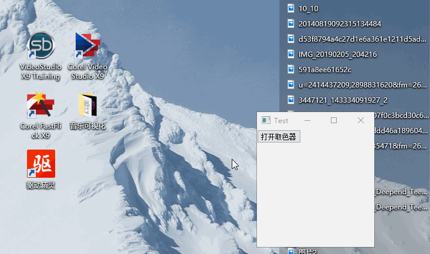

# Qt 화면 색상 선택기

- 주소：https://github.com/Italink/ColorPicker.git



## 프로그램 세부 사항

자동으로 확대경 표시 위치 조절

자동으로 테두리 색상 전환

## 원리

- 먼저 전체 화면에 높은 투명도의 테두리 없는 창을 덮습니다 (여기서는 색상이 (255, 255, 255)이고 투명도가 1 (【0,255】)인 것을 사용했습니다).

- 타이머 또는 스레드를 통해 마우스 위치를 실시간으로 업데이트합니다. 마우스 이동 이벤트를 사용하지 않는 것이 중요합니다. 마우스 이동을 통해 색상 선택을 트리거하면 동적 비디오에 대한 색상 선택이 불가능합니다.
- 스크린샷 함수를 통해 전체 창에 대한 스크린샷을 촬영합니다. 여기서 마우스를 중심으로 한 직사각형 영역을 선택하는데, 저는 10*7 크기를 선택했고 확대경은 100*70이므로 확대 배율은 10입니다. 이 부분 직사각형 그래픽을 확대경에 배치하고 마우스가 위치한 픽셀의 색상을 선택합니다.
- 선택된 픽셀 색상은 투명 창으로 인해 편차가 발생하므로 투명도 알고리즘에 따라 원래 색상을 복원해야 합니다.
- 투명 원리: B를 투명색, a를 투명도, A를 하단 색상, C를 최종 표시 색상으로 가정하면 255*C=a*B+(255-a)*A입니다.
- 공식에 따라 A를 구하기만 하면 복원할 수 있습니다.
- 마우스를 클릭하면 투명 창이 닫히고 색상 신호가 전송됩니다.

## 사용 설명

클래스 파일만 가져오면 원하는 창에서 ColorPicker 인스턴스를 생성할 수 있습니다. QWidget을 상속받았으므로 show 함수를 호출하여 표시합니다.

connect 신호量 void QColorPicker::colorSelect(const QColor&) 를 통해 선택된 색상을 가져올 수 있습니다.

연결 아이콘 파일을 가져오는 것을 주의하세요. 그렇지 않으면 정확한 색상 선택이 불가능할 수 있습니다.

## 구성 설명

mousedropper.cpp에 위치합니다.

``` c++
const QSize winSize(100,100);       //창 크기
const int grabInterval=50;          //새로 고침 빈도
const int magnificationTimes=10;    //확대 배율
const double split=0.7;             //분할
const int sizeOfMouseIcon=20;       //마우스 아이콘 크기 아이콘 자료:
```